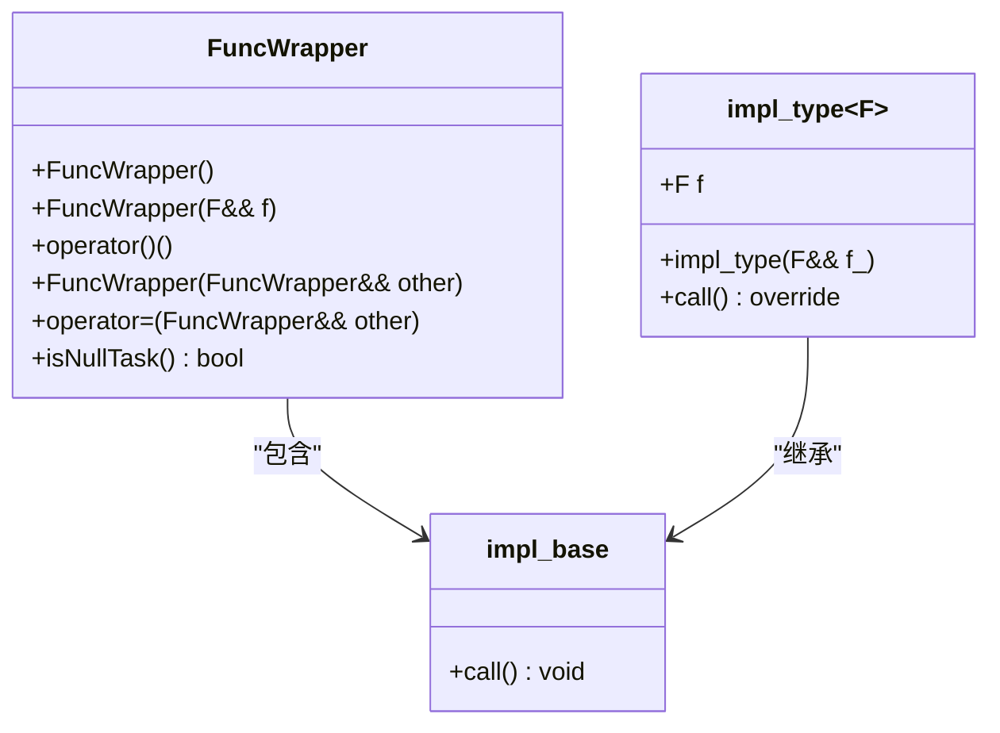
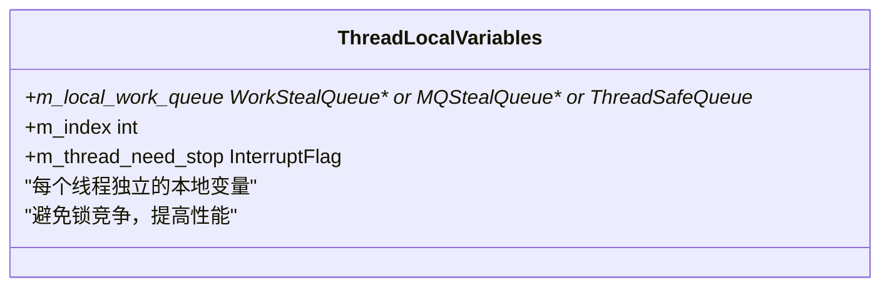
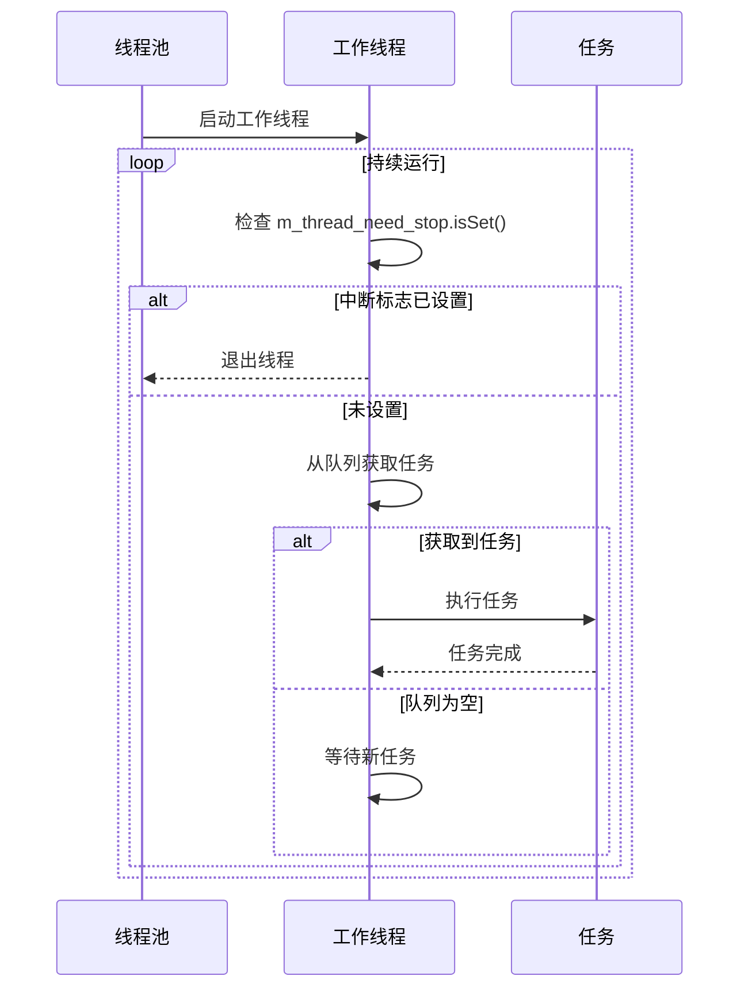
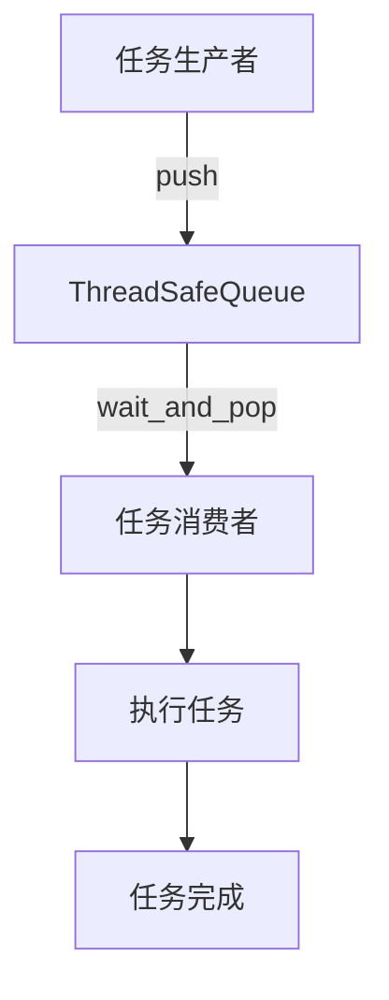
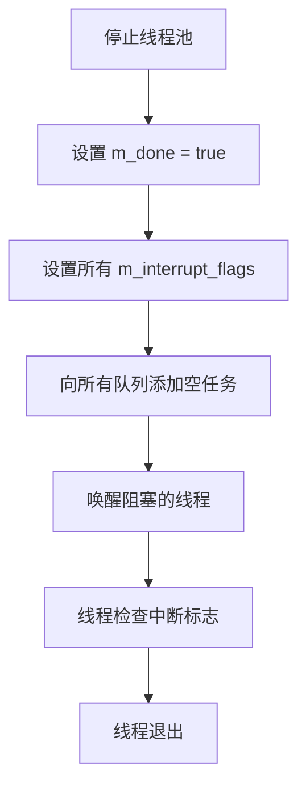

# 底层线程原语使用指南

<cite>
**本文档引用的文件**  
- [thread.h](file://hikyuu_cpp/hikyuu/utilities/thread/thread.h)
- [GlobalThreadPool.h](file://hikyuu_cpp/hikyuu/utilities/thread/GlobalThreadPool.h)
- [GlobalStealThreadPool.h](file://hikyuu_cpp/hikyuu/utilities/thread/GlobalStealThreadPool.h)
- [GlobalMQThreadPool.h](file://hikyuu_cpp/hikyuu/utilities/thread/GlobalMQThreadPool.h)
- [GlobalMQStealThreadPool.h](file://hikyuu_cpp/hikyuu/utilities/thread/GlobalMQStealThreadPool.h)
- [ThreadPool.h](file://hikyuu_cpp/hikyuu/utilities/thread/ThreadPool.h)
- [MQThreadPool.h](file://hikyuu_cpp/hikyuu/utilities/thread/MQThreadPool.h)
- [ThreadSafeQueue.h](file://hikyuu_cpp/hikyuu/utilities/thread/ThreadSafeQueue.h)
- [InterruptFlag.h](file://hikyuu_cpp/hikyuu/utilities/thread/InterruptFlag.h)
- [FuncWrapper.h](file://hikyuu_cpp/hikyuu/utilities/thread/FuncWrapper.h)
- [WorkStealQueue.h](file://hikyuu_cpp/hikyuu/utilities/thread/WorkStealQueue.h)
- [MQStealQueue.h](file://hikyuu_cpp/hikyuu/utilities/thread/MQStealQueue.h)
- [algorithm.h](file://hikyuu_cpp/hikyuu/utilities/thread/algorithm.h)
</cite>

## 目录
1. [引言](#引言)
2. [线程接口封装概述](#线程接口封装概述)
3. [核心组件分析](#核心组件分析)
4. [线程池架构设计](#线程池架构设计)
5. [线程本地存储与中断机制](#线程本地存储与中断机制)
6. [协同使用模式](#协同使用模式)
7. [使用示例](#使用示例)
8. [最佳实践与注意事项](#最佳实践与注意事项)
9. [总结](#总结)

## 引言
本指南旨在详细介绍 `thread.h` 头文件中封装的底层线程操作接口，包括线程创建、属性设置、优先级调整及线程本地存储（TLS）等功能。通过分析这些C++标准线程接口的封装目的与扩展特性，帮助开发者在框架扩展中正确使用这些原语进行底层并发控制，并强调与 `ThreadSafeQueue` 和 `InterruptFlag` 的协同使用模式，确保线程生命周期管理的安全性。

## 线程接口封装概述
`thread.h` 头文件作为线程相关功能的总入口，包含了多个线程池和并发控制组件的声明。该头文件通过引入一系列辅助头文件，构建了一个完整的多线程编程框架，支持不同场景下的并发需求。

**Section sources**
- [thread.h](file://hikyuu_cpp/hikyuu/utilities/thread/thread.h)

## 核心组件分析

### 线程安全队列
`ThreadSafeQueue` 是一个模板化的线程安全队列实现，为多线程环境下的任务调度提供了基础支持。该队列使用互斥锁和条件变量确保线程安全，支持阻塞和非阻塞的入队出队操作。

```mermaid
classDiagram
class ThreadSafeQueue~T~ {
+ThreadSafeQueue()
+push(T&& item)
+wait_and_pop(T& value)
+wait_and_pop() std : : shared_ptr~T~
+try_pop(T& value) bool
+try_pop() std : : shared_ptr~T~
+empty() bool
+size() size_t
+clear()
+notify_all()
}
ThreadSafeQueue~T~ : mutable std : : mutex m_mutex
ThreadSafeQueue~T~ : std : : queue~T~ m_queue
ThreadSafeQueue~T~ : std : : condition_variable m_cond
```

**Diagram sources**
- [ThreadSafeQueue.h](file://hikyuu_cpp/hikyuu/utilities/thread/ThreadSafeQueue.h)

### 任务包装器
`FuncWrapper` 类用于包装各种可调用对象（函数、函数对象、lambda表达式等），使其能够通过统一的接口在多线程环境中执行。该类使用类型擦除技术，通过基类指针存储具体实现。



**Diagram sources**
- [FuncWrapper.h](file://hikyuu_cpp/hikyuu/utilities/thread/FuncWrapper.h)

### 中断标志
`InterruptFlag` 类提供了一种线程中断机制，使用原子布尔值实现线程间的状态通知。该类支持拷贝构造和赋值操作，并提供了布尔转换运算符，便于在条件判断中使用。

```mermaid
classDiagram
class InterruptFlag {
+InterruptFlag()
+InterruptFlag(bool initial)
+operator=(const InterruptFlag& other)
+operator bool() const
+set()
+isSet() bool
}
InterruptFlag : std : : atomic_bool m_flag
```

**Diagram sources**
- [InterruptFlag.h](file://hikyuu_cpp/hikyuu/utilities/thread/InterruptFlag.h)

## 线程池架构设计

### 集中式线程池
`GlobalThreadPool` 实现了一个集中式任务队列线程池，所有工作线程共享一个主任务队列。这种设计适用于任务之间彼此独立、不需要互相等待的场景。

```mermaid
classDiagram
class GlobalThreadPool {
+GlobalThreadPool()
+GlobalThreadPool(size_t n, bool until_empty)
+~GlobalThreadPool()
+worker_num() size_t
+submit(FunctionType f) auto
+done() bool
+remain_task_count() size_t
+stop()
+join()
}
GlobalThreadPool : std : : atomic_bool m_done
GlobalThreadPool : size_t m_worker_num
GlobalThreadPool : bool m_running_until_empty
GlobalThreadPool : ThreadSafeQueue~task_type~ m_master_work_queue
GlobalThreadPool : std : : vector~std : : thread~ m_threads
GlobalThreadPool : std : : vector~InterruptFlag*~ m_interrupt_flags
GlobalThreadPool : static thread_local InterruptFlag m_thread_need_stop
```

**Diagram sources**
- [GlobalThreadPool.h](file://hikyuu_cpp/hikyuu/utilities/thread/GlobalThreadPool.h)

### 工作窃取式线程池
`GlobalStealThreadPool` 实现了工作窃取算法，每个工作线程拥有自己的任务队列。当本地队列为空时，线程会尝试从其他线程的队列尾部"窃取"任务，这种设计特别适合存在递归任务创建的场景。

```mermaid
classDiagram
class GlobalStealThreadPool {
+GlobalStealThreadPool()
+GlobalStealThreadPool(size_t n, bool until_empty)
+~GlobalStealThreadPool()
+worker_num() size_t
+submit(FunctionType f) auto
+done() bool
+remain_task_count() size_t
+stop()
+join()
}
class WorkStealQueue {
+push_front(data_type&& data)
+push_back(data_type&& data)
+try_pop(data_type& res) bool
+try_steal(data_type& res) bool
+empty() bool
}
GlobalStealThreadPool : std : : atomic_bool m_done
GlobalStealThreadPool : size_t m_worker_num
GlobalStealThreadPool : bool m_running_until_empty
GlobalStealThreadPool : ThreadSafeQueue~task_type~ m_master_work_queue
GlobalStealThreadPool : std : : vector~std : : unique_ptr~WorkStealQueue~~ m_queues
GlobalStealThreadPool : std : : vector~std : : thread~ m_threads
GlobalStealThreadPool : static thread_local WorkStealQueue* m_local_work_queue
GlobalStealThreadPool : static thread_local int m_index
GlobalStealThreadPool : static thread_local InterruptFlag m_thread_need_stop
GlobalStealThreadPool --> WorkStealQueue : "使用"
```

**Diagram sources**
- [GlobalStealThreadPool.h](file://hikyuu_cpp/hikyuu/utilities/thread/GlobalStealThreadPool.h)
- [WorkStealQueue.h](file://hikyuu_cpp/hikyuu/utilities/thread/WorkStealQueue.h)

### 多队列线程池
`GlobalMQThreadPool` 和 `GlobalMQStealThreadPool` 实现了多队列线程池，每个工作线程拥有独立的任务队列。任务提交时会根据负载均衡策略选择最合适的队列，提高了并发性能。

```mermaid
classDiagram
class GlobalMQThreadPool {
+GlobalMQThreadPool()
+GlobalMQThreadPool(size_t n, bool until_empty)
+~GlobalMQThreadPool()
+worker_num() size_t
+submit(FunctionType f) auto
+done() bool
+remain_task_count() size_t
+stop()
+join()
}
class GlobalMQStealThreadPool {
+GlobalMQStealThreadPool()
+GlobalMQStealThreadPool(size_t n, bool until_empty)
+~GlobalMQStealThreadPool()
+worker_num() size_t
+submit(FunctionType f) auto
+done() bool
+remain_task_count() size_t
+stop()
+join()
}
class MQStealQueue~T~ {
+push(T&& item)
+push_front(T&& data)
+try_pop(T& value) bool
+try_steal(T& res) bool
+wait_and_pop(T& value)
}
GlobalMQThreadPool : std : : atomic_bool m_done
GlobalMQThreadPool : size_t m_worker_num
GlobalMQThreadPool : bool m_runnging_until_empty
GlobalMQThreadPool : std : : vector~std : : unique_ptr~ThreadSafeQueue~task_type~~~~ m_queues
GlobalMQThreadPool : std : : vector~InterruptFlag*~ m_interrupt_flags
GlobalMQThreadPool : std : : vector~std : : thread~ m_threads
GlobalMQThreadPool : static thread_local ThreadSafeQueue~task_type~* m_local_work_queue
GlobalMQThreadPool : static thread_local InterruptFlag m_thread_need_stop
GlobalMQStealThreadPool : std : : atomic_bool m_done
GlobalMQStealThreadPool : size_t m_worker_num
GlobalMQStealThreadPool : bool m_runnging_until_empty
GlobalMQStealThreadPool : std : : vector~std : : unique_ptr~MQStealQueue~task_type~~~~ m_queues
GlobalMQStealThreadPool : std : : vector~InterruptFlag*~ m_interrupt_flags
GlobalMQStealThreadPool : std : : vector~std : : thread~ m_threads
GlobalMQStealThreadPool : static thread_local MQStealQueue~task_type~* m_local_work_queue
GlobalMQStealThreadPool : static thread_local int m_index
GlobalMQStealThreadPool : static thread_local InterruptFlag m_thread_need_stop
GlobalMQThreadPool --> ThreadSafeQueue : "使用"
GlobalMQStealThreadPool --> MQStealQueue~T~ : "使用"
```

**Diagram sources**
- [GlobalMQThreadPool.h](file://hikyuu_cpp/hikyuu/utilities/thread/GlobalMQThreadPool.h)
- [GlobalMQStealThreadPool.h](file://hikyuu_cpp/hikyuu/utilities/thread/GlobalMQStealThreadPool.h)
- [MQStealQueue.h](file://hikyuu_cpp/hikyuu/utilities/thread/MQStealQueue.h)

## 线程本地存储与中断机制

### 线程本地存储
线程池实现中广泛使用了 `thread_local` 关键字来创建线程本地变量，包括本地任务队列指针、线程索引和中断标志等。这种设计避免了频繁的锁竞争，提高了性能。



**Diagram sources**
- [GlobalStealThreadPool.h](file://hikyuu_cpp/hikyuu/utilities/thread/GlobalStealThreadPool.h)
- [GlobalMQThreadPool.h](file://hikyuu_cpp/hikyuu/utilities/thread/GlobalMQThreadPool.h)
- [GlobalMQStealThreadPool.h](file://hikyuu_cpp/hikyuu/utilities/thread/GlobalMQStealThreadPool.h)

### 中断机制
中断机制通过 `InterruptFlag` 类和线程本地变量的结合使用，实现了高效的线程终止通知。工作线程在执行任务前会检查中断标志，一旦收到中断信号就会停止运行。



**Diagram sources**
- [GlobalThreadPool.h](file://hikyuu_cpp/hikyuu/utilities/thread/GlobalThreadPool.h)
- [GlobalStealThreadPool.h](file://hikyuu_cpp/hikyuu/utilities/thread/GlobalStealThreadPool.h)

## 协同使用模式

### 与ThreadSafeQueue的协同
`ThreadSafeQueue` 作为基础组件，被各种线程池用作任务队列。它提供了线程安全的入队和出队操作，确保多线程环境下数据的一致性。



**Diagram sources**
- [ThreadSafeQueue.h](file://hikyuu_cpp/hikyuu/utilities/thread/ThreadSafeQueue.h)

### 与InterruptFlag的协同
`InterruptFlag` 与线程池的协同使用确保了线程生命周期的安全管理。当需要停止线程池时，会设置所有工作线程的中断标志，并向任务队列添加空任务以唤醒阻塞的线程。



**Diagram sources**
- [GlobalThreadPool.h](file://hikyuu_cpp/hikyuu/utilities/thread/GlobalThreadPool.h)
- [InterruptFlag.h](file://hikyuu_cpp/hikyuu/utilities/thread/InterruptFlag.h)

## 使用示例

### 基本线程池使用
```cpp
// 创建全局线程池，使用系统CPU核心数
GlobalThreadPool pool;

// 提交任务并获取future
auto future = pool.submit([]() {
    // 执行耗时操作
    return compute_result();
});

// 获取结果
auto result = future.get();
```

### 并行算法使用
```cpp
// 使用并行for循环
std::vector<int> data(1000);
parallel_for_index(0, data.size(), [&](size_t i) {
    data[i] = expensive_computation(i);
});
```

### 递归任务处理
```cpp
// 适合使用工作窃取线程池的递归场景
GlobalStealThreadPool steal_pool;

std::function<int(int)> fibonacci = [&](int n) -> int {
    if (n <= 1) return n;
    
    // 递归创建任务
    auto future1 = steal_pool.submit([&]() { return fibonacci(n-1); });
    auto future2 = steal_pool.submit([&]() { return fibonacci(n-2); });
    
    return future1.get() + future2.get();
};
```

**Section sources**
- [algorithm.h](file://hikyuu_cpp/hikyuu/utilities/thread/algorithm.h)
- [GlobalThreadPool.h](file://hikyuu_cpp/hikyuu/utilities/thread/GlobalThreadPool.h)
- [GlobalStealThreadPool.h](file://hikyuu_cpp/hikyuu/utilities/thread/GlobalStealThreadPool.h)

## 最佳实践与注意事项

### 选择合适的线程池
- **GlobalThreadPool**: 适用于任务独立、无递归创建任务的场景
- **GlobalStealThreadPool**: 适用于存在递归任务创建的场景
- **GlobalMQThreadPool**: 适用于需要负载均衡的多队列场景
- **GlobalMQStealThreadPool**: 适用于需要工作窃取的多队列场景

### 线程安全注意事项
1. 避免在任务中直接访问共享状态，应使用消息传递或同步机制
2. 注意死锁风险，避免循环等待
3. 合理设置线程数量，避免过度创建线程导致性能下降

### 性能优化建议
1. 尽量减少锁的使用范围和持有时间
2. 使用线程本地存储减少锁竞争
3. 合理选择任务粒度，避免任务过小导致调度开销过大

### 错误处理
1. 在任务中捕获异常，避免未处理异常导致线程终止
2. 使用future的异常传播机制进行错误处理
3. 监控线程池状态，及时发现和处理异常情况

**Section sources**
- [GlobalThreadPool.h](file://hikyuu_cpp/hikyuu/utilities/thread/GlobalThreadPool.h)
- [GlobalStealThreadPool.h](file://hikyuu_cpp/hikyuu/utilities/thread/GlobalStealThreadPool.h)
- [GlobalMQThreadPool.h](file://hikyuu_cpp/hikyuu/utilities/thread/GlobalMQThreadPool.h)
- [GlobalMQStealThreadPool.h](file://hikyuu_cpp/hikyuu/utilities/thread/GlobalMQStealThreadPool.h)

## 总结
`thread.h` 头文件及其相关组件提供了一套完整的底层线程操作接口，通过封装C++标准线程功能并扩展了工作窃取、负载均衡等高级特性，为框架的并发控制提供了坚实的基础。通过合理使用这些原语，并与 `ThreadSafeQueue` 和 `InterruptFlag` 协同工作，可以构建高效、安全的多线程应用程序。开发者应根据具体场景选择合适的线程池类型，并遵循最佳实践，确保线程生命周期管理的安全性和性能优化。