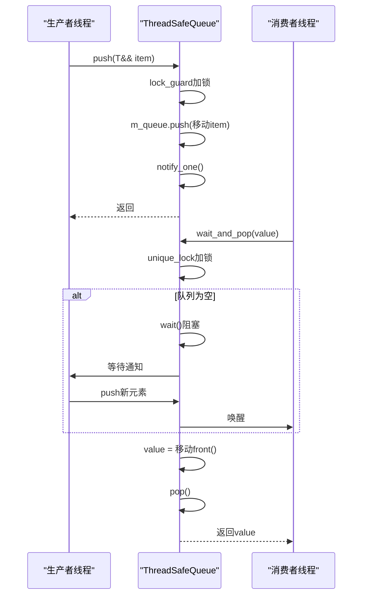
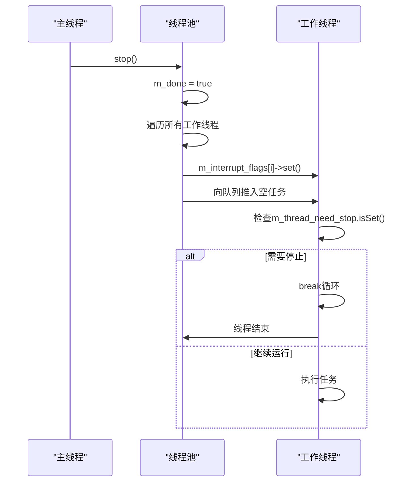
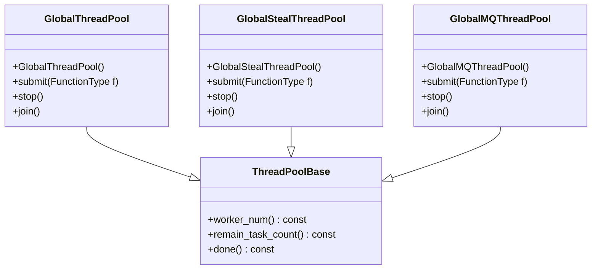
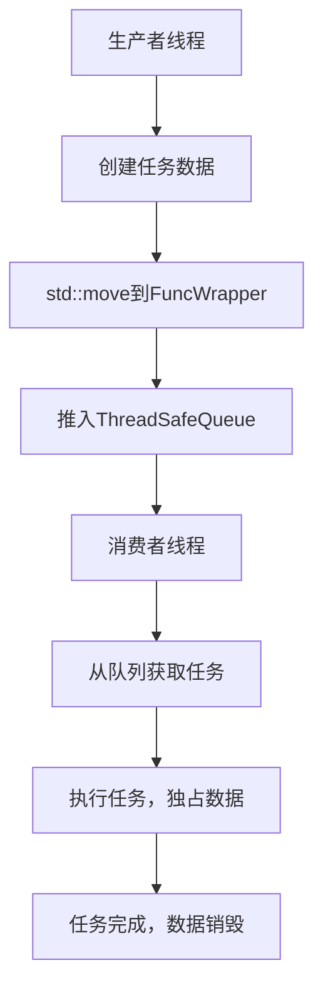
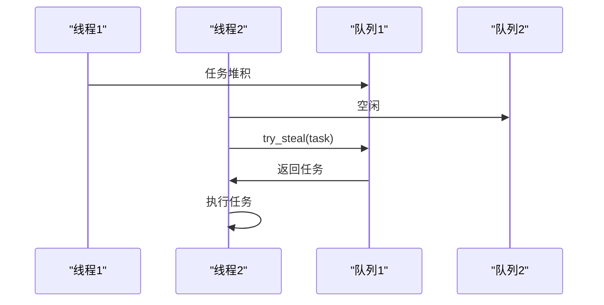
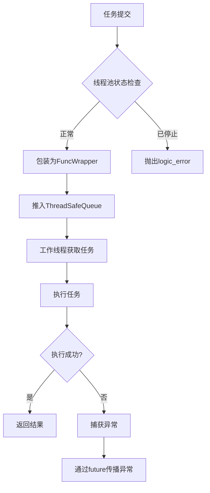

# 线程安全与同步机制

<cite>
**本文档引用的文件**  
- [ThreadSafeQueue.h](file://hikyuu_cpp/hikyuu/utilities/thread/ThreadSafeQueue.h)
- [InterruptFlag.h](file://hikyuu_cpp/hikyuu/utilities/thread/InterruptFlag.h)
- [thread.h](file://hikyuu_cpp/hikyuu/utilities/thread/thread.h)
- [GlobalThreadPool.h](file://hikyuu_cpp/hikyuu/utilities/thread/GlobalThreadPool.h)
- [GlobalStealThreadPool.h](file://hikyuu_cpp/hikyuu/utilities/thread/GlobalStealThreadPool.h)
- [GlobalMQThreadPool.h](file://hikyuu_cpp/hikyuu/utilities/thread/GlobalMQThreadPool.h)
- [FuncWrapper.h](file://hikyuu_cpp/hikyuu/utilities/thread/FuncWrapper.h)
- [WorkStealQueue.h](file://hikyuu_cpp/hikyuu/utilities/thread/WorkStealQueue.h)
- [Strategy.h](file://hikyuu_cpp/hikyuu/strategy/Strategy.h)
</cite>

## 目录
1. [引言](#引言)
2. [ThreadSafeQueue线程安全队列](#threadsafequeue线程安全队列)
3. [InterruptFlag线程中断机制](#interruptflag线程中断机制)
4. [底层线程操作工具](#底层线程操作工具)
5. [策略开发中的并发问题规避](#策略开发中的并发问题规避)
6. [线程同步最佳实践](#线程同步最佳实践)
7. [高并发环境下的稳定性保障](#高并发环境下的稳定性保障)
8. [总结](#总结)

## 引言
Hikyuu框架在高并发环境下提供了完善的线程安全机制，确保策略开发和执行过程中的数据一致性和系统稳定性。本文档将深入分析框架中的线程安全实现方案，重点介绍ThreadSafeQueue的锁保护设计、InterruptFlag的线程安全中断机制，以及thread.h中提供的底层线程操作工具。通过这些机制，开发者可以在策略开发中有效避免数据竞争、死锁和活锁等并发问题，确保系统在高负载下的正确运行。

## ThreadSafeQueue线程安全队列

Hikyuu框架中的ThreadSafeQueue是一个基于互斥锁和条件变量实现的线程安全队列，为多线程环境下的任务调度和消息传递提供了可靠的基础。该队列通过标准库的std::mutex和std::condition_variable实现同步机制，确保在多线程访问时的数据一致性。

```mermaid
classDiagram
class ThreadSafeQueue {
+ThreadSafeQueue()
+push(T&& item)
+wait_and_pop(T& value)
+wait_and_pop() std : : shared_ptr~T~
+try_pop(T& value) bool
+try_pop() std : : shared_ptr~T~
+empty() const bool
+size() const size_t
+clear()
+notify_all()
}
class std : : queue {
+push()
+pop()
+front()
+empty()
+size()
}
ThreadSafeQueue --> std : : queue : "组合"
ThreadSafeQueue --> std : : mutex : "保护"
ThreadSafeQueue --> std : : condition_variable : "通知"
```

**图示来源**  
- [ThreadSafeQueue.h](file://hikyuu_cpp/hikyuu/utilities/thread/ThreadSafeQueue.h#L23-L105)

**本节来源**  
- [ThreadSafeQueue.h](file://hikyuu_cpp/hikyuu/utilities/thread/ThreadSafeQueue.h#L1-L106)

### 设计原理与实现细节
ThreadSafeQueue采用模板设计，支持任意类型的元素存储。其核心设计特点包括：

1. **锁保护机制**：使用std::lock_guard<std::mutex>在每个公共方法中自动加锁，确保操作的原子性。所有对内部std::queue的操作都在互斥锁的保护下进行，防止多个线程同时修改队列状态。

2. **条件变量通知**：当元素被推入队列时，通过m_cond.notify_one()唤醒一个等待的消费者线程；当需要等待队列非空时，使用m_cond.wait()阻塞线程直到条件满足。

3. **双重弹出接口**：提供wait_and_pop和try_pop两种弹出方式。wait_and_pop会阻塞直到队列中有元素可用，而try_pop则立即返回，成功时返回true，失败时返回false。

4. **智能指针支持**：除了直接传递值的wait_and_pop(T& value)外，还提供返回std::shared_ptr<T>的重载版本，避免了对象拷贝的开销。

5. **移动语义优化**：在push操作中使用std::move(item)将元素移动到队列中，减少不必要的拷贝操作，提高性能。

### 在框架中的应用
ThreadSafeQueue在Hikyuu框架中被广泛应用于各种线程池实现中，作为任务队列的核心数据结构。例如，在GlobalThreadPool中，所有工作线程共享一个主线程任务队列（m_master_work_queue），通过ThreadSafeQueue实现任务的分发和消费。



**图示来源**  
- [ThreadSafeQueue.h](file://hikyuu_cpp/hikyuu/utilities/thread/ThreadSafeQueue.h#L30-L42)
- [ThreadSafeQueue.h](file://hikyuu_cpp/hikyuu/utilities/thread/ThreadSafeQueue.h#L37-L42)

**本节来源**  
- [ThreadSafeQueue.h](file://hikyuu_cpp/hikyuu/utilities/thread/ThreadSafeQueue.h#L1-L106)

## InterruptFlag线程中断机制

InterruptFlag是Hikyuu框架中实现线程安全中断的核心组件，采用原子操作确保线程间通信的可靠性和高效性。与传统的信号量或互斥锁相比，InterruptFlag提供了更轻量级的线程状态管理机制。

```mermaid
classDiagram
class InterruptFlag {
+InterruptFlag()
+InterruptFlag(bool initial)
+operator bool() const
+set()
+isSet() const bool
}
class std : : atomic_bool {
+load()
+store()
+exchange()
}
InterruptFlag --> std : : atomic_bool : "组合"
```

**图示来源**  
- [InterruptFlag.h](file://hikyuu_cpp/hikyuu/utilities/thread/InterruptFlag.h#L13-L44)

**本节来源**  
- [InterruptFlag.h](file://hikyuu_cpp/hikyuu/utilities/thread/InterruptFlag.h#L1-L46)

### 设计原理与实现细节
InterruptFlag的设计基于std::atomic_bool，利用原子操作的特性实现无锁的线程状态管理：

1. **原子性保证**：内部使用std::atomic_bool m_flag存储中断状态，所有读写操作都是原子的，避免了传统互斥锁带来的性能开销。

2. **内存序优化**：在set()和isSet()操作中使用std::memory_order_relaxed内存序，因为中断标志的读写操作不需要严格的内存同步保证，这进一步提高了性能。

3. **隐式类型转换**：重载了bool类型转换操作符，使得InterruptFlag对象可以直接在条件判断中使用，提高了代码的可读性。

4. **线程本地存储**：在各种线程池实现中，InterruptFlag被声明为thread_local静态变量，每个线程都有自己的中断标志副本，避免了跨线程访问的冲突。

### 在框架中的应用
InterruptFlag在Hikyuu的线程池管理中扮演着关键角色，主要用于线程的优雅终止和运行状态监控：

1. **线程终止控制**：在线程循环中，通过检查m_thread_need_stop.isSet()来判断是否需要停止运行。当外部调用stop()方法时，会设置所有工作线程的中断标志，使线程能够安全退出。

2. **任务分发协调**：在任务提交时，首先检查中断标志，如果线程池已被标记为停止状态，则拒绝新的任务提交，防止资源泄漏。

3. **异常安全保证**：在构造函数中使用try-catch块捕获异常，如果初始化失败，会立即设置m_done标志并重新抛出异常，确保线程池处于一致状态。



**图示来源**  
- [GlobalThreadPool.h](file://hikyuu_cpp/hikyuu/utilities/thread/GlobalThreadPool.h#L124-L146)
- [GlobalThreadPool.h](file://hikyuu_cpp/hikyuu/utilities/thread/GlobalThreadPool.h#L198-L204)

**本节来源**  
- [InterruptFlag.h](file://hikyuu_cpp/hikyuu/utilities/thread/InterruptFlag.h#L1-L46)
- [GlobalThreadPool.h](file://hikyuu_cpp/hikyuu/utilities/thread/GlobalThreadPool.h#L1-L225)

## 底层线程操作工具

Hikyuu框架通过thread.h头文件提供了丰富的底层线程操作工具，这些工具构成了框架并发能力的基础。这些工具不仅包括基本的线程安全数据结构，还提供了高级的并行算法和任务调度机制。

### 线程池家族
框架提供了多种线程池实现，以适应不同的应用场景：

1. **GlobalThreadPool**：全局集中式任务队列线程池，所有工作线程共享一个任务队列，适用于任务之间彼此独立的场景。

2. **GlobalStealThreadPool**：分布式偷取式线程池，每个工作线程有自己的任务队列，支持任务偷取机制，特别适合递归任务创建的场景。

3. **GlobalMQThreadPool**：全局分布式线程池，采用多队列设计，任务被分配到最空闲的队列中，实现负载均衡。

4. **GlobalMQStealThreadPool**：结合了多队列和任务偷取机制的混合线程池，既保证了负载均衡，又支持高效的任务分发。



**图示来源**  
- [GlobalThreadPool.h](file://hikyuu_cpp/hikyuu/utilities/thread/GlobalThreadPool.h#L41-L44)
- [GlobalStealThreadPool.h](file://hikyuu_cpp/hikyuu/utilities/thread/GlobalStealThreadPool.h#L40-L42)
- [GlobalMQThreadPool.h](file://hikyuu_cpp/hikyuu/utilities/thread/GlobalMQThreadPool.h#L38-L40)

**本节来源**  
- [thread.h](file://hikyuu_cpp/hikyuu/utilities/thread/thread.h#L1-L15)
- [GlobalThreadPool.h](file://hikyuu_cpp/hikyuu/utilities/thread/GlobalThreadPool.h#L1-L225)
- [GlobalStealThreadPool.h](file://hikyuu_cpp/hikyuu/utilities/thread/GlobalStealThreadPool.h#L1-L311)
- [GlobalMQThreadPool.h](file://hikyuu_cpp/hikyuu/utilities/thread/GlobalMQThreadPool.h#L1-L271)

### 任务包装器FuncWrapper
FuncWrapper是Hikyuu框架中实现任务多态的关键组件，它允许线程池接受各种类型的可调用对象（函数、函数对象、lambda表达式等）。

```mermaid
classDiagram
class FuncWrapper {
+FuncWrapper()
+FuncWrapper(F&& f)
+operator()()
+FuncWrapper(FuncWrapper&&)
+operator=(FuncWrapper&&)
+isNullTask() const
}
class impl_base {
+call()
}
class impl_type~F~ {
+f F
+call()
}
FuncWrapper --> std : : unique_ptr~impl_base~ : "持有"
impl_type~F~ --|> impl_base : "继承"
```

**图示来源**  
- [FuncWrapper.h](file://hikyuu_cpp/hikyuu/utilities/thread/FuncWrapper.h#L27-L77)

**本节来源**  
- [FuncWrapper.h](file://hikyuu_cpp/hikyuu/utilities/thread/FuncWrapper.h#L1-L86)

FuncWrapper的设计采用了类型擦除模式：
- **基类接口**：定义了虚函数call()的抽象基类impl_base
- **模板实现**：为每种具体的可调用类型生成特化的impl_type<F>类
- **动态多态**：通过std::unique_ptr<impl_base>持有具体实现，实现运行时多态
- **移动语义**：支持移动构造和移动赋值，避免不必要的拷贝开销

## 策略开发中的并发问题规避

在策略开发中，正确使用Hikyuu框架提供的线程安全机制是避免并发问题的关键。以下是一些常见的并发问题及其规避方法：

### 数据竞争规避
数据竞争通常发生在多个线程同时读写共享数据时。Hikyuu通过以下方式避免数据竞争：

1. **线程安全队列**：使用ThreadSafeQueue作为线程间通信的唯一通道，所有共享数据的传递都通过队列进行。

2. **不可变数据**：在任务提交时，使用std::move将数据所有权转移给任务，确保原始数据不会被并发访问。

3. **线程本地存储**：利用thread_local关键字为每个线程提供独立的数据副本，避免共享状态。



**图示来源**  
- [ThreadSafeQueue.h](file://hikyuu_cpp/hikyuu/utilities/thread/ThreadSafeQueue.h#L30-L34)
- [FuncWrapper.h](file://hikyuu_cpp/hikyuu/utilities/thread/FuncWrapper.h#L37-L38)

**本节来源**  
- [ThreadSafeQueue.h](file://hikyuu_cpp/hikyuu/utilities/thread/ThreadSafeQueue.h#L1-L106)
- [FuncWrapper.h](file://hikyuu_cpp/hikyuu/utilities/thread/FuncWrapper.h#L1-L86)

### 死锁规避
死锁通常由循环等待资源引起。Hikyuu框架通过以下设计避免死锁：

1. **单一锁层次**：ThreadSafeQueue只使用一个互斥锁，避免了多锁导致的死锁风险。

2. **非阻塞操作**：提供try_pop等非阻塞接口，允许线程在无法获取资源时立即返回，而不是无限等待。

3. **超时机制**：虽然当前实现中未直接提供，但可以通过条件变量的wait_for方法实现超时等待。

### 活锁规避
活锁是指线程虽然没有被阻塞，但由于不断重试失败而无法取得进展。Hikyuu通过以下方式避免活锁：

1. **任务偷取机制**：在GlobalStealThreadPool中，空闲线程可以从其他线程的任务队列中"偷取"任务，避免了某些线程过度忙碌而其他线程空闲的情况。

2. **负载均衡**：在GlobalMQThreadPool中，新任务被分配到最空闲的队列中，实现了动态的负载均衡。



**图示来源**  
- [WorkStealQueue.h](file://hikyuu_cpp/hikyuu/utilities/thread/WorkStealQueue.h#L95-L105)
- [GlobalStealThreadPool.h](file://hikyuu_cpp/hikyuu/utilities/thread/GlobalStealThreadPool.h#L297-L305)

**本节来源**  
- [WorkStealQueue.h](file://hikyuu_cpp/hikyuu/utilities/thread/WorkStealQueue.h#L1-L105)
- [GlobalStealThreadPool.h](file://hikyuu_cpp/hikyuu/utilities/thread/GlobalStealThreadPool.h#L1-L311)

## 线程同步最佳实践

### 互斥锁的正确使用
在Hikyuu框架中，互斥锁的使用遵循以下最佳实践：

1. **RAII原则**：始终使用std::lock_guard或std::unique_lock等RAII包装器，确保锁的自动释放，避免因异常导致的死锁。

2. **最小化临界区**：尽量减少持有锁的时间，只在真正需要保护共享数据时才加锁。

3. **避免嵌套锁**：设计上避免需要同时持有多个锁的场景，防止死锁。

### 条件变量的正确使用
条件变量是实现线程间高效通信的关键：

1. **谓词检查**：总是使用while循环而不是if语句检查条件，防止虚假唤醒。

2. **原子通知**：在修改共享状态后立即发送通知，确保等待线程能够及时响应。

3. **避免丢失唤醒**：在可能的情况下，先发送通知再释放锁，防止在通知和释放锁之间发生上下文切换导致唤醒丢失。

### 原子操作的正确使用
原子操作提供了比互斥锁更轻量级的同步机制：

1. **选择合适的内存序**：根据实际需求选择适当的内存序，如std::memory_order_relaxed用于简单的标志位，std::memory_order_acquire/std::memory_order_release用于需要同步的场景。

2. **避免复杂的原子操作**：对于复杂的同步逻辑，优先使用互斥锁和条件变量，而不是复杂的原子操作组合。

3. **原子操作的局限性**：认识到原子操作只能保证单个操作的原子性，对于需要多个操作原子执行的场景，仍需使用互斥锁。

## 高并发环境下的稳定性保障

Hikyuu框架通过多层次的机制保障系统在高并发环境下的稳定性和正确性：

### 资源管理
1. **异常安全**：在构造函数中使用try-catch块捕获异常，确保在初始化失败时能够正确清理资源。

2. **RAII原则**：广泛使用智能指针和RAII包装器，确保资源的自动管理和释放。

3. **资源池**：通过连接池等机制复用昂贵的资源，减少资源创建和销毁的开销。

### 性能优化
1. **无锁设计**：在可能的情况下使用原子操作和无锁数据结构，减少锁竞争。

2. **缓存友好**：设计数据结构时考虑CPU缓存的局部性，提高访问效率。

3. **批处理**：通过批量处理任务减少线程切换和同步开销。

### 容错机制
1. **优雅终止**：提供stop()和join()方法，允许线程池在接收到终止信号后完成当前任务再退出。

2. **状态监控**：提供remain_task_count()等方法监控线程池状态，便于调试和性能分析。

3. **错误传播**：通过std::future机制将任务执行中的异常传播回调用者，便于错误处理。



**图示来源**  
- [GlobalThreadPool.h](file://hikyuu_cpp/hikyuu/utilities/thread/GlobalThreadPool.h#L97-L105)
- [ThreadSafeQueue.h](file://hikyuu_cpp/hikyuu/utilities/thread/ThreadSafeQueue.h#L30-L34)

**本节来源**  
- [GlobalThreadPool.h](file://hikyuu_cpp/hikyuu/utilities/thread/GlobalThreadPool.h#L1-L225)
- [ThreadSafeQueue.h](file://hikyuu_cpp/hikyuu/utilities/thread/ThreadSafeQueue.h#L1-L106)

## 总结
Hikyuu框架通过精心设计的线程安全机制，为量化策略开发提供了可靠的并发支持。ThreadSafeQueue的锁保护设计确保了任务队列的线程安全，InterruptFlag的原子操作实现了高效的线程中断，而丰富的线程池实现则满足了不同场景下的性能需求。通过遵循文档中介绍的最佳实践，开发者可以有效规避数据竞争、死锁和活锁等并发问题，确保策略在高并发环境下的稳定性和正确性。这些机制共同构成了Hikyuu框架强大并发能力的基础，为复杂量化策略的实现提供了坚实保障。