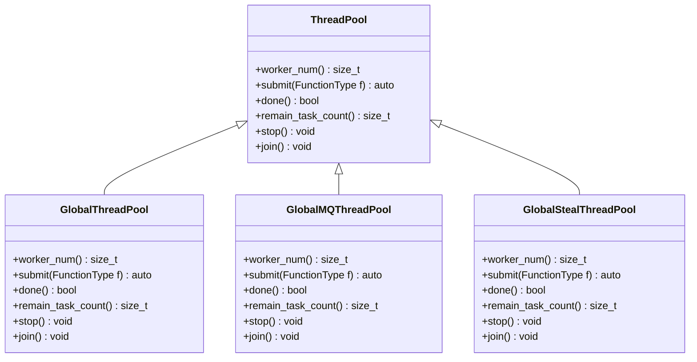
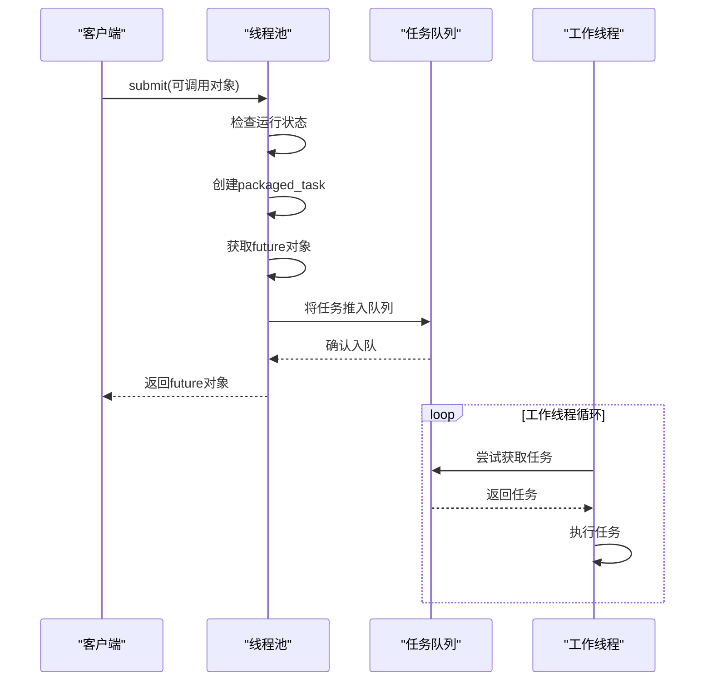
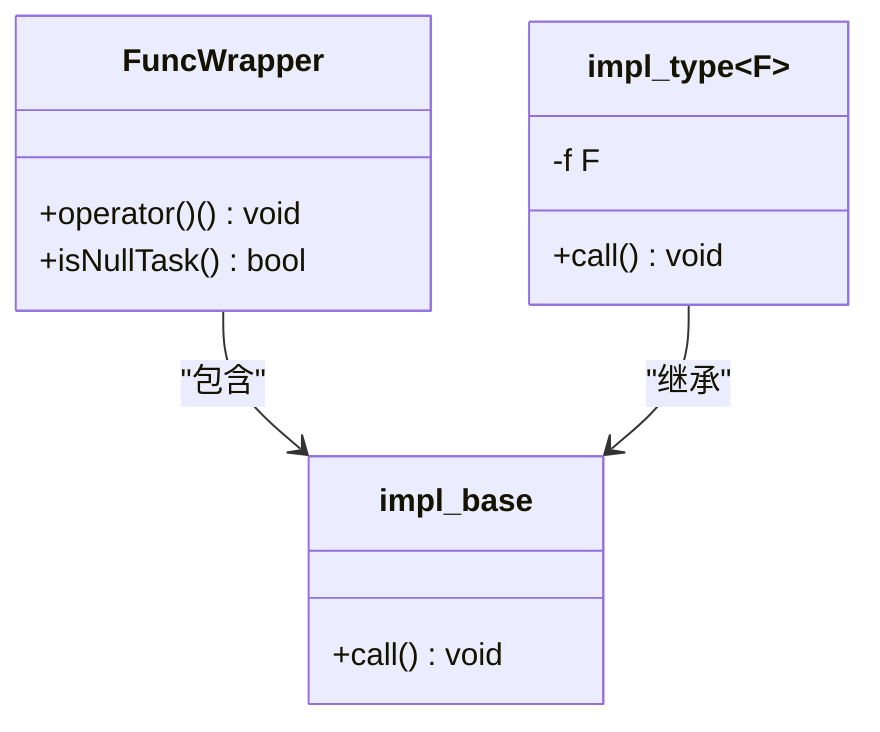
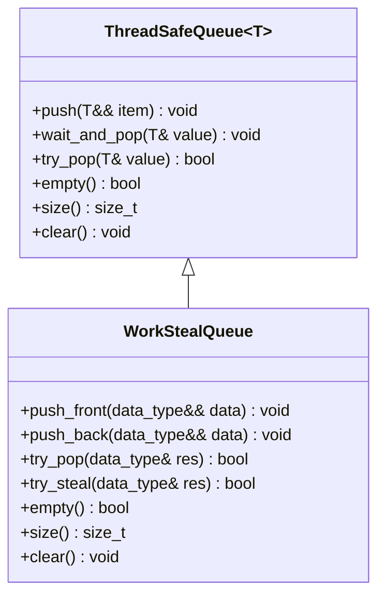
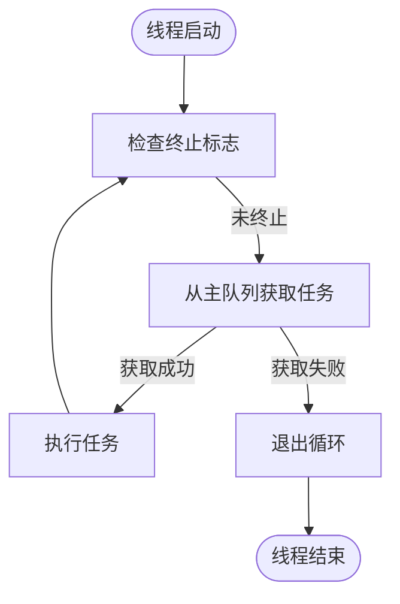
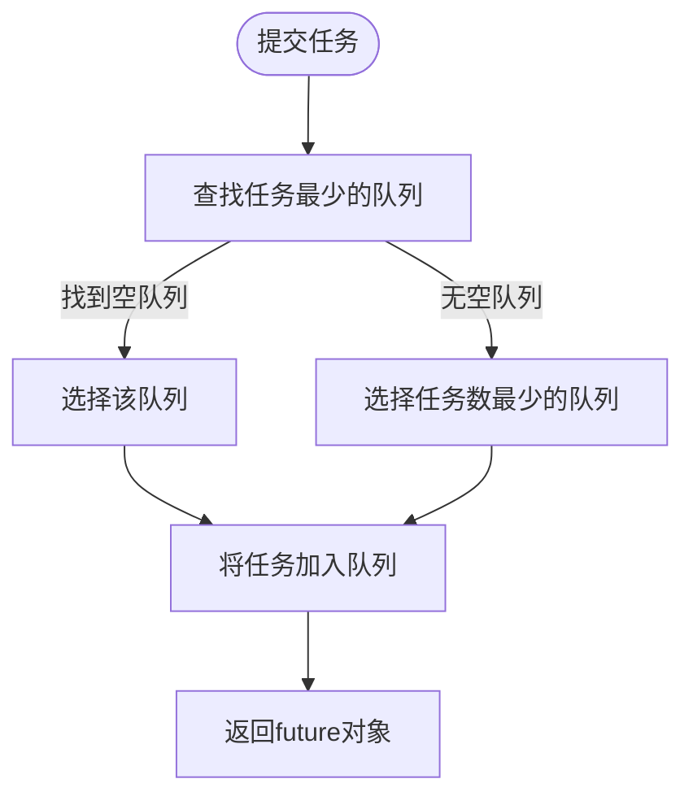
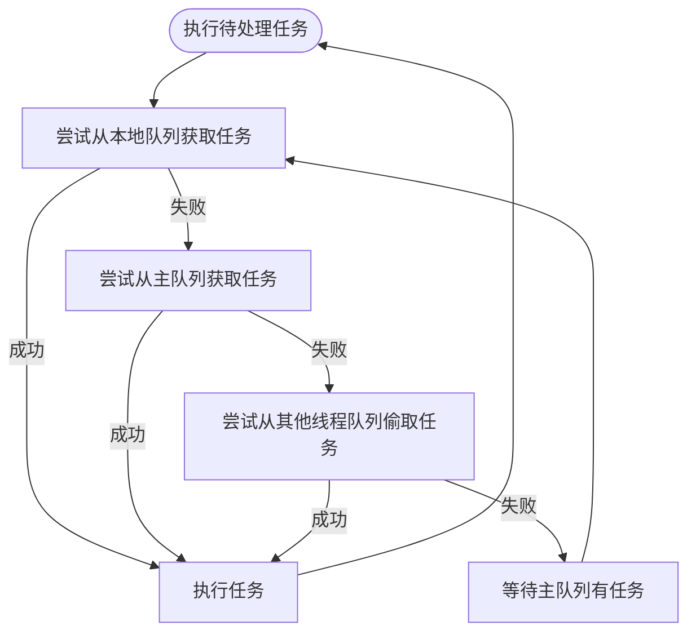
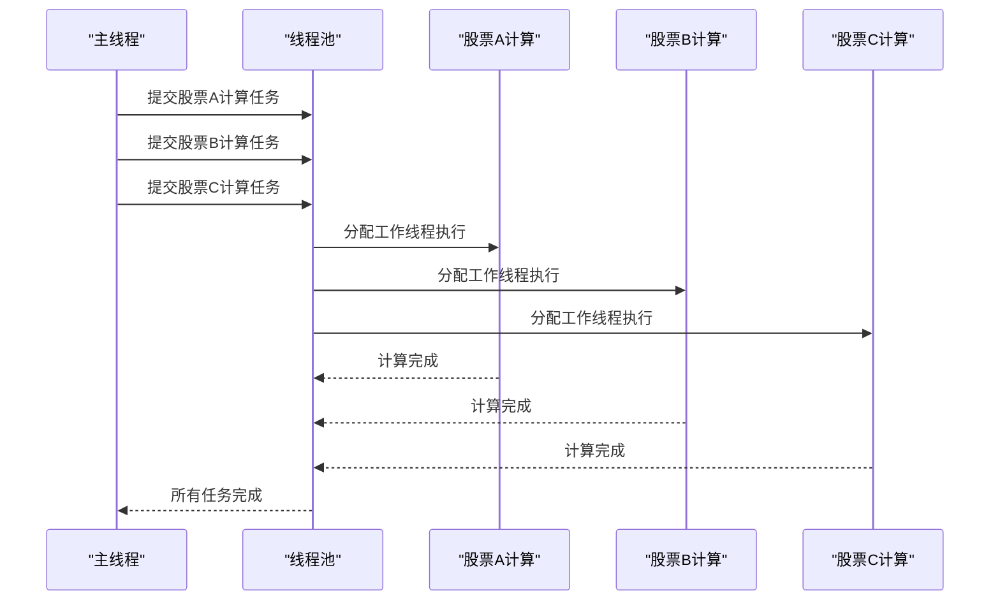

# 线程池使用

<cite>
**本文档引用的文件**
- [ThreadPool.h](file://hikyuu_cpp/hikyuu/utilities/thread/ThreadPool.h)
- [GlobalThreadPool.h](file://hikyuu_cpp/hikyuu/utilities/thread/GlobalThreadPool.h)
- [GlobalMQThreadPool.h](file://hikyuu_cpp/hikyuu/utilities/thread/GlobalMQThreadPool.h)
- [GlobalStealThreadPool.h](file://hikyuu_cpp/hikyuu/utilities/thread/GlobalStealThreadPool.h)
- [FuncWrapper.h](file://hikyuu_cpp/hikyuu/utilities/thread/FuncWrapper.h)
- [ThreadSafeQueue.h](file://hikyuu_cpp/hikyuu/utilities/thread/ThreadSafeQueue.h)
- [WorkStealQueue.h](file://hikyuu_cpp/hikyuu/utilities/thread/WorkStealQueue.h)
- [InterruptFlag.h](file://hikyuu_cpp/hikyuu/utilities/thread/InterruptFlag.h)
- [StockManager.cpp](file://hikyuu_cpp/hikyuu/StockManager.cpp)
- [combinate.cpp](file://hikyuu_cpp/hikyuu/analysis/combinate.cpp)
- [IndicatorImp.cpp](file://hikyuu_cpp/hikyuu/indicator/IndicatorImp.cpp)
</cite>

## 目录
1. [引言](#引言)
2. [线程池架构概述](#线程池架构概述)
3. [任务提交机制](#任务提交机制)
4. [任务封装与队列管理](#任务封装与队列管理)
5. [工作线程调度策略](#工作线程调度策略)
6. [量化回测中的并行处理应用](#量化回测中的并行处理应用)
7. [性能优化建议](#性能优化建议)
8. [结论](#结论)

## 引言

Hikyuu量化框架提供了多种线程池实现，用于支持高性能的并行计算。本文档深入讲解ThreadPool和GlobalThreadPool的任务提交机制，包括如何封装可调用对象、任务队列的管理以及工作线程的调度策略。通过实际代码示例展示如何向线程池提交异步任务，并获取执行结果。重点描述在量化回测中如何利用线程池并行处理多个股票的历史数据计算，提升整体性能。

**本节内容未直接分析具体源文件，因此不提供来源信息。**

## 线程池架构概述

Hikyuu框架提供了多种线程池实现，包括集中式任务队列和分布式任务队列两种架构。这些线程池都继承自统一的接口设计，但针对不同的使用场景进行了优化。



**图示来源**
- [ThreadPool.h](file://hikyuu_cpp/hikyuu/utilities/thread/ThreadPool.h#L37-L203)
- [GlobalThreadPool.h](file://hikyuu_cpp/hikyuu/utilities/thread/GlobalThreadPool.h#L40-L224)
- [GlobalMQThreadPool.h](file://hikyuu_cpp/hikyuu/utilities/thread/GlobalMQThreadPool.h#L37-L270)
- [GlobalStealThreadPool.h](file://hikyuu_cpp/hikyuu/utilities/thread/GlobalStealThreadPool.h#L39-L310)

**本节来源**
- [ThreadPool.h](file://hikyuu_cpp/hikyuu/utilities/thread/ThreadPool.h#L37-L203)
- [GlobalThreadPool.h](file://hikyuu_cpp/hikyuu/utilities/thread/GlobalThreadPool.h#L40-L224)
- [GlobalMQThreadPool.h](file://hikyuu_cpp/hikyuu/utilities/thread/GlobalMQThreadPool.h#L37-L270)
- [GlobalStealThreadPool.h](file://hikyuu_cpp/hikyuu/utilities/thread/GlobalStealThreadPool.h#L39-L310)

## 任务提交机制

线程池的核心功能是接收并执行异步任务。Hikyuu框架中的线程池通过submit方法接收可调用对象，并返回一个future对象用于获取执行结果。

### 任务提交流程

当调用submit方法时，线程池会执行以下步骤：
1. 检查线程池是否处于运行状态
2. 使用std::packaged_task包装可调用对象
3. 获取任务的返回类型并创建对应的future
4. 将包装后的任务放入任务队列



**图示来源**
- [ThreadPool.h](file://hikyuu_cpp/hikyuu/utilities/thread/ThreadPool.h#L86-L97)
- [GlobalThreadPool.h](file://hikyuu_cpp/hikyuu/utilities/thread/GlobalThreadPool.h#L94-L105)
- [GlobalMQThreadPool.h](file://hikyuu_cpp/hikyuu/utilities/thread/GlobalMQThreadPool.h#L104-L132)
- [GlobalStealThreadPool.h](file://hikyuu_cpp/hikyuu/utilities/thread/GlobalStealThreadPool.h#L108-L126)

**本节来源**
- [ThreadPool.h](file://hikyuu_cpp/hikyuu/utilities/thread/ThreadPool.h#L86-L97)
- [GlobalThreadPool.h](file://hikyuu_cpp/hikyuu/utilities/thread/GlobalThreadPool.h#L94-L105)
- [GlobalMQThreadPool.h](file://hikyuu_cpp/hikyuu/utilities/thread/GlobalMQThreadPool.h#L104-L132)
- [GlobalStealThreadPool.h](file://hikyuu_cpp/hikyuu/utilities/thread/GlobalStealThreadPool.h#L108-L126)

## 任务封装与队列管理

### 可调用对象封装

Hikyuu使用FuncWrapper类来统一包装各种可调用对象，包括函数指针、函数对象、lambda表达式等。这种设计实现了类型擦除，使得线程池可以接受任何可调用的对象。



**图示来源**
- [FuncWrapper.h](file://hikyuu_cpp/hikyuu/utilities/thread/FuncWrapper.h#L27-L77)

**本节来源**
- [FuncWrapper.h](file://hikyuu_cpp/hikyuu/utilities/thread/FuncWrapper.h#L27-L77)

### 任务队列管理

线程池使用线程安全队列来管理待执行的任务。根据不同的线程池类型，队列管理策略有所不同：

- **集中式队列**：所有工作线程共享一个全局任务队列
- **分布式队列**：每个工作线程拥有自己的任务队列
- **偷取式队列**：工作线程优先执行本地队列任务，空闲时从其他线程队列偷取任务



**图示来源**
- [ThreadSafeQueue.h](file://hikyuu_cpp/hikyuu/utilities/thread/ThreadSafeQueue.h#L24-L105)
- [WorkStealQueue.h](file://hikyuu_cpp/hikyuu/utilities/thread/WorkStealQueue.h#L23-L105)

**本节来源**
- [ThreadSafeQueue.h](file://hikyuu_cpp/hikyuu/utilities/thread/ThreadSafeQueue.h#L24-L105)
- [WorkStealQueue.h](file://hikyuu_cpp/hikyuu/utilities/thread/WorkStealQueue.h#L23-L105)

## 工作线程调度策略

### 集中式调度

集中式线程池（如ThreadPool和GlobalThreadPool）使用单一任务队列，所有工作线程从同一个队列中获取任务。这种策略简单高效，但在高并发场景下可能存在队列竞争。



**图示来源**
- [ThreadPool.h](file://hikyuu_cpp/hikyuu/utilities/thread/ThreadPool.h#L184-L192)
- [GlobalThreadPool.h](file://hikyuu_cpp/hikyuu/utilities/thread/GlobalThreadPool.h#L198-L214)

**本节来源**
- [ThreadPool.h](file://hikyuu_cpp/hikyuu/utilities/thread/ThreadPool.h#L184-L192)
- [GlobalThreadPool.h](file://hikyuu_cpp/hikyuu/utilities/thread/GlobalThreadPool.h#L198-L214)

### 分布式调度

分布式线程池（如GlobalMQThreadPool）为每个工作线程分配独立的任务队列。任务提交时会选择任务最少的队列，从而实现负载均衡。



**图示来源**
- [GlobalMQThreadPool.h](file://hikyuu_cpp/hikyuu/utilities/thread/GlobalMQThreadPool.h#L115-L129)

**本节来源**
- [GlobalMQThreadPool.h](file://hikyuu_cpp/hikyuu/utilities/thread/GlobalMQThreadPool.h#L115-L129)

### 偷取式调度

偷取式线程池（如GlobalStealThreadPool）结合了本地队列和全局队列的优势。工作线程优先执行本地队列的任务，当本地队列为空时，会尝试从其他线程的队列尾部"偷取"任务。



**图示来源**
- [GlobalStealThreadPool.h](file://hikyuu_cpp/hikyuu/utilities/thread/GlobalStealThreadPool.h#L264-L285)

**本节来源**
- [GlobalStealThreadPool.h](file://hikyuu_cpp/hikyuu/utilities/thread/GlobalStealThreadPool.h#L264-L285)

## 量化回测中的并行处理应用

### 股票数据并行计算

在量化回测中，线程池被广泛用于并行处理多个股票的历史数据计算。以Indicator计算为例，系统会将不同股票的计算任务分配给线程池并行执行。



**图示来源**
- [IndicatorImp.cpp](file://hikyuu_cpp/hikyuu/indicator/IndicatorImp.cpp#L1547)
- [combinate.cpp](file://hikyuu_cpp/hikyuu/analysis/combinate.cpp#L88)

**本节来源**
- [IndicatorImp.cpp](file://hikyuu_cpp/hikyuu/indicator/IndicatorImp.cpp#L1547)
- [combinate.cpp](file://hikyuu_cpp/hikyuu/analysis/combinate.cpp#L88)

### 实际代码示例

以下是线程池在Hikyuu框架中的实际使用示例：

```cpp
// 创建线程池，使用系统CPU核心数
ThreadPool tg(std::thread::hardware_concurrency());

// 提交多个异步任务
std::vector<std::future<void>> tasks;
for (const auto& stock : stock_list) {
    auto future = tg.submit([stock, &indicator] {
        // 计算单个股票的技术指标
        indicator.calculate(stock);
    });
    tasks.push_back(std::move(future));
}

// 等待所有任务完成
for (auto& task : tasks) {
    task.wait();
}
```

**本节来源**
- [StockManager.cpp](file://hikyuu_cpp/hikyuu/StockManager.cpp#L247-L250)
- [IndicatorImp.cpp](file://hikyuu_cpp/hikyuu/indicator/IndicatorImp.cpp#L1547)

## 性能优化建议

### 选择合适的线程池类型

根据应用场景选择合适的线程池类型：
- **普通计算任务**：使用ThreadPool或GlobalThreadPool
- **负载均衡要求高**：使用GlobalMQThreadPool
- **递归任务或任务创建任务**：使用GlobalStealThreadPool

### 合理设置线程数量

线程数量的设置应考虑以下因素：
- CPU核心数：通常设置为CPU核心数或稍多
- I/O等待：如果任务包含大量I/O操作，可以设置更多线程
- 内存消耗：每个线程都有栈空间开销，需考虑内存限制

### 避免任务粒度过小

任务粒度过小会导致线程调度开销过大，建议：
- 确保单个任务的执行时间远大于线程调度时间
- 对小任务进行批量处理
- 使用合适的任务分解策略

**本节内容未直接分析具体源文件，因此不提供来源信息。**

## 结论

Hikyuu框架的线程池系统提供了灵活高效的并行计算能力。通过深入理解ThreadPool和GlobalThreadPool的任务提交机制、任务封装方式、队列管理和调度策略，开发者可以充分利用多核处理器的计算能力，在量化回测等计算密集型场景中显著提升性能。在实际应用中，应根据具体需求选择合适的线程池类型和配置参数，以达到最佳的性能表现。

**本节内容未直接分析具体源文件，因此不提供来源信息。**