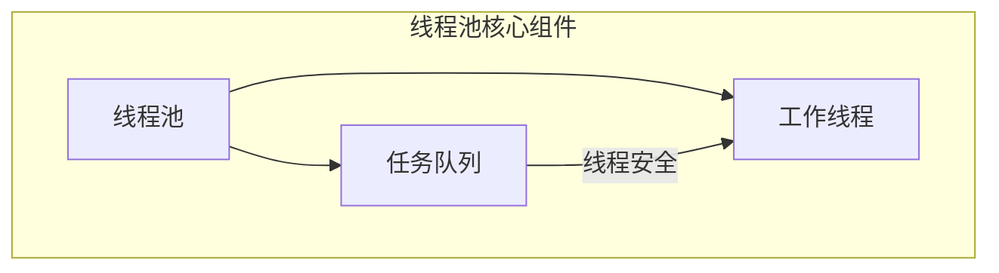
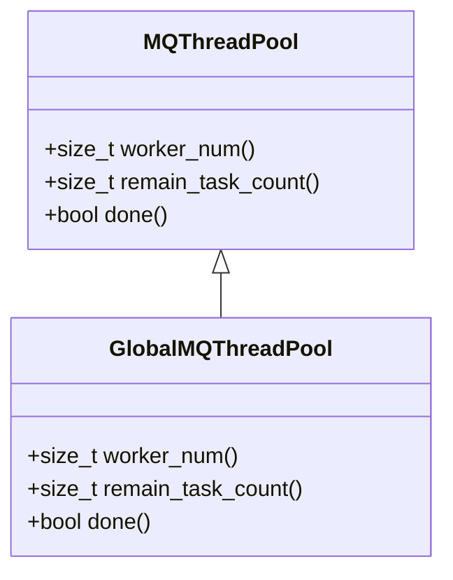
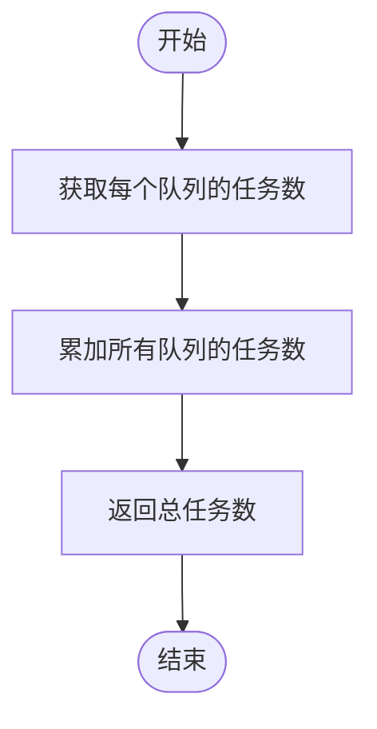
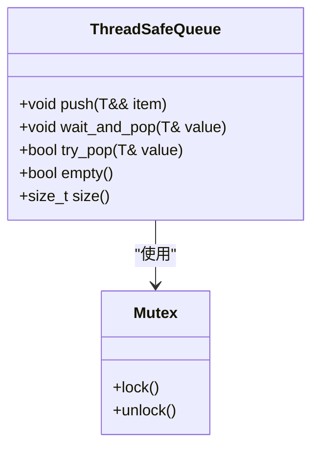
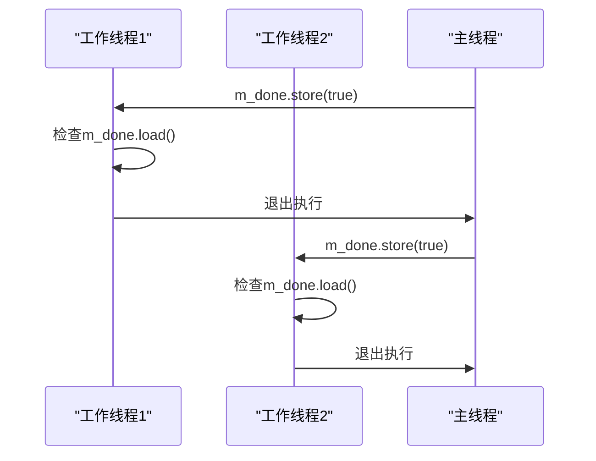
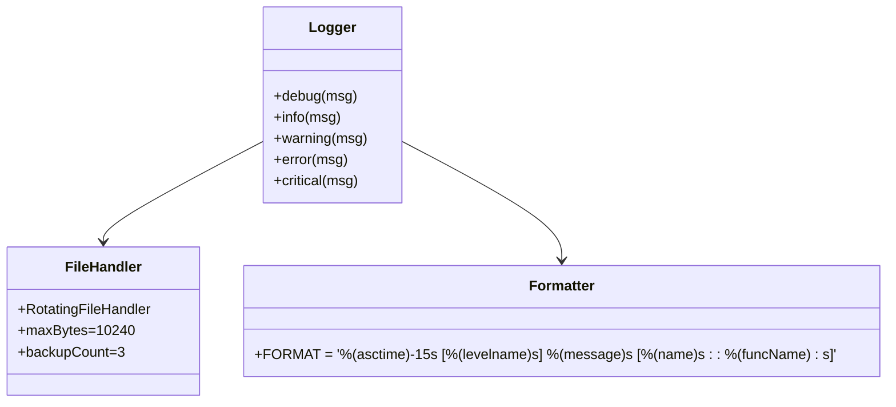
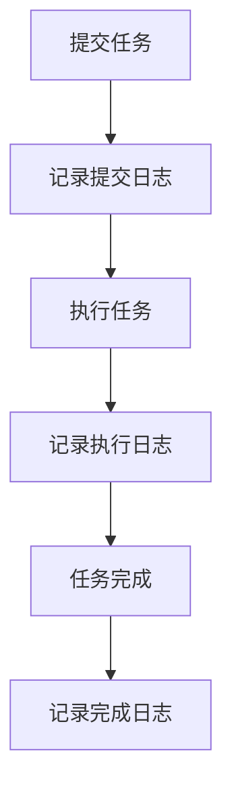
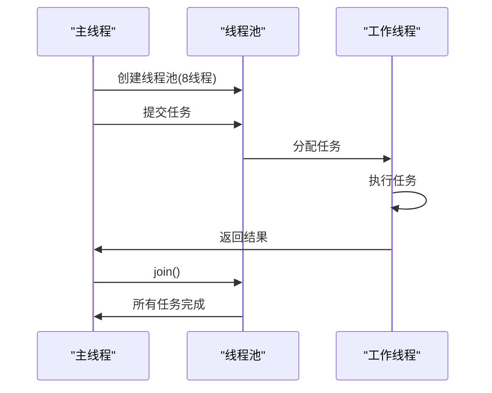

# 线程池监控

<cite>
**本文档引用的文件**
- [ThreadSafeQueue.h](file://hikyuu_cpp/hikyuu/utilities/thread/ThreadSafeQueue.h)
- [MQThreadPool.h](file://hikyuu_cpp/hikyuu/utilities/thread/MQThreadPool.h)
- [GlobalMQThreadPool.h](file://hikyuu_cpp/hikyuu/utilities/thread/GlobalMQThreadPool.h)
- [WorkStealQueue.h](file://hikyuu_cpp/hikyuu/utilities/thread/WorkStealQueue.h)
- [mylog.py](file://hikyuu/util/mylog.py)
- [test_ThreadPool.cpp](file://hikyuu_cpp/unit_test/hikyuu/utilities/thread/test_ThreadPool.cpp)
- [FuncWrapper.h](file://hikyuu_cpp/hikyuu/utilities/thread/FuncWrapper.h)
- [InterruptFlag.h](file://hikyuu_cpp/hikyuu/utilities/thread/InterruptFlag.h)
</cite>

## 目录
1. [简介](#简介)
2. [线程池架构](#线程池架构)
3. [监控指标实现](#监控指标实现)
4. [无锁监控机制](#无锁监控机制)
5. [日志集成](#日志集成)
6. [使用示例](#使用示例)
7. [总结](#总结)

## 简介
本文档详细介绍hikyuu框架中线程池的监控机制，包括如何监控线程池的运行状态、实现无锁监控以及与日志系统的集成。线程池是hikyuu框架中用于并行处理任务的核心组件，通过有效的监控可以确保系统的稳定性和性能。

## 线程池架构
hikyuu框架提供了多种线程池实现，主要包括MQThreadPool和GlobalMQThreadPool。这些线程池采用多队列架构，每个工作线程拥有独立的任务队列，从而减少线程间的竞争。

**图源**
- [MQThreadPool.h](file://hikyuu_cpp/hikyuu/utilities/thread/MQThreadPool.h#L49-L94)
- [ThreadSafeQueue.h](file://hikyuu_cpp/hikyuu/utilities/thread/ThreadSafeQueue.h#L1-L51)

**本节来源**
- [MQThreadPool.h](file://hikyuu_cpp/hikyuu/utilities/thread/MQThreadPool.h#L1-L238)
- [GlobalMQThreadPool.h](file://hikyuu_cpp/hikyuu/utilities/thread/GlobalMQThreadPool.h#L1-L271)

## 监控指标实现
线程池提供了多种监控指标，用于实时了解其运行状态。这些指标包括工作线程数、剩余任务数和线程池状态等。

### 工作线程数监控
通过`worker_num()`方法可以获取线程池中工作线程的数量。该方法返回构造线程池时指定的线程数。

**图源**
- [MQThreadPool.h](file://hikyuu_cpp/hikyuu/utilities/thread/MQThreadPool.h#L82-L85)
- [GlobalMQThreadPool.h](file://hikyuu_cpp/hikyuu/utilities/thread/GlobalMQThreadPool.h#L81-L84)

### 剩余任务数监控
`remain_task_count()`方法用于获取线程池中所有任务队列的剩余任务总数。该方法遍历所有工作线程的任务队列，累加各队列的大小。

**图源**
- [MQThreadPool.h](file://hikyuu_cpp/hikyuu/utilities/thread/MQThreadPool.h#L87-L94)
- [GlobalMQThreadPool.h](file://hikyuu_cpp/hikyuu/utilities/thread/GlobalMQThreadPool.h#L86-L93)

### 线程池状态监控
`done()`方法用于检查线程池是否已完成或已停止。该方法返回一个布尔值，表示线程池的运行状态。

**本节来源**
- [MQThreadPool.h](file://hikyuu_cpp/hikyuu/utilities/thread/MQThreadPool.h#L142-L145)
- [GlobalMQThreadPool.h](file://hikyuu_cpp/hikyuu/utilities/thread/GlobalMQThreadPool.h#L139-L142)

## 无锁监控机制
hikyuu线程池采用线程安全的队列和原子操作来实现无锁监控机制，确保在高并发环境下的性能和稳定性。

### 线程安全队列
`ThreadSafeQueue`是实现无锁监控的基础组件，它使用互斥锁保护队列操作，确保多线程环境下的数据一致性。

**图源**
- [ThreadSafeQueue.h](file://hikyuu_cpp/hikyuu/utilities/thread/ThreadSafeQueue.h#L24-L105)

### 原子操作
线程池使用`std::atomic_bool`来实现线程间的通信和状态同步，避免了传统锁机制带来的性能开销。

**图源**
- [MQThreadPool.h](file://hikyuu_cpp/hikyuu/utilities/thread/MQThreadPool.h#L210)
- [GlobalMQThreadPool.h](file://hikyuu_cpp/hikyuu/utilities/thread/GlobalMQThreadPool.h#L228)

**本节来源**
- [ThreadSafeQueue.h](file://hikyuu_cpp/hikyuu/utilities/thread/ThreadSafeQueue.h#L1-L106)
- [InterruptFlag.h](file://hikyuu_cpp/hikyuu/utilities/thread/InterruptFlag.h#L1-L46)

## 日志集成
hikyuu框架通过`util/mylog.py`模块提供日志功能，可以将线程池的运行信息输出到日志文件，便于性能分析和故障排查。

### 日志配置
日志系统使用Python的logging模块，配置了文件处理器和格式化器，将日志输出到用户目录下的hikyuu_py.log文件。

**图源**
- [mylog.py](file://hikyuu/util/mylog.py#L56-L68)

### 日志输出
线程池可以通过日志系统输出运行信息，包括任务提交、执行和完成等关键事件。

**本节来源**
- [mylog.py](file://hikyuu/util/mylog.py#L1-L292)
- [test_ThreadPool.cpp](file://hikyuu_cpp/unit_test/hikyuu/utilities/thread/test_ThreadPool.cpp#L45-L88)

## 使用示例
以下是一个使用MQThreadPool的示例，展示了如何创建线程池、提交任务和监控其状态。

**本节来源**
- [test_ThreadPool.cpp](file://hikyuu_cpp/unit_test/hikyuu/utilities/thread/test_ThreadPool.cpp#L45-L88)
- [MQThreadPool.h](file://hikyuu_cpp/hikyuu/utilities/thread/MQThreadPool.h#L106-L136)

## 总结
hikyuu框架的线程池监控机制通过线程安全的队列和原子操作实现了高效的无锁监控。监控指标包括工作线程数、剩余任务数和线程池状态等，这些指标可以帮助开发者了解线程池的运行状况。通过与`util/mylog.py`日志系统的集成，可以将线程池的运行信息输出到日志文件，便于性能分析和故障排查。这种设计既保证了监控的准确性，又避免了传统锁机制带来的性能开销。