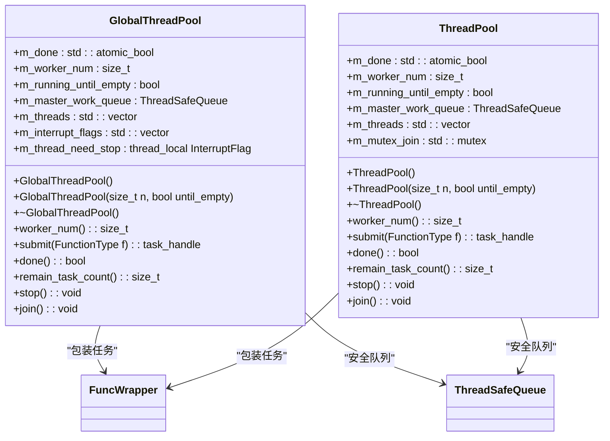
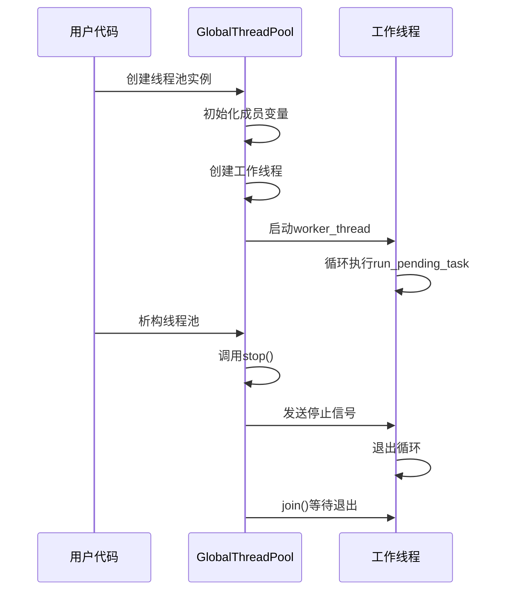
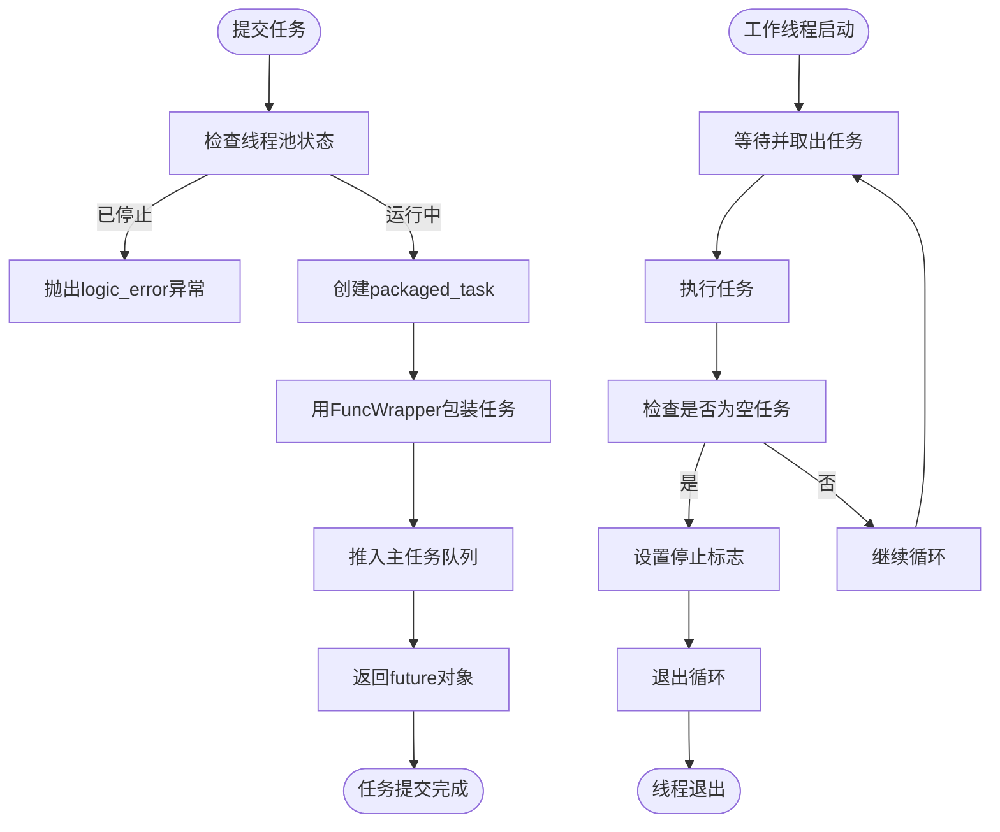
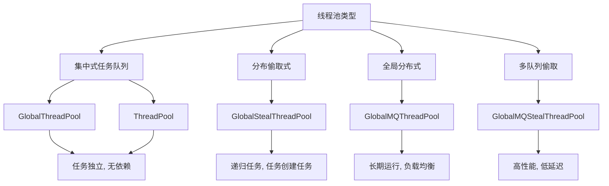
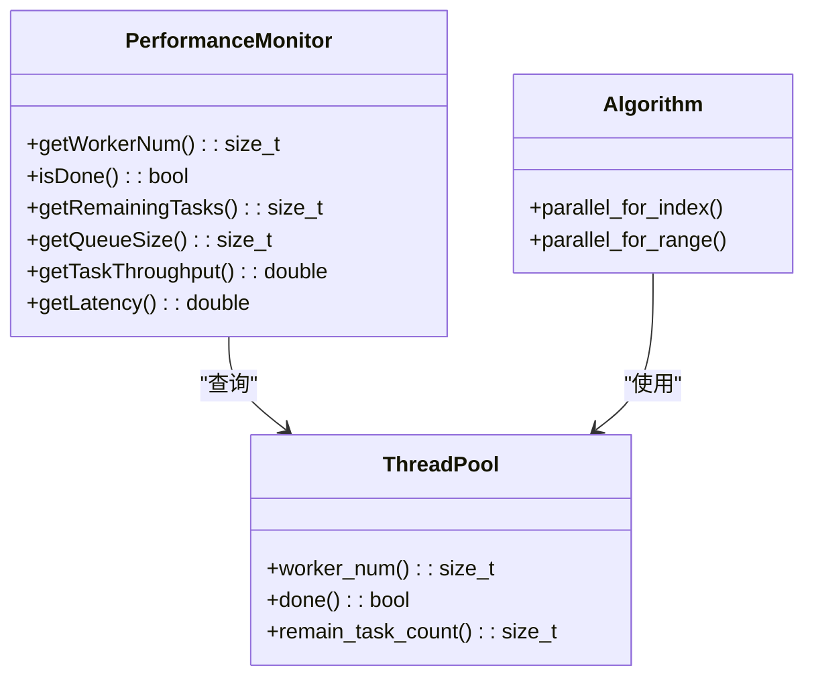
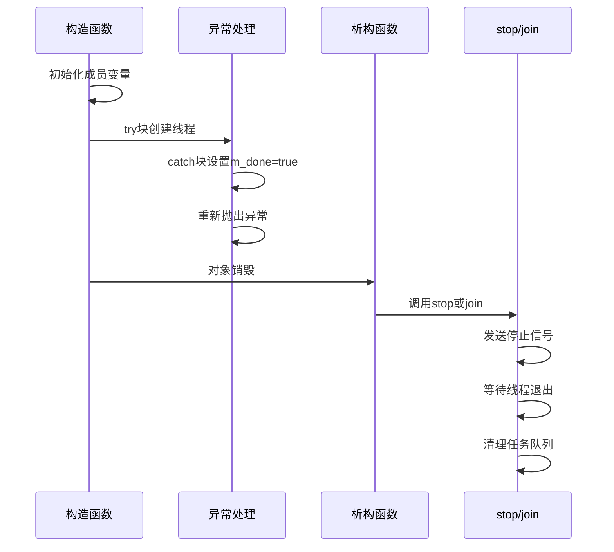
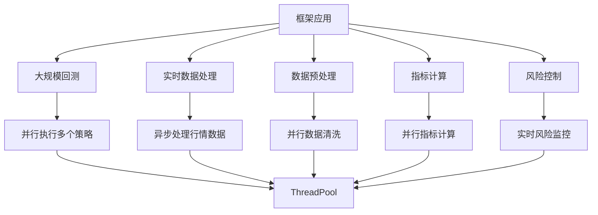
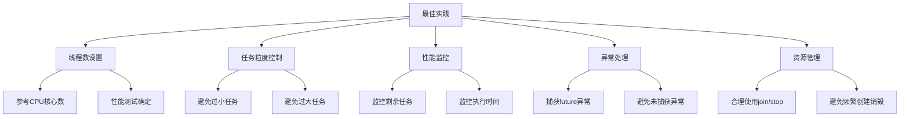

# 线程池管理

<cite>
**本文档引用的文件**   
- [GlobalThreadPool.h](file://hikyuu_cpp/hikyuu/utilities/thread/GlobalThreadPool.h)
- [ThreadPool.h](file://hikyuu_cpp/hikyuu/utilities/thread/ThreadPool.h)
- [GlobalStealThreadPool.h](file://hikyuu_cpp/hikyuu/utilities/thread/GlobalStealThreadPool.h)
- [GlobalMQThreadPool.h](file://hikyuu_cpp/hikyuu/utilities/thread/GlobalMQThreadPool.h)
- [GlobalMQStealThreadPool.h](file://hikyuu_cpp/hikyuu/utilities/thread/GlobalMQStealThreadPool.h)
- [FuncWrapper.h](file://hikyuu_cpp/hikyuu/utilities/thread/FuncWrapper.h)
- [ThreadSafeQueue.h](file://hikyuu_cpp/hikyuu/utilities/thread/ThreadSafeQueue.h)
- [WorkStealQueue.h](file://hikyuu_cpp/hikyuu/utilities/thread/WorkStealQueue.h)
- [MQStealQueue.h](file://hikyuu_cpp/hikyuu/utilities/thread/MQStealQueue.h)
- [algorithm.h](file://hikyuu_cpp/hikyuu/utilities/thread/algorithm.h)
</cite>

## 目录
1. [引言](#引言)
2. [核心线程池类设计](#核心线程池类设计)
3. [线程池初始化与资源管理](#线程池初始化与资源管理)
4. [任务提交与执行机制](#任务提交与执行机制)
5. [线程池类型与适用场景](#线程池类型与适用场景)
6. [性能监控与状态查询](#性能监控与状态查询)
7. [异常处理与资源回收](#异常处理与资源回收)
8. [在框架中的应用](#在框架中的应用)
9. [最佳实践建议](#最佳实践建议)
10. [结论](#结论)

## 引言

线程池是Hikyuu量化框架中实现高性能计算的核心组件，通过有效管理线程资源，支持大规模回测和实时数据处理等计算密集型任务。本文档深入解析`GlobalThreadPool`和`ThreadPool`类的设计与实现，详细说明其在框架中的核心作用，包括线程池的初始化、线程创建、任务提交和资源回收机制。同时，结合代码示例展示如何配置线程池大小、监控线程状态以及处理异常情况，为开发者提供全面的使用指导和最佳实践建议。

**本文档引用的文件**   
- [GlobalThreadPool.h](file://hikyuu_cpp/hikyuu/utilities/thread/GlobalThreadPool.h)
- [ThreadPool.h](file://hikyuu_cpp/hikyuu/utilities/thread/ThreadPool.h)

## 核心线程池类设计

Hikyuu框架中的线程池设计基于C++11标准库的并发特性，通过模板和RAII机制实现高效、安全的线程管理。`GlobalThreadPool`和`ThreadPool`类作为框架的核心线程池实现，提供了集中式任务队列的线程池功能，确保任务之间彼此独立且不能互相等待。

`GlobalThreadPool`类采用全局集中式任务队列设计，所有工作线程共享一个主任务队列。该类通过`std::atomic_bool`类型的`m_done`标志位来控制线程池的全局终止状态，`m_worker_num`记录工作线程数量，`m_running_until_empty`标志位控制任务队列为空时是否自动停止运行。主任务队列`m_master_work_queue`是`ThreadSafeQueue<task_type>`类型，确保多线程环境下的线程安全操作。

`ThreadPool`类的设计与`GlobalThreadPool`类似，但采用了不同的线程终止机制。它通过`std::atomic_bool`的`exchange`操作来确保线程池的停止操作是原子的，避免了竞态条件。此外，`ThreadPool`还使用了`std::mutex`类型的`m_mutex_join`来保护`join`操作，确保多个线程可以安全地等待线程池完成。

**图示来源**  
- [GlobalThreadPool.h](file://hikyuu_cpp/hikyuu/utilities/thread/GlobalThreadPool.h#L40-L224)
- [ThreadPool.h](file://hikyuu_cpp/hikyuu/utilities/thread/ThreadPool.h#L37-L203)

**本节来源**  
- [GlobalThreadPool.h](file://hikyuu_cpp/hikyuu/utilities/thread/GlobalThreadPool.h#L34-L224)
- [ThreadPool.h](file://hikyuu_cpp/hikyuu/utilities/thread/ThreadPool.h#L31-L203)

## 线程池初始化与资源管理

线程池的初始化过程是确保系统能够高效利用多核处理器的关键。`GlobalThreadPool`和`ThreadPool`类都提供了两种构造函数：默认构造函数和带参数的构造函数。默认构造函数会创建与当前系统CPU核心数一致的工作线程数，通过`std::thread::hardware_concurrency()`获取系统信息，实现自动化的资源适配。

带参数的构造函数允许用户指定工作线程的数量和任务队列为空时的行为。在构造函数内部，首先初始化成员变量，然后在try-catch块中创建工作线程。这种设计确保了在资源分配失败时能够正确清理已分配的资源，避免内存泄漏。工作线程通过`std::thread`构造函数创建，并将`worker_thread`成员函数作为线程执行体，同时传递线程索引作为参数。

线程池的资源管理主要体现在析构函数中。`GlobalThreadPool`的析构函数会调用`stop()`方法，而`ThreadPool`的析构函数则调用`join()`方法。这两种方法都确保了在对象销毁前，所有工作线程都能完成当前执行的任务并安全退出。`stop()`方法会立即停止线程池，而`join()`方法会阻塞直到所有任务完成，为开发者提供了灵活的资源回收策略。

**图示来源**  
- [GlobalThreadPool.h](file://hikyuu_cpp/hikyuu/utilities/thread/GlobalThreadPool.h#L49-L77)
- [ThreadPool.h](file://hikyuu_cpp/hikyuu/utilities/thread/ThreadPool.h#L42-L68)

**本节来源**  
- [GlobalThreadPool.h](file://hikyuu_cpp/hikyuu/utilities/thread/GlobalThreadPool.h#L46-L77)
- [ThreadPool.h](file://hikyuu_cpp/hikyuu/utilities/thread/ThreadPool.h#L39-L68)

## 任务提交与执行机制

线程池的核心功能是任务的提交与执行。`GlobalThreadPool`和`ThreadPool`类都提供了`submit`模板方法，用于向线程池提交任务。该方法接受一个可调用对象（函数、函数对象或lambda表达式）作为参数，并返回一个`std::future`对象，用于获取任务执行结果或检查任务状态。

任务提交过程首先检查线程池是否已停止，如果已停止则抛出`std::logic_error`异常。然后，使用`std::packaged_task`包装提交的可调用对象，创建一个能够生成`std::future`的任务对象。这个包装后的任务通过`FuncWrapper`进一步封装，以支持移动语义和不同类型的任务。最后，任务被推入主任务队列`m_master_work_queue`，等待工作线程取出并执行。

工作线程的执行机制由`worker_thread`和`run_pending_task`两个方法实现。`worker_thread`是线程的主循环，它在`m_done`和`m_thread_need_stop`标志位都为假时持续调用`run_pending_task`。`run_pending_task`方法从主任务队列中取出一个任务并执行。如果取出的任务是空任务（通过`isNullTask()`判断），则设置`m_thread_need_stop`标志位，指示线程应该停止运行。

**图示来源**  
- [GlobalThreadPool.h](file://hikyuu_cpp/hikyuu/utilities/thread/GlobalThreadPool.h#L94-L105)
- [ThreadPool.h](file://hikyuu_cpp/hikyuu/utilities/thread/ThreadPool.h#L86-L97)
- [FuncWrapper.h](file://hikyuu_cpp/hikyuu/utilities/thread/FuncWrapper.h#L27-L77)

**本节来源**  
- [GlobalThreadPool.h](file://hikyuu_cpp/hikyuu/utilities/thread/GlobalThreadPool.h#L94-L105)
- [ThreadPool.h](file://hikyuu_cpp/hikyuu/utilities/thread/ThreadPool.h#L86-L97)

## 线程池类型与适用场景

Hikyuu框架提供了多种线程池实现，以适应不同的应用场景和性能需求。除了`GlobalThreadPool`和`ThreadPool`外，还包括`GlobalStealThreadPool`、`GlobalMQThreadPool`和`GlobalMQStealThreadPool`等变体，每种类型都有其特定的设计目标和适用场景。

`GlobalThreadPool`和`ThreadPool`属于集中式任务队列线程池，所有工作线程共享一个主任务队列。这种设计简单高效，适用于任务之间彼此独立且没有先后顺序依赖的场景。当任务运行之间存在先后顺序时，建议使用偷取式线程池。

`GlobalStealThreadPool`是分布偷取式线程池，每个工作线程都有自己的任务队列。当本地队列为空时，线程会尝试从其他线程的队列尾部"偷取"任务。这种设计特别适用于存在递归情况或任务又创建任务加入线程池的场景，能有效减少任务调度的锁竞争，提高整体吞吐量。

`GlobalMQThreadPool`是全局分布式线程池，每个工作线程都有独立的任务队列，任务提交时会选择任务数最小的队列或空队列进行分配。这种设计适合程序运行期内一直保持运行的情况，能实现更好的负载均衡。

`GlobalMQStealThreadPool`结合了多队列和任务偷取的优点，每个工作线程有独立的任务队列，本地线程提交的任务优先加入自身队列（从前部入队），其他线程提交的任务则选择任务最少的队列加入（从尾部入队）。当本地队列为空时，线程会尝试从其他队列偷取任务。

**图示来源**  
- [GlobalStealThreadPool.h](file://hikyuu_cpp/hikyuu/utilities/thread/GlobalStealThreadPool.h#L34-L38)
- [GlobalMQThreadPool.h](file://hikyuu_cpp/hikyuu/utilities/thread/GlobalMQThreadPool.h#L32-L35)
- [GlobalMQStealThreadPool.h](file://hikyuu_cpp/hikyuu/utilities/thread/GlobalMQStealThreadPool.h#L31-L33)

**本节来源**  
- [GlobalStealThreadPool.h](file://hikyuu_cpp/hikyuu/utilities/thread/GlobalStealThreadPool.h#L34-L38)
- [GlobalMQThreadPool.h](file://hikyuu_cpp/hikyuu/utilities/thread/GlobalMQThreadPool.h#L32-L35)

## 性能监控与状态查询

线程池提供了多种机制来监控性能和查询状态，帮助开发者了解线程池的运行状况并进行性能调优。`worker_num()`方法返回工作线程的数量，`done()`方法返回线程池的结束状态，`remain_task_count()`方法返回剩余任务数，这些信息对于监控线程池的负载和健康状况至关重要。

`remain_task_count()`方法的实现因线程池类型而异。对于集中式任务队列的`GlobalThreadPool`和`ThreadPool`，只需返回主任务队列的大小。而对于分布式的`GlobalStealThreadPool`，需要计算主任务队列和所有工作线程队列的总和。`GlobalMQThreadPool`和`GlobalMQStealThreadPool`则需要遍历所有工作队列，累加各自的大小。

除了这些基本的查询方法，框架还提供了`algorithm.h`中的并行算法模板，如`parallel_for_index`和`parallel_for_range`，这些模板函数封装了线程池的使用，使开发者能够更方便地实现并行计算。这些模板默认使用`MQThreadPool`作为任务组，但允许通过模板参数指定其他线程池类型。

**图示来源**  
- [GlobalThreadPool.h](file://hikyuu_cpp/hikyuu/utilities/thread/GlobalThreadPool.h#L80-L119)
- [GlobalStealThreadPool.h](file://hikyuu_cpp/hikyuu/utilities/thread/GlobalStealThreadPool.h#L82-L97)
- [algorithm.h](file://hikyuu_cpp/hikyuu/utilities/thread/algorithm.h#L54-L113)

**本节来源**  
- [GlobalThreadPool.h](file://hikyuu_cpp/hikyuu/utilities/thread/GlobalThreadPool.h#L80-L119)
- [algorithm.h](file://hikyuu_cpp/hikyuu/utilities/thread/algorithm.h#L54-L113)

## 异常处理与资源回收

线程池的异常处理和资源回收机制是确保系统稳定性和资源安全的关键。`GlobalThreadPool`和`ThreadPool`类都通过RAII（资源获取即初始化）原则来管理资源，确保在任何情况下都能正确释放资源。

在构造函数中，使用try-catch块来捕获可能的异常。如果在创建工作线程时发生异常，会立即设置`m_done`标志位为true，并重新抛出异常。这样可以确保在对象构造失败时，析构函数能够正确执行资源清理。

`stop()`和`join()`方法实现了不同的资源回收策略。`stop()`方法会立即停止线程池，向所有工作线程发送停止信号，并等待它们退出。`join()`方法则会阻塞直到所有任务完成，确保所有计算工作都已结束。这两种方法都通过向任务队列中添加空任务来通知工作线程停止运行，这是一种优雅的线程终止方式。

对于任务执行过程中的异常，线程池本身不进行捕获和处理，而是由`std::future`机制来传递异常。当用户调用`future.get()`时，如果任务执行过程中抛出了异常，该异常会被重新抛出，允许用户在适当的位置进行处理。

**图示来源**  
- [GlobalThreadPool.h](file://hikyuu_cpp/hikyuu/utilities/thread/GlobalThreadPool.h#L56-L68)
- [ThreadPool.h](file://hikyuu_cpp/hikyuu/utilities/thread/ThreadPool.h#L49-L60)
- [GlobalThreadPool.h](file://hikyuu_cpp/hikyuu/utilities/thread/GlobalThreadPool.h#L124-L146)
- [ThreadPool.h](file://hikyuu_cpp/hikyuu/utilities/thread/ThreadPool.h#L116-L138)

**本节来源**  
- [GlobalThreadPool.h](file://hikyuu_cpp/hikyuu/utilities/thread/GlobalThreadPool.h#L56-L68)
- [ThreadPool.h](file://hikyuu_cpp/hikyuu/utilities/thread/ThreadPool.h#L49-L60)

## 在框架中的应用

线程池在Hikyuu框架中扮演着至关重要的角色，特别是在大规模回测和实时数据处理等高性能计算场景中。通过并行化计算任务，线程池显著提高了框架的处理能力和响应速度。

在回测系统中，线程池被用于并行执行多个策略的回测任务。每个策略可以作为一个独立的任务提交到线程池中，充分利用多核处理器的计算能力。`algorithm.h`中的`parallel_for_index`模板函数就是为此设计的，它能够将一个范围分割成多个子范围，每个子范围作为一个任务并行执行。

在实时数据处理中，线程池用于处理高频的行情数据更新。当新的行情数据到达时，可以立即提交到线程池中进行处理，而不会阻塞主线程。这种异步处理模式确保了系统的实时性和响应性。

此外，线程池还被用于数据预处理、指标计算、风险控制等多个模块。通过统一的线程池管理，框架能够有效控制并发度，避免系统资源被过度消耗，同时保证了计算任务的高效执行。

**图示来源**  
- [algorithm.h](file://hikyuu_cpp/hikyuu/utilities/thread/algorithm.h#L54-L65)
- [plugin/backtest.h](file://hikyuu_cpp/hikyuu/plugin/backtest.h#L1-L40)

**本节来源**  
- [algorithm.h](file://hikyuu_cpp/hikyuu/utilities/thread/algorithm.h#L54-L65)

## 最佳实践建议

为了充分发挥线程池的性能优势并避免常见问题，开发者应遵循以下最佳实践建议：

**线程数设置**：线程池的大小应根据系统的CPU核心数和任务类型进行合理设置。对于CPU密集型任务，线程数通常设置为CPU核心数或稍多一些；对于I/O密集型任务，可以设置更多的线程以提高并发度。建议使用默认构造函数让系统自动确定线程数，或根据实际负载进行性能测试后确定最优值。

**任务粒度控制**：任务的粒度应适中。任务过小会导致任务调度开销过大，降低性能；任务过大则可能导致负载不均衡。建议将计算量较大的任务拆分为多个中等粒度的子任务，以实现更好的负载均衡和更高的并行度。

**性能监控**：定期监控线程池的状态，包括剩余任务数、工作线程数和任务执行时间。通过`remain_task_count()`方法可以了解线程池的负载情况，及时发现性能瓶颈。对于长期运行的系统，建议实现自动化的性能监控和告警机制。

**异常处理**：正确处理任务执行过程中的异常。使用`std::future`的`get()`方法获取任务结果时，应捕获可能抛出的异常，并进行适当的错误处理。避免在任务中抛出未捕获的异常，以免导致工作线程意外终止。

**资源管理**：合理管理线程池的生命周期。对于短期使用的线程池，使用`join()`方法确保所有任务完成后再销毁；对于长期运行的线程池，可以使用`stop()`方法在需要时立即停止。避免频繁创建和销毁线程池，以减少系统开销。

**图示来源**  
- [GlobalThreadPool.h](file://hikyuu_cpp/hikyuu/utilities/thread/GlobalThreadPool.h#L48-L49)
- [ThreadPool.h](file://hikyuu_cpp/hikyuu/utilities/thread/ThreadPool.h#L41-L42)
- [GlobalThreadPool.h](file://hikyuu_cpp/hikyuu/utilities/thread/GlobalThreadPool.h#L116-L119)

**本节来源**  
- [GlobalThreadPool.h](file://hikyuu_cpp/hikyuu/utilities/thread/GlobalThreadPool.h#L48-L49)
- [ThreadPool.h](file://hikyuu_cpp/hikyuu/utilities/thread/ThreadPool.h#L41-L42)

## 结论

Hikyuu框架中的`GlobalThreadPool`和`ThreadPool`类提供了强大而灵活的线程池实现，为框架的高性能计算需求提供了坚实的基础。通过深入解析其设计与实现，我们了解了线程池的初始化、线程创建、任务提交和资源回收机制，以及如何在实际应用中配置和使用线程池。

线程池不仅支持大规模回测和实时数据处理等计算密集型任务，还通过多种类型和配置选项适应不同的应用场景。合理的线程数设置、任务粒度控制、性能监控和异常处理是充分发挥线程池性能的关键。随着量化交易对计算性能要求的不断提高，高效的线程池管理将成为系统设计中不可或缺的一部分。

未来，可以进一步探索动态线程池、任务优先级调度等高级特性，以满足更复杂的计算需求。同时，结合现代C++的并发特性，如协程和无锁数据结构，有望进一步提升线程池的性能和可扩展性。