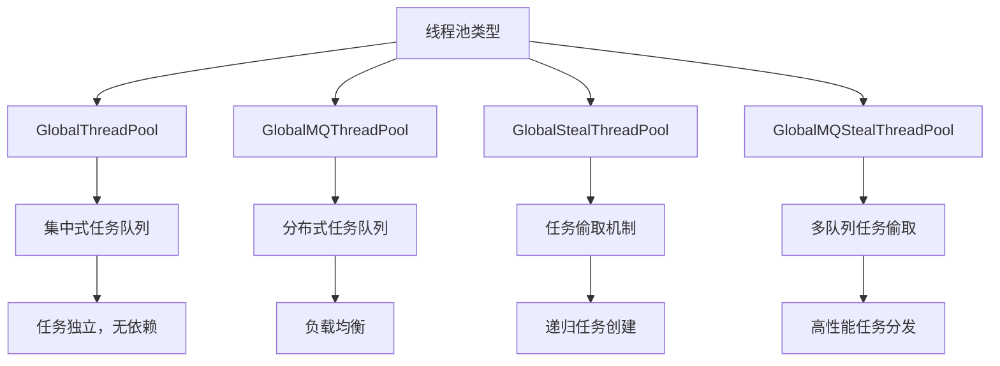
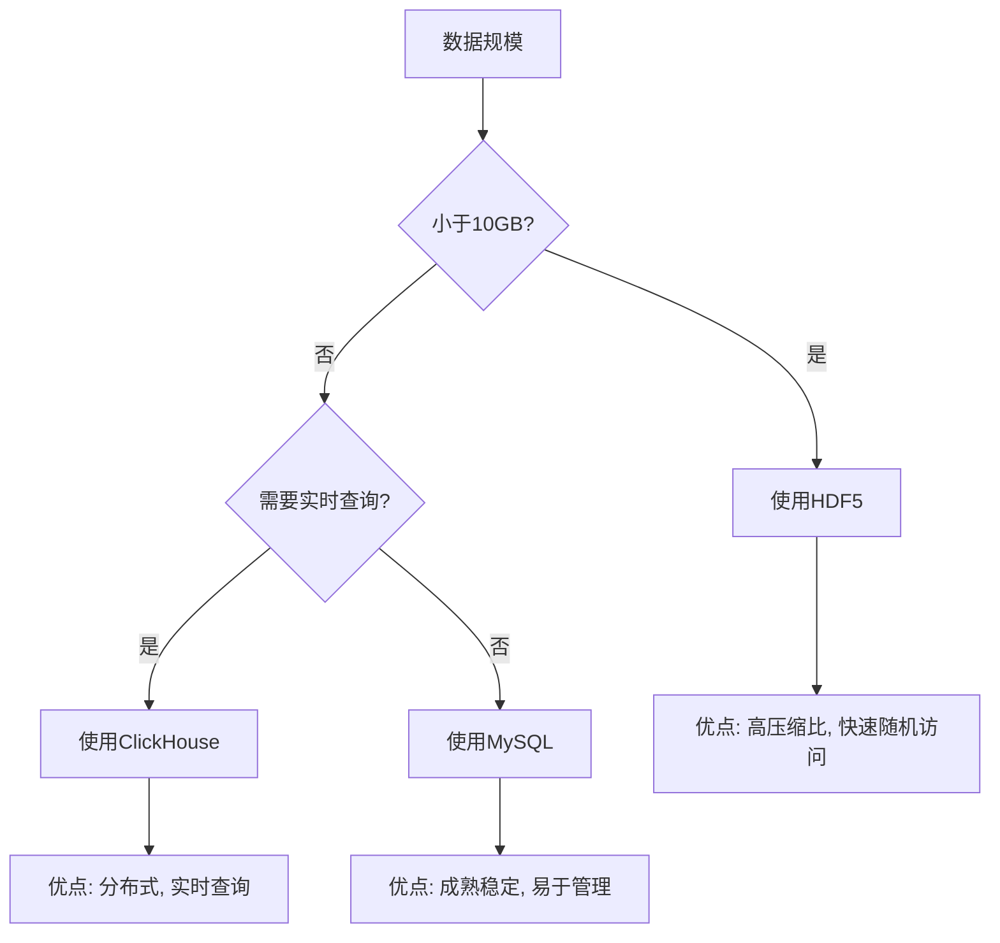
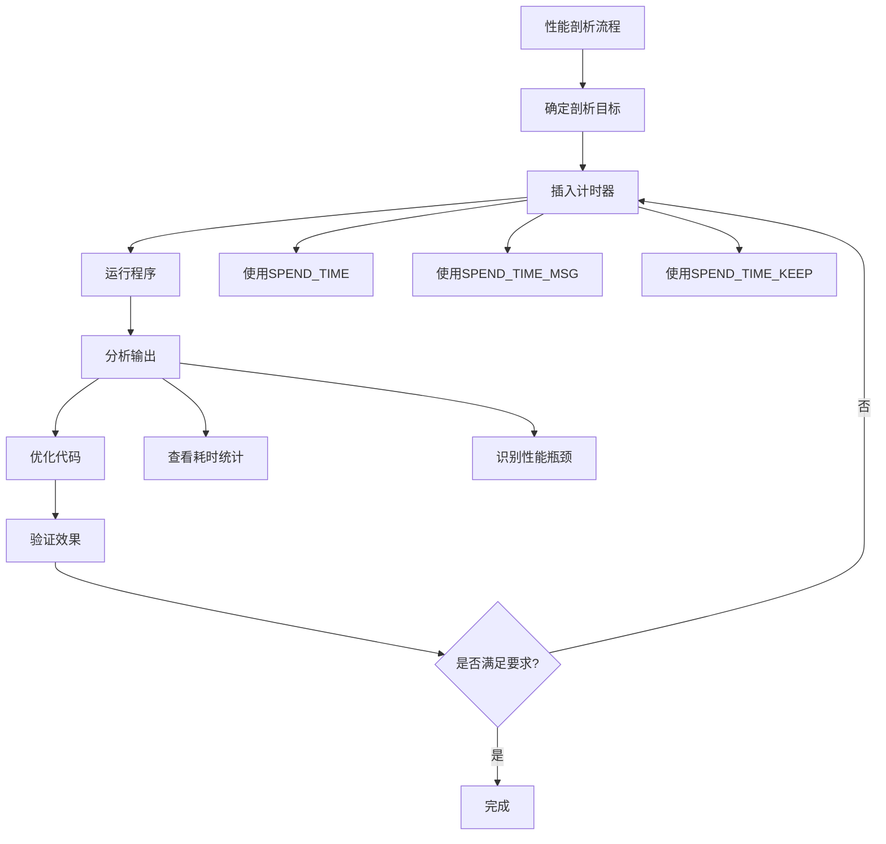

# 性能优化

<cite>
**本文档引用的文件**   
- [GlobalThreadPool.h](file://hikyuu_cpp/hikyuu/utilities/thread/GlobalThreadPool.h)
- [GlobalMQThreadPool.h](file://hikyuu_cpp/hikyuu/utilities/thread/GlobalMQThreadPool.h)
- [GlobalStealThreadPool.h](file://hikyuu_cpp/hikyuu/utilities/thread/GlobalStealThreadPool.h)
- [GlobalMQStealThreadPool.h](file://hikyuu_cpp/hikyuu/utilities/thread/GlobalMQStealThreadPool.h)
- [H5KDataDriver.cpp](file://hikyuu_cpp/hikyuu/data_driver/kdata/hdf5/H5KDataDriver.cpp)
- [H5KDataDriver.h](file://hikyuu_cpp/hikyuu/data_driver/kdata/hdf5/H5KDataDriver.h)
- [SpendTimer.h](file://hikyuu_cpp/hikyuu/utilities/SpendTimer.h)
- [SpendTimer.cpp](file://hikyuu_cpp/hikyuu/utilities/SpendTimer.cpp)
- [ta_imp.h](file://hikyuu_cpp/hikyuu/indicator_talib/imp/ta_imp.h)
- [test_SYS_WalkForward.cpp](file://hikyuu_cpp/unit_test/hikyuu/trade_sys/system/test_SYS_WalkForward.cpp)
- [OptimalSelectorBase.cpp](file://hikyuu_cpp/hikyuu/trade_sys/selector/imp/optimal/OptimalSelectorBase.cpp)
- [debug.h](file://hikyuu_cpp/hikyuu/debug.h)
</cite>

## 目录
1. [引言](#引言)
2. [C++核心层极速计算实现](#c核心层极速计算实现)
3. [多线程与线程池使用](#多线程与线程池使用)
4. [数据存储优化建议](#数据存储优化建议)
5. [内存使用模式与泄漏避免](#内存使用模式与泄漏避免)
6. [性能剖析方法与工具](#性能剖析方法与工具)
7. [结论](#结论)

## 引言
本文档旨在为用户提供Hikyuu框架的性能优化指南，帮助用户充分发挥框架的高性能优势。文档将深入分析C++核心层如何实现极速计算，特别是在技术指标计算和回测循环中的优化策略。同时，将详细介绍多线程和线程池（GlobalThreadPool）的使用方法，指导用户如何并行化策略回测以利用多核CPU。此外，还将提供数据存储优化建议、内存使用模式分析以及性能剖析方法，帮助用户构建高效、稳定的量化交易系统。

## C++核心层极速计算实现

### 技术指标计算优化
Hikyuu框架的技术指标计算主要在C++核心层实现，通过直接调用TA-Lib库的底层函数来实现高性能计算。在`hikyuu_cpp/hikyuu/indicator_talib/imp/ta_imp.h`文件中，可以看到指标计算的实现模式：

```c++
#define DEF_TALIB_IND(func)                                                              \
    class Cls_##func : public IndicatorImp {                                             \
    public:                                                                              \
        Cls_##func() : IndicatorImp(#func) {                                             \
            setParam<int>("n", 1);                                                       \
        }                                                                                \
                                                                                         \
        virtual void _checkParamBeforeCalculate() override {                             \
            HKU_CHECK_PARAMETER(m_discard >= 0, "discard < 0");                          \
            HKU_CHECK_PARAMETER(getParam<int>("n") > 0, "n <= 0");                       \
        }                                                                                \
                                                                                         \
        virtual void _calculate(const Indicator& data) override {                        \
            if (m_discard >= data.size()) {                                              \
                return;                                                                  \
            }                                                                            \
                                                                                         \
            auto const *src = data.data();                                               \
            std::unique_ptr<int[]> buf = std::make_unique<int[]>(total);                 \
            int outBegIdx;                                                               \
            int outNbElement;                                                            \
            func(m_discard, total - 1, src, &outBegIdx, &outNbElement, buf.get());       \
            HKU_ASSERT((outBegIdx == m_discard) && (outBegIdx + outNbElement) <= total); \
            m_discard = outBegIdx;                                                       \
            auto *dst = this->data();                                                    \
            dst = dst + outBegIdx;                                                       \
            for (int i = 0; i < outNbElement; ++i) {                                     \
                dst[i] = buf[i];                                                         \
            }                                                                            \
        }                                                                                \
                                                                                         \
        Indicator HKU_API func() {                                                       \
            return Indicator(make_shared<Cls_##func>());                                 \
        }
```

这种实现方式通过以下机制确保高性能：
1. **直接调用TA-Lib底层函数**：避免了Python层的解释器开销，直接在C++层面执行计算
2. **内存预分配**：使用`std::unique_ptr`进行内存管理，避免频繁的内存分配和释放
3. **指针操作**：通过指针直接访问数据，减少数据拷贝开销
4. **断言检查**：使用`HKU_ASSERT`进行运行时检查，确保计算的正确性

**Section sources**
- [ta_imp.h](file://hikyuu_cpp/hikyuu/indicator_talib/imp/ta_imp.h#L56-L75)

### 回测循环优化
回测循环是量化交易系统的核心，Hikyuu通过C++核心层的优化实现了高效的回测性能。在`hikyuu_cpp/unit_test/hikyuu/trade_sys/system/test_SYS_WalkForward.cpp`文件中，可以看到回测系统的并行化配置：

```c++
/** @par 检测点 */
TEST_CASE("test_SYS_WalkForword_SE_MaxFundsOptimal_parallel") {
    Stock stk = getStock("sz000001");
    KQuery query = KQueryByIndex(-50);
    TMPtr tm = crtTM();

    /** @arg 只有一个候选系统, 使用 SE_MaxFundsOptimal */
    auto se = SE_MaxFundsOptimal();
    se->setParam<bool>("trace", true);
    auto sys = SYS_WalkForward(SystemList{create_test_sys(3, 5)}, tm, 30, 20, se);
    CHECK_EQ(sys->name(), "SYS_WalkForward");
    query = KQueryByIndex(-125);
    sys->setParam<bool>("clean_hold_when_select_changed", false);
    sys->setParam<bool>("parallel", true);
    sys->run(stk, query);
}
```

关键的性能优化点包括：
1. **并行化参数**：通过`setParam<bool>("parallel", true)`启用并行化计算
2. **候选系统列表**：支持多个候选系统的并行评估
3. **训练和测试长度**：通过`train_len`和`test_len`参数优化回测效率

**Section sources**
- [test_SYS_WalkForward.cpp](file://hikyuu_cpp/unit_test/hikyuu/trade_sys/system/test_SYS_WalkForward.cpp#L82-L120)

## 多线程与线程池使用

### 线程池类型与选择
Hikyuu提供了四种线程池实现，每种适用于不同的场景：



**Diagram sources**
- [GlobalThreadPool.h](file://hikyuu_cpp/hikyuu/utilities/thread/GlobalThreadPool.h#L34-L38)
- [GlobalMQThreadPool.h](file://hikyuu_cpp/hikyuu/utilities/thread/GlobalMQThreadPool.h#L32-L35)
- [GlobalStealThreadPool.h](file://hikyuu_cpp/hikyuu/utilities/thread/GlobalStealThreadPool.h#L33-L36)
- [GlobalMQStealThreadPool.h](file://hikyuu_cpp/hikyuu/utilities/thread/GlobalMQStealThreadPool.h#L31-L33)

#### GlobalThreadPool
这是最基础的线程池实现，采用集中式任务队列模式：

```c++
/**
 * @brief 全局集中式任务队列线程池，任务之间彼此独立不能互相等待
 * @note 任务运行之间如存在先后顺序，只适合程序运行期内一直保持运行的情况
 */
class GlobalThreadPool {
public:
    /**
     * 默认构造函数，创建和当前系统CPU数一致的线程数
     */
    GlobalThreadPool() : GlobalThreadPool(std::thread::hardware_concurrency()) {}
    
    /**
     * 构造函数，创建指定数量的线程
     * @param n 指定的线程数
     * @param until_empty join时，等待任务队列为空后停止运行
     */
    explicit GlobalThreadPool(size_t n, bool until_empty = true);
    
    /** 向线程池提交任务 */
    template <typename FunctionType>
    auto submit(FunctionType f);
};
```

**Section sources**
- [GlobalThreadPool.h](file://hikyuu_cpp/hikyuu/utilities/thread/GlobalThreadPool.h#L34-L115)

#### GlobalMQThreadPool
采用分布式任务队列，每个工作线程有自己的任务队列：

```c++
/**
 * @brief 全局分布式线程池，只适合程序运行期内一直保持运行的情况
 */
class GlobalMQThreadPool {
public:
    /**
     * 构造函数，创建指定数量的线程
     * @param n 指定的线程数
     * @param until_empty 任务队列为空时，自动停止运行
     */
    explicit GlobalMQThreadPool(size_t n, bool until_empty = true);
    
    /** 向空队列或任务数最小的队列中加入任务 */
    template <typename FunctionType>
    auto submit(FunctionType f);
};
```

**Section sources**
- [GlobalMQThreadPool.h](file://hikyuu_cpp/hikyuu/utilities/thread/GlobalMQThreadPool.h#L32-L132)

### 并行化策略回测
在策略回测中，可以通过线程池实现并行化计算。在`hikyuu_cpp/hikyuu/trade_sys/selector/imp/optimal/OptimalSelectorBase.cpp`文件中，可以看到并行化计算的实现：

```c++
void OptimalSelectorBase::_calculate_parallel(const vector<std::pair<size_t, size_t>>& train_ranges,
                                              const DatetimeList& dates, size_t test_len,
                                              bool trace) {
    // SPEND_TIME(OptimalSelectorBase_calculate_parallel);
    auto sys_list = parallel_for_index(
      0, train_ranges.size(), [this, &train_ranges, &dates, query = m_query, trace](size_t i) {
          Datetime start_date = dates[train_ranges[i].first];
          Datetime end_date = dates[train_ranges[i].second];
          KQuery q = KQueryByDate(start_date, end_date, query.kType(), query.recoverType());
          CLS_INFO_IF(trace, "iteration: {}|{}, range: {}", i + 1, train_ranges.size(), q);
          
          // 在这里执行并行计算
          Performance per;
          SYSPtr selected_sys;
          if (m_pro_sys_list.size() == 1) {
              selected_sys = m_pro_sys_list.back()->clone();
          } else if (0 == mode) {
              double max_value = std::numeric_limits<double>::lowest();
              for (const auto& sys : m_pro_sys_list) {
                  // 切断所有共享组件，避免并行冲突
                  auto new_sys = sys->clone();
                  new_sys->run(q, true);
                  per.statistics(new_sys->getTM(), end_date);
                  double value = per.get(key);
                  CLS_TRACE_IF(trace, "value: {}, sys: {}", value, new_sys->name());
                  if (value > max_value) {
                      max_value = value;
                      selected_sys = new_sys;
                  }
              }
          }
          return selected_sys;
      });
}
```

关键的并行化策略包括：
1. **任务分割**：将回测任务分割为多个独立的训练-测试周期
2. **系统克隆**：在并行执行前克隆系统实例，避免共享状态冲突
3. **结果合并**：收集并合并各个并行任务的结果

**Section sources**
- [OptimalSelectorBase.cpp](file://hikyuu_cpp/hikyuu/trade_sys/selector/imp/optimal/OptimalSelectorBase.cpp#L169-L194)

## 数据存储优化建议

### HDF5存储优化
Hikyuu使用HDF5作为高性能数据存储格式，在`hikyuu_cpp/hikyuu/data_driver/kdata/hdf5/H5KDataDriver.h`文件中定义了HDF5数据驱动：

```c++
/**
 * @brief HDF5数据驱动
 * @note 支持并行加载，需要HDF5库支持线程安全
 */
class HKU_API H5KDataDriver : public KDataDriver {
public:
    virtual bool canParallelLoad() override {
#if defined(H5_HAVE_THREADSAFE)
        return true;
#else
        HKU_WARN("Current hdf5 library is not thread-safe!");
        return false;
#endif
    }
    
private:
    H5::CompType m_h5DataType;
    H5::CompType m_h5IndexType;
    H5::CompType m_h5TimeLineType;
    H5::CompType m_h5TransType;
    unordered_map<string, H5FilePtr> m_h5file_map;  // key: market+code
};
```

HDF5存储的优势包括：
1. **高压缩比**：有效减少存储空间占用
2. **快速随机访问**：支持高效的索引查询
3. **并行I/O**：在支持线程安全的HDF5库下可实现并行读取
4. **数据分块**：优化大数据集的访问性能

**Section sources**
- [H5KDataDriver.h](file://hikyuu_cpp/hikyuu/data_driver/kdata/hdf5/H5KDataDriver.h#L31-L38)

### ClickHouse存储优化
对于超大规模数据存储，建议使用ClickHouse替代SQLite。在`hikyuu/gui/data/UsePytdxImportToH5Thread.py`文件中可以看到ClickHouse的配置：

```python
elif self.config.getboolean('clickhouse', 'enable', fallback=True):
    db_config = {
        'username': self.config['clickhouse']['usr'],
        'password': self.config['clickhouse']['pwd'],
        'host': self.config['clickhouse']['host'],
        'port': self.config['clickhouse']['http_port']
    }
    import clickhouse_connect
```

ClickHouse的优势包括：
1. **列式存储**：适合时间序列数据的高效查询
2. **向量化执行**：充分利用CPU SIMD指令
3. **分布式架构**：支持水平扩展
4. **实时查询**：毫秒级响应时间

**Section sources**
- [UsePytdxImportToH5Thread.py](file://hikyuu/gui/data/UsePytdxImportToH5Thread.py#L255-L281)

### 存储格式选择建议
根据数据规模和使用场景，推荐以下存储方案：



**Diagram sources**
- [H5KDataDriver.h](file://hikyuu_cpp/hikyuu/data_driver/kdata/hdf5/H5KDataDriver.h#L31-L38)
- [UsePytdxImportToH5Thread.py](file://hikyuu/gui/data/UsePytdxImportToH5Thread.py#L255-L281)

## 内存使用模式与泄漏避免

### 内存管理实践
Hikyuu采用RAII（资源获取即初始化）模式进行内存管理，确保资源的正确释放。在`hikyuu_cpp/hikyuu/data_driver/kdata/hdf5/H5KDataDriver.cpp`文件中可以看到智能指针的使用：

```c++
class Hdf5FileCloser {
public:
    void operator()(H5::H5File* h5file) {
        if (h5file) {
            h5file->close();
            delete h5file;
        }
    }
};

H5KDataDriver::H5KDataDriver() : KDataDriver("hdf5"), m_h5DataType(H5::CompType(sizeof(H5Record))) {
    // 使用智能指针管理HDF5文件
    H5FilePtr h5file(new H5::H5File(filename, H5F_ACC_RDONLY), Hdf5FileCloser());
    m_h5file_map[market + "_DAY"] = h5file;
}
```

关键的内存管理实践包括：
1. **智能指针**：使用`std::unique_ptr`和自定义删除器管理资源
2. **RAII模式**：在对象构造时获取资源，在析构时释放资源
3. **异常安全**：确保在异常情况下也能正确释放资源

**Section sources**
- [H5KDataDriver.cpp](file://hikyuu_cpp/hikyuu/data_driver/kdata/hdf5/H5KDataDriver.cpp#L42-L52)

### 内存泄漏检测
Hikyuu提供了内存泄漏检测机制，在`hikyuu_cpp/hikyuu/debug.h`文件中定义了MSVC内存泄漏检测：

```c++
/*
 * 用途：用于内存泄露检测，cpp 文件包含此头文件以便内存泄露检测时可打印文件名等信息
 */

#pragma once

#if ENABLE_MSVC_LEAK_DETECT && defined(_MSC_VER) && (defined(_DEBUG) || defined(DEBUG))
#ifndef MSVC_LEAKER_DETECT
#define MSVC_LEAKER_DETECT
#endif
#endif

// MSVC 内存泄露检测
#ifdef MSVC_LEAKER_DETECT
    #define _CRTDBG_MAP_ALLOC
    #include "crtdbg.h"

    #ifndef DEBUG_CLIENTBLOCK
    #define DEBUG_CLIENTBLOCK new (_CLIENT_BLOCK, __FILE__, __LINE__)
    #define new DEBUG_CLIENTBLOCK
    #endif /* #ifndef DEBUG_CLIENTBLOCK */
#endif /* #if MSVC_LEAKER_DETECT */
```

启用内存泄漏检测的方法：
1. **编译时定义**：定义`ENABLE_MSVC_LEAK_DETECT`宏
2. **调试模式**：在调试模式下编译
3. **程序退出时检查**：MSVC会在程序退出时自动报告内存泄漏

**Section sources**
- [debug.h](file://hikyuu_cpp/hikyuu/debug.h#L1-L32)

## 性能剖析方法与工具

### 内置性能计时器
Hikyuu提供了强大的性能剖析工具`SpendTimer`，在`hikyuu_cpp/hikyuu/utilities/SpendTimer.h`文件中定义：

```c++
/**
 * @ingroup Utilities
 * @addtogroup SpendTimer Spend timer 耗时统计
 * @details 辅助统计代码块执行时间相关的工具宏
 */
#if HKU_CLOSE_SPEND_TIME
#define SPEND_TIME(id)
#define SPEND_TIME_MSG(id, ...)
#else
/**
 * 代码执行耗时计时器
 * @param id 自定义耗时计时器id
 */
#define SPEND_TIME(id) hku::SpendTimer test_spend_timer_##id(#id, GET_FILENAME(__FILE__), __LINE__);

/**
 * 代码执行耗时计时器，附带输出信息
 * @param id 自定义耗时计时器id
 * @param ... 输出信息
 */
#define SPEND_TIME_MSG(id, ...)                     \
    std::string msg_##id(fmt::format(__VA_ARGS__)); \
    hku::SpendTimer test_spend_timer_##id(#id, msg_##id.c_str(), GET_FILENAME(__FILE__), __LINE__);
#endif
```

使用示例：
```c++
void someFunction() {
    SPEND_TIME_MSG(function_name, "Executing function with parameter: {}", param);
    
    // 函数主体
    doSomething();
    
    SPEND_TIME_KEEP(function_name, "After doSomething");
    
    doSomethingElse();
}
```

**Section sources**
- [SpendTimer.h](file://hikyuu_cpp/hikyuu/utilities/SpendTimer.h#L63-L105)

### 性能剖析最佳实践
使用`SpendTimer`进行性能剖析的最佳实践包括：



**Diagram sources**
- [SpendTimer.h](file://hikyuu_cpp/hikyuu/utilities/SpendTimer.h#L63-L105)
- [SpendTimer.cpp](file://hikyuu_cpp/hikyuu/utilities/SpendTimer.cpp#L48-L83)

### 性能剖析输出格式
`SpendTimer`的输出格式清晰易读，包含详细的性能信息：

```text
spend time:   0.123 ms | function_name message (file.cpp:123)
     0 keep:   0.045 ms - After doSomething
     1 keep:   0.078 ms - After doSomethingElse
```

或者对于基准测试：
```text
+------------------------------------------------------------------------------
| Benchmark test_sys_run (test.cpp:45)
+------------------------------------------------------------------------------
| average time (ms): 123.456
|   total time (ms): 1234.560
|   run cycle count: 10
+------------------------------------------------------------------------------
```

## 结论
Hikyuu框架通过C++核心层的优化、多线程并行化、高效的数据存储和内存管理，实现了卓越的性能表现。用户可以通过以下方式充分发挥框架的高性能优势：

1. **充分利用C++核心层**：将计算密集型任务放在C++层执行
2. **合理使用线程池**：根据任务特性选择合适的线程池类型
3. **优化数据存储**：根据数据规模选择HDF5或ClickHouse
4. **避免内存泄漏**：遵循RAII模式和内存管理最佳实践
5. **持续性能剖析**：使用`SpendTimer`工具识别和解决性能瓶颈

通过遵循这些优化指南，用户可以构建高效、稳定的量化交易系统，充分发挥Hikyuu框架的高性能优势。