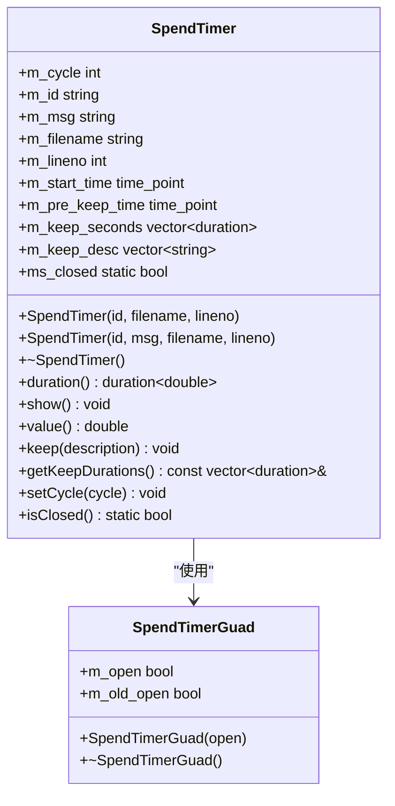
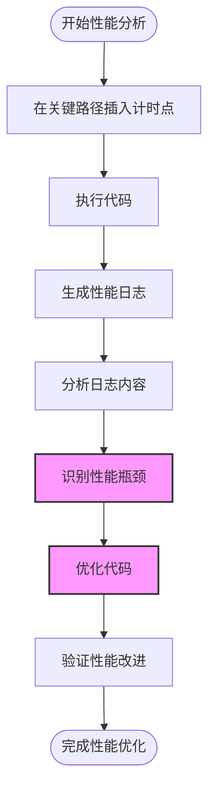
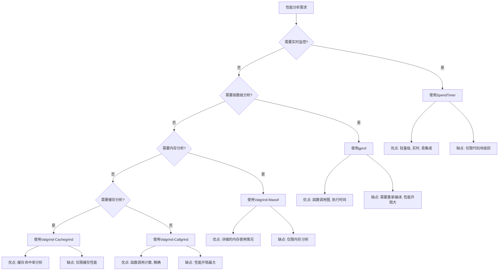
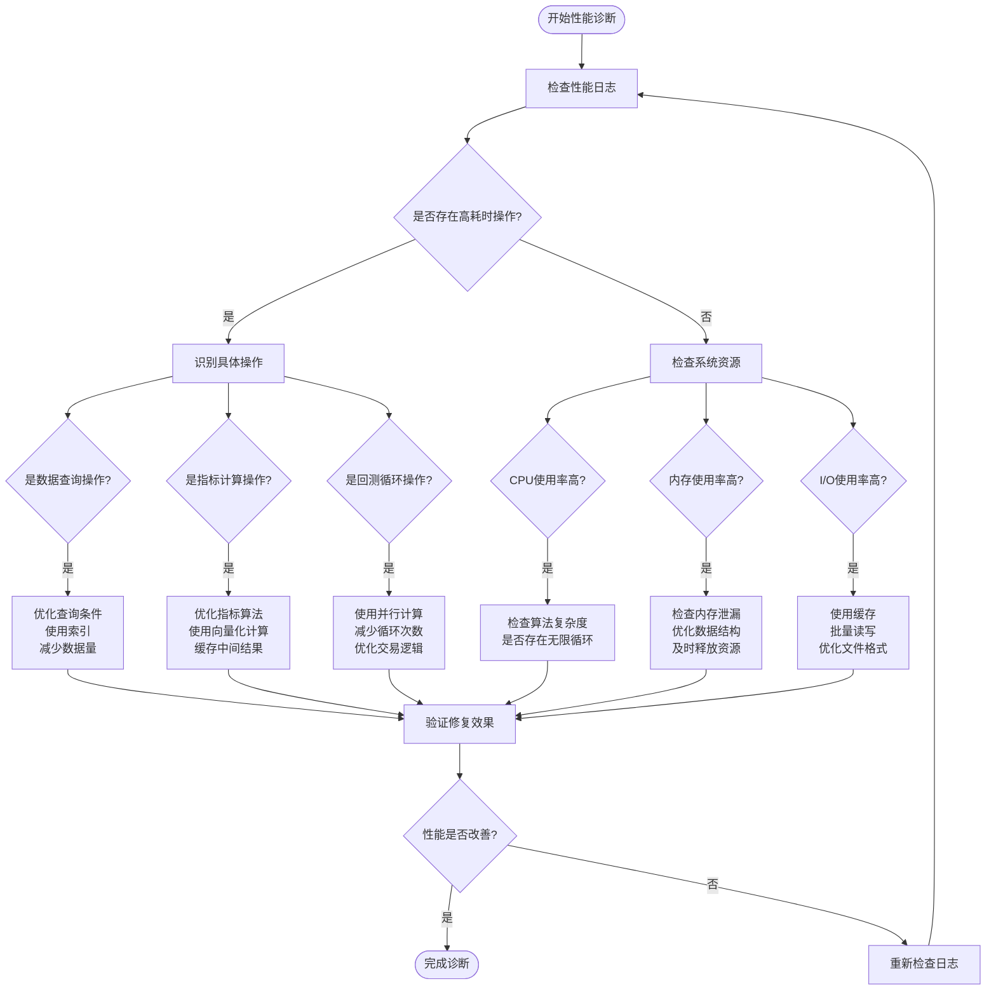

# 性能剖析与监控

<cite>
**本文档引用的文件**
- [SpendTimer.h](file://hikyuu_cpp/hikyuu/utilities/SpendTimer.h)
- [SpendTimer.cpp](file://hikyuu_cpp/hikyuu/utilities/SpendTimer.cpp)
- [Performance.h](file://hikyuu_cpp/hikyuu/trade_manage/Performance.h)
- [Performance.cpp](file://hikyuu_cpp/hikyuu/trade_manage/Performance.cpp)
- [analysis.py](file://hikyuu/analysis/analysis.py)
- [PerformanceOptimalSelector.cpp](file://hikyuu_cpp/hikyuu/trade_sys/selector/imp/optimal/PerformanceOptimalSelector.cpp)
- [analysis_sys.cpp](file://hikyuu_cpp/hikyuu/analysis/analysis_sys.cpp)
</cite>

## 目录
1. [引言](#引言)
2. [SpendTimer工具详解](#spendtimer工具详解)
3. [性能计时点插入实践](#性能计时点插入实践)
4. [性能日志解读](#性能日志解读)
5. [第三方性能分析工具集成](#第三方性能分析工具集成)
6. [常见性能问题诊断](#常见性能问题诊断)
7. [结论](#结论)

## 引言
Hikyuu量化交易框架提供了全面的性能剖析与监控机制，帮助用户定位和解决性能瓶颈。本指南将详细介绍如何使用SpendTimer工具对代码关键路径进行计时分析，通过实际示例展示如何在指标计算、回测循环和数据查询中插入性能计时点。我们将指导用户解读性能日志，识别耗时最长的操作，并推荐第三方性能分析工具与框架的集成方法。最后，提供常见性能问题的诊断流程图和解决方案。

## SpendTimer工具详解

SpendTimer是Hikyuu框架中用于性能剖析的核心工具，它提供了一套完整的宏定义和类实现，用于统计代码块的执行时间。该工具基于C++11的chrono库实现，具有高精度的时间测量能力。

SpendTimer的主要特性包括：
- 支持多种时间单位（纳秒、微秒、毫秒、秒、分钟、小时）的自动转换
- 提供全局开关控制，可动态开启或关闭耗时统计
- 支持基准测试（Benchmark）模式，可统计循环执行的平均时间
- 提供秒表功能，可记录代码块内多个时间点的间隔



**图表来源**
- [SpendTimer.h](file://hikyuu_cpp/hikyuu/utilities/SpendTimer.h#L152-L315)
- [SpendTimer.cpp](file://hikyuu_cpp/hikyuu/utilities/SpendTimer.cpp#L48-L141)

**章节来源**
- [SpendTimer.h](file://hikyuu_cpp/hikyuu/utilities/SpendTimer.h#L61-L315)
- [SpendTimer.cpp](file://hikyuu_cpp/hikyuu/utilities/SpendTimer.cpp#L1-L141)

## 性能计时点插入实践

在Hikyuu框架中，可以通过多种方式插入性能计时点。以下是几种常用的宏定义及其使用方法：

### 基本计时宏
```cpp
// 基本计时器，记录代码块执行时间
SPEND_TIME(id)

// 带输出信息的计时器
SPEND_TIME_MSG(id, "description")

// 秒表计时，记录多个时间点
SPEND_TIME_KEEP(id, "checkpoint description")
```

### 基准测试宏
```cpp
// 基准测试计时器，用于循环执行的性能测试
BENCHMARK_TIME(id, cycle_count)

// 带输出信息的基准测试计时器
BENCHMARK_TIME_MSG(id, cycle_count, "benchmark description")
```

### 全局控制宏
```cpp
// 全局开启耗时统计
OPEN_SPEND_TIME

// 全局关闭耗时统计
CLOSE_SPEND_TIME

// 动态控制耗时统计开关
SPEND_TIME_CONTROL(true)  // 开启
SPEND_TIME_CONTROL(false) // 关闭
```

在实际应用中，我们可以在关键代码路径中插入这些计时点。例如，在回测系统中：

```cpp
void PerformanceOptimalSelector::calculate(const SystemList& pf_realSysList, const KQuery& query) {
    // SPEND_TIME(OptimalSelector_calculate);
    HKU_IF_RETURN(m_calculated && m_query == query, void());
    
    // ... 计算逻辑 ...
    
    _calculate_single(train_ranges, dates, key, mode, test_len, trace);
}
```

在并行计算中：
```cpp
void PerformanceOptimalSelector::_calculate_parallel(
  const vector<std::pair<size_t, size_t>>& train_ranges, const DatetimeList& dates,
  const string& key, int mode, size_t test_len, bool trace) {
    // SPEND_TIME(OptimalSelector_calculate_parallel);
    auto sys_list = parallel_for_index(
      0, train_ranges.size(),
      [this, &train_ranges, &dates, query = m_query, trace, key, mode](size_t i) {
          // ... 并行计算逻辑 ...
      });
}
```

在寻找最优系统时：
```cpp
std::pair<double, SYSPtr> HKU_API findOptimalSystemMulti(const SystemList& sys_list,
                                                         const Stock& stk, const KQuery& query,
                                                         const string& sort_key, int sort_mode) {
    SPEND_TIME(findOptimalSystemMulti);
    // ... 寻找最优系统逻辑 ...
}
```

**章节来源**
- [SpendTimer.h](file://hikyuu_cpp/hikyuu/utilities/SpendTimer.h#L93-L143)
- [PerformanceOptimalSelector.cpp](file://hikyuu_cpp/hikyuu/trade_sys/selector/imp/optimal/PerformanceOptimalSelector.cpp#L51-L51)
- [analysis_sys.cpp](file://hikyuu_cpp/hikyuu/analysis/analysis_sys.cpp#L105-L105)

## 性能日志解读

SpendTimer生成的性能日志包含丰富的信息，帮助开发者识别性能瓶颈。日志输出格式根据是否为基准测试模式而有所不同。

### 基本计时日志格式
```
spend time:   5.234 ms | id description (filename:line_number)
```

### 基准测试日志格式
```
+------------------------------------------------------------------------------
| Benchmark id description (filename:line_number)
+------------------------------------------------------------------------------
| average time (ms): 5.234
|   total time (ms): 523.400
|   run cycle count: 100
+------------------------------------------------------------------------------
```

### 秒表计时日志格式
```
 keep:     0:   1.234 ms - checkpoint 1 description
 keep:     1:   2.345 ms - checkpoint 2 description
 keep:     2:   1.655 ms - checkpoint 3 description
```

日志中的时间单位会根据实际耗时自动选择最合适的单位：
- 小于1微秒：纳秒(ns)
- 1微秒到1毫秒：微秒(us)
- 1毫秒到1秒：毫秒(ms)
- 大于1秒：秒(s)
- 大于60秒：分钟(m)
- 大于86400秒：小时(h)

通过分析这些日志，可以识别出耗时最长的操作。例如，在`PerformanceOptimalSelector`类中，我们可以看到多个性能关键点：

1. `_calculate_single`方法中的单线程计算
2. `_calculate_parallel`方法中的并行计算
3. `findOptimalSystemMulti`方法中的最优系统搜索

这些计时点帮助我们评估不同算法的性能表现，从而进行优化。



**图表来源**
- [SpendTimer.cpp](file://hikyuu_cpp/hikyuu/utilities/SpendTimer.cpp#L85-L122)
- [SpendTimer.h](file://hikyuu_cpp/hikyuu/utilities/SpendTimer.h#L204-L248)

**章节来源**
- [SpendTimer.cpp](file://hikyuu_cpp/hikyuu/utilities/SpendTimer.cpp#L85-L122)
- [SpendTimer.h](file://hikyuu_cpp/hikyuu/utilities/SpendTimer.h#L204-L248)

## 第三方性能分析工具集成

除了内置的SpendTimer工具，Hikyuu框架还可以与多种第三方性能分析工具集成，以提供更深入的性能剖析能力。

### gprof集成
gprof是GNU性能分析工具，可以提供函数调用图和执行时间统计。要与Hikyuu集成，需要在编译时添加`-pg`标志：

```bash
g++ -pg -O2 -o hikyuu hikyuu.cpp
./hikyuu
gprof hikyuu gmon.out > analysis.txt
```

### Valgrind集成
Valgrind是一个功能强大的性能分析和内存调试工具套件，包含多个工具：

1. **Callgrind**: 函数调用计数器
2. **Cachegrind**: 缓存性能分析
3. **Massif**: 堆内存分析

集成示例：
```bash
# 使用Callgrind进行性能分析
valgrind --tool=callgrind --callgrind-out-file=callgrind.out ./hikyuu

# 生成可视化报告
callgrind_annotate callgrind.out

# 或使用kcachegrind可视化
kcachegrind callgrind.out
```

### 性能分析工具选择指南


**图表来源**
- [SpendTimer.h](file://hikyuu_cpp/hikyuu/utilities/SpendTimer.h#L61-L143)

## 常见性能问题诊断

在使用Hikyuu框架进行量化分析时，可能会遇到各种性能问题。以下是常见问题的诊断流程和解决方案。

### 性能问题诊断流程图


### 常见性能问题及解决方案

#### 1. 数据查询性能问题
**问题表现**：数据查询耗时过长，特别是在处理大量历史数据时。

**解决方案**：
- 使用合适的KQuery参数，限制查询范围
- 利用数据库索引优化查询性能
- 考虑使用内存数据库（如SQLite in-memory）进行频繁查询
- 批量获取数据，减少I/O操作次数

#### 2. 指标计算性能问题
**问题表现**：复杂指标计算耗时过长，影响回测效率。

**解决方案**：
- 使用向量化计算替代循环计算
- 缓存中间计算结果，避免重复计算
- 优化算法复杂度，使用更高效的算法
- 利用并行计算加速指标计算

#### 3. 回测循环性能问题
**问题表现**：回测循环执行缓慢，特别是在处理多个股票或长时间序列时。

**解决方案**：
- 使用`parallel_for_index`等并行计算工具
- 减少不必要的计算，优化交易逻辑
- 使用`reset`参数控制组件复位策略
- 考虑使用增量回测而非全量回测

#### 4. 内存使用问题
**问题表现**：内存使用量过大，可能导致系统变慢或崩溃。

**解决方案**：
- 及时释放不再使用的对象
- 使用生成器模式处理大数据集
- 优化数据结构，减少内存占用
- 定期进行内存清理

**章节来源**
- [SpendTimer.h](file://hikyuu_cpp/hikyuu/utilities/SpendTimer.h#L61-L143)
- [PerformanceOptimalSelector.cpp](file://hikyuu_cpp/hikyuu/trade_sys/selector/imp/optimal/PerformanceOptimalSelector.cpp#L51-L214)
- [analysis_sys.cpp](file://hikyuu_cpp/hikyuu/analysis/analysis_sys.cpp#L105-L144)

## 结论
Hikyuu框架提供了强大的性能剖析与监控能力，通过SpendTimer工具可以有效地定位和解决性能瓶颈。我们详细介绍了如何使用SpendTimer在指标计算、回测循环和数据查询中插入性能计时点，并指导用户解读性能日志，识别耗时最长的操作。

通过与第三方性能分析工具（如gprof、Valgrind）的集成，可以进行更深入的性能分析。我们还提供了常见性能问题的诊断流程图和解决方案，帮助用户系统性地解决性能问题。

在实际应用中，建议遵循以下最佳实践：
1. 在开发阶段就启用性能监控，及时发现性能问题
2. 在关键路径上设置合理的计时点，但避免过度计时
3. 定期进行性能分析，特别是在添加新功能后
4. 结合多种性能分析工具，从不同角度评估系统性能
5. 建立性能基线，便于比较不同版本的性能变化

通过这些方法，可以确保Hikyuu框架在处理大规模数据和复杂策略时保持高效和稳定。