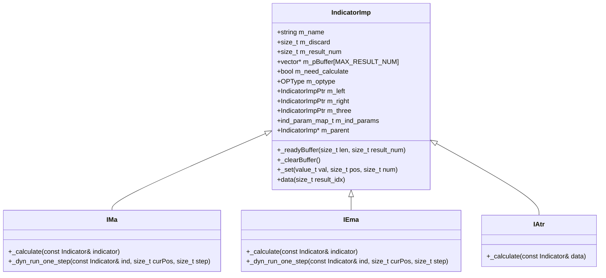
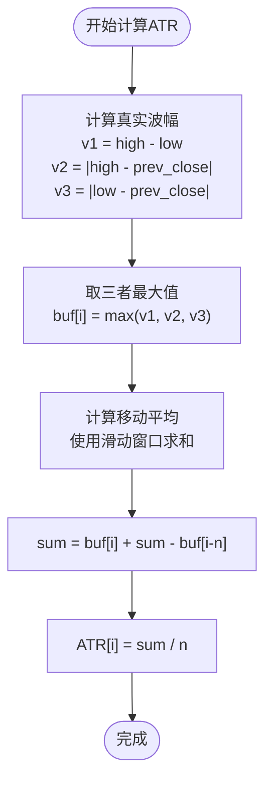
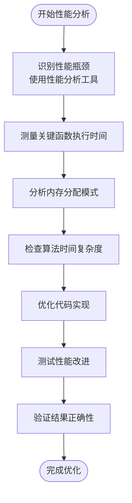

# 计算性能优化

<cite>
**本文档中引用的文件**  
- [IndicatorImp.h](file://hikyuu_cpp/hikyuu/indicator/IndicatorImp.h)
- [IndicatorImp.cpp](file://hikyuu_cpp/hikyuu/indicator/IndicatorImp.cpp)
- [build_in.h](file://hikyuu_cpp/hikyuu/indicator/build_in.h)
- [build_in.cpp](file://hikyuu_cpp/hikyuu/indicator/build_in.cpp)
- [MA.h](file://hikyuu_cpp/hikyuu/indicator/crt/MA.h)
- [EMA.h](file://hikyuu_cpp/hikyuu/indicator/crt/EMA.h)
- [SMA.h](file://hikyuu_cpp/hikyuu/indicator/crt/SMA.h)
- [WMA.h](file://hikyuu_cpp/hikyuu/indicator/crt/WMA.h)
- [IMa.cpp](file://hikyuu_cpp/hikyuu/indicator/imp/IMa.cpp)
- [Iema.cpp](file://hikyuu_cpp/hikyuu/indicator/imp/Iema.cpp)
- [IAtr.cpp](file://hikyuu_cpp/hikyuu/indicator/imp/Iatr.cpp)
- [RSI.cpp](file://hikyuu_cpp/hikyuu/indicator/crt/RSI.cpp)
</cite>

## 目录
1. [引言](#引言)
2. [内存预分配策略](#内存预分配策略)
3. [向量化计算与算法优化](#向量化计算与算法优化)
4. [避免重复计算与内存拷贝](#避免重复计算与内存拷贝)
5. [高性能自定义指标最佳实践](#高性能自定义指标最佳实践)
6. [性能瓶颈分析与优化](#性能瓶颈分析与优化)
7. [结论](#结论)

## 引言

本文深入分析Hikyuu量化框架中C++核心层在技术指标计算方面的性能优化策略。通过研究IndicatorImp类的设计与实现，结合build_in.h中内置指标的具体实现，揭示了如何通过内存预分配、向量化计算和算法复杂度优化来实现极速计算。文档将详细解释这些优化技术，并提供编写高性能自定义指标的最佳实践。

**Section sources**
- [IndicatorImp.h](file://hikyuu_cpp/hikyuu/indicator/IndicatorImp.h#L1-L491)
- [build_in.h](file://hikyuu_cpp/hikyuu/indicator/build_in.h#L1-L135)

## 内存预分配策略

Hikyuu框架通过IndicatorImp类的内存预分配机制显著提升了技术指标的计算性能。该机制的核心在于`_readyBuffer`方法，它在计算开始前一次性分配所有必要的内存空间，避免了在计算过程中频繁的内存分配与释放操作。



**Diagram sources**
- [IndicatorImp.h](file://hikyuu_cpp/hikyuu/indicator/IndicatorImp.h#L28-L489)
- [IMa.cpp](file://hikyuu_cpp/hikyuu/indicator/imp/IMa.cpp#L16-L68)
- [Iema.cpp](file://hikyuu_cpp/hikyuu/indicator/imp/Iema.cpp#L18-L48)
- [IAtr.cpp](file://hikyuu_cpp/hikyuu/indicator/imp/Iatr.cpp#L17-L72)

IndicatorImp类使用固定大小的指针数组`m_pBuffer[MAX_RESULT_NUM]`来管理多个结果集，其中MAX_RESULT_NUM被定义为6。这种设计避免了动态容器的开销，同时通过`_readyBuffer`方法在计算前完成内存分配：

```cpp
void IndicatorImp::_readyBuffer(size_t len, size_t result_num) {
    HKU_CHECK_THROW(result_num <= MAX_RESULT_NUM, std::invalid_argument,
                    "result_num oiverload MAX_RESULT_NUM! {}", name());
    HKU_IF_RETURN(result_num == 0, void());

    value_t null_price = Null<value_t>();
    for (size_t i = 0; i < result_num; ++i) {
        if (!m_pBuffer[i]) {
            m_pBuffer[i] = new vector<value_t>(len, null_price);
        } else {
            m_pBuffer[i]->resize(len);
            for (size_t j = 0; j < len; ++j) {
                (*m_pBuffer[i])[j] = null_price;
            }
        }
    }
    // ... 其他逻辑
}
```

这种预分配策略的优势在于：
1. **减少内存碎片**：一次性分配大块内存，避免了小块内存分配导致的碎片化
2. **提高缓存局部性**：连续的内存布局有利于CPU缓存预取
3. **避免运行时开销**：计算过程中无需再进行内存管理操作

**Section sources**
- [IndicatorImp.h](file://hikyuu_cpp/hikyuu/indicator/IndicatorImp.h#L110-L111)
- [IndicatorImp.cpp](file://hikyuu_cpp/hikyuu/indicator/IndicatorImp.cpp#L235-L261)

## 向量化计算与算法优化

Hikyuu框架通过精心设计的算法实现了高效的向量化计算，显著提升了技术指标的计算速度。以移动平均线（MA）和指数移动平均线（EMA）为例，展示了如何通过算法优化避免重复计算。

### 移动平均线（MA）的优化实现

IMa类的`_calculate`方法实现了高效的简单移动平均计算。对于周期n大于0的情况，算法采用滑动窗口的方式，通过增量更新避免了重复求和：

```cpp
void IMa::_calculate(const Indicator& indicator) {
    // ... 初始化代码
    
    int n = getParam<int>("n");
    if (n <= 0) {
        price_t sum = 0.0;
        for (size_t i = m_discard; i < total; i++) {
            if (!std::isnan(src[i])) {
                sum += src[i];
                dst[i] = sum / (i - m_discard + 1);
            }
        }
        return;
    }

    size_t startPos = m_discard;
    price_t sum = 0.0;
    size_t count = 1;
    size_t first_end = startPos + n >= total ? total : startPos + n;
    for (size_t i = startPos; i < first_end; ++i) {
        if (!std::isnan(src[i])) {
            sum += src[i];
            dst[i] = sum / count++;
        }
    }

    for (size_t i = first_end; i < total; ++i) {
        if (!std::isnan(src[i]) && !std::isnan(src[i - n])) {
            sum = src[i] + sum - src[i - n];  // 关键优化：增量更新
            dst[i] = sum / n;
        }
    }
}
```

这种算法将时间复杂度从O(n²)降低到O(n)，通过维护一个运行总和，每次只需减去离开窗口的元素值并加上新进入窗口的元素值。

### 指数移动平均线（EMA）的优化实现

IEma类的`_calculate`方法实现了指数移动平均线的高效计算。该算法利用EMA的递推关系，避免了复杂的加权求和：

```cpp
void IEma::_calculate(const Indicator& indicator) {
    // ... 初始化代码
    
    auto const* src = indicator.data();
    auto* dst = this->data();

    int n = getParam<int>("n");
    size_t startPos = discard();
    dst[startPos] = src[startPos];

    price_t multiplier = 2.0 / (n + 1);
    for (size_t i = startPos + 1; i < total; ++i) {
        dst[i] = (src[i] - dst[i - 1]) * multiplier + dst[i - 1];  // 递推公式
    }
}
```

这种方法的时间复杂度为O(n)，且计算过程非常简洁，充分利用了EMA的数学特性。

### ATR指标的复合计算优化

IAtr类展示了如何优化复合指标的计算。ATR（Average True Range）需要先计算真实波幅，再计算其移动平均：



**Diagram sources**
- [IAtr.cpp](file://hikyuu_cpp/hikyuu/indicator/imp/Iatr.cpp#L35-L72)

这种分步计算策略避免了在单个循环中重复计算相同的数据，提高了代码的可读性和执行效率。

**Section sources**
- [IMa.cpp](file://hikyuu_cpp/hikyuu/indicator/imp/IMa.cpp#L28-L68)
- [Iema.cpp](file://hikyuu_cpp/hikyuu/indicator/imp/Iema.cpp#L30-L48)
- [IAtr.cpp](file://hikyuu_cpp/hikyuu/indicator/imp/Iatr.cpp#L35-L72)

## 避免重复计算与内存拷贝

Hikyuu框架通过多种机制有效避免了重复计算和不必要的内存拷贝，进一步提升了性能。

### 指标树优化与缓存机制

IndicatorImp类通过`needCalculate()`方法实现了智能的重新计算判断，避免了不必要的重复计算：

```cpp
bool IndicatorImp::needCalculate() {
    if (m_need_calculate) {
        return true;
    }

    if (m_left) {
        m_need_calculate = m_left->needCalculate();
        if (m_need_calculate) {
            return true;
        }
    }

    if (m_right) {
        m_need_calculate = m_right->needCalculate();
        if (m_need_calculate) {
            return true;
        }
    }

    for (auto iter = m_ind_params.begin(); iter != m_ind_params.end(); ++iter) {
        m_need_calculate = iter->second->needCalculate();
        if (m_need_calculate) {
            return true;
        }
    }

    return false;
}
```

这个方法递归检查整个指标树，只有当任何子节点需要重新计算时才触发重新计算，大大减少了不必要的计算开销。

### 内存访问优化

IndicatorImp类提供了直接内存访问接口，避免了数据拷贝：

```cpp
inline IndicatorImp::value_t* IndicatorImp::data(size_t result_idx) {
    return m_pBuffer[result_idx] ? m_pBuffer[result_idx]->data() : nullptr;
}

inline IndicatorImp::value_t const* IndicatorImp::data(size_t result_idx) const {
    return m_pBuffer[result_idx] ? m_pBuffer[result_idx]->data() : nullptr;
}
```

这些内联函数返回原始指针，允许直接访问底层数据，避免了通过getter方法逐个访问元素的开销。

### RSI指标的复合计算优化

RSI.cpp文件展示了如何通过指标组合避免重复计算：

```cpp
Indicator HKU_API RSI(int n) {
    Indicator diff = REF(0) - REF(1);
    Indicator u = IF(diff > 0, diff, 0);
    Indicator d = IF(diff < 0, (-1) * diff, 0);
    Indicator ema_u = EMA(u, n);
    Indicator ema_d = EMA(d, n);
    ema_d = IF(ema_d == 0.0, 1, ema_d);
    Indicator rs = ema_u / ema_d;
    Indicator _1 = CVAL(1);
    Indicator rsi = (_1 - _1 / (_1 + rs)) * CVAL(100);
    rsi.name("RSI");
    rsi.setParam<int>("n", n);
    return rsi;
}
```

这种实现方式将复杂的RSI计算分解为多个简单的指标操作，每个子指标都可以独立优化和缓存，避免了在单个函数中重复计算相同的数据。

**Section sources**
- [IndicatorImp.cpp](file://hikyuu_cpp/hikyuu/indicator/IndicatorImp.cpp#L681-L716)
- [IndicatorImp.h](file://hikyuu_cpp/hikyuu/indicator/IndicatorImp.h#L455-L461)
- [RSI.cpp](file://hikyuu_cpp/hikyuu/indicator/crt/RSI.cpp#L17-L31)

## 高性能自定义指标最佳实践

基于Hikyuu框架的设计理念，以下是编写高性能自定义指标的最佳实践。

### 使用正确的数据结构

1. **优先使用预分配内存**：继承IndicatorImp类并重写`_readyBuffer`方法，确保在计算前完成内存分配
2. **避免动态容器**：使用固定大小的数组或预分配的vector，避免在计算过程中动态调整大小
3. **利用缓存友好性**：保持数据的连续内存布局，提高CPU缓存命中率

### 减少函数调用开销

1. **使用内联函数**：对于简单的计算逻辑，使用内联函数减少函数调用开销
2. **批量处理数据**：尽量在单个循环中完成多个计算步骤，减少循环开销
3. **避免虚函数调用**：在性能关键路径上，考虑使用模板或宏来避免虚函数调用

### 利用编译器优化

1. **启用编译器优化**：确保编译时启用-O2或-O3优化级别
2. **使用const和restrict关键字**：帮助编译器进行更好的优化
3. **避免分支预测失败**：尽量减少条件分支，或确保分支具有良好的预测性

### 示例：高性能自定义指标模板

```cpp
class MyIndicator : public IndicatorImp {
public:
    MyIndicator() : IndicatorImp("MyIndicator", 1) {
        setParam<int>("period", 20);
    }

    virtual void _calculate(const Indicator& data) override {
        size_t total = data.size();
        m_discard = getParam<int>("period");
        if (m_discard >= total) return;

        auto const* src = data.data();
        auto* dst = this->data();
        
        // 使用增量计算避免重复求和
        price_t sum = 0.0;
        for (size_t i = m_discard; i < m_discard + getParam<int>("period"); ++i) {
            sum += src[i];
        }
        
        for (size_t i = m_discard + getParam<int>("period"); i < total; ++i) {
            sum = sum - src[i - getParam<int>("period")] + src[i];
            dst[i] = sum / getParam<int>("period");
        }
    }

    virtual IndicatorImpPtr _clone() override {
        return make_shared<MyIndicator>();
    }
};
```

**Section sources**
- [IndicatorImp.h](file://hikyuu_cpp/hikyuu/indicator/IndicatorImp.h#L152-L153)
- [IMa.cpp](file://hikyuu_cpp/hikyuu/indicator/imp/IMa.cpp#L16-L68)

## 性能瓶颈分析与优化

为了有效分析和优化技术指标的性能瓶颈，可以采用以下方法。

### 性能分析流程



**Diagram sources**
- [IndicatorImp.cpp](file://hikyuu_cpp/hikyuu/indicator/IndicatorImp.cpp#L743-L752)

### 常见性能瓶颈及解决方案

| 性能瓶颈 | 影响 | 解决方案 |
|---------|------|---------|
| 频繁内存分配 | 增加GC压力，降低性能 | 使用内存预分配 |
| 重复计算 | 增加计算时间 | 实现缓存机制 |
| 非最优算法 | 时间复杂度高 | 选择更高效的算法 |
| 内存拷贝 | 增加数据传输开销 | 使用指针直接访问 |
| 函数调用开销 | 增加执行时间 | 使用内联函数 |

### 性能测试示例

可以通过对比不同实现方式的性能来验证优化效果：

```cpp
// 测试不同MA实现的性能
void test_performance() {
    KData kdata = StockManager::instance().getStock("SH000001").getKData(KQuery::DAY());
    Indicator close = kdata.close();
    
    auto start = std::chrono::high_resolution_clock::now();
    for (int i = 0; i < 1000; ++i) {
        Indicator ma = MA(close, 20);
        ma.calculate();
    }
    auto end = std::chrono::high_resolution_clock::now();
    
    auto duration = std::chrono::duration_cast<std::chrono::microseconds>(end - start);
    HKU_INFO("MA计算耗时: {} 微秒", duration.count());
}
```

**Section sources**
- [IndicatorImp.cpp](file://hikyuu_cpp/hikyuu/indicator/IndicatorImp.cpp#L743-L752)

## 结论

Hikyuu框架通过精心设计的C++核心层实现了高效的技术指标计算。其性能优化策略主要包括：

1. **内存预分配**：通过`_readyBuffer`方法在计算前一次性分配所有必要内存，避免了运行时的内存管理开销
2. **向量化计算**：采用滑动窗口、递推公式等算法优化，将时间复杂度从O(n²)降低到O(n)
3. **避免重复计算**：通过指标树优化和缓存机制，智能判断是否需要重新计算
4. **减少内存拷贝**：提供直接内存访问接口，避免不必要的数据复制

这些优化策略共同作用，使得Hikyuu能够高效处理大规模金融数据，为量化分析提供了坚实的基础。开发者在编写自定义指标时，应遵循这些最佳实践，充分利用框架提供的性能优化机制。

**Section sources**
- [IndicatorImp.h](file://hikyuu_cpp/hikyuu/indicator/IndicatorImp.h#L1-L491)
- [build_in.h](file://hikyuu_cpp/hikyuu/indicator/build_in.h#L1-L135)