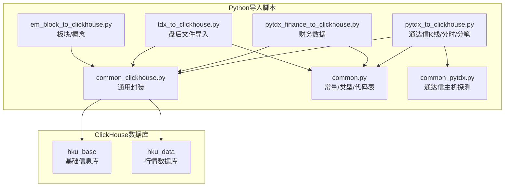
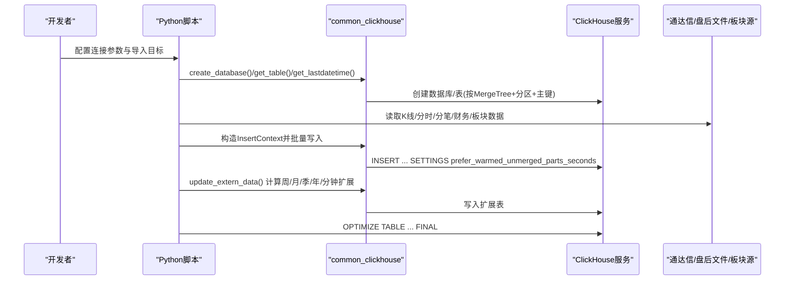
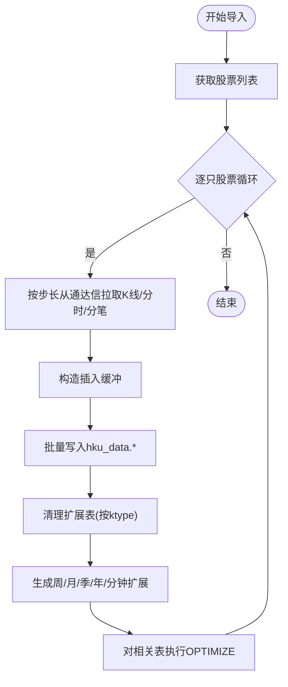
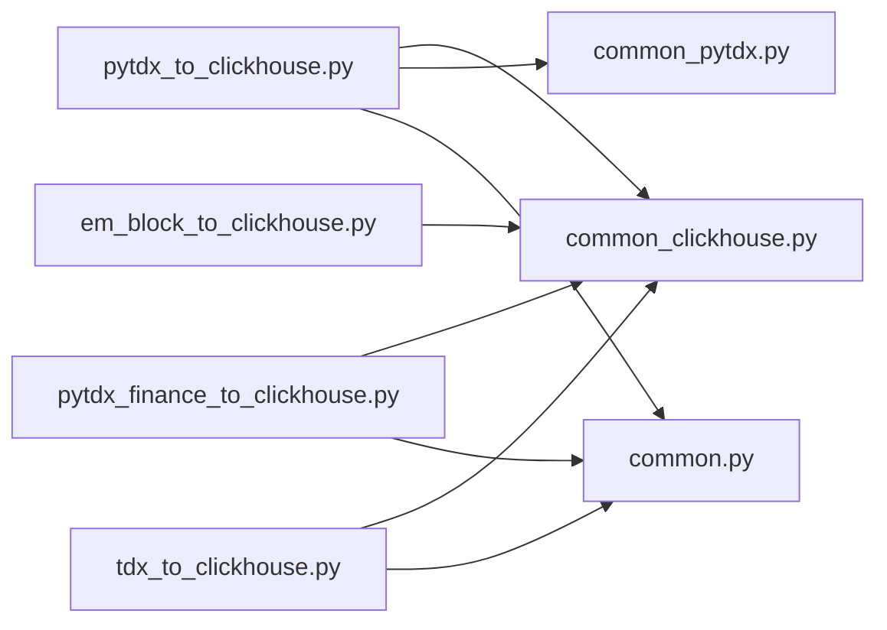

# ClickHouse列式存储

<cite>
**本文引用的文件**
- [createdb.sql](file://hikyuu/data/clickhouse_upgrade/createdb.sql)
- [common_clickhouse.py](file://hikyuu/data/common_clickhouse.py)
- [pytdx_to_clickhouse.py](file://hikyuu/data/pytdx_to_clickhouse.py)
- [pytdx_finance_to_clickhouse.py](file://hikyuu/data/pytdx_finance_to_clickhouse.py)
- [em_block_to_clickhouse.py](file://hikyuu/data/em_block_to_clickhouse.py)
- [common.py](file://hikyuu/data/common.py)
- [common_pytdx.py](file://hikyuu/data/common_pytdx.py)
- [tdx_to_clickhouse.py](file://hikyuu/data/tdx_to_clickhouse.py)
</cite>

## 目录
1. [简介](#简介)
2. [项目结构](#项目结构)
3. [核心组件](#核心组件)
4. [架构总览](#架构总览)
5. [详细组件分析](#详细组件分析)
6. [依赖关系分析](#依赖关系分析)
7. [性能考量](#性能考量)
8. [故障排查指南](#故障排查指南)
9. [结论](#结论)
10. [附录](#附录)

## 简介
本文件面向希望使用ClickHouse进行金融大数据存储与分析的用户，系统化梳理了Hikyuu项目中基于Python脚本与ClickHouse交互的实现方式，重点覆盖：
- ClickHouse数据库与表结构设计（列式存储、分区与主键、压缩设置）
- 数据导入工具链（pytdx_to_clickhouse.py、pytdx_finance_to_clickhouse.py、em_block_to_clickhouse.py、tdx_to_clickhouse.py）
- 时间序列分析场景下的查询性能优势（列式扫描、聚合与范围查询）
- 连接参数配置、数据分区策略优化与分布式部署建议

## 项目结构
围绕ClickHouse的金融数据存储与导入，主要涉及以下模块：
- 数据库与表定义：hku_base（基础库）、hku_data（行情库）
- 通用ClickHouse访问封装：common_clickhouse.py
- 从通达信源导入数据：pytdx_to_clickhouse.py、pytdx_finance_to_clickhouse.py、tdx_to_clickhouse.py
- 板块与概念数据导入：em_block_to_clickhouse.py
- 通用常量与辅助：common.py、common_pytdx.py

图表来源
- [common_clickhouse.py](file://hikyuu/data/common_clickhouse.py#L1-L120)
- [pytdx_to_clickhouse.py](file://hikyuu/data/pytdx_to_clickhouse.py#L1-L120)
- [pytdx_finance_to_clickhouse.py](file://hikyuu/data/pytdx_finance_to_clickhouse.py#L1-L65)
- [tdx_to_clickhouse.py](file://hikyuu/data/tdx_to_clickhouse.py#L1-L60)
- [em_block_to_clickhouse.py](file://hikyuu/data/em_block_to_clickhouse.py#L1-L50)
- [common.py](file://hikyuu/data/common.py#L1-L120)
- [common_pytdx.py](file://hikyuu/data/common_pytdx.py#L1-L60)

章节来源
- [common_clickhouse.py](file://hikyuu/data/common_clickhouse.py#L1-L120)
- [pytdx_to_clickhouse.py](file://hikyuu/data/pytdx_to_clickhouse.py#L1-L120)
- [pytdx_finance_to_clickhouse.py](file://hikyuu/data/pytdx_finance_to_clickhouse.py#L1-L65)
- [tdx_to_clickhouse.py](file://hikyuu/data/tdx_to_clickhouse.py#L1-L60)
- [em_block_to_clickhouse.py](file://hikyuu/data/em_block_to_clickhouse.py#L1-L50)
- [common.py](file://hikyuu/data/common.py#L1-L120)
- [common_pytdx.py](file://hikyuu/data/common_pytdx.py#L1-L60)

## 核心组件
- 数据库与表
  - hku_base：基础信息库，包含市场、股票、财务字段、板块/概念等
  - hku_data：行情库，包含日线、周线、月线、季线、半年线、年线、分钟线、小时线、分时、分笔等
- 通用封装
  - 数据库初始化、版本升级、表映射、最后记录查询、扩展指标计算、插入上下文构建
- 导入工具
  - 通达信K线/分时/分笔导入
  - 财务数据导入
  - 盘后文件导入
  - 板块/概念导入

章节来源
- [createdb.sql](file://hikyuu/data/clickhouse_upgrade/createdb.sql#L1-L120)
- [common_clickhouse.py](file://hikyuu/data/common_clickhouse.py#L85-L170)
- [pytdx_to_clickhouse.py](file://hikyuu/data/pytdx_to_clickhouse.py#L423-L538)
- [pytdx_finance_to_clickhouse.py](file://hikyuu/data/pytdx_finance_to_clickhouse.py#L30-L65)
- [tdx_to_clickhouse.py](file://hikyuu/data/tdx_to_clickhouse.py#L130-L200)
- [em_block_to_clickhouse.py](file://hikyuu/data/em_block_to_clickhouse.py#L12-L52)

## 架构总览
ClickHouse在本项目中承担“高性能列式存储”的角色，配合Python脚本完成数据采集、清洗、入库与扩展指标生成。整体流程如下：

图表来源
- [common_clickhouse.py](file://hikyuu/data/common_clickhouse.py#L48-L120)
- [pytdx_to_clickhouse.py](file://hikyuu/data/pytdx_to_clickhouse.py#L423-L538)
- [pytdx_finance_to_clickhouse.py](file://hikyuu/data/pytdx_finance_to_clickhouse.py#L30-L65)
- [tdx_to_clickhouse.py](file://hikyuu/data/tdx_to_clickhouse.py#L130-L200)
- [em_block_to_clickhouse.py](file://hikyuu/data/em_block_to_clickhouse.py#L12-L52)

## 详细组件分析

### 数据库与表结构（列式存储、分区与主键）
- 数据库
  - hku_base：基础信息库，用于存放市场、股票、财务字段、板块/概念等
  - hku_data：行情库，用于存放各类K线与扩展指标
- 表设计要点
  - 引擎：MergeTree（列式、压缩、合并树）
  - 主键：(market, code, date)，确保按市场+代码+时间排序
  - 分区：按market或按(市场, 年)区间，便于冷热分离与快速裁剪
  - 排序：ORDER BY (market, code, date)，提升范围查询与聚合效率
  - 压缩：index_granularity较大（如2048或1024），平衡压缩比与查询性能
- 关键表
  - hku_data.day_k、week_k、month_k、quarter_k、halfyear_k、year_k
  - hku_data.min_k、min5_k、min15_k、min30_k、min60_k、hour2_k
  - hku_data.timeline（分时）、hku_data.transdata（分笔）

章节来源
- [createdb.sql](file://hikyuu/data/clickhouse_upgrade/createdb.sql#L881-L1085)

### 通用封装（common_clickhouse.py）
- 功能
  - create_database：读取createdb.sql并执行，支持版本升级
  - get_table：将ktype映射到具体表名（day/week/month/…/min/min5/…/timeline/transdata）
  - get_lastdatetime/get_last_krecord：查询最后记录，支持UTC偏移
  - update_extern_data：按日线或5分钟线生成周/月/季/年/分钟扩展表
  - 插入上下文：create_insert_context + insert，支持settings传参
- 性能设置
  - prefer_warmed_unmerged_parts_seconds：预热未合并部分，降低首次查询延迟
  - optimize_skip_merged_partitions：查询时跳过已合并分区，提高扫描速度

章节来源
- [common_clickhouse.py](file://hikyuu/data/common_clickhouse.py#L48-L120)
- [common_clickhouse.py](file://hikyuu/data/common_clickhouse.py#L115-L170)
- [common_clickhouse.py](file://hikyuu/data/common_clickhouse.py#L352-L436)

### 通达信K线/分时/分笔导入（pytdx_to_clickhouse.py）
- 流程
  - 获取股票列表（基于hku_base.stock）
  - 计算步长与批次（按年份/天数估算，避免一次性拉取过多）
  - 从通达信API获取K线/分时/分笔，构造插入缓冲
  - 使用InsertContext批量写入，设置预热参数
  - 清理扩展表并增量写入，最后对各表执行OPTIMIZE
- 关键点
  - 日期/时间戳转换与精度处理（价格/成交量放大1000倍存储）
  - 最后记录一致性校验，避免重复或错位
  - 支持按日线与5分钟线分别生成扩展指标

图表来源
- [pytdx_to_clickhouse.py](file://hikyuu/data/pytdx_to_clickhouse.py#L423-L538)
- [pytdx_to_clickhouse.py](file://hikyuu/data/pytdx_to_clickhouse.py#L245-L368)
- [pytdx_to_clickhouse.py](file://hikyuu/data/pytdx_to_clickhouse.py#L540-L751)

章节来源
- [pytdx_to_clickhouse.py](file://hikyuu/data/pytdx_to_clickhouse.py#L191-L243)
- [pytdx_to_clickhouse.py](file://hikyuu/data/pytdx_to_clickhouse.py#L245-L368)
- [pytdx_to_clickhouse.py](file://hikyuu/data/pytdx_to_clickhouse.py#L423-L538)
- [pytdx_to_clickhouse.py](file://hikyuu/data/pytdx_to_clickhouse.py#L540-L751)

### 财务数据导入（pytdx_finance_to_clickhouse.py）
- 功能
  - 从通达信获取财务数据，去重后批量写入hku_base.stkfinance
  - 历史财务数据按文件日期分片，支持删除旧分片后重新导入
- 使用建议
  - 定期增量导入，避免重复写入
  - 历史财务表按report_date+file_date建立主键，便于范围查询

章节来源
- [pytdx_finance_to_clickhouse.py](file://hikyuu/data/pytdx_finance_to_clickhouse.py#L30-L65)
- [pytdx_finance_to_clickhouse.py](file://hikyuu/data/pytdx_finance_to_clickhouse.py#L67-L80)

### 盘后文件导入（tdx_to_clickhouse.py）
- 适用场景
  - 从通达信盘后文件直接导入日线/分钟线
- 关键步骤
  - 解析二进制文件头与记录
  - 过滤无效数据（价格合法性、成交量非负）
  - 查询最后记录，避免重复
  - 批量写入对应表

章节来源
- [tdx_to_clickhouse.py](file://hikyuu/data/tdx_to_clickhouse.py#L167-L200)
- [tdx_to_clickhouse.py](file://hikyuu/data/tdx_to_clickhouse.py#L130-L166)

### 板块/概念导入（em_block_to_clickhouse.py）
- 功能
  - 下载板块/概念信息，清空对应分类后批量写入
  - 支持板块与板块指数的映射
- 使用建议
  - 定期同步，保证分析维度完整

章节来源
- [em_block_to_clickhouse.py](file://hikyuu/data/em_block_to_clickhouse.py#L12-L52)

### 通用常量与辅助（common.py、common_pytdx.py）
- 常量
  - MARKET、STOCKTYPE：市场与股票类型枚举
  - get_a_stktype_list/get_stktype_list：根据行情类别筛选类型
- 通达信辅助
  - 主机探测与连通性测试
  - 代码表获取（股票/指数/基金/债券）

章节来源
- [common.py](file://hikyuu/data/common.py#L33-L91)
- [common.py](file://hikyuu/data/common.py#L93-L148)
- [common_pytdx.py](file://hikyuu/data/common_pytdx.py#L46-L99)

## 依赖关系分析
- 组件耦合
  - 所有导入脚本均依赖common_clickhouse.py提供的表映射、插入上下文与扩展指标生成
  - 通达信数据源依赖common_pytdx.py的主机选择与连通性探测
  - 代码表与类型依赖common.py的枚举与过滤逻辑
- 外部依赖
  - clickhouse_connect：HTTP客户端
  - pytdx：通达信行情API
  - akshare：部分代码表与节假日数据

图表来源
- [pytdx_to_clickhouse.py](file://hikyuu/data/pytdx_to_clickhouse.py#L30-L44)
- [pytdx_finance_to_clickhouse.py](file://hikyuu/data/pytdx_finance_to_clickhouse.py#L25-L31)
- [tdx_to_clickhouse.py](file://hikyuu/data/tdx_to_clickhouse.py#L36-L41)
- [em_block_to_clickhouse.py](file://hikyuu/data/em_block_to_clickhouse.py#L1-L11)
- [common_clickhouse.py](file://hikyuu/data/common_clickhouse.py#L1-L35)
- [common_pytdx.py](file://hikyuu/data/common_pytdx.py#L1-L35)
- [common.py](file://hikyuu/data/common.py#L1-L32)

章节来源
- [pytdx_to_clickhouse.py](file://hikyuu/data/pytdx_to_clickhouse.py#L30-L44)
- [pytdx_finance_to_clickhouse.py](file://hikyuu/data/pytdx_finance_to_clickhouse.py#L25-L31)
- [tdx_to_clickhouse.py](file://hikyuu/data/tdx_to_clickhouse.py#L36-L41)
- [em_block_to_clickhouse.py](file://hikyuu/data/em_block_to_clickhouse.py#L1-L11)
- [common_clickhouse.py](file://hikyuu/data/common_clickhouse.py#L1-L35)
- [common_pytdx.py](file://hikyuu/data/common_pytdx.py#L1-L35)
- [common.py](file://hikyuu/data/common.py#L1-L32)

## 性能考量
- 列式存储与高压缩
  - MergeTree按列存储，数值型字段（价格、成交量）采用整型压缩，显著降低存储与IO
  - index_granularity较大（如2048/1024），提升压缩比并改善顺序扫描性能
- 分区与主键
  - 按market或(市场, 年)分区，便于裁剪与冷热分离
  - 主键(market, code, date)+ORDER BY保证范围查询与聚合的局部性
- 批量写入与预热
  - 批量插入+prefer_warmed_unmerged_parts_seconds，降低首次查询延迟
  - 对扩展表执行OPTIMIZE TABLE ... FINAL，合并段并提升查询稳定性
- 查询优化建议
  - 聚合类查询尽量走主键范围，避免全表扫描
  - 使用分区裁剪（按日期范围）与索引粒度优化（optimize_skip_merged_partitions）
  - 对高频指标（如周/月/年K线）提前生成扩展表，避免在线聚合

章节来源
- [createdb.sql](file://hikyuu/data/clickhouse_upgrade/createdb.sql#L881-L1085)
- [common_clickhouse.py](file://hikyuu/data/common_clickhouse.py#L147-L170)
- [pytdx_to_clickhouse.py](file://hikyuu/data/pytdx_to_clickhouse.py#L363-L368)
- [pytdx_to_clickhouse.py](file://hikyuu/data/pytdx_to_clickhouse.py#L504-L537)

## 故障排查指南
- 连接问题
  - 确认clickhouse_connect客户端参数（host/port/username/password）
  - 若使用HTTP端口，请检查防火墙与服务监听
- 数据重复或错位
  - 检查最后记录一致性校验逻辑，避免重复写入
  - 校验时间戳转换与精度处理（价格/成交量放大1000倍）
- 插入性能低
  - 确认批量大小与prefer_warmed_unmerged_parts_seconds设置
  - 分批导入并定期执行OPTIMIZE
- 代码表/类型不匹配
  - 使用get_stktype_list按行情类别过滤，避免无关类型参与导入
- 通达信源不稳定
  - 使用common_pytdx.py的主机探测与连通性测试，选择最优节点

章节来源
- [pytdx_to_clickhouse.py](file://hikyuu/data/pytdx_to_clickhouse.py#L311-L362)
- [pytdx_to_clickhouse.py](file://hikyuu/data/pytdx_to_clickhouse.py#L363-L368)
- [common_pytdx.py](file://hikyuu/data/common_pytdx.py#L52-L99)
- [common.py](file://hikyuu/data/common.py#L62-L91)

## 结论
通过列式存储与合理的分区、主键与压缩策略，结合批量写入与扩展指标预计算，ClickHouse在金融时间序列数据的存储与查询方面具备显著优势。本项目提供了完整的从通达信源到ClickHouse的导入链路，覆盖K线、分时、分笔、财务与板块等多维数据，适合超大规模金融数据的高效分析与回测。

## 附录

### 数据库与表创建脚本（createdb.sql）概览
- hku_base：市场、股票、财务字段、板块/概念、节假日等
- hku_data：日线、周线、月线、季线、半年线、年线、分钟线、小时线、分时、分笔
- 关键设计：MergeTree引擎、主键(market, code, date)、分区策略、index_granularity

章节来源
- [createdb.sql](file://hikyuu/data/clickhouse_upgrade/createdb.sql#L1-L120)
- [createdb.sql](file://hikyuu/data/clickhouse_upgrade/createdb.sql#L881-L1085)

### 数据导入工具使用方法
- 通达信K线/分时/分笔
  - 步骤：创建数据库→连接通达信→导入股票代码→按市场/类型循环导入→清理扩展→生成扩展→OPTIMIZE
  - 参考路径：[pytdx_to_clickhouse.py](file://hikyuu/data/pytdx_to_clickhouse.py#L423-L538)
- 财务数据
  - 步骤：按市场筛选有效股票→获取财务数据→去重写入→历史财务按文件日期分片
  - 参考路径：[pytdx_finance_to_clickhouse.py](file://hikyuu/data/pytdx_finance_to_clickhouse.py#L30-L65)
- 盘后文件
  - 步骤：解析二进制文件→过滤无效记录→查询最后记录→批量写入
  - 参考路径：[tdx_to_clickhouse.py](file://hikyuu/data/tdx_to_clickhouse.py#L167-L200)
- 板块/概念
  - 步骤：下载板块信息→清空对应分类→批量写入→写入板块指数
  - 参考路径：[em_block_to_clickhouse.py](file://hikyuu/data/em_block_to_clickhouse.py#L12-L52)

### ClickHouse连接参数配置建议
- 基本参数
  - host/port/username/password
  - 如使用HTTP端口，确认服务监听与防火墙放行
- 导入优化参数
  - prefer_warmed_unmerged_parts_seconds：预热未合并部分，降低首次查询延迟
  - mutations_sync/optimize_skip_merged_partitions：控制写入与查询行为
- 分布式部署建议
  - 使用ReplicatedMergeTree或分布式表引擎，结合副本与分片策略
  - 合理设置分区键与主键，确保热点均匀分布
  - 对高频查询表启用预聚合与物化视图

章节来源
- [pytdx_to_clickhouse.py](file://hikyuu/data/pytdx_to_clickhouse.py#L363-L368)
- [common_clickhouse.py](file://hikyuu/data/common_clickhouse.py#L147-L170)