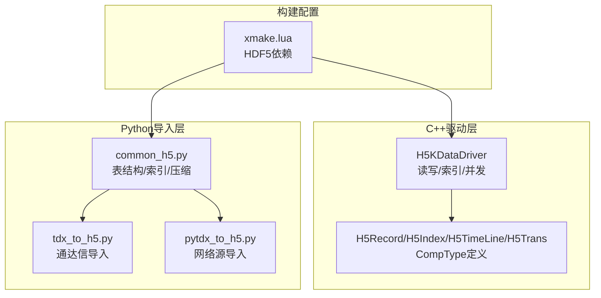
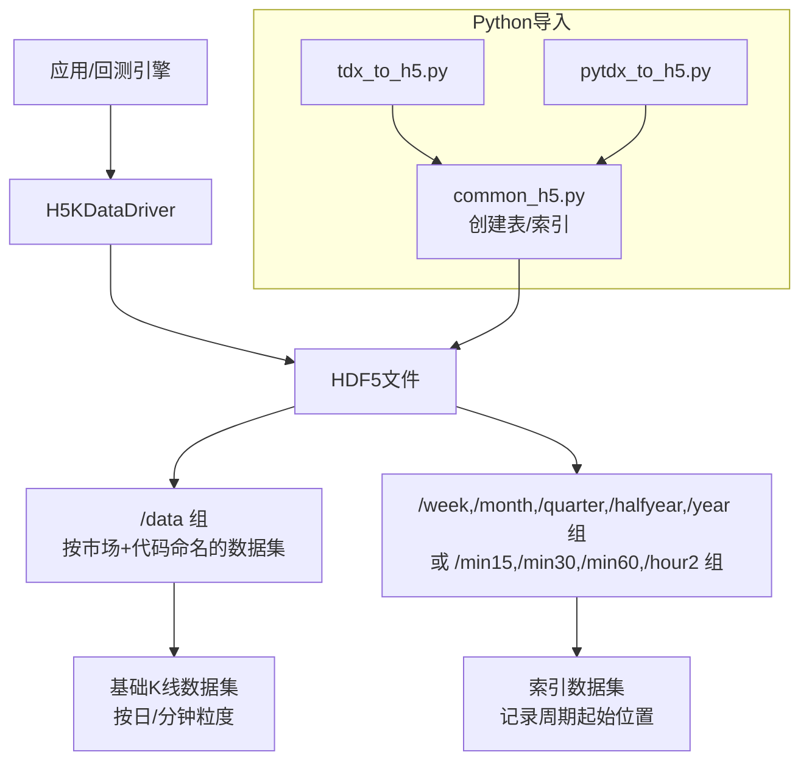
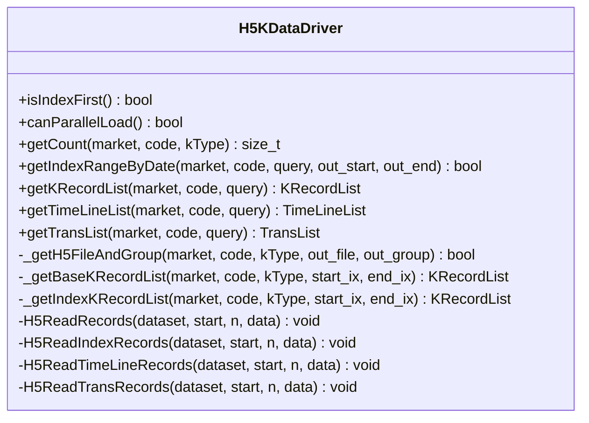
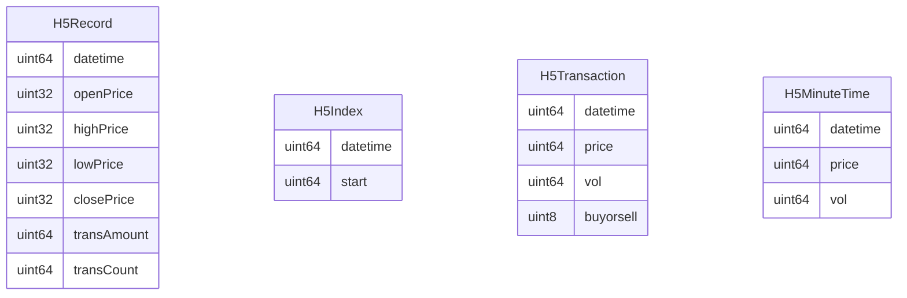
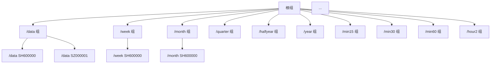
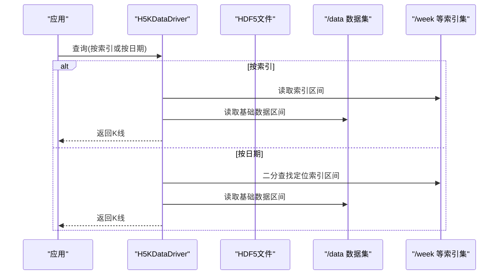
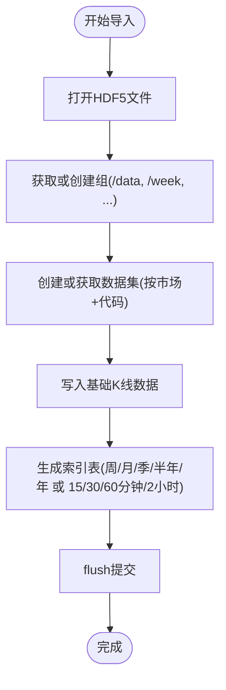
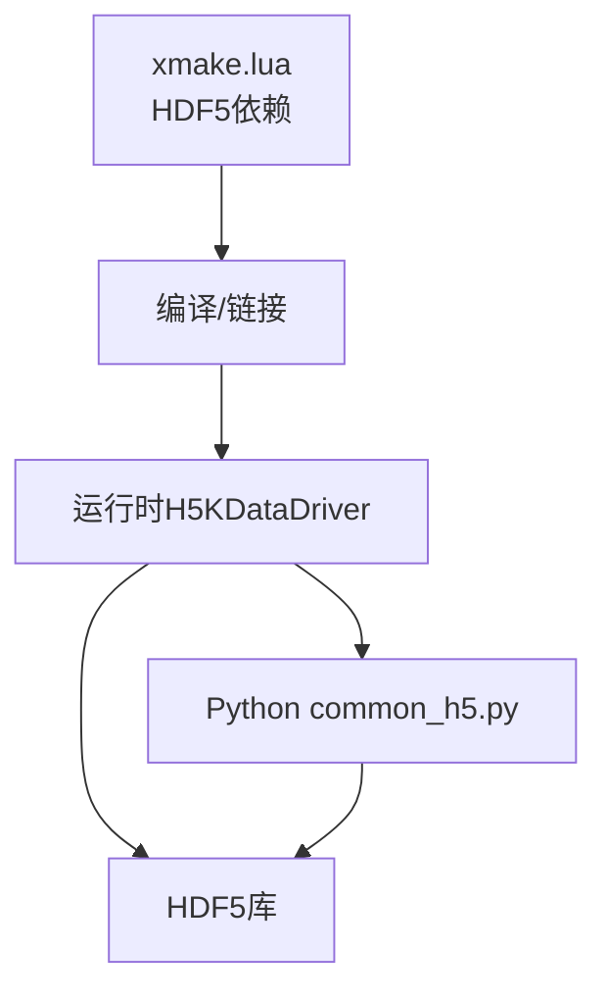

# HDF5存储

<cite>
**本文引用的文件**
- [H5KDataDriver.h](file://hikyuu_cpp/hikyuu/data_driver/kdata/hdf5/H5KDataDriver.h)
- [H5KDataDriver.cpp](file://hikyuu_cpp/hikyuu/data_driver/kdata/hdf5/H5KDataDriver.cpp)
- [H5Record.h](file://hikyuu_cpp/hikyuu/data_driver/kdata/hdf5/H5Record.h)
- [common_h5.py](file://hikyuu/data/common_h5.py)
- [tdx_to_h5.py](file://hikyuu/data/tdx_to_h5.py)
- [pytdx_to_h5.py](file://hikyuu/data/pytdx_to_h5.py)
- [xmake.lua](file://hikyuu/xmake.lua)
</cite>

## 目录
1. [简介](#简介)
2. [项目结构](#项目结构)
3. [核心组件](#核心组件)
4. [架构总览](#架构总览)
5. [组件详解](#组件详解)
6. [依赖关系分析](#依赖关系分析)
7. [性能考量](#性能考量)
8. [故障排查指南](#故障排查指南)
9. [结论](#结论)
10. [附录](#附录)

## 简介
本文件面向HDF5高性能文件存储的实现与使用，围绕H5KDataDriver展开，系统性阐述如何利用HDF5格式高效存储海量K线数据并实现极速读取。重点包括：
- HDF5分层组织结构与数据集（Dataset）设计
- 数据类型（CompType/IsDescription）定义与字段语义
- 基于“位置索引优先”的查询优化策略（isIndexFirst）及其在回测场景中的性能优势
- 如何配置HDF5存储路径、管理文件大小
- 使用tdx_to_h5.py、pytdx_to_h5.py等工具将通达信数据批量导入HDF5
- 多线程安全访问（H5_HAVE_THREADSAFE）的配置说明与性能调优建议

## 项目结构
HDF5存储涉及三层协同：
- C++侧驱动：H5KDataDriver负责HDF5文件的打开、分组、数据集读取、索引范围计算与并发加载能力检测
- Python侧导入：common_h5.py定义HDF5表结构与索引生成；tdx_to_h5.py、pytdx_to_h5.py提供从通达信/网络源批量导入脚本
- 构建配置：xmake.lua声明HDF5依赖，确保编译期可用

图表来源
- [H5KDataDriver.h](file://hikyuu_cpp/hikyuu/data_driver/kdata/hdf5/H5KDataDriver.h#L1-L90)
- [H5KDataDriver.cpp](file://hikyuu_cpp/hikyuu/data_driver/kdata/hdf5/H5KDataDriver.cpp#L1-L120)
- [H5Record.h](file://hikyuu_cpp/hikyuu/data_driver/kdata/hdf5/H5Record.h#L1-L51)
- [common_h5.py](file://hikyuu/data/common_h5.py#L1-L120)
- [tdx_to_h5.py](file://hikyuu/data/tdx_to_h5.py#L1-L120)
- [pytdx_to_h5.py](file://hikyuu/data/pytdx_to_h5.py#L1-L120)
- [xmake.lua](file://hikyuu/xmake.lua#L128-L170)

章节来源
- [H5KDataDriver.h](file://hikyuu_cpp/hikyuu/data_driver/kdata/hdf5/H5KDataDriver.h#L1-L90)
- [H5KDataDriver.cpp](file://hikyuu_cpp/hikyuu/data_driver/kdata/hdf5/H5KDataDriver.cpp#L1-L120)
- [H5Record.h](file://hikyuu_cpp/hikyuu/data_driver/kdata/hdf5/H5Record.h#L1-L51)
- [common_h5.py](file://hikyuu/data/common_h5.py#L1-L120)
- [tdx_to_h5.py](file://hikyuu/data/tdx_to_h5.py#L1-L120)
- [pytdx_to_h5.py](file://hikyuu/data/pytdx_to_h5.py#L1-L120)
- [xmake.lua](file://hikyuu/xmake.lua#L128-L170)

## 核心组件
- H5KDataDriver：HDF5 K线数据驱动，支持按索引优先查询、按日期范围查询、时间线与分笔数据读取，并具备并发加载能力检测
- H5Record系列：HDF5复合类型（CompType/IsDescription），定义K线、索引、分时、分笔等数据字段
- Python导入工具：common_h5.py定义HDF5表结构与索引生成逻辑；tdx_to_h5.py/pytdx_to_h5.py提供批量导入脚本

章节来源
- [H5KDataDriver.h](file://hikyuu_cpp/hikyuu/data_driver/kdata/hdf5/H5KDataDriver.h#L1-L90)
- [H5KDataDriver.cpp](file://hikyuu_cpp/hikyuu/data_driver/kdata/hdf5/H5KDataDriver.cpp#L1-L120)
- [H5Record.h](file://hikyuu_cpp/hikyuu/data_driver/kdata/hdf5/H5Record.h#L1-L51)
- [common_h5.py](file://hikyuu/data/common_h5.py#L1-L120)
- [tdx_to_h5.py](file://hikyuu/data/tdx_to_h5.py#L1-L120)
- [pytdx_to_h5.py](file://hikyuu/data/pytdx_to_h5.py#L1-L120)

## 架构总览
H5KDataDriver通过HDF5库的CompType定义K线数据结构，按K线周期分组组织数据集；对于周线、月线等长周期数据，采用“索引表”记录每个周期起始位置，实现按索引优先的快速定位与聚合读取。Python侧common_h5.py负责创建/维护索引表，导入脚本将原始数据转换为紧凑整型并写入HDF5。

图表来源
- [H5KDataDriver.cpp](file://hikyuu_cpp/hikyuu/data_driver/kdata/hdf5/H5KDataDriver.cpp#L214-L281)
- [common_h5.py](file://hikyuu/data/common_h5.py#L77-L120)
- [tdx_to_h5.py](file://hikyuu/data/tdx_to_h5.py#L323-L379)
- [pytdx_to_h5.py](file://hikyuu/data/pytdx_to_h5.py#L384-L423)

## 组件详解

### H5KDataDriver：HDF5 K线驱动
- 初始化与参数解析：解析配置参数，建立市场+周期到HDF5文件映射，关闭HDF异常自动打印
- 分组与数据集定位：根据K线周期选择对应组（如/data、/week、/month等），打开数据集
- 读取策略：
  - 基础K线（日/分钟/5分钟）：直接按索引区间读取基础数据集
  - 长周期（周/月/季/半年/年、15/30/60分钟、2小时）：先读取索引表，再定位基础数据集区间，聚合生成周期K线
- 查询模式：
  - 按索引（INDEX）：直接传入起止索引，避免日期扫描
  - 按日期（DATE）：二分查找定位索引区间，再按上述策略读取
- 并发加载：canParallelLoad依据H5_HAVE_THREADSAFE宏判断是否启用多线程并行读取

图表来源
- [H5KDataDriver.h](file://hikyuu_cpp/hikyuu/data_driver/kdata/hdf5/H5KDataDriver.h#L1-L90)
- [H5KDataDriver.cpp](file://hikyuu_cpp/hikyuu/data_driver/kdata/hdf5/H5KDataDriver.cpp#L540-L716)

章节来源
- [H5KDataDriver.h](file://hikyuu_cpp/hikyuu/data_driver/kdata/hdf5/H5KDataDriver.h#L1-L90)
- [H5KDataDriver.cpp](file://hikyuu_cpp/hikyuu/data_driver/kdata/hdf5/H5KDataDriver.cpp#L90-L182)
- [H5KDataDriver.cpp](file://hikyuu_cpp/hikyuu/data_driver/kdata/hdf5/H5KDataDriver.cpp#L214-L281)
- [H5KDataDriver.cpp](file://hikyuu_cpp/hikyuu/data_driver/kdata/hdf5/H5KDataDriver.cpp#L540-L716)

### 数据类型与数据集设计
- C++侧CompType定义（H5Record/H5Index/H5TimeLine/H5Trans）：紧凑整型字段，减少存储与内存拷贝开销
- Python侧IsDescription定义（H5Record/H5Index/H5Transaction/H5MinuteTime）：与C++侧字段一一对应，便于导入脚本写入

图表来源
- [H5Record.h](file://hikyuu_cpp/hikyuu/data_driver/kdata/hdf5/H5Record.h#L1-L51)
- [common_h5.py](file://hikyuu/data/common_h5.py#L34-L71)

章节来源
- [H5Record.h](file://hikyuu_cpp/hikyuu/data_driver/kdata/hdf5/H5Record.h#L1-L51)
- [common_h5.py](file://hikyuu/data/common_h5.py#L34-L71)

### 分层组织结构与索引机制
- 组（Group）组织：
  - /data：存放基础K线数据集（日线、分钟线、5分钟线）
  - /week、/month、/quarter、/halfyear、/year：存放周/月/季/半年/年线索引
  - /min15、/min30、/min60、/hour2：存放15/30/60分钟线与2小时线索引
- 数据集（Dataset）命名：市场大写+代码（例如“SH600000”）
- 索引表（H5Index）：记录每个周期的开始日期与在基础数据集中的起始位置，用于按索引优先快速定位

图表来源
- [H5KDataDriver.cpp](file://hikyuu_cpp/hikyuu/data_driver/kdata/hdf5/H5KDataDriver.cpp#L214-L281)
- [common_h5.py](file://hikyuu/data/common_h5.py#L234-L291)

章节来源
- [H5KDataDriver.cpp](file://hikyuu_cpp/hikyuu/data_driver/kdata/hdf5/H5KDataDriver.cpp#L214-L281)
- [common_h5.py](file://hikyuu/data/common_h5.py#L234-L291)

### 查询流程与“位置索引优先”
- 按索引优先（isIndexFirst）：H5KDataDriver返回true，表示优先使用索引区间进行读取，避免全量扫描
- 按日期范围：通过二分查找定位索引区间，再按索引策略读取
- 长周期聚合：先读取索引表，确定基础数据集区间，再聚合生成周期K线

图表来源
- [H5KDataDriver.cpp](file://hikyuu_cpp/hikyuu/data_driver/kdata/hdf5/H5KDataDriver.cpp#L307-L378)
- [H5KDataDriver.cpp](file://hikyuu_cpp/hikyuu/data_driver/kdata/hdf5/H5KDataDriver.cpp#L440-L538)
- [H5KDataDriver.cpp](file://hikyuu_cpp/hikyuu/data_driver/kdata/hdf5/H5KDataDriver.cpp#L639-L716)

章节来源
- [H5KDataDriver.cpp](file://hikyuu_cpp/hikyuu/data_driver/kdata/hdf5/H5KDataDriver.cpp#L307-L378)
- [H5KDataDriver.cpp](file://hikyuu_cpp/hikyuu/data_driver/kdata/hdf5/H5KDataDriver.cpp#L440-L538)
- [H5KDataDriver.cpp](file://hikyuu_cpp/hikyuu/data_driver/kdata/hdf5/H5KDataDriver.cpp#L639-L716)

### 导入流程与数据预处理
- common_h5.py：定义HDF5表结构、创建/打开文件、生成索引表
- tdx_to_h5.py：从通达信盘后数据导入日线/分钟线，写入基础数据集与索引表
- pytdx_to_h5.py：从网络源（pytdx）拉取K线、分笔、分时数据，写入对应表

图表来源
- [common_h5.py](file://hikyuu/data/common_h5.py#L77-L120)
- [common_h5.py](file://hikyuu/data/common_h5.py#L101-L291)
- [tdx_to_h5.py](file://hikyuu/data/tdx_to_h5.py#L140-L214)
- [tdx_to_h5.py](file://hikyuu/data/tdx_to_h5.py#L216-L321)
- [pytdx_to_h5.py](file://hikyuu/data/pytdx_to_h5.py#L238-L381)
- [pytdx_to_h5.py](file://hikyuu/data/pytdx_to_h5.py#L384-L423)

章节来源
- [common_h5.py](file://hikyuu/data/common_h5.py#L77-L120)
- [common_h5.py](file://hikyuu/data/common_h5.py#L101-L291)
- [tdx_to_h5.py](file://hikyuu/data/tdx_to_h5.py#L140-L214)
- [tdx_to_h5.py](file://hikyuu/data/tdx_to_h5.py#L216-L321)
- [pytdx_to_h5.py](file://hikyuu/data/pytdx_to_h5.py#L238-L381)
- [pytdx_to_h5.py](file://hikyuu/data/pytdx_to_h5.py#L384-L423)

## 依赖关系分析
- 构建依赖：xmake.lua声明HDF5依赖，确保编译期可用
- 运行时依赖：H5KDataDriver在初始化时关闭HDF异常自动打印，避免噪声输出
- 并发控制：canParallelLoad依据H5_HAVE_THREADSAFE宏决定是否允许并行加载

图表来源
- [xmake.lua](file://hikyuu/xmake.lua#L128-L170)
- [H5KDataDriver.cpp](file://hikyuu_cpp/hikyuu/data_driver/kdata/hdf5/H5KDataDriver.cpp#L90-L120)

章节来源
- [xmake.lua](file://hikyuu/xmake.lua#L128-L170)
- [H5KDataDriver.cpp](file://hikyuu_cpp/hikyuu/data_driver/kdata/hdf5/H5KDataDriver.cpp#L90-L120)

## 性能考量
- 存储精度与压缩：
  - 字段采用紧凑整型（如uint32/uint64），减少存储体积
  - Python侧common_h5.py使用zlib压缩与shuffle过滤器，提升压缩比与顺序读取性能
- 读取路径优化：
  - isIndexFirst=true，优先使用索引区间定位，避免全表扫描
  - 对长周期数据，先读取索引表，再按区间读取基础数据，减少随机IO
- 并发读取：
  - canParallelLoad依据H5_HAVE_THREADSAFE宏判断是否启用并行；若未定义或库不支持，将提示非线程安全
- 文件大小管理：
  - 建议按市场/周期拆分文件，避免单文件过大导致锁竞争与内存压力
  - 定期flush与合理批次写入，降低碎片化

章节来源
- [common_h5.py](file://hikyuu/data/common_h5.py#L77-L120)
- [H5KDataDriver.h](file://hikyuu_cpp/hikyuu/data_driver/kdata/hdf5/H5KDataDriver.h#L24-L40)
- [H5KDataDriver.cpp](file://hikyuu_cpp/hikyuu/data_driver/kdata/hdf5/H5KDataDriver.cpp#L90-L120)

## 故障排查指南
- HDF5异常噪音：
  - H5KDataDriver初始化时关闭HDF异常自动打印，避免日志干扰
- 线程安全告警：
  - 若H5库未启用线程安全，canParallelLoad返回false并输出警告
- 常见问题定位：
  - 数据集不存在：检查组与数据集命名是否匹配（市场+代码）
  - 索引缺失：确认已执行索引生成逻辑（update_hdf5_extern_data）
  - 时间戳格式：注意分笔数据的时间戳包含秒级信息，读取时需按规则还原

章节来源
- [H5KDataDriver.cpp](file://hikyuu_cpp/hikyuu/data_driver/kdata/hdf5/H5KDataDriver.cpp#L90-L120)
- [H5KDataDriver.cpp](file://hikyuu_cpp/hikyuu/data_driver/kdata/hdf5/H5KDataDriver.cpp#L214-L281)
- [common_h5.py](file://hikyuu/data/common_h5.py#L101-L291)

## 结论
H5KDataDriver通过“位置索引优先”的查询策略与紧凑的数据类型设计，实现了对海量K线数据的高效读取；配合Python侧导入脚本与索引生成逻辑，可稳定地将通达信/网络源数据批量转换为HDF5格式。在工程实践中，建议：
- 合理拆分文件与分组，避免单文件过大
- 使用zlib压缩与shuffle过滤器提升压缩比与顺序读取性能
- 在支持线程安全的HDF5库环境下启用并行加载
- 严格遵循时间戳与字段精度约定，确保回测一致性

## 附录

### 配置HDF5存储路径与文件大小
- 存储路径：Python侧common_h5.py通过dest_dir与market/ktype组合生成文件名，导入脚本会自动创建或打开HDF5文件
- 文件大小：建议按市场/周期拆分文件；若单文件过大，可考虑按时间切片或分区策略
- 压缩设置：common_h5.py默认使用zlib压缩级别与shuffle过滤器

章节来源
- [common_h5.py](file://hikyuu/data/common_h5.py#L77-L120)
- [tdx_to_h5.py](file://hikyuu/data/tdx_to_h5.py#L323-L379)
- [pytdx_to_h5.py](file://hikyuu/data/pytdx_to_h5.py#L384-L423)

### 多线程安全访问（H5_HAVE_THREADSAFE）
- H5KDataDriver在canParallelLoad中检测H5_HAVE_THREADSAFE宏，若定义则允许并行加载，否则提示非线程安全
- 构建阶段需确保HDF5库启用线程安全支持

章节来源
- [H5KDataDriver.h](file://hikyuu_cpp/hikyuu/data_driver/kdata/hdf5/H5KDataDriver.h#L24-L40)
- [xmake.lua](file://hikyuu/xmake.lua#L128-L170)