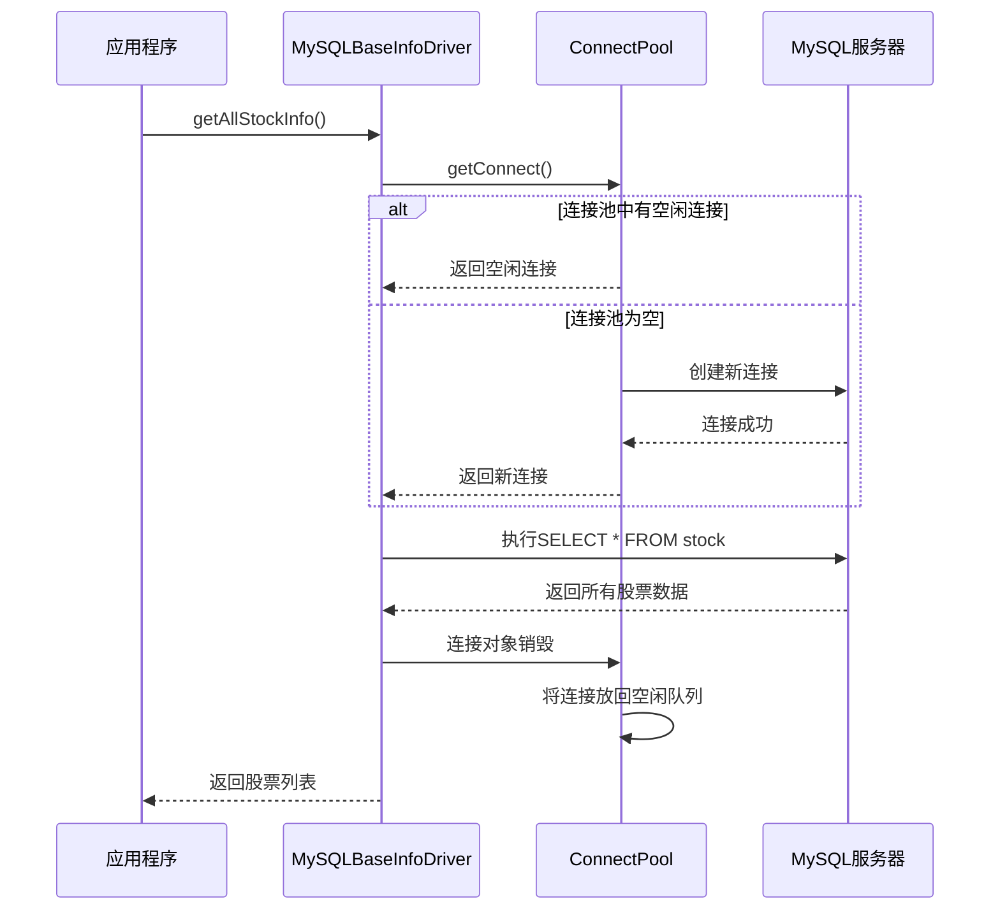

# MySQL存储

<cite>
**本文档引用的文件**   
- [common_mysql.py](file://hikyuu/data/common_mysql.py)
- [createdb.sql](file://hikyuu/data/mysql_upgrade/createdb.sql)
- [0001.sql](file://hikyuu/data/mysql_upgrade/0001.sql)
- [0002.sql](file://hikyuu/data/mysql_upgrade/0002.sql)
- [0003.sql](file://hikyuu/data/mysql_upgrade/0003.sql)
- [MySQLKDataDriver.h](file://hikyuu_cpp/hikyuu/data_driver/kdata/mysql/MySQLKDataDriver.h)
- [MySQLKDataDriver.cpp](file://hikyuu_cpp/hikyuu/data_driver/kdata/mysql/MySQLKDataDriver.cpp)
- [MySQLBaseInfoDriver.h](file://hikyuu_cpp/hikyuu/data_driver/base_info/mysql/MySQLBaseInfoDriver.h)
- [MySQLBaseInfoDriver.cpp](file://hikyuu_cpp/hikyuu/data_driver/base_info/mysql/MySQLBaseInfoDriver.cpp)
- [MySQLConnect.h](file://hikyuu_cpp/hikyuu/utilities/db_connect/mysql/MySQLConnect.h)
- [ConnectPool.h](file://hikyuu_cpp/hikyuu/utilities/ConnectPool.h)
</cite>

## 目录
1. [引言](#引言)
2. [核心驱动实现机制](#核心驱动实现机制)
3. [数据库表结构设计](#数据库表结构设计)
4. [SQL脚本使用说明](#sql脚本使用说明)
5. [连接池与性能优化](#连接池与性能优化)
6. [数据导入与查询实践](#数据导入与查询实践)
7. [结论](#结论)

## 引言
hikyuu是一个开源的量化投资研究框架，其MySQL存储后端为大规模金融数据的持久化提供了高效可靠的解决方案。本系统通过MySQLKDataDriver和MySQLBaseInfoDriver两个核心驱动，分别负责K线数据、分时数据、逐笔数据等时序数据的存储，以及股票基础信息、市场信息、权息信息等静态数据的管理。系统采用模块化的数据库设计，将不同频率的K线数据存储在独立的数据库模式（schema）中，并通过精心设计的索引策略和连接池机制，确保了在高并发、大数据量场景下的查询性能和数据一致性。本文档将深入解析该存储系统的实现细节，为用户配置和优化提供全面指导。

## 核心驱动实现机制

hikyuu的MySQL存储后端由两个核心C++类实现：`MySQLKDataDriver`和`MySQLBaseInfoDriver`，它们分别继承自`KDataDriver`和`BaseInfoDriver`抽象基类。

`MySQLKDataDriver`专门处理时序数据的读取，其核心方法`getKRecordList`根据查询类型（按日期或按索引）采用不同的SQL策略。对于按日期查询，它直接使用`WHERE date >= start AND date < end`条件进行高效过滤。对于按索引查询，为了优化性能，它会判断查询的起始位置：如果在数据集的前半部分，则使用`LIMIT start, count`；如果在后半部分，则先按倒序查询再反转，以避免MySQL在大偏移量下的性能退化。该驱动还实现了`canParallelLoad`方法返回`true`，表明支持并行加载，这对于快速获取多只股票的数据至关重要。

`MySQLBaseInfoDriver`则负责管理静态基础信息，其关键特性是使用了连接池（`ConnectPool<MySQLConnect>`）。与`MySQLKDataDriver`使用单个连接不同，`MySQLBaseInfoDriver`在初始化时创建一个连接池，所有数据读取操作都从池中获取连接。这不仅提高了并发性能，也增强了系统的稳定性。该驱动提供了丰富的接口，如`getAllStockInfo`、`getStockWeightList`和`getFinanceInfo`，通过`batchLoad`等批量操作方法，高效地从数据库中加载`StockTable`、`StockWeightTable`等映射表的数据。

**本节来源**
- [MySQLKDataDriver.h](file://hikyuu_cpp/hikyuu/data_driver/kdata/mysql/MySQLKDataDriver.h#L24-L74)
- [MySQLKDataDriver.cpp](file://hikyuu_cpp/hikyuu/data_driver/kdata/mysql/MySQLKDataDriver.cpp#L15-L462)
- [MySQLBaseInfoDriver.h](file://hikyuu_cpp/hikyuu/data_driver/base_info/mysql/MySQLBaseInfoDriver.h#L24-L49)
- [MySQLBaseInfoDriver.cpp](file://hikyuu_cpp/hikyuu/data_driver/base_info/mysql/MySQLBaseInfoDriver.cpp#L25-L428)

## 数据库表结构设计

hikyuu的MySQL存储采用了分库分表的设计策略，以适应不同类型和频率的数据。

### 基础信息表
所有基础信息存储在名为`hku_base`的主数据库中。
- **market表**：存储市场信息，如上海证券交易所（SH）和深圳证券交易所（SZ）。主键为`marketid`，包含市场代码、名称、交易时间等字段。
- **stock表**：存储所有股票的基础信息，如代码、名称、类型和有效状态。通过`marketid`与`market`表关联。
- **stocktypeinfo表**：定义了股票类型的元数据，如A股、B股、基金等，包含最小/最大交易数量、价格精度等属性。
- **stkweight表**：记录股票的权息信息，如送股、转增、分红等，是进行前复权计算的关键数据源。
- **coderuletype表**：定义了股票代码前缀与股票类型的映射规则，用于根据代码快速判断股票类型。

### K线数据表
K线数据根据市场和K线类型（日线、周线、5分钟线等）分布在不同的数据库模式中。
- **表名生成规则**：模式名为`{market}_{ktype}`（如`sh_day`、`sz_min5`），表名为股票代码（如`000001`）。
- **表结构**：所有K线表具有统一的结构，包含`date`（主键，BIGINT存储yyyyMMddHHmm格式的时间戳）、`open`、`high`、`low`、`close`、`amount`（成交额）和`count`（成交量）字段。
- **存储引擎**：使用`MyISAM`引擎，因其在读密集型场景下具有较好的性能，且支持全文索引（尽管此处未使用）。

### 其他数据表
- **分时数据**：存储在`{market}_time`模式下，表结构包含`date`（精确到分钟）、`price`（价格）和`vol`（成交量）。
- **逐笔数据**：存储在`{market}_trans`模式下，表结构包含`date`（精确到秒）、`price`、`vol`和`buyorsell`（买卖方向）。

```mermaid
erDiagram
market {
INT marketid PK
VARCHAR market UK
VARCHAR name
VARCHAR description
VARCHAR code
BIGINT lastDate
INT openTime1
INT closeTime1
INT openTime2
INT closeTime2
}
stocktypeinfo {
INT id PK
INT type UK
INT precision
DOUBLE tick
DOUBLE tickValue
DOUBLE minTradeNumber
DOUBLE maxTradeNumber
VARCHAR description
}
coderuletype {
INT id PK
INT marketid FK
VARCHAR codepre
INT type FK
VARCHAR description
}
stock {
INT stockid PK
INT marketid FK
VARCHAR code UK
VARCHAR name
INT type FK
INT valid
BIGINT startDate
BIGINT endDate
}
stkweight {
INT id PK
INT stockid FK
BIGINT date
DOUBLE countAsGift
DOUBLE countForSell
DOUBLE priceForSell
DOUBLE bonus
DOUBLE countOfIncreasement
DOUBLE totalCount
DOUBLE freeCount
BOOLEAN suogu
}
market ||--o{ stock : "包含"
market ||--o{ coderuletype : "包含"
stocktypeinfo ||--o{ stock : "定义类型"
stocktypeinfo ||--o{ coderuletype : "定义类型"
stock ||--o{ stkweight : "拥有"
class sh_day {
BIGINT date PK
DOUBLE open
DOUBLE high
DOUBLE low
DOUBLE close
DOUBLE amount
DOUBLE count
}
class sz_min5 {
BIGINT date PK
DOUBLE open
DOUBLE high
DOUBLE low
DOUBLE close
DOUBLE amount
DOUBLE count
}
note as "K线数据模式"
每个市场和K线类型组合
独立的数据库模式
end note
market ||--o{ "K线数据模式" : "生成"
```

**图示来源**
- [createdb.sql](file://hikyuu/data/mysql_upgrade/createdb.sql#L3-L265)
- [MySQLKDataDriver.cpp](file://hikyuu_cpp/hikyuu/data_driver/kdata/mysql/MySQLKDataDriver.cpp#L37-L48)

## SQL脚本使用说明

hikyuu提供了一套完整的SQL脚本来初始化和升级数据库。

### 初始化脚本 (createdb.sql)
位于`hikyuu/data/mysql_upgrade/createdb.sql`，该脚本负责创建整个数据库系统的骨架。
1.  **创建主数据库**：`CREATE SCHEMA hku_base;`
2.  **创建基础表**：定义`market`、`stock`、`stocktypeinfo`、`stkweight`、`stock`和`coderuletype`等表的结构。
3.  **插入初始数据**：为`market`表插入上交所和深交所的信息，为`stocktypeinfo`和`coderuletype`表插入各类股票的元数据和代码规则。

### 版本升级脚本 (0001.sql, 0002.sql, ...)
位于`hikyuu/data/mysql_upgrade/`目录下，这些脚本以数字前缀命名，确保按顺序执行。
- **0001.sql**：创建`hku_base.version`表并插入初始版本号1，用于跟踪数据库版本。
- **0002.sql**：将`stocktypeinfo`表中的`minTradeNumber`和`maxTradeNumber`字段从`INT`改为`DOUBLE`，以支持更灵活的交易单位。
- **0003.sql**：为`market`表添加`openTime1`, `closeTime1`, `openTime2`, `closeTime2`四个字段，用于存储市场的开盘和收盘时间，并为上交所和深交所设置默认值。

**使用方法**：
1.  确保MySQL服务已启动。
2.  使用`mysql -u root -p < createdb.sql`命令执行初始化脚本。
3.  系统在启动时会自动检测当前数据库版本，并按顺序执行所有高于当前版本的升级脚本（通过`common_mysql.py`中的`create_database`函数实现）。

**本节来源**
- [createdb.sql](file://hikyuu/data/mysql_upgrade/createdb.sql#L1-L265)
- [0001.sql](file://hikyuu/data/mysql_upgrade/0001.sql#L1-L5)
- [0002.sql](file://hikyuu/data/mysql_upgrade/0002.sql#L1-L4)
- [0003.sql](file://hikyuu/data/mysql_upgrade/0003.sql#L1-L9)
- [common_mysql.py](file://hikyuu/data/common_mysql.py#L59-L98)

## 连接池与性能优化

hikyuu通过连接池技术显著提升了数据访问的性能和可靠性。

### MySQLBaseInfoDriver的连接池
`MySQLBaseInfoDriver`在`_init`方法中创建了一个`ConnectPool<MySQLConnect>`实例。该连接池的构造函数接受连接参数（主机、端口、用户名、密码、数据库名）以及两个关键配置：
- **maxConnect**：允许的最大连接数。默认为0，表示不限制，但在生产环境中应根据MySQL服务器的`max_connections`参数进行设置，避免资源耗尽。
- **maxIdleConnect**：允许的最大空闲连接数，默认为100。当连接被归还到池中时，如果空闲连接数超过此值，多余的连接将被关闭，以释放资源。

连接池通过`getConnect()`方法提供连接。该方法是线程安全的，它首先尝试从空闲队列中获取连接，如果队列为空，则创建一个新连接。当连接的`shared_ptr`被销毁时，其自定义删除器（`ConnectCloser`）会自动将连接归还到池中，而不是直接关闭，从而实现了连接的复用。

### 性能优化策略
1.  **批量操作**：`MySQLBaseInfoDriver`大量使用`batchLoad`方法，通过一次查询加载整个表或满足条件的所有记录，减少了网络往返次数。
2.  **智能索引查询**：`MySQLKDataDriver`在按索引查询时，会根据索引位置选择正序或倒序查询，避免了`LIMIT large_offset, count`带来的性能问题。
3.  **MyISAM引擎**：对于以读取为主的K线数据，选择MyISAM而非InnoDB，减少了事务和行锁的开销，提高了查询速度。
4.  **主键优化**：K线表以`date`作为主键，利用了时间序列数据的有序性，使得范围查询非常高效。



**图示来源**
- [MySQLBaseInfoDriver.cpp](file://hikyuu_cpp/hikyuu/data_driver/base_info/mysql/MySQLBaseInfoDriver.cpp#L43-L45)
- [ConnectPool.h](file://hikyuu_cpp/hikyuu/utilities/ConnectPool.h#L37-L42)

**本节来源**
- [MySQLBaseInfoDriver.cpp](file://hikyuu_cpp/hikyuu/data_driver/base_info/mysql/MySQLBaseInfoDriver.cpp#L33-L45)
- [ConnectPool.h](file://hikyuu_cpp/hikyuu/utilities/ConnectPool.h#L37-L42)

## 数据导入与查询实践

### 配置连接参数
用户需在配置文件中为MySQL驱动指定连接参数。主要参数包括：
- **host**：MySQL服务器地址，默认为`127.0.0.1`。
- **port**：端口号，默认为`3306`。
- **usr**：用户名，默认为`root`。
- **pwd**：密码，默认为空。
- **db**：数据库名，对于`MySQLBaseInfoDriver`，必须设置为`hku_base`。

### 数据导入
hikyuu提供了多个Python脚本用于数据导入，如`pytdx_to_mysql.py`和`em_block_to_mysql.py`。这些脚本通常遵循以下流程：
1.  连接到MySQL。
2.  调用`common_mysql.create_database`函数，确保数据库和表结构是最新的。
3.  从源（如同花顺、通达信）获取原始数据。
4.  将数据转换为hikyuu内部格式。
5.  使用`INSERT INTO ... VALUES ...`或`INSERT INTO ... SELECT ...`语句批量写入对应的K线表或基础信息表。

### 查询优化建议
1.  **利用索引**：始终使用`date`字段进行范围查询，这是最高效的。
2.  **避免全表扫描**：不要在没有`WHERE`条件的情况下查询大表。
3.  **合理使用连接池**：在多线程环境中，`MySQLBaseInfoDriver`的连接池能有效管理连接，避免频繁创建和销毁。
4.  **定期维护**：对MyISAM表执行`OPTIMIZE TABLE`可以整理碎片，提高性能。

## 结论
hikyuu的MySQL存储后端是一个设计精良、性能优越的系统。通过`MySQLKDataDriver`和`MySQLBaseInfoDriver`的分工协作，实现了时序数据与静态数据的高效管理。其分库分表的架构、基于连接池的并发控制以及针对金融数据特点的SQL优化策略，共同保证了系统在处理海量历史数据时的稳定性和响应速度。用户通过正确配置连接参数并遵循最佳实践，可以充分发挥该存储系统的潜力，为量化研究提供坚实的数据基础。