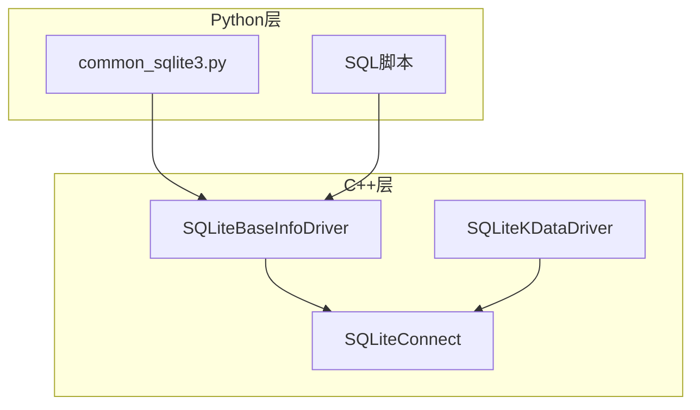
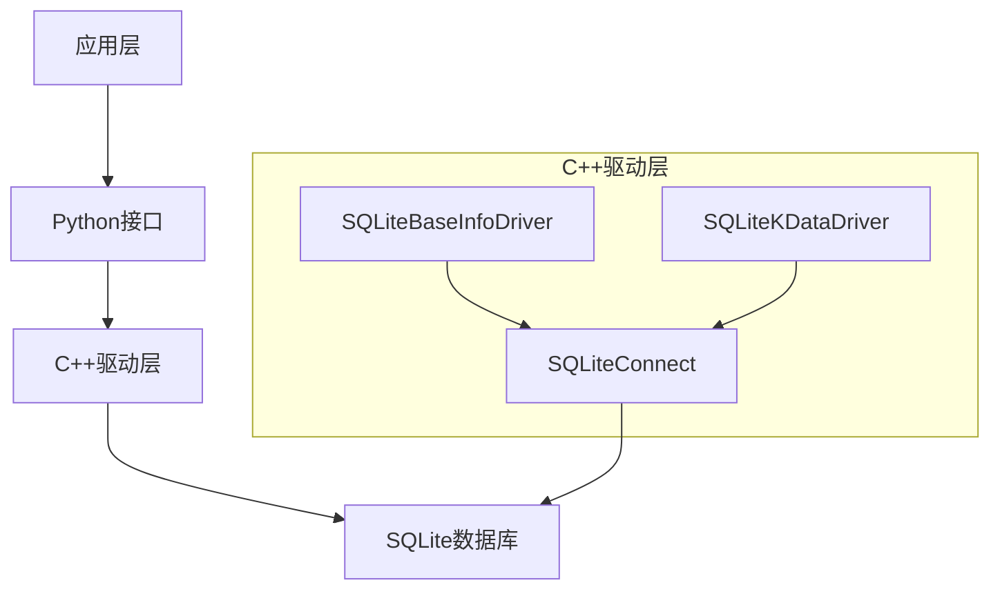
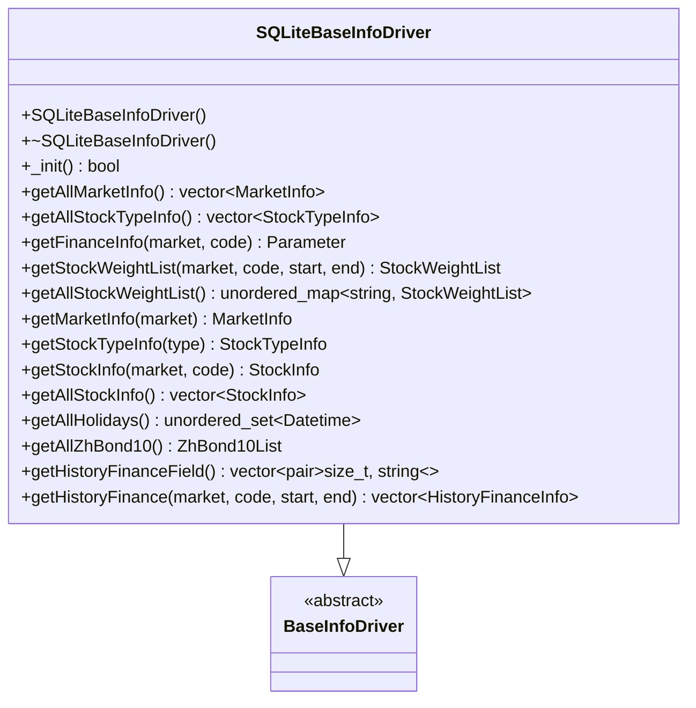
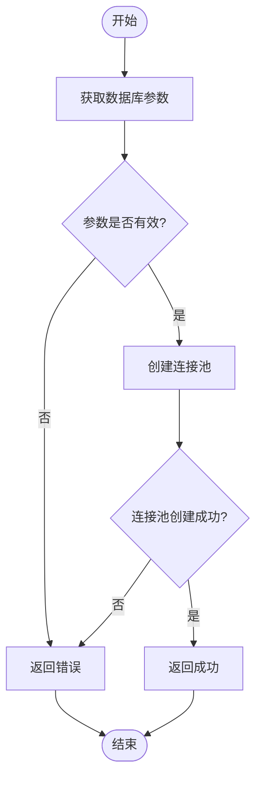
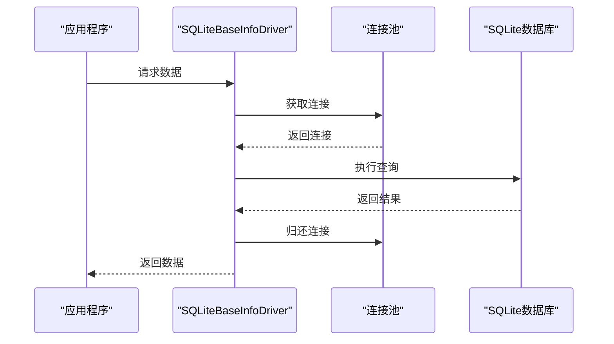
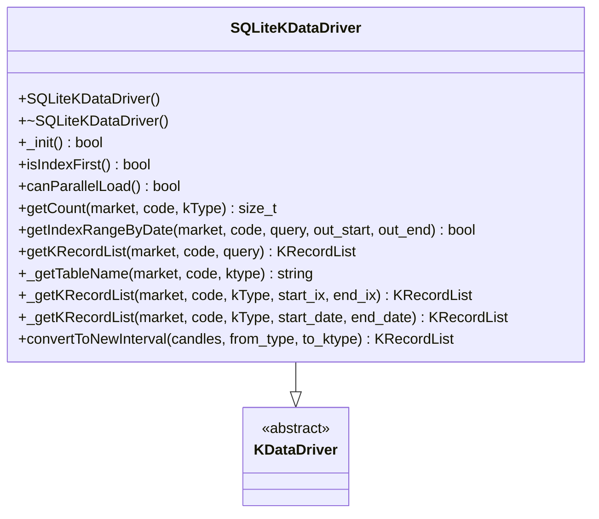
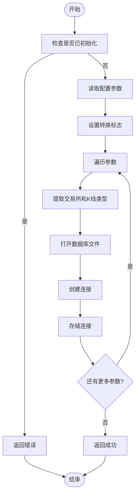
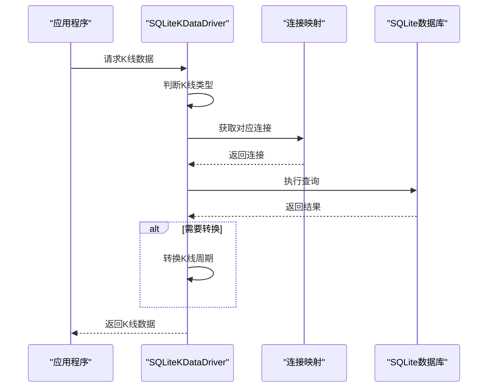
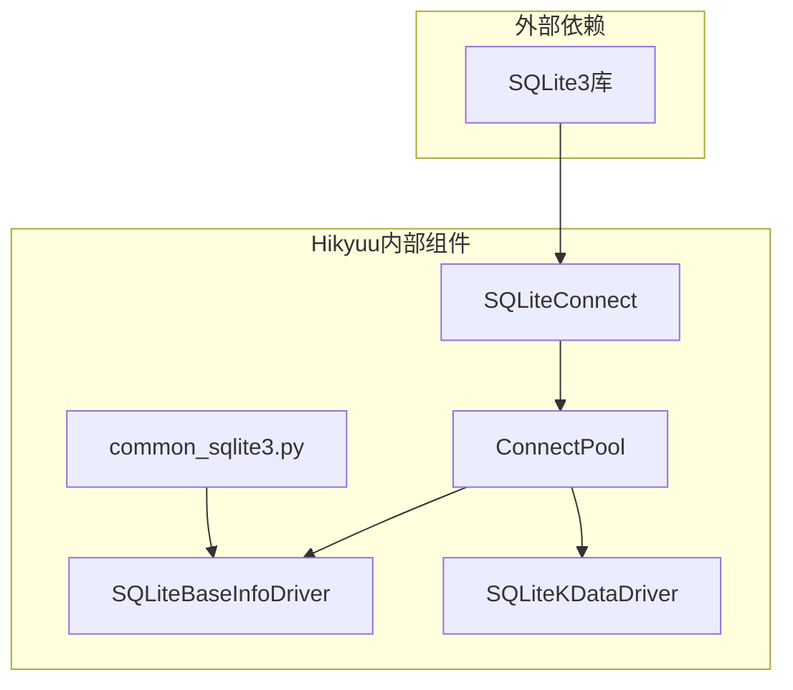

# SQLite存储

<cite>
**本文档引用的文件**  
- [common_sqlite3.py](file://hikyuu/data/common_sqlite3.py)
- [SQLiteBaseInfoDriver.cpp](file://hikyuu_cpp/hikyuu/data_driver/base_info/sqlite/SQLiteBaseInfoDriver.cpp)
- [SQLiteBaseInfoDriver.h](file://hikyuu_cpp/hikyuu/data_driver/base_info/sqlite/SQLiteBaseInfoDriver.h)
- [SQLiteKDataDriver.cpp](file://hikyuu_cpp/hikyuu/data_driver/kdata/sqlite/SQLiteKDataDriver.cpp)
- [SQLiteKDataDriver.h](file://hikyuu_cpp/hikyuu/data_driver/kdata/sqlite/SQLiteKDataDriver.h)
- [createdb.sql](file://hikyuu/data/sqlite_upgrade/createdb.sql)
- [0001.sql](file://hikyuu/data/sqlite_upgrade/0001.sql)
- [0002.sql](file://hikyuu/data/sqlite_upgrade/0002.sql)
- [SQLiteConnect.h](file://hikyuu_cpp/hikyuu/utilities/db_connect/sqlite/SQLiteConnect.h)
- [ConnectPool.h](file://hikyuu_cpp/hikyuu/utilities/ConnectPool.h)
</cite>

## 目录
1. [简介](#简介)
2. [项目结构](#项目结构)
3. [核心组件](#核心组件)
4. [架构概述](#架构概述)
5. [详细组件分析](#详细组件分析)
6. [依赖分析](#依赖分析)
7. [性能考虑](#性能考虑)
8. [故障排除指南](#故障排除指南)
9. [结论](#结论)

## 简介
本文档详细解析了Hikyuu项目中SQLite嵌入式存储的实现，重点介绍SQLiteKDataDriver和SQLiteBaseInfoDriver两个核心驱动类。文档将说明如何使用轻量级SQLite数据库进行本地化数据存储，详细描述数据库文件结构、表设计和SQL查询优化技巧。同时提供createdb.sql初始化脚本和版本升级机制的使用说明，解释SQLite在单机环境下的部署便利性及其在小规模数据集上的性能表现。此外，文档还将指导用户配置数据库文件路径、管理事务和备份策略，并对比其与MySQL在并发访问和存储容量上的差异。

## 项目结构
Hikyuu项目中的SQLite存储实现主要分布在以下几个目录中：
- `hikyuu/data/`：包含SQLite相关的Python工具函数和SQL脚本
- `hikyuu_cpp/hikyuu/data_driver/base_info/sqlite/`：包含SQLiteBaseInfoDriver的C++实现
- `hikyuu_cpp/hikyuu/data_driver/kdata/sqlite/`：包含SQLiteKDataDriver的C++实现
- `hikyuu_cpp/hikyuu/utilities/db_connect/sqlite/`：包含SQLite连接和语句处理的底层实现

SQLite存储相关的SQL脚本位于`hikyuu/data/sqlite_upgrade/`目录下，包括数据库初始化脚本和版本升级脚本。

**图源**
- [common_sqlite3.py](file://hikyuu/data/common_sqlite3.py)
- [SQLiteBaseInfoDriver.cpp](file://hikyuu_cpp/hikyuu/data_driver/base_info/sqlite/SQLiteBaseInfoDriver.cpp)
- [SQLiteKDataDriver.cpp](file://hikyuu_cpp/hikyuu/data_driver/kdata/sqlite/SQLiteKDataDriver.cpp)
- [SQLiteConnect.h](file://hikyuu_cpp/hikyuu/utilities/db_connect/sqlite/SQLiteConnect.h)

**本节来源**
- [common_sqlite3.py](file://hikyuu/data/common_sqlite3.py)
- [SQLiteBaseInfoDriver.cpp](file://hikyuu_cpp/hikyuu/data_driver/base_info/sqlite/SQLiteBaseInfoDriver.cpp)
- [SQLiteKDataDriver.cpp](file://hikyuu_cpp/hikyuu/data_driver/kdata/sqlite/SQLiteKDataDriver.cpp)

## 核心组件
Hikyuu的SQLite存储系统由两个核心组件构成：SQLiteBaseInfoDriver用于管理基础信息数据，SQLiteKDataDriver用于管理K线数据。这两个组件都继承自相应的基类，实现了特定于SQLite的数据库操作。

SQLiteBaseInfoDriver负责管理市场信息、股票类型信息、股票基本信息、权重信息、财务信息等基础数据。它使用连接池管理多个数据库连接，确保在多线程环境下的性能和稳定性。

SQLiteKDataDriver则专注于K线数据的存储和检索，支持多种K线类型（日线、分钟线等），并能通过配置实现不同K线周期之间的转换。

**本节来源**
- [SQLiteBaseInfoDriver.h](file://hikyuu_cpp/hikyuu/data_driver/base_info/sqlite/SQLiteBaseInfoDriver.h)
- [SQLiteKDataDriver.h](file://hikyuu_cpp/hikyuu/data_driver/kdata/sqlite/SQLiteKDataDriver.h)

## 架构概述
Hikyuu的SQLite存储架构采用分层设计，上层是Python接口，中层是C++驱动实现，底层是SQLite数据库引擎。这种设计既保证了性能，又提供了良好的可维护性。

**图源**
- [SQLiteBaseInfoDriver.h](file://hikyuu_cpp/hikyuu/data_driver/base_info/sqlite/SQLiteBaseInfoDriver.h)
- [SQLiteKDataDriver.h](file://hikyuu_cpp/hikyuu/data_driver/kdata/sqlite/SQLiteKDataDriver.h)
- [SQLiteConnect.h](file://hikyuu_cpp/hikyuu/utilities/db_connect/sqlite/SQLiteConnect.h)

## 详细组件分析

### SQLiteBaseInfoDriver分析
SQLiteBaseInfoDriver是Hikyuu中用于管理基础信息数据的核心组件。它继承自BaseInfoDriver基类，实现了所有基础信息数据的读取和管理功能。

#### 类结构分析

**图源**
- [SQLiteBaseInfoDriver.h](file://hikyuu_cpp/hikyuu/data_driver/base_info/sqlite/SQLiteBaseInfoDriver.h)

#### 初始化流程
SQLiteBaseInfoDriver的初始化流程如下：

**图源**
- [SQLiteBaseInfoDriver.cpp](file://hikyuu_cpp/hikyuu/data_driver/base_info/sqlite/SQLiteBaseInfoDriver.cpp#L32-L38)

#### 数据访问流程
当访问基础信息数据时，SQLiteBaseInfoDriver的工作流程如下：

**图源**
- [SQLiteBaseInfoDriver.cpp](file://hikyuu_cpp/hikyuu/data_driver/base_info/sqlite/SQLiteBaseInfoDriver.cpp)

**本节来源**
- [SQLiteBaseInfoDriver.cpp](file://hikyuu_cpp/hikyuu/data_driver/base_info/sqlite/SQLiteBaseInfoDriver.cpp)
- [SQLiteBaseInfoDriver.h](file://hikyuu_cpp/hikyuu/data_driver/base_info/sqlite/SQLiteBaseInfoDriver.h)

### SQLiteKDataDriver分析
SQLiteKDataDriver是Hikyuu中用于管理K线数据的核心组件。它继承自KDataDriver基类，实现了K线数据的存储、检索和转换功能。

#### 类结构分析

**图源**
- [SQLiteKDataDriver.h](file://hikyuu_cpp/hikyuu/data_driver/kdata/sqlite/SQLiteKDataDriver.h)

#### 初始化流程
SQLiteKDataDriver的初始化流程较为复杂，需要处理多个数据库文件的连接：

**图源**
- [SQLiteKDataDriver.cpp](file://hikyuu_cpp/hikyuu/data_driver/kdata/sqlite/SQLiteKDataDriver.cpp#L40-L89)

#### K线数据获取流程
当获取K线数据时，SQLiteKDataDriver的工作流程如下：

**图源**
- [SQLiteKDataDriver.cpp](file://hikyuu_cpp/hikyuu/data_driver/kdata/sqlite/SQLiteKDataDriver.cpp)

**本节来源**
- [SQLiteKDataDriver.cpp](file://hikyuu_cpp/hikyuu/data_driver/kdata/sqlite/SQLiteKDataDriver.cpp)
- [SQLiteKDataDriver.h](file://hikyuu_cpp/hikyuu/data_driver/kdata/sqlite/SQLiteKDataDriver.h)

## 依赖分析
Hikyuu的SQLite存储系统依赖于多个组件，形成了一个完整的依赖链。

**图源**
- [SQLiteConnect.h](file://hikyuu_cpp/hikyuu/utilities/db_connect/sqlite/SQLiteConnect.h)
- [ConnectPool.h](file://hikyuu_cpp/hikyuu/utilities/ConnectPool.h)
- [SQLiteBaseInfoDriver.h](file://hikyuu_cpp/hikyuu/data_driver/base_info/sqlite/SQLiteBaseInfoDriver.h)
- [SQLiteKDataDriver.h](file://hikyuu_cpp/hikyuu/data_driver/kdata/sqlite/SQLiteKDataDriver.h)
- [common_sqlite3.py](file://hikyuu/data/common_sqlite3.py)

**本节来源**
- [SQLiteConnect.h](file://hikyuu_cpp/hikyuu/utilities/db_connect/sqlite/SQLiteConnect.h)
- [ConnectPool.h](file://hikyuu_cpp/hikyuu/utilities/ConnectPool.h)

## 性能考虑
SQLite在单机环境下具有部署便利、零配置、无需服务器进程等优势，特别适合小规模数据集的存储和访问。Hikyuu通过以下方式优化SQLite的性能：

1. **连接池管理**：使用ConnectPool管理数据库连接，避免频繁创建和销毁连接的开销。
2. **批量操作**：在读取大量数据时使用批量加载方法，减少网络往返次数。
3. **索引优化**：在关键字段上创建索引，提高查询效率。
4. **事务管理**：合理使用事务，减少磁盘I/O操作。

与MySQL相比，SQLite在并发访问能力上较弱，但在单线程或低并发场景下性能表现优异。SQLite的存储容量受限于单个文件大小，通常适合GB级别的数据存储，而MySQL可以处理TB级别的数据。

**本节来源**
- [ConnectPool.h](file://hikyuu_cpp/hikyuu/utilities/ConnectPool.h)
- [SQLiteConnect.h](file://hikyuu_cpp/hikyuu/utilities/db_connect/sqlite/SQLiteConnect.h)

## 故障排除指南
在使用Hikyuu的SQLite存储时，可能会遇到以下常见问题：

1. **数据库文件无法打开**：检查数据库文件路径是否正确，文件权限是否足够。
2. **连接池耗尽**：增加连接池大小或检查是否有连接未正确释放。
3. **查询性能低下**：检查是否缺少必要的索引，或考虑优化查询语句。
4. **数据库损坏**：使用SQLite的完整性检查功能检测数据库状态，必要时从备份恢复。

**本节来源**
- [SQLiteConnect.h](file://hikyuu_cpp/hikyuu/utilities/db_connect/sqlite/SQLiteConnect.h#L64-L65)
- [ConnectPool.h](file://hikyuu_cpp/hikyuu/utilities/ConnectPool.h)

## 结论
Hikyuu的SQLite存储系统通过SQLiteBaseInfoDriver和SQLiteKDataDriver两个核心组件，实现了高效、可靠的基础信息和K线数据管理。系统采用分层架构，结合连接池、批量操作等优化技术，在保证性能的同时提供了良好的可维护性。

对于小规模数据集和单机应用场景，SQLite是一个理想的选择，具有部署简单、零配置、性能良好等优势。通过合理的配置和优化，可以充分发挥SQLite在本地数据存储方面的潜力。