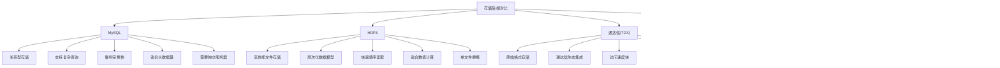

# 数据存储

<cite>
**本文档引用的文件**
- [DataDriverFactory.h](file://hikyuu_cpp/hikyuu/data_driver/DataDriverFactory.h)
- [DataDriverFactory.cpp](file://hikyuu_cpp/hikyuu/data_driver/DataDriverFactory.cpp)
- [KDataDriver.h](file://hikyuu_cpp/hikyuu/data_driver/KDataDriver.h)
- [BaseInfoDriver.h](file://hikyuu_cpp/hikyuu/data_driver/BaseInfoDriver.h)
- [BlockInfoDriver.h](file://hikyuu_cpp/hikyuu/data_driver/BlockInfoDriver.h)
- [H5KDataDriver.h](file://hikyuu_cpp/hikyuu/data_driver/kdata/hdf5/H5KDataDriver.h)
- [MySQLKDataDriver.h](file://hikyuu_cpp/hikyuu/data_driver/kdata/mysql/MySQLKDataDriver.h)
- [SQLiteBaseInfoDriver.h](file://hikyuu_cpp/hikyuu/data_driver/base_info/sqlite/SQLiteBaseInfoDriver.h)
- [SQLiteBlockInfoDriver.h](file://hikyuu_cpp/hikyuu/data_driver/block_info/sqlite/SQLiteBlockInfoDriver.h)
- [TdxKDataDriver.h](file://hikyuu_cpp/hikyuu/data_driver/kdata/tdx/TdxKDataDriver.h)
- [DriverConnectPool.h](file://hikyuu_cpp/hikyuu/data_driver/DriverConnectPool.h)
- [hikyuu_win.ini](file://test_data/hikyuu_win.ini)
- [hikyuu_linux.ini](file://test_data/hikyuu_linux.ini)
</cite>

## 目录
1. [数据驱动工厂模式](#数据驱动工厂模式)
2. [核心驱动接口设计](#核心驱动接口设计)
3. [存储后端实现分析](#存储后端实现分析)
4. [统一接口抽象机制](#统一接口抽象机制)
5. [配置示例与使用指南](#配置示例与使用指南)

## 数据驱动工厂模式

hikyuu通过DataDriverFactory工厂模式实现数据驱动的动态创建和管理。该工厂类采用静态方法和单例模式，负责注册、管理和实例化各种数据驱动。工厂模式的核心在于根据配置参数动态创建不同类型的驱动实例，从而实现对多种数据存储后端的统一管理。

DataDriverFactory提供了三个主要的驱动注册和获取接口：getBaseInfoDriver用于获取基本信息驱动，getBlockDriver用于获取板块信息驱动，getKDataDriverPool用于获取K线数据驱动池。工厂在初始化时会根据编译时定义的宏（如HKU_ENABLE_MYSQL_KDATA、HKU_ENABLE_HDF5_KDATA等）自动注册支持的驱动类型。

驱动池机制是工厂模式的重要组成部分，通过DriverConnectPool模板类实现连接池管理。这种设计不仅提高了资源利用率，还通过连接复用减少了频繁创建和销毁驱动实例的开销。连接池支持最大连接数和最大空闲连接数的配置，能够在高并发场景下有效控制资源使用。

**数据驱动工厂模式**


**图示来源**
- [DataDriverFactory.h](file://hikyuu_cpp/hikyuu/data_driver/DataDriverFactory.h#L26-L55)
- [DataDriverFactory.cpp](file://hikyuu_cpp/hikyuu/data_driver/DataDriverFactory.cpp#L47-L83)
- [DriverConnectPool.h](file://hikyuu_cpp/hikyuu/data_driver/DriverConnectPool.h#L23-L144)

**本节来源**
- [DataDriverFactory.h](file://hikyuu_cpp/hikyuu/data_driver/DataDriverFactory.h#L1-L59)
- [DataDriverFactory.cpp](file://hikyuu_cpp/hikyuu/data_driver/DataDriverFactory.cpp#L1-L203)

## 核心驱动接口设计

hikyuu定义了三大核心驱动接口：KDataDriver、BaseInfoDriver和BlockInfoDriver，分别负责K线数据、基本信息和板块信息的访问。这些接口通过继承和多态机制实现了对不同数据存储后端的统一抽象，为上层应用提供了一致的数据访问体验。

KDataDriver是K线数据访问的基类接口，定义了获取K线数据、分时线和历史分笔数据的标准方法。该接口的关键设计包括isIndexFirst方法，用于指示驱动是按位置索引查询更快还是按日期查询更快；canParallelLoad方法，用于指示驱动是否支持并行数据加载。这些设计使得上层应用可以根据驱动特性优化数据访问策略。

BaseInfoDriver负责管理证券的基本信息、市场信息、证券类型信息、权息信息、历史财务信息等基础数据。该接口提供了getAllStockInfo、getStockInfo、getStockWeightList等方法，支持批量和单个证券信息的查询。特别地，接口还定义了getAllHolidays和getAllZhBond10等特殊数据的获取方法，满足了金融数据分析的特定需求。

BlockInfoDriver用于管理板块信息，支持多种板块分类（如行业板块、概念板块等）的管理。该接口提供了getBlock、getBlockList、save和remove等方法，实现了板块数据的CRUD操作。通过getAllCategory方法，系统可以获取所有支持的板块分类，为数据组织和分析提供了灵活性。

**核心驱动接口设计**


**图示来源**
- [KDataDriver.h](file://hikyuu_cpp/hikyuu/data_driver/KDataDriver.h#L23-L225)
- [BaseInfoDriver.h](file://hikyuu_cpp/hikyuu/data_driver/BaseInfoDriver.h#L99-L245)
- [BlockInfoDriver.h](file://hikyuu_cpp/hikyuu/data_driver/BlockInfoDriver.h#L21-L115)

**本节来源**
- [KDataDriver.h](file://hikyuu_cpp/hikyuu/data_driver/KDataDriver.h#L1-L225)
- [BaseInfoDriver.h](file://hikyuu_cpp/hikyuu/data_driver/BaseInfoDriver.h#L1-L245)
- [BlockInfoDriver.h](file://hikyuu_cpp/hikyuu/data_driver/BlockInfoDriver.h#L1-L115)

## 存储后端实现分析

hikyuu支持多种数据存储后端，每种后端都有其独特的设计特点和适用场景。MySQL作为关系型数据库后端，提供了强大的数据一致性和事务支持，适用于需要复杂查询和数据完整性的场景。HDF5作为高性能文件存储格式，特别适合大规模数值数据的存储和快速访问，其层次化数据模型能够有效组织复杂的金融数据。

通达信(TDX)原始格式存储直接读取通达信软件的数据文件，实现了与通达信生态的无缝集成。这种存储方式的优势在于数据获取的便捷性和与通达信技术指标的兼容性，特别适合从通达信迁移过来的用户。SQLite作为轻量级嵌入式数据库，提供了良好的便携性和零配置特性，适合桌面应用和个人研究使用。

不同存储后端在性能特征上各有优劣。MySQL在处理复杂查询和大数据量时表现出色，但需要独立的数据库服务器支持；HDF5在顺序读取和大数据块访问方面性能卓越，特别适合K线数据的批量处理；TDX格式存储由于直接读取二进制文件，访问速度非常快，但缺乏数据更新和管理功能；SQLite在单用户场景下性能良好，但在高并发写入时可能成为瓶颈。

从适用场景来看，MySQL适合机构级应用和需要数据共享的场景；HDF5适合高性能计算和大数据分析场景；TDX格式适合个人投资者和通达信用户；SQLite适合轻量级应用和移动场景。用户可以根据具体需求选择合适的存储后端，甚至在同一系统中混合使用多种存储方式。

**存储后端对比分析**


**图示来源**
- [H5KDataDriver.h](file://hikyuu_cpp/hikyuu/data_driver/kdata/hdf5/H5KDataDriver.h#L17-L90)
- [MySQLKDataDriver.h](file://hikyuu_cpp/hikyuu/data_driver/kdata/mysql/MySQLKDataDriver.h#L24-L79)
- [TdxKDataDriver.h](file://hikyuu_cpp/hikyuu/data_driver/kdata/tdx/TdxKDataDriver.h#L16-L64)
- [SQLiteBaseInfoDriver.h](file://hikyuu_cpp/hikyuu/data_driver/base_info/sqlite/SQLiteBaseInfoDriver.h#L20-L51)
- [SQLiteBlockInfoDriver.h](file://hikyuu_cpp/hikyuu/data_driver/block_info/sqlite/SQLiteBlockInfoDriver.h#L15-L38)

**本节来源**
- [H5KDataDriver.h](file://hikyuu_cpp/hikyuu/data_driver/kdata/hdf5/H5KDataDriver.h#L1-L90)
- [MySQLKDataDriver.h](file://hikyuu_cpp/hikyuu/data_driver/kdata/mysql/MySQLKDataDriver.h#L1-L79)
- [TdxKDataDriver.h](file://hikyuu_cpp/hikyuu/data_driver/kdata/tdx/TdxKDataDriver.h#L1-L64)
- [SQLiteBaseInfoDriver.h](file://hikyuu_cpp/hikyuu/data_driver/base_info/sqlite/SQLiteBaseInfoDriver.h#L1-L51)
- [SQLiteBlockInfoDriver.h](file://hikyuu_cpp/hikyuu/data_driver/block_info/sqlite/SQLiteBlockInfoDriver.h#L1-L38)

## 统一接口抽象机制

hikyuu通过C++接口抽象实现了底层存储差异的屏蔽，为上层应用提供了统一的数据访问体验。这一机制的核心在于面向对象的多态性和模板设计模式。所有具体的数据驱动实现都继承自统一的基类接口，通过重写虚方法来提供特定存储后端的实现。

参数化配置是统一接口抽象的重要组成部分。通过Parameter类，系统可以将驱动的配置信息以键值对的形式传递，使得不同驱动可以根据相同的配置接口进行初始化。这种设计不仅提高了配置的灵活性，还使得驱动的替换和扩展变得更加容易。

连接池管理进一步增强了接口抽象的效果。DriverConnectPool模板类为不同类型的驱动提供了统一的资源管理接口，隐藏了具体驱动的连接管理细节。上层应用只需通过getConnect方法获取驱动连接，无需关心连接的创建、复用和释放过程。

异常处理机制也是统一接口的重要方面。所有驱动方法都遵循一致的错误处理约定，通过返回值和异常抛出的方式报告错误状态。这种一致性使得上层应用可以采用统一的错误处理策略，提高了代码的可维护性。

**统一接口抽象机制**


**图示来源**
- [DataDriverFactory.h](file://hikyuu_cpp/hikyuu/data_driver/DataDriverFactory.h#L26-L55)
- [DriverConnectPool.h](file://hikyuu_cpp/hikyuu/data_driver/DriverConnectPool.h#L23-L144)
- [KDataDriver.h](file://hikyuu_cpp/hikyuu/data_driver/KDataDriver.h#L23-L225)

**本节来源**
- [DataDriverFactory.h](file://hikyuu_cpp/hikyuu/data_driver/DataDriverFactory.h#L1-L59)
- [DriverConnectPool.h](file://hikyuu_cpp/hikyuu/data_driver/DriverConnectPool.h#L1-L147)
- [KDataDriver.h](file://hikyuu_cpp/hikyuu/data_driver/KDataDriver.h#L1-L225)

## 配置示例与使用指南

hikyuu通过配置文件（如hikyuu.ini）管理数据驱动的连接参数和行为选项。配置采用分层结构，每个驱动类型都有独立的配置段。配置文件支持Windows和Linux不同平台的适配，通过不同的文件名（如hikyuu_win.ini和hikyuu_linux.ini）实现平台特定的配置。

K线数据驱动的配置需要指定type参数来选择具体的存储后端，如"mysql"、"hdf5"或"tdx"。对于MySQL驱动，还需要配置数据库连接信息，包括host、port、database、user和password等参数。HDF5驱动则需要指定数据文件的存储路径。TDX驱动需要配置通达信数据文件的目录路径。

基本信息驱动和板块信息驱动的配置方式类似，都需要指定type参数来选择实现类型。SQLite驱动需要配置数据库文件路径，MySQL驱动需要配置数据库连接参数。通过合理的配置，用户可以灵活组合不同的存储后端，构建适合自己需求的数据存储架构。

配置的最佳实践包括：为生产环境使用MySQL等可靠的数据库系统，为高性能计算场景使用HDF5，为个人研究使用SQLite或TDX格式。同时，建议根据数据访问模式调整连接池参数，如在高并发场景下适当增加最大连接数。

**配置示例**
```ini
[KDataDriver]
type = mysql
host = localhost
port = 3306
database = hikyuu
user = hikyuu
password = hikyuu
max_connect = 10
max_idle_connect = 5

[BaseInfoDriver]
type = sqlite3
db_path = ./data/stock.db

[BlockInfoDriver]
type = sqlite3
db_path = ./data/block.db
```

**本节来源**
- [hikyuu_win.ini](file://test_data/hikyuu_win.ini)
- [hikyuu_linux.ini](file://test_data/hikyuu_linux.ini)
- [DataDriverFactory.cpp](file://hikyuu_cpp/hikyuu/data_driver/DataDriverFactory.cpp#L47-L83)