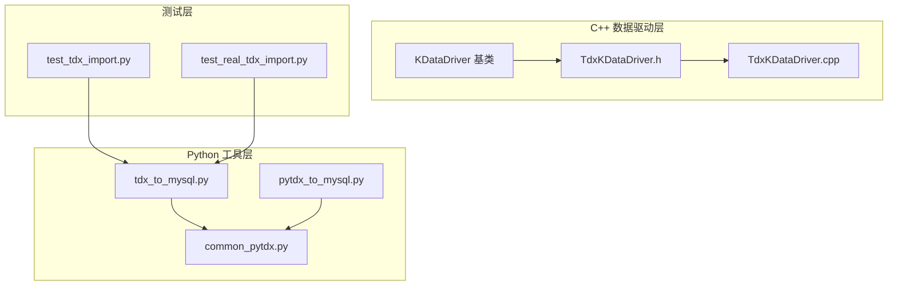
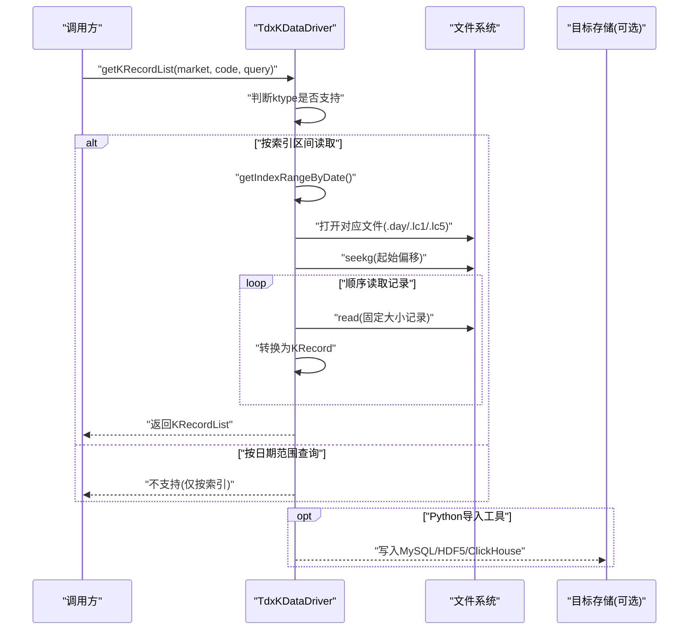
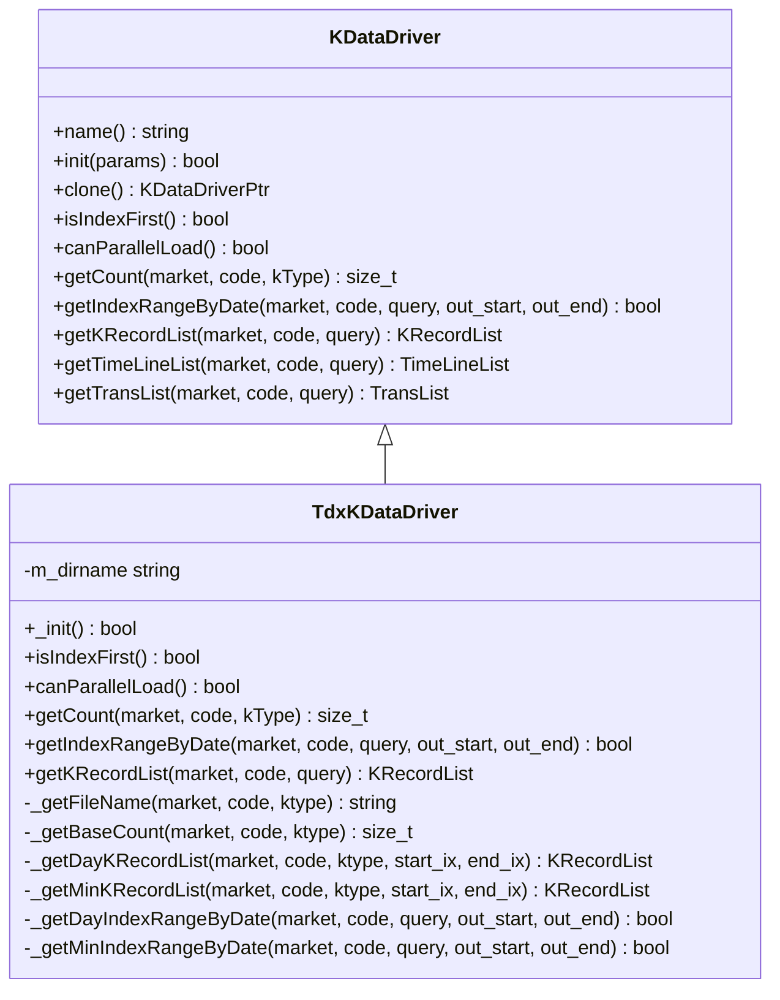
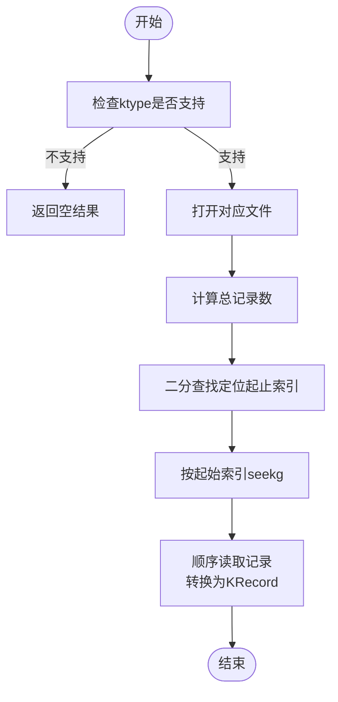
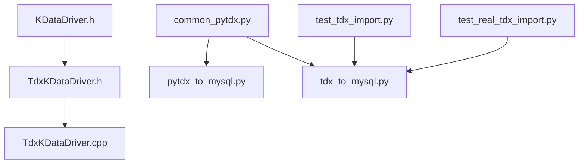

# 通达信原始格式存储

<cite>
**本文引用的文件**
- [TdxKDataDriver.h](file://hikyuu_cpp/hikyuu/data_driver/kdata/tdx/TdxKDataDriver.h)
- [TdxKDataDriver.cpp](file://hikyuu_cpp/hikyuu/data_driver/kdata/tdx/TdxKDataDriver.cpp)
- [KDataDriver.h](file://hikyuu_cpp/hikyuu/data_driver/KDataDriver.h)
- [tdx_to_mysql.py](file://hikyuu/data/tdx_to_mysql.py)
- [pytdx_to_mysql.py](file://hikyuu/data/pytdx_to_mysql.py)
- [common_pytdx.py](file://hikyuu/data/common_pytdx.py)
- [test_tdx_import.py](file://hikyuu/test/test_tdx_import.py)
- [test_real_tdx_import.py](file://hikyuu/test/test_real_tdx_import.py)
</cite>

## 目录
1. [简介](#简介)
2. [项目结构](#项目结构)
3. [核心组件](#核心组件)
4. [架构总览](#架构总览)
5. [详细组件分析](#详细组件分析)
6. [依赖关系分析](#依赖关系分析)
7. [性能考量](#性能考量)
8. [故障排查指南](#故障排查指南)
9. [结论](#结论)
10. [附录](#附录)

## 简介
本文件面向希望直接读取通达信(TDX)原始二进制数据（.day、.lc1、.lc5）并进行高效查询与转换的用户。文档围绕 TdxKDataDriver 的实现机制展开，系统阐述：
- 如何直接读取 TDX 原始文件；
- 日线、分钟线等 K 线类型的文件命名规则与数据解析逻辑；
- 基于位置索引的高效查询方式及其在“数据未迁移”场景下的优势；
- 如何配置 TDX 数据目录路径；
- 利用 pytdx_to_mysql.py 等工具将原始数据转换为 MySQL 等其他存储格式；
- 文件兼容性、数据完整性校验与性能基准测试的实践建议。

## 项目结构
围绕 TDX 原始格式存储，相关代码分布在 C++ 数据驱动层与 Python 工具层两部分：
- C++ 层：TdxKDataDriver 实现了对 TDX 原始文件的直接读取、索引定位与 K 线记录读取；
- Python 层：提供从 TDX 盘后数据目录导入到 MySQL/HDF5/ClickHouse 等存储的工具脚本；
- 测试层：包含针对 .day/.lc1/.lc5 文件格式与导入流程的单元与集成测试。

图表来源
- [KDataDriver.h](file://hikyuu_cpp/hikyuu/data_driver/KDataDriver.h#L1-L225)
- [TdxKDataDriver.h](file://hikyuu_cpp/hikyuu/data_driver/kdata/tdx/TdxKDataDriver.h#L1-L64)
- [TdxKDataDriver.cpp](file://hikyuu_cpp/hikyuu/data_driver/kdata/tdx/TdxKDataDriver.cpp#L1-L200)
- [tdx_to_mysql.py](file://hikyuu/data/tdx_to_mysql.py#L1-L200)
- [pytdx_to_mysql.py](file://hikyuu/data/pytdx_to_mysql.py#L1-L120)
- [common_pytdx.py](file://hikyuu/data/common_pytdx.py#L1-L127)
- [test_tdx_import.py](file://hikyuu/test/test_tdx_import.py#L1-L120)
- [test_real_tdx_import.py](file://hikyuu/test/test_real_tdx_import.py#L1-L120)

章节来源
- [KDataDriver.h](file://hikyuu_cpp/hikyuu/data_driver/KDataDriver.h#L1-L225)
- [TdxKDataDriver.h](file://hikyuu_cpp/hikyuu/data_driver/kdata/tdx/TdxKDataDriver.h#L1-L64)
- [TdxKDataDriver.cpp](file://hikyuu_cpp/hikyuu/data_driver/kdata/tdx/TdxKDataDriver.cpp#L1-L200)
- [tdx_to_mysql.py](file://hikyuu/data/tdx_to_mysql.py#L1-L200)
- [pytdx_to_mysql.py](file://hikyuu/data/pytdx_to_mysql.py#L1-L120)
- [common_pytdx.py](file://hikyuu/data/common_pytdx.py#L1-L127)
- [test_tdx_import.py](file://hikyuu/test/test_tdx_import.py#L1-L120)
- [test_real_tdx_import.py](file://hikyuu/test/test_real_tdx_import.py#L1-L120)

## 核心组件
- TdxKDataDriver：实现对 TDX 原始文件的直接读取与索引查询，支持日线与分钟线（含 1 分钟、5 分钟等）。
- KDataDriver 基类：定义统一的 K 线数据访问接口，包括按索引区间读取、按日期范围获取索引区间、统计记录总数等。
- Python 导入工具：提供从 TDX 盘后数据目录导入到 MySQL/HDF5/ClickHouse 的脚本，支持批量处理与增量导入。

章节来源
- [KDataDriver.h](file://hikyuu_cpp/hikyuu/data_driver/KDataDriver.h#L1-L225)
- [TdxKDataDriver.h](file://hikyuu_cpp/hikyuu/data_driver/kdata/tdx/TdxKDataDriver.h#L1-L64)
- [TdxKDataDriver.cpp](file://hikyuu_cpp/hikyuu/data_driver/kdata/tdx/TdxKDataDriver.cpp#L1-L200)
- [tdx_to_mysql.py](file://hikyuu/data/tdx_to_mysql.py#L1-L200)
- [pytdx_to_mysql.py](file://hikyuu/data/pytdx_to_mysql.py#L1-L120)

## 架构总览
TdxKDataDriver 通过参数 dir 指定 TDX 数据根目录，依据 K 线类型拼接具体文件路径，直接以二进制方式读取 .day/.lc1/.lc5 文件，并基于位置索引进行高效查询。

图表来源
- [TdxKDataDriver.cpp](file://hikyuu_cpp/hikyuu/data_driver/kdata/tdx/TdxKDataDriver.cpp#L89-L135)
- [TdxKDataDriver.cpp](file://hikyuu_cpp/hikyuu/data_driver/kdata/tdx/TdxKDataDriver.cpp#L169-L186)
- [TdxKDataDriver.cpp](file://hikyuu_cpp/hikyuu/data_driver/kdata/tdx/TdxKDataDriver.cpp#L188-L254)
- [TdxKDataDriver.cpp](file://hikyuu_cpp/hikyuu/data_driver/kdata/tdx/TdxKDataDriver.cpp#L256-L302)
- [tdx_to_mysql.py](file://hikyuu/data/tdx_to_mysql.py#L326-L381)

## 详细组件分析

### TdxKDataDriver 实现机制
- 参数与初始化
  - 通过参数 dir 指定 TDX 数据根目录；驱动名称为 "tdx"。
- 文件命名规则
  - 日线：lday/<market>/<market><code>.day
  - 1 分钟线：minline/<market>/<market><code>.lc1
  - 5 分钟线及以上：fzline/<market>/<market><code>.lc5
- 数据结构与解析
  - 日线记录结构：包含日期、开盘、最高、最低、收盘、成交金额、成交量等字段；解析时将价格单位换算为标准值，成交量单位按类型调整。
  - 分钟线记录结构：包含日期与分钟编码、开盘、最高、最低、收盘、成交金额、成交量等字段；解析时将日期与分钟还原为 Datetime。
- 索引与查询
  - 支持按索引区间读取（INDEX 查询类型），不支持按日期范围直接查询。
  - 对日线与分钟线分别提供二分查找定位起止索引的方法，基于记录的时间戳进行比较，最终返回索引区间。
- 记录读取
  - 按索引区间顺序读取记录，每次读取固定大小的二进制块并转换为 KRecord。

图表来源
- [KDataDriver.h](file://hikyuu_cpp/hikyuu/data_driver/KDataDriver.h#L1-L225)
- [TdxKDataDriver.h](file://hikyuu_cpp/hikyuu/data_driver/kdata/tdx/TdxKDataDriver.h#L1-L64)
- [TdxKDataDriver.cpp](file://hikyuu_cpp/hikyuu/data_driver/kdata/tdx/TdxKDataDriver.cpp#L1-L200)

章节来源
- [TdxKDataDriver.h](file://hikyuu_cpp/hikyuu/data_driver/kdata/tdx/TdxKDataDriver.h#L1-L64)
- [TdxKDataDriver.cpp](file://hikyuu_cpp/hikyuu/data_driver/kdata/tdx/TdxKDataDriver.cpp#L1-L200)
- [TdxKDataDriver.cpp](file://hikyuu_cpp/hikyuu/data_driver/kdata/tdx/TdxKDataDriver.cpp#L169-L209)
- [TdxKDataDriver.cpp](file://hikyuu_cpp/hikyuu/data_driver/kdata/tdx/TdxKDataDriver.cpp#L188-L254)
- [TdxKDataDriver.cpp](file://hikyuu_cpp/hikyuu/data_driver/kdata/tdx/TdxKDataDriver.cpp#L256-L302)
- [TdxKDataDriver.cpp](file://hikyuu_cpp/hikyuu/data_driver/kdata/tdx/TdxKDataDriver.cpp#L377-L427)

### 文件命名规则与数据解析逻辑
- 日线（.day）
  - 文件路径：lday/<market>/<market><code>.day
  - 记录大小：固定大小二进制块
  - 字段含义：日期、开盘、最高、最低、收盘、成交金额、成交量、保留字段
  - 单位换算：价格乘以一定系数，金额按千单位换算，成交量按类型调整
- 1 分钟线（.lc1）
  - 文件路径：minline/<market>/<market><code>.lc1
  - 记录大小：固定大小二进制块
  - 字段含义：日期与分钟编码、开盘、最高、最低、收盘、成交金额、成交量、保留字段
  - 时间还原：日期与分钟编码还原为 Datetime
- 5 分钟线（.lc5）
  - 文件路径：fzline/<market>/<market><code>.lc5
  - 记录大小：固定大小二进制块
  - 字段含义：日期与分钟编码、开盘、最高、最低、收盘、成交金额、成交量、保留字段
  - 时间还原：日期与分钟编码还原为 Datetime

章节来源
- [TdxKDataDriver.cpp](file://hikyuu_cpp/hikyuu/data_driver/kdata/tdx/TdxKDataDriver.cpp#L1-L94)
- [TdxKDataDriver.cpp](file://hikyuu_cpp/hikyuu/data_driver/kdata/tdx/TdxKDataDriver.cpp#L377-L410)
- [tdx_to_mysql.py](file://hikyuu/data/tdx_to_mysql.py#L148-L224)
- [tdx_to_mysql.py](file://hikyuu/data/tdx_to_mysql.py#L226-L324)

### 基于位置索引的高效查询
- 适用场景
  - 当数据未迁移至其他存储或仍需直接读取原始二进制文件时，位置索引查询具有显著优势：无需额外索引构建，直接按记录偏移读取。
- 实现要点
  - 通过二分查找在有序记录中定位起止索引，减少磁盘扫描范围。
  - 仅在 INDEX 查询类型下生效，不支持 DATE 查询类型。
- 性能收益
  - 减少随机 I/O，提升范围查询吞吐；适合大规模历史回测与离线分析。

图表来源
- [TdxKDataDriver.cpp](file://hikyuu_cpp/hikyuu/data_driver/kdata/tdx/TdxKDataDriver.cpp#L169-L209)
- [TdxKDataDriver.cpp](file://hikyuu_cpp/hikyuu/data_driver/kdata/tdx/TdxKDataDriver.cpp#L188-L254)
- [TdxKDataDriver.cpp](file://hikyuu_cpp/hikyuu/data_driver/kdata/tdx/TdxKDataDriver.cpp#L256-L302)

章节来源
- [TdxKDataDriver.cpp](file://hikyuu_cpp/hikyuu/data_driver/kdata/tdx/TdxKDataDriver.cpp#L169-L209)
- [TdxKDataDriver.cpp](file://hikyuu_cpp/hikyuu/data_driver/kdata/tdx/TdxKDataDriver.cpp#L188-L254)
- [TdxKDataDriver.cpp](file://hikyuu_cpp/hikyuu/data_driver/kdata/tdx/TdxKDataDriver.cpp#L256-L302)

### Python 导入工具链（MySQL/HDF5/ClickHouse）
- tdx_to_mysql.py
  - 从 TDX 盘后数据目录导入日线与分钟线到 MySQL；
  - 支持根据最后导入时间增量导入；
  - 对记录进行合法性校验与单位换算。
- pytdx_to_mysql.py
  - 通过 pytdx 接口拉取实时数据并导入 MySQL；
  - 提供数据一致性校验（与最后一根 K 线对比）；
  - 支持按天/分钟粒度估算批量拉取步长。
- common_pytdx.py
  - 提供 TDX 服务器连通性探测与最优节点选择；
  - 提供交易日历与市场映射等通用能力。

章节来源
- [tdx_to_mysql.py](file://hikyuu/data/tdx_to_mysql.py#L1-L200)
- [tdx_to_mysql.py](file://hikyuu/data/tdx_to_mysql.py#L226-L381)
- [pytdx_to_mysql.py](file://hikyuu/data/pytdx_to_mysql.py#L1-L120)
- [pytdx_to_mysql.py](file://hikyuu/data/pytdx_to_mysql.py#L232-L444)
- [common_pytdx.py](file://hikyuu/data/common_pytdx.py#L1-L127)

## 依赖关系分析
- TdxKDataDriver 依赖 KDataDriver 接口规范，统一对外提供 K 线读取能力；
- Python 导入工具依赖 common_pytdx 提供的 TDX 服务器选择与连通性检测；
- 测试层通过构造真实 .day/.lc1/.lc5 文件与导入流程进行验证，确保数据一致性与转换正确性。

图表来源
- [KDataDriver.h](file://hikyuu_cpp/hikyuu/data_driver/KDataDriver.h#L1-L225)
- [TdxKDataDriver.h](file://hikyuu_cpp/hikyuu/data_driver/kdata/tdx/TdxKDataDriver.h#L1-L64)
- [TdxKDataDriver.cpp](file://hikyuu_cpp/hikyuu/data_driver/kdata/tdx/TdxKDataDriver.cpp#L1-L200)
- [common_pytdx.py](file://hikyuu/data/common_pytdx.py#L1-L127)
- [pytdx_to_mysql.py](file://hikyuu/data/pytdx_to_mysql.py#L1-L120)
- [tdx_to_mysql.py](file://hikyuu/data/tdx_to_mysql.py#L1-L200)
- [test_tdx_import.py](file://hikyuu/test/test_tdx_import.py#L1-L120)
- [test_real_tdx_import.py](file://hikyuu/test/test_real_tdx_import.py#L1-L120)

章节来源
- [KDataDriver.h](file://hikyuu_cpp/hikyuu/data_driver/KDataDriver.h#L1-L225)
- [TdxKDataDriver.h](file://hikyuu_cpp/hikyuu/data_driver/kdata/tdx/TdxKDataDriver.h#L1-L64)
- [TdxKDataDriver.cpp](file://hikyuu_cpp/hikyuu/data_driver/kdata/tdx/TdxKDataDriver.cpp#L1-L200)
- [common_pytdx.py](file://hikyuu/data/common_pytdx.py#L1-L127)
- [pytdx_to_mysql.py](file://hikyuu/data/pytdx_to_mysql.py#L1-L120)
- [tdx_to_mysql.py](file://hikyuu/data/tdx_to_mysql.py#L1-L200)
- [test_tdx_import.py](file://hikyuu/test/test_tdx_import.py#L1-L120)
- [test_real_tdx_import.py](file://hikyuu/test/test_real_tdx_import.py#L1-L120)

## 性能考量
- 二分查找定位索引：在日线与分钟线记录上进行二分查找，降低磁盘扫描范围，适合大体量历史数据的范围查询。
- 顺序读取：按索引区间顺序读取固定大小记录，减少随机 I/O，提升吞吐。
- 增量导入：Python 工具通过记录最后导入时间实现增量导入，避免重复写入，提高导入效率。
- 并行加载：驱动声明支持并行加载，可在多线程环境下并行读取不同股票或不同区间的记录。

章节来源
- [TdxKDataDriver.h](file://hikyuu_cpp/hikyuu/data_driver/kdata/tdx/TdxKDataDriver.h#L1-L64)
- [TdxKDataDriver.cpp](file://hikyuu_cpp/hikyuu/data_driver/kdata/tdx/TdxKDataDriver.cpp#L169-L209)
- [tdx_to_mysql.py](file://hikyuu/data/tdx_to_mysql.py#L326-L381)
- [pytdx_to_mysql.py](file://hikyuu/data/pytdx_to_mysql.py#L232-L444)

## 故障排查指南
- 无法打开文件
  - 检查 dir 参数是否正确设置，确认文件路径与市场、代码拼接规则一致。
  - 确认文件存在且具备读权限。
- 查询不到数据
  - 确认查询类型为 INDEX，不支持 DATE 查询。
  - 检查日期范围是否落在记录时间范围内。
- 数据不一致
  - 使用 Python 工具进行数据完整性校验：对关键字段（开盘、最高、最低、收盘、成交量、成交金额）进行范围与一致性检查。
  - 对比导入前后记录数与最后一条记录，确保无遗漏或重复。
- 服务器连通性问题
  - 使用 common_pytdx 的服务器探测与最优节点选择功能，自动选择可用节点。

章节来源
- [TdxKDataDriver.cpp](file://hikyuu_cpp/hikyuu/data_driver/kdata/tdx/TdxKDataDriver.cpp#L89-L135)
- [tdx_to_mysql.py](file://hikyuu/data/tdx_to_mysql.py#L148-L224)
- [pytdx_to_mysql.py](file://hikyuu/data/pytdx_to_mysql.py#L330-L444)
- [common_pytdx.py](file://hikyuu/data/common_pytdx.py#L1-L127)

## 结论
TdxKDataDriver 提供了对 TDX 原始二进制文件的直接读取与高效索引查询能力，结合 Python 导入工具链，可实现从 TDX 盘后数据到 MySQL/HDF5/ClickHouse 等多种存储的平滑转换。通过位置索引与顺序读取策略，在“数据未迁移”的场景下仍能获得良好的性能表现；配合 Python 工具的增量导入与数据校验，进一步提升了工程落地的可靠性与可维护性。

## 附录

### 配置与使用指引
- 配置 TDX 数据目录路径
  - 在驱动参数中设置 dir 指向 TDX 数据根目录，驱动将据此拼接各文件路径。
- 导入到 MySQL
  - 使用 tdx_to_mysql.py 从盘后数据目录导入日线与分钟线；
  - 使用 pytdx_to_mysql.py 通过 pytdx 接口拉取实时数据并导入，同时进行数据一致性校验。
- 数据完整性校验
  - 对关键字段进行范围与一致性检查；
  - 对比导入前后记录数与最后一条记录，确保无遗漏或重复。
- 性能基准测试建议
  - 使用二分查找定位索引与顺序读取策略进行范围查询；
  - 对不同股票与不同区间进行多次测量，统计平均吞吐与延迟；
  - 在 Python 工具中启用增量导入，评估导入效率与资源占用。

章节来源
- [TdxKDataDriver.cpp](file://hikyuu_cpp/hikyuu/data_driver/kdata/tdx/TdxKDataDriver.cpp#L377-L410)
- [tdx_to_mysql.py](file://hikyuu/data/tdx_to_mysql.py#L326-L381)
- [pytdx_to_mysql.py](file://hikyuu/data/pytdx_to_mysql.py#L232-L444)
- [test_tdx_import.py](file://hikyuu/test/test_tdx_import.py#L1-L120)
- [test_real_tdx_import.py](file://hikyuu/test/test_real_tdx_import.py#L1-L120)