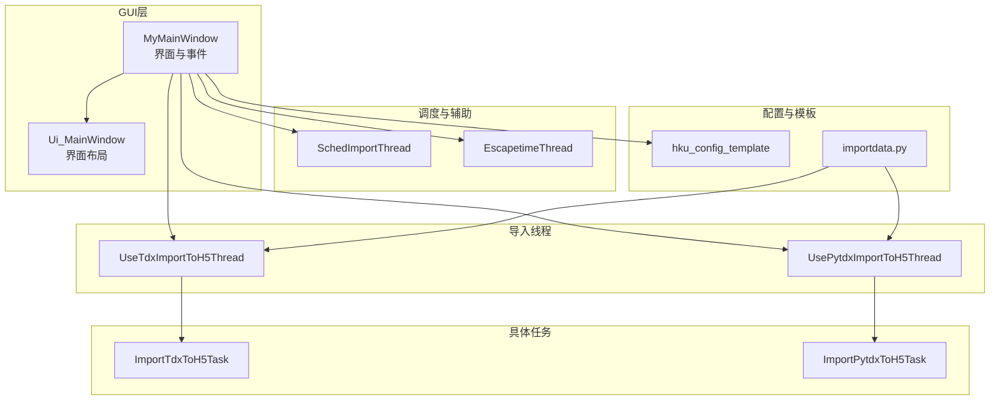
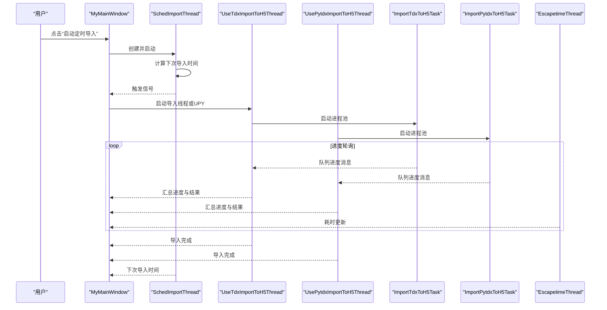
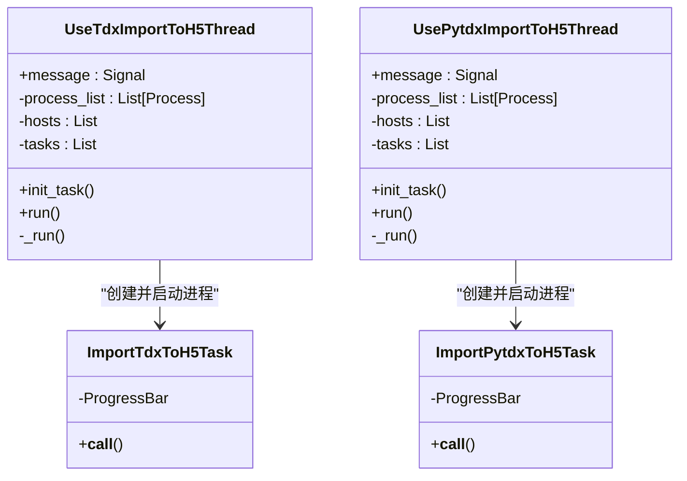
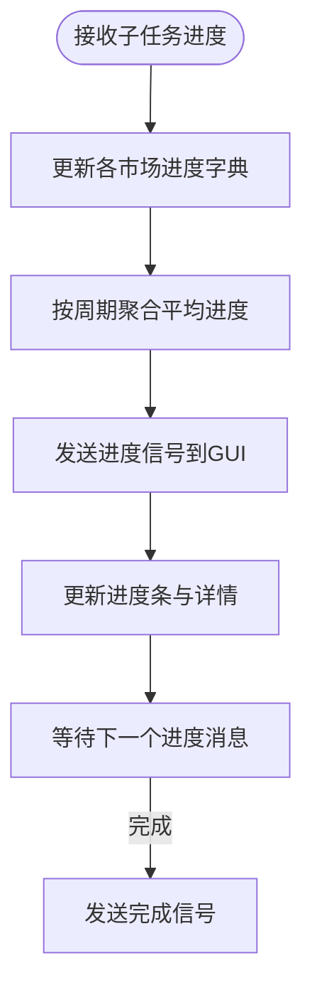
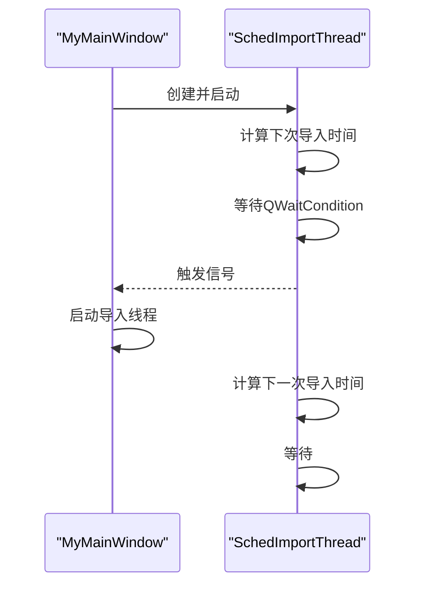
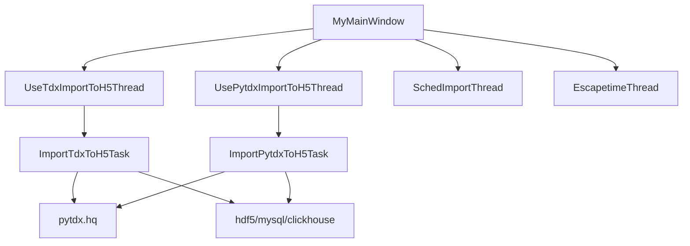

# 图形化导入工具

<cite>
**本文引用的文件列表**
- [importdata.py](file://hikyuu/gui/importdata.py)
- [HikyuuTDX.py](file://hikyuu/gui/HikyuuTDX.py)
- [MainWindow.py](file://hikyuu/gui/data/MainWindow.py)
- [UseTdxImportToH5Thread.py](file://hikyuu/gui/data/UseTdxImportToH5Thread.py)
- [UsePytdxImportToH5Thread.py](file://hikyuu/gui/data/UsePytdxImportToH5Thread.py)
- [ImportTdxToH5Task.py](file://hikyuu/gui/data/ImportTdxToH5Task.py)
- [ImportPytdxToH5Task.py](file://hikyuu/gui/data/ImportPytdxToH5Task.py)
- [SchedImportThread.py](file://hikyuu/gui/data/SchedImportThread.py)
- [EscapetimeThread.py](file://hikyuu/gui/data/EscapetimeThread.py)
- [hku_config_template.py](file://hikyuu/data/hku_config_template.py)
</cite>

## 目录
1. [引言](#引言)
2. [项目结构](#项目结构)
3. [核心组件](#核心组件)
4. [架构总览](#架构总览)
5. [详细组件分析](#详细组件分析)
6. [依赖关系分析](#依赖关系分析)
7. [性能考量](#性能考量)
8. [故障排查指南](#故障排查指南)
9. [结论](#结论)
10. [附录](#附录)

## 引言
本文件面向使用者与开发者，系统化梳理 Hikyuu 图形化数据导入工具的 GUI 界面与后台任务调度机制。内容覆盖：
- 如何通过可视化界面配置数据源、选择导入范围（全量/增量）、设置调度计划并监控导入进度
- ImportPytdxToH5Task、ImportTdxToH5Task 等后台任务类的多线程执行模型（进程池、队列、异常捕获与日志）
- SchedImportThread 如何实现定时自动导入（按日/周/月等周期）
- 常见问题与解决方案（任务卡死、数据库连接超时等）
- GUI 与命令行导入的适用场景对比与选型建议

## 项目结构
图形化导入工具主要由以下模块构成：
- GUI 主窗口与界面布局：MainWindow.py（UI生成）、HikyuuTDX.py（业务逻辑与事件绑定）
- 导入任务线程：UseTdxImportToH5Thread.py、UsePytdxImportToH5Thread.py
- 具体导入任务：ImportTdxToH5Task.py、ImportPytdxToH5Task.py
- 定时调度线程：SchedImportThread.py
- 运行时计时线程：EscapetimeThread.py
- 默认配置模板：hku_config_template.py
- 命令行导入入口：importdata.py

图表来源
- [HikyuuTDX.py](file://hikyuu/gui/HikyuuTDX.py#L318-L383)
- [MainWindow.py](file://hikyuu/gui/data/MainWindow.py#L26-L51)
- [UseTdxImportToH5Thread.py](file://hikyuu/gui/data/UseTdxImportToH5Thread.py#L57-L120)
- [UsePytdxImportToH5Thread.py](file://hikyuu/gui/data/UsePytdxImportToH5Thread.py#L60-L120)
- [ImportTdxToH5Task.py](file://hikyuu/gui/data/ImportTdxToH5Task.py#L45-L95)
- [ImportPytdxToH5Task.py](file://hikyuu/gui/data/ImportPytdxToH5Task.py#L37-L95)
- [SchedImportThread.py](file://hikyuu/gui/data/SchedImportThread.py#L15-L62)
- [EscapetimeThread.py](file://hikyuu/gui/data/EscapetimeThread.py#L1-L27)
- [hku_config_template.py](file://hikyuu/data/hku_config_template.py#L326-L338)
- [importdata.py](file://hikyuu/gui/importdata.py#L161-L171)

章节来源
- [HikyuuTDX.py](file://hikyuu/gui/HikyuuTDX.py#L318-L383)
- [MainWindow.py](file://hikyuu/gui/data/MainWindow.py#L26-L51)

## 核心组件
- GUI 主窗口 MyMainWindow：负责界面初始化、配置读写、导入线程生命周期管理、进度与日志展示、定时导入开关与调度线程交互
- UseTdxImportToH5Thread / UsePytdxImportToH5Thread：导入线程，负责任务编排、进程池创建、消息汇总与进度聚合、异常捕获与日志转发
- ImportTdxToH5Task / ImportPytdxToH5Task：具体导入任务，封装单个市场/周期的数据导入逻辑，支持进度回调与结果统计
- SchedImportThread：定时调度线程，基于 QThread 与 QWaitCondition 实现“按日/周/月”周期的定时触发
- EscapetimeThread：运行时计时线程，持续向 GUI 发送耗时信息，便于用户感知导入耗时
- importdata.py：命令行入口，复用导入线程与消息处理逻辑，支持忽略K线数据的模式

章节来源
- [HikyuuTDX.py](file://hikyuu/gui/HikyuuTDX.py#L318-L383)
- [UseTdxImportToH5Thread.py](file://hikyuu/gui/data/UseTdxImportToH5Thread.py#L57-L120)
- [UsePytdxImportToH5Thread.py](file://hikyuu/gui/data/UsePytdxImportToH5Thread.py#L60-L120)
- [ImportTdxToH5Task.py](file://hikyuu/gui/data/ImportTdxToH5Task.py#L45-L95)
- [ImportPytdxToH5Task.py](file://hikyuu/gui/data/ImportPytdxToH5Task.py#L37-L95)
- [SchedImportThread.py](file://hikyuu/gui/data/SchedImportThread.py#L15-L62)
- [EscapetimeThread.py](file://hikyuu/gui/data/EscapetimeThread.py#L1-L27)
- [importdata.py](file://hikyuu/gui/importdata.py#L161-L171)

## 架构总览
GUI 通过 MyMainWindow 统一管理导入线程与调度线程；导入线程内部以进程池方式并发执行多个任务，每个任务通过队列向主线程回传进度与结果；定时线程在到达设定时刻时触发导入流程；运行时计时线程持续更新耗时信息。

图表来源
- [HikyuuTDX.py](file://hikyuu/gui/HikyuuTDX.py#L1010-L1036)
- [SchedImportThread.py](file://hikyuu/gui/data/SchedImportThread.py#L49-L62)
- [UseTdxImportToH5Thread.py](file://hikyuu/gui/data/UseTdxImportToH5Thread.py#L274-L356)
- [UsePytdxImportToH5Thread.py](file://hikyuu/gui/data/UsePytdxImportToH5Thread.py#L311-L394)
- [ImportTdxToH5Task.py](file://hikyuu/gui/data/ImportTdxToH5Task.py#L84-L131)
- [ImportPytdxToH5Task.py](file://hikyuu/gui/data/ImportPytdxToH5Task.py#L84-L131)
- [EscapetimeThread.py](file://hikyuu/gui/data/EscapetimeThread.py#L1-L27)

## 详细组件分析

### GUI 界面与配置
- 界面布局由 MainWindow.py 生成，包含“数据源与导入范围”、“目标存储”、“定时导入”、“进度与日志”等 Tab
- MyMainWindow 负责：
  - 初始化 UI、读取/保存配置（importdata-gui.ini）
  - 控制导入线程启停、进度条与详情文本框更新
  - 定时导入按钮与 SchedImportThread 的交互
  - 日志输出重定向与多进程日志监听
- 配置项包括：数据源（pytdx/tdx/qmt）、目标存储（hdf5/mysql/clickhouse）、导入范围（日线/分钟线/分笔/分时/权息/财务/板块）、预加载参数、定时导入时间等

章节来源
- [MainWindow.py](file://hikyuu/gui/data/MainWindow.py#L26-L51)
- [HikyuuTDX.py](file://hikyuu/gui/HikyuuTDX.py#L318-L383)
- [HikyuuTDX.py](file://hikyuu/gui/HikyuuTDX.py#L540-L634)
- [hku_config_template.py](file://hikyuu/data/hku_config_template.py#L326-L338)

### 导入线程与任务模型
- UseTdxImportToH5Thread / UsePytdxImportToH5Thread：
  - 任务编排：根据配置生成任务列表（日线/分钟线/分笔/分时/权息/财务/板块等），按市场与周期拆分
  - 进程池：为每个任务创建独立进程，提高吞吐与隔离性
  - 队列通信：子进程通过队列向主线程回传进度与结果，主线程进行聚合与 UI 更新
  - 异常处理：统一捕获异常并通过消息通道通知 GUI
- ImportTdxToH5Task / ImportPytdxToH5Task：
  - 支持进度回调，将进度写入队列
  - 根据配置选择目标存储（hdf5/mysql/clickhouse），建立连接并调用对应导入函数
  - 记录导入条数，最终通过队列发送“完成”消息

图表来源
- [UseTdxImportToH5Thread.py](file://hikyuu/gui/data/UseTdxImportToH5Thread.py#L57-L120)
- [UsePytdxImportToH5Thread.py](file://hikyuu/gui/data/UsePytdxImportToH5Thread.py#L60-L120)
- [ImportTdxToH5Task.py](file://hikyuu/gui/data/ImportTdxToH5Task.py#L45-L95)
- [ImportPytdxToH5Task.py](file://hikyuu/gui/data/ImportPytdxToH5Task.py#L37-L95)

章节来源
- [UseTdxImportToH5Thread.py](file://hikyuu/gui/data/UseTdxImportToH5Thread.py#L193-L356)
- [UsePytdxImportToH5Thread.py](file://hikyuu/gui/data/UsePytdxImportToH5Thread.py#L230-L394)
- [ImportTdxToH5Task.py](file://hikyuu/gui/data/ImportTdxToH5Task.py#L84-L131)
- [ImportPytdxToH5Task.py](file://hikyuu/gui/data/ImportPytdxToH5Task.py#L84-L113)

### 进度聚合与 UI 更新
- 导入线程维护各市场的进度字典，按周期（日线/分钟线/5分钟线/分笔/分时）分别统计
- 将子任务的进度消息汇总为平均值，再通过信号发送给 GUI
- GUI 接收消息后更新进度条与详情文本框，并在完成后显示耗时与统计信息

图表来源
- [UseTdxImportToH5Thread.py](file://hikyuu/gui/data/UseTdxImportToH5Thread.py#L302-L356)
- [UsePytdxImportToH5Thread.py](file://hikyuu/gui/data/UsePytdxImportToH5Thread.py#L339-L394)
- [HikyuuTDX.py](file://hikyuu/gui/HikyuuTDX.py#L830-L860)

章节来源
- [UseTdxImportToH5Thread.py](file://hikyuu/gui/data/UseTdxImportToH5Thread.py#L302-L356)
- [UsePytdxImportToH5Thread.py](file://hikyuu/gui/data/UsePytdxImportToH5Thread.py#L339-L394)
- [HikyuuTDX.py](file://hikyuu/gui/HikyuuTDX.py#L830-L860)

### 定时导入机制（SchedImportThread）
- 基于 QThread 与 QWaitCondition 实现阻塞等待，到达设定时间点后发出信号
- 自动计算“下次导入时间”，考虑周末跳过（周五则加三天）
- GUI 侧通过按钮切换启动/停止，线程停止时唤醒等待并回收资源

图表来源
- [SchedImportThread.py](file://hikyuu/gui/data/SchedImportThread.py#L15-L62)
- [HikyuuTDX.py](file://hikyuu/gui/HikyuuTDX.py#L1010-L1036)

章节来源
- [SchedImportThread.py](file://hikyuu/gui/data/SchedImportThread.py#L15-L62)
- [HikyuuTDX.py](file://hikyuu/gui/HikyuuTDX.py#L1010-L1036)

### 运行时计时（EscapetimeThread）
- 持续每秒向 GUI 发送耗时信息，GUI 在状态栏实时显示
- 与导入线程并行运行，互不影响

章节来源
- [EscapetimeThread.py](file://hikyuu/gui/data/EscapetimeThread.py#L1-L27)
- [HikyuuTDX.py](file://hikyuu/gui/HikyuuTDX.py#L830-L860)

### 命令行导入（importdata.py）
- 提供命令行入口，复用导入线程的消息处理逻辑
- 支持忽略 K 线数据的模式，便于快速验证其他数据导入链路

章节来源
- [importdata.py](file://hikyuu/gui/importdata.py#L161-L171)
- [importdata.py](file://hikyuu/gui/importdata.py#L125-L160)

## 依赖关系分析
- GUI 与导入线程通过信号/槽解耦，导入线程内部通过队列与子进程通信
- 任务类依赖外部数据源（pytdx/tdx）与目标存储（hdf5/mysql/clickhouse）
- 定时线程与导入线程相互独立，通过 GUI 串联

图表来源
- [UseTdxImportToH5Thread.py](file://hikyuu/gui/data/UseTdxImportToH5Thread.py#L274-L356)
- [UsePytdxImportToH5Thread.py](file://hikyuu/gui/data/UsePytdxImportToH5Thread.py#_run)
- [ImportTdxToH5Task.py](file://hikyuu/gui/data/ImportTdxToH5Task.py#L84-L131)
- [ImportPytdxToH5Task.py](file://hikyuu/gui/data/ImportPytdxToH5Task.py#L84-L113)

章节来源
- [UseTdxImportToH5Thread.py](file://hikyuu/gui/data/UseTdxImportToH5Thread.py#L274-L356)
- [UsePytdxImportToH5Thread.py](file://hikyuu/gui/data/UsePytdxImportToH5Thread.py#L311-L394)
- [ImportTdxToH5Task.py](file://hikyuu/gui/data/ImportTdxToH5Task.py#L84-L131)
- [ImportPytdxToH5Task.py](file://hikyuu/gui/data/ImportPytdxToH5Task.py#L84-L113)

## 性能考量
- 并发策略：导入线程以进程池并发执行任务，充分利用 CPU 与网络带宽
- 进度聚合：按周期聚合平均进度，减少 UI 更新频率，降低主线程压力
- 存储选择：hdf5 适合本地快速访问，mysql/clickhouse 适合大规模数据与查询
- 超时与重试：导入任务对数据库连接设置了超时，网络异常时应检查服务器连通性与防火墙策略

[本节为通用指导，无需列出具体文件来源]

## 故障排查指南
- 任务卡死
  - 现象：进度不再更新，但进程仍在运行
  - 排查要点：查看导入线程日志与子进程退出码；确认队列是否被阻塞；检查网络与目标存储可用性
  - 参考路径
    - [UseTdxImportToH5Thread.py](file://hikyuu/gui/data/UseTdxImportToH5Thread.py#L333-L356)
    - [UsePytdxImportToH5Thread.py](file://hikyuu/gui/data/UsePytdxImportToH5Thread.py#L371-L394)
- 数据库连接超时
  - 现象：导入过程中出现连接失败或超时
  - 排查要点：检查 mysql/clickhouse 地址、端口、账号密码；确认服务器可达；适当增大超时参数
  - 参考路径
    - [ImportPytdxToH5Task.py](file://hikyuu/gui/data/ImportPytdxToH5Task.py#L61-L91)
    - [ImportTdxToH5Task.py](file://hikyuu/gui/data/ImportTdxToH5Task.py#L84-L116)
- 定时导入未触发
  - 现象：到达设定时间未执行
  - 排查要点：确认定时导入按钮状态、SchedImportThread 是否在运行、下次导入时间计算是否正确（考虑周末跳过）
  - 参考路径
    - [SchedImportThread.py](file://hikyuu/gui/data/SchedImportThread.py#L38-L62)
    - [HikyuuTDX.py](file://hikyuu/gui/HikyuuTDX.py#L1010-L1036)
- 权息/财务导入异常
  - 现象：权息或财务数据导入失败或无变化
  - 排查要点：检查网络与服务器可用性；查看导入线程消息通道中的 INFO/完成信息
  - 参考路径
    - [UseTdxImportToH5Thread.py](file://hikyuu/gui/data/UseTdxImportToH5Thread.py#L302-L326)
    - [UsePytdxImportToH5Thread.py](file://hikyuu/gui/data/UsePytdxImportToH5Thread.py#L339-L363)

章节来源
- [UseTdxImportToH5Thread.py](file://hikyuu/gui/data/UseTdxImportToH5Thread.py#L333-L356)
- [UsePytdxImportToH5Thread.py](file://hikyuu/gui/data/UsePytdxImportToH5Thread.py#L371-L394)
- [SchedImportThread.py](file://hikyuu/gui/data/SchedImportThread.py#L38-L62)
- [HikyuuTDX.py](file://hikyuu/gui/HikyuuTDX.py#L1010-L1036)
- [ImportPytdxToH5Task.py](file://hikyuu/gui/data/ImportPytdxToH5Task.py#L61-L91)
- [ImportTdxToH5Task.py](file://hikyuu/gui/data/ImportTdxToH5Task.py#L84-L116)

## 结论
图形化导入工具通过清晰的分层设计实现了“可视化配置 + 多进程并发导入 + 定时调度”的完整闭环。GUI 提供直观的操作体验，导入线程保证高吞吐与稳定性，定时线程满足周期性数据更新需求。对于复杂场景，推荐使用 GUI；对于自动化脚本或批量处理，可结合命令行入口与配置模板进行部署。

[本节为总结性内容，无需列出具体文件来源]

## 附录

### 使用步骤与界面要点
- 配置数据源与导入范围：在“数据源与导入范围”页勾选需要的行情类型与周期
- 配置目标存储：选择 hdf5/mysql/clickhouse，并填写相应参数
- 设置定时导入：在“定时导入”页设置时间，点击“启动定时导入”
- 监控进度：在“导入”页查看各周期进度条与详情文本框
- 保存配置：点击“保存配置”按钮，配置将写入 importdata-gui.ini

章节来源
- [HikyuuTDX.py](file://hikyuu/gui/HikyuuTDX.py#L318-L383)
- [HikyuuTDX.py](file://hikyuu/gui/HikyuuTDX.py#L540-L634)
- [HikyuuTDX.py](file://hikyuu/gui/HikyuuTDX.py#L1010-L1036)
- [MainWindow.py](file://hikyuu/gui/data/MainWindow.py#L638-L674)

### GUI 与命令行导入对比
- GUI 优势：可视化配置、进度实时反馈、定时导入一键开启、日志集中展示
- 命令行优势：轻量、可嵌入自动化脚本、适合批量处理与 CI/CD
- 选型建议：日常维护与演示使用 GUI；生产环境与自动化任务使用命令行入口

章节来源
- [importdata.py](file://hikyuu/gui/importdata.py#L161-L171)
- [HikyuuTDX.py](file://hikyuu/gui/HikyuuTDX.py#L318-L383)