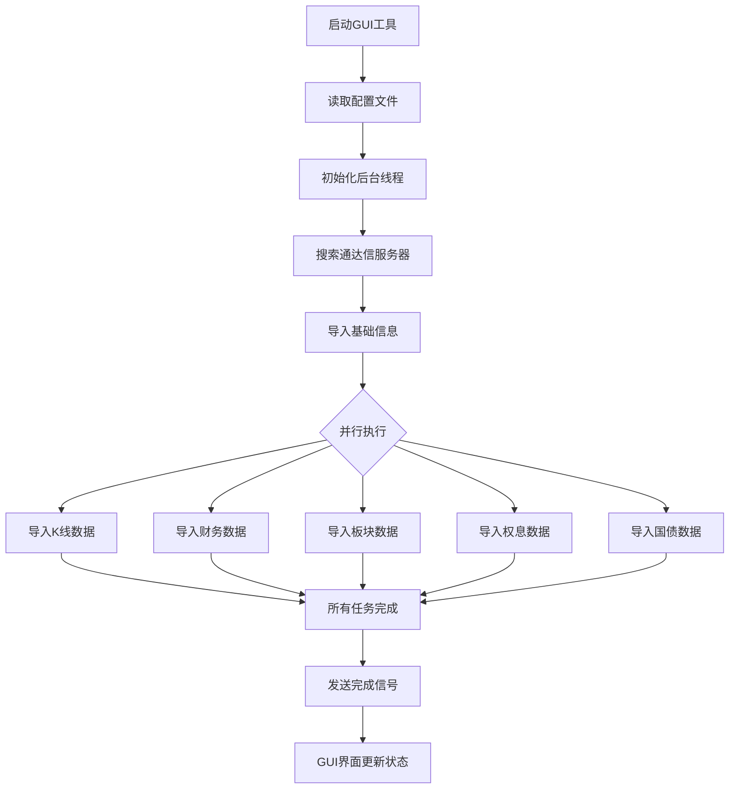

# 数据导入

<cite>
**本文档引用的文件**   
- [pytdx_to_mysql.py](file://hikyuu/data/pytdx_to_mysql.py)
- [pytdx_to_h5.py](file://hikyuu/data/pytdx_to_h5.py)
- [em_block_to_mysql.py](file://hikyuu/data/em_block_to_mysql.py)
- [zh_bond10_to_sqlite.py](file://hikyuu/data/zh_bond10_to_sqlite.py)
- [importdata.py](file://hikyuu/gui/importdata.py)
- [UseTdxImportToH5Thread.py](file://hikyuu/gui/data/UseTdxImportToH5Thread.py)
- [UsePytdxImportToH5Thread.py](file://hikyuu/gui/data/UsePytdxImportToH5Thread.py)
- [common_mysql.py](file://hikyuu/data/common_mysql.py)
- [common_sqlite3.py](file://hikyuu/data/common_sqlite3.py)
- [common_h5.py](file://hikyuu/data/common_h5.py)
- [common.py](file://hikyuu/data/common.py)
- [weight_to_mysql.py](file://hikyuu/data/weight_to_mysql.py)
- [weight_to_sqlite.py](file://hikyuu/data/weight_to_sqlite.py)
</cite>

## 目录
1. [引言](#引言)
2. [核心数据导入脚本](#核心数据导入脚本)
    - [pytdx_to_mysql.py](#pytdx_to_mysqlpy)
    - [pytdx_to_h5.py](#pytdx_to_h5py)
    - [em_block_to_mysql.py](#em_block_to_mysqlpy)
    - [zh_bond10_to_sqlite.py](#zh_bond10_to_sqlitepy)
3. [图形化导入工具](#图形化导入工具)
4. [分步操作指南](#分步操作指南)
5. [常见错误排查](#常见错误排查)
6. [案例：构建本地数据仓库](#案例构建本地数据仓库)
7. [附录](#附录)

## 引言
本文档旨在全面介绍Hikyuu项目中用于将原始市场数据导入其支持的数据库的各种脚本和工具。Hikyuu提供了一套完整的数据导入解决方案，涵盖了从行情数据、财务数据到权重数据的各个方面。用户可以通过命令行脚本进行精确控制，也可以通过图形化界面（GUI）工具实现便捷操作。本文将详细阐述这些工具的使用方法、配置选项和执行流程，帮助用户高效地构建和维护本地金融数据仓库。

## 核心数据导入脚本

### pytdx_to_mysql.py
`pytdx_to_mysql.py` 是一个核心脚本，用于将通达信（TDX）格式的行情数据导入到MySQL数据库中。该脚本通过`pytdx`库连接到通达信行情服务器，实时获取数据并写入MySQL。

**命令行参数与配置**:
该脚本通常不直接通过命令行参数调用，而是通过配置文件或在其他脚本中作为模块导入。其主要功能函数包括：
- `import_data()`: 导入日线、5分钟线、1分钟线等K线数据。
- `import_stock_name()`: 更新股票代码表，包括股票名称、有效性等信息。
- `import_index_name()`: 导入指数代码表。
- `import_trans()`: 导入历史分笔数据。
- `import_time()`: 导入历史分时数据。

**执行流程**:
1.  **建立连接**: 脚本首先建立与MySQL数据库的连接，并创建必要的数据库和数据表（如果不存在）。
2.  **获取股票列表**: 从数据库中读取当前有效的股票列表。
3.  **逐只导入**: 遍历股票列表，对每只股票调用`import_one_stock_data()`函数。
4.  **增量更新**: `import_one_stock_data()`函数会查询数据库中该股票的最后一条记录时间，然后从通达信服务器获取该时间之后的所有新数据，确保只进行增量导入，避免重复。
5.  **数据校验**: 在导入前，会对获取的数据进行有效性校验，例如检查开盘价、最高价、最低价、收盘价之间的逻辑关系。
6.  **批量写入**: 将获取到的新数据批量插入到对应的数据库表中。
7.  **更新元数据**: 导入完成后，更新基础信息表中该股票的起止日期和最新更新日期。

**Section sources**
- [pytdx_to_mysql.py](file://hikyuu/data/pytdx_to_mysql.py#L1-L844)
- [common_mysql.py](file://hikyuu/data/common_mysql.py#L1-L522)

### pytdx_to_h5.py
`pytdx_to_h5.py` 的功能与`pytdx_to_mysql.py`类似，但其目标数据库是HDF5文件。HDF5是一种高效的科学数据存储格式，非常适合存储大规模的金融时间序列数据。

**命令行参数与配置**:
与`pytdx_to_mysql.py`一样，该脚本也主要通过配置文件驱动。其核心函数与MySQL版本功能对应，但后缀为`_h5`，例如`import_data()`和`import_one_stock_data()`。

**执行流程**:
1.  **打开HDF5文件**: 使用`tables`库打开或创建指定的HDF5文件。
2.  **获取股票列表**: 从SQLite基础信息数据库中读取股票列表。
3.  **创建数据表**: 对于每只股票，如果HDF5文件中尚不存在对应的数据表，则创建一个。
4.  **增量导入**: 与MySQL流程相同，通过查询HDF5表中的最后一条记录来确定起始时间，从通达信服务器获取增量数据。
5.  **数据写入**: 将数据以结构化数组的形式追加到HDF5表中。
6.  **更新索引**: 导入日线数据后，会自动调用`update_hdf5_extern_data()`函数，为该股票生成周线、月线等扩展周期的索引。

**关键区别**:
- **数据格式**: HDF5使用`UInt32Col`和`UInt64Col`等无符号整数类型存储价格和成交量，以节省空间并提高性能。价格通常以“分”为单位存储（即乘以1000）。
- **索引机制**: HDF5通过独立的索引表（如`/week`、`/month`）来实现对扩展周期数据的快速访问，而MySQL则通过`update_extern_data()`函数直接在数据库中生成扩展周期的K线数据。

**Section sources**
- [pytdx_to_h5.py](file://hikyuu/data/pytdx_to_h5.py#L1-L710)
- [common_h5.py](file://hikyuu/data/common_h5.py#L1-L398)

### em_block_to_mysql.py
`em_block_to_mysql.py` 专门用于将东方财富网（East Money）的板块数据导入到MySQL数据库中。板块数据对于进行行业分析和板块轮动研究至关重要。

**命令行参数与配置**:
该脚本同样依赖配置文件。其主要功能是`em_import_block_to_mysql(connect)`，需要一个数据库连接对象作为参数。

**执行流程**:
1.  **下载板块数据**: 脚本首先调用`download_block_info()`函数，从东方财富网抓取最新的板块分类和成分股信息。
2.  **读取本地数据**: 将下载的JSON数据从本地文件路径读取到内存中。
3.  **清理旧数据**: 连接到MySQL数据库，删除`hku_base.block`和`hku_base.BlockIndex`表中与本次导入板块相关的所有旧记录。
4.  **插入新数据**: 遍历内存中的板块数据，将每个板块的类别、名称和成分股代码作为一条记录，批量插入到`hku_base.block`表中。
5.  **插入指数信息**: 将每个板块的指数代码信息批量插入到`hku_base.BlockIndex`表中。
6.  **提交事务**: 完成所有插入操作后，提交数据库事务。

**Section sources**
- [em_block_to_mysql.py](file://hikyuu/data/em_block_to_mysql.py#L1-L72)
- [common_mysql.py](file://hikyuu/data/common_mysql.py#L1-L522)

### zh_bond10_to_sqlite.py
`zh_bond10_to_sqlite.py` 用于获取中国10年期国债收益率，并将其导入到SQLite数据库中。国债收益率是重要的无风险利率基准，常用于量化模型的参数计算。

**命令行参数与配置**:
该脚本的主要函数是`import_zh_bond10_to_sqlite(connect)`，接受一个数据库连接对象。

**执行流程**:
1.  **确定起始日期**: 查询`zh_bond10`表中的最大日期，以此作为本次导入的起始日期，确保数据的连续性。
2.  **获取数据**: 调用`get_china_bond10_rate(start_date)`函数，该函数使用`akshare`库从网络上获取从起始日期至今的所有10年期国债收益率数据。
3.  **数据处理**: 将获取到的数据（日期和收益率）格式化为适合数据库插入的元组列表。
4.  **批量插入**: 使用`executemany()`方法将新数据批量插入到`zh_bond10`表中。

**Section sources**
- [zh_bond10_to_sqlite.py](file://hikyuu/data/zh_bond10_to_sqlite.py#L1-L43)
- [common.py](file://hikyuu/data/common.py#L1-L249)

## 图形化导入工具
Hikyuu提供了一个名为`importdata.py`的图形化工具，极大地简化了数据导入的复杂性。该工具通过一个配置文件`importdata-gui.ini`来管理所有设置，并通过后台多线程任务机制并行执行各项导入任务。

**后台任务机制**:
GUI工具的核心是`UseTdxImportToH5Thread`和`UsePytdxImportToH5Thread`两个线程类。它们负责协调和执行所有后台任务。

**Diagram sources**
- [importdata.py](file://hikyuu/gui/importdata.py#L1-L171)
- [UseTdxImportToH5Thread.py](file://hikyuu/gui/data/UseTdxImportToH5Thread.py#L1-L358)
- [UsePytdxImportToH5Thread.py](file://hikyuu/gui/data/UsePytdxImportToH5Thread.py#L1-L395)

**工作流程**:
1.  **初始化**: `importdata.py`启动后，会创建一个`HKUImportDataCMD`实例，并初始化一个后台线程（`UseTdxImportToH5Thread`或`UsePytdxImportToH5Thread`）。
2.  **配置加载**: 读取`importdata-gui.ini`配置文件，获取用户选择的导入目标（HDF5、MySQL等）、通达信安装目录、行情类别等。
3.  **任务创建**: 后台线程根据配置，创建一系列独立的`Task`对象，如`ImportTdxToH5Task`（导入K线）、`ImportWeightToSqliteTask`（导入权息）、`ImportBlockInfoTask`（导入板块）等。
4.  **并行执行**: 每个`Task`被封装在一个独立的`Process`（进程）中，并行执行。这充分利用了多核CPU的优势，显著提高了导入速度。
5.  **进度通信**: 子进程通过一个`Queue`队列将进度信息（如“导入进度：50%”）发送回主线程。
6.  **状态更新**: 主线程接收到进度信息后，通过`message`信号通知GUI界面，从而实时更新进度条和状态信息。

**Section sources**
- [importdata.py](file://hikyuu/gui/importdata.py#L1-L171)
- [UseTdxImportToH5Thread.py](file://hikyuu/gui/data/UseTdxImportToH5Thread.py#L1-L358)
- [UsePytdxImportToH5Thread.py](file://hikyuu/gui/data/UsePytdxImportToH5Thread.py#L1-L395)

## 分步操作指南

### 环境准备
1.  **安装Python依赖**: 确保已安装`hikyuu`、`pytdx`、`akshare`、`pandas`、`tables`、`mysql-connector-python`等必要库。
2.  **准备通达信数据**: 如果使用`tdx_to_*`系列脚本，需要安装通达信软件，并确保`vipdoc`目录下的数据是最新的。
3.  **配置数据库**: 根据需求，配置好MySQL或SQLite数据库的连接信息。

### 配置文件设置
GUI工具的配置文件位于`~/.hikyuu/importdata-gui.ini`。主要配置项包括：
- `[hdf5]`: 是否启用HDF5，以及数据存放目录。
- `[mysql]`: 是否启用MySQL，以及主机、端口、用户名、密码和临时目录。
- `[tdx]`: 是否启用通达信本地数据，以及通达信安装目录。
- `[quotation]`: 选择要导入的行情类别（股票、基金）。
- `[ktype]`: 选择要导入的K线周期（日线、5分钟线等）。

### 增量/全量导入模式
- **增量导入**: 这是默认模式。所有脚本在执行时都会查询数据库中已有的最后一条记录，并只导入之后的新数据。这是日常更新数据的推荐方式。
- **全量导入**: 要进行全量导入，需要手动清空目标数据库中的相关表，然后运行导入脚本。脚本会从1990年12月19日开始导入所有历史数据。

## 常见错误排查
- **连接通达信服务器失败**: 检查网络连接，确认`pytdx`库是否能正常访问服务器。脚本会自动搜索最佳服务器。
- **数据库表不存在**: 确保已正确执行`create_database()`函数来初始化数据库结构。
- **数据导入中断**: 检查日志文件，确认是网络问题还是数据源问题。GUI工具的并行机制可以容忍单个任务的失败。
- **HDF5文件损坏**: 如果HDF5文件损坏，需要删除该文件并重新进行全量导入。

## 案例：构建本地数据仓库
以下是一个从零开始构建完整本地数据仓库的示例流程：
1.  **初始化**: 运行`importdata.py`，在GUI中配置目标为HDF5和MySQL。
2.  **首次全量导入**: 选择导入所有行情类别和K线周期，执行全量导入。此过程可能耗时数小时。
3.  **日常更新**: 每日收盘后，再次运行`importdata.py`，此时将自动进行增量导入，仅需几分钟即可完成。
4.  **数据验证**: 使用Hikyuu的Python API加载数据，验证数据的完整性和准确性。

## 附录
- **数据源说明**: 行情数据主要来自通达信服务器，股票代码表来自`akshare`，板块数据来自东方财富网，国债数据来自`akshare`。
- **性能建议**: 对于大规模数据，推荐使用HDF5存储K线数据，使用MySQL存储基础信息和财务数据，以获得最佳性能。