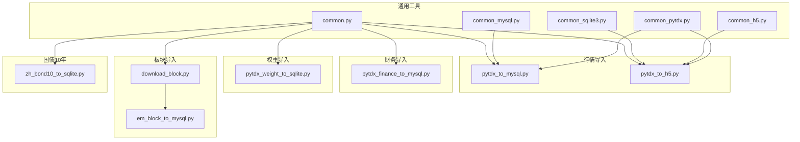
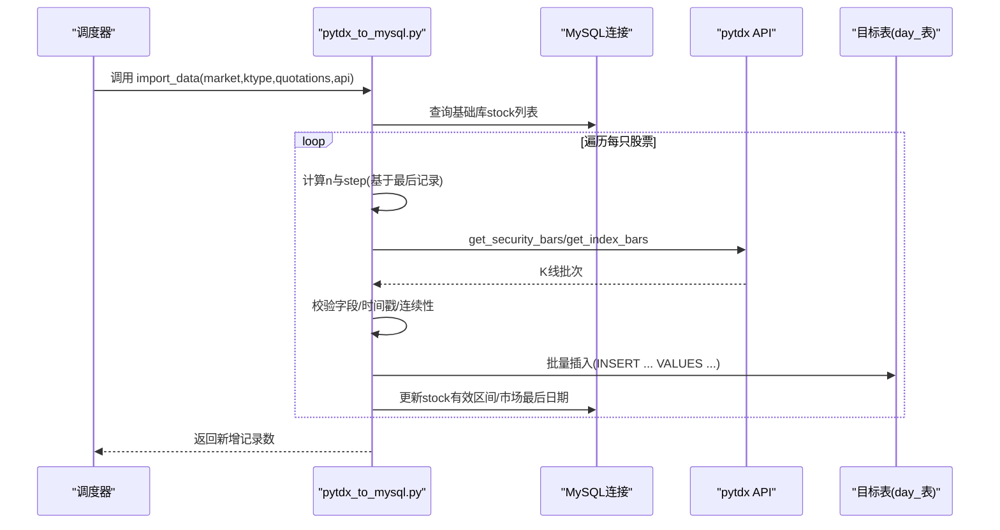
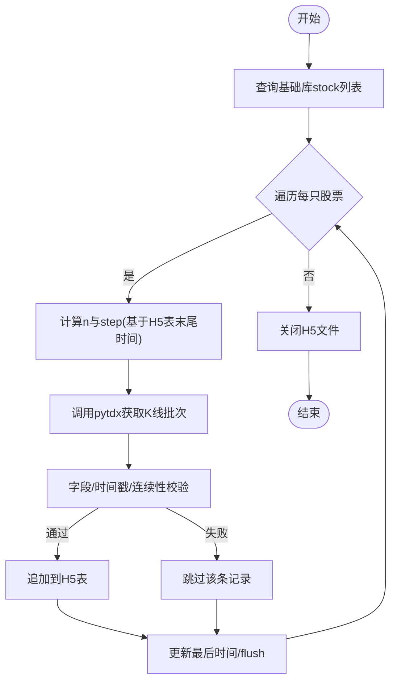
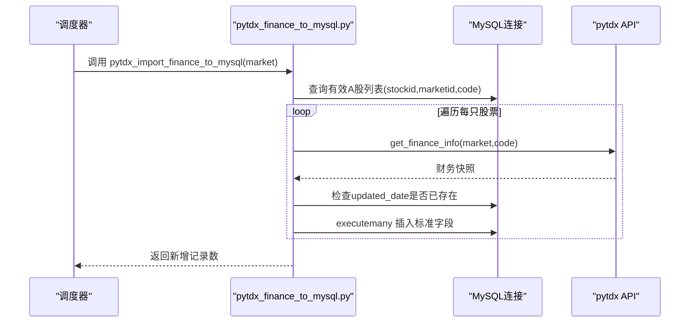
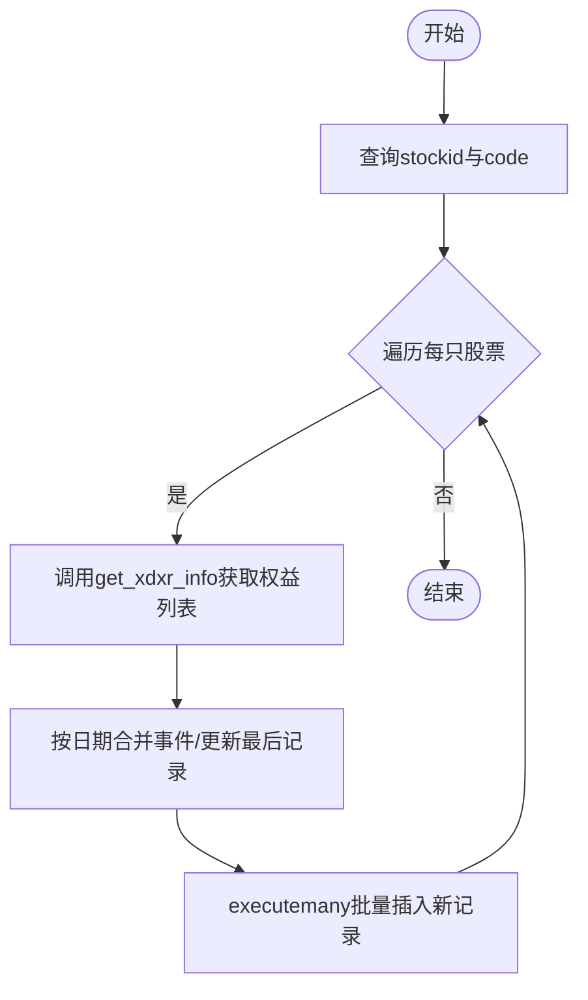
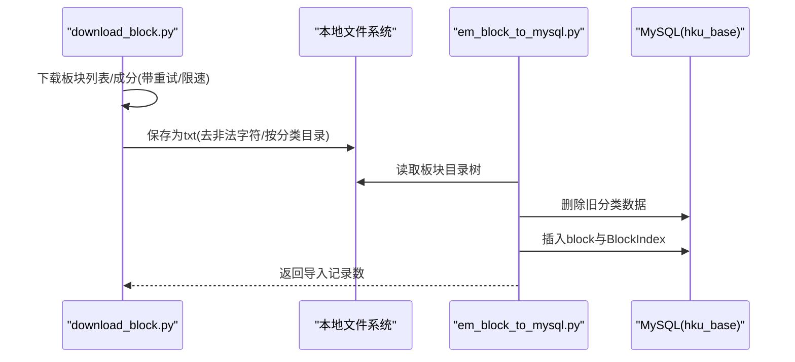
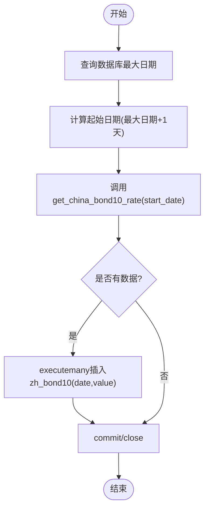
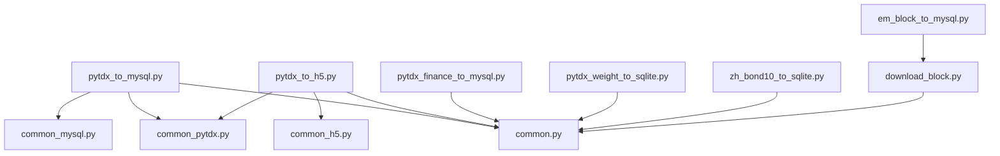

# 数据源导入

<cite>
**本文引用的文件**
- [pytdx_to_mysql.py](file://hikyuu/data/pytdx_to_mysql.py)
- [pytdx_to_h5.py](file://hikyuu/data/pytdx_to_h5.py)
- [pytdx_finance_to_mysql.py](file://hikyuu/data/pytdx_finance_to_mysql.py)
- [pytdx_weight_to_sqlite.py](file://hikyuu/data/pytdx_weight_to_sqlite.py)
- [zh_bond10_to_sqlite.py](file://hikyuu/data/zh_bond10_to_sqlite.py)
- [download_block.py](file://hikyuu/data/download_block.py)
- [common.py](file://hikyuu/data/common.py)
- [common_mysql.py](file://hikyuu/data/common_mysql.py)
- [common_sqlite3.py](file://hikyuu/data/common_sqlite3.py)
- [common_h5.py](file://hikyuu/data/common_h5.py)
- [common_pytdx.py](file://hikyuu/data/common_pytdx.py)
- [mysql_upgrade/createdb.sql](file://hikyuu/data/mysql_upgrade/createdb.sql)
- [sqlite_upgrade/createdb.sql](file://hikyuu/data/sqlite_upgrade/createdb.sql)
- [em_block_to_mysql.py](file://hikyuu/data/em_block_to_mysql.py)
</cite>

## 目录
1. [简介](#简介)
2. [项目结构](#项目结构)
3. [核心组件](#核心组件)
4. [架构总览](#架构总览)
5. [详细组件分析](#详细组件分析)
6. [依赖关系分析](#依赖关系分析)
7. [性能考量](#性能考量)
8. [故障排查指南](#故障排查指南)
9. [结论](#结论)
10. [附录](#附录)

## 简介
本文件面向数据工程师与量化研究人员，系统化梳理Hikyuu项目中基于pytdx与通达信（TDX）数据源的多类数据导入流程，包括：
- 行情数据：日线、1分钟线、5分钟线、分笔、分时线的抓取与落库
- 财务数据：公司财务信息的字段映射与入库
- 权重数据：除权除息（送配股、分红等）的解析与入库
- 板块数据：从东方财富获取板块分类与成分股，与基础信息关联
- 国债10年期收益率：按日频率抓取并入库

文档重点解释各脚本的实现机制、关键处理逻辑、更新频率、增量同步策略、异常重试与性能优化建议，并通过图示帮助读者快速把握数据流。

## 项目结构
围绕数据导入的核心模块分布如下：
- 通用工具层：common.py、common_mysql.py、common_sqlite3.py、common_h5.py、common_pytdx.py
- 行情导入：pytdx_to_mysql.py、pytdx_to_h5.py
- 财务导入：pytdx_finance_to_mysql.py
- 权重导入：pytdx_weight_to_sqlite.py
- 板块导入：download_block.py、em_block_to_mysql.py
- 国债10年期：zh_bond10_to_sqlite.py
- 数据库初始化：mysql_upgrade/createdb.sql、sqlite_upgrade/createdb.sql



图表来源
- [pytdx_to_mysql.py](file://hikyuu/data/pytdx_to_mysql.py#L1-L844)
- [pytdx_to_h5.py](file://hikyuu/data/pytdx_to_h5.py#L1-L710)
- [pytdx_finance_to_mysql.py](file://hikyuu/data/pytdx_finance_to_mysql.py#L1-L130)
- [pytdx_weight_to_sqlite.py](file://hikyuu/data/pytdx_weight_to_sqlite.py#L1-L193)
- [zh_bond10_to_sqlite.py](file://hikyuu/data/zh_bond10_to_sqlite.py#L1-L43)
- [download_block.py](file://hikyuu/data/download_block.py#L1-L352)
- [common.py](file://hikyuu/data/common.py#L1-L249)
- [common_mysql.py](file://hikyuu/data/common_mysql.py#L1-L200)
- [common_sqlite3.py](file://hikyuu/data/common_sqlite3.py#L1-L142)
- [common_h5.py](file://hikyuu/data/common_h5.py#L1-L200)
- [common_pytdx.py](file://hikyuu/data/common_pytdx.py#L1-L127)
- [em_block_to_mysql.py](file://hikyuu/data/em_block_to_mysql.py#L1-L72)

章节来源
- [pytdx_to_mysql.py](file://hikyuu/data/pytdx_to_mysql.py#L1-L844)
- [pytdx_to_h5.py](file://hikyuu/data/pytdx_to_h5.py#L1-L710)
- [pytdx_finance_to_mysql.py](file://hikyuu/data/pytdx_finance_to_mysql.py#L1-L130)
- [pytdx_weight_to_sqlite.py](file://hikyuu/data/pytdx_weight_to_sqlite.py#L1-L193)
- [zh_bond10_to_sqlite.py](file://hikyuu/data/zh_bond10_to_sqlite.py#L1-L43)
- [download_block.py](file://hikyuu/data/download_block.py#L1-L352)
- [common.py](file://hikyuu/data/common.py#L1-L249)
- [common_mysql.py](file://hikyuu/data/common_mysql.py#L1-L200)
- [common_sqlite3.py](file://hikyuu/data/common_sqlite3.py#L1-L142)
- [common_h5.py](file://hikyuu/data/common_h5.py#L1-L200)
- [common_pytdx.py](file://hikyuu/data/common_pytdx.py#L1-L127)
- [mysql_upgrade/createdb.sql](file://hikyuu/data/mysql_upgrade/createdb.sql#L1-L265)
- [sqlite_upgrade/createdb.sql](file://hikyuu/data/sqlite_upgrade/createdb.sql#L1-L62)
- [em_block_to_mysql.py](file://hikyuu/data/em_block_to_mysql.py#L1-L72)

## 核心组件
- 通用常量与类型：定义市场、股票类型、行情类别筛选等基础枚举与工具函数
- MySQL/SQLite/MySQL升级脚本：创建基础表结构、版本迁移、市场与代码规则等
- HDF5工具：定义K线、分笔、分时等数据结构与文件组织方式
- pytdx工具：主机探测、最优节点选择、分笔数据聚合等

章节来源
- [common.py](file://hikyuu/data/common.py#L1-L249)
- [common_mysql.py](file://hikyuu/data/common_mysql.py#L1-L200)
- [common_sqlite3.py](file://hikyuu/data/common_sqlite3.py#L1-L142)
- [common_h5.py](file://hikyuu/data/common_h5.py#L1-L200)
- [common_pytdx.py](file://hikyuu/data/common_pytdx.py#L1-L127)

## 架构总览
整体数据导入采用“通用工具 + 各数据源脚本”的分层设计。pytdx作为行情与财务数据抓取入口，配合common系列模块完成数据清洗、校验与落库；HDF5用于高性能序列化存储；MySQL/SQLite分别承载结构化数据与轻量级本地库。

```mermaid
graph TB
PYTDX["pytdx/TDX 服务器"]
COMMON["通用工具(common_*.py)"]
MYSQL["MySQL(hku_base)"]
SQLITE["SQLite(stock.db)"]
H5["HDF5文件(.h5)"]
P2M["pytdx_to_mysql.py<br/>导入日线/分钟线/分笔/分时"]
P2H["pytdx_to_h5.py<br/>导入日线/分钟线/分笔/分时"]
PF["pytdx_finance_to_mysql.py<br/>导入财务信息"]
PW["pytdx_weight_to_sqlite.py<br/>导入除权除息"]
ZB["zh_bond10_to_sqlite.py<br/>导入国债10年期"]
DB["download_block.py<br/>下载板块成分"]
EB["em_block_to_mysql.py<br/>导入板块到MySQL"]
PYTDX --> P2M
PYTDX --> P2H
PYTDX --> PF
PYTDX --> PW
COMMON --> P2M
COMMON --> P2H
COMMON --> PF
COMMON --> PW
COMMON --> ZB
COMMON --> DB
MYSQL <- --> P2M
MYSQL <- --> PF
MYSQL <- --> EB
SQLITE <- --> P2H
SQLITE <- --> PW
H5 <- --> P2H
ZB --> SQLITE
DB --> EB
```

图表来源
- [pytdx_to_mysql.py](file://hikyuu/data/pytdx_to_mysql.py#L1-L844)
- [pytdx_to_h5.py](file://hikyuu/data/pytdx_to_h5.py#L1-L710)
- [pytdx_finance_to_mysql.py](file://hikyuu/data/pytdx_finance_to_mysql.py#L1-L130)
- [pytdx_weight_to_sqlite.py](file://hikyuu/data/pytdx_weight_to_sqlite.py#L1-L193)
- [zh_bond10_to_sqlite.py](file://hikyuu/data/zh_bond10_to_sqlite.py#L1-L43)
- [download_block.py](file://hikyuu/data/download_block.py#L1-L352)
- [em_block_to_mysql.py](file://hikyuu/data/em_block_to_mysql.py#L1-L72)
- [common.py](file://hikyuu/data/common.py#L1-L249)
- [common_mysql.py](file://hikyuu/data/common_mysql.py#L1-L200)
- [common_sqlite3.py](file://hikyuu/data/common_sqlite3.py#L1-L142)
- [common_h5.py](file://hikyuu/data/common_h5.py#L1-L200)

## 详细组件分析

### 行情数据导入（pytdx_to_mysql.py）
- 功能要点
  - 代码表同步：根据交易所接口拉取股票/指数/基金/债券代码表，维护基础库stock表的有效性、起止日期与名称
  - 分步抓取：按“n轮×step”的策略从pytdx拉取K线，避免一次性请求过大导致超时
  - 增量校验：对比最近一条记录，确保数据连续性与一致性
  - 多周期支持：支持日线、1分钟线、5分钟线；同时支持分笔与分时线的导入
  - 外部扩展数据更新：按日线导入后更新外部索引（周/月/季/半年/年/15/30/60分钟等）

- 关键流程（日线导入）


图表来源
- [pytdx_to_mysql.py](file://hikyuu/data/pytdx_to_mysql.py#L286-L444)
- [common_mysql.py](file://hikyuu/data/common_mysql.py#L150-L200)

- 增量策略
  - 以“最后记录时间”为起点，按固定步长回溯，避免全量重跑
  - 对最后一条记录进行严格比对，若差异超过阈值则中止本次导入，防止脏数据进入

- 异常重试
  - 单条记录忽略缺失字段或异常时间戳
  - 最后记录一致性校验失败直接返回，避免污染后续批次

章节来源
- [pytdx_to_mysql.py](file://hikyuu/data/pytdx_to_mysql.py#L232-L444)
- [common_mysql.py](file://hikyuu/data/common_mysql.py#L150-L200)

### 行情数据导入（pytdx_to_h5.py）
- 功能要点
  - 与MySQL版类似，但落库到HDF5文件，适合大规模历史数据存储
  - 定义H5Record/H5Transaction/H5MinuteTime等数据结构，使用压缩与索引提升读写效率
  - 支持分笔与分时线导入，按日刷新索引

- 关键流程（HDF5日线导入）


图表来源
- [pytdx_to_h5.py](file://hikyuu/data/pytdx_to_h5.py#L238-L381)
- [common_h5.py](file://hikyuu/data/common_h5.py#L1-L200)

- 增量策略
  - 以H5表最后一行datetime为起点，避免重复写入
  - 支持多种K线周期，自动创建对应group/table

章节来源
- [pytdx_to_h5.py](file://hikyuu/data/pytdx_to_h5.py#L238-L381)
- [common_h5.py](file://hikyuu/data/common_h5.py#L1-L200)

### 财务数据导入（pytdx_finance_to_mysql.py）
- 字段映射逻辑
  - 从pytdx获取财务快照，逐条比对“updated_date”，避免重复入库
  - 将字段映射到hku_base.stkfinance的标准列，包含股本、负债、收入、现金流、每股指标等

- 关键流程


图表来源
- [pytdx_finance_to_mysql.py](file://hikyuu/data/pytdx_finance_to_mysql.py#L30-L119)
- [common.py](file://hikyuu/data/common.py#L62-L91)

- 注意事项
  - 仅对A股（含B股、创业板、科创板、北交所）执行财务导入
  - 已存在updated_date的记录跳过，确保幂等

章节来源
- [pytdx_finance_to_mysql.py](file://hikyuu/data/pytdx_finance_to_mysql.py#L30-L119)
- [common.py](file://hikyuu/data/common.py#L62-L91)

### 权重数据导入（pytdx_weight_to_sqlite.py）
- 解析逻辑
  - 从pytdx获取xdxr（送配股、分红、转增等）列表
  - 对同一天的多个事件进行合并，累计更新最后一条记录
  - 将字段映射到stkweight表，包含送股、配股、配股价、分红、总股本、流通股本、缩股等

- 关键流程


图表来源
- [pytdx_weight_to_sqlite.py](file://hikyuu/data/pytdx_weight_to_sqlite.py#L29-L163)
- [common_sqlite3.py](file://hikyuu/data/common_sqlite3.py#L1-L142)

- 注意事项
  - 若同日已有记录且字段可更新，则先UPDATE最后一条再继续插入
  - 总股本与流通股本按“后复权”更新，保持连续性

章节来源
- [pytdx_weight_to_sqlite.py](file://hikyuu/data/pytdx_weight_to_sqlite.py#L29-L163)
- [common_sqlite3.py](file://hikyuu/data/common_sqlite3.py#L1-L142)

### 板块数据导入（download_block.py 与 em_block_to_mysql.py）
- 数据来源
  - 从东方财富获取行业、概念、地域、指数等板块列表与成分股
  - 本地缓存为文本文件，避免频繁网络请求

- 导入流程


图表来源
- [download_block.py](file://hikyuu/data/download_block.py#L126-L334)
- [em_block_to_mysql.py](file://hikyuu/data/em_block_to_mysql.py#L13-L53)

- 关联策略
  - 将板块名称与指数代码（market_code）建立映射，便于与行情数据关联
  - 仅保留8位市场代码的指数

章节来源
- [download_block.py](file://hikyuu/data/download_block.py#L126-L334)
- [em_block_to_mysql.py](file://hikyuu/data/em_block_to_mysql.py#L13-L53)

### 国债10年期收益率导入（zh_bond10_to_sqlite.py）
- 频率与格式
  - 按日频率抓取，字段为日期与数值（精度到万分之一）
  - 自动计算起始日期（基于数据库最大日期+1天），实现增量导入

- 关键流程


图表来源
- [zh_bond10_to_sqlite.py](file://hikyuu/data/zh_bond10_to_sqlite.py#L12-L31)
- [common.py](file://hikyuu/data/common.py#L193-L200)

章节来源
- [zh_bond10_to_sqlite.py](file://hikyuu/data/zh_bond10_to_sqlite.py#L12-L31)
- [common.py](file://hikyuu/data/common.py#L193-L200)

## 依赖关系分析
- 组件耦合
  - pytdx_to_mysql.py与pytdx_to_h5.py共享common.py与common_pytdx.py，分别对接MySQL与HDF5
  - 财务与权重导入依赖common.py的类型枚举与通用工具
  - 板块导入依赖download_block.py与em_block_to_mysql.py，后者负责写入MySQL

- 外部依赖
  - pytdx：行情与财务数据抓取
  - akshare：股票/指数/基金/债券代码表与国债收益率
  - MySQL/SQLite：结构化数据存储
  - PyTables：HDF5序列化



图表来源
- [pytdx_to_mysql.py](file://hikyuu/data/pytdx_to_mysql.py#L1-L844)
- [pytdx_to_h5.py](file://hikyuu/data/pytdx_to_h5.py#L1-L710)
- [pytdx_finance_to_mysql.py](file://hikyuu/data/pytdx_finance_to_mysql.py#L1-L130)
- [pytdx_weight_to_sqlite.py](file://hikyuu/data/pytdx_weight_to_sqlite.py#L1-L193)
- [zh_bond10_to_sqlite.py](file://hikyuu/data/zh_bond10_to_sqlite.py#L1-L43)
- [download_block.py](file://hikyuu/data/download_block.py#L1-L352)
- [em_block_to_mysql.py](file://hikyuu/data/em_block_to_mysql.py#L1-L72)
- [common.py](file://hikyuu/data/common.py#L1-L249)
- [common_mysql.py](file://hikyuu/data/common_mysql.py#L1-L200)
- [common_sqlite3.py](file://hikyuu/data/common_sqlite3.py#L1-L142)
- [common_h5.py](file://hikyuu/data/common_h5.py#L1-L200)
- [common_pytdx.py](file://hikyuu/data/common_pytdx.py#L1-L127)

## 性能考量
- 并发与主机选择
  - 使用多线程探测可用TDX主机，选择延迟低且返回一致性的节点
  - 在导入过程中合理设置并发，避免触发服务端限流

- 分批抓取与缓冲
  - 采用“n轮×step”策略，单次请求控制在800条以内，降低超时风险
  - 批量插入（executemany/executemany）显著提升写入效率

- 存储优化
  - HDF5启用压缩与shuffle，减少磁盘占用
  - 为常用查询字段建立索引（如stockid/date）

- 增量与幂等
  - 基于最后记录时间与字段一致性校验，避免重复与错误数据
  - 财务与板块导入均以唯一键（updated_date、分类）去重

[本节为通用指导，无需特定文件引用]

## 故障排查指南
- 常见问题
  - IP被封禁：下载板块时可能因频繁请求被封，需等待或更换代理
  - 数据不一致：最后记录字段差异过大时会中止，检查网络波动与服务器返回
  - 字段缺失：K线记录缺少open/high/low/close/vol/amount时会被忽略

- 排查步骤
  - 查看日志输出与异常栈，定位具体函数与参数
  - 校验pytdx主机连通性与返回一致性
  - 检查数据库表结构与索引是否存在

章节来源
- [pytdx_to_mysql.py](file://hikyuu/data/pytdx_to_mysql.py#L338-L405)
- [pytdx_to_h5.py](file://hikyuu/data/pytdx_to_h5.py#L310-L354)
- [download_block.py](file://hikyuu/data/download_block.py#L141-L151)

## 结论
本方案以pytdx为核心抓取入口，结合通用工具与多存储后端，实现了从行情、财务、权重到板块与国债收益率的完整数据链路。通过分步抓取、增量校验与幂等写入，既保证了数据质量，也兼顾了性能与可维护性。建议在生产环境中结合监控与告警，持续优化主机选择与并发策略。

[本节为总结，无需特定文件引用]

## 附录
- 数据库初始化
  - MySQL：通过mysql_upgrade/createdb.sql创建hku_base库与基础表
  - SQLite：通过sqlite_upgrade/createdb.sql创建stock.db与基础表

章节来源
- [mysql_upgrade/createdb.sql](file://hikyuu/data/mysql_upgrade/createdb.sql#L1-L265)
- [sqlite_upgrade/createdb.sql](file://hikyuu/data/sqlite_upgrade/createdb.sql#L1-L62)