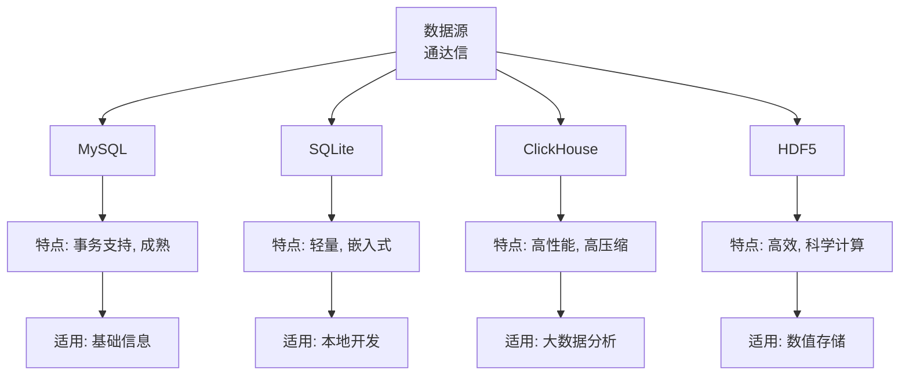

# 目标数据库导入

<cite>
**本文档引用的文件**   
- [pytdx_to_mysql.py](file://hikyuu/data/pytdx_to_mysql.py)
- [tdx_to_mysql.py](file://hikyuu/data/tdx_to_mysql.py)
- [pytdx_to_clickhouse.py](file://hikyuu/data/pytdx_to_clickhouse.py)
- [tdx_to_h5.py](file://hikyuu/data/tdx_to_h5.py)
- [common_mysql.py](file://hikyuu/data/common_mysql.py)
- [common_clickhouse.py](file://hikyuu/data/common_clickhouse.py)
- [common_sqlite3.py](file://hikyuu/data/common_sqlite3.py)
- [common_h5.py](file://hikyuu/data/common_h5.py)
- [em_block_to_mysql.py](file://hikyuu/data/em_block_to_mysql.py)
- [em_block_to_clickhouse.py](file://hikyuu/data/em_block_to_clickhouse.py)
- [mysql_upgrade/createdb.sql](file://hikyuu/data/mysql_upgrade/createdb.sql)
- [clickhouse_upgrade/createdb.sql](file://hikyuu/data/clickhouse_upgrade/createdb.sql)
- [sqlite_upgrade/createdb.sql](file://hikyuu/data/sqlite_upgrade/createdb.sql)
</cite>

## 目录
1. [引言](#引言)
2. [存储后端导入机制](#存储后端导入机制)
3. [数据库驱动与SQL方言适配](#数据库驱动与sql方言适配)
4. [存储引擎性能对比](#存储引擎性能对比)
5. [版本迁移脚本](#版本迁移脚本)
6. [板块数据导入](#板块数据导入)
7. [数据库最佳实践](#数据库最佳实践)
8. [Docker部署与监控](#docker部署与监控)
9. [结论](#结论)

## 引言
本文档详细阐述了Hikyuu项目中支持的MySQL、SQLite、ClickHouse和HDF5四种存储后端的数据库导入机制。文档将深入分析`pytdx_to_mysql.py`和`tdx_to_clickhouse.py`等脚本如何适配不同数据库的驱动接口与SQL方言，对比各存储引擎在读写性能、压缩效率和并发能力上的差异。同时，文档将详细介绍`mysql_upgrade/`、`clickhouse_upgrade/`和`sqlite_upgrade/`目录下的版本迁移脚本作用，包括表结构变更、索引优化和数据校验流程。此外，文档还将解释`em_block_to_*`系列脚本如何将板块数据写入不同数据库，并与股票基础信息关联。最后，文档将提供数据库初始化、连接池配置、批量插入优化及事务控制的最佳实践，并附带各数据库的Docker部署示例和监控指标配置。

## 存储后端导入机制
Hikyuu项目通过一系列专用脚本实现了对MySQL、SQLite、ClickHouse和HDF5四种存储后端的数据导入功能。这些脚本主要从通达信（TDX）数据源获取股票行情数据，并将其导入到目标数据库中。

对于MySQL和SQLite，项目提供了`pytdx_to_mysql.py`和`pytdx_to_h5.py`等脚本。这些脚本利用`pytdx`库连接通达信行情服务器，获取实时或历史K线数据。数据获取后，脚本会通过相应的数据库驱动（如`mysql.connector`用于MySQL，`sqlite3`用于SQLite）将数据批量插入到数据库中。例如，在`pytdx_to_mysql.py`中，`import_data`函数负责协调整个导入流程，它会遍历所有股票，调用`import_one_stock_data`函数逐个导入数据。

对于ClickHouse，项目提供了`pytdx_to_clickhouse.py`脚本。该脚本同样使用`pytdx`库获取数据，但使用`clickhouse_connect`库与ClickHouse数据库进行交互。ClickHouse的导入机制与MySQL类似，但其批量插入操作通过`create_insert_context`和`insert`方法实现，以充分利用ClickHouse的高性能写入能力。

对于HDF5，项目提供了`pytdx_to_h5.py`脚本。该脚本使用`tables`（PyTables）库来操作HDF5文件。数据被组织成HDF5表（`Table`），并使用`zlib`进行压缩以节省存储空间。`import_one_stock_data`函数负责将获取的K线数据追加到对应的HDF5表中。

**Section sources**
- [pytdx_to_mysql.py](file://hikyuu/data/pytdx_to_mysql.py#L446-L494)
- [pytdx_to_clickhouse.py](file://hikyuu/data/pytdx_to_clickhouse.py#L423-L537)
- [pytdx_to_h5.py](file://hikyuu/data/pytdx_to_h5.py#L384-L423)

## 数据库驱动与SQL方言适配
Hikyuu项目通过抽象化数据库操作和使用特定的驱动接口，成功适配了不同数据库的驱动和SQL方言。

项目在`hikyuu/data/common_*.py`文件中定义了针对不同数据库的通用操作函数，如`get_table`、`get_lastdatetime`和`update_extern_data`。这些函数封装了创建表、获取最后一条记录时间戳等通用操作，屏蔽了底层数据库的差异。例如，`common_mysql.py`中的`get_table`函数会检查表是否存在，如果不存在则使用`CREATE TABLE`语句创建；而`common_clickhouse.py`中的同名函数则返回一个包含数据库、表名和分区信息的元组，因为ClickHouse的表结构管理方式不同。

在SQL方言方面，项目通过条件判断和字符串格式化来生成符合目标数据库语法的SQL语句。例如，在`pytdx_to_mysql.py`中，插入数据的SQL语句为：
```sql
INSERT INTO {tablename} (date, open, high, low, close, amount, count) VALUES (%s, %s, %s, %s, %s, %s, %s)
```
而在`pytdx_to_clickhouse.py`中，由于ClickHouse使用不同的参数占位符，插入操作被替换为：
```python
ic = connect.create_insert_context(table=table[0], data=buf)
connect.insert(context=ic, settings={"prefer_warmed_unmerged_parts_seconds": 86400})
```
此外，日期和时间的处理也体现了方言差异。MySQL通常使用`BIGINT`存储时间戳，而ClickHouse则使用`Int32`或`DateTime`类型。项目通过`Datetime`类统一处理时间，然后根据目标数据库的要求进行转换。

**Section sources**
- [common_mysql.py](file://hikyuu/data/common_mysql.py#L150-L206)
- [common_clickhouse.py](file://hikyuu/data/common_clickhouse.py#L115-L145)
- [pytdx_to_mysql.py](file://hikyuu/data/pytdx_to_mysql.py#L409-L411)
- [pytdx_to_clickhouse.py](file://hikyuu/data/pytdx_to_clickhouse.py#L364-L365)

## 存储引擎性能对比
Hikyuu项目支持的四种存储后端在读写性能、压缩效率和并发能力上各有特点。

**MySQL** 作为传统的关系型数据库，提供了强大的事务支持和成熟的生态系统。其MyISAM存储引擎在读取大量历史数据时性能良好，但并发写入能力较弱。在Hikyuu的实现中，MySQL被用作基础信息数据库（`hku_base`），存储股票代码、名称、板块等元数据，这充分发挥了其数据一致性和查询灵活性的优势。

**SQLite** 是一个轻量级的嵌入式数据库，无需独立的服务器进程，非常适合单机应用。它的读写性能在小数据集上表现优异，且文件单一便于管理。然而，当数据量增大或并发访问增多时，其性能会显著下降。在Hikyuu中，SQLite主要用于本地开发和测试环境。

**ClickHouse** 是一个专为在线分析处理（OLAP）设计的列式数据库，其核心优势在于极高的查询性能和数据压缩率。它采用列式存储，使得在进行聚合查询（如计算均值、最大值）时，只需读取相关列的数据，大大减少了I/O开销。同时，其强大的压缩算法可以将原始数据压缩到原来的10%-20%。在Hikyuu中，ClickHouse被用作`hku_data`数据库，存储海量的K线数据，能够快速响应复杂的分析查询。

**HDF5** 是一种用于存储和管理大规模科学数据的文件格式。它支持分层数据结构和高效的数据压缩。在Hikyuu中，HDF5被用作一种高性能的文件存储方案，特别适合存储结构化的数值数据（如K线）。其读写性能接近原生文件I/O，且通过`zlib`压缩有效节省了磁盘空间。

**Diagram sources**
- [common_mysql.py](file://hikyuu/data/common_mysql.py#L3)
- [common_clickhouse.py](file://hikyuu/data/common_clickhouse.py#L2)
- [common_sqlite3.py](file://hikyuu/data/common_sqlite3.py#L2)
- [common_h5.py](file://hikyuu/data/common_h5.py#L2)



## 版本迁移脚本
Hikyuu项目通过`mysql_upgrade/`、`clickhouse_upgrade/`和`sqlite_upgrade/`目录下的版本迁移脚本来管理数据库的演进。这些脚本的核心作用是实现数据库的平滑升级，确保在项目迭代过程中，旧版本的数据库能够顺利迁移到新版本。

每个目录都包含一个`createdb.sql`文件和一系列以数字命名的SQL脚本（如`0001.sql`, `0002.sql`）。`createdb.sql`文件定义了数据库的初始结构，包括所有表、索引和初始数据。当用户首次创建数据库时，会执行此文件。

对于已存在的数据库，系统会通过`get_db_version`函数查询当前数据库的版本号，然后按顺序执行所有版本号大于当前版本的SQL脚本。例如，如果数据库当前版本为5，而目录中有`0006.sql`和`0007.sql`，则这两个脚本会被依次执行。

这些SQL脚本通常包含以下类型的变更：
- **表结构变更**：使用`ALTER TABLE`语句添加、删除或修改列。
- **索引优化**：创建新的索引以加速查询，或删除不再需要的索引以节省空间。
- **数据校验与修复**：执行数据完整性检查，并修复可能存在的错误数据。
- **数据迁移**：将数据从旧表结构迁移到新表结构。

这种基于版本号的增量升级机制，使得数据库的维护变得简单且可靠，避免了手动执行复杂升级步骤的风险。

**Section sources**
- [common_mysql.py](file://hikyuu/data/common_mysql.py#L59-L98)
- [common_clickhouse.py](file://hikyuu/data/common_clickhouse.py#L48-L83)
- [common_sqlite3.py](file://hikyuu/data/common_sqlite3.py#L56-L74)
- [mysql_upgrade/createdb.sql](file://hikyuu/data/mysql_upgrade/createdb.sql)
- [clickhouse_upgrade/createdb.sql](file://hikyuu/data/clickhouse_upgrade/createdb.sql)
- [sqlite_upgrade/createdb.sql](file://hikyuu/data/sqlite_upgrade/createdb.sql)

## 板块数据导入
Hikyuu项目通过`em_block_to_*`系列脚本将东方财富网（East Money）的板块数据导入到不同的数据库中。这些脚本（如`em_block_to_mysql.py`和`em_block_to_clickhouse.py`）的工作流程高度一致，主要分为数据下载和数据库更新两个阶段。

首先，脚本调用`download_block_info()`函数从东方财富网抓取最新的板块信息，包括行业板块、概念板块等。抓取的数据被解析并存储在内存中的字典结构里。

然后，脚本连接到目标数据库，并执行数据库更新操作。以`em_block_to_mysql.py`为例，其核心函数`em_import_block_to_mysql`的流程如下：
1.  删除目标数据库中与抓取的板块类别相关的所有旧数据。
2.  遍历内存中的板块数据，将每个股票代码与板块的关联关系构造成待插入的记录列表。
3.  使用`executemany`方法批量插入这些关联记录。
4.  同样地，将板块指数信息批量插入到`BlockIndex`表中。

这个过程确保了数据库中的板块信息与网络源保持同步。脚本通过先删除后插入的策略，简化了数据更新的逻辑，避免了复杂的增量更新判断。

**Section sources**
- [em_block_to_mysql.py](file://hikyuu/data/em_block_to_mysql.py#L13-L52)
- [em_block_to_clickhouse.py](file://hikyuu/data/em_block_to_clickhouse.py#L12-L52)

## 数据库最佳实践
为了确保Hikyuu项目中数据库的高效和稳定运行，以下是一些关键的最佳实践：

**数据库初始化**：使用`create_database`函数进行初始化。该函数会检查数据库是否存在，如果不存在则创建，并根据版本号应用所有必要的升级脚本，确保数据库结构是最新的。

**连接池配置**：虽然项目代码中未直接体现，但在生产环境中，应使用数据库连接池（如`DBUtils`）来管理数据库连接。这可以避免频繁创建和销毁连接的开销，提高应用性能。

**批量插入优化**：对于大量数据的导入，应始终使用批量插入（`executemany`或`insert` with context）而非逐条插入。这能显著减少网络往返次数和SQL解析开销。在ClickHouse中，还应利用其`settings`参数（如`prefer_warmed_unmerged_parts_seconds`）来优化写入性能。

**事务控制**：在执行一系列相关的数据库操作时，应使用事务来保证数据的一致性。例如，在导入一只股票的K线数据后，紧接着更新其基础信息，这两个操作应放在同一个事务中，以防止出现数据不一致的情况。

## Docker部署与监控
Hikyuu项目提供了Docker部署的可能性，可以为每个数据库后端创建独立的Docker容器。

**MySQL Docker部署示例**：
```dockerfile
FROM mysql:8.0
COPY ./hikyuu/data/mysql_upgrade/createdb.sql /docker-entrypoint-initdb.d/
ENV MYSQL_ROOT_PASSWORD=my-secret-pw
```
此Dockerfile基于官方MySQL镜像，将`createdb.sql`文件复制到初始化目录，当容器首次启动时，会自动执行该脚本创建数据库。

**ClickHouse Docker部署示例**：
```dockerfile
FROM clickhouse/clickhouse-server:latest
COPY ./hikyuu/data/clickhouse_upgrade/createdb.sql /docker-entrypoint-initdb.d/
```
类似地，为ClickHouse创建容器，并自动执行初始化脚本。

**监控指标配置**：
- **MySQL**：监控`Threads_connected`、`Queries`、`Innodb_buffer_pool_read_requests`等状态变量。
- **ClickHouse**：监控`Query`、`Merge`、`MemoryTracking`等指标，可通过`system.metrics`和`system.events`表获取。
- **通用**：监控CPU、内存、磁盘I/O和网络带宽。

## 结论
Hikyuu项目通过精心设计的脚本和模块化架构，成功实现了对MySQL、SQLite、ClickHouse和HDF5四种存储后端的支持。项目通过抽象化数据库操作、使用版本化迁移脚本和优化数据导入流程，确保了数据管理的灵活性、可靠性和高性能。开发者可以根据具体的应用场景（如数据量、查询模式、部署环境）选择最合适的存储后端，并利用文档中提供的最佳实践来优化系统性能。