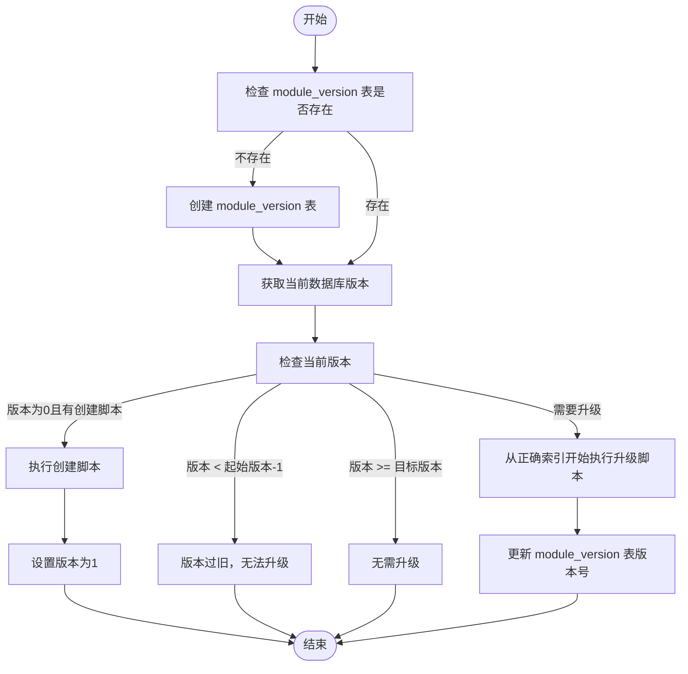

# 数据模式迁移

<cite>
**本文档引用的文件**   
- [0001.sql](file://hikyuu/data/mysql_upgrade/0001.sql)
- [0002.sql](file://hikyuu/data/mysql_upgrade/0002.sql)
- [0003.sql](file://hikyuu/data/mysql_upgrade/0003.sql)
- [0004.sql](file://hikyuu/data/mysql_upgrade/0004.sql)
- [createdb.sql](file://hikyuu/data/mysql_upgrade/createdb.sql)
- [0001.sql](file://hikyuu/data/sqlite_upgrade/0001.sql)
- [0002.sql](file://hikyuu/data/sqlite_upgrade/0002.sql)
- [createdb.sql](file://hikyuu/data/sqlite_upgrade/createdb.sql)
- [createdb.sql](file://hikyuu/data/clickhouse_upgrade/createdb.sql)
- [createdb.sql](file://hikyuu/data/sqlite_mem_sql/createdb.sql)
- [DBUpgrade.cpp](file://hikyuu_cpp/hikyuu/utilities/db_connect/DBUpgrade.cpp)
- [DBUpgrade.h](file://hikyuu_cpp/hikyuu/utilities/db_connect/DBUpgrade.h)
- [common_mysql.py](file://hikyuu/data/common_mysql.py)
- [common_sqlite3.py](file://hikyuu/data/common_sqlite3.py)
- [common_clickhouse.py](file://hikyuu/data/common_clickhouse.py)
</cite>

## 目录
1. [引言](#引言)
2. [版本化SQL脚本管理](#版本化sql脚本管理)
3. [C++层DBUpgrade组件](#c层dbupgrade组件)
4. [用户迁移指南](#用户迁移指南)
5. [特殊场景处理](#特殊场景处理)
6. [数据完整性保护](#数据完整性保护)

## 引言
hikyuu系统通过版本化的SQL脚本和C++层的DBUpgrade组件，实现了安全、可靠的数据库模式演进机制。该机制确保了在系统升级过程中，数据库模式能够自动、原子性地更新到最新版本，同时保护现有数据的完整性和一致性。本文档详细阐述了hikyuu的数据库迁移策略、实现机制和最佳实践。

## 版本化SQL脚本管理

hikyuu使用位于`hikyuu/data/{database_type}_upgrade/`目录下的版本化SQL脚本（如`0001.sql`, `0002.sql`等）来管理数据库模式的演进。每个脚本文件对应一个特定的数据库版本升级。

### 命名规则与执行顺序
升级脚本采用零填充的四位数字命名（如`0001.sql`），数字代表目标数据库版本号。脚本按数字顺序执行，确保模式变更按预定顺序应用。例如，`0001.sql`创建初始数据库结构，`0002.sql`在此基础上进行修改。

### 原子性保证机制
每个升级脚本都设计为原子操作。脚本通常包含一系列数据库变更语句，最后以更新`version`表的语句结束。例如，在MySQL中，`0002.sql`脚本的最后一条语句是`UPDATE hku_base.version set version = 2;`。这种设计确保了只有当所有变更成功执行后，数据库版本号才会被更新，从而保证了升级过程的原子性。

### 数据库创建与初始化
对于全新的数据库，hikyuu提供了`createdb.sql`脚本。该脚本负责创建所有必需的数据库表和初始数据。例如，`mysql_upgrade/createdb.sql`脚本创建了`version`、`market`、`stock`等核心表，并插入了初始数据。

**Section sources**
- [0001.sql](file://hikyuu/data/mysql_upgrade/0001.sql#L1-L5)
- [0002.sql](file://hikyuu/data/mysql_upgrade/0002.sql#L1-L4)
- [createdb.sql](file://hikyuu/data/mysql_upgrade/createdb.sql#L1-L1085)

## C++层DBUpgrade组件

hikyuu的C++层通过`DBUpgrade`组件实现数据库的自动检测和升级。该组件位于`hikyuu_cpp/hikyuu/utilities/db_connect/DBUpgrade.cpp`。

### 组件功能
`DBUpgrade`函数是核心接口，其功能包括：
- **版本检测**：检查数据库中`module_version`表的当前版本。
- **条件判断**：根据当前版本和可用的升级脚本，决定是否需要升级。
- **自动升级**：按顺序执行必要的升级脚本，将数据库更新到最新版本。

### 升级流程
1. **初始化检查**：如果`module_version`表不存在，则创建该表。
2. **获取当前版本**：查询`module_version`表获取当前数据库版本。
3. **升级决策**：
   - 如果当前版本为0且有创建脚本，则执行创建脚本并设置版本为1。
   - 如果当前版本低于升级脚本的起始版本，则拒绝升级（防止版本跳跃）。
   - 如果当前版本已达到或超过目标版本，则无需升级。
4. **执行升级**：从需要开始的脚本索引处，顺序执行所有后续升级脚本。
5. **更新版本**：所有脚本执行成功后，更新`module_version`表中的版本号。

**Diagram sources **
- [DBUpgrade.cpp](file://hikyuu_cpp/hikyuu/utilities/db_connect/DBUpgrade.cpp#L51-L144)

**Section sources**
- [DBUpgrade.cpp](file://hikyuu_cpp/hikyuu/utilities/db_connect/DBUpgrade.cpp#L1-L144)
- [DBUpgrade.h](file://hikyuu_cpp/hikyuu/utilities/db_connect/DBUpgrade.h#L1-L28)

## 用户迁移指南

### 升级前准备
1. **备份数据库**：在执行任何升级操作前，务必备份现有数据库。这是防止数据丢失的最重要步骤。
2. **确认版本**：检查当前hikyuu版本和数据库版本，确保了解需要应用的升级脚本。

### 迁移过程
1. **停止应用**：关闭所有使用hikyuu数据库的应用程序。
2. **执行升级**：启动hikyuu应用，其内部的`DBUpgrade`组件会自动检测并应用必要的升级脚本。
3. **监控过程**：观察应用日志，确保升级过程无错误。`DBUpgrade`组件会输出详细的跟踪信息，如当前版本和执行的脚本索引。

### 回滚策略
如果升级失败或出现问题，应立即停止应用，并使用备份的数据库进行恢复。由于升级脚本是按版本顺序设计的，不建议手动执行回滚SQL，而应直接恢复到备份状态。

**Section sources**
- [common_mysql.py](file://hikyuu/data/common_mysql.py#L1-L522)
- [common_sqlite3.py](file://hikyuu/data/common_sqlite3.py#L1-L142)

## 特殊场景处理

### ClickHouse处理
对于ClickHouse数据库，hikyuu使用`clickhouse_upgrade`目录下的脚本。`createdb.sql`脚本不仅创建表，还定义了复杂的表引擎（如`MergeTree`）和分区策略。Python脚本`common_clickhouse.py`中的`create_database`函数负责按顺序执行这些脚本。

### SQLite内存数据库
`sqlite_mem_sql`目录包含为内存数据库设计的`createdb.sql`脚本。该脚本使用`BEGIN TRANSACTION`和`COMMIT`来确保内存数据库初始化的原子性。

**Section sources**
- [createdb.sql](file://hikyuu/data/clickhouse_upgrade/createdb.sql#L1-L1085)
- [createdb.sql](file://hikyuu/data/sqlite_mem_sql/createdb.sql#L1-L127)

## 数据完整性保护

hikyuu通过多种机制保护数据完整性：
- **原子性升级**：每个升级脚本的最后一步是更新版本号，确保只有完全成功的升级才会被记录。
- **版本检查**：`DBUpgrade`组件会检查版本连续性，防止因缺失中间版本脚本而导致的不一致状态。
- **事务支持**：对于支持事务的数据库（如SQLite），`createdb.sql`脚本使用事务来保证初始化的原子性。
- **错误处理**：`DBUpgrade`组件包含异常捕获机制，确保在查询版本号失败时能优雅处理。

这些措施共同确保了在数据库模式演进过程中，数据的完整性和一致性得到最大程度的保护。

**Section sources**
- [DBUpgrade.cpp](file://hikyuu_cpp/hikyuu/utilities/db_connect/DBUpgrade.cpp#L51-L93)
- [createdb.sql](file://hikyuu/data/sqlite_upgrade/createdb.sql#L1-L127)