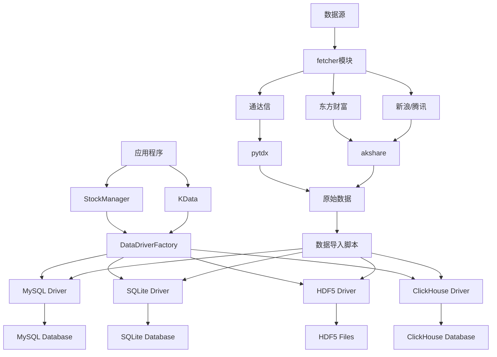

# 数据管理

<cite>
**本文档引用的文件**   
- [__init__.py](file://hikyuu/data/__init__.py)
- [common.py](file://hikyuu/data/common.py)
- [pytdx_to_mysql.py](file://hikyuu/data/pytdx_to_mysql.py)
- [pytdx_to_h5.py](file://hikyuu/data/pytdx_to_h5.py)
- [common_mysql.py](file://hikyuu/data/common_mysql.py)
- [common_sqlite3.py](file://hikyuu/data/common_sqlite3.py)
- [common_h5.py](file://hikyuu/data/common_h5.py)
- [common_pytdx.py](file://hikyuu/data/common_pytdx.py)
- [sqlite_upgrade/0001.sql](file://hikyuu/data/sqlite_upgrade/0001.sql)
- [mysql_upgrade/0001.sql](file://hikyuu/data/mysql_upgrade/0001.sql)
- [weight_to_mysql.py](file://hikyuu/data/weight_to_mysql.py)
- [weight_to_sqlite.py](file://hikyuu/data/weight_to_sqlite.py)
- [fetcher/stock/zh_stock_a_sina_qq.py](file://hikyuu/fetcher/stock/zh_stock_a_sina_qq.py)
- [fetcher/stock/zh_block_em.py](file://hikyuu/fetcher/stock/zh_block_em.py)
- [hikyuu_cpp/hikyuu/data_driver/KDataDriver.h](file://hikyuu_cpp/hikyuu/data_driver/KDataDriver.h)
- [hikyuu_cpp/hikyuu/data_driver/DataDriverFactory.h](file://hikyuu_cpp/hikyuu/data_driver/DataDriverFactory.h)
- [hikyuu_cpp/hikyuu/StockManager.h](file://hikyuu_cpp/hikyuu/StockManager.h)
- [hikyuu_cpp/hikyuu/KData.h](file://hikyuu_cpp/hikyuu/KData.h)
</cite>

## 目录
1. [数据获取与导入](#数据获取与导入)
2. [数据存储与数据驱动架构](#数据存储与数据驱动架构)
3. [批量导入历史数据](#批量导入历史数据)
4. [数据升级机制](#数据升级机制)
5. [数据访问与使用](#数据访问与使用)
6. [数据驱动架构图](#数据驱动架构图)

## 数据获取与导入

Hikyuu框架支持从多个数据源获取金融数据，主要包括通达信（TDX）和东方财富（EM）等。数据获取主要通过`fetcher`模块实现，该模块提供了从不同数据源抓取数据的功能。

`fetcher`模块位于`hikyuu/fetcher/`目录下，其核心功能是实现数据抓取。例如，`zh_stock_a_sina_qq.py`文件实现了从新浪和腾讯财经获取A股股票数据的功能，而`zh_block_em.py`文件则实现了从东方财富获取板块数据的功能。这些数据抓取器通过调用外部API（如akshare库）来获取实时或历史数据。

对于通达信数据源，系统通过`pytdx`库连接到通达信服务器，获取股票代码表、K线数据、分笔数据和分时数据。数据抓取过程包括连接服务器、获取数据和处理数据等步骤。例如，在`pytdx_to_mysql.py`脚本中，通过`TdxHq_API`连接到通达信服务器，然后调用`get_security_bars`等方法获取K线数据。

**Section sources**
- [common.py](file://hikyuu/data/common.py#L25-L249)
- [common_pytdx.py](file://hikyuu/data/common_pytdx.py#L25-L127)
- [fetcher/stock/zh_stock_a_sina_qq.py](file://hikyuu/fetcher/stock/zh_stock_a_sina_qq.py)
- [fetcher/stock/zh_block_em.py](file://hikyuu/fetcher/stock/zh_block_em.py)

## 数据存储与数据驱动架构

Hikyuu框架采用数据驱动（DataDriver）架构，支持多种存储后端，包括MySQL、SQLite、HDF5和ClickHouse等。数据驱动架构的核心思想是将数据访问逻辑与数据存储逻辑分离，使得系统可以灵活地切换不同的存储后端。

在C++核心层，`KDataDriver`类定义了K线数据驱动的接口，不同的存储后端通过继承该接口来实现具体的数据访问逻辑。`DataDriverFactory`类负责创建和管理不同的数据驱动实例。这种设计模式使得系统可以轻松地扩展新的存储后端。

对于不同的存储后端，系统提供了相应的配置和使用方法：
- **MySQL**: 通过`common_mysql.py`模块提供MySQL数据库的创建、表结构定义和数据操作功能。系统会自动创建`hku_base`数据库和相应的K线数据表。
- **SQLite**: 通过`common_sqlite3.py`模块提供SQLite数据库的创建和管理功能。SQLite数据库文件通常存储在本地，适合小型应用。
- **HDF5**: 通过`common_h5.py`模块提供HDF5文件的读写功能。HDF5格式适合存储大规模的数值数据，具有高压缩比和快速访问的特点。
- **ClickHouse**: 通过`common_clickhouse.py`模块提供ClickHouse数据库的连接和操作功能。ClickHouse是一种列式数据库，适合处理大规模的分析查询。

**Section sources**
- [common_mysql.py](file://hikyuu/data/common_mysql.py#L25-L522)
- [common_sqlite3.py](file://hikyuu/data/common_sqlite3.py#L25-L142)
- [common_h5.py](file://hikyuu/data/common_h5.py#L25-L398)
- [hikyuu_cpp/hikyuu/data_driver/KDataDriver.h](file://hikyuu_cpp/hikyuu/data_driver/KDataDriver.h)
- [hikyuu_cpp/hikyuu/data_driver/DataDriverFactory.h](file://hikyuu_cpp/hikyuu/data_driver/DataDriverFactory.h)

## 批量导入历史数据

系统提供了多个脚本用于批量导入历史数据，包括行情数据、财务数据和权重数据。这些脚本通常位于`hikyuu/data/`目录下，以`pytdx_to_*.py`的形式命名。

以`pytdx_to_mysql.py`脚本为例，该脚本用于将通达信格式的历史数据导入到MySQL数据库中。脚本的主要功能包括：
1. 连接到MySQL数据库并创建必要的数据库和表结构
2. 连接到通达信服务器获取股票代码表
3. 导入股票和指数的名称信息
4. 导入日线、5分钟线等K线数据
5. 导入分笔和分时数据

脚本的使用方法如下：
```python
# 配置数据库连接参数
host = "127.0.0.1"
port = 3306
usr = "root"
pwd = ""
tdx_server = "119.147.212.81"
tdx_port = 7709
quotations = ["stock", "fund"]

# 连接数据库
connect = mysql.connector.connect(user=usr, password=pwd, host=host, port=port)
create_database(connect)

# 连接通达信服务器
from pytdx.hq import TdxHq_API
api = TdxHq_API()
api.connect(tdx_server, tdx_port)

# 导入数据
add_count = import_data(connect, "SH", "DAY", quotations, api, progress=ProgressBar)
```

类似地，`pytdx_to_h5.py`脚本用于将数据导入到HDF5文件中，`pytdx_finance_to_mysql.py`脚本用于导入财务数据，`pytdx_weight_to_mysql.py`脚本用于导入权重数据。

**Section sources**
- [pytdx_to_mysql.py](file://hikyuu/data/pytdx_to_mysql.py#L25-L844)
- [pytdx_to_h5.py](file://hikyuu/data/pytdx_to_h5.py#L25-L710)

## 数据升级机制

系统提供了数据升级脚本，用于在数据库结构发生变化时升级现有的数据库。这些脚本位于`hikyuu/data/sqlite_upgrade/`和`hikyuu/data/mysql_upgrade/`目录下，以`0001.sql`、`0002.sql`等命名。

数据升级机制的工作原理如下：
1. 系统首先检查数据库中`version`表的版本号
2. 然后执行版本号大于当前版本的所有升级脚本
3. 每个升级脚本包含一条或多条SQL语句，用于修改数据库结构
4. 升级完成后，更新`version`表中的版本号

例如，`sqlite_upgrade/0001.sql`脚本创建了`version`表并插入初始版本号：
```sql
CREATE TABLE `version` (
    `version` INTEGER NOT NULL
);
INSERT INTO `version` (version) VALUES (1);
```

类似的，`mysql_upgrade/0001.sql`脚本创建了MySQL数据库中的`version`表。这种机制确保了数据库结构的平滑升级，避免了手动修改数据库结构的复杂性。

**Section sources**
- [sqlite_upgrade/0001.sql](file://hikyuu/data/sqlite_upgrade/0001.sql)
- [mysql_upgrade/0001.sql](file://hikyuu/data/mysql_upgrade/0001.sql)
- [common_mysql.py](file://hikyuu/data/common_mysql.py#L60-L98)
- [common_sqlite3.py](file://hikyuu/data/common_sqlite3.py#L56-L76)

## 数据访问与使用

系统提供了`StockManager`和`KData`接口，用于高效地查询和使用数据。`StockManager`类负责管理所有股票的基本信息，包括股票代码、名称、类型等。`KData`类则提供了访问K线数据的接口。

用户可以通过`StockManager`获取特定股票的实例，然后通过该实例的`kdata`方法获取K线数据。例如：
```python
# 获取股票管理器实例
sm = StockManager()

# 获取特定股票
stock = sm.get_stock("SH600000")

# 获取日线数据
kdata = stock.get_kdata(Query.day)

# 访问数据
for k in kdata:
    print(k.datetime, k.open, k.high, k.low, k.close, k.volume)
```

`KData`接口支持多种查询条件，包括日期范围、K线类型（日线、周线、月线等）和复权方式。系统会根据配置的存储后端自动选择合适的数据驱动来获取数据，用户无需关心底层的数据存储细节。

**Section sources**
- [common.py](file://hikyuu/data/common.py#L33-L60)
- [hikyuu_cpp/hikyuu/StockManager.h](file://hikyuu_cpp/hikyuu/StockManager.h)
- [hikyuu_cpp/hikyuu/KData.h](file://hikyuu_cpp/hikyuu/KData.h)

## 数据驱动架构图



**Diagram sources **
- [hikyuu_cpp/hikyuu/data_driver/DataDriverFactory.h](file://hikyuu_cpp/hikyuu/data_driver/DataDriverFactory.h)
- [hikyuu_cpp/hikyuu/data_driver/KDataDriver.h](file://hikyuu_cpp/hikyuu/data_driver/KDataDriver.h)
- [hikyuu_cpp/hikyuu/StockManager.h](file://hikyuu_cpp/hikyuu/StockManager.h)
- [hikyuu/data/common_mysql.py](file://hikyuu/data/common_mysql.py)
- [hikyuu/data/common_sqlite3.py](file://hikyuu/data/common_sqlite3.py)
- [hikyuu/data/common_h5.py](file://hikyuu/data/common_h5.py)
- [hikyuu/data/common_clickhouse.py](file://hikyuu/data/common_clickhouse.py)
- [hikyuu/fetcher/stock/zh_stock_a_sina_qq.py](file://hikyuu/fetcher/stock/zh_stock_a_sina_qq.py)
- [hikyuu/fetcher/stock/zh_block_em.py](file://hikyuu/fetcher/stock/zh_block_em.py)
- [hikyuu/data/pytdx_to_mysql.py](file://hikyuu/data/pytdx_to_mysql.py)
- [hikyuu/data/pytdx_to_h5.py](file://hikyuu/data/pytdx_to_h5.py)