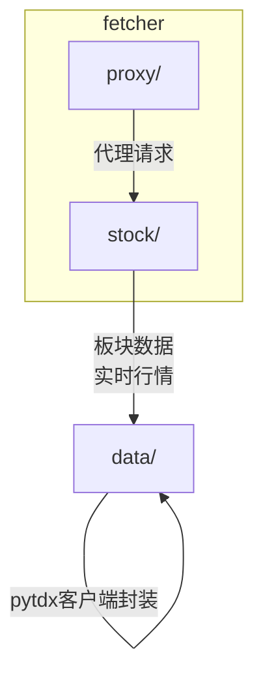
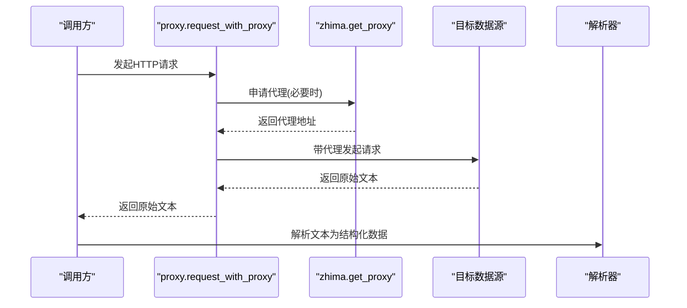
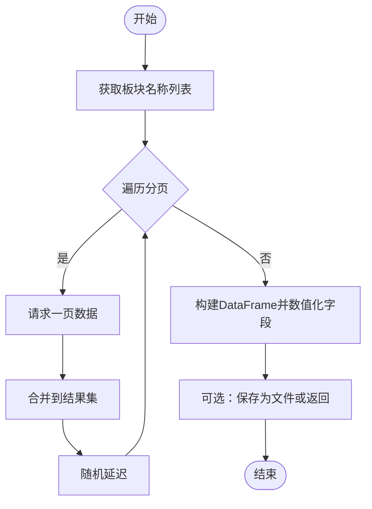
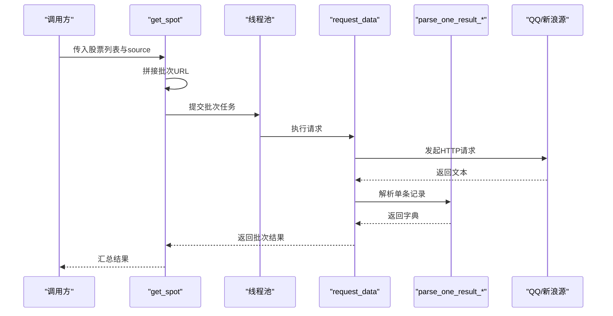
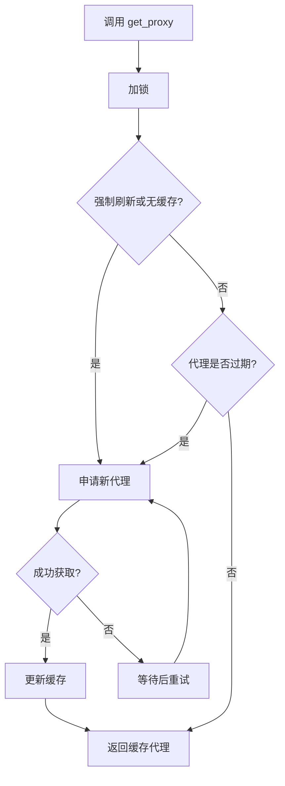
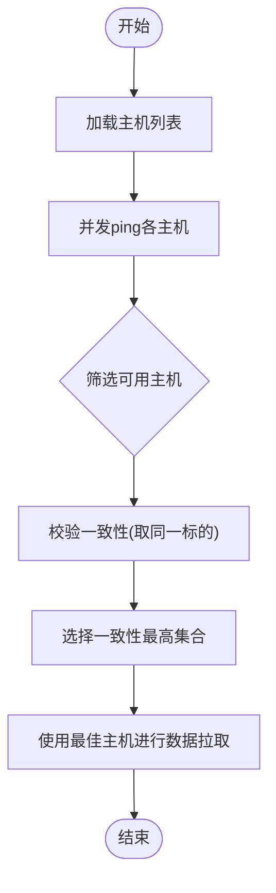
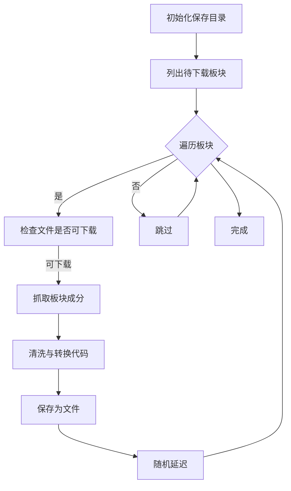
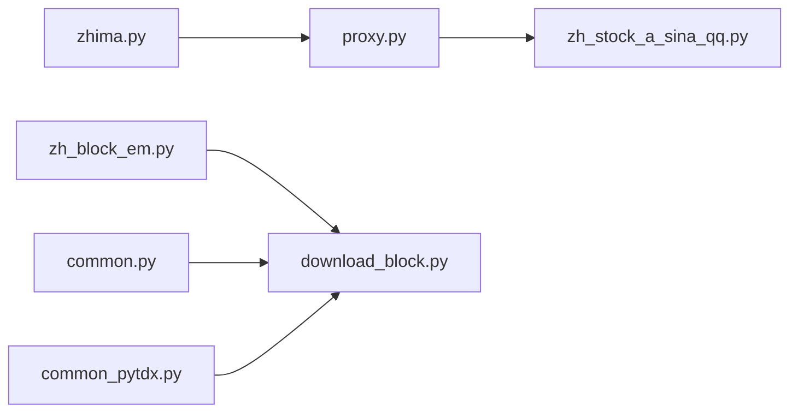

# 数据获取

<cite>
**本文引用的文件**
- [zh_block_em.py](file://hikyuu/fetcher/stock/zh_block_em.py)
- [zh_stock_a_sina_qq.py](file://hikyuu/fetcher/stock/zh_stock_a_sina_qq.py)
- [common_pytdx.py](file://hikyuu/data/common_pytdx.py)
- [download_block.py](file://hikyuu/data/download_block.py)
- [zhima.py](file://hikyuu/fetcher/proxy/zhima.py)
- [proxy.py](file://hikyuu/fetcher/proxy/proxy.py)
- [mylog.py](file://hikyuu/util/mylog.py)
- [common.py](file://hikyuu/data/common.py)
</cite>

## 目录
1. [简介](#简介)
2. [项目结构](#项目结构)
3. [核心组件](#核心组件)
4. [架构总览](#架构总览)
5. [详细组件分析](#详细组件分析)
6. [依赖关系分析](#依赖关系分析)
7. [性能考量](#性能考量)
8. [故障排查指南](#故障排查指南)
9. [结论](#结论)
10. [附录](#附录)

## 简介
本文件面向Hikyuu项目中的数据获取子系统，聚焦fetcher模块的架构与实现，重点说明以下内容：
- 从东方财富、新浪、QQ财经等第三方源抓取A股市场的板块与实时行情数据
- 通过代理服务（如zhima.py）缓解网络访问限制
- 通达信（pytdx）协议客户端封装与K线数据获取
- 板块信息下载工具download_block.py的工作流程
- API调用示例与异常处理、重试机制、性能优化策略
- 为初学者提供简单脚本示例，为高级用户提供扩展新数据源的建议

## 项目结构
fetcher模块位于hikyuu/fetcher，包含两类子模块：
- stock：面向A股数据抓取，如板块与实时行情
- proxy：代理服务封装，提供本地直连与代理请求能力

图表来源
- [zh_block_em.py](file://hikyuu/fetcher/stock/zh_block_em.py#L1-L535)
- [zh_stock_a_sina_qq.py](file://hikyuu/fetcher/stock/zh_stock_a_sina_qq.py#L1-L186)
- [common_pytdx.py](file://hikyuu/data/common_pytdx.py#L1-L127)
- [download_block.py](file://hikyuu/data/download_block.py#L1-L352)
- [proxy.py](file://hikyuu/fetcher/proxy/proxy.py#L1-L39)
- [zhima.py](file://hikyuu/fetcher/proxy/zhima.py#L1-L64)

章节来源
- [zh_block_em.py](file://hikyuu/fetcher/stock/zh_block_em.py#L1-L535)
- [zh_stock_a_sina_qq.py](file://hikyuu/fetcher/stock/zh_stock_a_sina_qq.py#L1-L186)
- [common_pytdx.py](file://hikyuu/data/common_pytdx.py#L1-L127)
- [download_block.py](file://hikyuu/data/download_block.py#L1-L352)
- [proxy.py](file://hikyuu/fetcher/proxy/proxy.py#L1-L39)
- [zhima.py](file://hikyuu/fetcher/proxy/zhima.py#L1-L64)

## 核心组件
- 板块数据抓取（东方财富）：提供行业、概念、地域板块的名称与成分获取能力
- 实时行情抓取（新浪/QQ）：并发请求实时行情，解析并返回结构化数据
- 代理服务：从代理平台获取可用代理，自动轮换与失效检测
- pytdx客户端封装：连接通达信行情服务器，探测最优节点，批量拉取历史分时/逐笔数据
- 板块信息下载器：统一下载并保存板块文件，带缓存与重试逻辑

章节来源
- [zh_block_em.py](file://hikyuu/fetcher/stock/zh_block_em.py#L1-L535)
- [zh_stock_a_sina_qq.py](file://hikyuu/fetcher/stock/zh_stock_a_sina_qq.py#L1-L186)
- [proxy.py](file://hikyuu/fetcher/proxy/proxy.py#L1-L39)
- [zhima.py](file://hikyuu/fetcher/proxy/zhima.py#L1-L64)
- [common_pytdx.py](file://hikyuu/data/common_pytdx.py#L1-L127)
- [download_block.py](file://hikyuu/data/download_block.py#L1-L352)

## 架构总览
整体数据流由“代理层”和“数据源层”组成：
- 代理层：proxy.py封装request_with_proxy/request_with_local；zhima.py负责从代理平台获取可用代理
- 数据源层：zh_stock_a_sina_qq.py抓取实时行情；zh_block_em.py抓取板块数据；download_block.py统一下载并落盘；common_pytdx.py封装pytdx客户端

图表来源
- [proxy.py](file://hikyuu/fetcher/proxy/proxy.py#L1-L39)
- [zhima.py](file://hikyuu/fetcher/proxy/zhima.py#L1-L64)

章节来源
- [proxy.py](file://hikyuu/fetcher/proxy/proxy.py#L1-L39)
- [zhima.py](file://hikyuu/fetcher/proxy/zhima.py#L1-L64)

## 详细组件分析

### 组件A：板块数据抓取（东方财富）
- 功能要点
  - 行业板块名称与成分获取
  - 概念板块名称与成分获取
  - 地域板块名称与成分获取
  - 分页拉取与进度条适配
  - 缓存与延迟控制，降低风控风险
- 关键流程
  - 通过fetch_paginated_data按页拉取，合并排序
  - 使用akshare与pandas进行字段映射与数值化
  - 提供get_all_hybk_info、get_all_gnbk_info、get_all_dybk_info等聚合接口

图表来源
- [zh_block_em.py](file://hikyuu/fetcher/stock/zh_block_em.py#L1-L535)

章节来源
- [zh_block_em.py](file://hikyuu/fetcher/stock/zh_block_em.py#L1-L535)

### 组件B：实时行情抓取（新浪/QQ）
- 功能要点
  - 支持QQ行情源；新浪源已标记不再支持
  - 并发批处理请求，提升吞吐
  - 解析器分别处理新浪/QQ返回格式
  - 支持使用代理或本地直连
- 关键流程
  - get_spot按最大批次拼接URL，ThreadPoolExecutor并发请求
  - request_data对每批结果调用对应解析器
  - parse_one_result_qq/parse_one_result_sina完成字段提取与类型转换

图表来源
- [zh_stock_a_sina_qq.py](file://hikyuu/fetcher/stock/zh_stock_a_sina_qq.py#L1-L186)

章节来源
- [zh_stock_a_sina_qq.py](file://hikyuu/fetcher/stock/zh_stock_a_sina_qq.py#L1-L186)

### 组件C：代理服务（zhima）
- 功能要点
  - 从代理平台申请可用代理，带过期时间校验
  - 多线程安全的全局代理缓存
  - 自动重试与失败回退
- 关键流程
  - request_proxy_from_zhima：请求代理并标准化返回
  - get_proxy：根据new参数决定是否强制刷新，结合过期时间判断

图表来源
- [zhima.py](file://hikyuu/fetcher/proxy/zhima.py#L1-L64)

章节来源
- [zhima.py](file://hikyuu/fetcher/proxy/zhima.py#L1-L64)

### 组件D：pytdx客户端封装
- 功能要点
  - 自定义主机列表加载（支持用户自定义hosts）
  - 连通性探测与延迟测量
  - 最优节点选择：多节点并发探测，校验返回一致性
  - 历史分时/逐笔数据分段拉取
- 关键流程
  - search_best_tdx：并发ping各节点，筛选可用节点
  - 校验阶段：对候选节点取同一标的的历史数据，统计一致结果最多的集合
  - pytdx_get_day_trans：按固定步长分页拉取逐笔数据

图表来源
- [common_pytdx.py](file://hikyuu/data/common_pytdx.py#L1-L127)

章节来源
- [common_pytdx.py](file://hikyuu/data/common_pytdx.py#L1-L127)

### 组件E：板块信息下载器
- 功能要点
  - 下载行业、概念、地域、指数板块成分并保存为文件
  - 文件命名与路径管理，避免重复下载
  - 异常捕获与重试策略，针对常见网络错误给出提示
- 关键流程
  - down_em_all_hybk_info/down_em_all_gnbk_info/down_em_all_dybk_info：按板块名称逐一下载
  - download_all_zsbk_info：指数成分拉取，兼容多个数据源
  - read_block_from_path：从本地目录读取已保存的板块文件

图表来源
- [download_block.py](file://hikyuu/data/download_block.py#L1-L352)

章节来源
- [download_block.py](file://hikyuu/data/download_block.py#L1-L352)

## 依赖关系分析
- 模块间耦合
  - zh_stock_a_sina_qq.py依赖proxy模块进行网络请求
  - zh_block_em.py依赖requests、akshare、pandas进行数据抓取与处理
  - download_block.py依赖zh_block_em.py与common.py中的代码清洗工具
  - common_pytdx.py依赖pytdx库与用户自定义hosts
- 外部依赖
  - requests、akshare、pandas、pytdx
  - 代理平台API（zhima）

图表来源
- [proxy.py](file://hikyuu/fetcher/proxy/proxy.py#L1-L39)
- [zhima.py](file://hikyuu/fetcher/proxy/zhima.py#L1-L64)
- [zh_block_em.py](file://hikyuu/fetcher/stock/zh_block_em.py#L1-L535)
- [download_block.py](file://hikyuu/data/download_block.py#L1-L352)
- [common.py](file://hikyuu/data/common.py#L1-L200)
- [common_pytdx.py](file://hikyuu/data/common_pytdx.py#L1-L127)

章节来源
- [proxy.py](file://hikyuu/fetcher/proxy/proxy.py#L1-L39)
- [zhima.py](file://hikyuu/fetcher/proxy/zhima.py#L1-L64)
- [zh_block_em.py](file://hikyuu/fetcher/stock/zh_block_em.py#L1-L535)
- [download_block.py](file://hikyuu/data/download_block.py#L1-L352)
- [common.py](file://hikyuu/data/common.py#L1-L200)
- [common_pytdx.py](file://hikyuu/data/common_pytdx.py#L1-L127)

## 性能考量
- 并发与批处理
  - 实时行情：get_spot使用ThreadPoolExecutor并发请求，减少总耗时
  - 板块下载：download_block.py对每个板块独立处理，避免阻塞
- 延迟与节流
  - 随机延迟：zh_block_em.py与download_block.py在请求之间插入随机延迟，降低风控概率
  - 分页拉取：zh_block_em.py按页拉取并合并，避免一次性请求过多数据
- 代理与容错
  - 代理重试：proxy.request_with_proxy最多尝试若干次，失败后抛出异常
  - zhima代理：get_proxy在过期或不可用时自动刷新
- 客户端优化
  - pytdx：search_best_tdx先筛选可用节点再校验一致性，减少无效请求

章节来源
- [zh_stock_a_sina_qq.py](file://hikyuu/fetcher/stock/zh_stock_a_sina_qq.py#L1-L186)
- [zh_block_em.py](file://hikyuu/fetcher/stock/zh_block_em.py#L1-L535)
- [download_block.py](file://hikyuu/data/download_block.py#L1-L352)
- [proxy.py](file://hikyuu/fetcher/proxy/proxy.py#L1-L39)
- [zhima.py](file://hikyuu/fetcher/proxy/zhima.py#L1-L64)
- [common_pytdx.py](file://hikyuu/data/common_pytdx.py#L1-L127)

## 故障排查指南
- 常见异常与处理
  - 网络错误：download_block.py对ConnectionError等进行捕获并提示，避免中断
  - 代理不可用：proxy.request_with_proxy在多次尝试后仍失败会抛出异常
  - 数据源限制：实时行情中新浪源已标记不再支持，建议使用QQ源
- 日志与告警
  - 使用hku_info/hku_warn/hku_error输出运行状态与错误信息
  - mylog.py提供统一的日志接口与文件句柄管理
- 重试与退避
  - 代理层：最多重试若干次，期间等待固定时间
  - 板块下载：对个别失败的板块进行warn并继续下一个

章节来源
- [download_block.py](file://hikyuu/data/download_block.py#L1-L352)
- [proxy.py](file://hikyuu/fetcher/proxy/proxy.py#L1-L39)
- [zh_stock_a_sina_qq.py](file://hikyuu/fetcher/stock/zh_stock_a_sina_qq.py#L1-L186)
- [mylog.py](file://hikyuu/util/mylog.py#L1-L200)

## 结论
fetcher模块通过清晰的分层设计实现了对A股数据的稳定抓取：
- 代理层保障网络访问稳定性
- 数据源层提供多样化的数据源与解析能力
- 工具层统一管理板块数据的下载与落盘
- pytdx封装为历史数据获取提供了高效通道

在实际使用中，建议结合代理与随机延迟策略，合理设置并发度，并对异常进行捕获与重试，以获得更稳健的数据获取体验。

## 附录

### API调用示例（路径指引）
- 获取行业板块名称与成分
  - 函数入口：[get_hybk_names](file://hikyuu/fetcher/stock/zh_block_em.py#L20-L49)
  - 成分获取：[get_hybk_cons_code](file://hikyuu/fetcher/stock/zh_block_em.py#L52-L81)
  - 聚合接口：[get_all_hybk_info](file://hikyuu/fetcher/stock/zh_block_em.py#L84-L96)
- 获取概念板块名称与成分
  - 名称列表：[stock_board_concept_name_em](file://hikyuu/fetcher/stock/zh_block_em.py#L172-L249)
  - 成分列表：[stock_board_concept_cons_em](file://hikyuu/fetcher/stock/zh_block_em.py#L332-L431)
  - 聚合接口：[get_all_gnbk_info](file://hikyuu/fetcher/stock/zh_block_em.py#L434-L446)
- 获取地域板块名称与成分
  - 名称列表：[get_dybk_names](file://hikyuu/fetcher/stock/zh_block_em.py#L449-L478)
  - 成分列表：[get_all_dybk_info](file://hikyuu/fetcher/stock/zh_block_em.py#L481-L528)
- 实时行情抓取（QQ）
  - 主入口：[get_spot](file://hikyuu/fetcher/stock/zh_stock_a_sina_qq.py#L137-L181)
  - QQ解析器：[parse_one_result_qq](file://hikyuu/fetcher/stock/zh_stock_a_sina_qq.py#L60-L121)
  - 新浪解析器（已不支持）：[parse_one_result_sina](file://hikyuu/fetcher/stock/zh_stock_a_sina_qq.py#L15-L58)
- 代理请求
  - 代理请求：[request_with_proxy](file://hikyuu/fetcher/proxy/proxy.py#L17-L35)
  - 本地请求：[request_with_local](file://hikyuu/fetcher/proxy/proxy.py#L37-L39)
  - 代理获取：[get_proxy](file://hikyuu/fetcher/proxy/zhima.py#L46-L64)
- pytdx客户端
  - 最佳节点选择：[search_best_tdx](file://hikyuu/data/common_pytdx.py#L72-L98)
  - 连通性探测：[ping](file://hikyuu/data/common_pytdx.py#L52-L69)
  - 逐笔数据拉取：[pytdx_get_day_trans](file://hikyuu/data/common_pytdx.py#L101-L110)
- 板块下载器
  - 下载行业板块：[down_em_all_hybk_info](file://hikyuu/data/download_block.py#L127-L151)
  - 下载概念板块：[down_em_all_gnbk_info](file://hikyuu/data/download_block.py#L153-L179)
  - 下载地域板块：[down_em_all_dybk_info](file://hikyuu/data/download_block.py#L182-L243)
  - 下载指数板块：[download_all_zsbk_info](file://hikyuu/data/download_block.py#L245-L333)
  - 读取本地板块：[read_block_from_path](file://hikyuu/data/download_block.py#L43-L101)

### 初学者脚本示例（路径指引）
- 抓取行业板块名称与成分
  - 步骤：调用[get_hybk_names](file://hikyuu/fetcher/stock/zh_block_em.py#L20-L49)获取名称，再调用[get_hybk_cons_code](file://hikyuu/fetcher/stock/zh_block_em.py#L52-L81)获取成分
- 抓取概念板块名称与成分
  - 步骤：调用[stock_board_concept_name_em](file://hikyuu/fetcher/stock/zh_block_em.py#L172-L249)，再调用[stock_board_concept_cons_em](file://hikyuu/fetcher/stock/zh_block_em.py#L332-L431)
- 抓取实时行情（QQ）
  - 步骤：准备股票列表，调用[get_spot](file://hikyuu/fetcher/stock/zh_stock_a_sina_qq.py#L137-L181)，解析返回结果
- 使用代理抓取
  - 步骤：调用[request_with_proxy](file://hikyuu/fetcher/proxy/proxy.py#L17-L35)，内部会自动调用[get_proxy](file://hikyuu/fetcher/proxy/zhima.py#L46-L64)

### 高级用户扩展指南
- 新增数据源步骤
  - 在stock目录新增模块，定义数据源接口与解析器
  - 若涉及网络访问，优先复用proxy模块提供的request_with_proxy/request_with_local
  - 对于需要代理的服务，可在模块内调用get_proxy
- 代理扩展
  - 在zhima.py中添加新的代理平台API，保持与现有接口一致
  - 更新proxy.py以支持新代理格式
- 性能优化建议
  - 合理设置并发度与批大小，避免触发目标站点限流
  - 在请求间加入随机延迟，降低风控概率
  - 对热点数据使用缓存（如lru_cache装饰器），减少重复请求