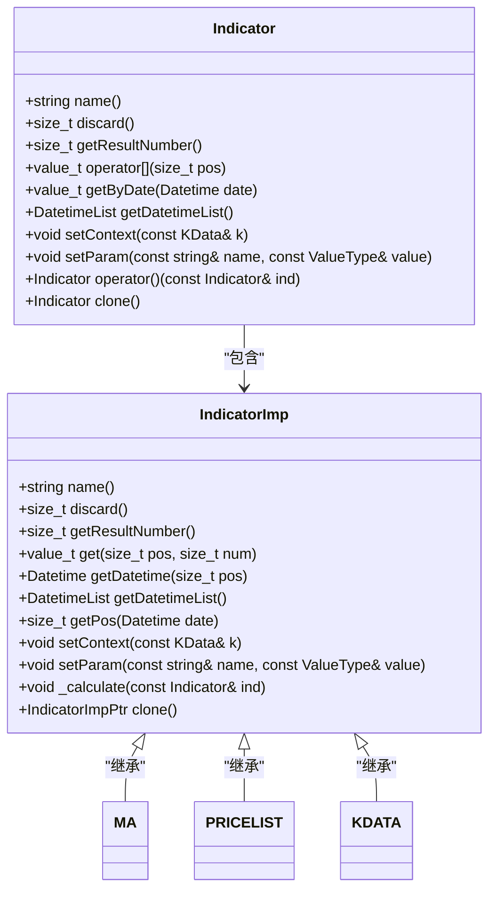
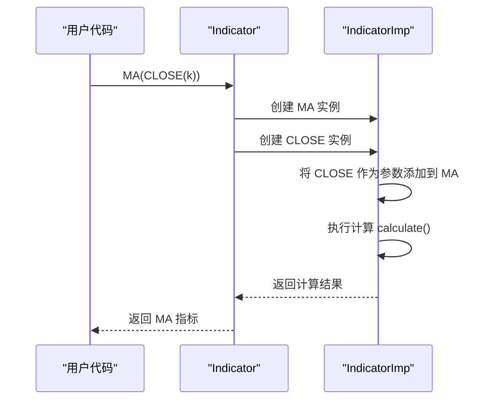
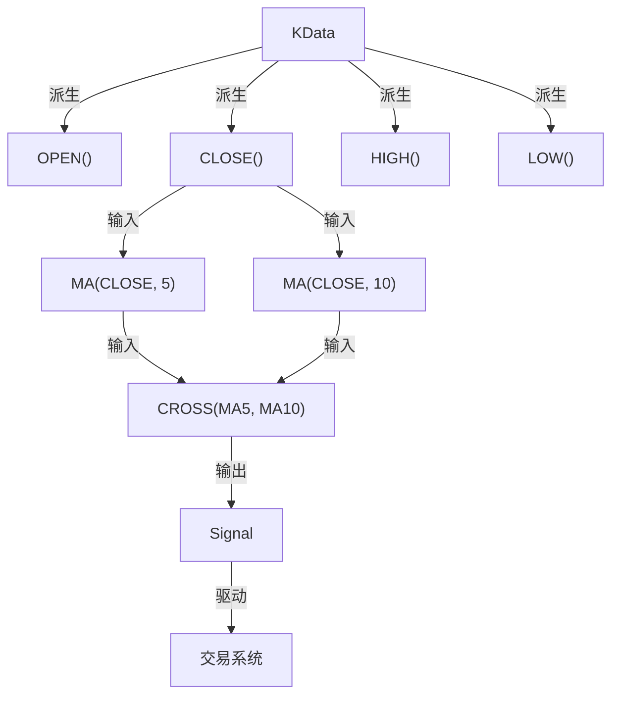

# Indicator（技术指标）

<cite>
**本文档引用文件**   
- [indicator.py](file://hikyuu/indicator/indicator.py)
- [Indicator.h](file://hikyuu_cpp/hikyuu/indicator/Indicator.h)
- [Indicator.cpp](file://hikyuu_cpp/hikyuu/indicator/Indicator.cpp)
- [IndicatorImp.h](file://hikyuu_cpp/hikyuu/indicator/IndicatorImp.h)
- [IndicatorImp.cpp](file://hikyuu_cpp/hikyuu/indicator/IndicatorImp.cpp)
- [build_in.h](file://hikyuu_cpp/hikyuu/indicator/build_in.h)
- [pyind.py](file://hikyuu/indicator/pyind.py)
- [MA.h](file://hikyuu_cpp/hikyuu/indicator/crt/MA.h)
- [PRICELIST.h](file://hikyuu_cpp/hikyuu/indicator/crt/PRICELIST.h)
- [KDATA.h](file://hikyuu_cpp/hikyuu/indicator/crt/KDATA.h)
- [Indicator.py](file://hikyuu/test/Indicator.py)
</cite>

## 目录
1. [简介](#简介)
2. [核心设计与架构](#核心设计与架构)
3. [核心属性](#核心属性)
4. [数据访问接口](#数据访问接口)
5. [上下文与参数化能力](#上下文与参数化能力)
6. [动态组合与克隆](#动态组合与克隆)
7. [内部实现机制](#内部实现机制)
8. [KData派生与交易系统集成](#kdata派生与交易系统集成)
9. [测试用例分析](#测试用例分析)
10. [总结](#总结)

## 简介
Indicator引擎是hikyuu量化框架的核心计算单元，它是一个功能强大的向量化计算系统，专门设计用于高效处理整个K线序列。该引擎不仅提供了丰富的内置技术指标（如MA、RSI、MACD等），还支持用户自定义指标，并通过灵活的参数化和上下文机制，实现了指标的动态组合与复用。Indicator引擎的设计理念是将复杂的金融计算抽象为可组合、可复用的函数式编程模型，使得策略开发更加简洁高效。

**Section sources**
- [Indicator.h](file://hikyuu_cpp/hikyuu/indicator/Indicator.h#L1-L50)

## 核心设计与架构
Indicator引擎采用C++实现核心计算逻辑，并通过Python包装器提供易用的接口。其架构分为两层：上层的`Indicator`类作为用户接口，封装了所有公共方法；下层的`IndicatorImp`类作为实现基类，负责具体的计算逻辑和内存管理。

**Diagram sources**
- [Indicator.h](file://hikyuu_cpp/hikyuu/indicator/Indicator.h#L40-L259)
- [IndicatorImp.h](file://hikyuu_cpp/hikyuu/indicator/IndicatorImp.h#L28-L264)

## 核心属性
Indicator引擎的核心属性定义了其行为和输出特征，主要包括：

- **指标名称 (name)**: 通过`name()`和`name(const string& name)`方法获取和设置，用于标识指标的类型和用途。
- **抛弃期 (discard)**: 通过`discard()`和`setDiscard(size_t discard)`方法管理，表示计算结果中需要抛弃的前N个无效数据点，通常用于处理移动平均等需要历史数据的指标。
- **结果集数量 (getResultNumber)**: 通过`getResultNumber()`方法获取，指示该指标可以输出多少个独立的结果序列，例如MACD指标会同时输出DIF、DEA和MACD柱三个结果。

这些属性共同决定了指标的计算范围和输出格式。

**Section sources**
- [Indicator.h](file://hikyuu_cpp/hikyuu/indicator/Indicator.h#L65-L93)

## 数据访问接口
Indicator引擎提供了多种灵活的数据访问接口，以满足不同的分析需求：

- **按位置访问**: 使用`operator`或`get(size_t pos, size_t num)`方法，通过索引位置获取指定结果集的值。
- **按日期访问**: 使用`getByDate(Datetime date, size_t num)`方法，通过日期直接查询对应的数据值，无需手动计算索引。
- **获取日期列表**: 使用`getDatetimeList()`方法，返回与指标数据序列对应的日期列表，便于进行时间对齐和可视化。

这些接口使得Indicator不仅是一个计算单元，更是一个完整的时序数据容器。

**Section sources**
- [Indicator.h](file://hikyuu_cpp/hikyuu/indicator/Indicator.h#L100-L151)

## 上下文与参数化能力
Indicator引擎的强大之处在于其上下文（Context）和参数化（Param）能力。

- **上下文 (setContext)**: 通过`setContext(const KData& k)`方法，可以为指标设置一个K线数据上下文。这使得指标能够访问完整的K线信息（如开盘价、最高价等），并基于此进行计算。例如，`CLOSE(k)`会从上下文`k`中提取收盘价序列。
- **参数化 (setParam/getParam)**: 通过`setParam`和`getParam`模板方法，可以为指标设置和获取任意类型的参数。这不仅支持基本数据类型，还支持将其他Indicator作为参数（通过`setIndParam`），从而实现指标的动态嵌套和组合。

这种设计使得Indicator具有极高的灵活性和可扩展性。

**Section sources**
- [Indicator.h](file://hikyuu_cpp/hikyuu/indicator/Indicator.h#L75-L180)
- [IndicatorImp.h](file://hikyuu_cpp/hikyuu/indicator/IndicatorImp.h#L29-L30)

## 动态组合与克隆
Indicator引擎支持通过`operator()`实现指标的动态组合与克隆。

- **动态组合**: `operator()(const Indicator& ind)`方法允许将一个指标作为参数传递给另一个指标，从而生成一个新的、计算结果已更新的指标实例。这在实现如`MA(CLOSE())`这样的复合指标时非常关键。
- **克隆 (clone)**: `clone()`方法创建当前指标的一个深拷贝，包括其所有参数、上下文和计算状态。这对于在策略回测中复用指标配置至关重要，避免了因共享状态而导致的计算错误。

**Diagram sources**
- [Indicator.h](file://hikyuu_cpp/hikyuu/indicator/Indicator.h#L57-L63)
- [Indicator.cpp](file://hikyuu_cpp/hikyuu/indicator/Indicator.cpp#L103-L119)

## 内部实现机制
Indicator引擎的内部实现基于`IndicatorImp`基类，它管理着计算所需的所有资源。

- **IndicatorImp实现**: `IndicatorImp`类负责管理结果数据的内存缓冲区（`m_pBuffer`）、计算状态（`m_need_calculate`）和操作类型（`m_optype`）。它通过`_readyBuffer`方法预分配内存，并通过`_set`和`get`方法进行数据读写。
- **结果集管理**: 每个`IndicatorImp`实例最多可以管理`MAX_RESULT_NUM`（6个）结果集。结果数据以`vector<value_t>`的形式存储在`m_pBuffer`数组中，通过`getResult`和`getResultAsPriceList`方法可以提取指定的结果集。

这种设计确保了计算的高效性和内存的安全性。

**Section sources**
- [IndicatorImp.h](file://hikyuu_cpp/hikyuu/indicator/IndicatorImp.h#L261-L264)
- [IndicatorImp.cpp](file://hikyuu_cpp/hikyuu/indicator/IndicatorImp.cpp#L235-L262)

## KData派生与交易系统集成
Indicator引擎与KData紧密集成，是交易系统各组件的基础输入。

- **KData派生**: 通过`KDATA.h`中定义的函数（如`OPEN()`、`CLOSE()`、`HIGH()`、`LOW()`等），可以从`KData`对象中派生出相应的Indicator。例如，`CLOSE(k)`会返回一个包含`k`中所有收盘价的Indicator。
- **交易系统集成**: Indicator作为交易系统中Signal（信号）、Stoploss（止损）等组件的输入。这些组件通过分析Indicator的输出来生成交易信号或执行风控逻辑。例如，一个简单的金叉信号可以定义为`CROSS(MA(CLOSE(), 5), MA(CLOSE(), 10))`。

**Diagram sources**
- [KDATA.h](file://hikyuu_cpp/hikyuu/indicator/crt/KDATA.h#L17-L72)
- [build_in.h](file://hikyuu_cpp/hikyuu/indicator/build_in.h#L13-L131)

## 测试用例分析
通过分析`test/Indicator.py`中的测试用例，可以验证Indicator引擎的功能。

- **PRICELIST测试**: 验证了`PRICELIST`函数能够正确地将`PriceList`包装成`Indicator`，并正确访问其数据。
- **PythonIndicator测试**: 展示了如何通过继承`IndicatorImp`在Python中实现自定义指标，并验证了其计算逻辑的正确性。
- **操作符测试**: 验证了Indicator支持的算术和逻辑操作符（如`+`、`-`、`>`等）能够正确执行向量化计算。
- **MA测试**: 验证了`MA`（移动平均）指标的计算结果符合预期。

这些测试用例确保了Indicator引擎的稳定性和可靠性。

**Section sources**
- [Indicator.py](file://hikyuu/test/Indicator.py#L32-L234)

## 总结
Indicator引擎是hikyuu框架的计算核心，它通过向量化计算、上下文管理和参数化设计，提供了一个强大而灵活的技术指标计算平台。其清晰的架构、丰富的接口和与KData的深度集成，使得用户能够高效地开发和测试复杂的量化交易策略。无论是使用内置指标还是创建自定义指标，Indicator引擎都为量化分析提供了坚实的基础。