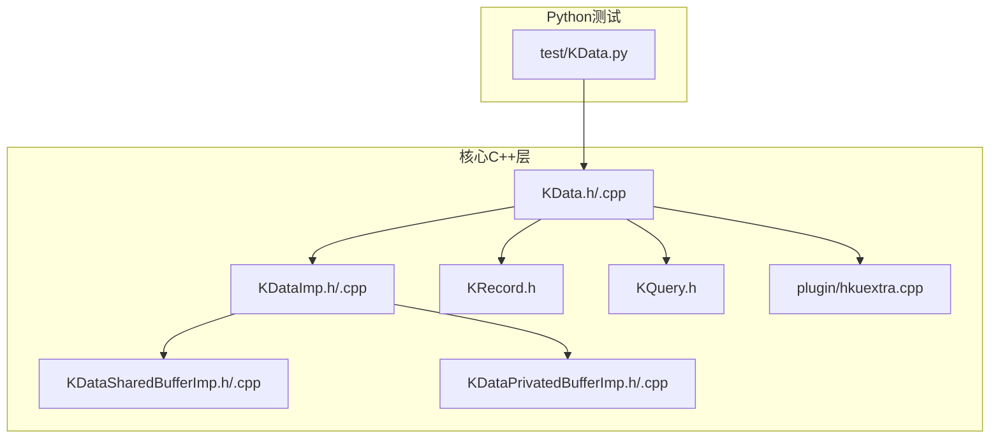
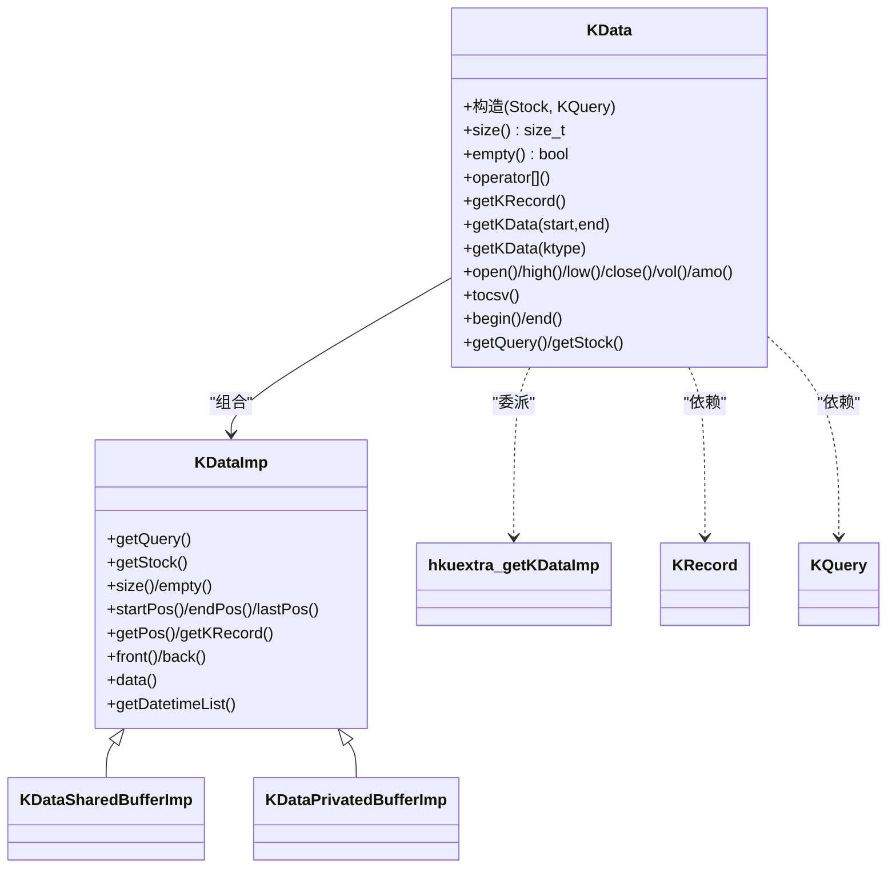
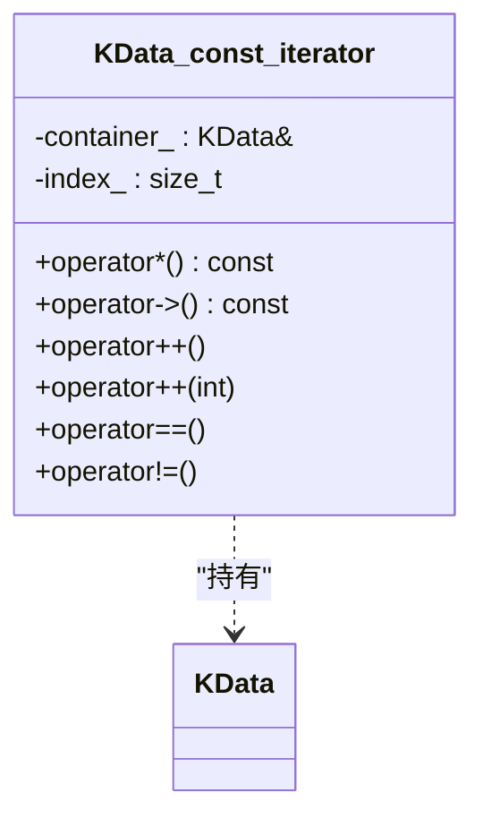
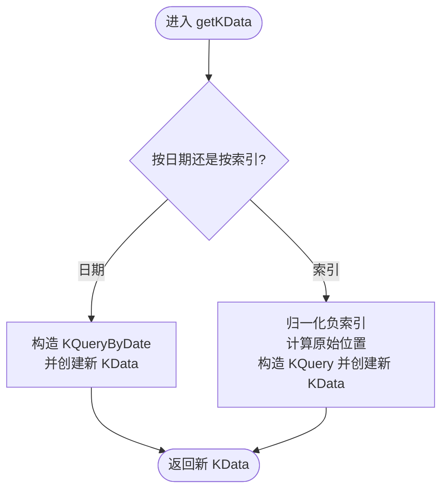
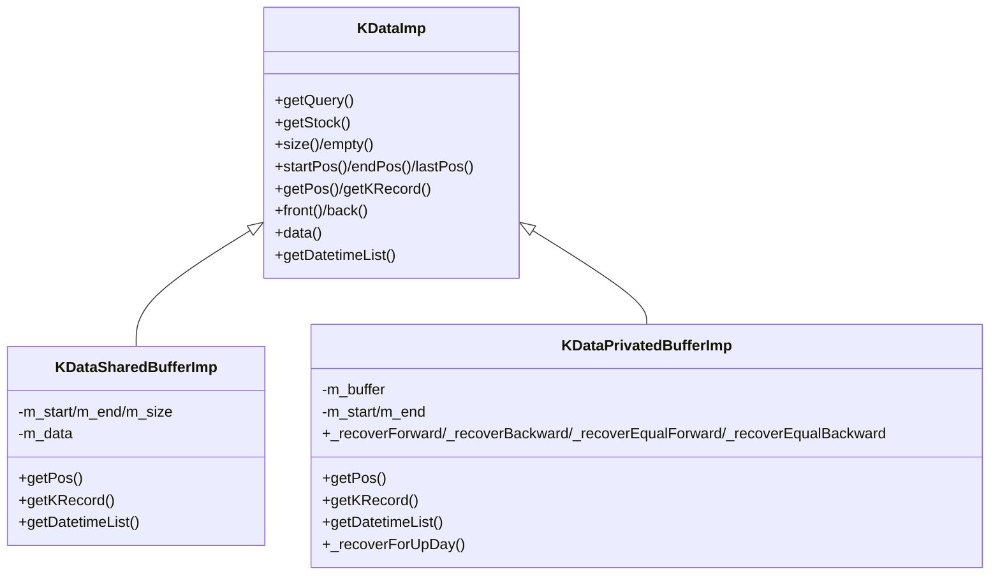
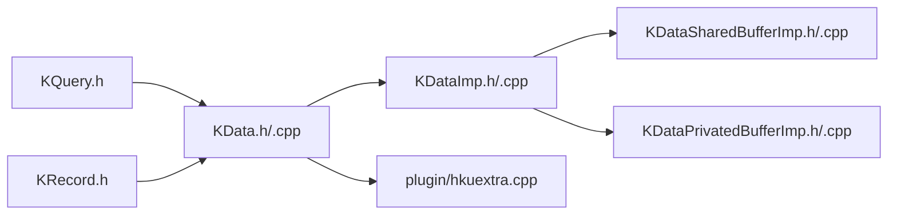

# KData（K线数据）

<cite>
**本文引用的文件列表**
- [KData.h](file://hikyuu_cpp/hikyuu/KData.h)
- [KData.cpp](file://hikyuu_cpp/hikyuu/KData.cpp)
- [KDataImp.h](file://hikyuu_cpp/hikyuu/KDataImp.h)
- [KDataImp.cpp](file://hikyuu_cpp/hikyuu/KDataImp.cpp)
- [KDataSharedBufferImp.h](file://hikyuu_cpp/hikyuu/KDataSharedBufferImp.h)
- [KDataSharedBufferImp.cpp](file://hikyuu_cpp/hikyuu/KDataSharedBufferImp.cpp)
- [KDataPrivatedBufferImp.h](file://hikyuu_cpp/hikyuu/KDataPrivatedBufferImp.h)
- [KDataPrivatedBufferImp.cpp](file://hikyuu_cpp/hikyuu/KDataPrivatedBufferImp.cpp)
- [hkuextra.cpp](file://hikyuu_cpp/hikyuu/plugin/hkuextra.cpp)
- [KRecord.h](file://hikyuu_cpp/hikyuu/KRecord.h)
- [KQuery.h](file://hikyuu_cpp/hikyuu/KQuery.h)
- [KData.py](file://hikyuu/test/KData.py)
</cite>

## 目录
1. [简介](#简介)
2. [项目结构与定位](#项目结构与定位)
3. [核心组件总览](#核心组件总览)
4. [架构概览](#架构概览)
5. [详细组件分析](#详细组件分析)
6. [依赖关系分析](#依赖关系分析)
7. [性能与复杂度](#性能与复杂度)
8. [故障排查指南](#故障排查指南)
9. [结论](#结论)
10. [附录：测试用例与最佳实践](#附录测试用例与最佳实践)

## 简介
本篇文档系统性解析Hikyuu框架中的KData类，作为行情数据的核心封装，它通过Stock实例与KQuery查询条件，构建特定范围、周期与复权类型的K线序列，并提供标准C++迭代器、索引与日期访问、便捷指标提取、切片与导出等能力。文档同时阐明KData与Stock的关联关系，以及内部KDataImp实现机制（共享缓冲区与私有缓冲区两种策略），并结合Python测试用例展示在数据切片、属性访问与序列操作方面的最佳实践。

## 项目结构与定位
- KData位于核心库hikyuu_cpp/hikyuu目录，围绕KRecord（K线记录）与KQuery（查询条件）组织数据。
- KData通过KDataImp接口抽象不同实现策略（共享缓冲区与私有缓冲区），并通过插件机制委托给扩展模块（hkuextra）选择具体实现。
- Python侧测试用例位于hikyuu/test/KData.py，验证KData的基本行为与序列操作。

图表来源
- [KData.h](file://hikyuu_cpp/hikyuu/KData.h#L1-L210)
- [KData.cpp](file://hikyuu_cpp/hikyuu/KData.cpp#L1-L120)
- [KDataImp.h](file://hikyuu_cpp/hikyuu/KDataImp.h#L1-L84)
- [KDataImp.cpp](file://hikyuu_cpp/hikyuu/KDataImp.cpp#L1-L19)
- [KDataSharedBufferImp.h](file://hikyuu_cpp/hikyuu/KDataSharedBufferImp.h#L1-L70)
- [KDataSharedBufferImp.cpp](file://hikyuu_cpp/hikyuu/KDataSharedBufferImp.cpp#L1-L76)
- [KDataPrivatedBufferImp.h](file://hikyuu_cpp/hikyuu/KDataPrivatedBufferImp.h#L1-L74)
- [KDataPrivatedBufferImp.cpp](file://hikyuu_cpp/hikyuu/KDataPrivatedBufferImp.cpp#L1-L120)
- [hkuextra.cpp](file://hikyuu_cpp/hikyuu/plugin/hkuextra.cpp#L60-L88)
- [KRecord.h](file://hikyuu_cpp/hikyuu/KRecord.h#L1-L98)
- [KQuery.h](file://hikyuu_cpp/hikyuu/KQuery.h#L1-L200)
- [KData.py](file://hikyuu/test/KData.py#L1-L65)

章节来源
- [KData.h](file://hikyuu_cpp/hikyuu/KData.h#L1-L210)
- [KData.cpp](file://hikyuu_cpp/hikyuu/KData.cpp#L1-L120)
- [KDataImp.h](file://hikyuu_cpp/hikyuu/KDataImp.h#L1-L84)
- [KDataImp.cpp](file://hikyuu_cpp/hikyuu/KDataImp.cpp#L1-L19)
- [KDataSharedBufferImp.h](file://hikyuu_cpp/hikyuu/KDataSharedBufferImp.h#L1-L70)
- [KDataSharedBufferImp.cpp](file://hikyuu_cpp/hikyuu/KDataSharedBufferImp.cpp#L1-L76)
- [KDataPrivatedBufferImp.h](file://hikyuu_cpp/hikyuu/KDataPrivatedBufferImp.h#L1-L74)
- [KDataPrivatedBufferImp.cpp](file://hikyuu_cpp/hikyuu/KDataPrivatedBufferImp.cpp#L1-L120)
- [hkuextra.cpp](file://hikyuu_cpp/hikyuu/plugin/hkuextra.cpp#L60-L88)
- [KRecord.h](file://hikyuu_cpp/hikyuu/KRecord.h#L1-L98)
- [KQuery.h](file://hikyuu_cpp/hikyuu/KQuery.h#L1-L200)
- [KData.py](file://hikyuu/test/KData.py#L1-L65)

## 核心组件总览
- KData：对外暴露的K线序列容器，提供构造、迭代、访问、切片、导出、指标提取等接口。
- KDataImp：抽象接口，定义统一的数据访问与元信息接口。
- KDataSharedBufferImp：共享缓冲区实现，直接引用Stock内部缓存，适合无复权、已缓存场景。
- KDataPrivatedBufferImp：私有缓冲区实现，持有拷贝数据并可执行复权计算，支持多种复权类型。
- hkuextra::getKDataImp：插件委派入口，优先由扩展插件提供实现，否则回退到私有缓冲区。
- KRecord：单条K线记录，包含时间、开盘、最高、最低、收盘、成交量、成交金额等字段。
- KQuery：查询条件，支持按索引/日期、K线类型、复权类型等。

章节来源
- [KData.h](file://hikyuu_cpp/hikyuu/KData.h#L1-L210)
- [KDataImp.h](file://hikyuu_cpp/hikyuu/KDataImp.h#L1-L84)
- [KDataSharedBufferImp.h](file://hikyuu_cpp/hikyuu/KDataSharedBufferImp.h#L1-L70)
- [KDataPrivatedBufferImp.h](file://hikyuu_cpp/hikyuu/KDataPrivatedBufferImp.h#L1-L74)
- [hkuextra.cpp](file://hikyuu_cpp/hikyuu/plugin/hkuextra.cpp#L60-L88)
- [KRecord.h](file://hikyuu_cpp/hikyuu/KRecord.h#L1-L98)
- [KQuery.h](file://hikyuu_cpp/hikyuu/KQuery.h#L1-L200)

## 架构概览
KData采用“外观类 + 抽象实现 + 插件委派”的分层设计：
- 外观层（KData）：负责生命周期管理、构造策略选择、迭代器与便捷接口。
- 实现层（KDataImp及其子类）：提供具体数据访问与复权逻辑。
- 插件层（hkuextra）：根据运行时环境与配置，决定使用哪种实现策略。

图表来源
- [KData.h](file://hikyuu_cpp/hikyuu/KData.h#L1-L210)
- [KDataImp.h](file://hikyuu_cpp/hikyuu/KDataImp.h#L1-L84)
- [KDataSharedBufferImp.h](file://hikyuu_cpp/hikyuu/KDataSharedBufferImp.h#L1-L70)
- [KDataPrivatedBufferImp.h](file://hikyuu_cpp/hikyuu/KDataPrivatedBufferImp.h#L1-L74)
- [hkuextra.cpp](file://hikyuu_cpp/hikyuu/plugin/hkuextra.cpp#L60-L88)
- [KRecord.h](file://hikyuu_cpp/hikyuu/KRecord.h#L1-L98)
- [KQuery.h](file://hikyuu_cpp/hikyuu/KQuery.h#L1-L200)

## 详细组件分析

### 构造方式与数据来源
- 通过Stock实例与KQuery查询条件构造KData：
  - 若Stock未预加载且需要缓存，则先加载到缓冲。
  - 若查询为“无复权”且Stock已缓存对应K线类型，则优先使用共享缓冲区实现（KDataSharedBufferImp），避免重复拷贝。
  - 否则委派给插件入口hkuextra::getKDataImp，若插件不可用则回退到私有缓冲区实现（KDataPrivatedBufferImp）。
- 构造过程不抛异常，内部通过空实现（null_kdata_imp）保证安全。

章节来源
- [KData.cpp](file://hikyuu_cpp/hikyuu/KData.cpp#L45-L64)
- [hkuextra.cpp](file://hikyuu_cpp/hikyuu/plugin/hkuextra.cpp#L60-L88)
- [KData.h](file://hikyuu_cpp/hikyuu/KData.h#L193-L210)

### 内部迭代器（iterator）设计
- 提供const_iterator，满足前向迭代器要求，支持begin()/end()/cbegin()/cend()。
- 迭代器内部持有对KData的常量引用与索引，解引用返回对应位置的KRecord引用。
- 与标准容器一致的遍历语义，便于与STL算法配合使用。

图表来源
- [KData.h](file://hikyuu_cpp/hikyuu/KData.h#L134-L191)

章节来源
- [KData.h](file://hikyuu_cpp/hikyuu/KData.h#L134-L191)

### 数据访问方法
- 索引访问：operator与getKRecord(size_t)等价，返回KRecord引用。
- 日期访问：operator与getKRecord(Datetime)等价，内部通过getPos(datetime)定位。
- 边界与空值：当定位失败时返回KRecord::NullKRecord，避免异常传播。
- 首尾元素：front()/back()分别返回首尾KRecord引用。
- 原始位置映射：getPos(datetime)返回KData内索引；getPosInStock(datetime)返回Stock原始记录索引（加上startPos）。

章节来源
- [KData.h](file://hikyuu_cpp/hikyuu/KData.h#L42-L62)
- [KData.cpp](file://hikyuu_cpp/hikyuu/KData.cpp#L72-L75)

### 指标提取（open/high/low/close/vol/amo）
- 通过open()/high()/low()/close()/vol()/amo()返回Indicator实例，用于后续指标计算。
- Indicator在框架中作为可运算的序列对象，支持链式指标与复合运算。

章节来源
- [KData.cpp](file://hikyuu_cpp/hikyuu/KData.cpp#L173-L195)

### 切片操作（getKData）
- 按日期范围切片：getKData(start, end)，基于当前KData的Stock与Query生成新的KData。
- 按索引范围切片：getKData(start, end)（支持负索引），内部转换为原始位置并构造新Query。
- 类型切换：getKData(ktype)在日线与分钟线等类型间切换时，自动修正起止时间边界（例如跨日线切换时对齐至日边界）。

图表来源
- [KData.cpp](file://hikyuu_cpp/hikyuu/KData.cpp#L96-L128)

章节来源
- [KData.cpp](file://hikyuu_cpp/hikyuu/KData.cpp#L96-L171)

### 数据导出（tocsv）
- 输出CSV文件，列名包含日期、开盘、最高、最低、收盘、成交金额、成交量。
- 使用固定精度格式化数值，逐条写入KRecord内容。

章节来源
- [KData.cpp](file://hikyuu_cpp/hikyuu/KData.cpp#L77-L94)

### 与Stock的关联关系
- KData持有对Stock的引用（通过KDataImp），并维护关联的KQuery。
- 通过Stock的索引范围查询（getIndexRange）确定在原始数据中的起止位置（startPos/endPos/lastPos），用于定位与切片。
- 当使用共享缓冲区时，KData直接引用Stock内部缓存，避免额外拷贝；私有缓冲区则持有独立副本并可能执行复权。

章节来源
- [KData.h](file://hikyuu_cpp/hikyuu/KData.h#L92-L106)
- [KDataSharedBufferImp.cpp](file://hikyuu_cpp/hikyuu/KDataSharedBufferImp.cpp#L14-L26)
- [KDataPrivatedBufferImp.cpp](file://hikyuu_cpp/hikyuu/KDataPrivatedBufferImp.cpp#L16-L20)

### 内部实现机制（KDataImp）
- KDataImp为抽象基类，定义统一接口：size/empty/startPos/endPos/lastPos/getPos/getKRecord/front/back/data/datetime列表等。
- KDataSharedBufferImp：共享缓冲区，直接引用Stock缓存，提供快速随机访问与二分查找定位。
- KDataPrivatedBufferImp：私有缓冲区，持有KRecordList副本，支持多种复权类型（前复权、后复权、等比复权等），并在日线及以上类型进行聚合复权。

图表来源
- [KDataImp.h](file://hikyuu_cpp/hikyuu/KDataImp.h#L1-L84)
- [KDataSharedBufferImp.h](file://hikyuu_cpp/hikyuu/KDataSharedBufferImp.h#L1-L70)
- [KDataPrivatedBufferImp.h](file://hikyuu_cpp/hikyuu/KDataPrivatedBufferImp.h#L1-L74)

章节来源
- [KDataImp.h](file://hikyuu_cpp/hikyuu/KDataImp.h#L1-L84)
- [KDataSharedBufferImp.h](file://hikyuu_cpp/hikyuu/KDataSharedBufferImp.h#L1-L70)
- [KDataSharedBufferImp.cpp](file://hikyuu_cpp/hikyuu/KDataSharedBufferImp.cpp#L1-L76)
- [KDataPrivatedBufferImp.h](file://hikyuu_cpp/hikyuu/KDataPrivatedBufferImp.h#L1-L74)
- [KDataPrivatedBufferImp.cpp](file://hikyuu_cpp/hikyuu/KDataPrivatedBufferImp.cpp#L1-L120)

### 复权类型与实现细节
- 支持的复权类型：不复权、前复权、后复权、等比前复权、等比后复权。
- 日线及以上类型复权：按周/月/季/半年/年聚合，合并高低价与最终收盘价。
- 日线以下类型复权：基于权息列表（StockWeight）逐条向前或向后调整价格序列。
- 复权计算均考虑送配股、转增、缩股、现金红利等因素，并按精度四舍五入。

章节来源
- [KQuery.h](file://hikyuu_cpp/hikyuu/KQuery.h#L78-L90)
- [KDataPrivatedBufferImp.cpp](file://hikyuu_cpp/hikyuu/KDataPrivatedBufferImp.cpp#L169-L409)

## 依赖关系分析
- KData依赖KQuery与KRecord，用于描述查询条件与单条记录。
- KData通过hkuextra::getKDataImp委派实现，优先使用插件提供的实现，增强可扩展性。
- 共享缓冲区实现依赖Stock内部缓存与互斥保护，确保多线程安全访问。
- 私有缓冲区实现依赖权息数据（StockWeight）完成复权计算。

图表来源
- [KData.h](file://hikyuu_cpp/hikyuu/KData.h#L1-L210)
- [KData.cpp](file://hikyuu_cpp/hikyuu/KData.cpp#L1-L120)
- [KDataImp.h](file://hikyuu_cpp/hikyuu/KDataImp.h#L1-L84)
- [KDataSharedBufferImp.h](file://hikyuu_cpp/hikyuu/KDataSharedBufferImp.h#L1-L70)
- [KDataPrivatedBufferImp.h](file://hikyuu_cpp/hikyuu/KDataPrivatedBufferImp.h#L1-L74)
- [hkuextra.cpp](file://hikyuu_cpp/hikyuu/plugin/hkuextra.cpp#L60-L88)
- [KRecord.h](file://hikyuu_cpp/hikyuu/KRecord.h#L1-L98)
- [KQuery.h](file://hikyuu_cpp/hikyuu/KQuery.h#L1-L200)

章节来源
- [KData.h](file://hikyuu_cpp/hikyuu/KData.h#L1-L210)
- [KData.cpp](file://hikyuu_cpp/hikyuu/KData.cpp#L1-L120)
- [KDataImp.h](file://hikyuu_cpp/hikyuu/KDataImp.h#L1-L84)
- [KDataSharedBufferImp.h](file://hikyuu_cpp/hikyuu/KDataSharedBufferImp.h#L1-L70)
- [KDataPrivatedBufferImp.h](file://hikyuu_cpp/hikyuu/KDataPrivatedBufferImp.h#L1-L74)
- [hkuextra.cpp](file://hikyuu_cpp/hikyuu/plugin/hkuextra.cpp#L60-L88)
- [KRecord.h](file://hikyuu_cpp/hikyuu/KRecord.h#L1-L98)
- [KQuery.h](file://hikyuu_cpp/hikyuu/KQuery.h#L1-L200)

## 性能与复杂度
- 共享缓冲区（KDataSharedBufferImp）：
  - 访问：O(1)随机访问，O(log n)二分查找定位日期。
  - 内存：零拷贝，共享Stock缓存，降低内存占用。
- 私有缓冲区（KDataPrivatedBufferImp）：
  - 访问：O(1)随机访问，O(log n)二分查找定位日期。
  - 复权：O(n)扫描权息列表，逐条调整价格序列；日线以上聚合复权为O(n)遍历。
- 切片与类型切换：O(1)构造新KData，实际数据仍来自共享或私有缓冲区。
- 导出CSV：O(n)顺序写入。

章节来源
- [KDataSharedBufferImp.cpp](file://hikyuu_cpp/hikyuu/KDataSharedBufferImp.cpp#L30-L61)
- [KDataPrivatedBufferImp.cpp](file://hikyuu_cpp/hikyuu/KDataPrivatedBufferImp.cpp#L98-L111)
- [KData.cpp](file://hikyuu_cpp/hikyuu/KData.cpp#L96-L171)

## 故障排查指南
- 空KData：
  - 构造空KData或Stock为空时，size()为0，empty()为true，front()/back()返回空KRecord。
- 日期定位失败：
  - getKRecord(Datetime)定位不到时返回空KRecord，需检查日期是否在KData范围内或KQuery是否正确。
- 切片边界：
  - 索引切片支持负数，注意与原始位置的关系；类型切换时注意日线边界对齐。
- 导出失败：
  - tocsv()会检查文件打开状态，若无法打开文件请检查路径权限与磁盘空间。

章节来源
- [KData.h](file://hikyuu_cpp/hikyuu/KData.h#L42-L62)
- [KData.cpp](file://hikyuu_cpp/hikyuu/KData.cpp#L77-L94)

## 结论
KData作为Hikyuu行情数据的核心容器，通过KDataImp抽象与插件委派实现了灵活高效的数据访问与复权能力。共享缓冲区与私有缓冲区分别针对性能与复权需求提供最优方案。其标准迭代器、便捷指标提取与切片导出接口，使得KData既适合高性能计算，也便于日常数据分析与可视化。

## 附录：测试用例与最佳实践
- 空KData断言：长度为0、空标志为真、起止位置为0。
- 正常KData断言：长度为10、首条记录字段值符合预期、索引访问稳定。
- 序列遍历：建议使用KData::begin()/end()进行C++风格遍历，与STL算法兼容。
- 切片与类型切换：先按索引切片，再按日期切片，最后进行类型切换，确保边界对齐。
- 指标计算：通过open()/high()/low()/close()/vol()/amo()获取Indicator序列，进行后续指标运算。

章节来源
- [KData.py](file://hikyuu/test/KData.py#L1-L65)