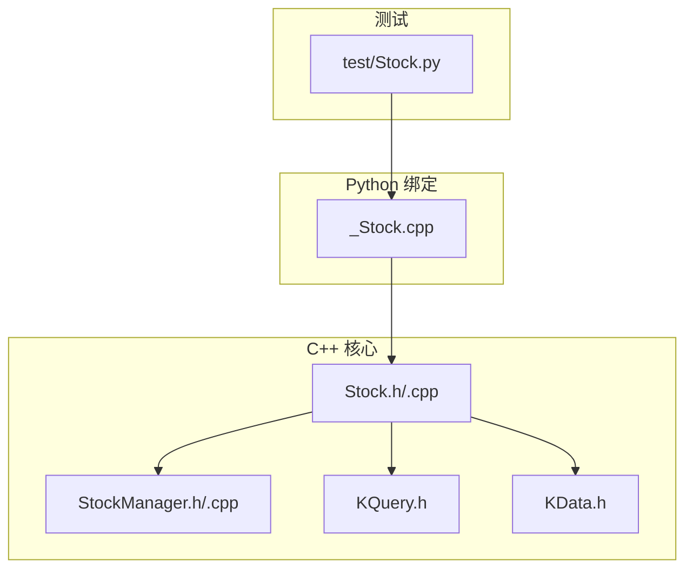
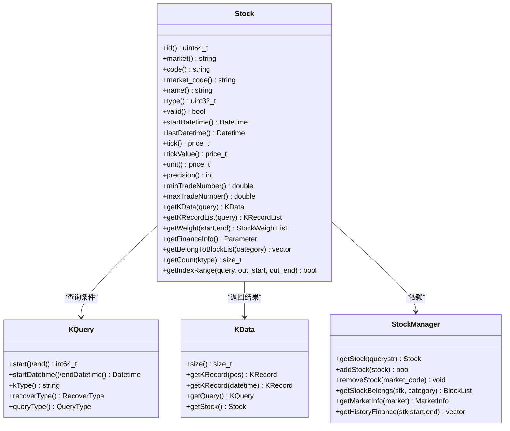
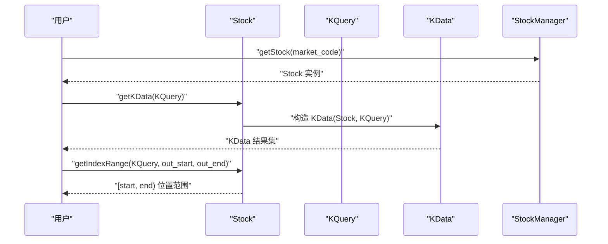
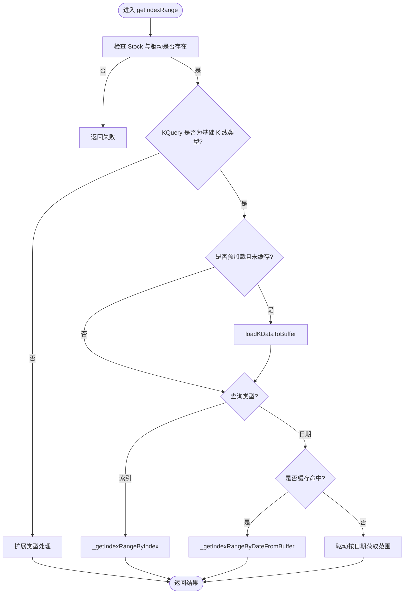
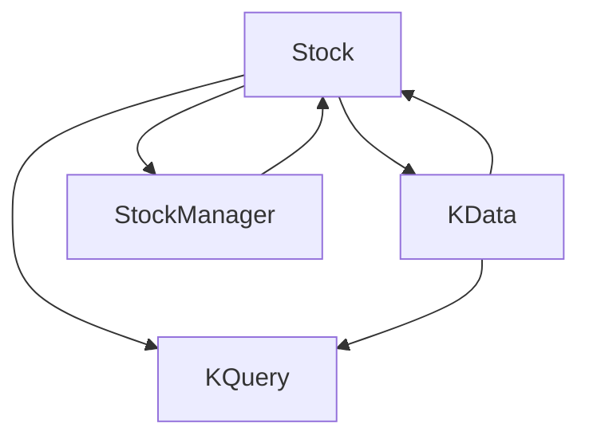

# 股票（Stock）

<cite>
**本文引用的文件**
- [hikyuu_cpp/hikyuu/Stock.h](file://hikyuu_cpp/hikyuu/Stock.h)
- [hikyuu_cpp/hikyuu/Stock.cpp](file://hikyuu_cpp/hikyuu/Stock.cpp)
- [hikyuu_cpp/hikyuu/StockManager.h](file://hikyuu_cpp/hikyuu/StockManager.h)
- [hikyuu_cpp/hikyuu/StockManager.cpp](file://hikyuu_cpp/hikyuu/StockManager.cpp)
- [hikyuu_cpp/hikyuu/KData.h](file://hikyuu_cpp/hikyuu/KData.h)
- [hikyuu_cpp/hikyuu/KQuery.h](file://hikyuu_cpp/hikyuu/KQuery.h)
- [hikyuu/test/Stock.py](file://hikyuu/test/Stock.py)
- [hikyuu_pywrap/_Stock.cpp](file://hikyuu_pywrap/_Stock.cpp)
</cite>

## 目录
1. [简介](#简介)
2. [项目结构](#项目结构)
3. [核心组件](#核心组件)
4. [架构总览](#架构总览)
5. [详细组件分析](#详细组件分析)
6. [依赖关系分析](#依赖关系分析)
7. [性能考量](#性能考量)
8. [故障排查指南](#故障排查指南)
9. [结论](#结论)
10. [附录](#附录)

## 简介
本篇文档围绕 hikyuu 框架中最基础的领域模型之一——Stock（股票）展开，系统阐述其设计与实现要点。重点包括：
- 核心属性：市场简称（market）、证券代码（code）、证券名称（name）、证券类型（type）、交易时间范围（startDatetime/lastDatetime）、价格精度（precision）、最小跳动量（tick）、最小跳动量价值（tickValue）、单位（unit）、最小/最大交易数量（minTradeNumber/maxTradeNumber）等。
- 唯一标识：id() 方法基于内部数据对象指针生成，适合作为哈希键或字典键。
- 全局管理关系：与 StockManager 形成“全局单例管理 + 多个 Stock 实例”的一对多关系。
- 数据访问能力：获取 K 线数据（getKData）、权息信息（getWeight）、财务数据（getFinanceInfo）、所属板块（getBelongToBlockList）等。
- 关联机制：Stock 与 KData 的关联，以及通过 getIndexRange 将 KQuery 查询条件映射到具体 K 线数据位置。
- 使用指南：创建、查询与操作 Stock 实例的完整流程，并结合 test/Stock.py 中的测试用例展示典型场景。

## 项目结构
Stock 类位于 C++ 核心库中，同时通过 pybind11 暴露 Python 接口，配合 StockManager 完成全局注册与查找，KQuery/KData 提供查询与结果封装。

图表来源
- [hikyuu_cpp/hikyuu/Stock.h](file://hikyuu_cpp/hikyuu/Stock.h#L1-L120)
- [hikyuu_cpp/hikyuu/StockManager.h](file://hikyuu_cpp/hikyuu/StockManager.h#L1-L120)
- [hikyuu_cpp/hikyuu/KQuery.h](file://hikyuu_cpp/hikyuu/KQuery.h#L1-L120)
- [hikyuu_cpp/hikyuu/KData.h](file://hikyuu_cpp/hikyuu/KData.h#L1-L120)
- [hikyuu_pywrap/_Stock.cpp](file://hikyuu_pywrap/_Stock.cpp#L1-L120)
- [hikyuu/test/Stock.py](file://hikyuu/test/Stock.py#L1-L60)

章节来源
- [hikyuu_cpp/hikyuu/Stock.h](file://hikyuu_cpp/hikyuu/Stock.h#L1-L120)
- [hikyuu_cpp/hikyuu/StockManager.h](file://hikyuu_cpp/hikyuu/StockManager.h#L1-L120)
- [hikyuu_cpp/hikyuu/KQuery.h](file://hikyuu_cpp/hikyuu/KQuery.h#L1-L120)
- [hikyuu_cpp/hikyuu/KData.h](file://hikyuu_cpp/hikyuu/KData.h#L1-L120)
- [hikyuu_pywrap/_Stock.cpp](file://hikyuu_pywrap/_Stock.cpp#L1-L120)
- [hikyuu/test/Stock.py](file://hikyuu/test/Stock.py#L1-L60)

## 核心组件
- Stock：面向业务的股票实体，封装市场、代码、名称、类型、有效性、交易时间范围、价格与交易单位、精度、最小/最大交易量等属性；提供 K 线、权息、财务、板块等数据访问接口。
- StockManager：全局单例，负责加载与管理所有 Stock 实例，提供按 market_code 查找、添加/移除临时 Stock、获取市场信息、板块信息、节假日、国债收益率等。
- KQuery：查询条件载体，支持按索引或日期两种查询方式，支持多种 K 线类型与复权类型。
- KData：K 线数据结果集封装，持有与 Stock 的关联，提供按索引/日期访问、范围切片、迭代器等。

章节来源
- [hikyuu_cpp/hikyuu/Stock.h](file://hikyuu_cpp/hikyuu/Stock.h#L58-L217)
- [hikyuu_cpp/hikyuu/StockManager.h](file://hikyuu_cpp/hikyuu/StockManager.h#L94-L170)
- [hikyuu_cpp/hikyuu/KQuery.h](file://hikyuu_cpp/hikyuu/KQuery.h#L20-L120)
- [hikyuu_cpp/hikyuu/KData.h](file://hikyuu_cpp/hikyuu/KData.h#L20-L120)

## 架构总览
Stock 通过 StockManager 进行全局注册与查找；KQuery 描述查询意图；KData 封装查询结果并与 Stock 关联。Stock 内部维护 K 线缓存与驱动连接池，支持预加载与按需加载。

图表来源
- [hikyuu_cpp/hikyuu/Stock.h](file://hikyuu_cpp/hikyuu/Stock.h#L58-L217)
- [hikyuu_cpp/hikyuu/StockManager.h](file://hikyuu_cpp/hikyuu/StockManager.h#L94-L170)
- [hikyuu_cpp/hikyuu/KQuery.h](file://hikyuu_cpp/hikyuu/KQuery.h#L90-L170)
- [hikyuu_cpp/hikyuu/KData.h](file://hikyuu_cpp/hikyuu/KData.h#L20-L120)

## 详细组件分析

### Stock 类设计与属性
- 唯一标识：id() 返回内部数据对象指针的整数值，适合用作哈希键或字典键，避免拷贝构造带来的额外成本。
- 属性访问：提供 market/code/market_code/name/type/valid/startDatetime/lastDatetime/tick/tickValue/unit/precision/atom/minTradeNumber/maxTradeNumber 等 getter/setter。
- K 线访问：
  - getKData(KQuery)：返回 KData，封装查询结果。
  - getKRecordList(KQuery)：返回 KRecordList，支持按索引或日期范围。
  - getKRecord(pos/ktype) 与 getKRecord(datetime,ktype)：按索引或日期获取单条 KRecord。
  - getCount(ktype)：统计某 K 线类型的数据条数。
  - getDatetimeList/getTimeLineList/getTransList：分别获取日期列表、分时线、历史分笔。
- 权息与财务：
  - getWeight(start,end)：按时间段获取权息列表。
  - getFinanceInfo()：获取当前财务信息（参数化结构）。
  - getHistoryFinance()：获取历史财务信息列表。
- 板块归属：getBelongToBlockList(category) 返回所属板块列表。
- 交易日历与交易时间：getTradingCalendar(KQuery)、isTransactionTime(time)。
- 缓存与驱动：isBuffer(ktype)/loadKDataToBuffer(ktype)/releaseKDataBuffer(ktype)/setKDataDriver/getKDataDirver 等，支持预加载与内存缓存。
- 实时更新：realtimeUpdate(krecord,ktype) 用于更新缓存中的 K 线数据。

章节来源
- [hikyuu_cpp/hikyuu/Stock.h](file://hikyuu_cpp/hikyuu/Stock.h#L58-L217)
- [hikyuu_cpp/hikyuu/Stock.cpp](file://hikyuu_cpp/hikyuu/Stock.cpp#L554-L760)
- [hikyuu_cpp/hikyuu/Stock.cpp](file://hikyuu_cpp/hikyuu/Stock.cpp#L829-L1193)

### Stock 与 StockManager 的关系
- StockManager 提供 getStock(querystr) 与 operator[]，后者内部委托前者，实现按 market_code 快速获取 Stock。
- 支持添加/移除临时 Stock（addStock/removeStock），以及按类别获取板块列表（getStockBelongs）。
- 提供市场信息、节假日、国债收益率、历史财务字段索引等辅助能力。

章节来源
- [hikyuu_cpp/hikyuu/StockManager.h](file://hikyuu_cpp/hikyuu/StockManager.h#L94-L170)
- [hikyuu_cpp/hikyuu/StockManager.cpp](file://hikyuu_cpp/hikyuu/StockManager.cpp#L382-L435)

### Stock 与 KQuery/KData 的关联机制
- KQuery 支持两种查询方式：索引（start/end）与日期（startDatetime/endDatetime），并定义多种 K 线类型与复权类型。
- Stock.getKData(KQuery) 直接返回 KData，KData 内部持有与 Stock 的关联，便于后续按索引/日期访问与范围切片。
- Stock.getIndexRange(KQuery, out_start, out_end) 将 KQuery 映射到具体 K 线数据位置范围 [start, end)，支持负索引与日期边界处理。

图表来源
- [hikyuu_cpp/hikyuu/Stock.cpp](file://hikyuu_cpp/hikyuu/Stock.cpp#L554-L570)
- [hikyuu_cpp/hikyuu/KData.h](file://hikyuu_cpp/hikyuu/KData.h#L20-L60)
- [hikyuu_cpp/hikyuu/KQuery.h](file://hikyuu_cpp/hikyuu/KQuery.h#L90-L170)

章节来源
- [hikyuu_cpp/hikyuu/Stock.cpp](file://hikyuu_cpp/hikyuu/Stock.cpp#L554-L760)
- [hikyuu_cpp/hikyuu/KData.h](file://hikyuu_cpp/hikyuu/KData.h#L20-L120)
- [hikyuu_cpp/hikyuu/KQuery.h](file://hikyuu_cpp/hikyuu/KQuery.h#L90-L170)

### getIndexRange 的算法流程
getIndexRange 将 KQuery 查询条件映射到具体 K 线数据位置范围，支持：
- 基础 K 线类型：若启用预加载且未缓存，则先加载；若缓存命中，按日期二分查找定位；否则委托底层驱动按日期范围获取索引范围。
- 扩展 K 线类型：委托扩展机制获取索引范围。
- 索引查询：处理负索引，确保范围合法。

图表来源
- [hikyuu_cpp/hikyuu/Stock.cpp](file://hikyuu_cpp/hikyuu/Stock.cpp#L671-L760)
- [hikyuu_cpp/hikyuu/Stock.cpp](file://hikyuu_cpp/hikyuu/Stock.cpp#L709-L759)
- [hikyuu_cpp/hikyuu/Stock.cpp](file://hikyuu_cpp/hikyuu/Stock.cpp#L761-L828)

章节来源
- [hikyuu_cpp/hikyuu/Stock.cpp](file://hikyuu_cpp/hikyuu/Stock.cpp#L671-L828)

### Python 绑定与典型用法
- Python 层通过 pybind11 暴露 Stock 的属性与方法，如 id/market/code/market_code/name/type/valid/start_datetime/last_datetime/tick/tick_value/unit/precision/atom/min_trade_number/max_trade_number。
- 关键方法：get_index_range、get_kdata、get_krecord、get_krecord_list、get_datetime_list、get_weight、get_finance_info、get_belong_to_block_list、get_count、get_market_value、realtime_update。
- 测试用例展示了基本属性断言、相等性比较、临时 Stock 创建与添加/移除、设置 KRecordList 并验证计数与内容等典型场景。

章节来源
- [hikyuu_pywrap/_Stock.cpp](file://hikyuu_pywrap/_Stock.cpp#L1-L200)
- [hikyuu/test/Stock.py](file://hikyuu/test/Stock.py#L1-L128)

## 依赖关系分析
- Stock 依赖 KQuery/KData 以表达查询与结果；依赖 StockManager 以获取板块、市场信息、历史财务等。
- KData 依赖 KQuery 以表达查询条件，依赖 Stock 以维持关联。
- StockManager 依赖数据驱动工厂与参数配置，负责加载与缓存管理。

图表来源
- [hikyuu_cpp/hikyuu/Stock.h](file://hikyuu_cpp/hikyuu/Stock.h#L58-L217)
- [hikyuu_cpp/hikyuu/KQuery.h](file://hikyuu_cpp/hikyuu/KQuery.h#L90-L170)
- [hikyuu_cpp/hikyuu/KData.h](file://hikyuu_cpp/hikyuu/KData.h#L20-L120)
- [hikyuu_cpp/hikyuu/StockManager.h](file://hikyuu_cpp/hikyuu/StockManager.h#L94-L170)

章节来源
- [hikyuu_cpp/hikyuu/Stock.h](file://hikyuu_cpp/hikyuu/Stock.h#L58-L217)
- [hikyuu_cpp/hikyuu/KQuery.h](file://hikyuu_cpp/hikyuu/KQuery.h#L90-L170)
- [hikyuu_cpp/hikyuu/KData.h](file://hikyuu_cpp/hikyuu/KData.h#L20-L120)
- [hikyuu_cpp/hikyuu/StockManager.h](file://hikyuu_cpp/hikyuu/StockManager.h#L94-L170)

## 性能考量
- 预加载策略：通过 setPreload 与 isPreload 控制预加载类型集合；loadKDataToBuffer 在缓存缺失时按配置的最大条数进行加载，减少频繁 IO。
- 缓存一致性：使用共享互斥锁保护 KRecordList 与 lastUpdate 时间戳，避免并发写入冲突。
- 日期范围查找：在缓存命中时采用二分查找定位 [start, end) 区间，时间复杂度 O(logN)。
- 驱动选择：根据驱动 isIndexFirst/isColumnFirst 特性选择按索引或日期优先策略，提升查询效率。
- 原地复制优化：KData 内部通过共享指针与只读访问降低拷贝成本。

[本节为通用指导，无需列出具体文件来源]

## 故障排查指南
- 空 Stock：isNull() 为真时，多数访问将返回空值或失败，需确认通过 StockManager 正确获取。
- 无效 K 线类型：getCount/getKRecordList 等接口对非法 KType 会返回错误或空结果，需检查 KQuery.kType。
- 索引越界：getKRecord/范围切片时注意边界，必要时使用 getIndexRange 获取合法范围。
- 缓存未命中：若预加载未生效，可通过 loadKDataToBuffer 主动加载；或检查预加载参数配置。
- 日期查询失败：当驱动不支持按日期范围时，getIndexRange 可能返回失败，需切换为索引查询或启用缓存。

章节来源
- [hikyuu_cpp/hikyuu/Stock.cpp](file://hikyuu_cpp/hikyuu/Stock.cpp#L563-L585)
- [hikyuu_cpp/hikyuu/Stock.cpp](file://hikyuu_cpp/hikyuu/Stock.cpp#L671-L760)

## 结论
Stock 作为 hikyuu 的核心领域模型，以清晰的属性建模与丰富的数据访问能力支撑上层分析与策略开发。通过与 StockManager、KQuery/KData 的协作，实现了高效、灵活且可扩展的金融数据访问体系。开发者可借助 Python 绑定快速完成创建、查询与操作 Stock 实例的全流程任务。

[本节为总结性内容，无需列出具体文件来源]

## 附录

### 创建与查询 Stock 的完整指南
- 通过 StockManager 获取：使用 getStock("市场简称+代码") 或 operator[]，例如 "SH000001"。
- 临时创建：使用 Stock(market, code, name) 构造，随后 setKRecordList 设置 K 线数据并 addStock 注册到 StockManager。
- 属性读取：market/code/market_code/name/type/valid/start_datetime/last_datetime/tick/tick_value/unit/precision/atom/min_trade_number/max_trade_number。
- 数据访问：
  - K 线：getKData(KQuery)、getKRecordList(KQuery)、getKRecord(pos/datetime,ktype)、getCount(ktype)、getDatetimeList(KQuery)。
  - 权息：getWeight(start,end)。
  - 财务：getFinanceInfo()、getHistoryFinance()。
  - 板块：getBelongToBlockList(category)。
  - 交易日历：getTradingCalendar(KQuery)。
  - 实时更新：realtimeUpdate(krecord,ktype)。
- 位置映射：getIndexRange(KQuery) 返回 [start,end) 范围，支持负索引与日期边界。

章节来源
- [hikyuu_cpp/hikyuu/StockManager.h](file://hikyuu_cpp/hikyuu/StockManager.h#L94-L170)
- [hikyuu_cpp/hikyuu/Stock.h](file://hikyuu_cpp/hikyuu/Stock.h#L58-L217)
- [hikyuu_cpp/hikyuu/Stock.cpp](file://hikyuu_cpp/hikyuu/Stock.cpp#L554-L760)
- [hikyuu/test/Stock.py](file://hikyuu/test/Stock.py#L1-L128)
- [hikyuu_pywrap/_Stock.cpp](file://hikyuu_pywrap/_Stock.cpp#L1-L200)