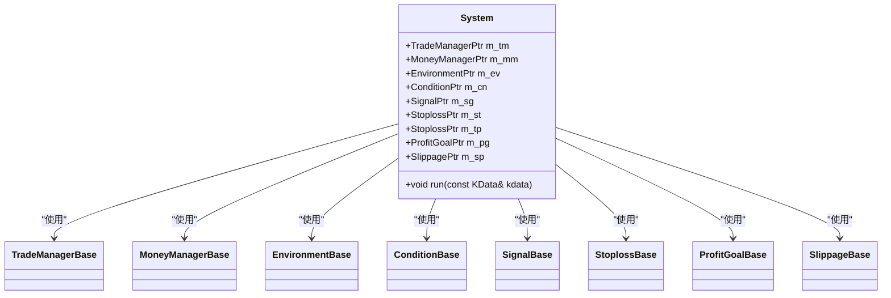
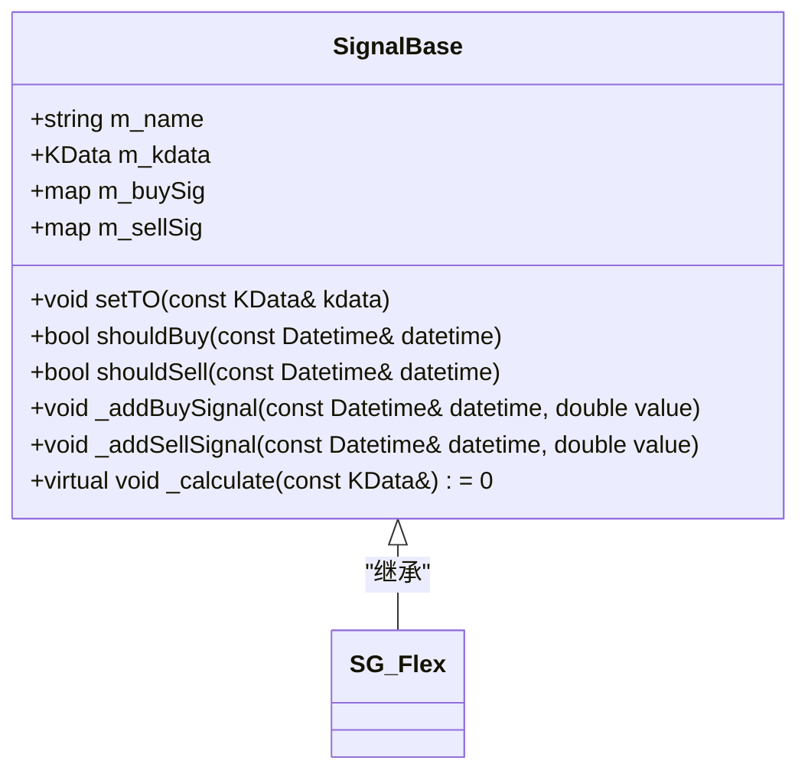
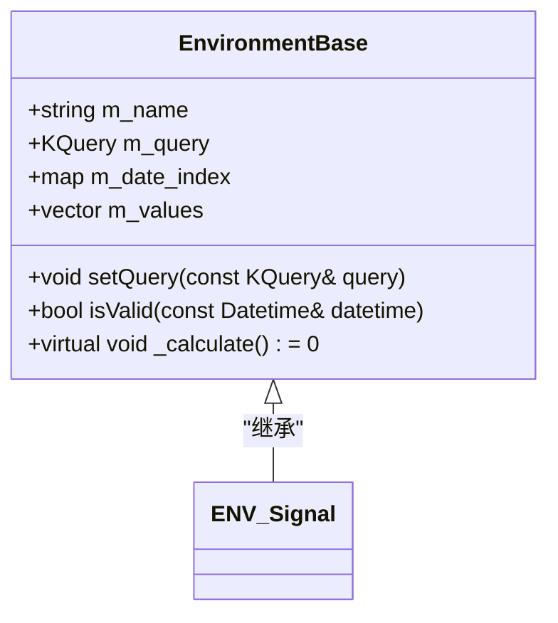
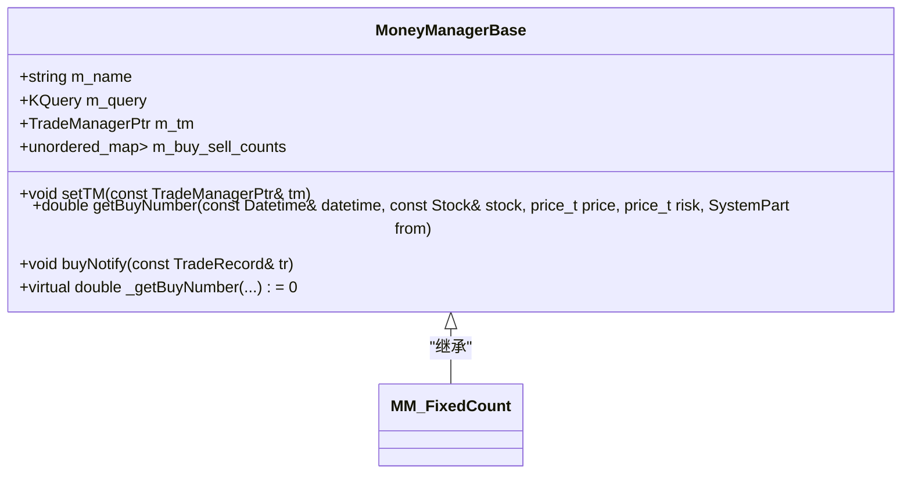
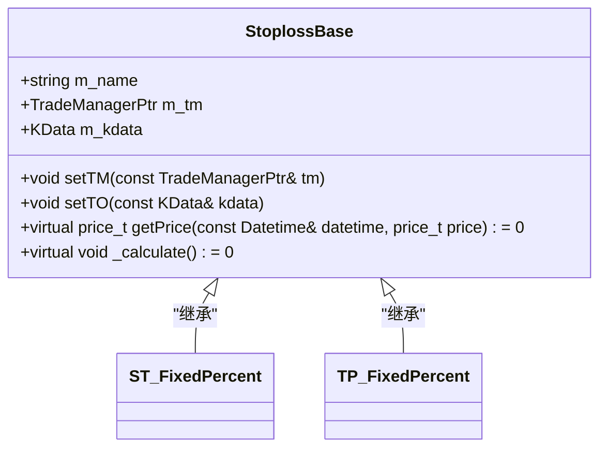
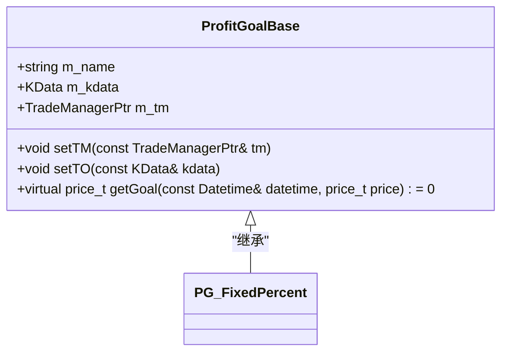
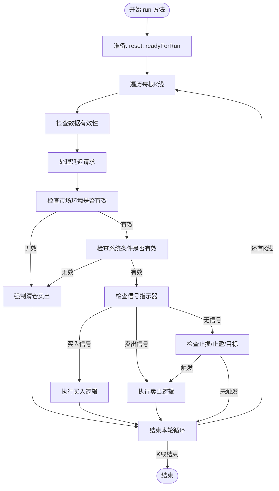
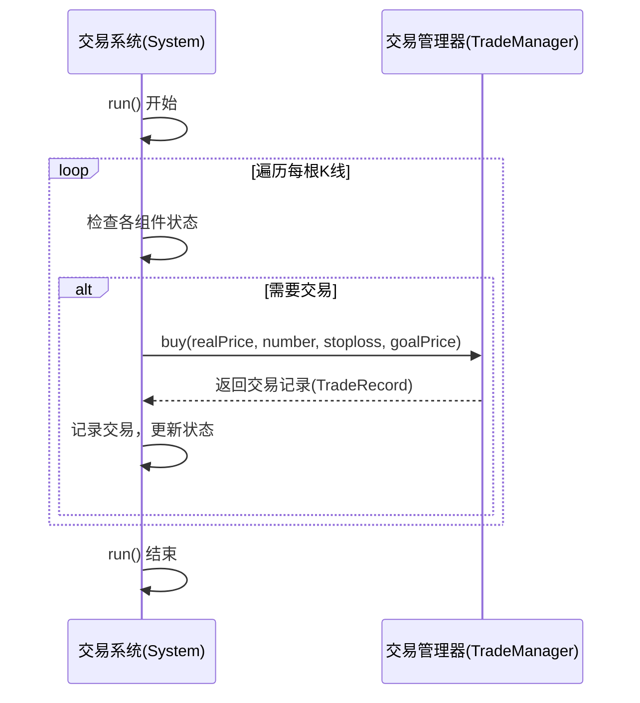
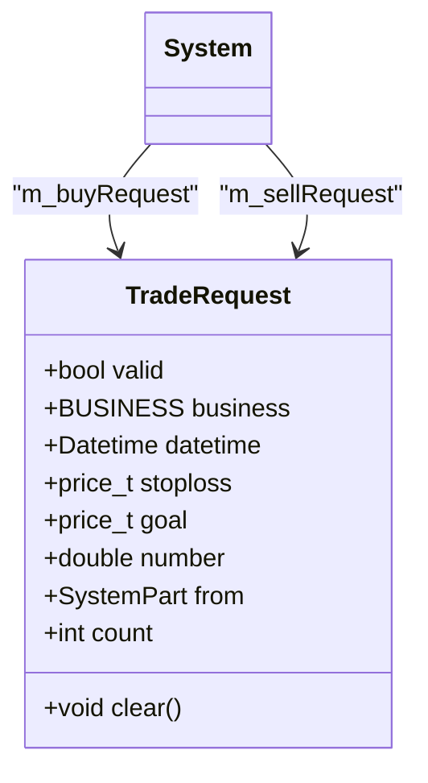

# 交易系统

<cite>
**本文档引用的文件**   
- [System.h](file://hikyuu_cpp/hikyuu/trade_sys/system/System.h)
- [System.cpp](file://hikyuu_cpp/hikyuu/trade_sys/system/System.cpp)
- [SystemPart.h](file://hikyuu_cpp/hikyuu/trade_sys/system/SystemPart.h)
- [SystemPart.cpp](file://hikyuu_cpp/hikyuu/trade_sys/system/SystemPart.cpp)
- [TradeRequest.h](file://hikyuu_cpp/hikyuu/trade_sys/system/TradeRequest.h)
- [TradeManager.h](file://hikyuu_cpp/hikyuu/trade_manage/TradeManager.h)
- [SignalBase.h](file://hikyuu_cpp/hikyuu/trade_sys/signal/SignalBase.h)
- [EnvironmentBase.h](file://hikyuu_cpp/hikyuu/trade_sys/environment/EnvironmentBase.h)
- [MoneyManagerBase.h](file://hikyuu_cpp/hikyuu/trade_sys/moneymanager/MoneyManagerBase.h)
- [StoplossBase.h](file://hikyuu_cpp/hikyuu/trade_sys/stoploss/StoplossBase.h)
- [ProfitGoalBase.h](file://hikyuu_cpp/hikyuu/trade_sys/profitgoal/ProfitGoalBase.h)
</cite>

## 目录
1. [引言](#引言)
2. [组件化设计思想](#组件化设计思想)
3. [核心运行机制](#核心运行机制)
4. [与交易管理器的协作](#与交易管理器的协作)
5. [状态管理](#状态管理)
6. [输出与绩效分析](#输出与绩效分析)
7. [构建与配置蓝图](#构建与配置蓝图)

## 引言
System类是hikyuu量化框架的核心，作为交易策略逻辑的集成中心。它通过组件化设计，将一个完整的交易策略分解为多个可插拔的独立部件，包括信号指示器（Signal）、止损（Stoploss）、止盈（TakeProfit）、资金管理（MoneyManager）和市场环境（Environment）等。这种设计极大地提高了策略的灵活性和可复用性。System通过其`run`方法遍历K线数据，在每个交易时刻协调各组件做出交易决策，并与TradeManager协作执行交易。本文档将全面阐述System类的设计、实现和使用方法。

## 组件化设计思想
System类采用高度模块化的组件化设计，将交易策略的各个逻辑环节解耦为独立的、可替换的部件。这种设计遵循了“关注点分离”原则，使得策略的构建、测试和维护变得更加简单和高效。

### 核心组件
System类通过一系列智能指针成员变量来管理其核心组件，每个组件都遵循特定的基类接口，确保了系统的一致性和扩展性。



**Diagram sources**
- [System.h](file://hikyuu_cpp/hikyuu/trade_sys/system/System.h#L340-L348)

**Section sources**
- [System.h](file://hikyuu_cpp/hikyuu/trade_sys/system/System.h#L340-L348)

#### 信号指示器 (Signal)
信号指示器是策略的“大脑”，负责生成买入和卖出信号。它通过`_addBuySignal`和`_addSellSignal`方法在计算过程中记录信号，并通过`shouldBuy`和`shouldSell`方法供System查询。



**Diagram sources**
- [SignalBase.h](file://hikyuu_cpp/hikyuu/trade_sys/signal/SignalBase.h#L142-L154)

#### 市场环境 (Environment)
市场环境策略用于判断当前市场整体是否适合交易。它不与特定的交易对象绑定，而是基于大盘指数等宏观数据进行判断。当环境无效时，System会强制清仓。



**Diagram sources**
- [EnvironmentBase.h](file://hikyuu_cpp/hikyuu/trade_sys/environment/EnvironmentBase.h#L102-L105)

#### 资金管理 (MoneyManager)
资金管理策略负责决定每次交易的买卖数量。它接收来自TradeManager的实际交易通知（`buyNotify`/`sellNotify`），并根据风险、资金状况和策略逻辑计算出具体的交易数量。



**Diagram sources**
- [MoneyManagerBase.h](file://hikyuu_cpp/hikyuu/trade_sys/moneymanager/MoneyManagerBase.h#L161-L164)

#### 止损与止盈 (Stoploss/TakeProfit)
止损和止盈策略共同决定了交易的风险控制和盈利目标。它们在交易执行前向System提供计划的止损价和目标价。在交易执行后，这些价格会作为参数传递给TradeManager，用于后续的监控。



**Diagram sources**
- [StoplossBase.h](file://hikyuu_cpp/hikyuu/trade_sys/stoploss/StoplossBase.h#L95-L98)

#### 盈利目标 (ProfitGoal)
盈利目标策略用于在买入时确定一个明确的盈利目标价格。当市场价格达到或超过此目标价时，System会触发卖出操作。它与止盈策略不同，止盈是动态调整的，而盈利目标通常是静态的。



**Diagram sources**
- [ProfitGoalBase.h](file://hikyuu_cpp/hikyuu/trade_sys/profitgoal/ProfitGoalBase.h#L91-L93)

## 核心运行机制
System的核心运行机制体现在其`run`方法中。该方法会遍历整个K线数据序列，在每个交易时刻（K线）协调各个组件，最终决定是否执行交易。

### 运行流程
`run`方法的执行流程是一个典型的事件驱动循环，它会按时间顺序处理每一根K线。



**Diagram sources**
- [System.cpp](file://hikyuu_cpp/hikyuu/trade_sys/system/System.cpp#L404-L443)

### 决策逻辑
System的决策逻辑在`_runMomentOnClose`方法中实现，它是一个复杂的条件判断流程。

**Section sources**
- [System.cpp](file://hikyuu_cpp/hikyuu/trade_sys/system/System.cpp#L476-L665)

#### 1. 市场环境与系统条件
首先，System会检查市场环境（EV）和系统条件（CN）是否有效。如果任一条件无效，且当前持有仓位，则会立即执行清仓卖出操作。

#### 2. 信号指示
如果环境和条件都有效，则检查信号指示器（SG）。如果存在买入或卖出信号，则根据信号执行相应的交易。

#### 3. 风险与目标控制
在没有信号的情况下，System会检查当前持仓是否触发了止损、止盈或盈利目标。如果触发，则执行卖出操作。

## 与交易管理器的协作
System与TradeManager（交易管理器）是紧密协作的关系。System负责生成交易决策，而TradeManager负责执行这些决策并管理账户状态。

### 协作流程


**Diagram sources**
- [System.cpp](file://hikyuu_cpp/hikyuu/trade_sys/system/System.cpp#L743-L752)
- [TradeManager.h](file://hikyuu_cpp/hikyuu/trade_manage/TradeManager.h#L231-L234)

System通过调用TradeManager的`buy`、`sell`等方法来执行交易。TradeManager在执行成功后会返回一个`TradeRecord`（交易记录），System会将此记录保存到自己的`m_trade_list`中，并通知相关的资金管理（MM）和盈利目标（PG）组件。

## 状态管理
System类实现了精细的状态管理机制，以确保策略在不同运行场景下的正确性和一致性。

### 复位机制 (reset)
`reset`方法用于将System及其组件恢复到初始状态，为下一次运行做准备。其行为受组件的“共享”属性控制。

```mermaid
flowchart TD
Reset([reset()]) --> CheckShared["检查各组件的共享属性"]
CheckShared --> |不共享| ResetComponent["调用组件的reset()"]
CheckShared --> |共享| SkipReset["跳过"]
ResetComponent --> ResetSelf["重置System自身状态"]
ResetSelf --> |m_calculated| SetFalse["设为false"]
ResetSelf --> |m_buy_days| SetZero["设为0"]
ResetSelf --> |m_trade_list| Clear["清空"]
ResetSelf --> End([完成])
```

**Diagram sources**
- [System.cpp](file://hikyuu_cpp/hikyuu/trade_sys/system/System.cpp#L166-L207)

### 延迟交易请求 (Delay Request)
System支持延迟交易，即在当前K线产生交易信号，但实际交易在下一个K线的开盘时执行。这是通过`TradeRequest`结构体实现的。



**Diagram sources**
- [TradeRequest.h](file://hikyuu_cpp/hikyuu/trade_sys/system/TradeRequest.h#L26-L36)

当`buy_delay`参数为`true`时，System不会立即执行买入，而是创建一个`m_buyRequest`。在下一个K线的`_runMomentOnOpen`阶段，System会检查并处理这个延迟请求。

## 输出与绩效分析
System在运行结束后，会生成详细的输出，供用户进行策略分析和评估。

### 交易记录列表
通过`getTradeRecordList()`方法，可以获取所有实际执行的交易记录。这些记录不包含由权息调整产生的虚拟交易。

**Section sources**
- [System.h](file://hikyuu_cpp/hikyuu/trade_sys/system/System.h#L150-L151)

### 最终建议
`lastSuggestion()`方法返回一个JSON对象，包含最后一次交易记录和任何待处理的延迟交易请求，这对于实盘交易非常有用。

**Section sources**
- [System.cpp](file://hikyuu_cpp/hikyuu/trade_sys/system/System.cpp#L1489-L1578)

## 构建与配置蓝图
开发者可以通过多种方式构建和配置一个System实例。

### 使用构造函数
最直接的方式是使用包含所有组件的构造函数。

```cpp
System mySystem(tm, mm, ev, cn, sg, st, tp, pg, sp, "MyStrategy");
```

### 使用便捷函数
框架提供了`SYS_Simple`等便捷函数来快速创建常用配置的System。

**Section sources**
- [System.cpp](file://hikyuu_cpp/hikyuu/trade_sys/system/System.cpp#L203-L278)

### 参数配置
System通过`setParam`方法支持丰富的运行时参数配置，例如：
- `buy_delay`: 是否延迟买入
- `max_delay_count`: 最大延迟次数
- `tp_monotonic`: 止盈价是否单调递增
- `ev_open_position`: 是否使用市场环境判定进行初始建仓

这些参数为策略提供了极大的灵活性。