# TradeManager（交易管理器）

<cite>
**本文档引用的文件**
- [TradeManager.h](file://hikyuu_cpp/hikyuu/trade_manage/TradeManager.h)
- [TradeManager.cpp](file://hikyuu_cpp/hikyuu/trade_manage/TradeManager.cpp)
- [TradeRecord.h](file://hikyuu_cpp/hikyuu/trade_manage/TradeRecord.h)
- [PositionRecord.h](file://hikyuu_cpp/hikyuu/trade_manage/PositionRecord.h)
- [Performance.h](file://hikyuu_cpp/hikyuu/trade_manage/Performance.h)
- [Performance.cpp](file://hikyuu_cpp/hikyuu/trade_manage/Performance.cpp)
- [TradeCostBase.h](file://hikyuu_cpp/hikyuu/trade_manage/TradeCostBase.h)
- [CostRecord.h](file://hikyuu_cpp/hikyuu/trade_manage/CostRecord.h)
- [FundsRecord.h](file://hikyuu_cpp/hikyuu/trade_manage/FundsRecord.h)
- [System.h](file://hikyuu_cpp/hikyuu/trade_sys/system/System.h)
</cite>

## 目录
1. [简介](#简介)
2. [核心职责](#核心职责)
3. [关键方法](#关键方法)
4. [数据结构](#数据结构)
5. [性能统计](#性能统计)
6. [交易成本模型](#交易成本模型)
7. [与交易系统协同](#与交易系统协同)
8. [配置与使用](#配置与使用)
9. [总结](#总结)

## 简介
TradeManager（交易管理器）是hikyuu量化框架中负责执行和记录交易的核心组件。它模拟了真实账户的交易行为，管理资金、持仓、交易记录和成本计算。作为回测系统的重要组成部分，TradeManager提供了完整的交易生命周期管理功能，从资金管理到交易执行，再到绩效评估。

**Section sources**
- [TradeManager.h](file://hikyuu_cpp/hikyuu/trade_manage/TradeManager.h#L24-L33)

## 核心职责
TradeManager的核心职责包括管理资金、持仓、交易记录和成本计算。它维护着账户的初始资金、当前现金、累计存入和取出资金等信息，并跟踪所有交易活动。通过精确的记录和计算，TradeManager为量化策略的回测提供了可靠的数据支持。

### 资金管理
TradeManager负责管理账户的资金流动，包括初始资金、当前现金、累计存入资金和累计取出资金。它还支持融资融券功能，可以记录借入的资金和归还的资金。

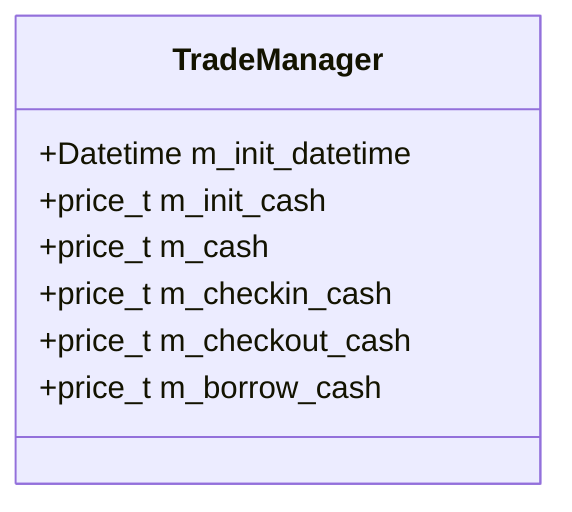

**Diagram sources**
- [TradeManager.h](file://hikyuu_cpp/hikyuu/trade_manage/TradeManager.h#L391-L401)

### 持仓管理
TradeManager跟踪所有持仓情况，包括当前持仓和历史持仓。它记录了每只证券的持仓数量、买入价格、止损价等信息，并在交易发生时更新持仓状态。

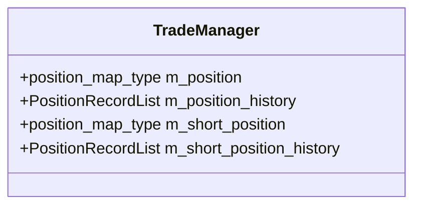

**Diagram sources**
- [TradeManager.h](file://hikyuu_cpp/hikyuu/trade_manage/TradeManager.h#L409-L413)

### 交易记录
TradeManager维护着完整的交易记录列表，记录了所有交易活动的详细信息，包括买入、卖出、存入资金、取出资金等操作。

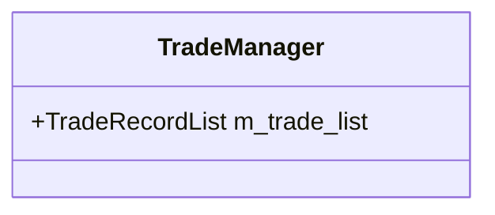

**Diagram sources**
- [TradeManager.h](file://hikyuu_cpp/hikyuu/trade_manage/TradeManager.h#L407)

### 成本计算
TradeManager集成了交易成本计算功能，能够根据配置的交易成本模型计算每次交易的佣金、印花税、过户费等成本。

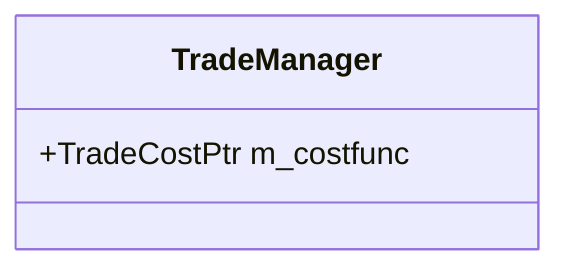

**Diagram sources**
- [TradeManager.h](file://hikyuu_cpp/hikyuu/trade_manage/TradeManager.h#L39)

## 关键方法
TradeManager提供了丰富的接口方法，用于执行各种交易操作和查询账户状态。

### 交易执行方法
TradeManager提供了买入、卖出、卖空、回补等交易执行方法，这些方法是交易管理的核心功能。

#### 买入操作
`buy`方法用于执行买入操作，它会检查资金是否充足，计算交易成本，并更新持仓和资金记录。

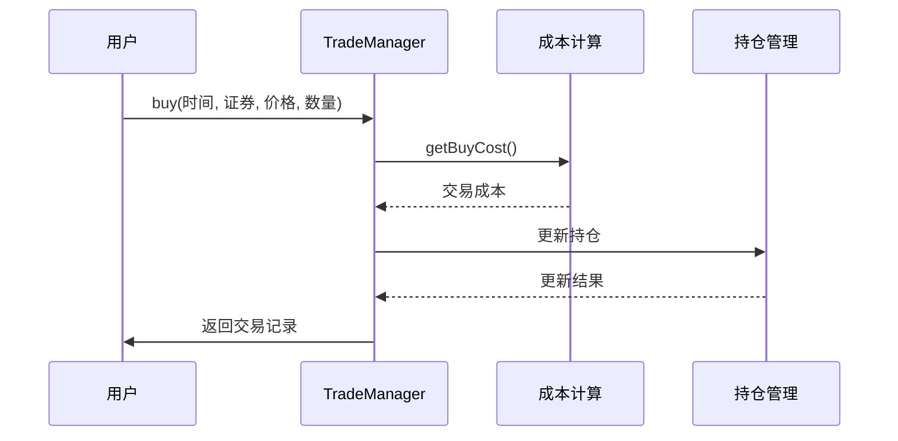

**Diagram sources**
- [TradeManager.cpp](file://hikyuu_cpp/hikyuu/trade_manage/TradeManager.cpp#L765-L874)

#### 卖出操作
`sell`方法用于执行卖出操作，它会检查是否有足够的持仓，计算交易收入，并更新资金和持仓记录。

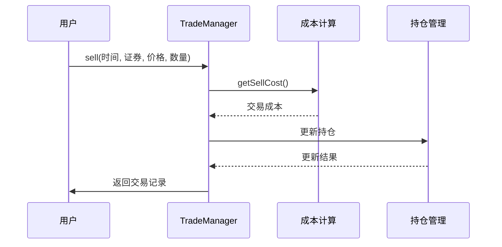

**Diagram sources**
- [TradeManager.cpp](file://hikyuu_cpp/hikyuu/trade_manage/TradeManager.cpp#L877-L964)

### 查询方法
TradeManager提供了多种查询方法，用于获取账户的当前状态和历史数据。

#### 资金查询
`currentCash`和`cash`方法用于查询当前现金和指定时间的现金余额。

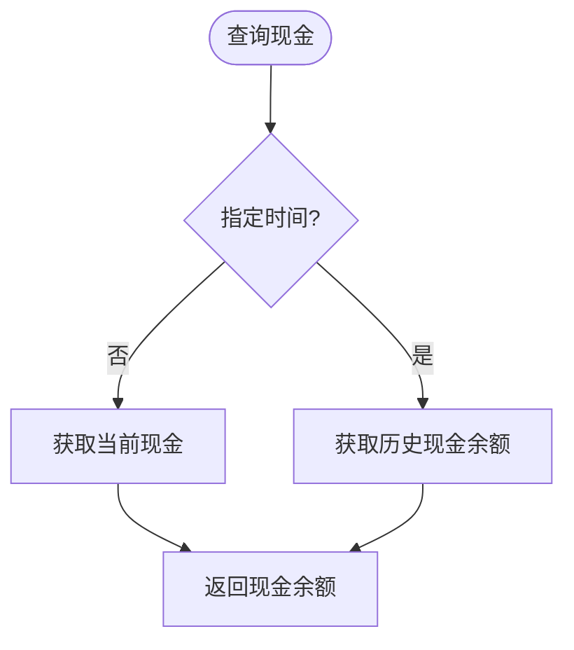

**Diagram sources**
- [TradeManager.h](file://hikyuu_cpp/hikyuu/trade_manage/TradeManager.h#L85-L93)

#### 持仓查询
`have`和`getHoldNumber`方法用于查询是否持有某证券以及持有数量。

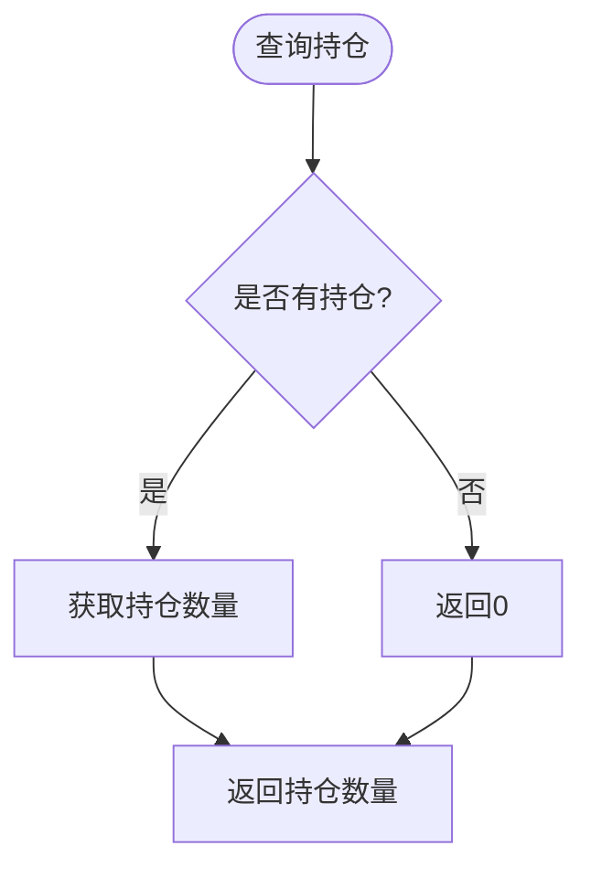

**Diagram sources**
- [TradeManager.h](file://hikyuu_cpp/hikyuu/trade_manage/TradeManager.h#L101-L126)

## 数据结构
TradeManager使用了多种数据结构来记录交易和持仓信息。

### TradeRecord（交易记录）
TradeRecord结构体记录了单笔交易的详细信息，包括交易对象、时间、业务类型、价格、数量、成本等。

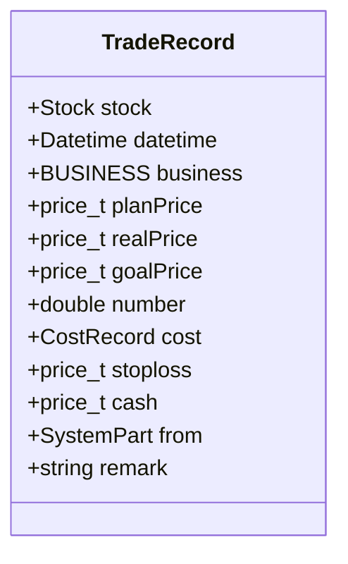

**Diagram sources**
- [TradeRecord.h](file://hikyuu_cpp/hikyuu/trade_manage/TradeRecord.h#L76-L87)

### PositionRecord（持仓记录）
PositionRecord结构体记录了持仓的动态变化，包括交易对象、建仓日期、持仓数量、止损价、累计买入资金等。

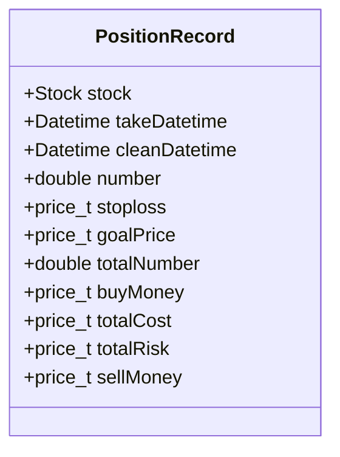

**Diagram sources**
- [PositionRecord.h](file://hikyuu_cpp/hikyuu/trade_manage/PositionRecord.h#L43-L53)

### CostRecord（成本记录）
CostRecord结构体记录了交易成本的详细信息，包括佣金、印花税、过户费、其他费用和总成本。

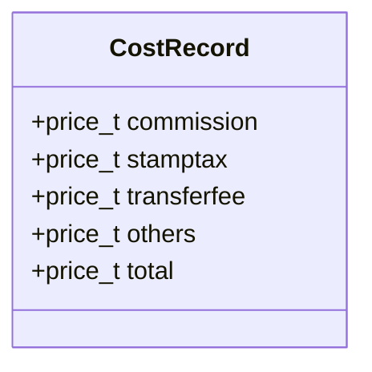

**Diagram sources**
- [CostRecord.h](file://hikyuu_cpp/hikyuu/trade_manage/CostRecord.h#L30-L34)

## 性能统计
TradeManager通过Performance类提供全面的绩效统计功能，能够计算收益率、最大回撤等关键指标。

### Performance类
Performance类负责计算和统计交易系统的绩效指标，包括收益率、风险指标、交易频率等。

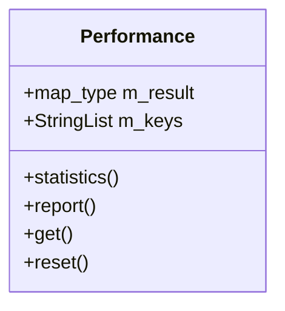

**Diagram sources**
- [Performance.h](file://hikyuu_cpp/hikyuu/trade_manage/Performance.h#L22-L84)

### 绩效指标
Performance类计算了多种绩效指标，包括：

- **收益类指标**：累计投入本金、累计红利、已平仓净利润总额、赢利交易赢利总额、亏损交易亏损总额
- **风险类指标**：已平仓交易总成本、单笔交易最大占用现金比例、交易平均占用现金比例
- **收益率指标**：未平仓帐户收益率%、已平仓帐户收益率%、帐户年复合收益率%、帐户平均年收益率%
- **交易统计指标**：已平仓交易总数、赢利交易数、亏损交易数、赢利交易比例%、赢利期望值
- **持仓时间指标**：赢利交易平均持仓时间、赢利交易最大持仓时间、亏损交易平均持仓时间、亏损交易最大持仓时间
- **空仓时间指标**：空仓总时间、空仓时间/总时间%、平均空仓时间、最长空仓时间
- **连续性指标**：最大连续赢利笔数、最大连续亏损笔数、最大连续赢利金额、最大连续亏损金额
- **R乘数指标**：R乘数期望值、交易机会频率/年、年度期望R乘数、赢利交易平均R乘数、亏损交易平均R乘数

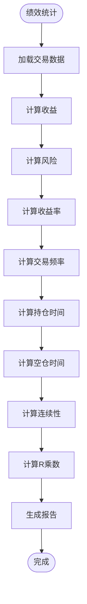

**Diagram sources**
- [Performance.cpp](file://hikyuu_cpp/hikyuu/trade_manage/Performance.cpp#L151-L473)

## 交易成本模型
TradeManager支持可配置的交易成本模型，允许用户根据实际交易环境设置不同的成本参数。

### TradeCostBase（交易成本基类）
TradeCostBase是所有交易成本算法的基类，定义了计算买入成本、卖出成本等的接口。

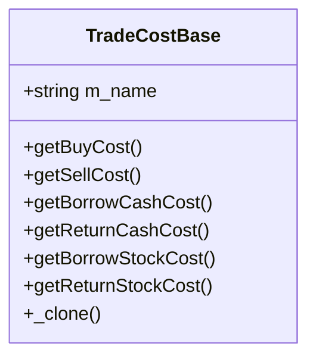

**Diagram sources**
- [TradeCostBase.h](file://hikyuu_cpp/hikyuu/trade_manage/TradeCostBase.h#L22-L107)

### 零成本模型
TC_Zero是零成本模型的实现，适用于不需要考虑交易成本的场景。

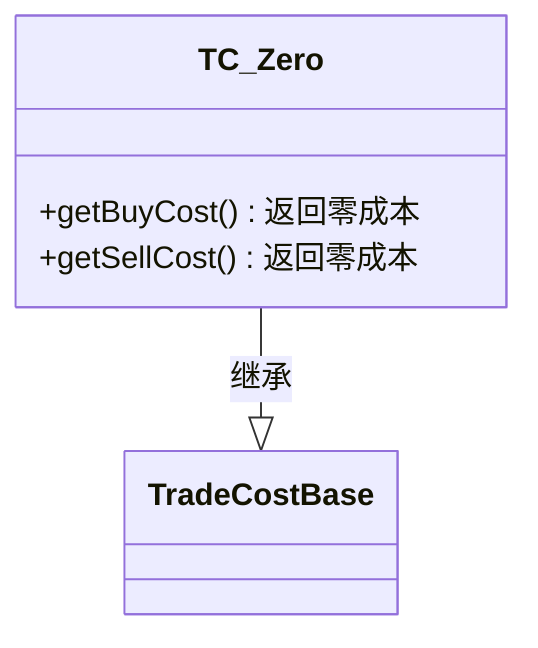

**Diagram sources**
- [TC_Zero.h](file://hikyuu_cpp/hikyuu/trade_manage/crt/TC_Zero.h#L21)

## 与交易系统协同
TradeManager与交易系统（System）紧密协同工作，接收来自信号指示器的交易请求并执行。

### 系统架构
TradeManager是交易系统的重要组成部分，与其他组件协同工作。

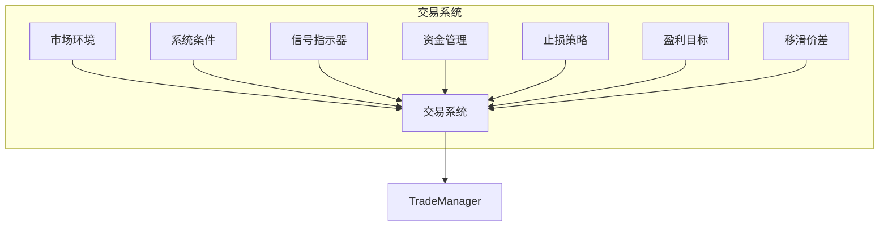

**Diagram sources**
- [System.h](file://hikyuu_cpp/hikyuu/trade_sys/system/System.h#L39)

### 协同流程
TradeManager与交易系统的协同流程如下：

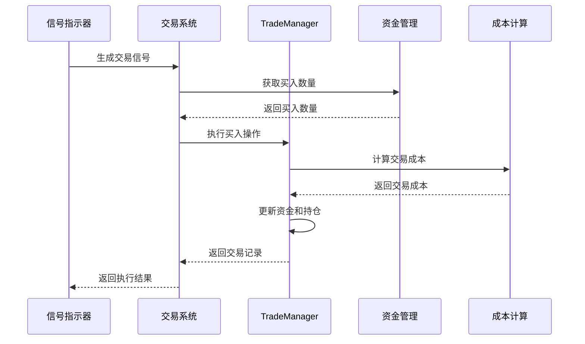

**Diagram sources**
- [System.h](file://hikyuu_cpp/hikyuu/trade_sys/system/System.h#L214)

## 配置与使用
TradeManager提供了灵活的配置选项，用户可以根据需要设置不同的参数。

### 初始化配置
创建TradeManager实例时，可以指定初始资金、交易成本模型等参数。

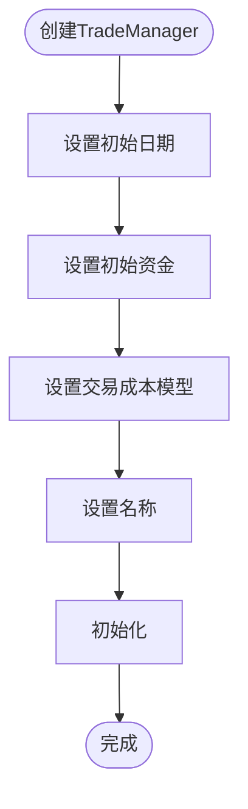

**Diagram sources**
- [TradeManager.h](file://hikyuu_cpp/hikyuu/trade_manage/TradeManager.h#L39-L41)

### 参数配置
TradeManager支持多种参数配置，包括：

- **precision(int)**: 计算精度，默认值为2
- **support_borrow_cash(bool)**: 买入操作时是否自动融资，默认值为false
- **support_borrow_stock(bool)**: 卖空时是否自动融券，默认值为false
- **save_action(bool)**: 是否保存交易动作，默认值为true

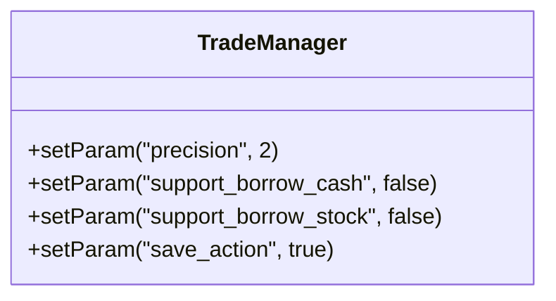

**Diagram sources**
- [TradeManager.cpp](file://hikyuu_cpp/hikyuu/trade_manage/TradeManager.cpp#L92-L94)

## 总结
TradeManager作为hikyuu框架中负责执行和记录交易的核心组件，提供了完整的交易管理功能。它通过精确的资金管理、持仓管理、交易记录和成本计算，为量化策略的回测提供了可靠的数据支持。其灵活的配置选项和与交易系统的紧密协同，使得用户能够根据实际需求构建和测试各种交易策略。通过Performance类提供的全面绩效统计功能，用户可以深入分析策略的表现，优化交易参数，提高投资回报。