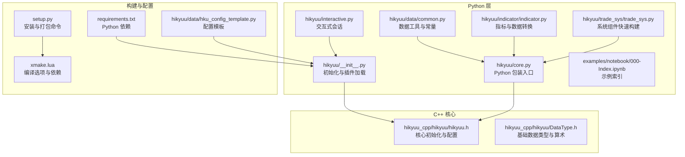
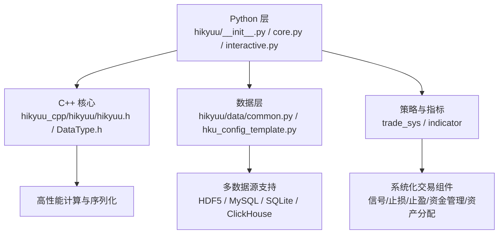
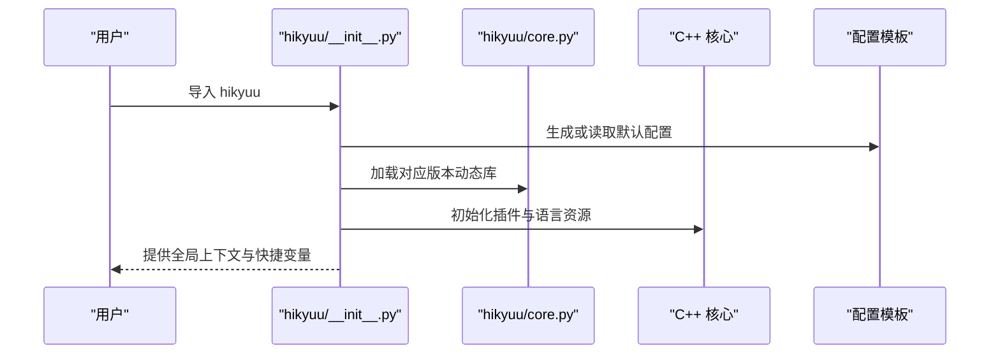
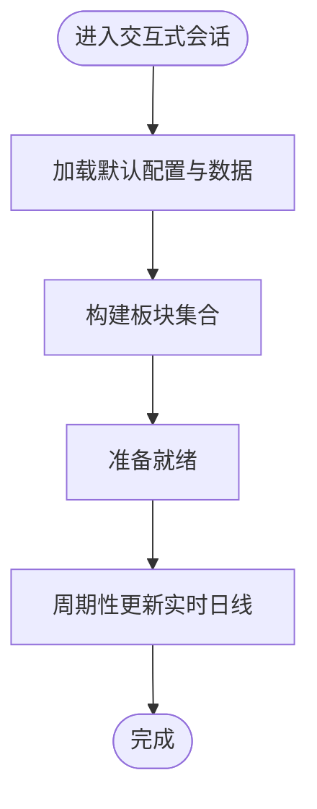
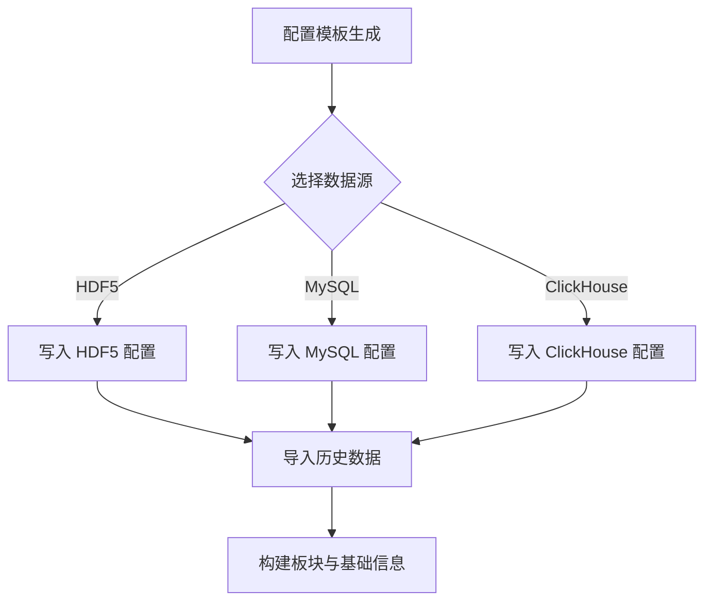
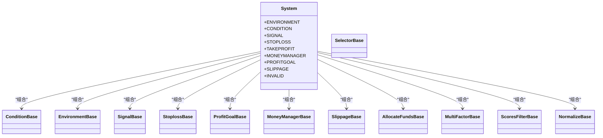
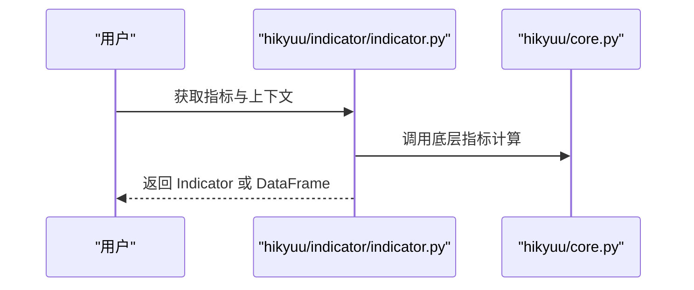
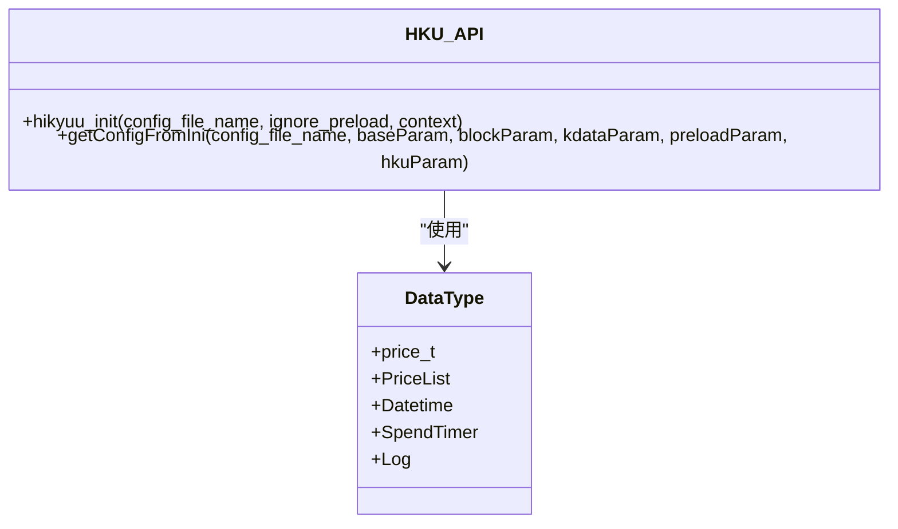
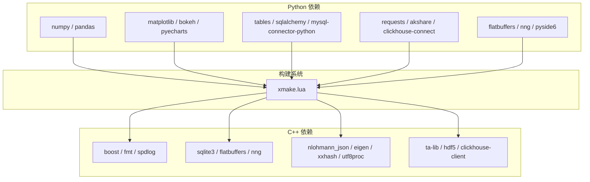

# 项目概述

<cite>
**本文引用的文件**
- [readme.md](file://readme.md)
- [setup.py](file://setup.py)
- [xmake.lua](file://xmake.lua)
- [hikyuu/__init__.py](file://hikyuu/__init__.py)
- [hikyuu/core.py](file://hikyuu/core.py)
- [hikyuu/interactive.py](file://hikyuu/interactive.py)
- [hikyuu/data/common.py](file://hikyuu/data/common.py)
- [hikyuu/data/hku_config_template.py](file://hikyuu/data/hku_config_template.py)
- [hikyuu/trade_sys/trade_sys.py](file://hikyuu/trade_sys/trade_sys.py)
- [hikyuu/indicator/indicator.py](file://hikyuu/indicator/indicator.py)
- [hikyuu_cpp/hikyuu/hikyuu.h](file://hikyuu_cpp/hikyuu/hikyuu.h)
- [hikyuu_cpp/hikyuu/DataType.h](file://hikyuu_cpp/hikyuu/DataType.h)
- [requirements.txt](file://requirements.txt)
- [hikyuu/examples/notebook/000-Index.ipynb](file://hikyuu/examples/notebook/000-Index.ipynb)
</cite>

## 目录
1. [引言](#引言)
2. [项目结构](#项目结构)
3. [核心组件](#核心组件)
4. [架构总览](#架构总览)
5. [详细组件分析](#详细组件分析)
6. [依赖关系分析](#依赖关系分析)
7. [性能考量](#性能考量)
8. [故障排查指南](#故障排查指南)
9. [结论](#结论)
10. [附录](#附录)

## 引言
Hikyuu 是一款基于 C++/Python 的开源量化交易研究框架，主要用于策略分析及回测（目前用于国内A股市场）。其核心思想基于当前成熟的系统化交易方法，将整个系统化交易抽象为由市场环境判断策略、系统有效条件、信号指示器、止损/止盈策略、资金管理策略、盈利目标策略、移滑价差算法七大组件。用户可以分别构建这些组件的策略资产库，在实际研究中对它们自由组合来观察系统的有效性、稳定性以及单一种类策略的效果。

Hikyuu主要聚焦于快速策略分析，本身不提供实盘交易功能。项目提供 Python 包装层与交互式工具，便于在 Jupyter 等环境中进行策略探索与可视化分析，并支持多数据源（HDF5、MySQL、SQLite、ClickHouse）与 TA-Lib 技术指标库集成。

## 项目结构
仓库采用分层组织方式：
- hikyuu_cpp：C++ 核心计算引擎与数据驱动层，包含 K 线、股票、市场信息、序列化、策略与交易系统等子模块。
- hikyuu_pywrap：Python 包装层，通过 pybind11 将 C++ 接口暴露为 Python API。
- hikyuu：Python 层，提供高层 API、数据导入与转换、策略组件快速构建、绘图与交互工具。
- hikyuu/data：数据导入、迁移与配置模板，支持多种数据源与升级脚本。
- hikyuu/examples：Jupyter Notebook 示例，涵盖入门、K 线与指标、系统策略、实盘与组合等主题。
- docker：开发与最小化环境镜像构建文件。
- test_data：测试配置与样例数据。
- 根目录：构建脚本、安装与打包脚本、依赖声明与项目配置。

图表来源
- [hikyuu/core.py](file://hikyuu/core.py#L1-L30)
- [hikyuu/__init__.py](file://hikyuu/__init__.py#L1-L120)
- [hikyuu/interactive.py](file://hikyuu/interactive.py#L1-L69)
- [hikyuu/data/common.py](file://hikyuu/data/common.py#L1-L120)
- [hikyuu/indicator/indicator.py](file://hikyuu/indicator/indicator.py#L1-L120)
- [hikyuu/trade_sys/trade_sys.py](file://hikyuu/trade_sys/trade_sys.py#L1-L120)
- [hikyuu_cpp/hikyuu/hikyuu.h](file://hikyuu_cpp/hikyuu/hikyuu.h#L1-L56)
- [hikyuu_cpp/hikyuu/DataType.h](file://hikyuu_cpp/hikyuu/DataType.h#L1-L168)
- [xmake.lua](file://xmake.lua#L1-L120)
- [setup.py](file://setup.py#L1-L120)
- [requirements.txt](file://requirements.txt#L1-L22)
- [hikyuu/data/hku_config_template.py](file://hikyuu/data/hku_config_template.py#L1-L120)

章节来源
- [readme.md](file://readme.md#L1-L115)
- [xmake.lua](file://xmake.lua#L1-L120)
- [setup.py](file://setup.py#L1-L120)

## 核心组件
- C++ 核心引擎（hikyuu_cpp）：提供高性能数据结构、K 线与市场信息管理、序列化、策略与交易系统框架、内置指标与 TA-Lib 集成等。
- Python 包装层（hikyuu_pywrap + hikyuu/core.py）：通过 pybind11 将 C++ 接口暴露为 Python API，支持多 Python 版本适配与动态库加载。
- Python 交互与工具（hikyuu/interactive.py、hikyuu/data/common.py、hikyuu/indicator/indicator.py、hikyuu/trade_sys/trade_sys.py）：提供加载数据、构建策略组件、指标转换与 DataFrame 互操作、系统策略快速构建等能力。
- 配置与数据导入（hikyuu/data/hku_config_template.py、hikyuu/data/common.py）：支持 HDF5、MySQL、SQLite、ClickHouse 多数据源，提供默认配置模板与导入脚本。
- 示例与文档（hikyuu/examples/notebook/000-Index.ipynb）：提供从入门到进阶的 Jupyter 示例，覆盖数据获取、K 线与指标、系统策略、实盘与组合等主题。

章节来源
- [hikyuu/core.py](file://hikyuu/core.py#L1-L30)
- [hikyuu/interactive.py](file://hikyuu/interactive.py#L1-L69)
- [hikyuu/data/common.py](file://hikyuu/data/common.py#L1-L120)
- [hikyuu/indicator/indicator.py](file://hikyuu/indicator/indicator.py#L1-L120)
- [hikyuu/trade_sys/trade_sys.py](file://hikyuu/trade_sys/trade_sys.py#L1-L120)
- [hikyuu/data/hku_config_template.py](file://hikyuu/data/hku_config_template.py#L1-L120)
- [hikyuu/examples/notebook/000-Index.ipynb](file://hikyuu/examples/notebook/000-Index.ipynb#L1-L77)

## 架构总览
Hikyuu 采用“C++ 核心 + Python 包装 + 交互工具”的分层设计：
- C++ 核心负责高性能计算与数据管理，提供统一的初始化接口与配置解析。
- Python 包装层通过 pybind11 将 C++ 类型与方法暴露为 Python API，并根据 Python 版本选择对应的动态库。
- Python 交互层提供加载数据、构建策略组件、指标与 DataFrame 互操作、绘图与 Jupyter 集成等能力。
- 数据层支持多数据源，通过配置模板与导入脚本实现数据迁移与升级。

图表来源
- [hikyuu/__init__.py](file://hikyuu/__init__.py#L1-L120)
- [hikyuu/core.py](file://hikyuu/core.py#L1-L30)
- [hikyuu/interactive.py](file://hikyuu/interactive.py#L1-L69)
- [hikyuu/data/common.py](file://hikyuu/data/common.py#L1-L120)
- [hikyuu/data/hku_config_template.py](file://hikyuu/data/hku_config_template.py#L1-L120)
- [hikyuu/trade_sys/trade_sys.py](file://hikyuu/trade_sys/trade_sys.py#L1-L120)
- [hikyuu/indicator/indicator.py](file://hikyuu/indicator/indicator.py#L1-L120)
- [hikyuu_cpp/hikyuu/hikyuu.h](file://hikyuu_cpp/hikyuu/hikyuu.h#L1-L56)
- [hikyuu_cpp/hikyuu/DataType.h](file://hikyuu_cpp/hikyuu/DataType.h#L1-L168)

## 详细组件分析

### Python 包装层与初始化
- 动态库加载与版本适配：根据 Python 版本选择对应核心动态库，确保兼容性。
- 插件路径与语言资源：设置插件目录与国际化资源路径，支持扩展与本地化。
- 交互式会话与 Jupyter 重定向：在 Jupyter 环境中重定向 C++ 标准输出，提升调试体验。
- 全局上下文与快捷变量：提供全局 K 线上下文与常用指标别名，简化策略编写。

图表来源
- [hikyuu/__init__.py](file://hikyuu/__init__.py#L1-L120)
- [hikyuu/core.py](file://hikyuu/core.py#L1-L30)
- [hikyuu/data/hku_config_template.py](file://hikyuu/data/hku_config_template.py#L1-L120)

章节来源
- [hikyuu/__init__.py](file://hikyuu/__init__.py#L1-L200)
- [hikyuu/core.py](file://hikyuu/core.py#L1-L30)

### 交互式探索工具
- 自动加载与板块构建：在交互环境中自动加载数据并构建 A 股板块集合，便于快速筛选与分析。
- 实时数据更新：提供基于第三方数据源的实时日线更新封装，控制更新频率与并发。

图表来源
- [hikyuu/interactive.py](file://hikyuu/interactive.py#L1-L69)
- [hikyuu/__init__.py](file://hikyuu/__init__.py#L200-L320)

章节来源
- [hikyuu/interactive.py](file://hikyuu/interactive.py#L1-L69)
- [hikyuu/__init__.py](file://hikyuu/__init__.py#L200-L320)

### 数据层与多数据源支持
- 数据类型与常量：定义市场、板块、股票类型等常量，提供代码规范化与映射。
- 配置模板：提供 HDF5、MySQL、ClickHouse 三种数据源的配置模板，支持预加载与导入开关。
- 数据导入与迁移：提供从 TDX、pytdx、MySQL、ClickHouse 等多源导入脚本，支持升级与迁移。

图表来源
- [hikyuu/data/common.py](file://hikyuu/data/common.py#L1-L120)
- [hikyuu/data/hku_config_template.py](file://hikyuu/data/hku_config_template.py#L1-L200)

章节来源
- [hikyuu/data/common.py](file://hikyuu/data/common.py#L1-L249)
- [hikyuu/data/hku_config_template.py](file://hikyuu/data/hku_config_template.py#L1-L339)

### 策略组件与系统化交易框架
- 快速构建策略组件：提供条件、环境、信号、止损止盈、资金管理、盈利目标、滑点、资产分配、多因子、评分过滤、归一化等组件的快速构建函数，支持自定义计算逻辑与通知回调。
- 组件组合与运行：通过系统化交易框架将组件组合为完整交易系统，支持回测与实盘运行。

图表来源
- [hikyuu/trade_sys/trade_sys.py](file://hikyuu/trade_sys/trade_sys.py#L1-L300)

章节来源
- [hikyuu/trade_sys/trade_sys.py](file://hikyuu/trade_sys/trade_sys.py#L1-L300)

### 指标与数据转换
- 指标 API 与 DataFrame 互操作：提供 Indicator 与 numpy/pandas 的互转方法，支持将多个指标合并为 DataFrame，便于统计分析与可视化。
- 快捷变量与同名指标：提供常用指标别名，简化策略表达式。

图表来源
- [hikyuu/indicator/indicator.py](file://hikyuu/indicator/indicator.py#L1-L120)
- [hikyuu/core.py](file://hikyuu/core.py#L1-L30)

章节来源
- [hikyuu/indicator/indicator.py](file://hikyuu/indicator/indicator.py#L1-L120)

### C++ 核心与数据类型
- 核心初始化与配置：提供初始化接口与配置解析，支持忽略预加载与上下文指定。
- 基础数据类型：定义价格、时间、序列化与算术等基础类型，支撑高性能计算。

图表来源
- [hikyuu/cpp/core](file://hikyuu/cpp/core)

章节来源
- [hikyuu/cpp/core](file://hikyuu/cpp/core)

## 依赖关系分析
- Python 依赖：NumPy、Pandas、Matplotlib、Bokeh、PySide6、Tables、SQLAlchemy、MySQL Connector、Requests、FlatBuffers、NNG、AkShare、PyECharts、ClickHouse Connect 等，满足数据分析、可视化与数据源连接需求。
- C++ 依赖：Boost、fmt、spdlog、SQLite3、FlatBuffers、nng、nlohmann_json、Eigen、xxHash、utf8proc、TA-Lib、HDF5、ClickHouse 客户端等，支撑高性能计算、日志、网络通信与序列化。
- 构建系统：xmake 提供跨平台编译、选项控制（HDF5/MySQL/SQLite/TA-Lib/低精度/日志级别/序列化等），并管理外部依赖仓库。

图表来源
- [requirements.txt](file://requirements.txt#L1-L22)
- [xmake.lua](file://xmake.lua#L120-L247)

章节来源
- [requirements.txt](file://requirements.txt#L1-L22)
- [xmake.lua](file://xmake.lua#L120-L247)

## 性能考量
- 极速回测与计算：项目强调高性能计算引擎与多核支持，针对大规模数据（如全市场日线）提供快速加载与计算能力。
- 低精度与序列化：提供低精度与序列化选项，平衡性能与精度；在 Windows 动态库与 macOS 静态库场景下进行兼容性配置。
- 数据源优化：默认推荐 HDF5 存储，具备体积小、速度快、备份便利的优势；同时支持 MySQL、ClickHouse 等关系型与列式数据库，满足不同规模与场景需求。

章节来源
- [readme.md](file://readme.md#L48-L88)
- [xmake.lua](file://xmake.lua#L1-L120)

## 故障排查指南
- 动态库加载失败：确认 Python 版本与对应动态库匹配，检查 PATH/LD_LIBRARY_PATH 是否包含动态库目录。
- 插件版本不兼容：当 hikyuu 与 hikyuu_plugin 主版本号不一致时会发出警告，需确保版本兼容。
- Jupyter 输出中文乱码：在 Windows 终端环境下自动切换编码，或在 Jupyter 环境中启用输出重定向。
- 配置文件缺失：若未找到默认配置，将自动生成并放置于用户目录下的 .hikyuu 目录，同时创建数据目录与板块配置。

章节来源
- [hikyuu/__init__.py](file://hikyuu/__init__.py#L1-L120)
- [hikyuu/data/hku_config_template.py](file://hikyuu/data/hku_config_template.py#L300-L339)

## 结论
Hikyuu 以 C++ 核心引擎为基础，结合 Python 包装层与交互式工具，形成一套完整的量化研究与实盘拓展平台。其模块化交易系统框架、多数据源支持与丰富的技术指标库，使其在 A 股市场策略分析、回测与实盘交易中具有显著优势。通过清晰的分层设计与完善的依赖管理，Hikyuu 既能满足初学者的入门需求，也能为高级用户提供深入定制与优化的空间。

## 附录
- 示例索引：Jupyter Notebook 示例涵盖入门、K 线与指标、系统策略、实盘与组合等主题，适合逐步学习与实践。
- 安装与打包：通过 setup.py 提供构建、测试、安装、打包与卸载命令，配合 xmake.lua 的编译选项，可快速部署到不同平台。

章节来源
- [hikyuu/examples/notebook/000-Index.ipynb](file://hikyuu/examples/notebook/000-Index.ipynb#L1-L77)
- [setup.py](file://setup.py#L120-L240)
- [xmake.lua](file://xmake.lua#L1-L120)