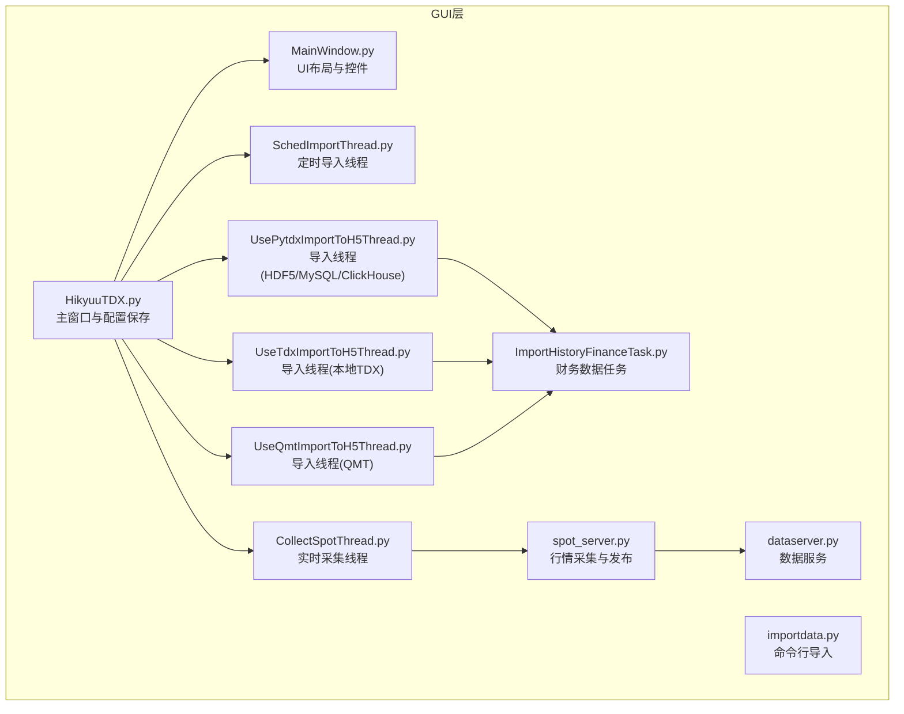
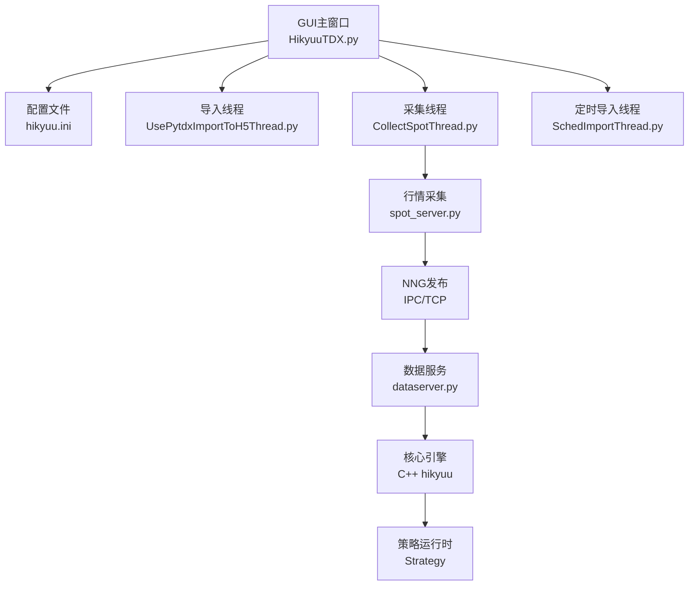
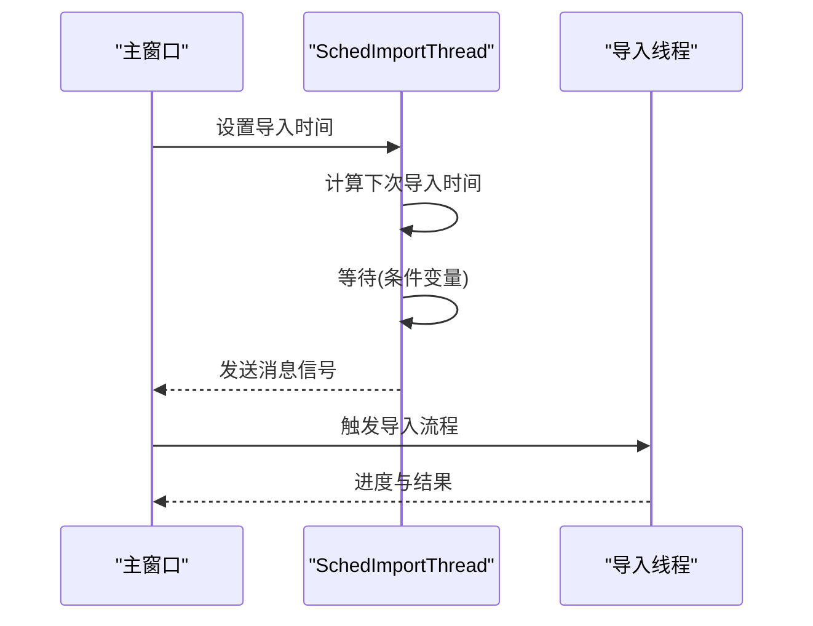
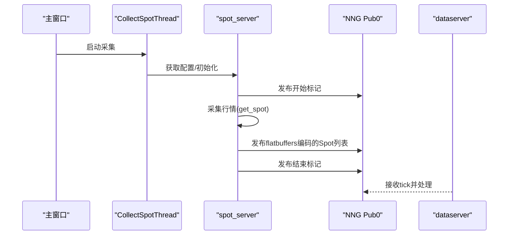
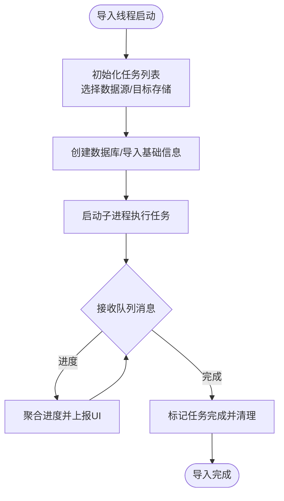
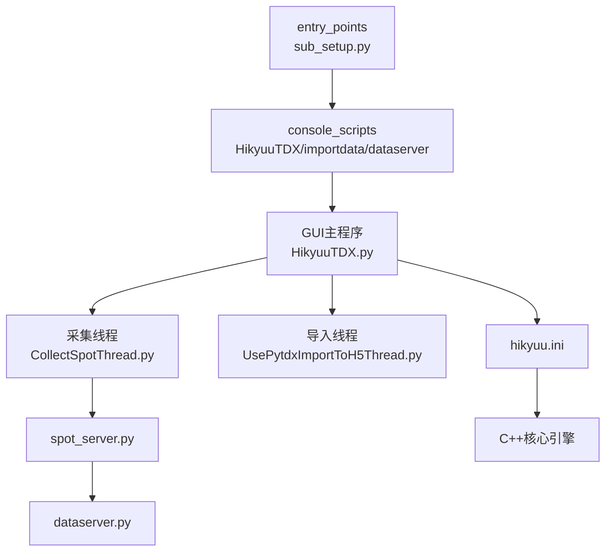

# GUI工具

<cite>
**本文引用的文件**
- [HikyuuTDX.py](file://hikyuu/gui/HikyuuTDX.py)
- [MainWindow.py](file://hikyuu/gui/data/MainWindow.py)
- [SchedImportThread.py](file://hikyuu/gui/data/SchedImportThread.py)
- [CollectSpotThread.py](file://hikyuu/gui/data/CollectSpotThread.py)
- [UsePytdxImportToH5Thread.py](file://hikyuu/gui/data/UsePytdxImportToH5Thread.py)
- [UseTdxImportToH5Thread.py](file://hikyuu/gui/data/UseTdxImportToH5Thread.py)
- [UseQmtImportToH5Thread.py](file://hikyuu/gui/data/UseQmtImportToH5Thread.py)
- [ImportHistoryFinanceTask.py](file://hikyuu/gui/data/ImportHistoryFinanceTask.py)
- [importdata.py](file://hikyuu/gui/importdata.py)
- [dataserver.py](file://hikyuu/gui/dataserver.py)
- [spot_server.py](file://hikyuu/gui/spot_server.py)
- [sub_setup.py](file://sub_setup.py)
</cite>

## 目录
1. [简介](#简介)
2. [项目结构](#项目结构)
3. [核心组件](#核心组件)
4. [架构总览](#架构总览)
5. [详细组件分析](#详细组件分析)
6. [依赖关系分析](#依赖关系分析)
7. [性能考量](#性能考量)
8. [故障排查指南](#故障排查指南)
9. [结论](#结论)
10. [附录](#附录)

## 简介
本文件面向Hikyuu图形用户界面（HikyuuTDX），系统性阐述其作为量化数据与策略可视化交互平台的功能与实现。重点覆盖：
- 实时行情监控：通过采集线程与数据服务，提供NNG发布与订阅的实时行情通道
- 数据导入任务管理：基于多进程的任务调度与进度上报，支持HDF5、MySQL、ClickHouse等目标存储
- 策略执行监控：通过策略运行时与GUI日志联动，实现策略事件与数据推送的可视化
- 股票池管理：通过策略上下文与GUI配置，限定策略运行范围与预加载策略
- 后台线程异步处理：导入线程、采集线程、定时导入线程的生命周期与同步机制
- 与核心交易引擎的集成：GUI生成hikyuu.ini配置，配合C++核心引擎的数据加载与策略运行
- 使用指南：数据导入、策略回测与实盘监控的操作步骤
- 常见问题排查：连接失败、数据更新延迟等

## 项目结构
HikyuuTDX位于hikyuu/gui目录，主要由以下层次构成：
- GUI入口与主窗口：HikyuuTDX.py、MainWindow.py
- 导入线程与任务：UsePytdxImportToH5Thread.py、UseTdxImportToH5Thread.py、UseQmtImportToH5Thread.py、ImportHistoryFinanceTask.py等
- 定时与采集：SchedImportThread.py、CollectSpotThread.py、spot_server.py
- 数据服务：dataserver.py
- 命令行辅助：importdata.py
- 安装入口点：sub_setup.py

图表来源
- [HikyuuTDX.py](file://hikyuu/gui/HikyuuTDX.py#L1-L120)
- [MainWindow.py](file://hikyuu/gui/data/MainWindow.py#L1-L120)
- [SchedImportThread.py](file://hikyuu/gui/data/SchedImportThread.py#L1-L62)
- [CollectSpotThread.py](file://hikyuu/gui/data/CollectSpotThread.py#L1-L44)
- [UsePytdxImportToH5Thread.py](file://hikyuu/gui/data/UsePytdxImportToH5Thread.py#L1-L120)
- [UseTdxImportToH5Thread.py](file://hikyuu/gui/data/UseTdxImportToH5Thread.py#L1-L120)
- [UseQmtImportToH5Thread.py](file://hikyuu/gui/data/UseQmtImportToH5Thread.py#L1-L120)
- [ImportHistoryFinanceTask.py](file://hikyuu/gui/data/ImportHistoryFinanceTask.py#L1-L60)
- [importdata.py](file://hikyuu/gui/importdata.py#L1-L60)
- [dataserver.py](file://hikyuu/gui/dataserver.py#L1-L36)
- [spot_server.py](file://hikyuu/gui/spot_server.py#L1-L120)

章节来源
- [HikyuuTDX.py](file://hikyuu/gui/HikyuuTDX.py#L1-L120)
- [MainWindow.py](file://hikyuu/gui/data/MainWindow.py#L1-L120)

## 核心组件
- 主窗口与配置保存：负责UI初始化、配置读写、日志重定向、线程生命周期管理
- 导入线程：封装多进程任务，汇总进度并通过信号反馈到UI
- 采集线程：周期性拉取实时行情，通过NNG发布到IPC/TCP通道
- 定时导入线程：按设定时间触发导入流程
- 数据服务：启动数据服务，接收tick并可选持久化
- 命令行导入：提供非GUI环境下的批量导入能力

章节来源
- [HikyuuTDX.py](file://hikyuu/gui/HikyuuTDX.py#L120-L260)
- [UsePytdxImportToH5Thread.py](file://hikyuu/gui/data/UsePytdxImportToH5Thread.py#L1-L120)
- [CollectSpotThread.py](file://hikyuu/gui/data/CollectSpotThread.py#L1-L44)
- [SchedImportThread.py](file://hikyuu/gui/data/SchedImportThread.py#L1-L62)
- [dataserver.py](file://hikyuu/gui/dataserver.py#L1-L36)

## 架构总览
HikyuuTDX通过GUI生成hikyuu.ini配置，供C++核心引擎加载；GUI内部通过线程与进程协作完成数据导入与实时行情采集，最终形成策略运行所需的K线与实时行情数据。

图表来源
- [HikyuuTDX.py](file://hikyuu/gui/HikyuuTDX.py#L260-L420)
- [spot_server.py](file://hikyuu/gui/spot_server.py#L160-L220)
- [dataserver.py](file://hikyuu/gui/dataserver.py#L1-L36)

## 详细组件分析

### 主窗口与布局（MainWindow）
- Tab页划分：数据源与导入配置、目标存储配置、导入任务与进度、预加载配置、实时采集配置
- 数据源选择：支持pytdx、tdx、qmt三种数据源，对应不同的导入线程与可用特性
- 目标存储：HDF5、MySQL、ClickHouse三选一，GUI根据许可证与用户选择启用相应配置项
- 导入任务：勾选需要导入的K线类型、权息、财务、板块等，设置起始日期
- 实时采集：设置采集间隔、时段、代理、数据源（QQ/QMT），启动/停止采集
- 预加载：按周期与最大条数配置内存预加载

章节来源
- [MainWindow.py](file://hikyuu/gui/data/MainWindow.py#L1-L200)
- [MainWindow.py](file://hikyuu/gui/data/MainWindow.py#L200-L420)
- [MainWindow.py](file://hikyuu/gui/data/MainWindow.py#L420-L720)
- [MainWindow.py](file://hikyuu/gui/data/MainWindow.py#L720-L1000)
- [MainWindow.py](file://hikyuu/gui/data/MainWindow.py#L1000-L1200)
- [MainWindow.py](file://hikyuu/gui/data/MainWindow.py#L1200-L1483)

### 主窗口逻辑与线程管理（HikyuuTDX）
- 日志重定向：将标准输出与日志写入UI文本框，支持彩色输出
- 配置保存：生成importdata-gui.ini与hikyuu.ini，确保目标目录存在与权限
- 线程生命周期：导入线程、采集线程、定时导入线程的启动、终止与等待
- 采集控制：启动/停止采集按钮切换状态，释放NNG发送端
- 预加载与数据源：根据许可证与用户选择启用ClickHouse，设置预加载参数

章节来源
- [HikyuuTDX.py](file://hikyuu/gui/HikyuuTDX.py#L1-L120)
- [HikyuuTDX.py](file://hikyuu/gui/HikyuuTDX.py#L120-L260)
- [HikyuuTDX.py](file://hikyuu/gui/HikyuuTDX.py#L260-L420)
- [HikyuuTDX.py](file://hikyuu/gui/HikyuuTDX.py#L420-L640)
- [HikyuuTDX.py](file://hikyuu/gui/HikyuuTDX.py#L640-L800)

### 定时导入线程（SchedImportThread）
- 功能：按配置的每日固定时间触发导入任务
- 机制：计算下次导入时间，使用条件变量与互斥锁阻塞等待，到期发出消息信号
- 生命周期：stop方法唤醒并等待线程退出

图表来源
- [SchedImportThread.py](file://hikyuu/gui/data/SchedImportThread.py#L1-L62)

章节来源
- [SchedImportThread.py](file://hikyuu/gui/data/SchedImportThread.py#L1-L62)

### 实时采集线程与数据服务（CollectSpotThread、spot_server、dataserver）
- 采集线程：根据配置周期性采集实时行情，支持QQ/QMT数据源、代理、时段限制
- 发布机制：通过NNG Pub0发布到IPC与TCP通道，消息体包含flatbuffers编码的Spot列表
- 数据服务：启动数据服务，接收tick并可选保存为Parquet或缓冲

图表来源
- [CollectSpotThread.py](file://hikyuu/gui/data/CollectSpotThread.py#L1-L44)
- [spot_server.py](file://hikyuu/gui/spot_server.py#L160-L220)
- [dataserver.py](file://hikyuu/gui/dataserver.py#L1-L36)

章节来源
- [CollectSpotThread.py](file://hikyuu/gui/data/CollectSpotThread.py#L1-L44)
- [spot_server.py](file://hikyuu/gui/spot_server.py#L1-L120)
- [spot_server.py](file://hikyuu/gui/spot_server.py#L120-L220)
- [spot_server.py](file://hikyuu/gui/spot_server.py#L220-L327)
- [dataserver.py](file://hikyuu/gui/dataserver.py#L1-L36)

### 导入线程与任务（UsePytdxImportToH5Thread、UseTdxImportToH5Thread、UseQmtImportToH5Thread、ImportHistoryFinanceTask）
- 多进程任务：导入线程创建多个子进程执行具体任务，统一通过队列汇总进度
- 任务类型：K线导入（日线/分钟线/分笔/分时）、权息/财务/板块/债券等
- 目标存储：根据配置选择HDF5(SQLite)、MySQL、ClickHouse，分别调用对应的创建数据库与导入函数
- 进度聚合：按市场与K线类型统计进度，向UI发送统一的进度信号

图表来源
- [UsePytdxImportToH5Thread.py](file://hikyuu/gui/data/UsePytdxImportToH5Thread.py#L1-L120)
- [UsePytdxImportToH5Thread.py](file://hikyuu/gui/data/UsePytdxImportToH5Thread.py#L120-L240)
- [UsePytdxImportToH5Thread.py](file://hikyuu/gui/data/UsePytdxImportToH5Thread.py#L240-L395)
- [UseTdxImportToH5Thread.py](file://hikyuu/gui/data/UseTdxImportToH5Thread.py#L1-L120)
- [UseTdxImportToH5Thread.py](file://hikyuu/gui/data/UseTdxImportToH5Thread.py#L120-L240)
- [UseTdxImportToH5Thread.py](file://hikyuu/gui/data/UseTdxImportToH5Thread.py#L240-L358)
- [UseQmtImportToH5Thread.py](file://hikyuu/gui/data/UseQmtImportToH5Thread.py#L1-L120)
- [UseQmtImportToH5Thread.py](file://hikyuu/gui/data/UseQmtImportToH5Thread.py#L120-L240)
- [UseQmtImportToH5Thread.py](file://hikyuu/gui/data/UseQmtImportToH5Thread.py#L240-L318)
- [ImportHistoryFinanceTask.py](file://hikyuu/gui/data/ImportHistoryFinanceTask.py#L1-L120)
- [ImportHistoryFinanceTask.py](file://hikyuu/gui/data/ImportHistoryFinanceTask.py#L120-L162)

章节来源
- [UsePytdxImportToH5Thread.py](file://hikyuu/gui/data/UsePytdxImportToH5Thread.py#L1-L120)
- [UsePytdxImportToH5Thread.py](file://hikyuu/gui/data/UsePytdxImportToH5Thread.py#L120-L240)
- [UsePytdxImportToH5Thread.py](file://hikyuu/gui/data/UsePytdxImportToH5Thread.py#L240-L395)
- [UseTdxImportToH5Thread.py](file://hikyuu/gui/data/UseTdxImportToH5Thread.py#L1-L120)
- [UseTdxImportToH5Thread.py](file://hikyuu/gui/data/UseTdxImportToH5Thread.py#L120-L240)
- [UseTdxImportToH5Thread.py](file://hikyuu/gui/data/UseTdxImportToH5Thread.py#L240-L358)
- [UseQmtImportToH5Thread.py](file://hikyuu/gui/data/UseQmtImportToH5Thread.py#L1-L120)
- [UseQmtImportToH5Thread.py](file://hikyuu/gui/data/UseQmtImportToH5Thread.py#L120-L240)
- [UseQmtImportToH5Thread.py](file://hikyuu/gui/data/UseQmtImportToH5Thread.py#L240-L318)
- [ImportHistoryFinanceTask.py](file://hikyuu/gui/data/ImportHistoryFinanceTask.py#L1-L120)
- [ImportHistoryFinanceTask.py](file://hikyuu/gui/data/ImportHistoryFinanceTask.py#L120-L162)

### 命令行导入（importdata.py）
- 提供非GUI环境下的导入流程，支持忽略K线导入模式
- 读取GUI生成的importdata-gui.ini，启动对应导入线程并监听进度消息

章节来源
- [importdata.py](file://hikyuu/gui/importdata.py#L1-L120)
- [importdata.py](file://hikyuu/gui/importdata.py#L120-L171)

## 依赖关系分析
- GUI入口点：通过entry_points注册console_scripts，便于命令行启动
- GUI与核心引擎：GUI生成hikyuu.ini，核心引擎通过hikyuu_init加载配置
- GUI与采集/服务：spot_server通过NNG发布行情，dataserver消费tick
- GUI与导入：导入线程通过多进程任务执行具体导入，统一上报进度

图表来源
- [sub_setup.py](file://sub_setup.py#L109-L135)
- [HikyuuTDX.py](file://hikyuu/gui/HikyuuTDX.py#L260-L420)
- [spot_server.py](file://hikyuu/gui/spot_server.py#L160-L220)
- [dataserver.py](file://hikyuu/gui/dataserver.py#L1-L36)

章节来源
- [sub_setup.py](file://sub_setup.py#L109-L135)
- [HikyuuTDX.py](file://hikyuu/gui/HikyuuTDX.py#L260-L420)

## 性能考量
- 多进程导入：通过多进程并行提高导入吞吐，注意磁盘I/O与网络带宽瓶颈
- 采集频率与时段：合理设置采集间隔与交易时段，避免超时与重复采集
- 预加载策略：根据内存容量选择预加载周期与最大条数，平衡查询性能与内存占用
- ClickHouse启用：需许可证，启用后可显著提升查询性能，但需关注优化与压缩策略

## 故障排查指南
- 连接失败
  - 采集线程：检查数据源、代理、时段配置；确认NNG监听地址与防火墙设置
  - 数据库：校验MySQL/ClickHouse连接参数；确认端口与权限
  - 服务器：确认目标服务器可达，必要时更换TDX服务器
- 数据更新延迟
  - 调整采集间隔与交易时段；检查网络波动与代理稳定性
  - 导入任务：关注队列阻塞与子进程异常，查看UI日志与进度
- GUI卡顿或崩溃
  - 关闭导入或采集后再关闭GUI；确保线程安全终止
  - 清理临时目录与锁资源，避免残留socket

章节来源
- [spot_server.py](file://hikyuu/gui/spot_server.py#L220-L327)
- [CollectSpotThread.py](file://hikyuu/gui/data/CollectSpotThread.py#L1-L44)
- [HikyuuTDX.py](file://hikyuu/gui/HikyuuTDX.py#L70-L113)

## 结论
HikyuuTDX通过清晰的UI布局与完善的后台线程体系，实现了从数据导入到实时行情采集的全链路可视化管理。结合核心引擎的策略运行能力，为量化研究与实盘监控提供了稳定高效的基础设施。建议在生产环境中合理配置采集与导入策略，定期维护配置文件与数据目录，确保系统长期稳定运行。

## 附录

### 使用GUI进行数据导入、策略回测与实盘监控的操作步骤
- 数据导入
  1) 在“数据源与导入配置”页选择数据源（pytdx/tdx/qmt），设置起始日期与导入类型
  2) 在“目标存储配置”页选择HDF5/MySQL/ClickHouse，填写连接参数与目录
  3) 在“导入任务与进度”页点击“启动导入”，观察进度条与日志
  4) 导入完成后，生成hikyuu.ini供核心引擎使用
- 策略回测
  1) 在策略脚本中创建Strategy实例，指定股票与K线类型
  2) 在GUI中启动实时采集，确保行情通道可用
  3) 运行策略脚本，接收行情回调与定时事件
- 实盘监控
  1) 启动数据服务，接收tick并可选保存
  2) 在策略中绑定交易管理器与订单回调，监控交易执行状态

章节来源
- [HikyuuTDX.py](file://hikyuu/gui/HikyuuTDX.py#L420-L640)
- [spot_server.py](file://hikyuu/gui/spot_server.py#L220-L327)
- [dataserver.py](file://hikyuu/gui/dataserver.py#L1-L36)