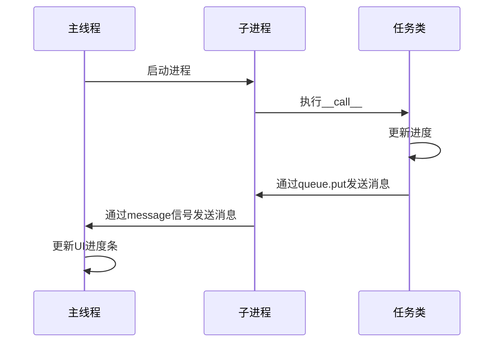
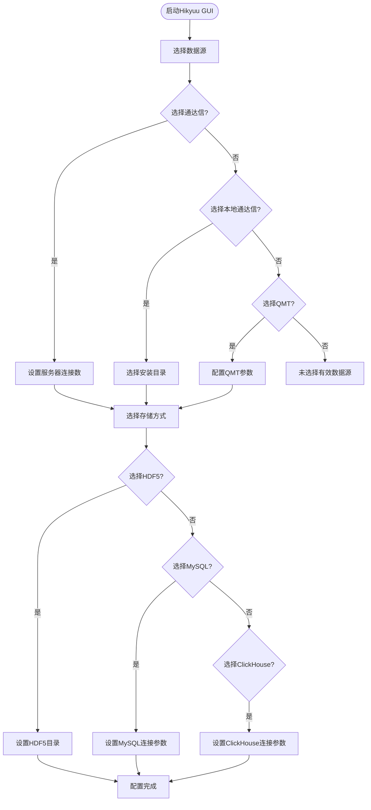
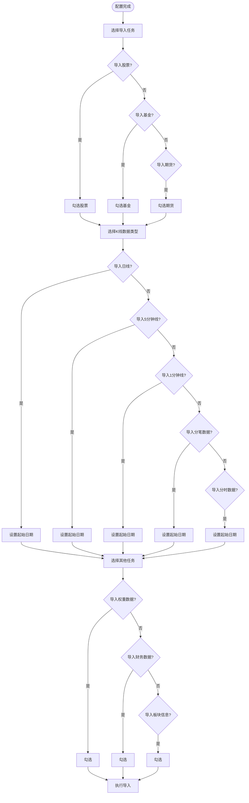
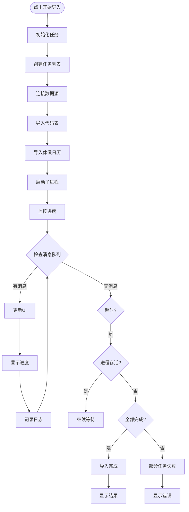

# 数据导入

<cite>
**本文档引用文件**   
- [importdata.py](file://hikyuu/gui/importdata.py)
- [ImportPytdxToH5Task.py](file://hikyuu/gui/data/ImportPytdxToH5Task.py)
- [ImportTdxToH5Task.py](file://hikyuu/gui/data/ImportTdxToH5Task.py)
- [UsePytdxImportToH5Thread.py](file://hikyuu/gui/data/UsePytdxImportToH5Thread.py)
- [UseTdxImportToH5Thread.py](file://hikyuu/gui/data/UseTdxImportToH5Thread.py)
- [SchedImportThread.py](file://hikyuu/gui/data/SchedImportThread.py)
- [ImportHistoryFinanceTask.py](file://hikyuu/gui/data/ImportHistoryFinanceTask.py)
- [ImportBlockInfoTask.py](file://hikyuu/gui/data/ImportBlockInfoTask.py)
- [ImportWeightToSqliteTask.py](file://hikyuu/gui/data/ImportWeightToSqliteTask.py)
- [ImportPytdxTransToH5Task.py](file://hikyuu/gui/data/ImportPytdxTransToH5Task.py)
- [ImportPytdxTimeToH5Task.py](file://hikyuu/gui/data/ImportPytdxTimeToH5Task.py)
- [ImportZhBond10Task.py](file://hikyuu/gui/data/ImportZhBond10Task.py)
- [MainWindow.py](file://hikyuu/gui/data/MainWindow.py)
</cite>

## 目录
1. [简介](#简介)
2. [支持的数据源与任务类型](#支持的数据源与任务类型)
3. 核心任务类实现机制
   1. [ImportPytdxToH5Task与ImportTdxToH5Task](#importpytdxtoh5task与importtdxtoh5task)
   2. [其他任务类](#其他任务类)
4. 异步批量导入实现
   1. [UsePytdxImportToH5Thread与UseTdxImportToH5Thread](#usepytdximporttoh5thread与usetdximporttoh5thread)
   2. [任务调度与进度管理](#任务调度与进度管理)
5. 定时自动导入
   1. [SchedImportThread实现](#schedimportthread实现)
6. 操作流程
   1. [数据源配置](#数据源配置)
   2. [任务创建与执行](#任务创建与执行)
   3. [执行监控](#执行监控)
7. 常见问题与解决方案
   1. [数据路径错误](#数据路径错误)
   2. [导入中断](#导入中断)

## 简介
Hikyuu GUI提供了一套完整的数据导入系统，支持从多种数据源（通达信、QMT、东方财富等）导入金融数据。该系统采用多线程和多进程架构，实现了异步批量导入功能，并支持定时自动导入。本文档详细解释该系统的架构、实现机制和操作流程。

## 支持的数据源与任务类型
Hikyuu数据导入系统支持以下数据源和任务类型：

**数据源类型**：
- **通达信(Pytdx)**：通过网络连接通达信行情服务器获取数据
- **本地通达信(Tdx)**：从本地通达信安装目录读取数据文件
- **QMT(Quantitative Trading Platform)**：从QMT平台获取数据
- **东方财富(East Money)**：从东方财富平台获取数据

**导入任务类型**：
- **K线数据**：包括日线(DAY)、5分钟线(5MIN)、1分钟线(1MIN)等
- **财务数据**：历史财务信息和当前财务信息
- **板块信息**：概念板块、地域板块等分类信息
- **权重数据**：股票权息数据
- **分笔数据**：历史分笔交易数据
- **分时数据**：分时行情数据
- **10年期国债收益率**：宏观经济指标数据

**Section sources**
- [MainWindow.py](file://hikyuu/gui/data/MainWindow.py#L59-L139)
- [importdata.py](file://hikyuu/gui/importdata.py#L19-L40)

## 核心任务类实现机制

### ImportPytdxToH5Task与ImportTdxToH5Task
`ImportPytdxToH5Task`和`ImportTdxToH5Task`是两个核心任务类，分别用于从网络通达信服务器和本地通达信目录导入K线数据。

```mermaid
classDiagram
class ImportPytdxToH5 {
+log_queue Queue
+queue Queue
+config ConfigParser
+market string
+ktype string
+quotations list
+ip string
+port int
+dest_dir string
+startDatetime int
+status string
+__call__() int
}
class ImportTdxToH5Task {
+log_queue Queue
+queue Queue
+config ConfigParser
+market string
+ktype string
+quotations list
+src_dir string
+dest_dir string
+status string
+__call__() int
}
class ProgressBar {
+src object
+__call__(cur int, total int) void
}
ImportPytdxToH5 --> ProgressBar : "使用"
ImportTdxToH5Task --> ProgressBar : "使用"
ImportPytdxToH5 --> "pytdx.hq.TdxHq_API" : "依赖"
ImportTdxToH5Task --> "pytdx.hq.TdxHq_API" : "依赖"
```

**Diagram sources**
- [ImportPytdxToH5Task.py](file://hikyuu/gui/data/ImportPytdxToH5Task.py#L45-L112)
- [ImportTdxToH5Task.py](file://hikyuu/gui/data/ImportTdxToH5Task.py#L45-L130)

**Section sources**
- [ImportPytdxToH5Task.py](file://hikyuu/gui/data/ImportPytdxToH5Task.py#L45-L112)
- [ImportTdxToH5Task.py](file://hikyuu/gui/data/ImportTdxToH5Task.py#L45-L130)

### 其他任务类
除了K线数据导入任务，系统还实现了其他类型的数据导入任务：

```mermaid
classDiagram
class ImportHistoryFinanceTask {
+log_queue Queue
+queue Queue
+config ConfigParser
+dest_dir string
+task_name string
+status string
+__call__() void
}
class ImportBlockInfoTask {
+log_queue Queue
+queue Queue
+config ConfigParser
+task_name string
+status string
+__call__() void
}
class ImportWeightToSqliteTask {
+log_queue Queue
+queue Queue
+config ConfigParser
+dest_dir string
+market string
+cmd string
+host string
+port int
+status string
+__call__() void
}
class ImportPytdxTransToH5 {
+log_queue Queue
+queue Queue
+config ConfigParser
+market string
+quotations list
+ip string
+port int
+dest_dir string
+max_days int
+status string
+__call__() int
}
class ImportPytdxTimeToH5 {
+log_queue Queue
+queue Queue
+config ConfigParser
+market string
+quotations list
+ip string
+port int
+dest_dir string
+max_days int
+status string
+__call__() int
}
class ImportZhBond10Task {
+log_queue Queue
+queue Queue
+config ConfigParser
+task_name string
+status string
+__call__() void
}
ImportHistoryFinanceTask --> "pytdx.hq.TdxHq_API" : "依赖"
ImportWeightToSqliteTask --> "pytdx.hq.TdxHq_API" : "依赖"
ImportPytdxTransToH5 --> "pytdx.hq.TdxHq_API" : "依赖"
ImportPytdxTimeToH5 --> "pytdx.hq.TdxHq_API" : "依赖"
```

**Diagram sources**
- [ImportHistoryFinanceTask.py](file://hikyuu/gui/data/ImportHistoryFinanceTask.py#L38-L150)
- [ImportBlockInfoTask.py](file://hikyuu/gui/data/ImportBlockInfoTask.py#L15-L60)
- [ImportWeightToSqliteTask.py](file://hikyuu/gui/data/ImportWeightToSqliteTask.py#L47-L128)
- [ImportPytdxTransToH5Task.py](file://hikyuu/gui/data/ImportPytdxTransToH5Task.py#L45-L106)
- [ImportPytdxTimeToH5Task.py](file://hikyuu/gui/data/ImportPytdxTimeToH5Task.py#L46-L106)
- [ImportZhBond10Task.py](file://hikyuu/gui/data/ImportZhBond10Task.py#L16-L59)

**Section sources**
- [ImportHistoryFinanceTask.py](file://hikyuu/gui/data/ImportHistoryFinanceTask.py#L38-L150)
- [ImportBlockInfoTask.py](file://hikyuu/gui/data/ImportBlockInfoTask.py#L15-L60)
- [ImportWeightToSqliteTask.py](file://hikyuu/gui/data/ImportWeightToSqliteTask.py#L47-L128)
- [ImportPytdxTransToH5Task.py](file://hikyuu/gui/data/ImportPytdxTransToH5Task.py#L45-L106)
- [ImportPytdxTimeToH5Task.py](file://hikyuu/gui/data/ImportPytdxTimeToH5Task.py#L46-L106)
- [ImportZhBond10Task.py](file://hikyuu/gui/data/ImportZhBond10Task.py#L16-L59)

## 异步批量导入实现

### UsePytdxImportToH5Thread与UseTdxImportToH5Thread
`UsePytdxImportToH5Thread`和`UseTdxImportToH5Thread`是两个核心线程类，负责管理异步批量导入任务。它们继承自`QThread`，实现了多进程并行导入。

```mermaid
classDiagram
class UsePytdxImportToH5Thread {
+message Signal
+parent QObject
+log_queue Queue
+config ConfigParser
+process_list list
+hosts list
+tasks list
+quotations list
+queue Queue
+init_task() void
+run() void
+_run() void
+send_message(msg list) void
}
class UseTdxImportToH5Thread {
+message Signal
+parent QObject
+log_queue Queue
+config ConfigParser
+process_list list
+hosts list
+tasks list
+quotations list
+queue Queue
+init_task() void
+run() void
+_run() void
+send_message(msg list) void
}
UsePytdxImportToH5Thread --> ImportPytdxToH5 : "创建"
UsePytdxImportToH5Thread --> ImportHistoryFinanceTask : "创建"
UsePytdxImportToH5Thread --> ImportBlockInfoTask : "创建"
UsePytdxImportToH5Thread --> ImportWeightToSqliteTask : "创建"
UsePytdxImportToH5Thread --> ImportPytdxTransToH5 : "创建"
UsePytdxImportToH5Thread --> ImportPytdxTimeToH5 : "创建"
UsePytdxImportToH5Thread --> ImportZhBond10Task : "创建"
UseTdxImportToH5Thread --> ImportTdxToH5Task : "创建"
UseTdxImportToH5Thread --> ImportHistoryFinanceTask : "创建"
UseTdxImportToH5Thread --> ImportBlockInfoTask : "创建"
UseTdxImportToH5Thread --> ImportWeightToSqliteTask : "创建"
UseTdxImportToH5Thread --> ImportZhBond10Task : "创建"
UsePytdxImportToH5Thread --> "multiprocessing.Process" : "使用"
UseTdxImportToH5Thread --> "multiprocessing.Process" : "使用"
```

**Diagram sources**
- [UsePytdxImportToH5Thread.py](file://hikyuu/gui/data/UsePytdxImportToH5Thread.py#L57-L394)
- [UseTdxImportToH5Thread.py](file://hikyuu/gui/data/UseTdxImportToH5Thread.py#L57-L357)

**Section sources**
- [UsePytdxImportToH5Thread.py](file://hikyuu/gui/data/UsePytdxImportToH5Thread.py#L57-L394)
- [UseTdxImportToH5Thread.py](file://hikyuu/gui/data/UseTdxImportToH5Thread.py#L57-L357)

### 任务调度与进度管理
系统通过消息队列和信号机制实现任务调度与进度管理。主线程通过`message`信号接收子进程的任务状态更新。



**Diagram sources**
- [UsePytdxImportToH5Thread.py](file://hikyuu/gui/data/UsePytdxImportToH5Thread.py#L87-L394)
- [UseTdxImportToH5Thread.py](file://hikyuu/gui/data/UseTdxImportToH5Thread.py#L84-L357)

**Section sources**
- [UsePytdxImportToH5Thread.py](file://hikyuu/gui/data/UsePytdxImportToH5Thread.py#L87-L394)
- [UseTdxImportToH5Thread.py](file://hikyuu/gui/data/UseTdxImportToH5Thread.py#L84-L357)

## 定时自动导入

### SchedImportThread实现
`SchedImportThread`类实现了定时自动导入功能，它继承自`QThread`，在指定时间自动触发数据导入。

```mermaid
classDiagram
class SchedImportThread {
+message Signal
+working bool
+_config ConfigParser
+hour int
+minute int
+cond QWaitCondition
+mutex QMutex
+stop() void
+next_time_delta() tuple
+run() void
}
SchedImportThread --> "QWaitCondition" : "使用"
SchedImportThread --> "QMutex" : "使用"
SchedImportThread --> "Datetime" : "使用"
SchedImportThread --> "TimeDelta" : "使用"
```

**Diagram sources**
- [SchedImportThread.py](file://hikyuu/gui/data/SchedImportThread.py#L15-L61)

**Section sources**
- [SchedImportThread.py](file://hikyuu/gui/data/SchedImportThread.py#L15-L61)

## 操作流程

### 数据源配置
通过`MainWindow`界面进行数据源配置，主要包括：

1. **选择数据源**：通过单选按钮选择通达信、本地通达信或QMT
2. **设置参数**：
   - 通达信：设置服务器连接数
   - 本地通达信：指定安装目录
   - QMT：配置相关参数
3. **目标存储配置**：选择HDF5、MySQL或ClickHouse作为数据存储



**Diagram sources**
- [MainWindow.py](file://hikyuu/gui/data/MainWindow.py#L59-L139)

**Section sources**
- [MainWindow.py](file://hikyuu/gui/data/MainWindow.py#L59-L139)

### 任务创建与执行
配置完成后，可以创建和执行导入任务：



**Diagram sources**
- [MainWindow.py](file://hikyuu/gui/data/MainWindow.py#L151-L308)

**Section sources**
- [MainWindow.py](file://hikyuu/gui/data/MainWindow.py#L151-L308)

### 执行监控
系统提供实时的执行监控功能：



**Diagram sources**
- [UsePytdxImportToH5Thread.py](file://hikyuu/gui/data/UsePytdxImportToH5Thread.py#L230-L394)
- [UseTdxImportToH5Thread.py](file://hikyuu/gui/data/UseTdxImportToH5Thread.py#L193-L357)

**Section sources**
- [UsePytdxImportToH5Thread.py](file://hikyuu/gui/data/UsePytdxImportToH5Thread.py#L230-L394)
- [UseTdxImportToH5Thread.py](file://hikyuu/gui/data/UseTdxImportToH5Thread.py#L193-L357)

## 常见问题与解决方案

### 数据路径错误
当出现数据路径错误时，通常有以下几种情况和解决方案：

1. **本地通达信目录不存在**
   - **问题**：指定的通达信安装目录不存在或路径错误
   - **解决方案**：通过"选择通达信目录"按钮正确选择通达信安装路径

2. **HDF5存储目录不可写**
   - **问题**：目标HDF5目录没有写入权限
   - **解决方案**：确保目标目录存在且有写入权限，或选择其他目录

3. **临时目录不可用**
   - **问题**：MySQL或ClickHouse的临时目录不可用
   - **解决方案**：检查并设置正确的临时目录路径

**Section sources**
- [importdata.py](file://hikyuu/gui/importdata.py#L127-L146)

### 导入中断
导入过程中可能出现中断，常见原因和解决方案包括：

1. **网络连接问题**
   - **问题**：无法连接通达信服务器
   - **解决方案**：检查网络连接，或尝试其他服务器

2. **数据库连接失败**
   - **问题**：MySQL或ClickHouse连接失败
   - **解决方案**：检查数据库服务是否运行，连接参数是否正确

3. **磁盘空间不足**
   - **问题**：存储空间不足导致导入失败
   - **解决方案**：清理磁盘空间或选择其他存储位置

4. **进程意外终止**
   - **问题**：子进程意外终止
   - **解决方案**：检查系统资源，确保有足够的内存和CPU资源

**Section sources**
- [UsePytdxImportToH5Thread.py](file://hikyuu/gui/data/UsePytdxImportToH5Thread.py#L334-L351)
- [UseTdxImportToH5Thread.py](file://hikyuu/gui/data/UseTdxImportToH5Thread.py#L334-L349)