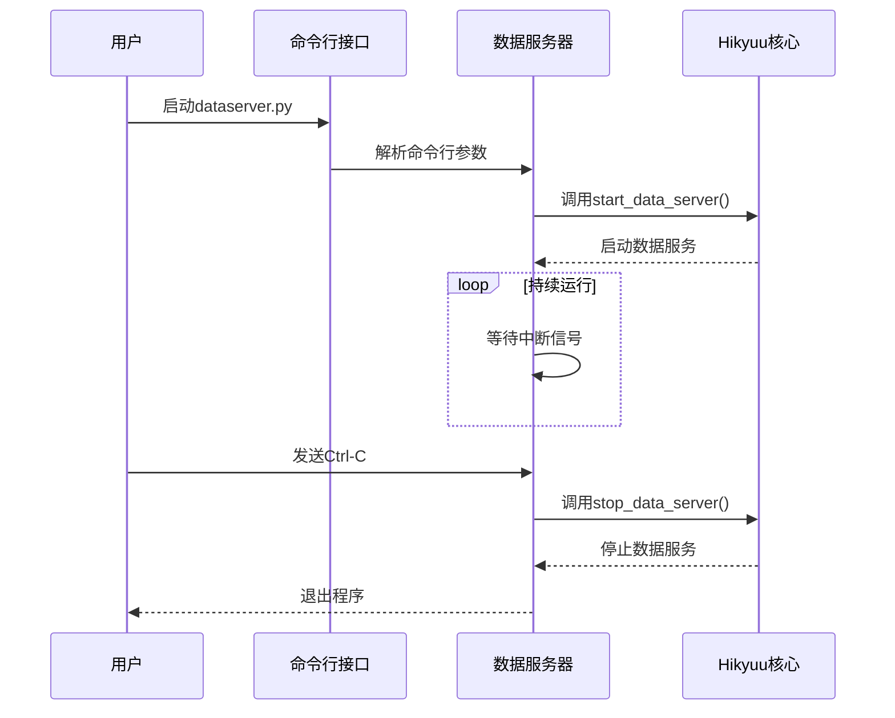
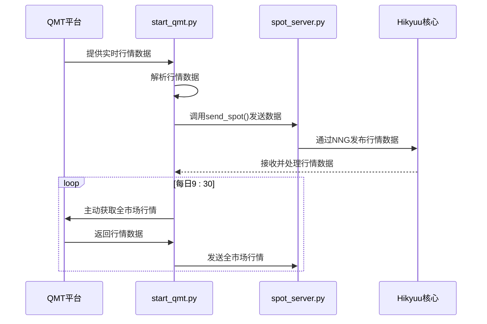
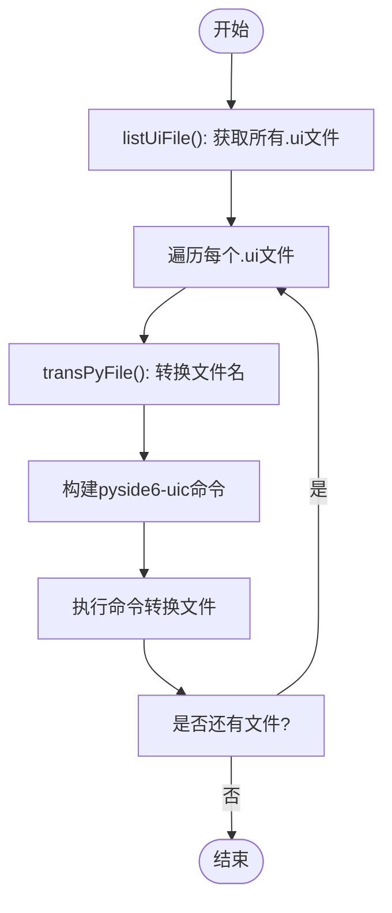
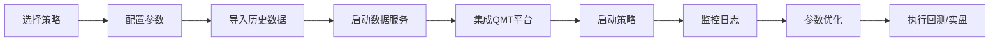

# 策略管理

<cite>
**本文档引用文件**   
- [MainWindow.py](file://hikyuu/gui/data/MainWindow.py)
- [HikyuuTDX.py](file://hikyuu/gui/HikyuuTDX.py)
- [dataserver.py](file://hikyuu/gui/dataserver.py)
- [start_qmt.py](file://hikyuu/gui/start_qmt.py)
- [tool.py](file://hikyuu/gui/data/tool.py)
- [strategy_demo1.py](file://hikyuu/strategy/strategy_demo1.py)
- [CollectSpotThread.py](file://hikyuu/gui/data/CollectSpotThread.py)
- [spot_server.py](file://hikyuu/gui/spot_server.py)
</cite>

## 目录
1. [简介](#简介)
2. [策略管理界面](#策略管理界面)
3. [数据服务支持](#数据服务支持)
4. [QMT平台集成](#qmt平台集成)
5. [辅助工具函数](#辅助工具函数)
6. [策略工作流程](#策略工作流程)
7. [日志与绩效分析](#日志与绩效分析)

## 简介
本文档详细说明Hikyuu GUI中的策略管理功能，涵盖通过主窗口界面加载、配置和启动量化交易策略的完整流程。文档解释了dataserver.py如何为策略运行提供实时数据支持，以及start_qmt.py如何集成迅投（QMT）量化平台实现策略实盘执行。同时，详细说明了tool.py中提供的辅助工具函数在策略调试和参数优化中的应用。文档提供了从策略选择、参数设置到启动回测或实盘交易的完整工作流程，并包含策略日志查看和绩效分析结果展示方法。

## 策略管理界面

Hikyuu GUI的策略管理功能主要通过`MainWindow`类实现，该类继承自`QMainWindow`和`Ui_MainWindow`，提供了图形化用户界面来管理量化交易策略。用户可以通过界面选择不同的数据源（如通达信、pytdx或QMT）、配置数据导入选项、设置数据库连接以及管理策略的预加载参数。

在`HikyuuTDX.py`文件中，`MyMainWindow`类负责初始化和管理主窗口的UI组件。它通过`initUI`方法读取配置文件并设置界面元素的状态，例如复选框、单选按钮和日期编辑器。用户可以通过勾选“导入股票”、“导入基金”等复选框来选择需要导入的证券类型，通过勾选“日线数据”、“5分钟线”等选项来选择需要导入的K线类型。

策略的预加载设置允许用户指定在启动时需要预加载的数据范围，例如日线、周线、月线等。这些设置通过`preload`部分的复选框和自旋框进行配置。用户还可以通过界面设置定时导入任务，指定每天执行数据导入的时间。

**Section sources**
- [MainWindow.py](file://hikyuu/gui/data/MainWindow.py#L1-L800)
- [HikyuuTDX.py](file://hikyuu/gui/HikyuuTDX.py#L1-L800)

## 数据服务支持

`dataserver.py`文件负责启动和管理Hikyuu的数据服务器，为策略运行提供实时行情数据支持。该文件使用`click`库定义了一个命令行接口，允许用户通过命令行参数配置数据服务器的地址、工作线程数、是否保存行情数据等选项。

数据服务器通过`start_data_server`函数启动，该函数接收多个参数，包括服务地址、工作线程数、是否保存tick数据、是否缓存tick数据以及Parquet文件存储路径。服务器启动后会进入一个无限循环，等待用户中断信号（如Ctrl-C）来停止服务。当接收到中断信号时，服务器会调用`stop_data_server`函数进行清理并退出。

**Diagram sources**
- [dataserver.py](file://hikyuu/gui/dataserver.py#L1-L36)

**Section sources**
- [dataserver.py](file://hikyuu/gui/dataserver.py#L1-L36)

## QMT平台集成

`start_qmt.py`文件实现了与迅投（QMT）量化平台的集成，允许Hikyuu通过QMT获取实时行情数据并执行实盘交易。该脚本首先检查并创建默认的配置文件，然后初始化Hikyuu的参数和上下文。它通过`xtquant`库订阅QMT的行情数据，并在收到数据后通过`spot_server`模块将数据发送到Hikyuu的行情服务器。

脚本的主要功能包括：
1. 读取配置文件并初始化Hikyuu参数
2. 初始化股票管理器（StockManager）并等待数据加载完成
3. 获取所有有效的证券列表并订阅其行情数据
4. 在每个交易日9:30主动获取一次全市场行情，以生成当日首个分钟线
5. 处理异常情况，如网络中断或用户中断

**Diagram sources**
- [start_qmt.py](file://hikyuu/gui/start_qmt.py#L1-L140)
- [spot_server.py](file://hikyuu/gui/spot_server.py#L1-L327)

**Section sources**
- [start_qmt.py](file://hikyuu/gui/start_qmt.py#L1-L140)

## 辅助工具函数

`tool.py`文件提供了一系列辅助工具函数，主要用于UI文件的转换和管理。该文件包含以下主要功能：

- `listUiFile()`: 列出指定目录下所有的.ui文件
- `transPyFile(filename)`: 将.ui文件名转换为对应的.py文件名
- `runMain()`: 执行主程序，遍历所有.ui文件并使用`pyside6-uic`工具将其转换为.py文件

这些工具函数简化了UI设计与代码生成的流程，使得开发者可以专注于界面设计，而无需手动执行转换命令。

**Diagram sources**
- [tool.py](file://hikyuu/gui/data/tool.py#L1-L51)

**Section sources**
- [tool.py](file://hikyuu/gui/data/tool.py#L1-L51)

## 策略工作流程

从策略选择到启动回测或实盘交易的完整工作流程如下：

1. **策略选择与配置**：用户通过`MainWindow`界面选择需要运行的策略，配置数据源、数据库连接和预加载参数。
2. **数据准备**：使用`importdata.py`脚本或GUI界面导入历史数据，确保策略运行所需的数据已准备就绪。
3. **启动数据服务**：通过`dataserver.py`启动数据服务器，为策略提供实时行情支持。
4. **集成QMT平台**：如果需要实盘交易，运行`start_qmt.py`脚本集成QMT平台，获取实时行情并执行交易。
5. **启动策略**：运行策略脚本（如`strategy_demo1.py`），策略会根据配置加载数据并开始执行。
6. **监控与调试**：通过日志查看策略运行状态，使用辅助工具进行参数优化和调试。

**Section sources**
- [MainWindow.py](file://hikyuu/gui/data/MainWindow.py#L1-L800)
- [dataserver.py](file://hikyuu/gui/dataserver.py#L1-L36)
- [start_qmt.py](file://hikyuu/gui/start_qmt.py#L1-L140)
- [strategy_demo1.py](file://hikyuu/strategy/strategy_demo1.py#L1-L54)

## 日志与绩效分析

策略运行过程中的日志信息可以通过`MyMainWindow`类的`normalOutputWritten`方法重定向到GUI界面的文本编辑器中。该方法会根据日志级别（DEBUG、WARNING、ERROR等）为文本添加不同的颜色样式，便于用户快速识别重要信息。

绩效分析结果可以通过Hikyuu的分析模块进行计算和展示。用户可以在策略脚本中定义绩效分析函数，并在策略运行结束后调用这些函数生成分析报告。报告可以包括收益率曲线、最大回撤、夏普比率等关键指标。

**Section sources**
- [HikyuuTDX.py](file://hikyuu/gui/HikyuuTDX.py#L1-L800)
- [strategy_demo1.py](file://hikyuu/strategy/strategy_demo1.py#L1-L54)