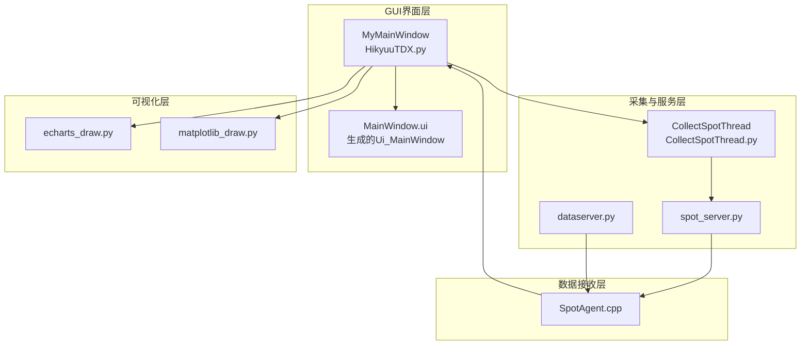
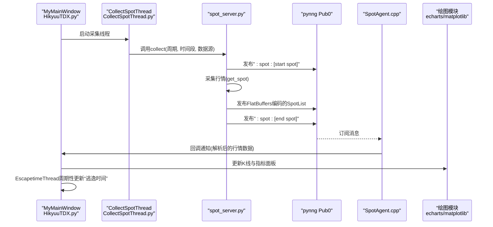
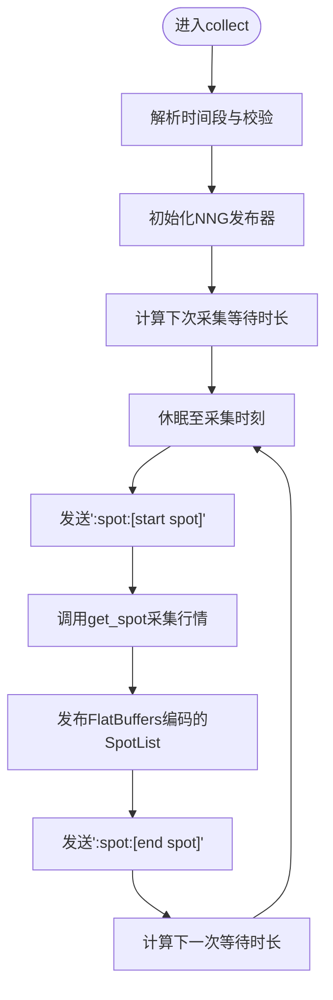
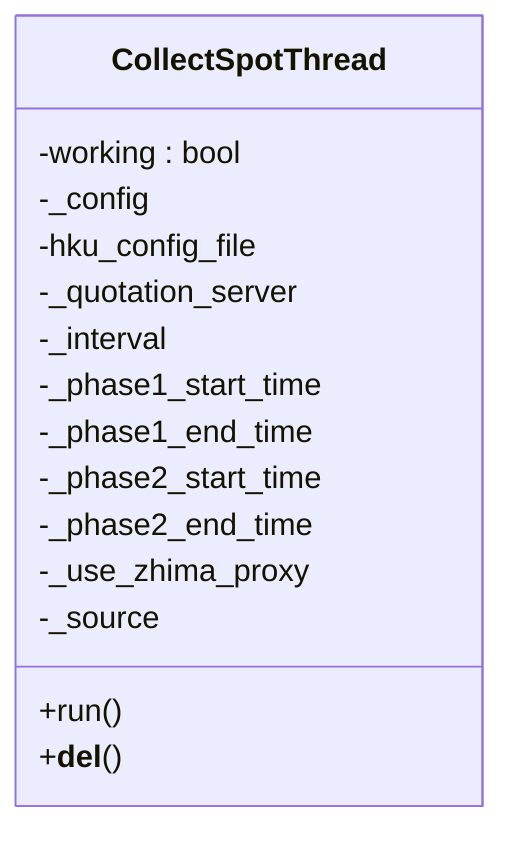
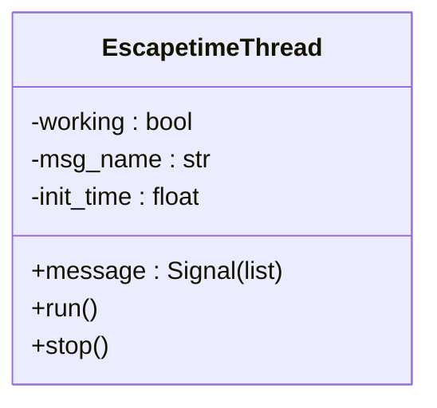
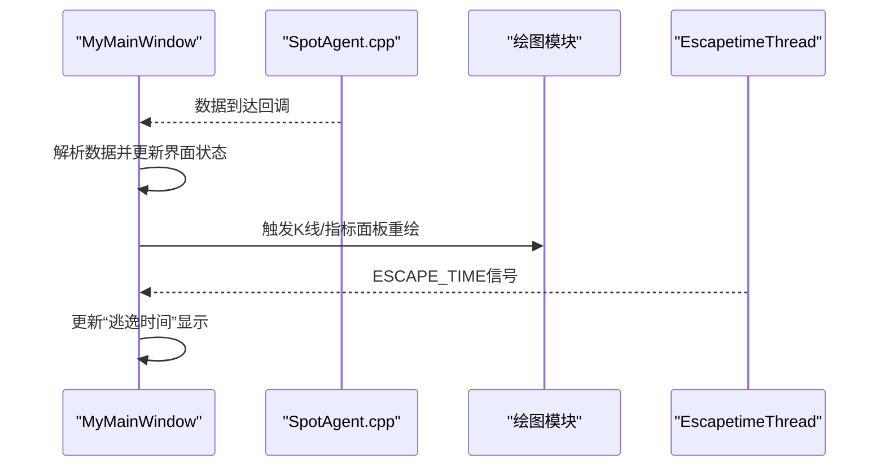
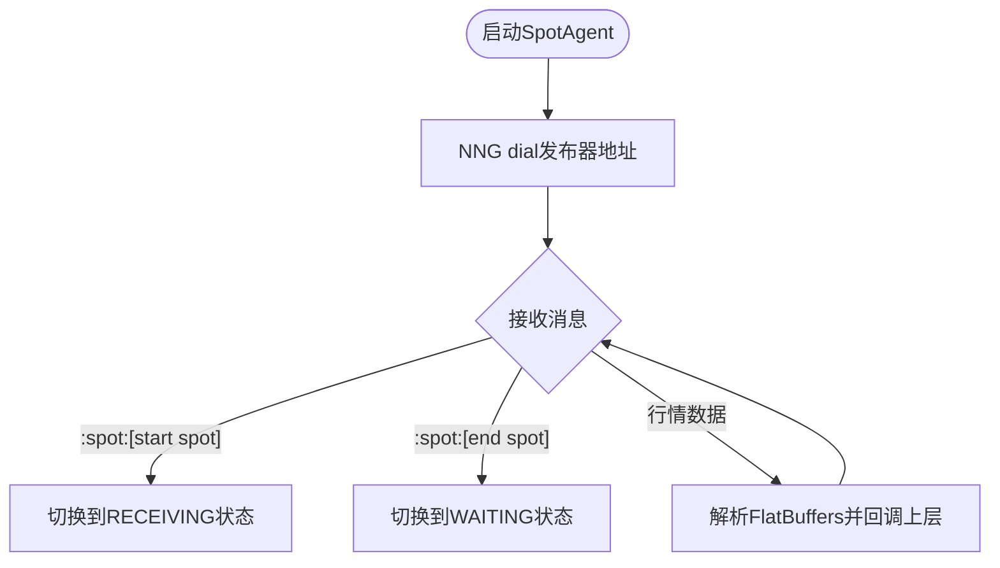
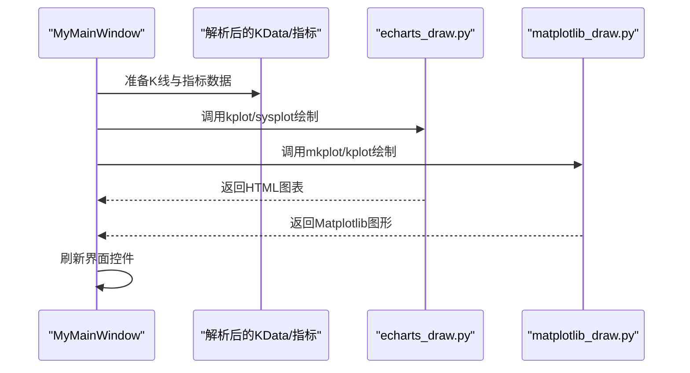
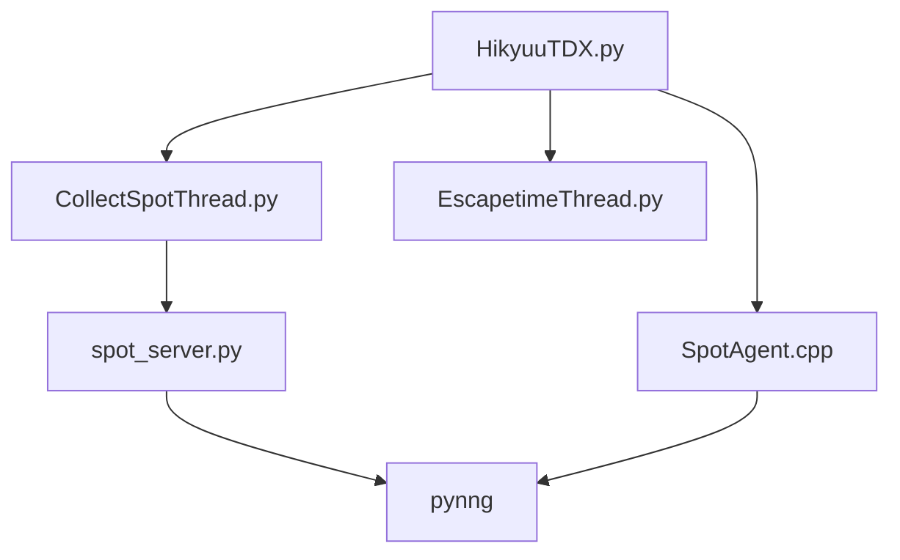

# 行情监控

<cite>
**本文引用的文件**
- [spot_server.py](file://hikyuu/gui/spot_server.py)
- [CollectSpotThread.py](file://hikyuu/gui/data/CollectSpotThread.py)
- [EscapetimeThread.py](file://hikyuu/gui/data/EscapetimeThread.py)
- [MainWindow.py](file://hikyuu/gui/data/MainWindow.py)
- [HikyuuTDX.py](file://hikyuu/gui/HikyuuTDX.py)
- [dataserver.py](file://hikyuu/gui/dataserver.py)
- [SpotAgent.cpp](file://hikyuu_cpp/hikyuu/global/agent/SpotAgent.cpp)
- [echarts_draw.py](file://hikyuu/draw/drawplot/echarts_draw.py)
- [matplotlib_draw.py](file://hikyuu/draw/drawplot/matplotlib_draw.py)
</cite>

## 目录
1. [引言](#引言)
2. [项目结构](#项目结构)
3. [核心组件](#核心组件)
4. [架构总览](#架构总览)
5. [详细组件分析](#详细组件分析)
6. [依赖关系分析](#依赖关系分析)
7. [性能考量](#性能考量)
8. [故障排查指南](#故障排查指南)
9. [结论](#结论)
10. [附录](#附录)

## 引言
本文件面向Hikyuu GUI行情监控功能，围绕实时行情服务端spot_server.py、采集线程CollectSpotThread、逃逸时间线程EscapetimeThread以及主界面MyMainWindow展开，系统阐述：
- spot_server如何作为实时行情服务端，通过CollectSpotThread线程从数据源采集实时行情并推送至订阅者；
- EscapetimeThread如何计算个股“逃逸时间”指标并以信号形式广播；
- MainWindow中行情列表、K线图表与指标面板的实时更新机制；
- 配置行情刷新频率、自定义监控股票池与设置预警条件的操作指南；
- HikyuuTDX主程序如何集成上述组件，形成一体化监控界面。

## 项目结构
Hikyuu GUI行情监控相关模块位于hikyuu/gui目录，主要由以下层次构成：
- 服务端与采集层：spot_server.py负责行情采集与发布；CollectSpotThread封装采集线程；EscapetimeThread提供逃逸时间信号。
- 界面层：MainWindow.py生成UI布局；HikyuuTDX.py承载主窗口逻辑、配置持久化与线程初始化。
- 数据接收层：C++侧SpotAgent.cpp通过NNG订阅spot_server发布的行情流，解析并转发给上层应用。
- 可视化层：echarts_draw.py与matplotlib_draw.py提供K线绘制与指标叠加展示。

**图表来源**
- [HikyuuTDX.py](file://hikyuu/gui/HikyuuTDX.py#L55-L120)
- [CollectSpotThread.py](file://hikyuu/gui/data/CollectSpotThread.py#L1-L44)
- [spot_server.py](file://hikyuu/gui/spot_server.py#L168-L216)
- [dataserver.py](file://hikyuu/gui/dataserver.py#L13-L36)
- [SpotAgent.cpp](file://hikyuu_cpp/hikyuu/global/agent/SpotAgent.cpp#L1-L47)
- [echarts_draw.py](file://hikyuu/draw/drawplot/echarts_draw.py#L401-L465)
- [matplotlib_draw.py](file://hikyuu/draw/drawplot/matplotlib_draw.py#L229-L337)

**章节来源**
- [HikyuuTDX.py](file://hikyuu/gui/HikyuuTDX.py#L55-L120)
- [spot_server.py](file://hikyuu/gui/spot_server.py#L168-L216)
- [CollectSpotThread.py](file://hikyuu/gui/data/CollectSpotThread.py#L1-L44)
- [SpotAgent.cpp](file://hikyuu_cpp/hikyuu/global/agent/SpotAgent.cpp#L1-L47)
- [echarts_draw.py](file://hikyuu/draw/drawplot/echarts_draw.py#L401-L465)
- [matplotlib_draw.py](file://hikyuu/draw/drawplot/matplotlib_draw.py#L229-L337)

## 核心组件
- 实时行情服务端：spot_server.py
  - 使用pynng Pub0发布行情，支持IPC与TCP两种传输方式；通过FlatBuffers序列化单条/批量行情记录；提供采集调度与时间窗控制。
- 采集线程：CollectSpotThread.py
  - 基于QThread封装，读取配置中的采集周期、数据源、代理与时间段，调用spot_server.collect执行采集循环。
- 逃逸时间线程：EscapetimeThread.py
  - 基于QThread，周期性发射“ESCAPE_TIME”消息，携带自启动以来的秒级累计时间，便于界面显示“已运行时长”等指标。
- 主窗口：MainWindow.py与HikyuuTDX.py
  - MainWindow.ui生成的Ui_MainWindow作为界面骨架；HikyuuTDX.py承载MyMainWindow，负责配置读写、线程初始化、日志输出重定向、窗口事件处理与数据源切换。
- 数据接收：SpotAgent.cpp
  - C++侧通过NNG Sub订阅服务端消息，解析开始/结束标记与行情数据，将数据传递给上层应用。

**章节来源**
- [spot_server.py](file://hikyuu/gui/spot_server.py#L228-L306)
- [CollectSpotThread.py](file://hikyuu/gui/data/CollectSpotThread.py#L15-L41)
- [EscapetimeThread.py](file://hikyuu/gui/data/EscapetimeThread.py#L1-L27)
- [HikyuuTDX.py](file://hikyuu/gui/HikyuuTDX.py#L55-L120)
- [SpotAgent.cpp](file://hikyuu_cpp/hikyuu/global/agent/SpotAgent.cpp#L1-L47)

## 架构总览
实时行情从采集端到界面的端到端流程如下：
- 采集端：CollectSpotThread启动spot_server.collect，按配置周期与时间段采集行情，通过pynng Pub0发布FlatBuffers编码的SpotList。
- 接收端：SpotAgent.cpp通过NNG Sub订阅，识别开始/结束标记，解析数据并回调上层。
- 界面端：MyMainWindow根据订阅到的数据更新行情列表、K线与指标面板；EscapetimeThread周期性更新“逃逸时间”。

**图表来源**
- [CollectSpotThread.py](file://hikyuu/gui/data/CollectSpotThread.py#L34-L41)
- [spot_server.py](file://hikyuu/gui/spot_server.py#L274-L306)
- [SpotAgent.cpp](file://hikyuu_cpp/hikyuu/global/agent/SpotAgent.cpp#L204-L248)
- [echarts_draw.py](file://hikyuu/draw/drawplot/echarts_draw.py#L401-L465)
- [matplotlib_draw.py](file://hikyuu/draw/drawplot/matplotlib_draw.py#L229-L337)

## 详细组件分析

### spot_server.py：实时行情服务端
- FlatBuffers序列化
  - create_fb_spot_record与create_fb_spot将行情字典序列化为FlatBuffers结构，包含市场、代码、名称、时间戳、昨收、开盘、最高、最低、成交金额、成交量、买卖盘口等字段。
- 发布器管理
  - get_nng_ipc_sender/get_nng_tcp_sender分别创建IPC与TCP发布器；start_send_spot/end_send_spot发送开始/结束标记，辅助接收端同步。
- 采集调度与时间窗控制
  - next_delta根据两时段相间的时间窗与忽略周末策略，计算下一次采集的等待时长；collect在每次采集前后发送开始/结束标记，确保接收端正确切分批次。
- 数据源与代理
  - 支持qmt与qq两种数据源；可通过use_proxy启用代理（需配置）。

**图表来源**
- [spot_server.py](file://hikyuu/gui/spot_server.py#L122-L157)
- [spot_server.py](file://hikyuu/gui/spot_server.py#L274-L306)

**章节来源**
- [spot_server.py](file://hikyuu/gui/spot_server.py#L26-L113)
- [spot_server.py](file://hikyuu/gui/spot_server.py#L122-L157)
- [spot_server.py](file://hikyuu/gui/spot_server.py#L168-L216)
- [spot_server.py](file://hikyuu/gui/spot_server.py#L228-L306)

### CollectSpotThread：采集线程
- 配置读取
  - 从配置读取quotation_server、interval、phase1/phase2、use_zhima_proxy、source等参数。
- 生命周期
  - run方法内调用spot_server.collect执行采集循环；析构时释放NNG资源。
- 与主窗口集成
  - MyMainWindow在初始化时创建并启动该线程；窗口关闭时终止线程并释放资源。

**图表来源**
- [CollectSpotThread.py](file://hikyuu/gui/data/CollectSpotThread.py#L15-L41)

**章节来源**
- [CollectSpotThread.py](file://hikyuu/gui/data/CollectSpotThread.py#L15-L41)
- [HikyuuTDX.py](file://hikyuu/gui/HikyuuTDX.py#L636-L650)

### EscapetimeThread：逃逸时间指标线程
- 功能
  - 以Signal(list)形式周期性发射“ESCAPE_TIME”消息，携带自启动以来的累计秒数。
- 生命周期
  - run循环每秒发射一次；stop方法设置working=false并等待线程退出。

**图表来源**
- [EscapetimeThread.py](file://hikyuu/gui/data/EscapetimeThread.py#L1-L27)

**章节来源**
- [EscapetimeThread.py](file://hikyuu/gui/data/EscapetimeThread.py#L1-L27)

### MainWindow与MyMainWindow：界面与实时更新机制
- 界面布局
  - MainWindow.ui定义了多个Tab页，包括“导入设置”、“数据库设置”、“定时导入”、“预加载设置”等；MyMainWindow通过Ui_MainWindow.setupUi初始化界面控件。
- 配置持久化
  - saveConfig将当前界面配置写入用户目录下的importdata-gui.ini与hikyuu.ini模板，后者包含quotation_server等关键参数。
- 线程初始化与事件处理
  - initThreads初始化各线程；closeEvent在窗口关闭时终止导入与采集线程、释放NNG资源、保存配置。
- 实时更新机制
  - 通过信号槽连接接收来自SpotAgent的数据回调，更新行情列表、K线与指标面板；EscapetimeThread通过message信号更新“逃逸时间”显示。

**图表来源**
- [HikyuuTDX.py](file://hikyuu/gui/HikyuuTDX.py#L55-L120)
- [SpotAgent.cpp](file://hikyuu_cpp/hikyuu/global/agent/SpotAgent.cpp#L204-L248)
- [echarts_draw.py](file://hikyuu/draw/drawplot/echarts_draw.py#L401-L465)
- [matplotlib_draw.py](file://hikyuu/draw/drawplot/matplotlib_draw.py#L229-L337)

**章节来源**
- [MainWindow.py](file://hikyuu/gui/data/MainWindow.py#L1-L200)
- [HikyuuTDX.py](file://hikyuu/gui/HikyuuTDX.py#L92-L120)
- [HikyuuTDX.py](file://hikyuu/gui/HikyuuTDX.py#L100-L170)
- [HikyuuTDX.py](file://hikyuu/gui/HikyuuTDX.py#L636-L650)

### 数据接收：SpotAgent.cpp
- 订阅与解析
  - 设置NNG_OPT_RECVTIMEO与重连逻辑；接收消息后根据开始/结束标记切换状态，解析FlatBuffers数据并回调上层。
- 服务地址
  - 默认使用ipc:///tmp/hikyuu_real.ipc，可通过setQuotationServer动态修改。

**图表来源**
- [SpotAgent.cpp](file://hikyuu_cpp/hikyuu/global/agent/SpotAgent.cpp#L1-L47)
- [SpotAgent.cpp](file://hikyuu_cpp/hikyuu/global/agent/SpotAgent.cpp#L204-L248)

**章节来源**
- [SpotAgent.cpp](file://hikyuu_cpp/hikyuu/global/agent/SpotAgent.cpp#L1-L47)
- [SpotAgent.cpp](file://hikyuu_cpp/hikyuu/global/agent/SpotAgent.cpp#L204-L248)

### 可视化：K线与指标面板
- 绘图接口
  - echarts_draw.kplot与matplotlib_draw.kplot提供K线绘制；echarts_draw.sysplot支持叠加指标与成交量。
- 实时更新
  - MyMainWindow在收到数据回调后，调用绘图接口刷新K线与指标面板，实现行情列表与K线联动更新。

**图表来源**
- [echarts_draw.py](file://hikyuu/draw/drawplot/echarts_draw.py#L401-L465)
- [matplotlib_draw.py](file://hikyuu/draw/drawplot/matplotlib_draw.py#L229-L337)

**章节来源**
- [echarts_draw.py](file://hikyuu/draw/drawplot/echarts_draw.py#L155-L179)
- [matplotlib_draw.py](file://hikyuu/draw/drawplot/matplotlib_draw.py#L303-L337)

## 依赖关系分析
- 组件耦合
  - CollectSpotThread依赖spot_server的collect接口；MyMainWindow依赖CollectSpotThread与SpotAgent回调；EscapetimeThread独立提供时间信号。
- 外部依赖
  - pynng用于发布/订阅；FlatBuffers用于高效序列化；NNG用于跨语言/跨进程通信；PySide6用于GUI。
- 潜在风险
  - IPC/TCP地址冲突、网络异常导致NNG连接失败、采集线程阻塞等问题需在异常处理中规避。

**图表来源**
- [CollectSpotThread.py](file://hikyuu/gui/data/CollectSpotThread.py#L15-L41)
- [spot_server.py](file://hikyuu/gui/spot_server.py#L168-L216)
- [SpotAgent.cpp](file://hikyuu_cpp/hikyuu/global/agent/SpotAgent.cpp#L1-L47)
- [HikyuuTDX.py](file://hikyuu/gui/HikyuuTDX.py#L55-L120)
- [EscapetimeThread.py](file://hikyuu/gui/data/EscapetimeThread.py#L1-L27)

**章节来源**
- [spot_server.py](file://hikyuu/gui/spot_server.py#L168-L216)
- [SpotAgent.cpp](file://hikyuu_cpp/hikyuu/global/agent/SpotAgent.cpp#L1-L47)
- [HikyuuTDX.py](file://hikyuu/gui/HikyuuTDX.py#L55-L120)

## 性能考量
- 序列化与传输
  - 使用FlatBuffers减少序列化开销；IPC相比TCP具有更低延迟，适合本地订阅。
- 采集节奏
  - 合理设置interval与时间段，避免在非交易时段频繁轮询；利用next_delta的周末跳过策略降低无效工作。
- 线程与锁
  - NNG发布器采用全局锁保护，避免并发创建；接收端使用线程池处理数据，提升吞吐。
- 绘图优化
  - 仅在数据增量变化时触发重绘；对指标叠加与成交量柱状图进行批量绘制，减少UI刷新次数。

[本节为通用指导，无需具体文件引用]

## 故障排查指南
- 采集线程无法启动
  - 检查配置文件是否存在与权限；确认quotation_server地址有效；查看日志输出重定向是否正常。
- NNG连接失败
  - 确认服务端已监听对应地址；检查防火墙与IPC权限；SpotAgent.cpp中设置了接收超时与重连逻辑。
- 行情不更新
  - 确认服务端已发送开始/结束标记；检查MyMainWindow是否正确接收回调；验证绘图接口是否被调用。
- 代理与数据源
  - 若使用代理，确保代理可用且IP白名单已配置；切换数据源后重新启动采集线程。

**章节来源**
- [spot_server.py](file://hikyuu/gui/spot_server.py#L274-L306)
- [SpotAgent.cpp](file://hikyuu_cpp/hikyuu/global/agent/SpotAgent.cpp#L204-L248)
- [HikyuuTDX.py](file://hikyuu/gui/HikyuuTDX.py#L92-L120)

## 结论
Hikyuu GUI行情监控通过spot_server.py提供统一的实时行情服务，CollectSpotThread负责采集与调度，EscapetimeThread提供运行时长指标，MyMainWindow整合界面与数据流，最终实现行情列表、K线与指标面板的实时联动更新。通过合理的配置与异常处理，系统可在本地与网络环境下稳定运行。

[本节为总结，无需具体文件引用]

## 附录

### 操作指南：配置行情刷新频率
- 在“导入设置”Tab中设置“采集周期（秒）”，该值将传入CollectSpotThread并作为spot_server.collect的seconds参数。
- “时间段1/2”用于定义交易时段，系统会根据时间段与周末策略计算下一次采集等待时长。

**章节来源**
- [HikyuuTDX.py](file://hikyuu/gui/HikyuuTDX.py#L490-L513)
- [CollectSpotThread.py](file://hikyuu/gui/data/CollectSpotThread.py#L15-L41)
- [spot_server.py](file://hikyuu/gui/spot_server.py#L122-L157)

### 操作指南：自定义监控股票池
- 在“导入设置”中勾选需要导入的行情类型（日线、分钟线、分笔、分时等），并设置起始日期。
- 通过数据源切换（Pytdx/通达信/QMT）选择不同数据源，注意QMT当前处于屏蔽状态。

**章节来源**
- [MainWindow.py](file://hikyuu/gui/data/MainWindow.ui#L1-L200)
- [HikyuuTDX.py](file://hikyuu/gui/HikyuuTDX.py#L386-L403)

### 操作指南：设置预警条件
- 在“预加载设置”中配置各类K线与分钟线的最大条数，以便在界面中快速定位目标股票。
- “逃逸时间”可用于监控采集线程运行时长，便于发现异常停顿。

**章节来源**
- [HikyuuTDX.py](file://hikyuu/gui/HikyuuTDX.py#L514-L539)
- [EscapetimeThread.py](file://hikyuu/gui/data/EscapetimeThread.py#L1-L27)

### HikyuuTDX主程序集成要点
- 配置持久化：saveConfig将界面配置写入importdata-gui.ini与hikyuu.ini模板，模板中包含quotation_server等关键参数。
- 线程管理：initThreads初始化各线程；closeEvent在窗口关闭时终止线程并释放资源。
- 日志输出：通过EmittingStream将stdout/stderr重定向至界面文本框，便于调试。

**章节来源**
- [HikyuuTDX.py](file://hikyuu/gui/HikyuuTDX.py#L98-L170)
- [HikyuuTDX.py](file://hikyuu/gui/HikyuuTDX.py#L261-L317)