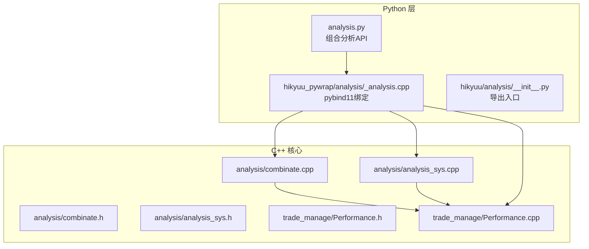
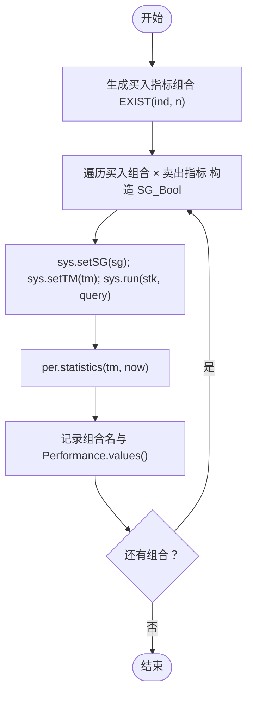
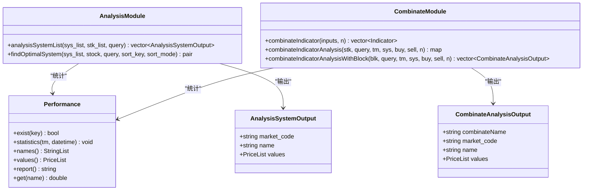
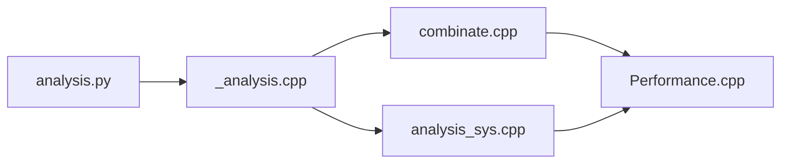

# 分析工具

<cite>
**本文引用的文件**
- [analysis.py](file://hikyuu/analysis/analysis.py)
- [_analysis.cpp](file://hikyuu_pywrap/analysis/_analysis.cpp)
- [analysis_main.cpp](file://hikyuu_pywrap/analysis/analysis_main.cpp)
- [analysis_sys.h](file://hikyuu_cpp/hikyuu/analysis/analysis_sys.h)
- [analysis_sys.cpp](file://hikyuu_cpp/hikyuu/analysis/analysis_sys.cpp)
- [combinate.h](file://hikyuu_cpp/hikyuu/analysis/combinate.h)
- [combinate.cpp](file://hikyuu_cpp/hikyuu/analysis/combinate.cpp)
- [Performance.h](file://hikyuu_cpp/hikyuu/trade_manage/Performance.h)
- [Performance.cpp](file://hikyuu_cpp/hikyuu/trade_manage/Performance.cpp)
- [_Performance.cpp](file://hikyuu_pywrap/trade_manage/_Performance.cpp)
- [analysis/__init__.py](file://hikyuu/analysis/__init__.py)
</cite>

## 目录
1. [简介](#简介)
2. [项目结构](#项目结构)
3. [核心组件](#核心组件)
4. [架构总览](#架构总览)
5. [组件详解](#组件详解)
6. [依赖关系分析](#依赖关系分析)
7. [性能与并发特性](#性能与并发特性)
8. [故障排查指南](#故障排查指南)
9. [结论](#结论)
10. [附录：使用示例与最佳实践](#附录使用示例与最佳实践)

## 简介
本文件聚焦于Hikyuu策略分析模块，系统性阐述Python侧analysis.py提供的组合分析能力，以及C++核心analysis_sys.cpp与combinate.cpp的实现机制与交互方式。文档旨在帮助用户完成：
- 加载回测结果与构建分析数据
- 执行指标组合分析与系统策略对比
- 生成性能统计与风险评估报告
- 进行参数优化与滚动寻优
- 在策略研究与优化中的高级应用场景

## 项目结构
分析模块位于Python层与C++核心层之间，通过pybind11桥接。关键路径如下：
- Python层入口与封装：hikyuu/analysis/analysis.py、hikyuu/analysis/__init__.py
- C++核心分析接口：hikyuu_cpp/hikyuu/analysis/combinate.h/.cpp、hikyuu_cpp/hikyuu/analysis/analysis_sys.h/.cpp
- Python绑定：hikyuu_pywrap/analysis/_analysis.cpp、hikyuu_pywrap/analysis/analysis_main.cpp
- 性能统计：hikyuu_cpp/hikyuu/trade_manage/Performance.h/.cpp，Python绑定_hikyuu_pywrap/trade_manage/_Performance.cpp



图表来源
- [analysis.py](file://hikyuu/analysis/analysis.py#L1-L152)
- [_analysis.cpp](file://hikyuu_pywrap/analysis/_analysis.cpp#L1-L215)
- [analysis_sys.h](file://hikyuu_cpp/hikyuu/analysis/analysis_sys.h#L1-L77)
- [analysis_sys.cpp](file://hikyuu_cpp/hikyuu/analysis/analysis_sys.cpp#L1-L191)
- [combinate.h](file://hikyuu_cpp/hikyuu/analysis/combinate.h#L1-L115)
- [combinate.cpp](file://hikyuu_cpp/hikyuu/analysis/combinate.cpp#L1-L129)
- [Performance.h](file://hikyuu_cpp/hikyuu/trade_manage/Performance.h#L1-L88)
- [Performance.cpp](file://hikyuu_cpp/hikyuu/trade_manage/Performance.cpp#L71-L132)

章节来源
- [analysis.py](file://hikyuu/analysis/analysis.py#L1-L152)
- [analysis/__init__.py](file://hikyuu/analysis/__init__.py#L1-L14)

## 核心组件
- 组合分析（指标组合与系统对比）
  - Python层：提供单股票与多股票的指标组合分析函数，以及系统策略列表分析函数
  - C++层：实现指标组合生成、信号组合、并行回测与性能统计
- 性能统计（Performance）
  - 提供回测期间的统一统计项与报告生成
- 最优系统选择
  - 支持单系统与多系统的最优筛选，按指定统计项排序

章节来源
- [analysis.py](file://hikyuu/analysis/analysis.py#L1-L152)
- [combinate.h](file://hikyuu_cpp/hikyuu/analysis/combinate.h#L1-L115)
- [combinate.cpp](file://hikyuu_cpp/hikyuu/analysis/combinate.cpp#L1-L129)
- [analysis_sys.h](file://hikyuu_cpp/hikyuu/analysis/analysis_sys.h#L1-L77)
- [analysis_sys.cpp](file://hikyuu_cpp/hikyuu/analysis/analysis_sys.cpp#L1-L191)
- [Performance.h](file://hikyuu_cpp/hikyuu/trade_manage/Performance.h#L1-L88)
- [Performance.cpp](file://hikyuu_cpp/hikyuu/trade_manage/Performance.cpp#L71-L132)

## 架构总览
Python侧analysis.py通过内部函数调用C++绑定，后者再调用C++核心实现。整体流程：
- Python准备Stock、Query、TradeManager、System等对象
- 调用inner_*绑定函数，释放GIL后进入C++核心
- C++核心执行指标组合、信号组合、并行回测与性能统计
- 将结果打包为字典或DataFrame返回给Python

```mermaid
sequenceDiagram
participant Py as "Python : analysis.py"
participant Bind as "Python : _analysis.cpp"
participant Core as "C++ : combinate.cpp / analysis_sys.cpp"
participant Perf as "C++ : Performance"
Py->>Bind : 调用 inner_combinate_ind_analysis(...)
Bind->>Bind : 释放GIL
Bind->>Core : combinateIndicatorAnalysis(...)
Core->>Core : 生成买入指标组合 EXIST(..., n)
Core->>Core : 遍历买入×卖出组合，构造信号 SG_Bool
loop 对每个信号
Core->>Core : sys.setSG(sg); sys.setTM(tm); sys.run(stk, query)
Core->>Perf : per.statistics(tm, now)
Core-->>Bind : 记录 Performance.values()
end
Bind-->>Py : 返回字典映射到组合名
```

图表来源
- [analysis.py](file://hikyuu/analysis/analysis.py#L1-L152)
- [_analysis.cpp](file://hikyuu_pywrap/analysis/_analysis.cpp#L1-L215)
- [combinate.cpp](file://hikyuu_cpp/hikyuu/analysis/combinate.cpp#L1-L129)
- [Performance.cpp](file://hikyuu_cpp/hikyuu/trade_manage/Performance.cpp#L71-L132)

## 组件详解

### 组合分析（指标组合与系统对比）
- 指标组合生成
  - 输入：一组买入/卖出指标序列，参数n表示指标在n周期内存在
  - 输出：由EXIST(ind, n)与逻辑与组合构成的新指标序列
  - 关键实现：combinateIndicator、combinateIndex模板
- 组合测试
  - 对每个买入组合与每个卖出指标构造信号SG_Bool，运行系统并统计Performance
  - 支持单股票与多股票（Block）批量测试
- 系统策略对比
  - analysis_sys_list与analysis_sys_list_multi：对系统原型克隆后批量运行，按Performance统计项汇总



图表来源
- [combinate.h](file://hikyuu_cpp/hikyuu/analysis/combinate.h#L1-L115)
- [combinate.cpp](file://hikyuu_cpp/hikyuu/analysis/combinate.cpp#L1-L129)
- [analysis.py](file://hikyuu/analysis/analysis.py#L1-L152)

章节来源
- [analysis.py](file://hikyuu/analysis/analysis.py#L1-L152)
- [combinate.h](file://hikyuu_cpp/hikyuu/analysis/combinate.h#L1-L115)
- [combinate.cpp](file://hikyuu_cpp/hikyuu/analysis/combinate.cpp#L1-L129)

### C++核心实现机制
- 组合分析核心
  - combinateIndicator：生成组合指标序列
  - combinateIndicatorAnalysis：单股票组合测试
  - combinateIndicatorAnalysisWithBlock：多股票并行组合测试（线程池+分段任务）
- 系统策略分析核心
  - analysisSystemList：对系统列表与股票列表逐一运行，统计Performance
  - findOptimalSystem / findOptimalSystemMulti：按指定统计项排序，返回最优系统
- 性能统计
  - Performance::statistics：基于交易记录在指定时间点计算统计项
  - Python侧通过绑定暴露values、names、report等接口



图表来源
- [analysis_sys.h](file://hikyuu_cpp/hikyuu/analysis/analysis_sys.h#L1-L77)
- [analysis_sys.cpp](file://hikyuu_cpp/hikyuu/analysis/analysis_sys.cpp#L1-L191)
- [combinate.h](file://hikyuu_cpp/hikyuu/analysis/combinate.h#L1-L115)
- [combinate.cpp](file://hikyuu_cpp/hikyuu/analysis/combinate.cpp#L1-L129)
- [Performance.h](file://hikyuu_cpp/hikyuu/trade_manage/Performance.h#L1-L88)

章节来源
- [analysis_sys.h](file://hikyuu_cpp/hikyuu/analysis/analysis_sys.h#L1-L77)
- [analysis_sys.cpp](file://hikyuu_cpp/hikyuu/analysis/analysis_sys.cpp#L1-L191)
- [combinate.h](file://hikyuu_cpp/hikyuu/analysis/combinate.h#L1-L115)
- [combinate.cpp](file://hikyuu_cpp/hikyuu/analysis/combinate.cpp#L1-L129)
- [Performance.h](file://hikyuu_cpp/hikyuu/trade_manage/Performance.h#L1-L88)

### Python层与C++层交互
- 绑定导出
  - _analysis.cpp导出inner_combinate_ind_analysis、inner_combinate_ind_analysis_with_block、inner_analysis_sys_list、find_optimal_system、find_optimal_system_multi
  - analysis_main.cpp聚合导出
- GIL管理
  - 在执行耗时的组合分析与系统列表分析时，释放GIL，避免阻塞Python线程
- 结果封装
  - 组合分析返回字典（组合名为键，Performance为值）
  - 系统列表分析返回字典（包含列名与各列的值列表）

章节来源
- [_analysis.cpp](file://hikyuu_pywrap/analysis/_analysis.cpp#L1-L215)
- [analysis_main.cpp](file://hikyuu_pywrap/analysis/analysis_main.cpp#L1-L17)
- [analysis.py](file://hikyuu/analysis/analysis.py#L1-L152)

## 依赖关系分析
- Python层依赖
  - analysis.py依赖核心模块（TradeManager、System、Performance等）与内部绑定函数
  - __init__.py导出组合分析与系统分析API
- C++层依赖
  - combinate.cpp依赖Indicator、Signal、System、TradeManager、Performance
  - analysis_sys.cpp依赖System、Performance、线程工具
- 绑定层依赖
  - _analysis.cpp依赖analysis_sys.h与combinate.h，调用C++核心并返回Python对象



图表来源
- [analysis.py](file://hikyuu/analysis/analysis.py#L1-L152)
- [_analysis.cpp](file://hikyuu_pywrap/analysis/_analysis.cpp#L1-L215)
- [combinate.cpp](file://hikyuu_cpp/hikyuu/analysis/combinate.cpp#L1-L129)
- [analysis_sys.cpp](file://hikyuu_cpp/hikyuu/analysis/analysis_sys.cpp#L1-L191)
- [Performance.cpp](file://hikyuu_cpp/hikyuu/trade_manage/Performance.cpp#L71-L132)

章节来源
- [analysis.py](file://hikyuu/analysis/analysis.py#L1-L152)
- [_analysis.cpp](file://hikyuu_pywrap/analysis/_analysis.cpp#L1-L215)
- [analysis_sys.cpp](file://hikyuu_cpp/hikyuu/analysis/analysis_sys.cpp#L1-L191)
- [combinate.cpp](file://hikyuu_cpp/hikyuu/analysis/combinate.cpp#L1-L129)

## 性能与并发特性
- 指标组合数量
  - 组合总数为2^n - 1，输入序列长度需控制（模板限制最大15），避免组合爆炸
- 并发策略
  - 多股票组合分析采用线程池与分段任务，提升吞吐
  - 系统列表分析支持并行版本findOptimalSystemMulti
- 时间窗口与统计截止
  - 统计严格限定至查询末尾交易日，避免持有头寸导致收益不准确
- GIL释放
  - 在耗时计算阶段释放GIL，提高Python侧交互响应

章节来源
- [combinate.h](file://hikyuu_cpp/hikyuu/analysis/combinate.h#L1-L115)
- [combinate.cpp](file://hikyuu_cpp/hikyuu/analysis/combinate.cpp#L1-L129)
- [analysis_sys.cpp](file://hikyuu_cpp/hikyuu/analysis/analysis_sys.cpp#L1-L191)

## 故障排查指南
- 统计项不存在
  - 若传入的keys不在Performance.names()中，将触发异常；请核对统计项名称
- 空序列或空股票列表
  - 当输入为空时，核心函数会直接返回空结果；检查输入是否正确
- 系统或股票为空
  - 对空系统或空股票的处理会跳过并记录错误日志；确保对象有效
- 组合数量超限
  - 输入序列长度超过模板限制将抛出异常；建议减少指标数量或拆分分析

章节来源
- [analysis.py](file://hikyuu/analysis/analysis.py#L1-L152)
- [combinate.h](file://hikyuu_cpp/hikyuu/analysis/combinate.h#L1-L115)
- [analysis_sys.cpp](file://hikyuu_cpp/hikyuu/analysis/analysis_sys.cpp#L1-L191)

## 结论
本分析模块通过Python层的易用API与C++核心的高性能实现，提供了从指标组合到系统策略对比的完整分析链路。结合Performance统计与并行化设计，能够高效支撑策略研究与参数优化工作。建议在大规模组合场景中合理控制输入规模，并充分利用多线程与滚动寻优能力。

## 附录：使用示例与最佳实践
以下示例展示如何加载回测结果、执行组合分析与生成分析报告（以路径代替具体代码内容）：
- 加载回测结果与准备对象
  - 准备Stock、Query、TradeManager、System等对象，参考示例路径：[examples_init.py](file://hikyuu/examples/examples_init.py)
- 单股票指标组合分析
  - 调用Python函数：combinate_ind_analysis(stk, query, tm, sys, buy_inds, sell_inds, n, keys)
  - 参考实现路径：[analysis.py](file://hikyuu/analysis/analysis.py#L1-L70)
- 多股票指标组合分析
  - 调用Python函数：combinate_ind_analysis_multi(stks, query, tm, sys, buy_inds, sell_inds, n, keys)
  - 参考实现路径：[analysis.py](file://hikyuu/analysis/analysis.py#L61-L105)
- 系统策略列表分析
  - 调用Python函数：analysis_sys_list(stks, query, sys_proto, keys)
  - 参考实现路径：[analysis.py](file://hikyuu/analysis/analysis.py#L107-L134)
- 多股票系统策略列表分析
  - 调用Python函数：analysis_sys_list_multi(stks, query, sys_proto, keys)
  - 参考实现路径：[analysis.py](file://hikyuu/analysis/analysis.py#L136-L152)
- 生成分析报告
  - 使用Performance的report或values接口查看统计项，参考绑定路径：[_Performance.cpp](file://hikyuu_pywrap/trade_manage/_Performance.cpp#L44-L63)
- 参数优化与滚动寻优
  - 使用find_optimal_system/find_optimal_system_multi按指定统计项排序，参考C++实现路径：[analysis_sys.cpp](file://hikyuu_cpp/hikyuu/analysis/analysis_sys.cpp#L88-L191)
- 高级应用场景
  - 指标组合数量控制：遵循模板限制，避免组合爆炸
  - 并行加速：利用多线程与并行版本函数，提升大规模分析效率
  - 时间窗口一致性：确保统计截止时间与查询范围一致，避免持仓影响收益

章节来源
- [analysis.py](file://hikyuu/analysis/analysis.py#L1-L152)
- [_Performance.cpp](file://hikyuu_pywrap/trade_manage/_Performance.cpp#L44-L63)
- [analysis_sys.cpp](file://hikyuu_cpp/hikyuu/analysis/analysis_sys.cpp#L88-L191)