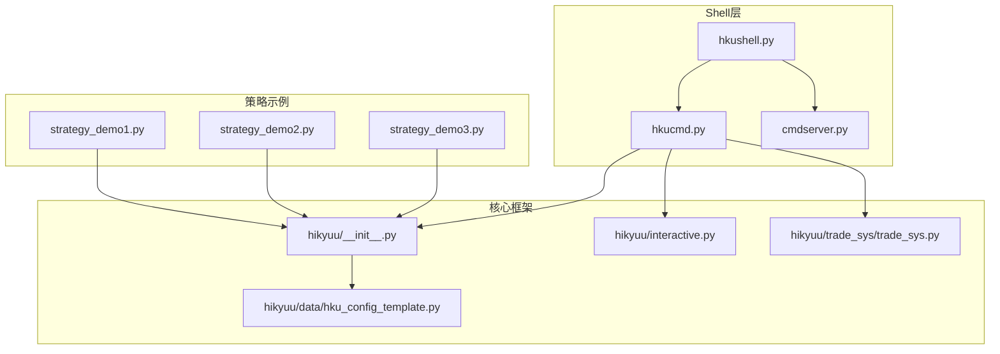
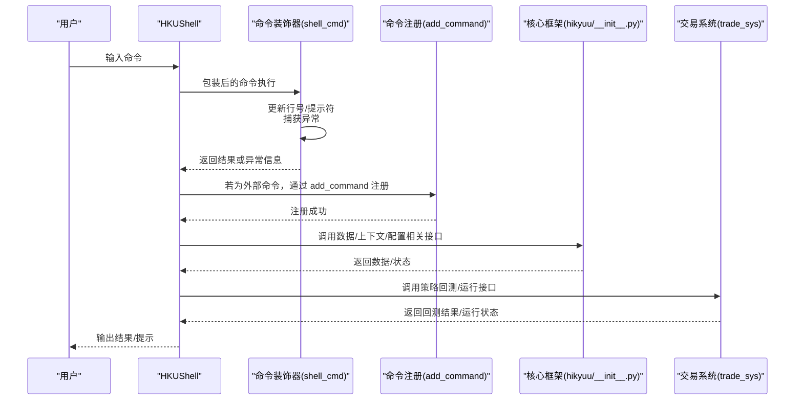
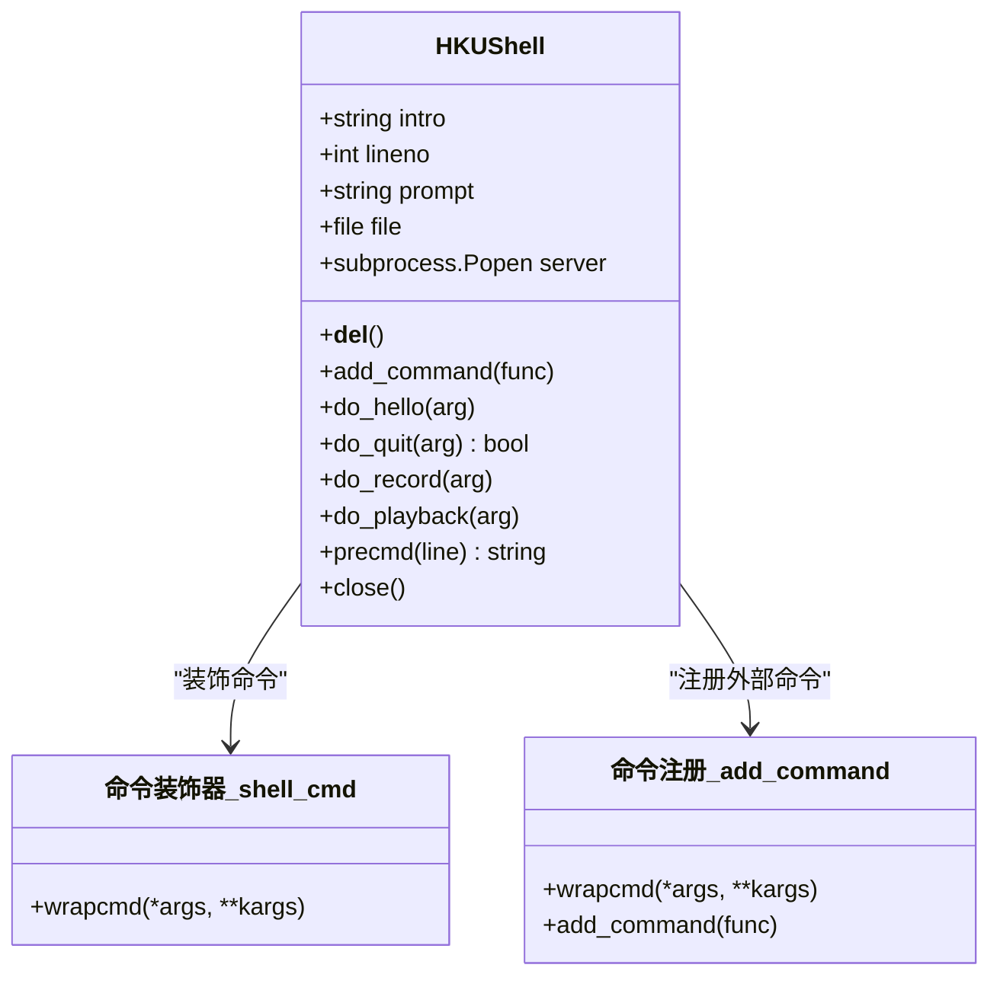
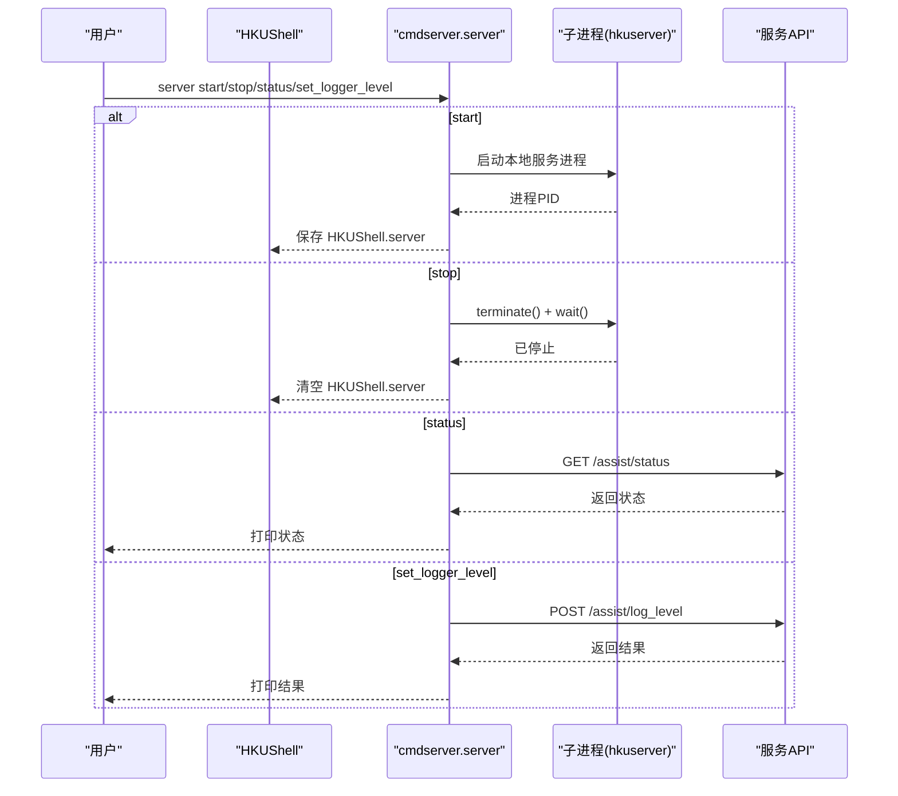
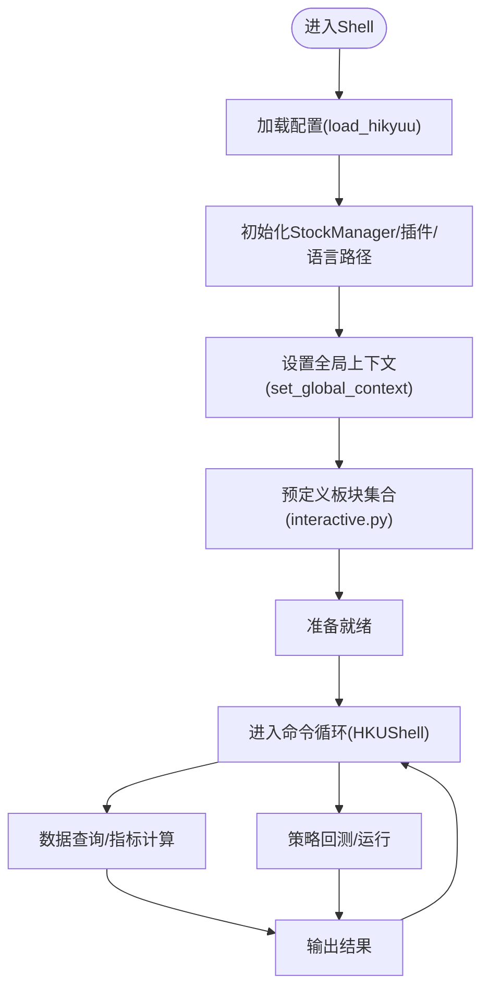
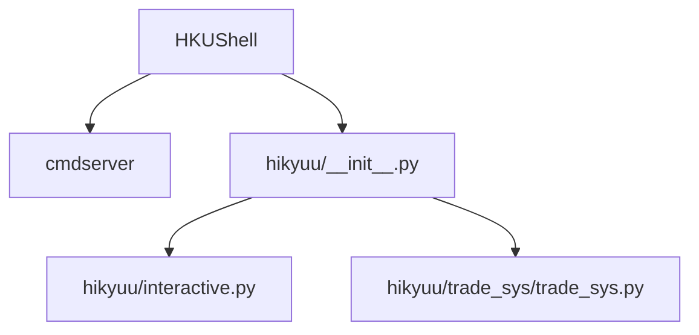

# Shell环境

<cite>
**本文引用的文件**
- [hkushell.py](file://hikyuu/shell/hkushell.py)
- [hkucmd.py](file://hikyuu/shell/hkucmd.py)
- [cmdserver.py](file://hikyuu/shell/cmdserver.py)
- [__init__.py](file://hikyuu/__init__.py)
- [interactive.py](file://hikyuu/interactive.py)
- [hku_config_template.py](file://hikyuu/data/hku_config_template.py)
- [trade_sys.py](file://hikyuu/trade_sys/trade_sys.py)
- [strategy_demo1.py](file://hikyuu/strategy/strategy_demo1.py)
- [strategy_demo2.py](file://hikyuu/strategy/strategy_demo2.py)
- [strategy_demo3.py](file://hikyuu/strategy/strategy_demo3.py)
</cite>

## 目录
1. [简介](#简介)
2. [项目结构](#项目结构)
3. [核心组件](#核心组件)
4. [架构总览](#架构总览)
5. [详细组件分析](#详细组件分析)
6. [依赖关系分析](#依赖关系分析)
7. [性能考量](#性能考量)
8. [故障排查指南](#故障排查指南)
9. [结论](#结论)
10. [附录](#附录)

## 简介
本文件围绕 hikyuu 的命令行交互环境进行系统化说明，重点覆盖：
- hkushell.py 如何组织一个完整的交互式 Shell，支持命令解析、历史记录、自动补全（通过 cmd 模块）、脚本执行（record/playback）。
- hkucmd.py 中定义的命令集与处理逻辑，包括如何加载配置、管理数据、执行策略回测与运行。
- Shell 环境与核心框架的集成机制，包括命名空间管理、异常处理与上下文传递。
- 如何扩展自定义命令以满足特定研究需求。
- 提供实用的交互式命令示例，如股票数据查询、指标计算与交易系统运行。

## 项目结构
hikyuu 的 Shell 相关代码位于 hikyuu/shell 目录，配合 hikyuu 核心模块完成数据加载、策略回测与运行。

图表来源
- [hkushell.py](file://hikyuu/shell/hkushell.py#L1-L20)
- [hkucmd.py](file://hikyuu/shell/hkucmd.py#L1-L111)
- [cmdserver.py](file://hikyuu/shell/cmdserver.py#L1-L127)
- [__init__.py](file://hikyuu/__init__.py#L1-L200)
- [interactive.py](file://hikyuu/interactive.py#L1-L69)
- [hku_config_template.py](file://hikyuu/data/hku_config_template.py#L1-L120)
- [trade_sys.py](file://hikyuu/trade_sys/trade_sys.py#L1-L200)
- [strategy_demo1.py](file://hikyuu/strategy/strategy_demo1.py#L1-L54)

章节来源
- [hkushell.py](file://hikyuu/shell/hkushell.py#L1-L20)
- [hkucmd.py](file://hikyuu/shell/hkucmd.py#L1-L111)
- [cmdserver.py](file://hikyuu/shell/cmdserver.py#L1-L127)
- [__init__.py](file://hikyuu/__init__.py#L1-L200)
- [interactive.py](file://hikyuu/interactive.py#L1-L69)
- [hku_config_template.py](file://hikyuu/data/hku_config_template.py#L1-L120)
- [trade_sys.py](file://hikyuu/trade_sys/trade_sys.py#L1-L200)
- [strategy_demo1.py](file://hikyuu/strategy/strategy_demo1.py#L1-L54)

## 核心组件
- HKUShell：基于 cmd.Cmd 的交互式命令行界面，内置欢迎语、提示符、命令计数、历史记录与脚本回放功能。
- 命令装饰器与注册：通过装饰器统一增强命令执行流程，捕获异常并更新提示符；通过 add_command 动态注册外部命令。
- 服务器命令：cmdserver 提供本地服务启动/停止/状态查询与日志级别设置，便于在 Shell 中统一管理服务生命周期。
- 核心框架集成：通过 hikyuu/__init__.py 提供的 load_hikyuu、全局上下文、预定义块集合等，使 Shell 可直接进行数据查询、指标计算与策略运行。

章节来源
- [hkucmd.py](file://hikyuu/shell/hkucmd.py#L1-L111)
- [cmdserver.py](file://hikyuu/shell/cmdserver.py#L1-L127)
- [__init__.py](file://hikyuu/__init__.py#L180-L220)

## 架构总览
下面的序列图展示了从用户输入到命令执行、再到核心框架调用的整体流程。

图表来源
- [hkucmd.py](file://hikyuu/shell/hkucmd.py#L1-L111)
- [__init__.py](file://hikyuu/__init__.py#L180-L220)
- [trade_sys.py](file://hikyuu/trade_sys/trade_sys.py#L1-L200)

## 详细组件分析

### HKUShell 与命令装饰器
- HKUShell 继承自 cmd.Cmd，提供：
  - 欢迎语与彩色提示符，行号自增以区分命令序号。
  - 基础命令：hello、quit、record、playback、precmd（统一转小写并记录到文件）。
  - 服务器生命周期管理：__del__ 中终止子进程，避免资源泄露。
- 命令装饰器 shell_cmd：
  - 统一增加行号与提示符更新。
  - 捕获异常并打印，避免中断交互会话。
- add_command：
  - 将外部函数注册为命令，自动补全 do_ 前缀，支持异常捕获与提示符更新。
  - 对非法函数名进行校验，防止错误注册。

图表来源
- [hkucmd.py](file://hikyuu/shell/hkucmd.py#L1-L111)

章节来源
- [hkucmd.py](file://hikyuu/shell/hkucmd.py#L1-L111)

### 服务器命令与服务生命周期
- cmdserver 提供：
  - 本地服务启动/停止/状态查询。
  - Token 登录与请求头注入，便于与服务通信。
  - 日志级别设置接口，支持按 logger 或全局设置。
- HKUShell.server 作为静态字段，用于跨命令持有服务进程句柄，确保正确终止与等待。

图表来源
- [cmdserver.py](file://hikyuu/shell/cmdserver.py#L1-L127)
- [hkucmd.py](file://hikyuu/shell/hkucmd.py#L1-L111)

章节来源
- [cmdserver.py](file://hikyuu/shell/cmdserver.py#L1-L127)
- [hkucmd.py](file://hikyuu/shell/hkucmd.py#L1-L111)

### 核心框架集成：配置加载、数据管理与上下文
- 配置加载：
  - hikyuu/__init__.py 提供 load_hikyuu，读取 hikyuu.ini 并初始化 StockManager、插件路径、语言路径等。
  - hikyuu/data/hku_config_template.py 提供默认配置模板，生成用户目录下的配置文件与导入配置。
- 数据与上下文：
  - set_global_context/get_global_context 提供全局 K 线上下文，便于在 Shell 中直接使用 O/C/H/L/A/V/Q 等简写。
  - interactive.py 预定义多个板块集合（如 zsbk_a/zsbk_sh/zsbk_sz/zsbk_hs300 等），便于快速筛选与分析。
- 交易系统与策略：
  - trade_sys/trade_sys.py 提供快速创建系统各组件（条件、环境、信号、止损止盈、资金管理、盈利目标、择时、资金分配等）的工厂方法。
  - strategy_demo1/2/3.py 展示策略运行、回测与实盘对接的示例模式。

图表来源
- [__init__.py](file://hikyuu/__init__.py#L180-L220)
- [hku_config_template.py](file://hikyuu/data/hku_config_template.py#L300-L339)
- [interactive.py](file://hikyuu/interactive.py#L1-L69)
- [trade_sys.py](file://hikyuu/trade_sys/trade_sys.py#L1-L200)

章节来源
- [__init__.py](file://hikyuu/__init__.py#L180-L220)
- [hku_config_template.py](file://hikyuu/data/hku_config_template.py#L300-L339)
- [interactive.py](file://hikyuu/interactive.py#L1-L69)
- [trade_sys.py](file://hikyuu/trade_sys/trade_sys.py#L1-L200)

### 交互式命令示例（基于现有能力）
以下示例描述如何在 Shell 中完成常见任务，具体命令名称以实际注册为准（例如 server、select、realtime_update 等）：
- 股票数据查询
  - 使用 set_global_context 设定全局上下文后，可直接使用 O/C/H/L/A/V/Q 等简写进行数据访问与查询。
  - 通过预定义板块集合（如 zsbk_hs300）进行快速筛选与遍历。
- 指标计算
  - 在交互环境中直接构造指标表达式并计算，利用全局上下文自动绑定数据。
  - 可结合 select/select2 函数批量导出指标值，形成 DataFrame 以便进一步分析。
- 交易系统运行
  - 使用 trade_sys 工厂方法快速构建系统组件，组合成完整系统。
  - 通过策略示例（strategy_demo1/2/3.py）了解如何在策略运行时中执行系统交易与实盘对接。

章节来源
- [__init__.py](file://hikyuu/__init__.py#L440-L595)
- [interactive.py](file://hikyuu/interactive.py#L1-L69)
- [trade_sys.py](file://hikyuu/trade_sys/trade_sys.py#L1-L200)
- [strategy_demo1.py](file://hikyuu/strategy/strategy_demo1.py#L1-L54)
- [strategy_demo2.py](file://hikyuu/strategy/strategy_demo2.py#L1-L30)
- [strategy_demo3.py](file://hikyuu/strategy/strategy_demo3.py#L1-L24)

### 扩展自定义命令
- 使用 HKUShell.add_command 注册外部命令，装饰器会自动处理异常与提示符更新。
- 建议：
  - 命令函数签名遵循 do_<name>(self, arg)。
  - 在命令内部调用 hikyuu 核心接口（如 set_global_context、select、run_in_strategy 等）完成业务逻辑。
  - 对复杂命令进行参数解析与边界检查，必要时封装为子函数。

章节来源
- [hkucmd.py](file://hikyuu/shell/hkucmd.py#L56-L88)

## 依赖关系分析
- HKUShell 依赖 cmdserver 提供的服务管理能力，二者通过 HKUShell.server 字段共享服务进程句柄。
- HKUShell 通过 hikyuu/__init__.py 提供的全局接口（如 load_hikyuu、set_global_context、select 等）完成数据与策略相关操作。
- interactive.py 预定义的板块集合为 Shell 提供便捷的数据筛选入口。
- trade_sys.py 提供策略组件快速构建能力，便于在 Shell 中组合与运行策略。

图表来源
- [hkucmd.py](file://hikyuu/shell/hkucmd.py#L1-L111)
- [cmdserver.py](file://hikyuu/shell/cmdserver.py#L1-L127)
- [__init__.py](file://hikyuu/__init__.py#L180-L220)
- [interactive.py](file://hikyuu/interactive.py#L1-L69)
- [trade_sys.py](file://hikyuu/trade_sys/trade_sys.py#L1-L200)

章节来源
- [hkucmd.py](file://hikyuu/shell/hkucmd.py#L1-L111)
- [cmdserver.py](file://hikyuu/shell/cmdserver.py#L1-L127)
- [__init__.py](file://hikyuu/__init__.py#L180-L220)
- [interactive.py](file://hikyuu/interactive.py#L1-L69)
- [trade_sys.py](file://hikyuu/trade_sys/trade_sys.py#L1-L200)

## 性能考量
- 交互式 Shell 的性能瓶颈通常不在命令解析与装饰器层面，而在于数据加载与指标计算。
- 建议：
  - 使用 load_hikyuu 的 preload_num 控制预加载规模，减少首次计算开销。
  - 合理使用全局上下文，避免重复构造 KData。
  - 对批量指标计算采用向量化或批处理策略，减少循环次数。
  - 在策略回测中，尽量使用已缓存的历史数据，避免重复 IO。

[本节为通用指导，无需列出章节来源]

## 故障排查指南
- 服务启动失败
  - 检查 cmdserver 是否能找到本地可执行文件（hkuserver.exe 或 hkuserver），若不存在，尝试指定构建产物路径。
  - 确认网络与端口可用，必要时调整 g_server_url。
- 配置文件缺失
  - hikyuu/__init__.py 会在用户目录生成默认配置文件；若未生成，检查权限与路径。
- 交互异常
  - shell_cmd 装饰器会捕获异常并打印，注意查看输出信息定位问题。
  - 若命令未生效，确认是否通过 HKUShell.add_command 正确注册。

章节来源
- [cmdserver.py](file://hikyuu/shell/cmdserver.py#L51-L96)
- [__init__.py](file://hikyuu/__init__.py#L254-L356)
- [hkucmd.py](file://hikyuu/shell/hkucmd.py#L16-L30)

## 结论
hikyuu 的 Shell 环境通过 HKUShell 与命令装饰器实现了简洁稳定的交互体验，结合 cmdserver 的服务管理能力与 hikyuu 核心框架的数据与策略能力，能够高效完成数据查询、指标计算与策略回测/运行。通过 add_command 可轻松扩展自定义命令，满足个性化研究需求。建议在生产环境中合理配置预加载与上下文，以获得更佳的交互与计算性能。

[本节为总结性内容，无需列出章节来源]

## 附录
- 启动与入口
  - hkushell.py 作为入口，初始化颜色支持并启动命令循环。
- 关键接口参考
  - 配置加载：load_hikyuu
  - 全局上下文：set_global_context/get_global_context
  - 板块集合：zsbk_a/zsbk_sh/zsbk_sz/zsbk_hs300 等
  - 策略组件：crtCN/crtEV/crtSG/crtMM/crtPG/crtSE/crtAF 等

章节来源
- [hkushell.py](file://hikyuu/shell/hkushell.py#L1-L20)
- [__init__.py](file://hikyuu/__init__.py#L180-L220)
- [interactive.py](file://hikyuu/interactive.py#L1-L69)
- [trade_sys.py](file://hikyuu/trade_sys/trade_sys.py#L1-L200)