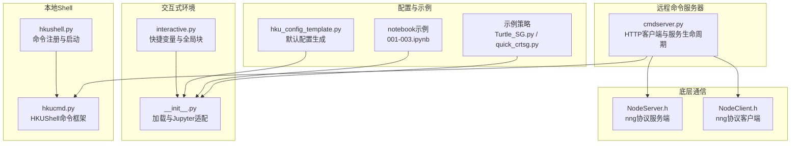
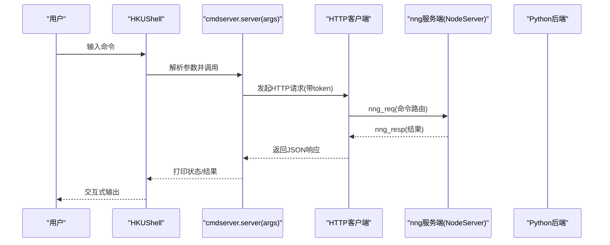
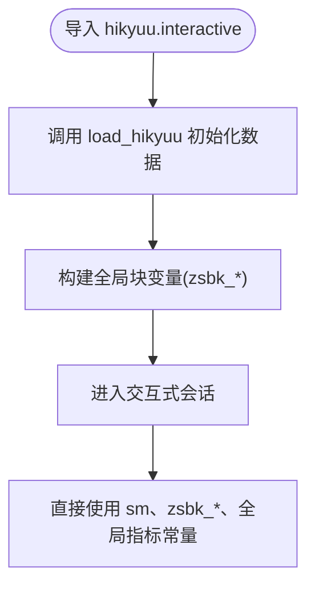
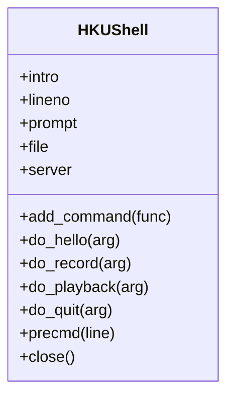
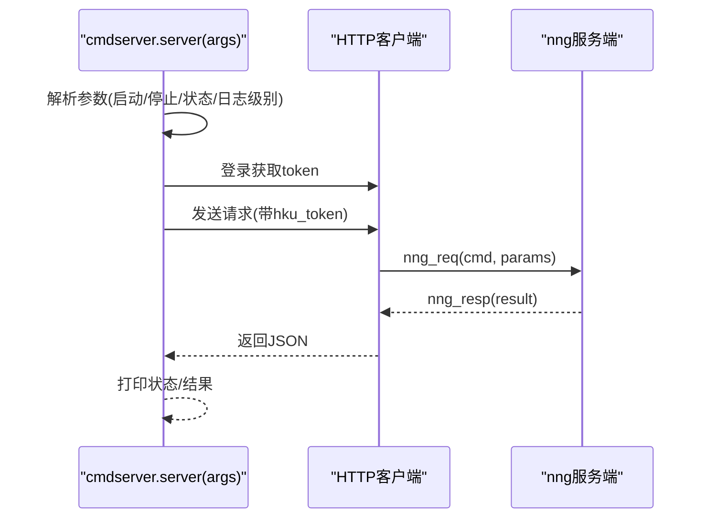
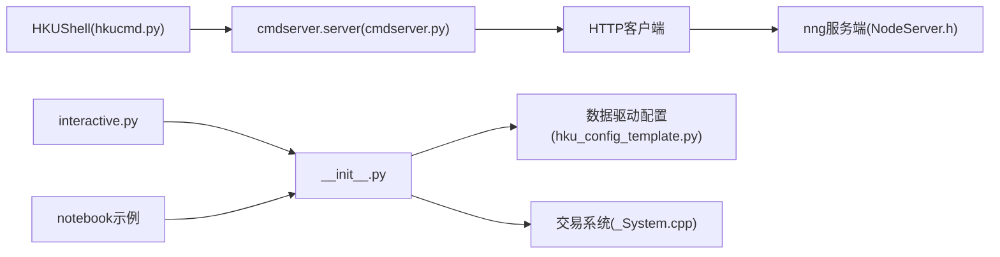

# 交互式Shell

<cite>
**本文引用的文件**
- [interactive.py](file://hikyuu/interactive.py)
- [__init__.py](file://hikyuu/__init__.py)
- [hkucmd.py](file://hikyuu/shell/hkucmd.py)
- [cmdserver.py](file://hikyuu/shell/cmdserver.py)
- [hkushell.py](file://hikyuu/shell/hkushell.py)
- [hku_config_template.py](file://hikyuu/data/hku_config_template.py)
- [001-overview.ipynb](file://hikyuu/examples/notebook/001-overview.ipynb)
- [002-HowToGetStock.ipynb](file://hikyuu/examples/notebook/002-HowToGetStock.ipynb)
- [003-HowToGetKDataAndDraw.ipynb](file://hikyuu/examples/notebook/003-HowToGetKDataAndDraw.ipynb)
- [Turtle_SG.py](file://hikyuu/examples/Turtle_SG.py)
- [quick_crtsg.py](file://hikyuu/examples/quick_crtsg.py)
- [NodeServer.h](file://hikyuu_cpp/hikyuu/utilities/node/NodeServer.h)
- [NodeClient.h](file://hikyuu_cpp/hikyuu/utilities/node/NodeClient.h)
- [_System.cpp](file://hikyuu_pywrap/trade_sys/_System.cpp)
</cite>

## 目录
1. [引言](#引言)
2. [项目结构](#项目结构)
3. [核心组件](#核心组件)
4. [架构总览](#架构总览)
5. [详细组件分析](#详细组件分析)
6. [依赖关系分析](#依赖关系分析)
7. [性能考量](#性能考量)
8. [故障排查指南](#故障排查指南)
9. [结论](#结论)
10. [附录](#附录)

## 引言
本文件围绕 Hikyuu 的交互式编程环境与命令服务器展开，系统性阐述以下内容：
- 交互式编程接口：如何在 Python REPL 或 Jupyter 中直接调用框架 API 快速原型开发；
- 命令服务器：基于 Socket 的通信协议、命令路由机制与安全控制；
- 实际应用示例：从外部程序触发回测任务、实时获取策略状态、批量处理数据；
- 与数据管理、交易系统、可视化模块的集成方式及自动化研究工作流的最佳实践。

## 项目结构
与交互式 Shell 相关的关键模块分布如下：
- 交互式入口与快捷变量：hikyuu/interactive.py、hikyuu/__init__.py
- 本地 Shell 与命令注册：hikyuu/shell/hkucmd.py、hikyuu/shell/hkushell.py
- 远程命令服务器：hikyuu/shell/cmdserver.py
- 配置模板：hikyuu/data/hku_config_template.py
- Jupyter 示例：hikyuu/examples/notebook/*.ipynb
- C++ 通信协议参考：hikyuu_cpp/hikyuu/utilities/node/NodeServer.h、NodeClient.h
- 回测系统封装：hikyuu_pywrap/trade_sys/_System.cpp
- 示例策略：hikyuu/examples/Turtle_SG.py、hikyuu/examples/quick_crtsg.py

图表来源
- [interactive.py](file://hikyuu/interactive.py#L1-L69)
- [__init__.py](file://hikyuu/__init__.py#L1-L120)
- [hkucmd.py](file://hikyuu/shell/hkucmd.py#L1-L111)
- [hkushell.py](file://hikyuu/shell/hkushell.py#L1-L20)
- [cmdserver.py](file://hikyuu/shell/cmdserver.py#L1-L127)
- [hku_config_template.py](file://hikyuu/data/hku_config_template.py#L1-L120)
- [NodeServer.h](file://hikyuu_cpp/hikyuu/utilities/node/NodeServer.h#L1-L88)
- [NodeClient.h](file://hikyuu_cpp/hikyuu/utilities/node/NodeClient.h#L53-L139)
- [001-overview.ipynb](file://hikyuu/examples/notebook/001-overview.ipynb#L1-L120)
- [002-HowToGetStock.ipynb](file://hikyuu/examples/notebook/002-HowToGetStock.ipynb#L1-L120)
- [003-HowToGetKDataAndDraw.ipynb](file://hikyuu/examples/notebook/003-HowToGetKDataAndDraw.ipynb#L1-L120)

章节来源
- [interactive.py](file://hikyuu/interactive.py#L1-L69)
- [__init__.py](file://hikyuu/__init__.py#L1-L120)
- [hkucmd.py](file://hikyuu/shell/hkucmd.py#L1-L111)
- [hkushell.py](file://hikyuu/shell/hkushell.py#L1-L20)
- [cmdserver.py](file://hikyuu/shell/cmdserver.py#L1-L127)
- [hku_config_template.py](file://hikyuu/data/hku_config_template.py#L1-L120)

## 核心组件
- 交互式编程接口
  - 通过 hikyuu/interactive.py 导入后，自动完成数据加载与全局块变量预设，便于在 REPL/Jupyter 中直接使用。
  - hikyuu/__init__.py 提供 load_hikyuu、全局上下文设置、Jupyter 重定向等能力，支撑交互式体验。
- 本地 Shell
  - hkucmd.py 定义 HKUShell 命令框架，支持命令装饰器、命令注册、记录/回放、提示符等。
  - hkushell.py 将 server 命令注册到 HKUShell，并提供启动交互式 Shell 的入口。
- 远程命令服务器
  - cmdserver.py 提供服务启动/停止/状态查询/日志级别设置等命令；内部通过 HTTP 请求与服务端通信，具备 token 认证与错误捕获。
  - 底层通信协议参考 hikyuu_cpp/hikyuu/utilities/node/NodeServer.h 与 NodeClient.h，采用 nng 协议（req/rep）。

章节来源
- [interactive.py](file://hikyuu/interactive.py#L1-L69)
- [__init__.py](file://hikyuu/__init__.py#L150-L220)
- [hkucmd.py](file://hikyuu/shell/hkucmd.py#L32-L111)
- [hkushell.py](file://hikyuu/shell/hkushell.py#L12-L20)
- [cmdserver.py](file://hikyuu/shell/cmdserver.py#L22-L127)
- [NodeServer.h](file://hikyuu_cpp/hikyuu/utilities/node/NodeServer.h#L58-L88)
- [NodeClient.h](file://hikyuu_cpp/hikyuu/utilities/node/NodeClient.h#L91-L139)

## 架构总览
交互式 Shell 的整体架构由三层组成：
- 交互层：在 REPL/Jupyter 中直接调用框架 API，借助快捷变量与全局上下文提升效率。
- 控制层：本地 HKUShell 提供命令入口，远程 cmdserver.py 通过 HTTP 与服务端交互。
- 传输层：服务端采用 nng 协议（NodeServer.h），客户端（NodeClient.h）负责请求发送与响应接收。

图表来源
- [hkucmd.py](file://hikyuu/shell/hkucmd.py#L32-L111)
- [cmdserver.py](file://hikyuu/shell/cmdserver.py#L22-L127)
- [NodeServer.h](file://hikyuu_cpp/hikyuu/utilities/node/NodeServer.h#L128-L170)
- [NodeClient.h](file://hikyuu_cpp/hikyuu/utilities/node/NodeClient.h#L91-L139)

## 详细组件分析

### 交互式编程接口（interactive.py 与 __init__.py）
- 作用
  - 在导入 hikyuu.interactive 后，自动完成数据加载与全局块变量（如 zsbk_a、zsbk_sh、zsbk_sz、zsbk_cyb、zsbk_zxb、zsbk_sh50、zsbk_sh180、zsbk_hs300、zsbk_zz100）的构建，便于在 REPL/Jupyter 中快速筛选与分析。
  - hikyuu/__init__.py 提供 load_hikyuu、set_global_context、select/realtime_update 等便捷函数，支持 Jupyter 环境下的输出重定向与全局上下文设置。
- 使用建议
  - 在 Jupyter 中先导入 hikyuu.interactive，再进行数据查询、策略编写与可视化。
  - 使用 set_global_context 快速建立指标上下文，配合 plot 等可视化接口进行研究。

图表来源
- [interactive.py](file://hikyuu/interactive.py#L27-L69)
- [__init__.py](file://hikyuu/__init__.py#L219-L422)

章节来源
- [interactive.py](file://hikyuu/interactive.py#L27-L69)
- [__init__.py](file://hikyuu/__init__.py#L150-L220)
- [001-overview.ipynb](file://hikyuu/examples/notebook/001-overview.ipynb#L1-L120)
- [002-HowToGetStock.ipynb](file://hikyuu/examples/notebook/002-HowToGetStock.ipynb#L1-L120)
- [003-HowToGetKDataAndDraw.ipynb](file://hikyuu/examples/notebook/003-HowToGetKDataAndDraw.ipynb#L1-L120)

### 本地 Shell 与命令注册（hkucmd.py、hkushell.py）
- HKUShell
  - 提供命令装饰器 shell_cmd 与 add_command 动态注册命令，支持命令计数、提示符更新、记录/回放、退出等基础能力。
- 命令注册
  - hkushell.py 将 server 命令注册到 HKUShell，使用户可在本地 Shell 中直接调用服务端命令（如启动/停止/状态查询/日志级别设置）。

图表来源
- [hkucmd.py](file://hikyuu/shell/hkucmd.py#L32-L111)
- [hkushell.py](file://hikyuu/shell/hkushell.py#L12-L20)

章节来源
- [hkucmd.py](file://hikyuu/shell/hkucmd.py#L32-L111)
- [hkushell.py](file://hikyuu/shell/hkushell.py#L12-L20)

### 远程命令服务器（cmdserver.py）
- 功能
  - 服务生命周期管理：启动/停止/状态查询/日志级别设置。
  - 认证与通信：通过 HTTP 接口与服务端交互，内置 token 获取与请求头注入。
  - 错误处理：使用 hku_catch 装饰器捕获异常，避免中断。
- 通信协议
  - 服务端采用 nng 协议（req/rep），客户端通过 NodeClient.h 发送请求与接收响应；cmdserver.py 作为 HTTP 客户端桥接 Python 侧命令与 nng 服务端。

图表来源
- [cmdserver.py](file://hikyuu/shell/cmdserver.py#L22-L127)
- [NodeServer.h](file://hikyuu_cpp/hikyuu/utilities/node/NodeServer.h#L128-L170)
- [NodeClient.h](file://hikyuu_cpp/hikyuu/utilities/node/NodeClient.h#L91-L139)

章节来源
- [cmdserver.py](file://hikyuu/shell/cmdserver.py#L22-L127)
- [NodeServer.h](file://hikyuu_cpp/hikyuu/utilities/node/NodeServer.h#L58-L88)
- [NodeClient.h](file://hikyuu_cpp/hikyuu/utilities/node/NodeClient.h#L53-L94)

### 与数据管理、交易系统、可视化模块的集成
- 数据管理
  - 通过 hku_config_template.py 生成默认配置，支持多种数据源（HDF5、MySQL、ClickHouse），并在 __init__.py 中加载与预热。
- 交易系统
  - 回测系统封装于 hikyuu_pywrap/trade_sys/_System.cpp，提供 run 方法与 last_suggestion 等接口，便于在 Jupyter 中进行策略回测与报告输出。
- 可视化
  - Jupyter 示例 notebook 展示了如何绘制 K 线、指标曲线与收益曲线，结合交互式接口快速验证策略效果。

章节来源
- [hku_config_template.py](file://hikyuu/data/hku_config_template.py#L1-L120)
- [__init__.py](file://hikyuu/__init__.py#L219-L422)
- [_System.cpp](file://hikyuu_pywrap/trade_sys/_System.cpp#L171-L201)
- [001-overview.ipynb](file://hikyuu/examples/notebook/001-overview.ipynb#L1-L200)
- [003-HowToGetKDataAndDraw.ipynb](file://hikyuu/examples/notebook/003-HowToGetKDataAndDraw.ipynb#L1-L200)

### 实际应用示例
- 在 Jupyter 中快速原型开发
  - 导入 hikyuu.interactive 后，直接使用 sm、zsbk_*、全局指标常量进行数据查询与可视化。
  - 示例 notebook 展示了创建交易系统、绘制信号与收益曲线、输出回测统计报告的完整流程。
- 从外部程序触发回测任务
  - 通过 cmdserver.py 的 server 命令与服务端通信，间接触发回测任务（服务端需提供相应命令路由与处理逻辑）。
- 实时获取策略状态
  - 通过 NodeClient.h 的 post 接口向服务端发送请求，获取策略状态或中间结果。
- 批量处理数据
  - 使用 select/select2 等函数对大量股票进行批量筛选与指标提取，结合可视化模块输出分析结果。

章节来源
- [001-overview.ipynb](file://hikyuu/examples/notebook/001-overview.ipynb#L1-L200)
- [002-HowToGetStock.ipynb](file://hikyuu/examples/notebook/002-HowToGetStock.ipynb#L1-L200)
- [003-HowToGetKDataAndDraw.ipynb](file://hikyuu/examples/notebook/003-HowToGetKDataAndDraw.ipynb#L1-L200)
- [Turtle_SG.py](file://hikyuu/examples/Turtle_SG.py#L1-L48)
- [quick_crtsg.py](file://hikyuu/examples/quick_crtsg.py#L1-L41)
- [NodeClient.h](file://hikyuu_cpp/hikyuu/utilities/node/NodeClient.h#L91-L139)

## 依赖关系分析
- 组件耦合
  - HKUShell 与 cmdserver.server 存在强耦合：前者负责命令解析与展示，后者负责服务生命周期与 HTTP 通信。
  - 交互式接口与数据管理、交易系统、可视化模块松耦合：通过统一的数据访问与可视化接口进行协作。
- 外部依赖
  - nng 协议栈（NodeServer.h/NodeClient.h）提供高性能、低延迟的进程间通信。
  - requests/json 用于 cmdserver.py 的 HTTP 通信。
- 潜在循环依赖
  - 当前结构未见明显循环依赖；若后续扩展命令路由，需避免 cmdserver 与服务端实现之间的双向依赖。

图表来源
- [hkucmd.py](file://hikyuu/shell/hkucmd.py#L32-L111)
- [cmdserver.py](file://hikyuu/shell/cmdserver.py#L22-L127)
- [NodeServer.h](file://hikyuu_cpp/hikyuu/utilities/node/NodeServer.h#L58-L88)
- [interactive.py](file://hikyuu/interactive.py#L27-L69)
- [__init__.py](file://hikyuu/__init__.py#L219-L422)
- [_System.cpp](file://hikyuu_pywrap/trade_sys/_System.cpp#L171-L201)
- [hku_config_template.py](file://hikyuu/data/hku_config_template.py#L1-L120)

章节来源
- [hkucmd.py](file://hikyuu/shell/hkucmd.py#L32-L111)
- [cmdserver.py](file://hikyuu/shell/cmdserver.py#L22-L127)
- [NodeServer.h](file://hikyuu_cpp/hikyuu/utilities/node/NodeServer.h#L58-L88)
- [interactive.py](file://hikyuu/interactive.py#L27-L69)
- [__init__.py](file://hikyuu/__init__.py#L219-L422)
- [_System.cpp](file://hikyuu_pywrap/trade_sys/_System.cpp#L171-L201)
- [hku_config_template.py](file://hikyuu/data/hku_config_template.py#L1-L120)

## 性能考量
- 交互式加载
  - 通过 __init__.py 的 load_hikyuu 支持按需加载与预热，减少首次查询延迟；Jupyter 环境下自动重定向输出，避免阻塞。
- 通信协议
  - nng 协议具有低开销与高吞吐特性，适合高频命令与状态查询；NodeClient.h 的超时与重连参数可调优网络稳定性。
- 可视化与批处理
  - notebook 示例展示了高效的可视化与批处理流程，建议在大规模数据筛选时使用 select2 输出 DataFrame，便于进一步分析。

[本节为通用指导，无需特定文件引用]

## 故障排查指南
- 服务端未启动
  - 使用 cmdserver.server('status') 检查服务状态；必要时通过 'start' 启动，或 'stop' 停止后重启。
- 认证失败
  - 确认 token 是否存在；若为空则自动登录获取；检查网络连通性与服务端地址。
- 命令路由错误
  - NodeServer.h 对未知命令抛出异常，需确认 cmdserver.py 发送的 cmd 是否与服务端路由一致。
- 数据加载异常
  - 检查 hku_config_template.py 生成的配置文件路径与权限；确认数据源可用（HDF5/MySQL/ClickHouse）。

章节来源
- [cmdserver.py](file://hikyuu/shell/cmdserver.py#L22-L127)
- [NodeServer.h](file://hikyuu_cpp/hikyuu/utilities/node/NodeServer.h#L128-L170)
- [hku_config_template.py](file://hikyuu/data/hku_config_template.py#L303-L339)

## 结论
交互式 Shell 将数据加载、命令控制与可视化无缝整合，既满足 REPL/Jupyter 的快速原型需求，又通过远程命令服务器与 nng 协议实现高效稳定的远端控制。结合示例策略与 notebook，可形成从数据探索、策略开发到回测可视化的完整自动化研究工作流。

[本节为总结，无需特定文件引用]

## 附录
- 自动化研究工作流最佳实践
  - 使用 hikyuu.interactive 快速构建全局上下文与筛选条件；
  - 在 Jupyter 中完成策略设计与可视化验证；
  - 通过 cmdserver.server 触发回测任务，利用 NodeClient.h 获取实时状态；
  - 将批处理与可视化输出标准化，便于持续集成与回归测试。

[本节为通用指导，无需特定文件引用]