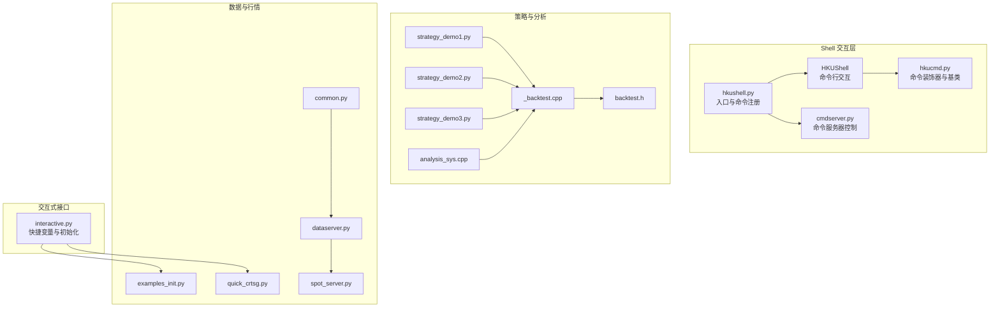
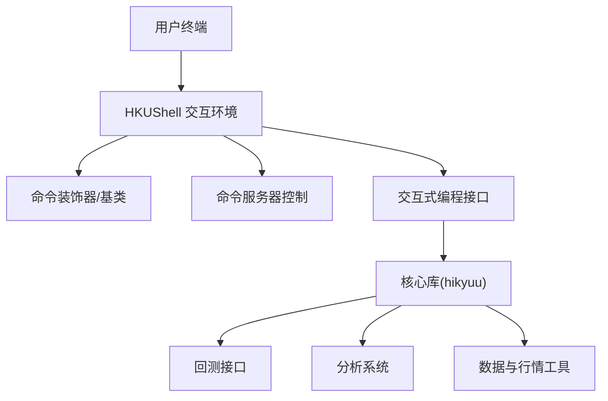
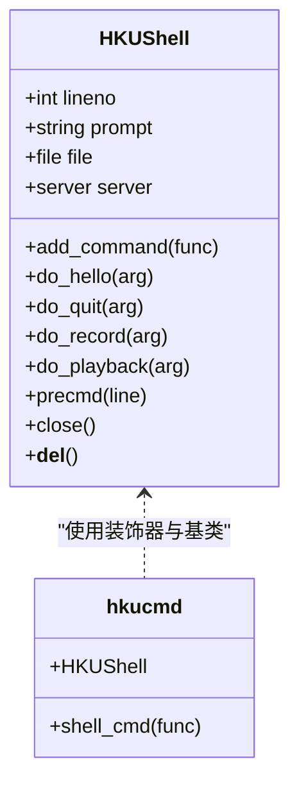
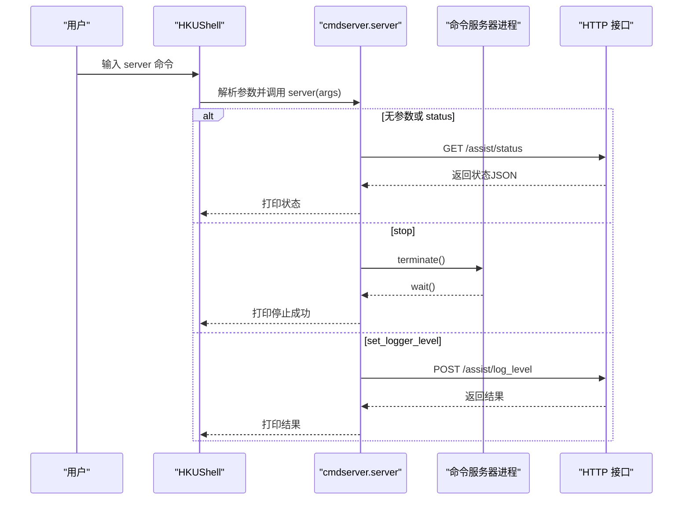
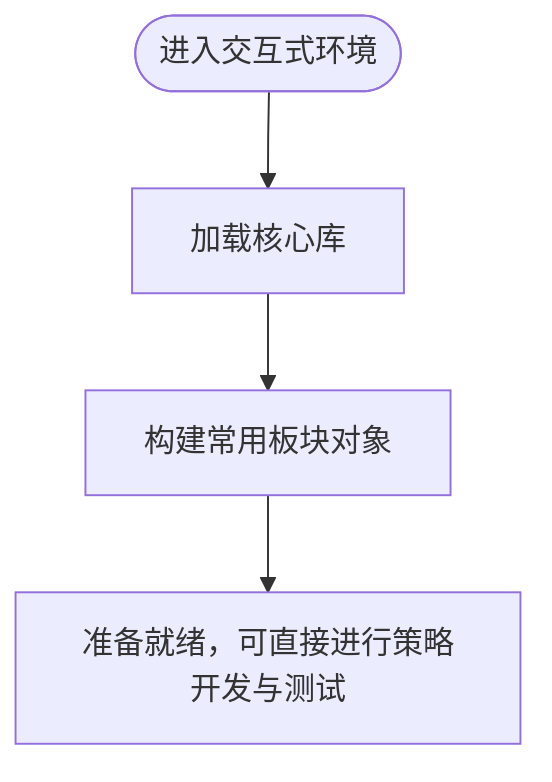
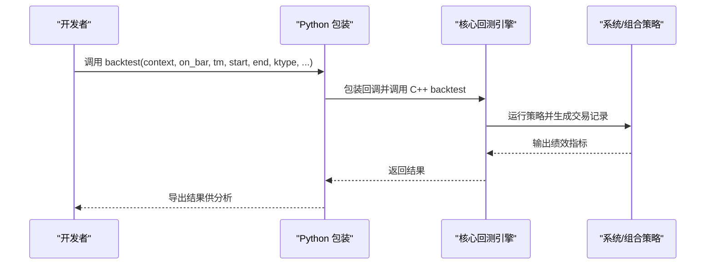
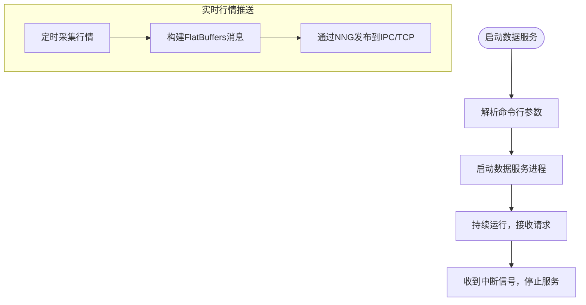
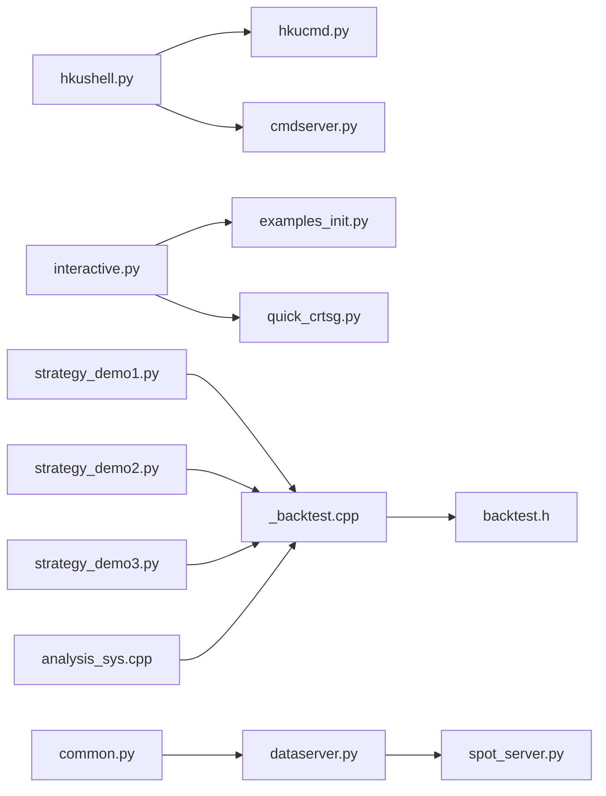

# 命令行工具

<cite>
**本文引用的文件**
- [hkushell.py](file://hikyuu/shell/hkushell.py)
- [hkucmd.py](file://hikyuu/shell/hkucmd.py)
- [cmdserver.py](file://hikyuu/shell/cmdserver.py)
- [interactive.py](file://hikyuu/interactive.py)
- [examples_init.py](file://hikyuu/examples/examples_init.py)
- [quick_crtsg.py](file://hikyuu/examples/quick_crtsg.py)
- [strategy_demo1.py](file://hikyuu/strategy/strategy_demo1.py)
- [strategy_demo2.py](file://hikyuu/strategy/strategy_demo2.py)
- [strategy_demo3.py](file://hikyuu/strategy/strategy_demo3.py)
- [_backtest.cpp](file://hikyuu_pywrap/plugin/_backtest.cpp)
- [backtest.h](file://hikyuu_cpp/hikyuu/plugin/backtest.h)
- [analysis_sys.cpp](file://hikyuu_cpp/hikyuu/analysis/analysis_sys.cpp)
- [common.py](file://hikyuu/data/common.py)
- [dataserver.py](file://hikyuu/gui/dataserver.py)
- [spot_server.py](file://hikyuu/gui/spot_server.py)
- [NodeServer.h](file://hikyuu_cpp/hikyuu/utilities/node/NodeServer.h)
</cite>

## 目录
1. [简介](#简介)
2. [项目结构](#项目结构)
3. [核心组件](#核心组件)
4. [架构总览](#架构总览)
5. [详细组件分析](#详细组件分析)
6. [依赖关系分析](#依赖关系分析)
7. [性能考量](#性能考量)
8. [故障排查指南](#故障排查指南)
9. [结论](#结论)
10. [附录](#附录)

## 简介
本文件围绕 Hikyuu 项目中的命令行工具与交互式 Shell，系统性阐述以下能力：
- 基于文本的交互环境：hkushell 提供命令行交互界面，支持脚本录制与回放、远程控制命令服务器、自动化任务编排。
- 命令服务器：cmdserver 实现命令服务器功能，允许本地/远程启动、停止、查询服务器状态，并设置日志级别。
- 交互式编程接口：interactive 提供 Python 环境下的快捷 API，便于快速原型开发与策略测试。
- 工具与核心库集成：通过命令注册机制与 Python 包封装，将底层 C++ 核心能力暴露给命令行与交互式环境。
- 自动化工作流：结合策略回测、批量数据处理与实时行情推送，形成从数据准备到策略验证的闭环。

## 项目结构
命令行与交互式相关的核心文件位于 hikyuu/shell 与 hikyuu/interactive.py，并与策略、分析、数据模块协同工作。

图表来源
- [hkushell.py](file://hikyuu/shell/hkushell.py#L1-L20)
- [hkucmd.py](file://hikyuu/shell/hkucmd.py#L1-L111)
- [cmdserver.py](file://hikyuu/shell/cmdserver.py#L1-L127)
- [interactive.py](file://hikyuu/interactive.py#L1-L69)
- [examples_init.py](file://hikyuu/examples/examples_init.py#L1-L33)
- [quick_crtsg.py](file://hikyuu/examples/quick_crtsg.py#L1-L41)
- [strategy_demo1.py](file://hikyuu/strategy/strategy_demo1.py#L1-L54)
- [strategy_demo2.py](file://hikyuu/strategy/strategy_demo2.py#L1-L48)
- [strategy_demo3.py](file://hikyuu/strategy/strategy_demo3.py#L1-L25)
- [_backtest.cpp](file://hikyuu_pywrap/plugin/_backtest.cpp#L1-L75)
- [backtest.h](file://hikyuu_cpp/hikyuu/plugin/backtest.h#L1-L40)
- [analysis_sys.cpp](file://hikyuu_cpp/hikyuu/analysis/analysis_sys.cpp#L50-L86)
- [common.py](file://hikyuu/data/common.py#L1-L200)
- [dataserver.py](file://hikyuu/gui/dataserver.py#L1-L36)
- [spot_server.py](file://hikyuu/gui/spot_server.py#L1-L327)

章节来源
- [hkushell.py](file://hikyuu/shell/hkushell.py#L1-L20)
- [hkucmd.py](file://hikyuu/shell/hkucmd.py#L1-L111)
- [cmdserver.py](file://hikyuu/shell/cmdserver.py#L1-L127)
- [interactive.py](file://hikyuu/interactive.py#L1-L69)

## 核心组件
- HKUShell：基于 cmd.Cmd 的命令行交互框架，支持命令装饰器、提示符计数、脚本录制与回放。
- hkucmd：提供 shell_cmd 装饰器与 HKUShell 基类，统一命令执行流程与错误处理。
- cmdserver：封装命令服务器的启动、停止、状态查询与日志级别设置，通过 HTTP 接口与本地/远程服务通信。
- interactive：在 Python 环境中加载核心库并预置常用变量，便于快速原型开发与策略测试。
- 策略与分析：通过 Python 包装导出的 backtest 接口与分析系统，支撑回测执行与结果统计。
- 数据与行情：提供数据采集与实时行情推送工具，配合命令行完成批量数据处理与实时监控。

章节来源
- [hkucmd.py](file://hikyuu/shell/hkucmd.py#L1-L111)
- [cmdserver.py](file://hikyuu/shell/cmdserver.py#L1-L127)
- [interactive.py](file://hikyuu/interactive.py#L1-L69)
- [_backtest.cpp](file://hikyuu_pywrap/plugin/_backtest.cpp#L1-L75)
- [backtest.h](file://hikyuu_cpp/hikyuu/plugin/backtest.h#L1-L40)
- [analysis_sys.cpp](file://hikyuu_cpp/hikyuu/analysis/analysis_sys.cpp#L50-L86)

## 架构总览
命令行工具与交互式 Shell 通过 HKUShell 将命令注册到交互环境，cmdserver 提供远程控制能力，interactive 加载核心库并提供便捷变量。策略与分析模块通过 Python 包装导出接口，数据与行情模块提供数据采集与实时推送能力。

图表来源
- [hkushell.py](file://hikyuu/shell/hkushell.py#L1-L20)
- [hkucmd.py](file://hikyuu/shell/hkucmd.py#L1-L111)
- [cmdserver.py](file://hikyuu/shell/cmdserver.py#L1-L127)
- [interactive.py](file://hikyuu/interactive.py#L1-L69)
- [_backtest.cpp](file://hikyuu_pywrap/plugin/_backtest.cpp#L1-L75)
- [analysis_sys.cpp](file://hikyuu_cpp/hikyuu/analysis/analysis_sys.cpp#L50-L86)
- [common.py](file://hikyuu/data/common.py#L1-L200)
- [dataserver.py](file://hikyuu/gui/dataserver.py#L1-L36)
- [spot_server.py](file://hikyuu/gui/spot_server.py#L1-L327)

## 详细组件分析

### HKUShell 与命令装饰器
- 功能要点
  - shell_cmd 装饰器：统一命令执行前后逻辑，维护提示符计数与输出格式。
  - add_command：动态注册命令函数，自动命名并包装，支持错误捕获与输出。
  - 内置命令：hello、quit、record、playback、precmd 等，支持脚本录制与回放。
  - 生命周期：析构时自动停止已启动的命令服务器进程。
- 设计模式
  - 装饰器模式：通过 shell_cmd 统一处理命令执行流程。
  - 命令注册：通过 add_command 将外部函数注入 HKUShell 类，实现插件化扩展。
- 错误处理
  - try-except 捕获命令执行异常并打印，避免交互中断。

图表来源
- [hkucmd.py](file://hikyuu/shell/hkucmd.py#L1-L111)

章节来源
- [hkucmd.py](file://hikyuu/shell/hkucmd.py#L1-L111)

### 命令服务器控制（cmdserver）
- 功能要点
  - 登录与令牌：通过登录接口获取令牌，后续请求携带 hku_token。
  - 服务器生命周期：启动、停止、状态查询、日志级别设置。
  - 平台兼容：根据操作系统选择可执行文件路径，优先当前目录，其次构建产物，最后尝试包内路径。
- 控制流
  - start_server：检测已有进程，定位可执行文件并启动子进程。
  - stop_server：终止子进程并等待退出。
  - server_status：向 assist/status 发送 GET 请求，打印 JSON 状态。
  - set_server_logger_level：向 assist/log_level 发送 POST 请求，设置日志级别。
- 安全与健壮性
  - 使用 @hku_catch 装饰器捕获异常，避免崩溃。
  - 令牌懒加载，首次使用时自动登录获取。

图表来源
- [cmdserver.py](file://hikyuu/shell/cmdserver.py#L1-L127)

章节来源
- [cmdserver.py](file://hikyuu/shell/cmdserver.py#L1-L127)

### 交互式编程接口（interactive）
- 功能要点
  - 加载核心库：调用 load_hikyuu 初始化运行环境。
  - 快捷变量：预置 A 股、创业板、科创板、中小板等板块对象，便于快速筛选与测试。
  - 与示例联动：examples_init 提供配置初始化，quick_crtsg 展示信号生成与回测流程。
- 应用场景
  - 快速原型：在 IPython/Jupyter 中直接使用，无需重复初始化。
  - 策略测试：快速构造信号、系统与组合策略，进行回测与分析。

图表来源
- [interactive.py](file://hikyuu/interactive.py#L1-L69)
- [examples_init.py](file://hikyuu/examples/examples_init.py#L1-L33)
- [quick_crtsg.py](file://hikyuu/examples/quick_crtsg.py#L1-L41)

章节来源
- [interactive.py](file://hikyuu/interactive.py#L1-L69)
- [examples_init.py](file://hikyuu/examples/examples_init.py#L1-L33)
- [quick_crtsg.py](file://hikyuu/examples/quick_crtsg.py#L1-L41)

### 策略回测与分析
- 回测接口
  - Python 包装导出 backtest 函数，支持事件驱动回测，可传入策略上下文、交易管理器、时间范围与模式等参数。
  - 支持键盘中断处理，确保回测过程可控。
- 分析系统
  - analysisSystemList 并行运行系统列表，统计绩效指标，适合批量策略对比与筛选。
- 策略示例
  - strategy_demo1/2/3 展示不同调度方式与交易接口集成，便于理解回测与实盘衔接。

图表来源
- [_backtest.cpp](file://hikyuu_pywrap/plugin/_backtest.cpp#L1-L75)
- [backtest.h](file://hikyuu_cpp/hikyuu/plugin/backtest.h#L1-L40)
- [analysis_sys.cpp](file://hikyuu_cpp/hikyuu/analysis/analysis_sys.cpp#L50-L86)
- [strategy_demo1.py](file://hikyuu/strategy/strategy_demo1.py#L1-L54)
- [strategy_demo2.py](file://hikyuu/strategy/strategy_demo2.py#L1-L48)
- [strategy_demo3.py](file://hikyuu/strategy/strategy_demo3.py#L1-L25)

章节来源
- [_backtest.cpp](file://hikyuu_pywrap/plugin/_backtest.cpp#L1-L75)
- [backtest.h](file://hikyuu_cpp/hikyuu/plugin/backtest.h#L1-L40)
- [analysis_sys.cpp](file://hikyuu_cpp/hikyuu/analysis/analysis_sys.cpp#L50-L86)
- [strategy_demo1.py](file://hikyuu/strategy/strategy_demo1.py#L1-L54)
- [strategy_demo2.py](file://hikyuu/strategy/strategy_demo2.py#L1-L48)
- [strategy_demo3.py](file://hikyuu/strategy/strategy_demo3.py#L1-L25)

### 数据采集与实时行情
- 数据服务
  - dataserver：通过 Click 命令行参数启动数据服务，支持外部访问地址、线程数、保存与缓冲选项。
- 实时行情推送
  - spot_server：基于 NNG 的 IPC/TCP 推送，支持定时采集、周期限制与错误处理，提供启动/结束标记消息。
- 批量数据处理
  - common 提供股票、指数、基金等代码与名称列表获取，支持超时与异常捕获，便于批量数据处理与清洗。

图表来源
- [dataserver.py](file://hikyuu/gui/dataserver.py#L1-L36)
- [spot_server.py](file://hikyuu/gui/spot_server.py#L1-L327)
- [common.py](file://hikyuu/data/common.py#L1-L200)

章节来源
- [dataserver.py](file://hikyuu/gui/dataserver.py#L1-L36)
- [spot_server.py](file://hikyuu/gui/spot_server.py#L1-L327)
- [common.py](file://hikyuu/data/common.py#L1-L200)

## 依赖关系分析
- 组件耦合
  - hkushell 依赖 hkucmd 与 cmdserver，通过 add_command 注册 server 命令。
  - cmdserver 依赖 HKUShell 的 server 字段与 hku_catch 装饰器，间接耦合到 HKUShell 生命周期。
  - interactive 依赖核心库与示例初始化脚本，提供便捷变量。
  - 策略与分析模块通过 Python 包装导出接口，与命令行/交互式环境解耦。
- 外部依赖
  - HTTP 客户端 requests 用于与命令服务器通信。
  - NNG/pynng 用于实时行情推送。
  - Click 用于命令行参数解析。
- 循环依赖
  - 未发现直接循环依赖；cmdserver 与 HKUShell 通过弱耦合（子进程与 HTTP）连接。

图表来源
- [hkushell.py](file://hikyuu/shell/hkushell.py#L1-L20)
- [hkucmd.py](file://hikyuu/shell/hkucmd.py#L1-L111)
- [cmdserver.py](file://hikyuu/shell/cmdserver.py#L1-L127)
- [interactive.py](file://hikyuu/interactive.py#L1-L69)
- [examples_init.py](file://hikyuu/examples/examples_init.py#L1-L33)
- [quick_crtsg.py](file://hikyuu/examples/quick_crtsg.py#L1-L41)
- [strategy_demo1.py](file://hikyuu/strategy/strategy_demo1.py#L1-L54)
- [strategy_demo2.py](file://hikyuu/strategy/strategy_demo2.py#L1-L48)
- [strategy_demo3.py](file://hikyuu/strategy/strategy_demo3.py#L1-L25)
- [_backtest.cpp](file://hikyuu_pywrap/plugin/_backtest.cpp#L1-L75)
- [backtest.h](file://hikyuu_cpp/hikyuu/plugin/backtest.h#L1-L40)
- [analysis_sys.cpp](file://hikyuu_cpp/hikyuu/analysis/analysis_sys.cpp#L50-L86)
- [dataserver.py](file://hikyuu/gui/dataserver.py#L1-L36)
- [spot_server.py](file://hikyuu/gui/spot_server.py#L1-L327)
- [common.py](file://hikyuu/data/common.py#L1-L200)

章节来源
- [hkushell.py](file://hikyuu/shell/hkushell.py#L1-L20)
- [hkucmd.py](file://hikyuu/shell/hkucmd.py#L1-L111)
- [cmdserver.py](file://hikyuu/shell/cmdserver.py#L1-L127)
- [interactive.py](file://hikyuu/interactive.py#L1-L69)
- [examples_init.py](file://hikyuu/examples/examples_init.py#L1-L33)
- [quick_crtsg.py](file://hikyuu/examples/quick_crtsg.py#L1-L41)
- [strategy_demo1.py](file://hikyuu/strategy/strategy_demo1.py#L1-L54)
- [strategy_demo2.py](file://hikyuu/strategy/strategy_demo2.py#L1-L48)
- [strategy_demo3.py](file://hikyuu/strategy/strategy_demo3.py#L1-L25)
- [_backtest.cpp](file://hikyuu_pywrap/plugin/_backtest.cpp#L1-L75)
- [backtest.h](file://hikyuu_cpp/hikyuu/plugin/backtest.h#L1-L40)
- [analysis_sys.cpp](file://hikyuu_cpp/hikyuu/analysis/analysis_sys.cpp#L50-L86)
- [dataserver.py](file://hikyuu/gui/dataserver.py#L1-L36)
- [spot_server.py](file://hikyuu/gui/spot_server.py#L1-L327)
- [common.py](file://hikyuu/data/common.py#L1-L200)

## 性能考量
- 命令服务器启动
  - 优先使用当前目录可执行文件，减少路径查找开销；若不存在再回退到构建产物与包内路径。
- 回测性能
  - analysisSystemList 采用并行计算，提升批量策略对比效率；注意系统资源与内存占用。
- 实时行情
  - NNG 推送具备低延迟特性；合理设置采集周期与线程数，避免网络拥塞。
- 数据采集
  - common 中的超时与异常捕获有助于稳定批量数据处理；对第三方接口调用需考虑限流与重试策略。

## 故障排查指南
- 命令服务器无法启动
  - 检查可执行文件是否存在与权限；确认平台匹配（Windows/Linux/macOS）。
  - 若使用包内路径，确认 hikyuu 包安装位置正确。
- 令牌失效或认证失败
  - 确认登录接口可用；检查网络连通性与代理设置。
- 回测中断
  - 使用键盘中断触发时，确保回调中正确处理中断信号，避免进程异常退出。
- 实时行情异常
  - 检查 NNG 地址绑定与防火墙设置；确认采集周期与时间窗配置合理。
- 数据采集失败
  - 关注超时与异常捕获日志；必要时调整超时阈值与重试策略。

章节来源
- [cmdserver.py](file://hikyuu/shell/cmdserver.py#L1-L127)
- [_backtest.cpp](file://hikyuu_pywrap/plugin/_backtest.cpp#L1-L75)
- [spot_server.py](file://hikyuu/gui/spot_server.py#L1-L327)
- [common.py](file://hikyuu/data/common.py#L1-L200)

## 结论
hkushell、cmdserver 与 interactive 共同构成了 Hikyuu 的命令行与交互式生态：前者提供友好的文本交互与自动化能力，后者实现远程控制与日志管理，前者则在 Python 环境中提供便捷的 API 与变量，三者与策略、分析、数据模块紧密协作，形成从数据准备、策略开发、回测验证到实时监控的完整工作流。通过合理的命令注册与接口封装，用户可在命令行与交互式环境中高效完成批量数据处理、策略回测与结果分析等任务。

## 附录
- 常用命令与用法
  - 启动/停止/查看服务器状态：通过 server 命令调用 cmdserver 的相应功能。
  - 录制与回放脚本：使用 record/playback 命令，将交互命令保存为脚本并回放。
  - 交互式开发：在 interactive 环境中直接使用预置变量与核心 API，快速搭建策略原型。
- 实践建议
  - 在批量数据处理前，先通过 interactive 验证数据获取与清洗逻辑。
  - 使用策略示例作为模板，逐步替换策略主体与参数，降低回测风险。
  - 对实时行情推送进行周期性校验，确保数据完整性与时效性。