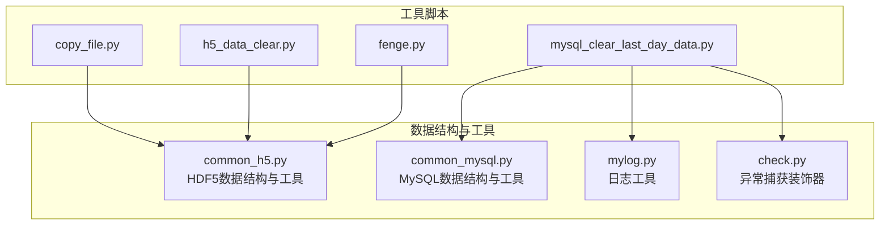
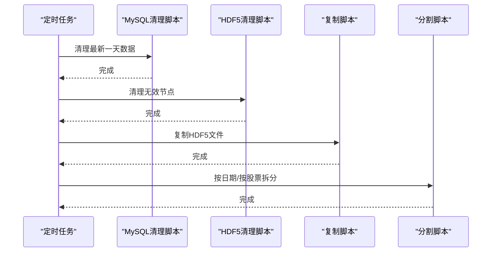
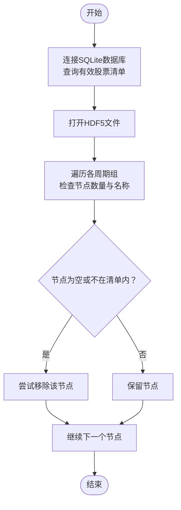
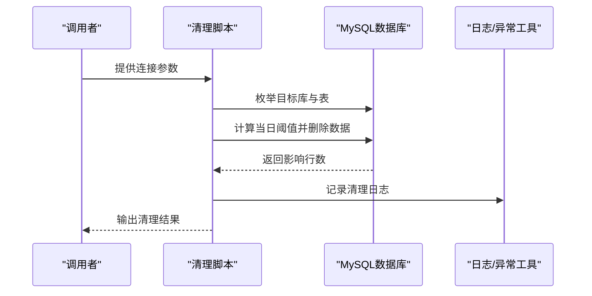
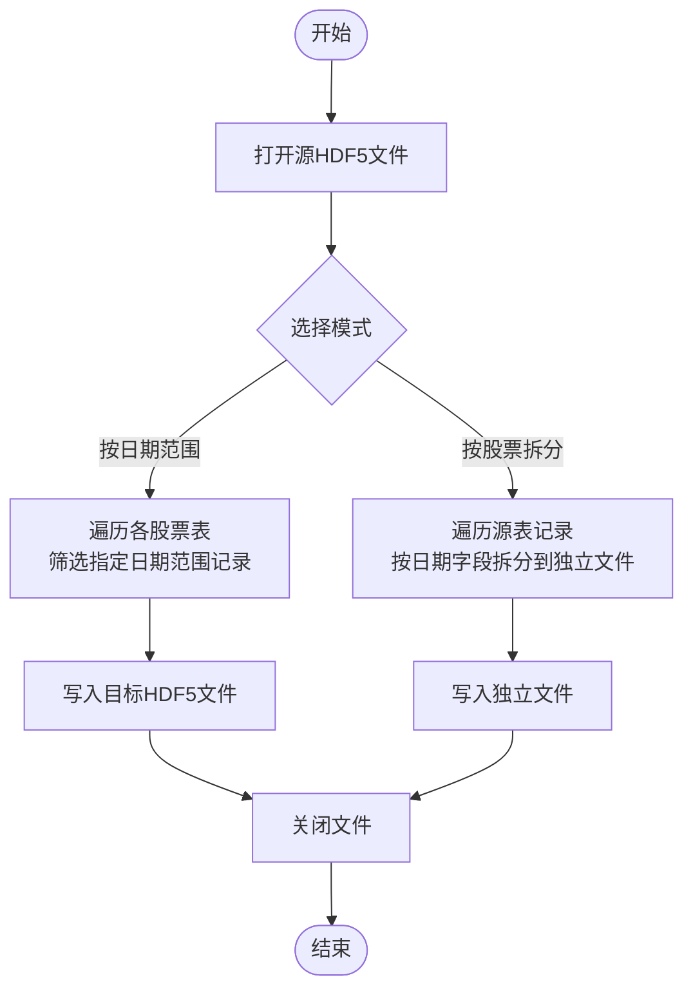
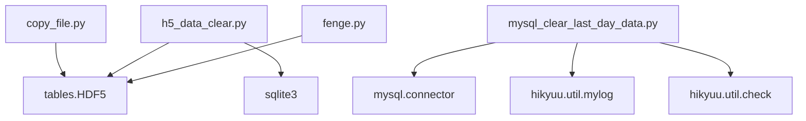

# 实用脚本

<cite>
**本文引用的文件**
- [copy_file.py](file://hikyuu/tools/copy_file.py)
- [h5_data_clear.py](file://hikyuu/tools/h5_data_clear.py)
- [mysql_clear_last_day_data.py](file://hikyuu/tools/mysql_clear_last_day_data.py)
- [fenge.py](file://hikyuu/tools/fenge.py)
- [common_h5.py](file://hikyuu/data/common_h5.py)
- [common_mysql.py](file://hikyuu/data/common_mysql.py)
- [check.py](file://hikyuu/util/check.py)
- [mylog.py](file://hikyuu/util/mylog.py)
</cite>

## 目录
1. [简介](#简介)
2. [项目结构](#项目结构)
3. [核心组件](#核心组件)
4. [架构总览](#架构总览)
5. [详细组件分析](#详细组件分析)
6. [依赖关系分析](#依赖关系分析)
7. [性能与可靠性考量](#性能与可靠性考量)
8. [故障排查指南](#故障排查指南)
9. [结论](#结论)
10. [附录](#附录)

## 简介
本指南围绕仓库中的四类实用脚本展开，系统性介绍其功能、使用方法、命令行参数、典型使用场景与最佳实践，并解释它们在数据一致性维护、数据预处理与日常维护任务中的作用，以及在数据管道与自动化工作流中的定位。这四个脚本分别为：
- copy_file.py：用于HDF5文件的复制与备份，便于安全地保留历史版本或生成新副本。
- h5_data_clear.py：用于清理HDF5历史数据文件中的无效节点（空表或不在有效股票清单内的表），保持数据整洁。
- mysql_clear_last_day_data.py：用于清理MySQL数据库中最新一天的K线数据，避免在交易时段误导入导致的重复或错误数据。
- fenge.py：用于按日期范围或按股票维度对HDF5数据进行分割，便于归档、同步与备份。

## 项目结构
这些脚本位于 hikyuu/tools 目录下，分别承担复制、清理、清理MySQL、分割等职责；同时，与之配套的通用数据结构定义位于 hikyuu/data 下，日志与异常处理工具位于 hikyuu/util 下。

图表来源
- [copy_file.py](file://hikyuu/tools/copy_file.py#L1-L16)
- [h5_data_clear.py](file://hikyuu/tools/h5_data_clear.py#L1-L163)
- [mysql_clear_last_day_data.py](file://hikyuu/tools/mysql_clear_last_day_data.py#L1-L62)
- [fenge.py](file://hikyuu/tools/fenge.py#L1-L140)
- [common_h5.py](file://hikyuu/data/common_h5.py#L1-L120)
- [common_mysql.py](file://hikyuu/data/common_mysql.py#L150-L210)
- [mylog.py](file://hikyuu/util/mylog.py#L98-L161)
- [check.py](file://hikyuu/util/check.py#L97-L161)

章节来源
- [copy_file.py](file://hikyuu/tools/copy_file.py#L1-L16)
- [h5_data_clear.py](file://hikyuu/tools/h5_data_clear.py#L1-L163)
- [mysql_clear_last_day_data.py](file://hikyuu/tools/mysql_clear_last_day_data.py#L1-L62)
- [fenge.py](file://hikyuu/tools/fenge.py#L1-L140)
- [common_h5.py](file://hikyuu/data/common_h5.py#L1-L120)
- [common_mysql.py](file://hikyuu/data/common_mysql.py#L150-L210)
- [mylog.py](file://hikyuu/util/mylog.py#L98-L161)
- [check.py](file://hikyuu/util/check.py#L97-L161)

## 核心组件
- 复制与备份：通过HDF5库提供的复制接口，快速生成新文件副本，支持多市场、多周期（日线、5分钟、1分钟等）。
- 数据清理：扫描HDF5文件中的各周期组，移除空表或不在有效股票清单内的节点，减少冗余与不一致。
- MySQL清理：按数据库命名规范枚举目标库与表，删除当日或当期数据，防止交易时段误导入造成的数据污染。
- 数据分割：按日期范围或按股票维度拆分HDF5数据，便于归档、同步与备份。

章节来源
- [copy_file.py](file://hikyuu/tools/copy_file.py#L1-L16)
- [h5_data_clear.py](file://hikyuu/tools/h5_data_clear.py#L1-L163)
- [mysql_clear_last_day_data.py](file://hikyuu/tools/mysql_clear_last_day_data.py#L1-L62)
- [fenge.py](file://hikyuu/tools/fenge.py#L1-L140)

## 架构总览
这些脚本在数据管道中的位置如下：
- 数据采集与导入后，通常会生成HDF5文件或写入MySQL数据库。
- 在每日收市或定时任务中，先执行MySQL清理，再执行HDF5清理，最后执行复制与分割，确保数据一致性与可追溯性。
- 复制与分割结果可用于归档、备份与跨环境迁移。

图表来源
- [mysql_clear_last_day_data.py](file://hikyuu/tools/mysql_clear_last_day_data.py#L45-L62)
- [h5_data_clear.py](file://hikyuu/tools/h5_data_clear.py#L1-L163)
- [copy_file.py](file://hikyuu/tools/copy_file.py#L1-L16)
- [fenge.py](file://hikyuu/tools/fenge.py#L1-L140)

## 详细组件分析

### 复制与备份：copy_file.py
- 功能概述
  - 使用HDF5库的复制接口，将指定目录下的多个HDF5文件复制为新文件，实现快速备份与版本保留。
  - 支持日线、5分钟、1分钟等周期文件的批量复制。
- 使用方法
  - 修改脚本中的目录路径，指向包含HDF5文件的根目录。
  - 运行脚本即可完成复制。
- 典型场景
  - 每日收盘后生成新副本，作为历史版本保存。
  - 在导入新数据前，先复制现有文件，以便回滚。
- 最佳实践
  - 在执行复制前，确认源文件处于可用状态且无并发写入。
  - 复制完成后检查目标文件完整性与大小是否合理。
  - 将复制脚本纳入自动化任务，设置合适的执行频率与告警策略。

章节来源
- [copy_file.py](file://hikyuu/tools/copy_file.py#L1-L16)

### HDF5数据清理：h5_data_clear.py
- 功能概述
  - 连接SQLite数据库获取有效的股票清单，扫描指定HDF5文件的各周期组（日线、周线、月线、季线、半年线、年线、5分钟等），移除空表或不在有效股票清单内的节点，减少冗余与不一致。
- 使用方法
  - 修改脚本中的目录路径，指向包含HDF5文件的根目录。
  - 运行脚本，按提示查看清理结果。
- 典型场景
  - 数据导入失败或部分股票缺失后，定期清理无效节点。
  - 数据迁移前后，清理冗余节点，保证文件整洁。
- 最佳实践
  - 在清理前先备份原文件，以防误删。
  - 清理后验证剩余节点数量与有效性，确保关键股票数据完整。
  - 将清理脚本纳入自动化任务，建议在非交易时段执行。

图表来源
- [h5_data_clear.py](file://hikyuu/tools/h5_data_clear.py#L1-L163)

章节来源
- [h5_data_clear.py](file://hikyuu/tools/h5_data_clear.py#L1-L163)

### MySQL最新一天数据清理：mysql_clear_last_day_data.py
- 功能概述
  - 根据数据库命名规范枚举目标库与表，删除当日或当期数据，防止在交易时段误导入导致的重复或错误数据。
  - 使用装饰器捕获异常，记录日志并可选择重试或回退。
- 使用方法
  - 修改脚本中的数据库连接参数（主机、端口、用户名、密码）。
  - 运行脚本，按提示查看清理进度与结果。
- 典型场景
  - 交易日盘中误导入数据后，收盘前或次日早间清理最新一天数据。
  - 数据修复或回滚后，清理残留数据，恢复一致性。
- 最佳实践
  - 在清理前确认数据库连接参数正确，避免误删其他库。
  - 清理操作需谨慎，建议先在测试库验证逻辑。
  - 结合日志工具输出清理详情，便于审计与追踪。

图表来源
- [mysql_clear_last_day_data.py](file://hikyuu/tools/mysql_clear_last_day_data.py#L1-L62)
- [common_mysql.py](file://hikyuu/data/common_mysql.py#L150-L210)
- [mylog.py](file://hikyuu/util/mylog.py#L98-L161)
- [check.py](file://hikyuu/util/check.py#L97-L161)

章节来源
- [mysql_clear_last_day_data.py](file://hikyuu/tools/mysql_clear_last_day_data.py#L1-L62)
- [common_mysql.py](file://hikyuu/data/common_mysql.py#L150-L210)
- [mylog.py](file://hikyuu/util/mylog.py#L98-L161)
- [check.py](file://hikyuu/util/check.py#L97-L161)

### 数据分割：fenge.py
- 功能概述
  - 支持两种分割模式：
    - 按日期范围从原始HDF5文件中提取指定时间段的数据，生成新的HDF5文件，便于同步备份。
    - 按股票维度将每个股票的数据拆分为独立文件，便于归档与管理。
  - 内置进度条显示处理进度。
- 使用方法
  - 修改脚本中的源文件路径、目标文件路径、日期范围等参数。
  - 运行脚本，等待处理完成并查看耗时。
- 典型场景
  - 年度归档：按年份生成独立HDF5文件，便于长期保存与检索。
  - 按股票拆分：将一个大文件拆分为多个小文件，便于分布式处理与备份。
- 最佳实践
  - 分割前确保源文件完整且未被并发写入。
  - 分割过程中监控磁盘空间，避免不足导致中断。
  - 对拆分后的文件进行完整性校验，确保数据正确性。

图表来源
- [fenge.py](file://hikyuu/tools/fenge.py#L1-L140)
- [common_h5.py](file://hikyuu/data/common_h5.py#L1-L120)

章节来源
- [fenge.py](file://hikyuu/tools/fenge.py#L1-L140)
- [common_h5.py](file://hikyuu/data/common_h5.py#L1-L120)

## 依赖关系分析
- 复制脚本依赖HDF5库的复制接口，直接操作HDF5文件。
- 清理脚本依赖SQLite数据库查询有效股票清单，并对HDF5文件进行节点扫描与删除。
- MySQL清理脚本依赖MySQL连接库与通用MySQL工具，结合日志与异常捕获工具。
- 分割脚本依赖HDF5库的表格读写能力，使用自定义数据结构描述符。

图表来源
- [copy_file.py](file://hikyuu/tools/copy_file.py#L1-L16)
- [h5_data_clear.py](file://hikyuu/tools/h5_data_clear.py#L1-L163)
- [mysql_clear_last_day_data.py](file://hikyuu/tools/mysql_clear_last_day_data.py#L1-L62)
- [fenge.py](file://hikyuu/tools/fenge.py#L1-L140)
- [common_h5.py](file://hikyuu/data/common_h5.py#L1-L120)
- [common_mysql.py](file://hikyuu/data/common_mysql.py#L150-L210)
- [mylog.py](file://hikyuu/util/mylog.py#L98-L161)
- [check.py](file://hikyuu/util/check.py#L97-L161)

章节来源
- [copy_file.py](file://hikyuu/tools/copy_file.py#L1-L16)
- [h5_data_clear.py](file://hikyuu/tools/h5_data_clear.py#L1-L163)
- [mysql_clear_last_day_data.py](file://hikyuu/tools/mysql_clear_last_day_data.py#L1-L62)
- [fenge.py](file://hikyuu/tools/fenge.py#L1-L140)
- [common_h5.py](file://hikyuu/data/common_h5.py#L1-L120)
- [common_mysql.py](file://hikyuu/data/common_mysql.py#L150-L210)
- [mylog.py](file://hikyuu/util/mylog.py#L98-L161)
- [check.py](file://hikyuu/util/check.py#L97-L161)

## 性能与可靠性考量
- 性能
  - 复制与分割涉及大量I/O操作，建议在具备足够磁盘带宽与缓存的环境中执行。
  - 清理HDF5时，尽量避免在高并发写入期间执行，以免影响性能与一致性。
- 可靠性
  - 使用异常捕获装饰器包装关键流程，确保异常可追踪与可恢复。
  - 清理与分割前务必做好备份，防止误操作导致数据丢失。
  - 对输出文件进行完整性校验，确保数据正确性。

[本节为通用指导，无需列出具体文件来源]

## 故障排查指南
- 复制失败
  - 检查源文件路径与权限，确认文件未被占用。
  - 确认目标目录有足够空间。
- 清理无效节点失败
  - 检查SQLite数据库连接与查询结果，确认有效股票清单正确。
  - 查看HDF5文件是否被并发写入。
- MySQL清理失败
  - 检查数据库连接参数与网络连通性。
  - 查看日志输出，确认删除语句与阈值计算正确。
- 分割过程卡顿
  - 检查磁盘空间与I/O性能。
  - 分批处理或降低压缩级别以提升速度。

章节来源
- [mysql_clear_last_day_data.py](file://hikyuu/tools/mysql_clear_last_day_data.py#L1-L62)
- [h5_data_clear.py](file://hikyuu/tools/h5_data_clear.py#L1-L163)
- [copy_file.py](file://hikyuu/tools/copy_file.py#L1-L16)
- [fenge.py](file://hikyuu/tools/fenge.py#L1-L140)
- [mylog.py](file://hikyuu/util/mylog.py#L98-L161)
- [check.py](file://hikyuu/util/check.py#L97-L161)

## 结论
上述四个脚本覆盖了数据生命周期中的关键环节：复制备份、清理冗余、MySQL数据修正与HDF5数据分割。通过将其纳入自动化工作流，可以显著提升数据一致性、可维护性与可追溯性。建议在生产环境中配合完善的日志与异常处理机制，确保每次操作均可审计与回滚。

[本节为总结性内容，无需列出具体文件来源]

## 附录
- 命令行参数说明
  - 复制脚本：无命令行参数，需手动修改脚本中的目录路径。
  - 清理脚本：无命令行参数，需手动修改脚本中的目录路径。
  - MySQL清理脚本：无命令行参数，需手动修改脚本中的数据库连接参数。
  - 分割脚本：无命令行参数，需手动修改脚本中的源文件、目标文件与日期范围。
- 使用场景示例
  - 每日收盘后执行MySQL清理与HDF5清理，随后执行复制与分割。
  - 数据导入失败后，先清理无效节点，再重新导入并验证。
  - 年度归档时，按年份分割HDF5文件并归档至独立目录。
- 最佳实践
  - 在非交易时段执行清理与分割。
  - 所有操作均做备份与校验。
  - 使用日志与异常捕获工具记录详细信息，便于审计与排错。

[本节为通用指导，无需列出具体文件来源]