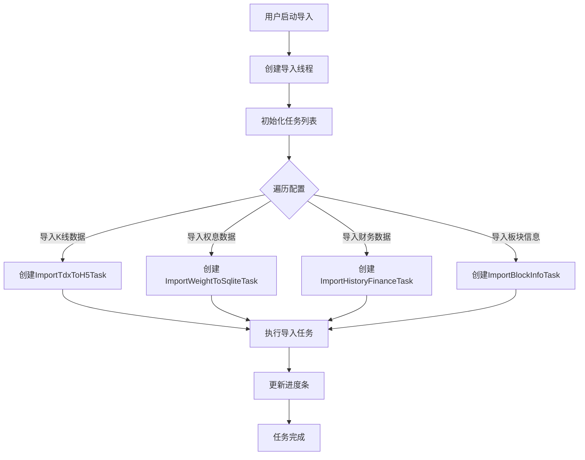
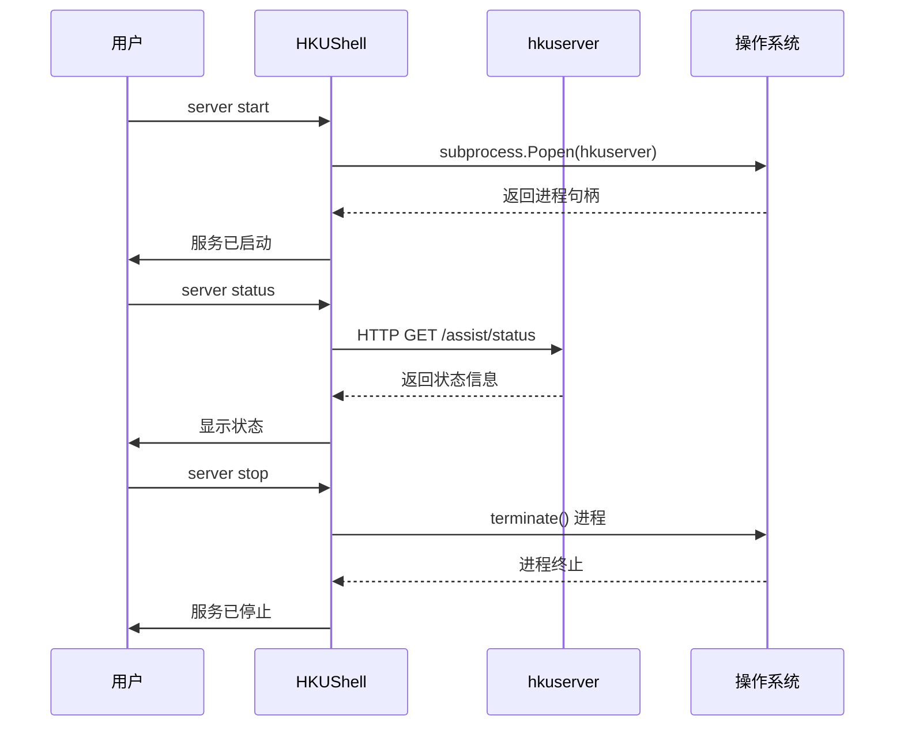

# 高级特性

<cite>
**本文档引用的文件**   
- [HikyuuTDX.py](file://hikyuu/gui/HikyuuTDX.py)
- [hkushell.py](file://hikyuu/shell/hkushell.py)
- [hkucmd.py](file://hikyuu/shell/hkucmd.py)
- [cmdserver.py](file://hikyuu/shell/cmdserver.py)
- [interactive.py](file://hikyuu/interactive.py)
- [analysis.py](file://hikyuu/analysis/analysis.py)
- [h5_data_clear.py](file://hikyuu/tools/h5_data_clear.py)
- [copy_file.py](file://hikyuu/tools/copy_file.py)
- [MainWindow.py](file://hikyuu/gui/data/MainWindow.py)
- [UseTdxImportToH5Thread.py](file://hikyuu/gui/data/UseTdxImportToH5Thread.py)
- [spot_server.py](file://hikyuu/gui/spot_server.py)
</cite>

## 目录
1. [简介](#简介)
2. [GUI图形界面（HikyuuTDX）](#gui图形界面hikyuitdx)
3. [命令行工具（hkushell）](#命令行工具hkushell)
4. [交互式shell（interactive.py）](#交互式shellinteractivepy)
5. [策略分析模块（analysis）](#策略分析模块analysis)
6. [实用工具脚本（tools）](#实用工具脚本tools)
7. [结论](#结论)

## 简介
本文档旨在深入探讨Hikyuu量化交易框架的高级特性和工具集，帮助高级用户提升工作效率并实现复杂工作流。文档将详细介绍GUI图形界面HikyuuTDX的功能，包括数据导入监控、实时行情查看和策略管理；阐述命令行工具hkushell和交互式shell的使用方法，用于自动化任务和快速原型开发；说明analysis模块提供的策略分析功能，如组合分析；并展示tools目录下的实用脚本，如数据清理和文件复制工具。

## GUI图形界面（HikyuuTDX）

HikyuuTDX是Hikyuu框架的图形用户界面，为用户提供了一个直观、易用的操作平台，用于管理数据导入、实时行情监控和策略配置。

### 数据导入与监控
HikyuuTDX的核心功能之一是数据导入。用户可以通过图形界面配置从不同数据源（如通达信客户端、pytdx库或QMT）导入历史K线数据、权息数据、财务数据和板块信息。界面提供了详细的配置选项，包括：
- **数据源选择**：用户可以选择使用本地通达信客户端目录、通过pytdx库从网络下载或使用QMT进行数据导入。
- **数据类型选择**：用户可以灵活选择需要导入的数据类型，包括股票、基金、期货的K线数据（日线、5分钟线、1分钟线等）、权息信息、历史财务数据和板块分类。
- **存储配置**：支持将数据存储到HDF5文件、MySQL数据库或ClickHouse数据库中，用户可以根据需求选择最适合的存储方案。

导入过程通过多线程技术实现，确保了高效率。用户可以在界面上实时监控导入进度，包括已完成的任务和当前状态。当导入任务启动时，系统会创建一个`UseTdxImportToH5Thread`或`UsePytdxImportToH5Thread`线程来执行具体的导入任务，并通过信号机制将进度信息反馈到主界面。

**Diagram sources**
- [HikyuuTDX.py](file://hikyuu/gui/HikyuuTDX.py#L984-L1008)
- [UseTdxImportToH5Thread.py](file://hikyuu/gui/data/UseTdxImportToH5Thread.py#L193-L200)

### 实时行情查看
HikyuuTDX集成了实时行情采集功能，能够从网络源（如新浪、腾讯）或本地QMT客户端获取实时的股票行情数据。系统通过`CollectSpotThread`线程定时采集行情，并将数据通过NNG（Nanomsg Next Generation）发布-订阅模式发送到指定的IPC或TCP地址。用户可以在界面上查看当前的采集状态和最近的行情数据。

**Section sources**
- [HikyuuTDX.py](file://hikyuu/gui/HikyuuTDX.py#L73-L80)
- [spot_server.py](file://hikyuu/gui/spot_server.py#L252-L279)

### 策略管理
虽然HikyuuTDX主要侧重于数据管理，但它为策略开发提供了基础支持。通过生成和管理`hikyuu.ini`配置文件，它为上层的策略回测和实盘交易提供了必要的环境配置。用户可以配置数据预加载的K线类型和数量，这直接影响策略运行时的数据可用性。

## 命令行工具（hkushell）

`hkushell`是一个基于Python `cmd`模块构建的命令行交互工具，为用户提供了一种高效的方式来执行Hikyuu框架的自动化任务。

### 核心功能
`hkushell`的主要功能是启动、停止和监控一个后台服务进程（`hkuserver`）。这个服务进程可以独立运行，为其他应用程序提供数据服务或执行长时间运行的任务。

- **服务管理**：用户可以通过`server start`、`server stop`和`server status`命令来控制后台服务的生命周期。
- **日志级别控制**：通过`server set_logger_level`命令，用户可以动态调整服务端的日志输出级别，便于调试和监控。
- **命令记录与回放**：`hkushell`支持`record`和`playback`命令，允许用户将一系列操作记录到文件中，并在以后回放，这对于自动化测试和批量任务处理非常有用。

### 工作原理
`hkushell`本身是一个命令行解释器，其核心是`HKUShell`类。该类通过装饰器`@shell_cmd`包装命令函数，确保每个命令执行后都能更新提示符和行号。`cmdserver.py`模块中的`server`函数被注册为`HKUShell`的一个命令，它通过`subprocess`模块启动`hkuserver`可执行文件，并通过HTTP API与之通信。

**Diagram sources**
- [hkushell.py](file://hikyuu/shell/hkushell.py#L17-L20)
- [hkucmd.py](file://hikyuu/shell/hkucmd.py#L80-L110)
- [cmdserver.py](file://hikyuu/shell/cmdserver.py#L52-L85)

**Section sources**
- [hkushell.py](file://hikyuu/shell/hkushell.py#L1-L20)
- [hkucmd.py](file://hikyuu/shell/hkucmd.py#L1-L111)
- [cmdserver.py](file://hikyuu/shell/cmdserver.py#L1-L127)

## 交互式shell（interactive.py）

`interactive.py`是一个预配置的Python交互式脚本，旨在为用户提供一个开箱即用的量化分析环境。

### 功能与用途
该脚本的主要作用是：
1.  **初始化环境**：通过`load_hikyuu()`函数加载Hikyuu框架的核心库和数据。
2.  **预定义常用对象**：脚本创建了多个常用的`Block`（板块）对象，如`zsbk_a`（所有A股）、`zsbk_sh`（上证A股）、`zsbk_sz`（深证A股）、`zsbk_cyb`（创业板）等。这些对象可以直接在交互式环境中使用，无需用户手动创建，极大地简化了针对特定股票集合的分析工作。
3.  **快速原型开发**：用户可以将`interactive.py`作为起点，导入其定义的变量，然后在此基础上编写和测试自己的策略或分析代码，实现快速的原型开发。

**Section sources**
- [interactive.py](file://hikyuu/interactive.py#L1-L69)

## 策略分析模块（analysis）

`analysis`模块位于`hikyuu/analysis/analysis.py`，提供了一系列用于策略性能分析和组合测试的高级函数。

### 组合分析（combinate）
该模块的核心功能是`combinate_ind_analysis`和`combinate_ind_analysis_multi`函数，它们实现了指标组合测试。

- **单只股票测试**：`combinate_ind_analysis`函数允许用户对单只股票测试不同的买入和卖出信号指标组合。它会遍历所有可能的组合，计算每种组合下的策略绩效，并返回一个包含各项绩效指标（如累计投入本金、当前总资产、赢利交易比例等）的Pandas DataFrame。
- **多股票测试**：`combinate_ind_analysis_multi`函数将上述功能扩展到一个股票集合（`Block`或列表），可以批量测试多个股票在不同指标组合下的表现，非常适合进行大规模的策略筛选和优化。

这些函数通过调用底层C++实现的`inner_combinate_ind_analysis`来保证计算效率，是进行策略参数优化和信号有效性验证的强大工具。

**Section sources**
- [analysis.py](file://hikyuu/analysis/analysis.py#L11-L152)

## 实用工具脚本（tools）

`tools`目录包含了一系列独立的实用脚本，用于解决特定的数据处理和维护问题。

### 数据清理（h5_data_clear.py）
`h5_data_clear.py`脚本用于清理HDF5格式的K线数据文件。它会连接到SQLite数据库（存储股票基本信息），然后检查HDF5文件中的每个数据表。如果某个表是空的，或者其名称（股票代码）不在数据库的股票列表中，该脚本就会将其从HDF5文件中删除。这有助于保持数据文件的整洁，释放磁盘空间。

**Section sources**
- [h5_data_clear.py](file://hikyuu/tools/h5_data_clear.py#L1-L163)

### 文件复制（copy_file.py）
`copy_file.py`脚本的功能非常直接，它使用`pytables`库的`copy_file`函数来复制HDF5文件。例如，它可以将`sh_day.h5`复制为`sh_day_new.h5`。这种操作在进行数据备份或创建数据快照时非常有用。

**Section sources**
- [copy_file.py](file://hikyuu/tools/copy_file.py#L1-L16)

## 结论
Hikyuu框架通过提供GUI图形界面、命令行工具、交互式shell、策略分析模块和一系列实用脚本，构建了一个功能全面、层次分明的高级工具集。HikyuuTDX为数据管理提供了直观的入口，`hkushell`和`interactive.py`为自动化和快速开发提供了灵活的接口，`analysis`模块则为策略研究提供了强大的分析能力，而`tools`目录下的脚本则解决了日常维护中的具体问题。这些高级特性共同构成了一个高效、可扩展的工作流，能够显著提升量化交易研究和开发的效率。