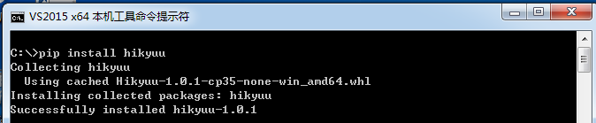

Installation
============

Prerequisites
-------------

Supported operating systems: 64-bit Windows 7 (x86 CPU) and above, Ubuntu, and macOS (arm). For
anything else, building from source is recommended.

1. Python: >= Python 3.10. Use the mainstream Python version at install time, or one version lower.
   For example, as of April 1, 2025 the mainstream version is 3.12, so 3.12 or 3.11 is recommended;
   this avoids errors caused by other packages being incompatible with an older Python version.

.. note:: 

    - A Python distribution that bundles common data-science packages is recommended: `Anaconda <https://www.anaconda.com/>`_ . Users in China are advised to download it from the `Tsinghua mirror <https://mirrors.tuna.tsinghua.edu.cn/help/anaconda/>`_ , which is much faster.

    - On Linux, conda usually ships its own libstdc++.so instead of the system one, which can cause compatibility problems such as: ImportError: /lib/x86_64-linux-gnu/libstdc++.so.6: cannot allocate memory in static TLS block. The usual fix is to use either the system or the conda libstdc++.so consistently; for example, put the conda lib path first in LD_LIBRARY_PATH (so it is searched first) with export LD_LIBRARY_PATH="$CONDA_PREFIX/lib:$LD_LIBRARY_PATH" before starting the program.

2. Install git (required if you use hub)

    Official git downloads: `https://git-scm.com/downloads <https://git-scm.com/downloads>`_

Install with pip
----------------

Install: python -m pip install hikyuu

Upgrade: python -m pip install hikyuu -U

.. note::

    **In versions 2.6.8/2.6.9, some older x86 CPUs that do not support the AVX instruction set may crash. Upgrade to 2.7.0 or later.**

.. note::

    If this is your first time using Hikyuu, please read :ref:`quickstart` carefully.
   

Build from source
-----------------

Windows (x86 CPU), Ubuntu 24.04 and above, and macOS (arm CPU) support pip installation. For other
platforms, build from source; see :ref:`developer` .
