.. _quickstart:

Getting Started
===============

Download the market data first
------------------------------

After installing Hikyuu with pip, run the ``hikyuutdx`` command in a terminal to start the data
download tool, and follow the on-screen instructions to download the data:

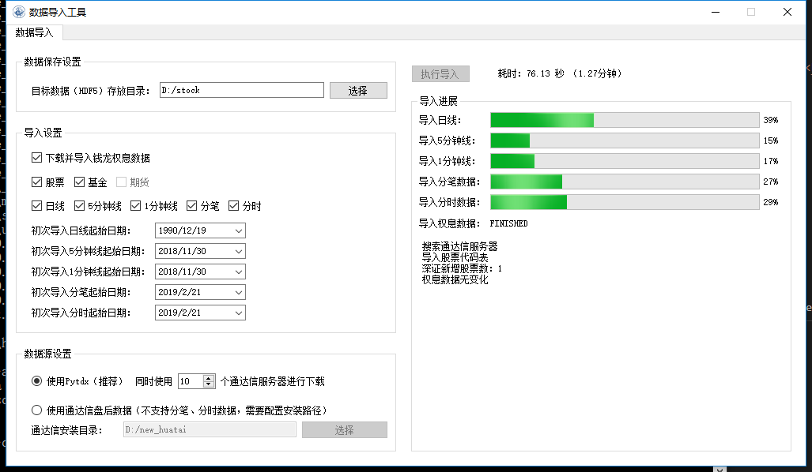

.. note::

    If the ``hikyuutdx`` command cannot be found in the terminal, look for ``HikyuuTDX.exe`` in the
    ``Scripts`` directory of your Python installation (this usually means that directory was not added
    to the system ``PATH`` when Python was installed). If it still does not work, go to the installed
    ``hikyuu`` package under ``python/Lib/site-packages``; its ``gui`` directory contains
    ``HikyuuTdx.py``, which you can run directly with ``python HikyuuTdx.py`` from the terminal to see
    the error message.

If you prefer not to use the graphical interface, run the ``importdata`` command in a terminal,
as shown below:

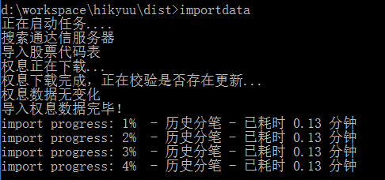

.. note::

    The ``importdata`` command uses the configuration file generated by HikyuuTDX. On Windows it is
    recommended to run HikyuuTDX at least once so that the configuration exists (you do not need to
    perform the import, but you must exit the program after configuring it); otherwise the default
    configuration is used. If the default configuration fails, edit the corresponding configuration
    files in the ``.hikyuu`` directory under your user directory.

Learn from the examples
-----------------------

The latest code examples are available at the address below. They walk you through the usage of
Hikyuu and the ideas behind systematic trading step by step. While working with Hikyuu you can look
up the built-in indicators, strategies and functions in this documentation for more detail.

`<https://nbviewer.jupyter.org/github/fasiondog/hikyuu/blob/master/hikyuu/examples/notebook/000-Index.ipynb?flush_cache=True>`_ 

All the examples above are written and run with Jupyter Notebook. You can download each example from
the top-right corner of its page and open it directly in Jupyter Notebook.

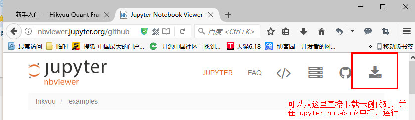

Or find all examples under ``examples/notebook`` in the installation directory.

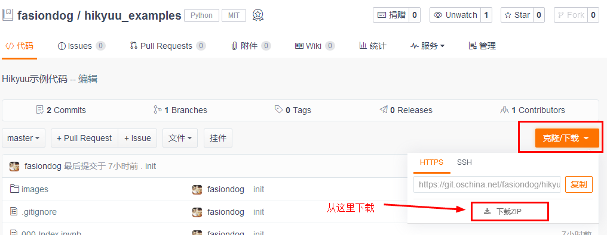

If you are not used to Jupyter Notebook, you can work through the examples with any Python client
you like (shell, Spyder, PyCharm, IDLE, and so on). See the later chapters for more about Jupyter
Notebook or other Python clients. If Chinese characters are not displayed correctly, or figures do
not show up in the Python shell, see the later chapters as well.

Run from the Python shell
-------------------------

You can run Hikyuu from any Python client. The figure below shows Hikyuu running in a Python shell
inside ``cmd``. When copying code from the examples above, **remove the lines that start with "%",
such as "%time"** — those are IPython magic commands, which only work in IPython and not in a plain
shell.

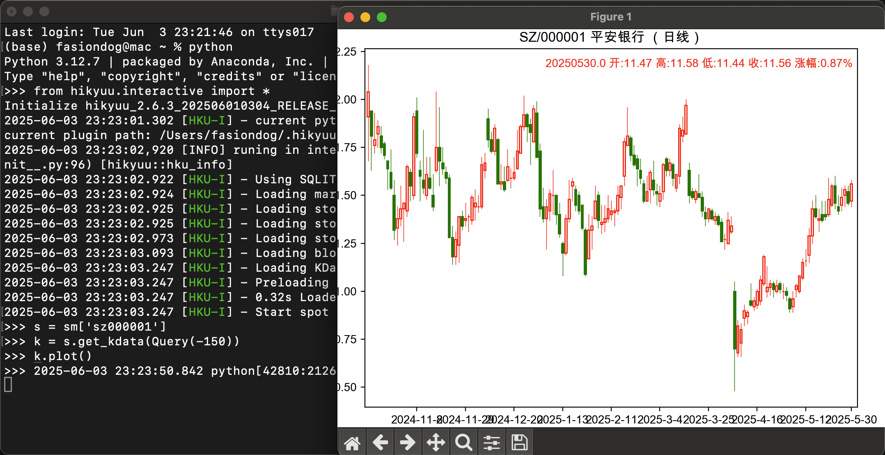

To use the Hikyuu interactive tool, import it first:
        
::

    # import the interactive tool before using hikyuu interactively
    from hikyuu.interactive import *
    
.. note::

    Hikyuu itself is an ordinary Python package, while ``hikyuu.interactive`` is the interactive tool
    shipped with it. If you want to build your own application on top of the ``hikyuu`` package
    instead of using it interactively, see ``hikyuu/interactive/interactive.py`` for how Hikyuu is
    initialized normally.

Editing and running with Jupyter Notebook
-----------------------------------------

Jupyter Notebook (formerly IPython Notebook) is a web-based interactive notebook, editor and runtime
that supports more than 40 programming languages. It has become the main tool for programming and
sharing in exploratory research. Search the web for more information about Jupyter Notebook.

To start Jupyter Notebook, enter the directory you want to work in and type the ``jupyter notebook``
command in a terminal, as shown below:

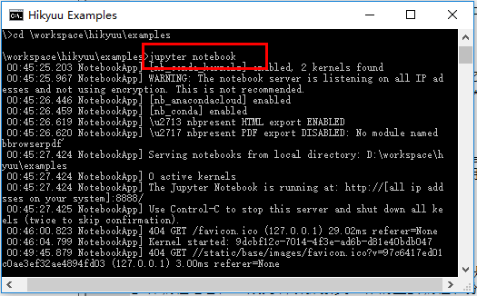
    
This starts a local web service. Open your browser (Chrome or Firefox is recommended) and go to
http://127.0.0.1:8888/tree, where you can edit and run code from the menu just like in an ordinary
code editor.
    
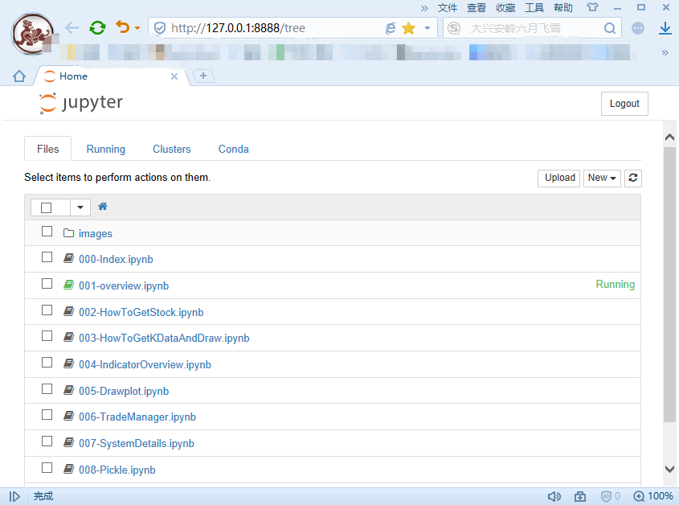
    
    
Build your own cloud quant platform with Jupyter Notebook
---------------------------------------------------------

To build your own cloud quant platform you first need a server reachable from the public internet,
for example a cloud server you purchased (Alibaba Cloud, Tencent Cloud, and so on). Then configure
Jupyter Notebook for remote access as follows:

1. Log in to the remote server
2. Generate the configuration file by typing the following command in a terminal:

::

    jupyter notebook --generate-config

3. Generate a password: type the ``ipython`` command in a terminal and create a hashed password,
   then copy the resulting hash ('sha:ce…'):

::

    In [1]: from jupyter_server.auth import passwd
    In [2]: passwd()
    Enter password: 
    Verify password: 
    Out[2]: 'sha1:ce23d945972f:34769685a7ccd3d08c84a18c63968a41f1140274'
    
4. Edit the default configuration file ``jupyter_notebook_config.py``, located in the ``.jupyter``
   directory under the Windows user path, as shown below. Note: ``.jupyter`` is a hidden directory on
   Windows; either enable "show hidden folders" in the file explorer, or type the path directly into
   the address bar:

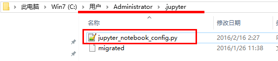

Make the following changes:

::

    c.ServerApp.ip='0.0.0.0'
    c.ServerApp.password = u'sha:ce...the hash you copied above'
    c.ServerApp.open_browser = False
    c.ServerApp.port =8888 # pick any port you like

5. Start Jupyter Notebook: enter the directory you want to work in and type the following command in
   a terminal:

::

    jupyter notebook
    
6. For convenience you can create a batch file on the desktop. For example, if you want the working
   directory to be "d:\\workspace\\hikyuu\\examples", save the following content as a ".bat" file
   with Notepad, then double-click it on the desktop to start:

::

    d:
    cd \workspace\hikyuu\examples
    jupyter notebook

7. Enter the address of your remote server in a browser, for example "http://server-address:8888".
   You can also open it in a mobile browser and edit and run the code directly from your phone:

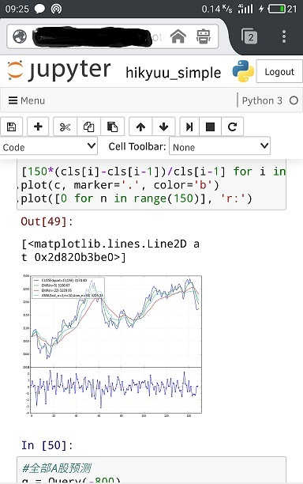

CJK characters are garbled in matplotlib figures
------------------------------------------------

Hikyuu plotting supports CJK characters out of the box. If they are still garbled, try the steps
below.

Edit the matplotlib configuration file and change the font to one that supports CJK characters. The
file, ``matplotlibrc``, is located at ``python-install-dir/matplotlib/mpl-data/matplotlibrc`` and can
be opened with any text editor; its location is shown below:

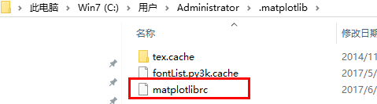

1. Find the following line in the configuration file:

::

    #font.sans-serif     : DejaVu Sans, Bitstream Vera Sans, Lucida Grande, Verdana, Geneva, Lucid, Arial, Helvetica, Avant Garde, sans-serif

Uncomment it and add SimHei after the colon (on Ubuntu you can use "Noto Sans CJK JP"); CJK labels
are then displayed correctly.

Also uncomment the following line and change the value after the colon to False so that the minus
sign is displayed correctly.

::

    #axes.unicode_minus  : True
    
2. Delete the font cache file ``fontList.py3k.cache`` in the ``.matplotlib`` directory. (On Ubuntu the
   location is ``.cache/matplotlib`` under the user directory; delete everything in it.)

3. Check whether ``simhei.ttf`` exists in the ``c:\windows\fonts`` directory. If not, download it from
   the web, then copy the font file into ``c:\windows\fonts``.

4. If it still does not work, check whether a matplotlib configuration also exists under the user
   directory, for example ``.matplotlib`` on Windows (see the figure below). In that case delete the
   ``matplotlibrc`` file under ``.matplotlib`` in the user directory, or delete the whole directory.

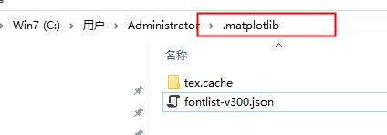

matplotlib does not draw figures automatically
----------------------------------------------

By default matplotlib requires ``plt.show()`` after every plot, which is inconvenient during
interactive exploration. You can edit its configuration file so that figures are displayed without
calling ``plt.show()`` explicitly.

As in the previous section, find the matplotlib configuration file and set the "interactive" option
to True:

::

    #interactive  : False
    interactive  : True

Using the matplotlib ipywidgets backend in Jupyter
-------------------------------------------------------

The default matplotlib backend is slow and does not support free zooming. In Jupyter you can install
ipympl with pip so that matplotlib renders through the web.

Start the notebook with the ``%matplotlib widget`` command to use ipympl.

If the figure does not appear after "Loading widgets ...", the dependency versions are probably
incompatible; try updating the jupyterlab, notebook and ipywidgets packages with pip.

Qt is unavailable on Ubuntu (Wayland)
-------------------------------------

On Ubuntu with Wayland you may need to set the ``QT_QPA_PLATFORM=wayland`` environment variable,
usually by adding ``export QT_QPA_PLATFORM=wayland`` to ``.bashrc``.

IDEs such as PyCharm show no hints
-----------------------------------

1. Install pybind11-stubgen with ``pip install pybind11-stubgen``
2. Run ``pybind11-stubgen hikyuu``; hints then work as expected.

.. note::

    Since version 2.3.1, the pyi files are generated by default when hikyuu is packaged.
