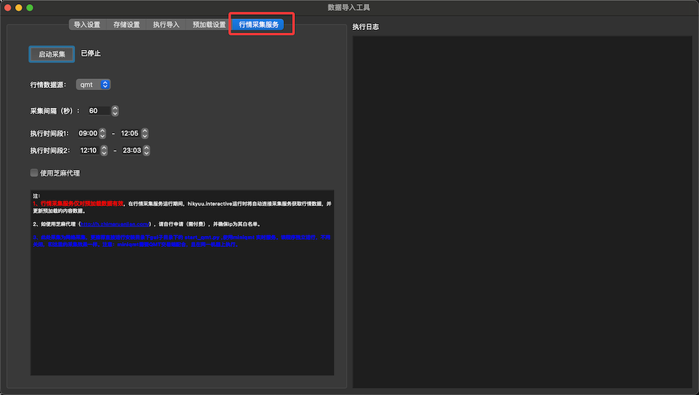
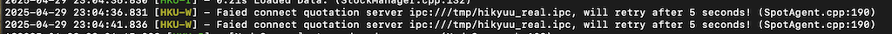

dataserver
==========

If installed with pip, the dataserver command can be executed directly in the shell. Or execute the gui/dataserver.py file under the installation directory with Python.

::
    
    The dataserver parameters are as follows:

    Options:
    -addr, --addr TEXT              The service address provided to the outside; for access from other machines, use tcp://0.0.0.0:port
    -n, --work_num INTEGER          The number of the quote receiving and processing threads
    -save, --save BOOLEAN           Save the quote data (ClickHouse only)
    -buf, --buf BOOLEAN             Cache the quote data
    -parquet_path, --parquet_path TEXT  Parquet file storage path

dataserver needs to work with the quote collection service; it can run on the same machine as the quote collection service, or the two can run on separate machines, but the network needs to be configured properly.

Start the quote collection data service as follows; for other ways such as the command line below, please refer to the related python files in the gui subdirectory under the installation directory.

When running on the same server as the quote collection service, the configuration usually does not need to be modified. If they are not on the same machine, the related configuration on the machine where dataserver runs needs to be adjusted:

::

    For example, if the quote collection runs on machine A (IP address: 192.168.1.2) and dataserver runs on machine B (IP address: 192.168.1.3), then modify the hikyuu.ini file in the user directory of machine B:

    Modify the quotation_server parameter under the [hikyuu] section to:

    [hikyuu]
    tmpdir = /Users/fasiondog/stock/tmp
    datadir = /Users/fasiondog/stock
    quotation_server = tcp://192.168.1.2:9200

If it connects to the quote collection service normally, the following will be displayed:

::

    Ready to receive quotation from ....

If connecting to the quote collection service fails, the connection failure message will be printed continuously, e.g.:

To use it in other hikyuu programs, call get_data_from_buffer_server to get the cached realtime data from machine B:

.. py:function:: get_data_from_buffer_server(addr: str, stklist: list, ktype: Query.KType)
          
    :param str addr: the data server address
    :param list stklist: the list of the stocks whose data needs to be obtained
    :param Query.KType ktype: the data type

E.g.:

::

    get_data_from_buffer_server("tcp://192.168.1.3:9201", [sm["sh000001"], sm["sh000002"]], KQuery.DAY)

Other hikyuu processes using this method can disable their own quote receiving through the "start_spot" parameter in load_hikyuu or the Strategy.start method parameter, to save the machine resource usage.
