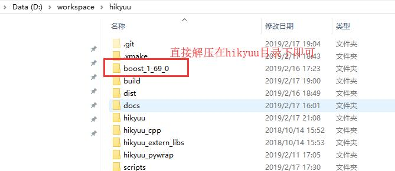

.. _developer:

C++ 开发者指南
===============

.. note::

    为了顺利编译代码， 请勿使用从 github 直接下载源码包的方式编译。 原因是 git 上传时部分文件的换行符被置换为Linux式的换行符，将导致直接下载的部分代码在Windows下无法顺利编译。

C++ API参考：`<http://fasiondog.cn/hikyuu/cpp_ref/index.html>`_。

C++测试工程参考：`<http://fasiondog.cn/hikyuu/test_doc/index.html>`_

编译前准备
----------------

1、安装C++编译器
^^^^^^^^^^^^^^^^^^^^^^^^^^^^^^^^^^^^^^^^^^^^^^

- Windows 平台：Visual C++ 2017 (或以上）
- Linux 平台: g++ > = 5.4.0 、 clang++ >= 3.8.0

2、安装构建工具 xmake
^^^^^^^^^^^^^^^^^^^^^^^^^^^

xmake >= 2.2.2，网址：`<https://github.com/xmake-io/xmake>`_

Windows下，从 xmake github 页面中的“release”进入，直接下载相应的 exe 安装包安装即可：

.. figure:: _static/dev-001.jpg

Linux、macOSX 执行以下指令安装：

.. code-block:: shell

    git clone --branch=dev https://github.com/tboox/xmake.git tboox/xmake --depth 1
    cd ./tboox/xmake
    ./scripts/get.sh __local__

3、克隆 Hikyuu 源码
^^^^^^^^^^^^^^^^^^^^^^^^

执行以下命令克隆 hikyuu 源码：（请勿在中文目录下克隆代码）

.. code-block:: shell

    git clone https://github.com/fasiondog/hikyuu.git --recursive --depth 1    

4、下载 Boost 源码
^^^^^^^^^^^^^^^^^^^^^^^^^^^^

1. 下载 Boost 源码 `<http://www.boost.org>`_ 
2. 将下载的 boost 源码包解压至上一步中克隆的 hikyuu目录下，如下图所示：

    
.. note::

    以下版本的 boost 无法顺利编译，请注意注意不要使用：
    
    - Windows：1.67
    - linux、macOS：1.68

3.  如果使用 Anaconda 的 python，需手工修改 boost 根目录下的 project-config.jam 文件, 找到 “using python” 所在行，手工添加python的版本、可执行文件、include目录，如：using python : 3.7 : "/Users/ljh/opt/anaconda3/bin/python3.7" : /Users/ljh/opt/anaconda3/include/python3.7m ;
    
5、Linux下安装依赖软件包
^^^^^^^^^^^^^^^^^^^^^^^^^^^^^^^

Linux下需安装依赖的开发软件包。如 Ubuntu 下，执行以下命令：

.. code-block:: shell
    
    sudo apt-get install -y libsqlite3-dev   

MacOsx 下需要使用 brew 安装 sqlite3, hdf5, mysqlclient 的开发包（具体包名请自行查询）。 

6、转 Visual Studio 工程
^^^^^^^^^^^^^^^^^^^^^^^^^^^^^^^

Windows 下，习惯用 msvc 调试的，可以使用  xmake project -k vsxmake -m "debug,release" 命令生成 VS 工程。命令执行后，会在当前目录下生成如 vsxmake2022 的子目录，VS工程位于其内。

在 VS 内，可以将 demo 设为启动工程，进行调试。
    

编译与安装
------------

须先安装 python click包（pip install click)

直接在克隆的 hikyuu 目录下执行 python setup.py command , 支持的 command：

- python setup.py help        -- 查看帮助
- python setup.py build       -- 执行编译
- python setup.py install     -- 编译并执行安装（安装到 python 的 site-packages 目录下）
- python setup.py uninstall   -- 删除已安装的Hikyuu
- python setup.py test        -- 执行单元测试（可带参数 --compile=1，先执行编译）
- python setup.py clear       -- 清除本地编译结果
- python setup.py wheel       -- 生成wheel安装包

