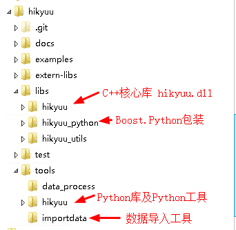

C++ 开发者指南
===============

此部分为C++核心库部分感兴趣的开发者或需要将Python的指标、策略等翻写为C++代码以追求更高速度的用户提供参考。**普通用户直接使用Python客户端即可，并不需要使用到C++核心库，Python同样能够实现指标和策略的开发。**

.. note::

    为了顺利编译代码，请使用 git clone 下载代码（需要将git配置为checkout时自动转换为Windows换行符，具体做法请百度），原因是 git 上传时部分文件的换行符被置换为Linux式的换行符，将导致直接下载的部分代码在Windows下无法顺利编译。

详细的C++ API参考，参见：`<https://hikyuu.org/ref-doc/index.html>`_。或者使用doxygen打开源码目录下的 "libs\\hikyuu\\Doxyfile" 工程文件，自行生成。

C++测试工程及要求参见：`<https://hikyuu.org/test-doc/index.html>`_

源码编译与安装
----------------

STEP1 安装编译工具
^^^^^^^^^^^^^^^^^^^^^^^

安装编译工具 xmake（须为2.2.2版本及其之上版本），具体可参见：`<https://github.com/tboox/xmake>`_

Linux、macOSX可从github clone dev分支进行编译安装，具体如下：

.. code-block:: lua

    git clone --branch=dev https://github.com/tboox/xmake.git tboox/xmake --depth 1
    cd ./tboox/xmake
    ./scripts/get.sh __local__
    

STEP2 确认编译器是否支持C++11
^^^^^^^^^^^^^^^^^^^^^^^^^^^^^^^

STEP3 下载 Boost 源码并编译
^^^^^^^^^^^^^^^^^^^^^^^^^^^^

1、下载 Boost 源码 `<http://www.boost.org>`_ ， 并解压至希望保存的目录。

.. note::

    由于boost目前跨平台不是很稳定，linux、macOSX下请使用 boost 1.67 版本，而Windows下请使用 boost.1.68 版本。

2、命令行下进入 Boost 源码路径，执行编译:

Windows下编译示例:

.. code-block:: shell

    bootstrap.bat
    b2 release link=shared address-model=64 -j 4 --with-python --with-date_time --with-filesystem --with-system --with-serialization --with-test

Linux、macOSX下编译示例：
    
.. code-block:: shell

    ./bootstrap.sh --with-python=python3
    ./b2 release link=shared -j 4 --with-python --with-date_time --with-filesystem --with-system --with-serialization --with-test
    

3、检查在boost源码目录下的stage/lib子目录下是否生成了python3相应的boost.python动态库。如Windows下boost_python35-vc141-mt-x64-1_68.dll，linux下libboost_python35.so.1.67.0。注：boost 1.67之前，boost_python库的后缀不带小版本即boost_python3，而1.67及其之后的版本为boost_python3.x

    
STEP3 设置环境变量
^^^^^^^^^^^^^^^^^^^

编译Hikyuu前，需设置相应的系统环境变量：

- BOOST_ROOT 指明boost源码所在路径，如: D:\\src\\boost
- BOOST_LIB  指明boost动态库所在路径，如：D:\\src\\boost\\stage\\lib

STEP4 编译及安装Hikyuu
^^^^^^^^^^^^^^^^^^^^^^

获取源码：

.. code-block:: shell

    git clone https://github.com/fasiondog/hikyuu.git --recursive --depth 1

进行源码目录后，执行编译。

Windows下编译：

.. code-block:: shell

    xmake f --with-unit-test=y  #此步配置xmake编译单元测试代码，可跳过
    xmake
    xmake r unit-test #此步执行单元测试，可跳过
    xmake install -o C:\Anaconda3\Lib\site-packages  #可自行指定安装目录

Linux下编译于Windows相同。

.. note::

    Linux下需安装依赖的软件包：sudo apt-get install -y libhdf5-dev libhdf5-serial-dev libmysqlclient-dev

MacOSX下编译必须实现配置xmake指定使用C++编译器：g++或clang++，不能是gcc或clang

.. code-block:: shell

    xmake f --cxx=g++ #macOSX下必须指定使用C++编译器

喜欢使用Visual Studio的同学，可使用xmake生成VS工程：

.. code-block:: shell
    
    xmake project --kind=vs2017

更多xmake使用，请参考 `<https://xmake.io>`_

代码结构与开发工程
-------------------

代码结构
^^^^^^^^^^

