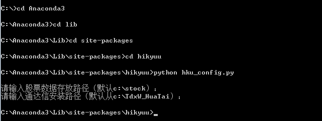
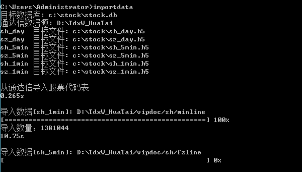
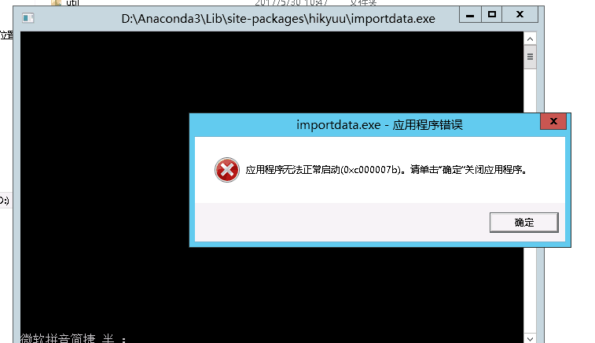
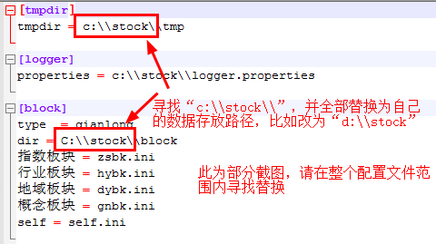

安装步骤
=========

安装前准备
----------

支持的操作系统：Windows7及以上版本

Python环境：>= Python3.5

必须的软件包：

- matplotlib >= 1.5.0

- numpy >= 1.10.4

可选的软件包：

- Jupyter >= 1.0.0

- talib >= 0.4.0

- pandas >= 0.17.1

.. note:: 

    - 推荐安装集成了常用数据科学软件包的Python发布版本： `Anaconda <https://www.anaconda.com/>`_ 。国内用户建议从 `清华镜像网站 <https://mirrors.tuna.tsinghua.edu.cn/help/anaconda/>`_ 下载，速度快。
    
    - Linux安装建议使用pchaos提供的docker解决方案：https://github.com/pchaos/Docker-hikyuu

下载安装
----------

安装：pip install hikyuu

版本升级：pip install hikyuu --upgrade

.. figure:: _static/20000-install.png
    
快速配置数据源与存放路径
-------------------------

进入hikyuu的安装路径，运行 python hku_config.py 根据提示配置数据的存放路径及通达信安装目录，**如不使用默认路径，请注意参考后续章节修改数据导入配置信息！**

导入数据
---------

.. note::

    初次运行Hikyuu前，必须执行一次 importdata 命令，以便生成必要的数据文件。

进入hikyuu的安装路径，运行 importdata 命令（建议将hikyuu的安装路径加入环境变量PATH中）：

每日收盘后，需在通过证券软件下载数据后，运行此命令导入数据。如需实时日线数据，目前有一个简易的解决方法，可参见新手入门示例。

部分用户运行 importdata 命令，可能出现 “应用程序无法正常启动(0xc000007b)” 应用程序错误的弹出框（如下图所示），此现象是由 Microsoft DirectX 存在错误造成的。

可以从360软件管理里面找到“directx修复工具”，和“微软常用运行库合集”后安装就可以了，或在网络上搜索“directx修改”寻找相应的软件包进行修复即可。

手工修改数据配置（可选）
-------------------------

在数据存放路径下，可以找到以下配置文件：

- importdata.ini ：数据导入配置文件
- hikyuu_win.ini（linux下为 hikyuu_linux.ini） : Hikyuu实际运行使用的配置文件

修改数据配置（hikyuu_win.ini）
^^^^^^^^^^^^^^^^^^^^^^^^^^^^^^^

详细配置说明可参见配置文件中的注释：

    
修改数据导入配置（importdata.ini）
^^^^^^^^^^^^^^^^^^^^^^^^^^^^^^^^^^^

目前采用的K线数据（包括日线、5分钟线、分钟线）支持从通达信和大智慧（钱龙与大智慧K线数据格式相同）导入，权息数据从钱龙导入（非必须），所以需要至少安装了其中一款证券客户端软件，感谢通达信、大智慧（钱龙）。推荐使用通达信软件，下载速度快。

.. figure:: _static/20006-install-config4.png

