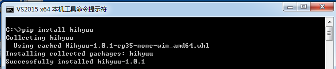

安装步骤
=========

安装前准备
----------

支持的操作系统：64位 Windows7及以上版本、Linux请使用源码自行编译安装。

Python环境：>= Python3.9

.. note:: 

    - 推荐安装集成了常用数据科学软件包的Python发布版本： `Anaconda <https://www.anaconda.com/>`_ 。国内用户建议从 `清华镜像网站 <https://mirrors.tuna.tsinghua.edu.cn/help/anaconda/>`_ 下载，速度快。

pip 安装
----------

安装：pip install hikyuu

版本升级：pip install hikyuu -U

.. note::

    第一次使用，请详细阅读 :ref:`quickstart` 。

.. note::
    
    由于依赖的 talib 包，无法在 Windows 下通过 pip 安装，请从 `<https://www.lfd.uci.edu/~gohlke/pythonlibs/#ta-lib/>`_ 上下载相应的 wheel 包，手工安装。
    
.. note::

    Linux 需要安装依赖的库：libhdf5、libmysqlclient、libsqlite3

源码编译安装
----------------

Linux上建议使用源码方式安装，参见 :ref:`developer` 。
