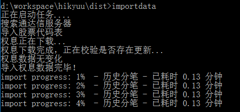
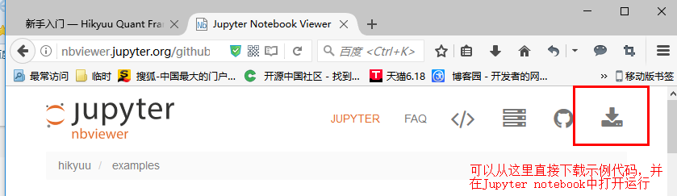
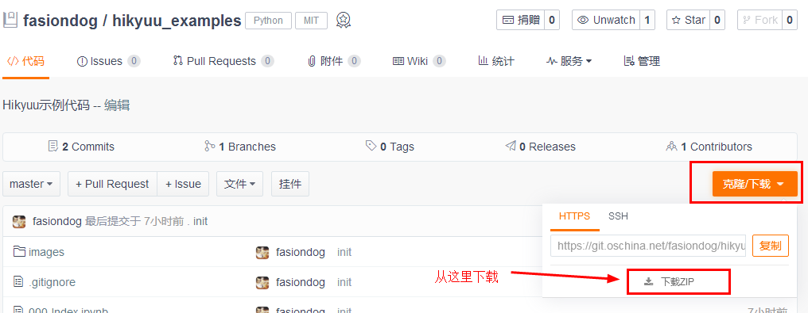
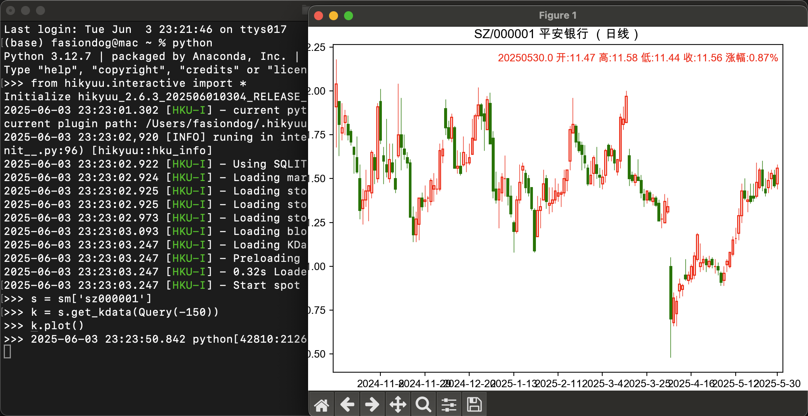
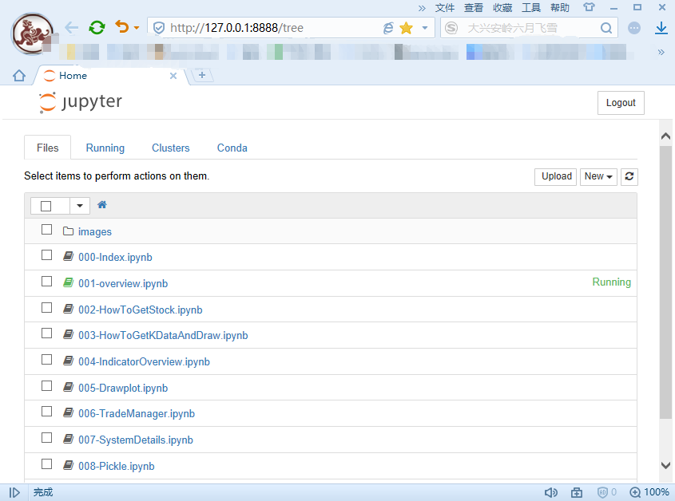
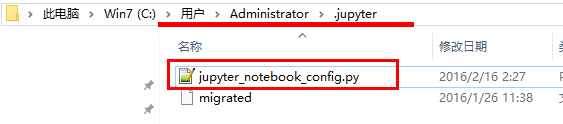
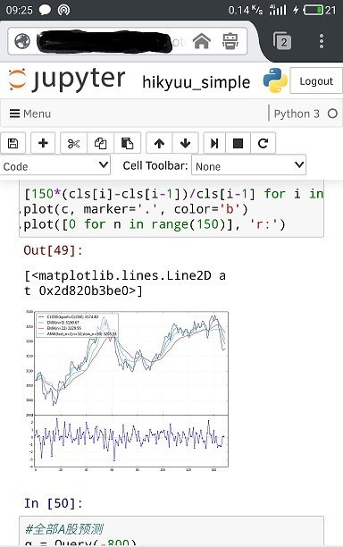
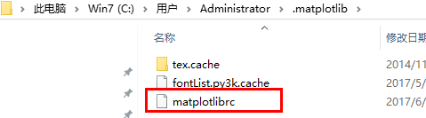
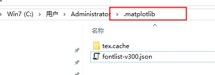

.. _quickstart:

新手入门
===========

开始请先下载数据
----------------

.. note::

    数据下载工具需要使用到 unrar 命令，Linux 下请自行安装 unrar。

pip 安装 Hikyuu 后，可在命令行终端中执行 hikyuutdx 命令，启动数据下载工具，并按界面提示下载数据：

.. figure:: _static/install-20190228.png

.. note::

    如在命令行终端中无法执行 hikyuutdx 命令，请到 python 安装目录下的 Scripts （通常是安装python时没有将该路径放入系统 PATH 路径中）子目录中选择该执行文件（HikyuuTDX.exe）。如果还是不行，可以到 python/Lib/site-packages 下找到 hikyuu 的安装目录，在其下的 gui 目录中有 HikyuuTdx.py, 可以从命令行终端中直接执行 python HikyuuTdx.py 执行观察报错信息。

如不希望使用 GUI 图形界面下载，可在命令行终端中执行 importdata 命令，如下图所示：

.. note::

    由于 importdata 命令使用的是 HikyuuTDX 生成的配置文件，所以在第一次执行 importdata 之前需要至少运行过一次 HikyuuTDX。

通过代码示例学习
-----------------

您可以从下面的网址访问最新的代码示例，这些示例将帮助您逐步了解和掌握 Hikyuu 的使用以及系统交易的相关理念。在日常使用 Hikyuu 的过程中，您可以在本帮助内查询相应的内建指标、策略、函数的详细说明，获得更多的信息。

`<https://nbviewer.jupyter.org/github/fasiondog/hikyuu/blob/master/hikyuu/examples/notebook/000-Index.ipynb?flush_cache=True>`_ 

上述示例代码均使用 Jupyter notebook 编辑和运行，您可以从每个示例网址的右上角下载示例代码，并在 Jupyter notebook 中打开直接运行。

或者从安装目录下的 “examples/notebook” 找到全部示例。

如果不习惯使用 Jupyter notebook，也可以使用自己喜欢的 Python 客户端工具（如 shell、Spyder、PyCharm、idle等），按照示例代码进行学习运行。有关 Jupyter notebook 或 其它 Python 客户端使用，请参考后续章节。使用过程中，如遇到中文字符显示乱码、在 python shell 中绘图无法显示的情况，请参考后续章节。

从 Python Shell 中运行
-----------------------

您可以使用任意的 Python 客户端工具运行 Hikyuu。运行 Hikyuu。如下图所示，是在 cmd 中 Python shell 环境下运行 hikyuu。从上述示例中拷贝代码时，**应注意将开头带有“%”的代码去除，如 “%time”，** 这些是 ipython 的魔力代码，只在 ipython 环境中生效，普通的 shell 中没有。

运行 Hikyuu 交互式工具，需在首先将其引入，代码如下：
        
::

    #在交互式环境下使用hikyuu，首先需引入hikyuu交互工具
    from hikyuu.interactive.interactive import *
    
.. note::

    Hikyuu本身是普通的Python包，而 hikyuu.interactive.interactive 为 Hikyuu 包中包含的交互式工具。如希望基于 hikyuu 包开发自己的其他程序而不是作为交互式程序使用，可以参考 hikyuu/interactive/interactive.py 实现 hikyuu 的正常初始化。

使用 Jupyter notebook 编辑和运行
----------------------------------
    
Jupyter notebook（此前被称为 IPython notebook）是一个基于web的交互式笔记本、编辑器及运行平台，支持运行 40 多种编程语言，已成为科研探索类工作的主要编程和分享工具。有关 Jupyter notebook 的更多信息，请进行网络搜索。

启动 Jupyter notebook，只需要在 cmd 中，进入自己希望的工作目录后，键入 Jupyter notebook 命令即可，如下图所示：

.. figure:: _static/quickstart_jupyter.png
    
上述命令，将启动本地的web服务，此时，您可以打开浏览器（建议使用Chrome或Firefox浏览器），输入如下地址：http://127.0.0.1:8888/tree 即可根据其界面中的菜单命令象普通的代码编辑器一样编辑和运行代码。
    

    
    
利用 Jupyter notebook 搭建自己的云量化平台
-------------------------------------------

搭建自己的云量化平台，首先需要拥有一个可以从公网访问的服务器，可以自行购买云服务器（如阿里云、腾讯云等）。之后需要对 Jupyter notebook 进行配置，使其能够远程进行访问，配置方法如下：

1. 登陆远程服务器
2. 生成配置文件，在 cmd 下，键入如下命令：

::

    jupyter notebook --generate-config

3. 生成密码，在 cmd 下键入 ipython 命令，创建一个密文的密码，把生成的密文‘sha:ce…’复制下来：

::

    In [1]: from jupyter_server.auth import passwd
    In [2]: passwd()
    Enter password: 
    Verify password: 
    Out[2]: 'sha1:ce23d945972f:34769685a7ccd3d08c84a18c63968a41f1140274'
    
4. 修改默认配置文件 “jupyter_notebook_config.py”，该文件位于windows登录用户路径下的 ".jupyter" 目录下，如下图所示。注意：windows下 .jupyter 是隐藏目录，需要将资源管理器设置为显示隐藏文件夹才能看见 “.jupyter” 目录，或直接在资源管理器的地址中输入路径：

进行如下修改：

::

    c.ServerApp.ip='0.0.0.0'
    c.ServerApp.password = u'sha:ce...刚才复制的那个密文'
    c.ServerApp.open_browser = False
    c.ServerApp.port =8888 #随便指定一个端口

5. 启动jupyter notebook，在 cmd 下，进入自己希望的工作目录后，键入命令：

::

    jupyter notebook
    
6. 为了方便起见，可以在桌面建立批处理文件，如希望工作目录为“d:\\workspace\\hikyuu\\examples”，则可使用记事本输入下面的内容后，保存为“.bat”文件，之后可直接在桌面双击该文件，即可启动:

::

    d:
    cd \workspace\hikyuu\examples
    jupyter notebook

7. 在浏览器中，输入你的远程服务器地址，如 “http://服务器地址:8888” 即可访问。如可以在手机浏览器中访问，并可直接通过手机对代码进行编辑并运行，如：

matplotlib显示图形时中文字体乱码的问题
---------------------------------------

需修改 matplotlib 配置文件，把字体改为支持中文的字体。matplotlib文件位于 python安装目录/matplotlib/mpl-data/matplotlibrc，可用任意文本编辑器打开编辑，文件位置如下图所示：

1. 在配置文件中找到下面一行：

::

    #font.sans-serif     : DejaVu Sans, Bitstream Vera Sans, Lucida Grande, Verdana, Geneva, Lucid, Arial, Helvetica, Avant Garde, sans-serif

注释去掉，在冒号后面添加 SimHei（如果使用 Ubuntu，可以使用 “Noto Sans CJK JP”），可以正常显示中文标签。

再把下面一行的注释去掉，把冒号后面改成False可以正常显示正负号。

::

    #axes.unicode_minus  : True
    
2. 删除 “.matplotlib” 目录下的字体缓存文件 “fontList.py3k.cache”。（Ubuntu 下，该位置为用户目录 .cache/matplotlib，删除该目录下所有文件）

3. 检查 “c:\\windows\\fons” 目录下，是否存在 simhei.ttf 文件，如果没有可从网上搜索下载或加入Hikyuu QQ群下载字体文件，将该字体文件拷贝至 “c:\\windows\\fons” 目录下。

4. 经历以上步骤还是无法正常显示，请检查用户目录下是否也存在 matplotlib 的配置，如 Windows 中用户目录下的 .matplotlib（见下图示例）。此时可删除用户目录下的 .matplotlib 下的 matplotlibrc 文件，或者整个目录的内容删除。

matplotlib无法自动绘制图像的问题
-----------------------------------

matplotlib 默认每次绘图后，都要调用 plt.show() 显示图形，这在交互式探索时，非常不方便，同样可以修改其配置文件，使其不必显示调用 plt.show() 即可显示图形。

参考上一章节，找到 matplotlib 配置文件，修改 "interactive" 选项，改为 True：

::

    #interactive  : False
    interactive  : True

Ubuntu wayland 平台上 QT 不可用
-----------------------------------

使用 wayland 的 ubuntu, 可能需要设置 QT_QPA_PLATFORM=wayland 环境变量，通常可以在 .bashrc 中 添加 export QT_QPA_PLATFORM=wayland 进行设置
        