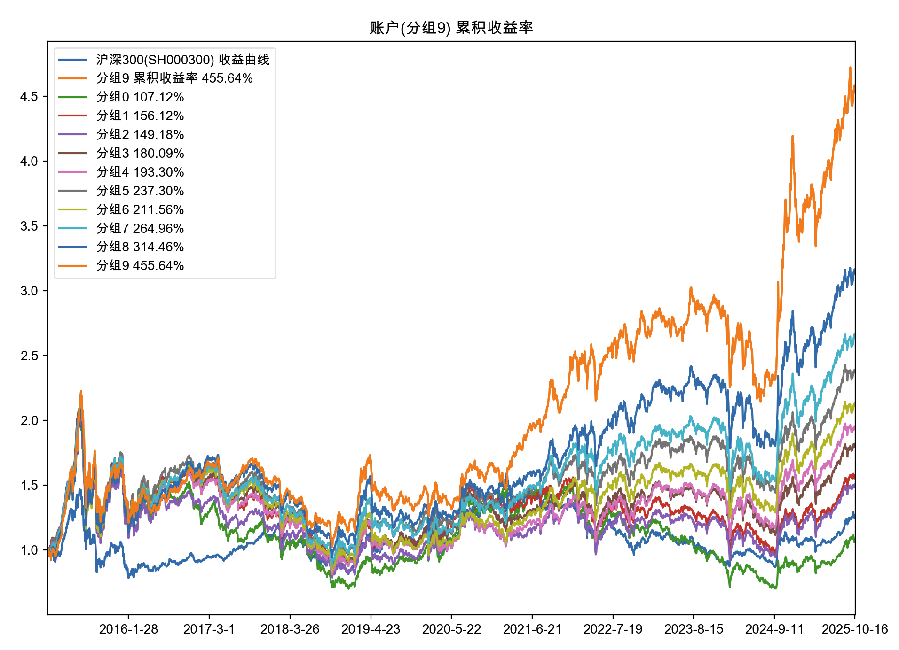

# 版本发布说明

## 2.7.2 - 2025年12月24日

**🚀 新增特性**

* 新增 AF_FixedAmount 等金额资产分配，对选中的资产进行等金额分配
* 添加 lazy_preload 配置选项，预加载日线以下数据时，支持懒加载模式
* 支持无限制预加载K线数据, 当 preload_max_num 设置为小于等于 0 时，表示不对预加载的 K 线数量做限制。

**⚡️ 优化改进**

* 调整ETF最小交易量默认配置为100
* feat(trade): 支持缩扩股业务处理
* feat(HikyuuTdx): 导入股票交易和时间数据时过滤价格为零的记录
* feat(HikyuuTdx): 改进股票数据导入逻辑并增强错误处理
* feat(hikyuu_cpp): 调整对 reload_time 配置的解析和验证，只有当配置正确时才启用自动重载功能
* 优化预加载加载取消逻辑，避免无效操作
* 优化调整全局变量初始化与清理顺序
* 线程池及 PluginManager 优化

**🐞 缺陷修复**

* fix(indicator): 优化指标克隆与序列化缓冲区处理, 防止内存泄漏
* fix(trade_sys):  crtSG 函数中遗漏将创建的信号指示器对象引入全局的功能
* fix(data): 修复导入股票数据时交易量比较的错误日志输出，py311不支持f-str双引号嵌套
* fix(trade_manage): 增加对缩股的处理逻辑
* fix(mysql): 调整K线数据金额字段精度, KRecord 中的amount保持为万元(原为千元， 和其他存储引擎不一致)
* fix(hikyuu_cpp): 调整ETF、基金和B股的分时数据价格精度
* fix(draw): 解决matplotlib绘制指标时内部缺值或异常时无法绘图的问题
* fix(StrategyContext): 修复 K 线类型去重逻辑中的大小写问题，以便不区分大小写

## 2.7.1 - 2025年12月1日

**🚀 新增特性**

* 增加数据重载时间配置项, 新增 `reload_time` 配置项，用于指定每日数据重新加载的时间（格式为 HH:MM），默认值为 "00:00。需手工更改或 hikyuu.ini 或在 load 参数中指定
* 添加crtSCFilter函数用于快速创建评分过滤器实例
* 新增 crtNorm 函数用于快速创建标准化/归一化等算法函数
* 取消行业板块数据下载

**🐞 缺陷修复**

* fixed: 修正 clickhouse 存储 K 线数据中 amount 字段的单位转换问题
* fixed: 限制日期范围以适配 ClickHouse DateTime 类型
* fixed: 修改Stock_Number结构体中的number类型为double，windows下容易出现精度错误
* fixed: 更新盈利目标策略接口参数说明与实现逻辑，移除了部分子类中冗余的 `_calculate` 空实现
* fixed: HikyuuTdx 在导入股票数据时，增加对低价股低点差异的绝对值判断，避免因价格过低导致的相对误差误判。

## 2.7.0 - 2025年11月1日

**🚀 新增特性**

* 新增 SP系列滑点算法：截断正态分布滑点算法(ST_TruncNormal)、对数分布随机价格滑点算法(ST_LogNormal)、正态分布随机价格滑点算法(ST_Normal)、均匀分布随机价格算法(ST_Uniform)

**⚡️ 优化改进**

* 主包 hikyuu 去除 arrow 依赖，需要 arrow 相关功能需独立安装 pip install hikyuu-plugin，并手工引入 from hikyuu_plugin.extra import *。使用该方式，也便于自行编译的朋友，使用插件。
* clickhouse 预加载过程中直接读取数据时，保证其读取数据和预加载完成后一致
* 优化KData构造函数中的数据加载逻辑，避免在重加载或设置K线数据列表时出现数据无效的风险。
* 优化板块数据下载

**🐞 缺陷修复**

* fixed：HikyuuTDX 首次运行时因 use_download 未初始化导致闪退
* fixed：释放预加载K线数据时同时释放已加载的历史财务数据，保证重加载时读取最新的历史财务数据

## 2.6.9 - 2025年10月19日

**🚀 新增特性**

* MF多因子评分板支持指定全局因子标准化、对特定因子指定特有标准化和中性化（含行业中性化与风格因子中性化)算法

  ```python
  # 创建两个因子 ma20, ma60
  ma20 = MA(CLOSE(), 20)
  ma20.name = 'MA20'

  ma60 = MA(CLOSE(), 60)
  ma60.name = 'MA60'

  # 指定证券列表
  stks = [s for s in blocka]

  # 指定查询范围，并创建一个等权组合的 MF
  query = Query(Datetime(20150101), Datetime(20251017))
  mf = MF_EqualWeight([ma20, ma60], stks, query, ref_stk=sm["sh000001"])

  # 添加全局标准化
  mf.set_normalize(NORM_Zscore())

  # 为 ma20 添加行业中性化以及市场中性化(即按市值风格因子中性化)
  mf.add_special_normalize("MA20", NORM_Zscore(), category="行业板块", style_inds=[LOG(CLOSE()*LIUTONGPAN())])
  ```
* 增加内置因子标准化算法(NORM_Zscore/NORM_MinMax/NORM_Quantile/NORM_Quantile_Uniform)
* 新增 SE_MultiFactor2 自行指定配置时间截面评分过滤器，内置评分过滤器(SCFilter_TopN/SCFilter_Price/SCFilter_AmountLimit/SCFilter_Group等)

  ```python
  # 如为 SE_MultiFactor2 实例，设置过滤：分值不为Nan|分成10组取第0组|价格大于等于10元|成交金额不在当日排名末尾20%之内|取前10
  se.set_scores_filter(SCFilter_IgnoreNan()|SCFilter_Group(10, 0)SCFilter_Price(
              10.) | SCFilter_AmountLimit(0.2) | SCFilter_TopN(10))
  ```

  如通过 SCFilter_Group 创建过滤器进行因子分组测试：
  
* [vip]新增 GROUP 系列指标(GROUP_MAX/GROUP_MIN/GROUP_SUM/GROUP_FUNC等)，和 AGG 系列指标对应
* [vip]dateserver 增加 --parquet_path 方式保存 tick data，仅在 --save 同时为 yes 时生效
* feat(KData): 添加索引方式获取子集功能

**⚡️ 优化改进**

* HikyuuTDX 优化板块信息下载，防止下载失败情况下板块信息丢失
* [vip]优化 clickhouse 存储引擎，日线整体预加载优化至8秒，目前存储引擎日线整体加载速度: HDF5 6秒 -> clickhouse 8秒 -> mysql 22秒
* HikyuuTDX 从 PyQt5 迁移至 PySide6
* feat(hikyuu_cpp): 在 Performance 类中新增"未平仓帐户收益率%"统计项
* feat(draw): 为 tm_performance 和 sys_performance 函数添加返回主图 axis 的功能，便于用户在绘图后对图表进行进一步的自定义操作和调整。
* 编译工程优化，基于xmake合并编译功能，整体编译实际缩短三分之二

**🐞 缺陷修复**

* fix(hikyuu): 默认情况下不启动行情接收，防止在开盘后因自身合成缺失导致从 dataserver 获取行情也缺失的问题。
* fix(datetime): 修复 UTC 偏移量计算在非 Windows 平台下的问题可能不准确。
* fix(hikyuu): realtime_update 优化实时更新功能中的股票列表获取逻辑
* fix(data): 修复10年债券收益率数据导入时的日期判断逻辑

## 2.6.8 - 2025年9月5日

**🚀 新增特性**

- 新增 get_inds_view 方法，用于指定日期或范围内的系列指标结果并返回 pandas.DataFrame 结果。该方法主要用于获取系列指标结果后，使用其他 python 库，进行进一步数据处理，或日常监控打印。

  ```python
  In [3]: df = get_inds_view(blocka, [CLOSE(), OPEN(), MA(CLOSE()), AMA(CLOSE()), MA(CLOSE(),n=30)], Datetime(20250822))

  In [4]: df
  Out[4]: 
        证券代码  证券名称   交易时间  CLOSE   OPEN         MA        AMA         MA
  0     SH600229  城市传媒 2025-08-22   5.89   7.23   7.087273   7.060143   7.034000
  1     SH601121  宝地矿业 2025-08-22   7.21   6.01   2.482273   2.486140   6.544000
  2     SH600227    赤天化 2025-08-22   7.97   6.41   6.292273   6.406271   2.462333
  3     SH600390  五矿资本 2025-08-22   6.62   2.59   6.585455   6.015825   6.208000
  4     SZ000612  焦作万方 2025-08-22   2.56   6.69   6.260000   6.334334   8.710933
  ...        ...       ...        ...    ...    ...        ...        ...        ...
  3467  SH603255    鼎际得 2025-08-22  32.36  32.39  31.984409  32.237558  31.445567
  3468  SH600621  华鑫股份 2025-08-22  17.91  16.80  16.134909  16.596052  15.940933
  3469  SH600999  招商证券 2025-08-22  19.32  18.68  18.342727  18.646812  18.188667
  3470  SZ002301  齐心集团 2025-08-22   7.32   7.36   7.130000   7.192394   7.109333
  3471  SH603369    今世缘 2025-08-22  42.49  42.21  40.229545  41.319146  40.089333

  [3472 rows x 8 columns]
  ```
- 新增 AGG 系列聚合指标（捐赠用户），如日线使用分钟线聚合结果

  ```python
  #如计算：每日成交金额 / 日内分钟线最大成交金额
  ind = AGG_MAX(AMO(), ktype=Query.MIN)/AMO()
  s = sm['sz000001']
  k = s.get_kdata(Query(-100, ktype=Query.DAY))
  result = ind(k)
  print(result.to_df()))
  ```
- IC 指标增加 strict 参数，strict 模式下为当前时刻的 N 日后收益，非 strict 模式下为当前时刻之前的 N 天收益
- 新增 REFX 指标，增强 REF 指标，可进行左移（未来函数， 勿在回测中使用，通常用于其他数据处理）
- K线添加分时和分笔数据支持, 在 KQuery 中添加 TIMELINE 和 TRANS 两种新 K 线类型，可直接使用指标计算分时和分笔数据

  ```python
  In [28]: s = sm['sz000001']

  In [29]: k = s.get_kdata(Query(-100, ktype=Query.TRANS))

  In [30]: MA(CLOSE())(k).to_df()
  Out[30]: 
                datetime     value0
  0  2025-09-04 14:52:08  11.750000
  1  2025-09-04 14:52:11  11.750000
  2  2025-09-04 14:52:14  11.750000
  3  2025-09-04 14:52:17  11.750000
  4  2025-09-04 14:52:20  11.750000
  ..                 ...        ...
  95 2025-09-04 14:56:53  11.730455
  96 2025-09-04 14:56:56  11.730909
  97 2025-09-04 14:56:59  11.731364
  98 2025-09-04 14:57:02  11.732273
  99 2025-09-04 15:00:00  11.732727

  [100 rows x 2 columns]
  ```
- KData新增 get_kdata 方法获取对应时间范围内其他不同 K 线周期数据
- 添加 Indicator 结果集转换为 numpy.array 的新方法 to_array
- StockManager 添加 is_trading_hours 方法判断是否为交易时间段

**⚡️ 优化改进**

- 改进 python 中 std::share_ptr 引出对象的 clone 操作，提升 windows 下相关并行处理速度
- Indicaotr 优化双指标等特殊指标的表达式去重，提升公式计算性能
- 预加载模式 KData 与 Stock 共享数据、非预加载模式下捐赠用户 KData 使用LRUCache
- CVAL、SLICE、ALIGN 支持处理多结果集指标
- KRecord/KDataImp 使用全局 Null对象

**🐞 缺陷修复**

- 修复 MySQL/ClickHouse 无法按索引方式获取非预加载数据的错误
- 修复 Indicator 类中 to_numpy 函数的内存泄漏问题
- 修复 ALIGN 当日期超过给定范围时的对齐问题，优化了对齐算法
- 修复非中文环境 Windows 设置终端为中文编码导致的终端崩溃
