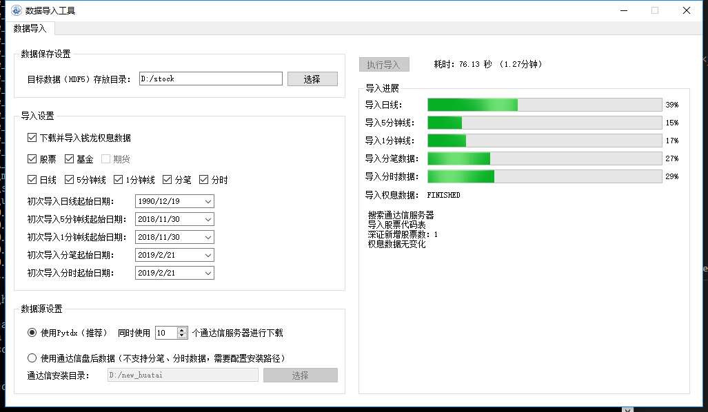

版本发布说明
=======================

2.3.0 - 2025年1月1日
^^^^^^^^^^^^^^^^^^^^^^^^^^^^^^^^^^

1. 新增特性
    - C++ 直接内建全部 ta-lib 指标，以 "TA_XXX" 方式命名
    - matplotlib 绘图增加通达信兼容绘图函数: STICKLINE、DRAWBAND 等
    - 新增 WMA 指标公式
    - 新增 CONTEXT 指标，用于指标在不同上下文中进行计算

2. 其他缺陷修复与优化
    - fixed 动态指标参数增加nan保护处理
    - fixed windows 下 hub 路径大小写比较
    - fixed pydatetime_to_Datetime 在传入 Datetime 类型时转换错误
    - 改进 CORR/SPEARMAN 指标
    - 改进 clang 下 Parameter 类型比较
    - 改进 PRICELIST, 在指定上下文时按上下文右对齐，保证等长; 在自身为时间序列时，指定上下文时按日期对齐
    - 改进 Null, 以便 double/float 类型可以使用 val == Null<double>() 形式判断空值
    - KData 相等比较时补充 stock 为空但 query 不同的情况，此时认为相等
    - 消除 matplotlib 下指标绘制时出现的 "linestyle" 告警
    - 更换项目 logo, 改进 HikyuuTdx 任务栏图标显示

2.2.4 - 2024年12月8日
^^^^^^^^^^^^^^^^^^^^^^^^^^^^^^^^^^

1. 支持 Macosx 及 mac arm 平台安装包
2. HDF5/MySQL 存储支持自定义板块，参见 StockManager add_block/remove_block 方法
3. 优化 MySQL 数据库重连
4. HikyuuTdx 在交易时段导入数据时给出弹出确认警告

2.2.3 - 2024年11月3日
^^^^^^^^^^^^^^^^^^^^^^^^^^^^^^^^^^

1. fixed linux 下滚动寻优系统崩溃
2. SYS_WalkForward 默认寻优算法调整为按账户年化收益率排序寻优
3. 微调优化 HikyuuTDX 界面

2.2.2 - 2024年11月1日
^^^^^^^^^^^^^^^^^^^^^^^^^^^^^^^^^^

1. 优化 sys_performance, 统一使用上证指数交易日作为参考日期，防止参考证券日期和回测证券日期不一致的情况
2. 增加 PF 调仓模式，可以按周/月/年中第N日方式指定调仓日
3. run_in_strategy 等添加其他订单代理参数，以便可以实盘时进行其他方式的通知（如邮件）
4. Python 中 Stock set_krecord_list 方法增加指定 ktype 参数
5. 支持 python 3.13 （注：由于其他依赖包尚未全部支持 3.13, 数据导入暂时不可用）
6. 改进打包，多版本 python 支持同时包含于一个包中
7. 增强 VALUE/PRICELIST 指标，可同时指定对应的参考日期
8. 增加 df_to_ind 函数，通过指定 pandas.DataFrame 中的数据列及日期列名称，将相关列转为指标数据
9. 初次使用 HikyuuTdx 导入数据时，根据配置路径尝试自动创建相关目录

2.2.1 - 2024年10月1日
^^^^^^^^^^^^^^^^^^^^^^^^^^^^^^^^^^

1. fixed strategy 实盘发出信号失败
2. fixed c++ demo2 run failed
3. 优化 python 中 strategy 无法 ctrl+C 终止
4. 优化 HikyuuTdx GUI 布局, 支持缩放
5. 优化 Strategy 上下文中 ktypelist 为空时, 认为使用全部K线类型

2.2.0 - 2024年9月26日
^^^^^^^^^^^^^^^^^^^^^^^^^^^^^^^^^^

1. 新增特性
    - 新增 WalkForwardSystem 滚动系统策略（单候选系统时为滚动，多候选系统时为滚动寻优）
    - 新增 OptimalSelector 滚动系统策略寻优算法（配合 WalkForwardSystem 使用）
    - Strategy 支持指定多个时间点任务
    - IC/ICIR/MF_MultiFactor/SE_MultiFactor 增加 spearman 参数，控制相关系数计算方法

2. 功能优化
    - 优化 SpotAgent
    - 解决 hub 中自定义继承类接口在另一个part中引用时丢失的问题
    - 调整 HikyuuTDX 超时时长，避免 linux 超时时等待时间过长

3. 缺陷修复
    - fixed etf 缩扩股，调整权息表以适应缩扩股
    - fixed DMA和INSUM,处理 nan 和 discard
    - fixed 日期型 KQuery 比较失败
    - fixed System未正确使用 m_kdata
    - fixed performance 统计计算天数时加1
    - fixed some CN not register serialization
    - fixed portfolio 打印缺失

2.1.5 - 2024年9月11日
^^^^^^^^^^^^^^^^^^^^^^^^^^^^^^^^^^

1. fixed 补充 etf 前缀及扩股错误权息处理
2. fixed 分钟级别行情数据更新错误
3. fixed DMA 指标公式错误
4. 优化 TradeManager checkout 操作精度判断

2.1.4 - 2024年9月4日
^^^^^^^^^^^^^^^^^^^^^^^^^^^^^^^^^^

1. fixed 分钟级别行情数据更新错误
2. 优化提速 HikyuuTdx 数据下载
3. 优化数据加载策略，优先加载同一K线类型数据
4. 优化内部使用线程数节省系统资源
5. hikyuu.interactive 可以使用环境变量控制部分数据加载策略。可在使用 .py 文件进行策略分析时，节省首次执行时间。
6. 完善 Strategy 和 StrategyContext
7. fixed OperatorSelector 序列化时内存泄漏

2.1.3 - 2024年8月27日
^^^^^^^^^^^^^^^^^^^^^^^^^^^^^^^^^^

1. fixed 未安装 xtquant 时无法使用 HikyuuTdx
2. 调整 codepre 配置，补充上证ETF基金

2.1.2 - 2024年8月26日
^^^^^^^^^^^^^^^^^^^^^^^^^^^^^^^^^^

1. 优化 Strategy，调整 OrderBroker 接口，增加 strategy 示例
2. 增加 miniqmt 行情采集
3. 优化 realtime_update，移除sina|tushare源，增加指定stock列表
4. 优化内部调度使用内部公共任务组
5. fixed reload 时重新加载历史财务信息

2.1.1 - 2024年8月9日
^^^^^^^^^^^^^^^^^^^^^^^^^^^^^^^^^^

1. 预加载历史财务信息
2. fixed windows下 MySQL blob 数据读取错误导致读取历史财务信息时消耗巨大内存
3. HikyuuTdx 读取配置文件放在 output 重定向之前，防止配置文件读取失败没有提示

2.1.0 - 2024年6月18日
^^^^^^^^^^^^^^^^^^^^^^^^^^^^^^^^^^

1. 新增特性
    - Selector 支持 +-×÷、AND、OR 操作，方便验证共振

2. 缺陷修复
    - fixed 北交所92号段历史财务信息导入
    - fixed 对 etf 缩股的复权处理错误
    - fixed INSUM 在某些股票无数据时的报错
    - fixed getSystemPartName/getSystemPartEnum 缺失 PF
    - fixed PF 处理立即买入/延迟卖出的系统
    - fixed analysis 在 k 线无数据时报错
    - fixed get_current_hub 获取当前 hub 名称时错误
    - fixed 通达信本地数据导入时导入历史财务数据的进度通知消息

3. 功能优化
    - 优化 INSUM, BLOCKSETNUM 可直接输入 stock list, 可以忽略 query 参数
    - 优化 HikyuuTDX，避免目录不存在时导入
    - 优化 SE_MultiFactor 以更好的适应 PF
    - 优化 performance 绘图，参考标的累积收益率使用等比后复权计算
    - 优化程序退出：非内存泄漏检测模式下由OS系统快速释放内存资源
    - 优化泄漏检测工程；清理优化clang、cppcheck编译告警；优化shared_ptr创建

2.0.9 - 2024年5月27日
^^^^^^^^^^^^^^^^^^^^^^^^^^^^^^^^^^

1. fixed Parameter 中对 Block 的支持，造成 INSUM 无法参与其他指标的计算
2. Porfolio 添加对延迟系统可能出现的未来信号保护

2.0.8 - 2024年5月22日
^^^^^^^^^^^^^^^^^^^^^^^^^^^^^^^^^^

1. fixed 权息数据中转送股导入错误
2. 增加 BLOCKSETNUM、INSUM 横向统计指标
3. 本地数据导入时未导入历史财务信息
4. Block 支持直接加入 list 格式的证券列表
5. fixed 空 Block 序列化后无法加载

2.0.7 - 2024年5月18日
^^^^^^^^^^^^^^^^^^^^^^^^^^^^^^^^^^

1. sys.performance 绘图时标题中加上对应的证券名称及标识，以及修正统计范围为回测截止时间
2. 优化内建信号指示器 SG_Band, 支持使用 3 个指标分别作为参考、下轨、上轨
3. fixed MultiFactorBase 默认构造时缺失名称
4. fixed SignalBase reset 中缺失对象成员
5. fixed System 中止盈实现，保证止盈仅在盈利情况下发生
6. fixed hub 获取 part 下子部件失败

2.0.6 - 2024年5月13日
^^^^^^^^^^^^^^^^^^^^^^^^^^^^^^^^^^

1. 安装包HikyuuTDX不采用gui模式，win11下GUI模式会造成直接timeout
2. 策略部件 python 导出时，支持 python 的动态属性，在 hub 中支持
3. fixed _Selector 缺失赋值构造函数，导致 clone 失败

2.0.5 - 2024年5月8日
^^^^^^^^^^^^^^^^^^^^^^^^^^^^^^^^^^

主要修复
1. fixed 接收spot时，分钟级别的成交量为股数
2. fixed SG_Cycle 其 alternate 属性须为 false，影响 PF 示例

其他修复
1. fixed strategy 加载权息失败
2. StrategyContext 在设定 ktypes 时进行从小到大的排序，以便后续能够按顺序调用 onBar
3. fixed setKRecordList 使用 move(ks) 时错误

2.0.4 - 2024年5月6日
^^^^^^^^^^^^^^^^^^^^^^^^^^^^^^^^^^

1. 缺陷修复
    - fixed ETF 权息缺少扩缩股
    - fixed Portfolio 在非延迟买入、延迟卖出的场景下对账错误
    - fixed matplotlib performance 绘制时，当前收益率显示显示错误
    - fixed requirements.txt 增加tdqm, 缺失可能导致 windows HikyuuTdx 无法直接命令启动

2. 其他改进
    - Stock 添加获取所属板块列表方法 get_belong_to_block_list
    - 改进 sys_performance，在query日期不在stock的有效日期范围内时，抛出异常
    - matplotlib sysplot 增加 only_draw_close，避免数据量较大时, matploblib 绘制 K 线过慢
    - 改进matplot绘制图形时，x轴坐标显示
    - pf 系统名称加上股票名称
    - 处理nng升级后的编译告警

2.0.3 - 2024年4月25日
^^^^^^^^^^^^^^^^^^^^^^^^^^^^^^^^^^

1. 增强 FINANCE，增加 only_year_report 和 dynamic 参数，以便进行市盈率等计算
2. Indicaotr.plot 绘制时，将 x 轴设置为日期
3. 增加北交所 92 号段
4. 增加 BlockIndex 表，支持 Block 获取对应指数
5. fixed 板块信息导入时，如果网络不好，未获取到当前板块信息时，会把之前的板块信息删除
6. fixed interactive 中 blockbj 为空

2.0.2 - 2024年4月19日
^^^^^^^^^^^^^^^^^^^^^^^^^^^^^^^^^^

1. 新增特性
    - 历史财务信息入库，并增加指标 FINANCE 获取相应历史财务数据
    - 新增 RESULT 指标，以便对存在多个结果集的指标可以通过指标公式的方式获取结果
    - Stock 开放部分属性可在运行时修改，增加 set_krecord_list 方法，可以希望使用其他数据源时生成临时的 Stock 并获取 K 线数据

2. 缺陷修复
    - fixed 获取节假日信息时出现错误
    - fixed hdf5 在只有日线数据时，运行在 jupyter 中，初始化会出现卡死
    - fixed 新增的北交所股票类型未修改全，导入数据后又变成了 A 股类型

2.0.1 - 2024年4月7日
^^^^^^^^^^^^^^^^^^^^^^^^^^^^^^^^^^

1. 新增 TURNOVER （换手率指标）
2. 新增股票类型 STOCKTYPE_A_BJ (北交所), 修复科创板和北交所股票最小交易量为1
3. fixed tm 建立日期小于参考日期时 sys_performance 报错
4. hub 中的 prtflo 未 pf, 和内部叫法统一
5. 调整 MF_MultiFactor getScores 方法命名(原为 getScore )，并调整为在指定日期不存在数据时返回空列表（原为抛出异常）
6. fixed python 中 TradeRecordList/PositionRecordList 中 to_df 方法失效
7. hku_catch 中忽略对 KeyboardInterrupt 的捕获，避免 python 中 Ctrl-C 无法终止
8. crtSL 更名为 crtSP (移滑价差算法)，和内部其他叫法统一
9. fixed 缺失 hku_save / hku_load 函数，导致示例运行失败
10. fixed crtMM 补充缺失的接口
11. 更新其他运行失败示例，如 OrderBroker (pybind需要先创建对象再传入方法)
12. python 中缺失 CAPITAL (流通盘), 原可使用 LIUTONGPAN, 但缺失对 CAPITAL 的同名指定

2.0.0 - 2024年4月3日
^^^^^^^^^^^^^^^^^^^^^^^^^^^^^^^^^^

1. 新增特性
    - 新增 MF 多因子组件，用于时间截面对各标的排序评分，重新整理 PF(投资组合)、SE(选股算法)。从投资组合(PF)--截面评分(MF)--选股过滤(SE)--系统策略(SYS)--择时(SG)--资金管理(MM)--止损(ST)/止盈(TP)--盈利目标(PG) 全链条的交易组件化。
    - 新增指标 ZBOND10（10年期国债收益率用于计算夏普比例）、SPEARMAN（秩相关系数）、IC（信息系数）、ICIR（信息比率）
    - 新增复权类指标（EQUAL_FORWARD 等）, 方便需要复权数据的指标计算
    - python 中 PF、SYS 增加 performance 方法，直接查看系统绩效
    - 新增 concat_to_df 将多个指标数据合并为 pandas DataFrame，方便其他使用 pandas 的工具包进一步处理
    - 所有系统部件及指标支持参数变更时的动态检查

2. 其他优化与调整
    - python 中增强系统部件快速创建方法直接支持带有私有属性的 python 继承实例进行 clone，从而在 c++ 中调用
    - ALIGN 指标 增加 “fill_null” 参数，控制对齐填充（填充 nan 值 或使用最近数据进行填充）
    - System reset/clone 改为依据部件共享属性进行实际操作
    - 优化 C++ log 输出到 python 环境的交互
    - StockManager、Block、MF 可以直接通过过滤函数进行过滤获取相关证券
    - python 中改进 CLOSE/OPEN/HIGH/LOW/AMO/VOL，使其在公式中不再必须要括号
    - Indicator 增加 equal/isSame 方法，简化一些测试代码
    - Performance 统计结果按顺序输出
    - 获取仓库组件的 get_part 方法，不用必须指定参数名
    - 优化 TradeManager 获取资金曲线相关方法及其他 python 引入调整
    - 清理 C++ serialization 头文件包含及 cppcheck 静态检查信息
    - MYSQL_OPT_RECONNECT 兼容
    - SpendTimer 改输出到 std::cout ，以便 jupyter 可以捕获输出

SpendTimer 改输出到 std::cout ，以便 jupyter 可以捕获输出

3. 缺陷修复
    - fixed 建stock.db时候没包括历史退市的股票
    - fixed tdx本地数据导入问题
    - fixed low_precision 下python部分测试用例
    - fixed python 日志目录创建
    - fixed get_trans_list 数据错误

1.3.5 - 2024年2月29日
^^^^^^^^^^^^^^^^^^^^^^^^^^^^^^^^^^

1. 整体性能优化
    - 整体性能优化，Indicator 计算速度再次提升 10% ~ 20%
    - 编译支持 low_precision 参数，Indicator 可以使用 float 进行计算，在前述基础上可以再次提升计算速度，尤其是指支持 float neon 的 arm 芯片。（需自行编译）

2. 功能增强
    - 增加 STOCKTYPE_CRYPTO 数字货币类型，及其相关修改支持
    - 系统有效条件组件 Condition 支持逻辑操作（+,-,*,/,&,|），及支持 _addValid 时附带额外数值（后续版本会在其他系统部件中增加此功能）
    - 增加 EV_bool 系统环境组件，python 中增加 ev.plot 绘制 ev
    - ev 增加线程保护，ev 通常作为公用组件，只计算一次，需要增加线程保护
    - hikyuutdx 导入工具过滤长度非 6 位的证券代码，防止导入速度严重变慢

3. 缺陷修复
    - fixed 相关系数指标 CORR
    - fixed Indicator 动态优化错误，部分使用 getResult 后再使用的场景执行失败
    - fixed 系统策略组件 clone 操作中未对引用的 Indicator clone，导致崩溃
    - fxied strategy的绑定string list到vector<string>出错的问题，和python TestStrategy中的type
    - fixed python 中 SYS_Simple 中 cn 等函数参数不生效

1.3.4 - 2024年2月1日
^^^^^^^^^^^^^^^^^^^^^^^^^^^^^^^^^^

1. fixed windows 下第三方依赖 hikyuu 的 C++ 代码中无法使用 KData
2. 调整 matplotlib font manager 日志级别

1.3.3 - 2024年1月31日
^^^^^^^^^^^^^^^^^^^^^^^^^^^^^^^^^^

1. 配合 hub （策略组件仓库） 使用 C++ 部件更新，参见 `<https://gitee.com/fasiondog/hikyuu_hub>`_
2. 尝试获取用户目录下的 hosts.py，方便修改相关 pytdx 服务器设置
3. 调整log级别宏定义避免windows下冲突
4. 清理优化 cppcheck 告警提示信息

1.3.2 - 2024年1月6日
^^^^^^^^^^^^^^^^^^^^^^^^^^^^^^^^^^

1. 整体调整与优化
    - 整体从 boost.python 切换至 pybind11，以便在 C++ 部分中可以方便的进行 GIL 解锁，并行调用 python 代码
    - 优化权息数据加载速度，尤其是使用 MYSQL 引擎时，缩短初始化加载周期从 6s 至 1s
    - Block信息改为使用 MySQL/SQLite 方式，原有钱龙ini格式支持保留，但需要自行修改配置文件，
      且使用 HikyuuTdx 进行配置时，使用 hdf5 存储时，配置文件会被自动更新为使用 SQLite 方式。
      如果想继续使用钱龙格式，需使用 importdata 进行导入，且需自行调用 tools/update_block_info.py 更新板块信息。

2. 功能增强
    - 优化行情采集服务支持网络内发送和接收数据
    - 新增技术指标 MDD/MRR 相对历史最高值回撤百分比/相对历史最低值盈利比例
    - 支持版本升级提示
    - 创建默认配置文件，用于没有gui的环境
    - Performance 增加单笔最大盈利/亏损比例统计
    - add CN_Bool 布尔信号指标系统有效条件
    - 增强Condiciton, 增加get_datetime_list, get_valuse方法
    - hikyuutdx未选择数据时添加提示
    - add Performance.to_df in python
    - Datetime 增加 ticks 方法，获取距最小日期过去的微秒数

3. 缺陷修复
    - fixed 调整止盈初始值，使其在未发生盈利前不生效
    - fixed BandSignal 缺失序列化
    - fixed Condiciton在未设置SG时无法生效

4. 其他修改
    - 兼容 akshare 新旧版本
    - 屏蔽 talib 导入告警

1.3.1 - 2023年12月6日
^^^^^^^^^^^^^^^^^^^^^^^^^^^^^^^^^^

1. 增加通达信时间指标(DATE/TIME/YEAR/MONTH/WEEK/DAY/HOUR/MINUTE)
2. 增加 SLOPE 计算线性回归斜率指标
3. 优化 MYSQL 引擎数据存储，支持分时/分笔数据导入，财务数据导入
4. Datetime增加支持到秒级整数构建及ymdhms系列返回整数方法
5. fixed 北交所数据导入未更新最后更新日期
6. fixed CVAL 指标等效时可能造成的崩溃
7. fixed windows下配置文件utf-8错误

1.3.0 - 2023年11月5日
^^^^^^^^^^^^^^^^^^^^^^^^^^^^^^^^^^

1. 性能优化

    `#125 <https://github.com/fasiondog/hikyuu/pull/125>`_ 指标融合优化，计算速度提升了8~10倍左右。

2. 功能增强

    - TradeManager 引出买空/买空操作至 python
    - Stock 引出 get_index_range 方法至 python
    - 编译选项增加 stacktrace 选项，方便异常时打印 C++ 堆栈
    - 优化 TimerManager、线程池、数据驱动等基础设施
    - MySQL/SQLite 数据引擎支持绑定 datetime
    - 优化指标默认名称
    - 升级 flatbuffers 版本至 23.5.6
    - 优化 Stock 的相等比较
    - KQuery/KRecord/KData 相等/不等比较完善并引出至 python
    - 完善 Performance

3. 其他错误修复
    - 更新 SG 信号指示器系列方法，去除移除 OP 后的一些遗留问题
    - 修复 TradeList 转 np 时使用了已废弃的方法
    - 修复 SUM 存在访问越界的问题
    - 修复 IniParser 不支持 windows 中文路径的问题
    - 修复 RSI 存在 NaN 值时计算错误
    - 修复 Ubuntu 23.10 下编译失败的问题

1.2.9 - 2023年10月9日
^^^^^^^^^^^^^^^^^^^^^^^^^^^^^^^^^^

1. 稳定性与兼容性
    - 修复了 setup.py 更新编译模式时的问题，确保并行编译参数能够正常生效
    - 对 HikyuuTdx 数据下载进行了优化，增加了超时处理，以防止网络连接问题导致进度停滞
    - 增加了对 pytdx 连接失败的检测，以便记录相关日志

2. 算法优化
    - 优化了 VAR 和 STDP 算法，现在使用移位算法，提升了计算效率
    - 修复了 weave formula 中缺少 break 的问题，避免了在打印时出现崩溃
    - 增加了相关系数指标 CORR
    - 修复了 SUM 中缺少 discard 设置的问题
    - 修复了 setDiscard 在 discard 小于 size 时未对 m_discard 进行赋值的问题

3. 功能增强
    - 新增 pyechart 绘图支持
    - 在 ipython/notebook 模式下，自动设定 matplotlib 绘图为交互模式，并改善了 bokeh 绘图效果
    - StrategyBase 现在可以直接获取 StockManager 实例
    - 自动设置 matplotlib 的中文字体
    - 增加了 TimerManager 对系统时间发生变化的保护
    - SQLite kdata driver 新增了支持转换时间间隔的功能

4. 其他修复和改进
    - 修复 getFinanceInfo 和 getHistoryFinanceInfo 的问题，只对 STOCKTYPE_A 生效
    - 修复 IndicatorImp::setContext 方法中判断逻辑的问题，确保在遍历过程中 Context 能够正确修改
    - 增加一下常用了跨平台函数
    - 添加了反馈信息发送功能
    - 优化了编译选项，对于部分用户直接使用 xmake 进行编译控制
    - 修复了 split 函数的缺陷，并新增了 byteToHexStr 系列 byte 转字符串函数

1.2.8 - 2023年8月16日
^^^^^^^^^^^^^^^^^^^^^^^^^^^^^^^^^^

1. fixed 多broker时m_broker_last_datetime更新
2. support Query.HOUR2
3. 优化 Stock 缓存修改增加二次保护
4. fix time delta when start_time < phase1_start
5. add timeout for proxy requests.get
6. 重复用一个代理ip,当超时6次换ip
7. 解决delta.total_seconds()出现负值的情况
8. update executor.map timeout
9. fixed for bokeh3
10. fixed flatbuffers version
11. 升级 fmt
12. fix "zsbk_sz = blockbj"  to "zsbk_bj = blockbj"
13. 优化编译工程

1.2.7 - 2022年11月21日
^^^^^^^^^^^^^^^^^^^^^^^^^^^^^^^^^^

fixed MySQL引擎只能导入数据，但实际无法使用

1.2.6 - 2022年11月18日
^^^^^^^^^^^^^^^^^^^^^^^^^^^^^^^^^^

1. 新增发布 linux 下 pypi 包，linux 下也可以通过 pip install hikyuu 进行安装
2. 获取股票代码表失败时增加保护
3. 增加GUI异常保护
4. fixed linux 下 mysql 数据库引擎报错（数据表名称都改为小写）
5. fixed #I5YE01 bokeh_draw.py 鼠标滑动是的时间显示问题
6. 优化系统策略延迟交易设置，将买入、卖出信号分开设置

1.2.5 - 2022年9月3日
^^^^^^^^^^^^^^^^^^^^^^^^^^^^^^^^^^

1. 增加北京交易所数据
2. 改进数据下载，修复 pytdx 数据下载缺失部分数据
3. 恢复财务数据下载
4. 增加 start_insight_sdk.py, 从华泰 insight 获取实时数据
5. 完善 hikyuuTdx 中 nng 消息的启停与释放
6. hku_catch 增加指示重新抛出异常的参数
7. 修正 demo

1.2.4 - 2022年6月30日
^^^^^^^^^^^^^^^^^^^^^^^^^^^^^^^^^^

1. 修复 trade_manage持久化，费率设置为TC_FixedA2017会造成持久化中断 
2. 修改 TradeManager::getFunds 中的截止时间 23:59 分被误写为 11:59 分
3. 修复订单代理失效

1.2.3 - 2022年3月6日
^^^^^^^^^^^^^^^^^^^^^^^^^^^^^^^^^^

1. 指标支持动态参数

    在通道信等证券行情软件中，其技术指标中的窗口参数通常支持整数，也支持使用指标，如::
        
        T1:=HHVBARS(H,120); {120内的最高点距今天的天数}
        L120:=LLV(L,T1+1); {120内的最高点至今，这个区间的最低点}

    现在，在 Hikyuu 中，也可以使用指标作为参数::
        
        T1 = HHVBARS(H, 120)
        L120 = LLV(L, T1+1)
        L120.set_context(k)
        L120.plot()

    .. figure:: _static/indparam.png

    **注意事项**

    由于无法区分 Indicator(ind) 形式时，ind 究竟是指标参数还是待计算的输出数据，此时如果希望 ind 作为参数，需要通过 IndParam 进行显示指定，如：EMA(IndParam(ind))。

    最佳的的方式，则是通过指定参数名，来明确说明使用的是参数::

        x = EMA(c)  # 以收盘价作为计算的输入
        y = EMA(IndParam(c)) # 以收盘价作为 n 参数
        z = EMA(n=c) # 以收盘价作为参数 n

2. 完善 PF、AF、SE

    现在可以正常使用资产组合。::

        # 创建一个系统策略
        my_mm = MM_FixedCount(100)
        my_sg = my_sg = SG_Flex(EMA(n=5), slow_n=10)
        my_sys = SYS_Simple(sg=my_sg, mm=my_mm)

        # 创建一个选择算法，用于在每日选定交易系统
        # 此处是固定选择器，即每日选出的都是指定的交易系统
        my_se = SE_Fixed([s for s in blocka if s.valid], my_sys)

        # 创建一个资产分配器，用于确定如何在选定的交易系统中进行资产分配
        # 此处创建的是一个等比例分配资产的分配器，即按相同比例在选出的系统中进行资金分配
        my_af = AF_EqualWeight()

        # 创建资产组合
        # 创建一个从2001年1月1日开始的账户，初始资金200万元。这里由于使用的等比例分配器，意味着将账户剩余资金在所有选中的系统中平均分配，
        # 如果初始资金过小，将导致每个系统都没有充足的资金完成交易。
        my_tm = crtTM(Datetime(200101010000), 2000000)
        my_pf = PF_Simple(tm=my_tm, af=my_af, se=my_se)

        # 运行投资组合
        q = Query(-500)
        %time my_pf.run(Query(-500))

        x = my_tm.get_funds_curve(sm.get_trading_calendar(q))
        PRICELIST(x).plot()

    .. figure:: _static/portfolio.png

3. 修复fedora 34编译找不到路径报错，waning 提示
4. fixed mysql 升级脚本错误
5. fixed 复权后计算的净收益不对，并在使用前复权数据进行回测时给出警告（前复权回测属于未来函数）

1.2.1 - 2022年2月2日
^^^^^^^^^^^^^^^^^^^^^^^^^^^^^^^^^^

1. 修复 importdata 无法导入的问题
2. 交易系统 System 支持使用复权数据
3. KData 增加 getPosInStock 方法
4. KQuery 的 recoverType 属性支持设定修改
5. 增加 2022 年假日
6. 修改 examples，以便在新版本下执行
7. 修改其他文档帮助错误

1.2.0 - 2022年1月11日
^^^^^^^^^^^^^^^^^^^^^^^^^^^^^^^^^^

1. HikyuuTdx 执行导入时自动保存配置，避免第一次使用 hikyuu 必须退出先退出 Hikyuutdx 的问题
2. 增加创业板 301 开头股票代码
3. 修复 window 显示缩放时 Hikyuutdx 显示不全的问题
4. 修复 HHVLLV/LLVBARS/HHVBARS 计算错误
5. 优化指标重设上下文时的计算，上下文未变化的情况下由指标本身计算标识判断是否重计算
6. 修复分笔、分时数据转换 to_df 函数无效的问题
7. HikyuuTdx 导入至 hdf5 时增加数据保护，遇到出错的表直接删除，下次可自动恢复导入
8. 修复使用通达信的权息数据后复权失效的问题
9. remove hikyuu_extern_libs submodule, windows下HDF5, mysql改用下载依赖包的方式
10. 优化 HikyuuTDX GUI控制台日志，捕获子进程日志输出

1.1.9 - 2021年11月11日
^^^^^^^^^^^^^^^^^^^^^^^^^^^^^^^^^^

1. 补充科创板
2. 完善基础设施，增加MQThreadPool、MQStealThreadPool，优化StealThreadPool
3. 优化 DbConnect，增加DBCondition
4. Datetime增加hex()返回兼容oracle的Datetime格式存储
5. fixed 技术指标 RSI,KDJ 
6. fixed select function
7. fixed实时采集数据错误
8. fixed createdb.sql 上证A股代码表前缀 
9. 取消编译时指定的AVX指令集，防止不支持的CPU架构

1.1.8 - 2021年2月27日
^^^^^^^^^^^^^^^^^^^^^^^^^^^^^^^^^^
1. HikyuuTDX 切换mysql导入时错误提示目录不存在
2. tdx本地导入修复，并支持导入MySQL

1.1.7 - 2021年2月13日
^^^^^^^^^^^^^^^^^^^^^^^^^^^^^^^^^^

1. 更新examples/notebook相关示例
2. fixed bugs

1.1.6 - 2020年2月5日
^^^^^^^^^^^^^^^^^^^^^^^^^^^^^^^^^^

1. 优化 hikyuu.interactive 启动加载速度
2. 完善 HikyuuTDX 预加载设置参数，可根据机器内存大小自行设置需加载至内存的K线数据，加快 hikyuu 运行速度
3. HikyuuTDX 支持定时行情采集，定时采集服务运行时，hikyuu.interactive 自动连接采集服务获取最新的 K 线数据
4. HikyuuTDX 支持定时导入，避免每日手工导入数据的繁琐
5. hikyuu.interactive 每日0:00定时重新加载内存数据，可24小时运行无需终止
6. fixed 使用MySQL时无法按日期查询获取K线数据

1.1.5 - 2020年11月9日
^^^^^^^^^^^^^^^^^^^^^^^^^^^^^^^^^^

1. 导入工具修复权息信息导入
2. 支持 MySQL 作为存储引擎（通过导入工具配置）
3. 整改 python api 命名，类按大写驼峰，方法和函数统一为小写加下划线
4. 增加 TimeDelta，方便日期时间计算，如：Datetime(202011090000) + TimeDelta(1)。python中可以使用 datetime.timedelta
5. Portfolio（资产组合算法）、Allocatefunds（资金分配算法）、Selector（交易对象选择算法）可用
6. 交易数量从整型改为float，方便支持数字币、外汇等 
7. 增加策略算法仓库，欢迎大家提交PR贡献公共策略：https://gitee.com/fasiondog/hikyuu_hub

    增加本地仓库：add_local_hub('dev', '/home/fasiondog/workspace/stockhouse')
    更新参考：update_hub('default')
    获取指定仓库的策略部件：st = get_part('default.st.fixed_percent')

8. 其他BUG修复与优化

1.1.3 - 2019年6月11日
^^^^^^^^^^^^^^^^^^^^^^^^^^^^^^^^^^

1. 原表示浮点数的 Null 值更改为和 numpy 一致，在c++中为 std::nan, python中 为numpy::nan
2. Indicator 支持按日期获取数据，如：c['2019-6-11'] 或 c[Datetime(201906110000)] （注：由于 indicator的四则运算无法判定绑定的上下文，所以四则运算产生的结果无法获取对应日期，此时需要先执行 setContext 对结果指定上下文）
3. Datetime 增加 startOfDay, endOfDay 方法
4. 从 Indicator, SYS, TM 等支持 set/getParam 的对象中引出 haveParam方法至Python
5. 增加了近 40 个 通达信基础指标实现，方便移植和试验网上大量通达信指标公式。具体详见：https://hikyuu.readthedocs.io/zh_CN/latest/indicator/overview.html

1.1.2 - 2019年4月18日
^^^^^^^^^^^^^^^^^^^^^^^^^^^^^^^^^^

1. 修复 Indicator 无法作为原型使用，导致部分预定义的 SG 等无法正在运行的BUG。如::

    #以下两种写法等效：
    (EMA() + MA())(C) #原型法
    EMA(C) + MA(C)    #普通写法

2. 交互模式下，增加预定义的全局变量 O、H、L、C、A、V，分别代表 OPEN()、HIGH()、LOW()、CLOSE()、AMO()、VOL()，编写自定义指标时更快捷。默认绑定的上下文为 sh000001（上证指数），可使用 set_gloabl_context 更改绑定的默认上下文。如::

    x = EMA(C) + MA(C)
    x.plot()  #绘制的是 sh000001
    x.setContext("sz000001")  #设置指标 x 的上下文为 sz000001
    set_gloabl_context("sz000001")  #更改 O,H,L,C,A,V默认绑定的上下文
    
    
3. 交互模式下，增加 Datetime 同名缩写 D。原 Datetime(201901010000) 可简写为 D(201901010000)
4. 优化 HHV、LLV、SUM、COUNT 指标实现，去除双重循环
5. 新增内建指标：HHVBARS, LLVBARS, ROUND,ROUNDUP, ROUNDDOWN, FLOOR, CEILING, BETWEEN, POW, STD, SQRT, LOG, LN
6. 修复 IF 两个参数为 price_t 时的计算错误

1.1.1 - 2019年4月8日
^^^^^^^^^^^^^^^^^^^^^^^^^^^^^^^^^^

1. HikyuuTDX 新增当前财务信息及历史财务信息下载
2. Stock 新增 getFinanceInfo、getHistoryFinanceInfo 支持当前及历史财务信息
3. 新增 LIUTONGPAN（流通盘）、HSL（换手率）、COUNT、IF、SUM、NOT、EXP、SGN、ABS、MAX、MIN指标
4. Kdata添加便捷方法获取OPEN/CLOSE等基本行情数据，如::
        
        k = sm['sh000001'].getKData(Query(-100))
        c = k.close # 返回的是 Indicator 实例，即 CLOSE(k)
        
        
5. 实现 select 函数，示例::
    
        #选出涨停股
        C = CLOSE()
        x = select(C / REF(C, 1) - 1 >= 0.0995))

6. 优化 Indicator 实现（取消 Operand），可以事先指定 KData，亦可后续通过 setContext 切换上下文，重新指定 KData。例如::

        #示例：移植通达信 DMI（趋向指标系统）
        #MTR:=SUM(MAX(MAX(HIGH-LOW,ABS(HIGH-REF(CLOSE,1))),ABS(REF(CLOSE,1)-LOW)),N);
        #HD :=HIGH-REF(HIGH,1);
        #LD :=REF(LOW,1)-LOW;
        #DMP:=SUM(IF(HD>0&&HD>LD,HD,0),N);
        #DMM:=SUM(IF(LD>0&&LD>HD,LD,0),N);
        #PDI: DMP*100/MTR;
        #MDI: DMM*100/MTR;
        N = 14
        C = CLOSE()
        H = HIGH()
        L = LOW()
        MTR = SUM(MAX(MAX(H-L,ABS(H-REF(C,1))),ABS(REF(C,1)-L)),N);
        HD = H-REF(H,1)
        LD = REF(L,1)-L
        DMP = SUM(IF(HD>0 & HD>LD, HD, 0), N)
        DMM = SUM(IF(LD>0 & LD>HD, LD, 0), N)
        PDI = DMP*100/MTR
        MDI = DMM*100/MTR
        
        PDI.setContext(sm['sz000001'], Query(-100))
        MDI.setContext(sm['sz000001'], Query(-100))
        
        PDI.plot()
        MDI.plot(new=False)
        
        
7. Parameter 支持 Stock、Query、KData

1.1.0 - 2019年2月28日
^^^^^^^^^^^^^^^^^^^^^^^^^^^^^^^^^^

1. 复权增加周线及其以上支持
2. 支持历史分笔、分时数据
3. 添加日志打印的等级控制
4. MoneyManagerBase增加对成本计算
5. Datetime增加 dateOfWeek,startOfWeek,endOfWeek,nextWeek,preWeek等系列便捷方法
6. fix：Stock.realtimeUpdate中未判断缓存未空的情况
7. fix：io重定向中未进行重复open的判定
8. fix：Block分类显示乱码
9. 简化源码安装方式，支持 python setup.py
10. 全新的快速数据下载工具（支持GUI及命令行，如下图所示），下载当日权息、日线、分钟线、分笔、分时数据耗时2~4分钟（视个人网络有所不同），同时不再需要通过证券客户端下载盘后数据。具体参见：`<https://hikyuu.readthedocs.io/zh_CN/latest/quickstart.html>`_

1.0.9 - 2018年10月23日
^^^^^^^^^^^^^^^^^^^^^^^^^^^^^^^^^^

1. 更新周线、月线等周线及其之上的K线BAR记录，从以开始时间为准，改为以结束时间为准。（如从老版本升级，需手工删除sh_day.h5、sz_day.h5文件中的week、month等目录，只保留data目录。可运行 tools/delelte_index.py 完成删除，运行前请自行修改相关文件路径等信息）。
2. 实现将C++中的日志输出重定向至Python，使Jupyter notebook可以看到C++部分的打印信息提示。注意：部分情景可能导致notebook因打印信息过多失去响应，此时可在产生较多打印信息的命令之前运行“iodog.close()”关闭重定向，后续可以再使用“iodog.open()”重新打开重定向信息输出。
3. Datetime增加nextDay、dayOfWeek、dayOfYear、endOfMonth方法。
4. TradeManager增加直接加入交易记录的方法（addTradeRecord）。
5. 升级使用的依赖库 boost、libmysql、hdf5
6. 使用xmake重构编译工程并调整代码结构
7. 试验linux下pip打包安装。linux下可使用 pip install hikyuu 命令完成安装，安装前需安装依赖的软件包（sudo apt-get install -y libhdf5-dev libhdf5-serial-dev libmysqlclient-dev）
8. 支持MacOSX下源码编译

1.0.8 - 2018年1月22日
^^^^^^^^^^^^^^^^^^^^^^^^^^^^^^^^^^

1. 实现一个简单资产组合回测框架 PF_Simple（多标的、相同策略），因目标是多标的、多策略的资产组合框架，所以后续接口可能变化！
2. 新增固定列表选择器 SE_Fixed 配合 PF_Simple 使用。
3. 新增一个固定持仓天数的盈利目标策略 PG_FixedHoldDays。
4. Datetime增加 dayOfWeek、dayOfYear、endOfMonth 方法。
5. System增加 ev_open_position、cn_open_position参数，控制是否使用环境判断和系统有效性策略作为建仓信号，默认为False。
6. 资金管理策略（MoneyManagerBase)加入公共参数disable_ev_force_clean_position、disable_cn_force_clean_position，控制是否禁用市场环境及系统条件强制清仓。
7. 资金管理策略（MoneyManagerBase）中，获取买入/卖出数量接口中增加系统来源组件参数。
8. 所有系统策略组件clone方法增加保护，在子类clone失败时返回自身。
9. 合入网友哥本哈根达斯反馈的复权修改。
10. matplotlib调整默认绘图窗口大小。
11. 解决echarts绘制macd缺失缩放的问题。
12. TradeManager缺失引出currentCash函数至python。
13. MoneyManager缺失引出getTM函数至python。

1.0.7 - 2017年12月15日
^^^^^^^^^^^^^^^^^^^^^^^^^^^^^^^^^^

1、合入网友哥本哈根达斯提供的修改，复权时不处理只有股本变化的权息记录，和通达信等软件处理保持一致。

2、增加使用 pyecharts 的绘图引擎，可在 notebook 或 网页 环境中使用。echarts 绘图速度比 matplotlib 快，尤其是在K线数据较大时，提速明显，且可以自由缩放和拖动。在 notebook 环境中，可使用如下语句切换绘图引擎：

::

    use_draw_engine('echarts')  #默认为 use_draw_engine('matplotlib')

1.0.6 - 2017年11月20日
^^^^^^^^^^^^^^^^^^^^^^^^^^^^^^^^^^

1. 完善Python帮助，以便在Shell中直接使用 help(cmd) 查询
2. 修改数据驱动，支持直接使用Python编写数据驱动。实现使用 pytdx 作为K线数据驱动的示例，详见安装目录下“data_driver\pytdx_data_driver.py”。如有需要使用MySQL、CSV等存储K线数据的，可参考该示例自行实现。
3. 优化了初始化过程，可不使用ini文件进行初始化，如实现自己的客户端，可参考“interactive.interactive.py”中初始化过程。
4. 简化了数据配置文件， **如安装了1.0.5及其之前的版本，需要重新运行 python hku_config.py 进行配置，或手工修改配置文件** 。 
5. 修复Bug，TradeManager::getProfitCurve未对长度为0的dates进行保护
6. 修正系统止损策略部件的缩写不一致问题

1.0.5 - 2017年9月25日
^^^^^^^^^^^^^^^^^^^^^^^^^^^^^^^^^^

1. 增加载入临时的CSV K线数据功能，可用于期货或A股之外的数据测试。详情参见 StockManager 的 addTempCsvStock、removeTempCsvStock 方法帮助。
2. CVAL指标支持创建指定长度的固定数值指标
3. Datetime 的方法 maxDatetime、minDatetime 更名为 max、min
4. 增加 getDateRange 函数，获取指定的日历日期列表
5. 调整部分 Python 代码结构，补充和完善帮助信息

1.0.4 - 2017年7月5日
^^^^^^^^^^^^^^^^^^^^^^^^^^^^^^^^^^

1、Indicator、Operand 支持直接AND和OR操作，如：

::

    c = CLOSE(c)
    #由于语法问题，不能直接使用关键字and，采用&、|来表达与、或的操作
    x = c & 1

2、实现邮件发送订单代理，如：

::

    #创建模拟交易账户进行回测，初始资金30万
    my_tm = crtTM(init_cash = 300000)

    #可以同时注册多个订单代理，同时实现打印、发送邮件、实盘下单动作
    #TestOerderBroker是测试用订单代理对象，只打印
    my_tm.regBroker(crtOB(TestOrderBroker())) 

    #注册邮件订单代理，在发出买入、卖出信号时，给自己发邮件，同时指示买入、卖出的数量
    my_tm.regBroker(crtOB(MailOrderBroker("smtp.sina.com", "yourmail@sina.com", "yourpwd", "receivermail@XXX.yy)))

    #Puppet为内建的扯线木偶实盘下单对象
    my_tm.regBroker(crtOB(Puppet()))

3、TradeManager中增加保存执行操作命令的功能，便于用于实盘时进行校准和修正，可直接在python客户端中重新执行买入、卖出动作便于复盘。可使用TM的公共参数“save_action”进行设置（默认为True）。保存的命令序列示例如下：

::

    my_tm = crtTM(datetime=Datetime('2017-Jan-01 00:00:00'), init_cash=100000, costFunc=TC_Zero(), name='SYS')
    td = my_tm.buy(Datetime('2017-Jan-03 00:00:00'), sm['SZ000001'], 9.11, 100, 0, 0, 0, 8)
    td = my_tm.sell(Datetime('2017-Feb-21 00:00:00'),sm['SZ000001'], 9.6, 100, 0, 0, 0, 8)
    
4、修正hku_config.py在指定的数据目录已经存在的情况下出现的错误。

5、上传并修改直接从网络下载权息文件的importdata.py（代替使用钱龙下载权限数据），方便用户使用。使用前提，需要在系统PATH中能够找到unrar.exe文件（通常在winrar安装路径下）。通过在cmd中执行 python importdata.py 命令，代替直接执行importdata.exe。

6、解决Ubuntu下的编译问题，配合网友 pchaos 生成 docker 解决方案，如希望在Linux环境下运行hikyuu，可使用pchaos提供的docker解决方案，地址：`<https://gitee.com/pchaos/Docker-hikyuu>`_

1.0.3 - 2017年7月3日
^^^^^^^^^^^^^^^^^^^^^^^^^^^^^^^^^^

1、Indicator、Operand 支持直接和数字进行四则运算及比较运算，如：

::

    c = CLOSE(k)
    x = c + 100

2、增加 SG_Bool 布尔信号指示器，直接分别通过类似bool数据的方式指定买入、卖出信号，进一步简化信号指示器创建方式。如，海龟通道突破系统（大于20日买入、小于10日卖出），可简化为以下写法： 

::

    h = OP(OP(REF(1)),OP(HHV(n=20)))
    l = OP(OP(REF(1)),OP(LLV(n=10)))
    my_sg = SG_Bool(OP(CLOSE()) > h, OP(CLOSE()) < l)

3、支持实盘交易，可轻易绑定其他实盘下单程序，只要下单对象拥有 buy 和 sell 方法。本次发布内建了实盘下单交易程序“扯线木偶”，可直接使用，感谢“睿瞳深邃”的共享。也可以借助easytrader和easyquant的事件处理框架自行实现自动化交易。示例见下，只需使用“my_tm.regBroker(crtOB(Puppet()))”类似方法向TradeManager实例注册订单代理程序即可。更具体的使用方法，欢迎入群讨论。

::

    #创建模拟交易账户进行回测，初始资金30万
    my_tm = crtTM(init_cash = 300000)

    #注册实盘交易订单代理
    my_tm.regBroker(crtOB(TestOrderBroker())) #TestOerderBroker是测试用订单代理对象，只打印
    #my_tm.regBroker(crtOB(Puppet()))  #Puppet为内建的扯线木偶实盘下单对象

    #根据需要修改订单代理最后的时间戳，后续只有大于该时间戳时，订单代理才会实际发出订单指令
    my_tm.brokeLastDatetime=Datetime(201706010000)

    #创建信号指示器（以5日EMA为快线，5日EMA自身的10日EMA作为慢线，快线向上穿越慢线时买入，反之卖出）
    my_sg = SG_Flex(OP(EMA(n=5)), slow_n=10)

    #固定每次买入1000股
    my_mm = MM_FixedCount(1000)

    #创建交易系统并运行
    sys = SYS_Simple(tm = my_tm, sg = my_sg, mm = my_mm)
    sys.run(sm['sz000001'], Query(-150))

1.0.2 - 2017年6月19日
^^^^^^^^^^^^^^^^^^^^^^^^^^^^^^^^^^

修复延迟操作情况下止损未按预期卖出的BUG（建议升级）

其他开发工程调整：

- 建立VS2010工程，供VS开发爱好者使用
- 删除notebook示例代码，移至单独的项目，方便普通用户打包下载
- 优化Boost.Build编译工程，完成Linux gcc编译

1.0.1 - 2017年5月30日
^^^^^^^^^^^^^^^^^^^^^^^^^^^^^^^^^^

1. 改变安装方式，支持 pip install hikyuu
2. 完善快速配置脚本 hku_config.py
3. 增加特殊的资金管理策略 MM_Nothing（不做资金管理，方便对比测试）
4. 修复 tushare 升级后，无法从 tushare 获取实时日线更新的问题
5. 修改 realtimeUpdate，将允许的更新间隔作为函数参数，防止被sina或qq设为黑名单

1.0.0 - 2017年4月28日
^^^^^^^^^^^^^^^^^^^^^^^^^^^^^^^^^^

2017年4月28日发布初始版本
2017年5月12日发布32位安装包