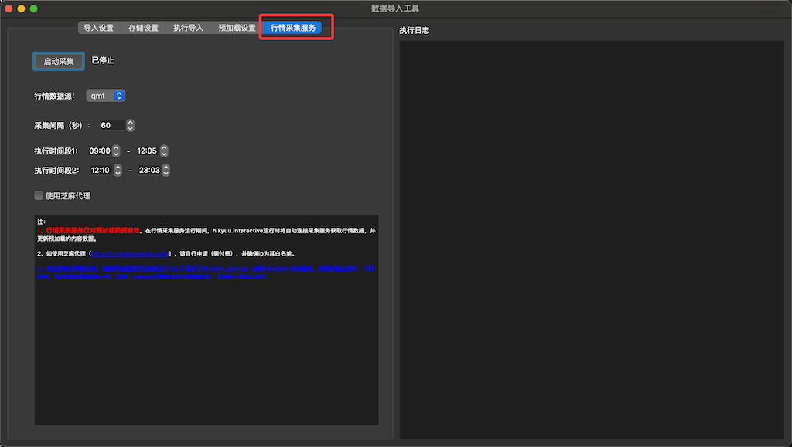
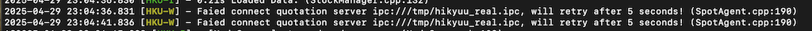

dataserver
============

pip 安装的，可在 shell 下直接执行 dataserver 命令。或使用 Python 执行安装目录下 gui/dataserver.py 文件。

::
    
    dataserver 可附带参数，默认参数如下：

    参数1: "tcp://0.0.0.0/9201"  （注：通常用于修改端口号, 前面不用修改）
    
    参数2: 2  （接收行情服务时的工作线程数）

dataserver 需要配合行情采集服务使用，可以和行情采集服务所在机器在同一台机器上运行，也可以在两台机器上分别运行，但需要配置好网络。

启动行情采集数据服务如下，如下命令行等其他方式，请查看安装目录下 gui 子目录下相关 python 文件

和行情采集在同一台服务器上运行时，通常不用修改配置。如果不在同一机器上，需要调整 dataserver 所在机器相关配置：

::

    如，行情采集运行在 A 机器（IP地址为： 192.168.1.2），dataserver 运行在 B 机器（IP地址：192.168.1.3），则修改 B 机器用户目录下的 hikyuu.ini 文件：

    修改 [hikyuu] 节下的 quotation_server 参数为：

    [hikyuu]
    tmpdir = /Users/fasiondog/stock/tmp
    datadir = /Users/fasiondog/stock
    quotation_server = tcp://192.168.1.2:9200

如正常连接至行情采集服务，则会显示如下字样：

::

    Ready to receive quotation from ....

如连接行情采集服务失败，将持续打印连接失败信息，如：

在 hikyuu 其他程序中使用，调用 get_data_from_buffer_server 从 B 机器获取缓存的实时数据：

.. py:function:: get_data_from_buffer_server(addr: str, stklist: list, ktype: Query.KType)
          
    :param str addr: 数据服务器地址
    :param list stklist: 需要获取数据的股票列表
    :param Query.KType ktype: 数据类型

如:

::

    get_data_from_buffer_server("tcp://192.168.1.3:9201", ["sh000001", "sh000002"], KQuery.DAY)

使用此方法的其他 hikyuu 进程，可以通过 load_hikyuu 中的参数 “start_spot” 或 Strategy.start 方法参数，禁用自己的行情接收，节省机器资源占用。