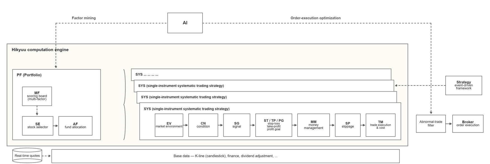
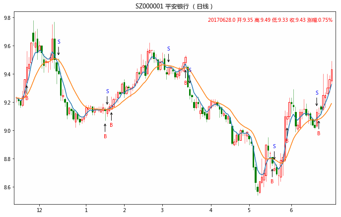

<p align="center">
  <b>English</b> | <a href="readme.zh.md">简体中文</a>
</p>

---

     

## ⚡ Hikyuu Ultra-Fast Quant Framework

> An open-source, ultra-fast quantitative trading research framework written in C++/Python, focused on
> strategy analysis, backtesting and the extension to live trading (built for the China A-share market).
> Its core capabilities cover four dimensions: **trading model development · an extremely fast computation
> engine · an efficient backtesting system · live-trading extension**.

Built on mature systematic trading concepts, the framework decomposes quantitative analysis into
independent modular components: **market environment assessment, system validity conditions, signal
generators, stop-loss / take-profit models, money management models, profit goal estimation,
slippage simulation algorithms, multi-factor modeling, portfolio analysis and fund allocation**. You can
combine these components freely to build your own strategy library, verify the stability and effectiveness
of your strategies through simulated backtesting, and complete quantitative research and data analysis.
The framework also provides extension interfaces, so developers can build and connect their own
compliant third-party trading interfaces (such as official compliant terminals like QMT), and adapt the
system to individual requirements.

> ⚠️ **Disclaimer**: This project is an open-source financial technology research tool. It is intended
> for personal study, academic research and data analysis only. It does not constitute any investment
> advice or trading guidance, and it does not provide or embed any securities trading service. The
> framework only offers generic interface extension capability; users are advised to connect only to
> compliant trading terminals provided by licensed institutions. Any trading interface, extension or
> actual operation added or developed by the user is entirely at the user's own risk and legal
> responsibility. Connecting to illegal trading channels or using the framework for non-compliant
> trading scenarios is strictly prohibited.

---

## 📊 Key Metrics

<p align="center">
  <table>
    <tr>
      <td align="center" width="33%">
        <strong><code>⚡ 166ms</code></strong><br>
        <sub>Sum over 19.13 million K-line bars after warm-up (AMD 7950x)</sub>
      </td>
      <td align="center" width="33%">
        <strong><code>🧩 10+</code></strong><br>
        <sub>Core strategy components · freely composable asset library</sub>
      </td>
      <td align="center" width="33%">
        <strong><code>💾 4 types</code></strong><br>
        <sub>Storage backends (HDF5 / MySQL / ClickHouse / SQLite)</sub>
      </td>
    </tr>
  </table>
</p>

---

## 🔗 Quick Links

| Item                              | Link                                                                                                                                          |
| --------------------------------- | --------------------------------------------------------------------------------------------------------------------------------------------- |
| 🏠 **Project home page**    | [https://hikyuu.org/](https://hikyuu.org/)                                                                                                     |
| 📚 **Documentation**        | [https://hikyuu.readthedocs.io/en/latest/index.html](https://hikyuu.readthedocs.io/en/latest/index.html)                                       |
| 🚀 **Getting started**      | [Jupyter Notebook tutorial series](https://nbviewer.org/github/fasiondog/hikyuu/blob/master/hikyuu/examples/notebook/000-Index.ipynb?flush_cache=True) |
| 🧰 **Strategy component library** | [https://gitee.com/fasiondog/hikyuu_hub](https://gitee.com/fasiondog/hikyuu_hub)                                                        |
| 🐧 **Ubuntu VM image**      | [Baidu Netdisk (extraction code: ht8j)](https://pan.baidu.com/s/1CAiUWDdgV0c0VhPpe4AgVw?pwd=ht8j)                                             |

---

## ⚡ Quick Start (run your first backtest)

### Requirements

- **Python >= 3.10** (3.9 and below are no longer supported for pip installation since 2.8.0)
- Windows / Linux / macOS (Linux: Ubuntu 24.04+)
- Main dependencies are installed automatically: `numpy>=2.0`, `pandas>=2.3.0`, `matplotlib>=3.5.0`,
  `PySide6>=6.8.0`, `tables>=3.9.0`, and others

### Step 1: Install

```bash
pip install hikyuu
```

If the download is slow (for users in China), use a mirror:

```bash
pip install hikyuu -i https://pypi.tuna.tsinghua.edu.cn/simple
```

### Step 2: Import market data

Import historical market data with either method:

```bash
# Graphical interface (recommended for first use; it generates the configuration file)
HikyuuTDX

# Command line (requires having run HikyuuTDX once to generate the configuration)
importdata
```

### Step 3: Run your first backtest

```python
from hikyuu.interactive import *

# Create a simulated trading account for backtesting, with initial capital of 300,000
my_tm = crtTM(init_cash=300000)

# Create a signal indicator (fast line: 5-day EMA; slow line: 10-day EMA)
# Buy when the fast line crosses above the slow line, sell otherwise
my_sg = SG_Flex(EMA(CLOSE(), n=5), slow_n=10)

# Buy a fixed 1000 shares each time
my_mm = MM_FixedCount(1000)

# Create the trading system and run it
sys = SYS_Simple(tm=my_tm, sg=my_sg, mm=my_mm)
sys.run(sm['sz000001'], Query(-150))
```

> 📖 See the [Jupyter Notebook tutorial series](https://nbviewer.org/github/fasiondog/hikyuu/blob/master/hikyuu/examples/notebook/000-Index.ipynb?flush_cache=True)
> for the complete example.

### ❓ FAQ

| Symptom                                                     | Solution                                                                              |
| :---------------------------------------------------------- | :------------------------------------------------------------------------------------ |
| `pip install` on Windows hangs while downloading PyQt / PySide6 | Use the Tsinghua mirror: `pip install hikyuu -i https://pypi.tuna.tsinghua.edu.cn/simple` |
| `HikyuuTDX` GUI cannot import data                          | Use the `importdata` command instead (run the GUI once first to generate the config)   |
| Errors about a missing hdf5 / dll                           | Run `pip install tables` to reinstall HDF5 support                                    |
| Build tool for **building from source**               | This project uses **xmake**, not cmake                                          |

> 💡 For more questions see the [documentation](https://hikyuu.readthedocs.io/en/latest/index.html),
> or [open an issue on Gitee](https://gitee.com/fasiondog/hikyuu/issues).

---

## 🚀 Why Hikyuu?

> Powerful features for your quantitative trading research

### 💹 Flexible composition: build a categorized strategy asset library

Hikyuu provides a lightweight abstraction of systematic trading methods, covering **market environment
assessment, system validity conditions, signal indicators, stop-loss / take-profit strategies, money
management, profit goals, slippage algorithms, trading object selection and fund allocation**. You can
build your own strategy library from these components, combine and backtest them efficiently, and focus
on the effect and impact of a single module while exploring strategies, which greatly improves research
productivity.

<p align="center">
  
</p>

### 🚀 Extreme performance: build your own quant application with ease

The project consists of three parts: a **high-performance C++ core library**, the **Python interface
layer (hikyuu)**, and the **interactive exploration tool**.

- **Measured on an AMD 7950x**: loading the full A-share market (19.13 million daily K-line bars) and
  computing and summing the 20-day moving average for the first time takes only **6 seconds**; once the
  data is warm, the same operation takes only **166 milliseconds**.
  > [📊 Performance benchmark details](https://mp.weixin.qq.com/s?__biz=MzkwMzY1NzYxMA==&mid=2247483768&idx=1&sn=33e40aa9633857fa7b4c7ded51c95ae7&chksm=c093a09df7e4298b3f543121ba01334c0f8bf76e75c643afd6fc53aea1792ebb92de9a32c2be&mpshare=1&scene=23&srcid=05297ByHT6DEv6XAmyje1oOr&sharer_shareinfo=b38f5f91b4efd8fb60303a4ef4774748&sharer_shareinfo_first=b38f5f91b4efd8fb60303a4ef4774748#rd)
  > (Chinese article)
  >
- **C++ core library**: ships with a complete strategy framework, native multi-threading and multi-core
  acceleration, leaving room to scale for very high computing demands. The core library can also be used
  standalone, helping developers build custom quantitative tools quickly.
- **Python interface layer (hikyuu)**: a lightweight wrapper around the C++ core with TA-Lib integrated;
  converts seamlessly to and from numpy and pandas, so it plugs into the mainstream Python data analysis
  ecosystem.
- **hikyuu.interactive**: the interactive exploration tool, with built-in visualization of candlesticks,
  indicators and signals, suitable for rapid strategy validation and backtest analysis.

### 🍳 Concise syntax: explore strategies faster and more freely

Both **object-oriented** and **command-line** styles are supported. Especially during strategy exploration,
the command-line style is minimal and expressive, letting you validate ideas and iterate faster.

### 🔐 Self-controlled: build your own cloud quant platform

Combining **Python + Jupyter** with a cloud server gives you a fully self-controlled cloud quant platform.
Once deployed, access it anywhere (phone, tablet or computer) and turn new ideas into practice quickly. It
also integrates with mature AI and data analysis tools such as **numpy, scipy, pandas and TensorFlow** for
building intelligent quantitative systems. You can customize the interface or deploy it as a service as
needed.

### 🎁 Modular and extensible data storage

Four storage backends are supported: **local HDF5, MySQL, ClickHouse and SQLite**, with HDF5 as the
default (small files, fast reads and writes, easy backups). As of April 21, 2017, the Shanghai market
daily data file was only 149 MB and the Shenzhen market 184 MB, while the complete 5-minute bar data was
under 2 GB. A plugin extends storage to ClickHouse, which reads and writes faster than HDF5 and uses far
less space than MySQL, making it a better fit for minute-level and higher-frequency data.

### 🔓 Open source and transparent, with data under your control

Released under the **Apache 2.0** license, with fully auditable source code. Core data and strategies stay
entirely under your local control; the C++ core library can be used standalone, so you can build your own
client tools without worrying about third-party platform restrictions.

---

## 💻 Concise API design

A complete quantitative strategy backtest system takes only a few lines of code. Hikyuu offers a
straightforward API that makes strategy development more productive.

```python
from hikyuu.interactive import *

# Create a simulated trading account for backtesting, with initial capital of 300,000
my_tm = crtTM(init_cash=300000)

# Create a signal indicator (fast line: 5-day EMA; slow line: 10-day EMA of the 5-day EMA)
# Buy when the fast line crosses above the slow line, sell otherwise
my_sg = SG_Flex(EMA(CLOSE(), n=5), slow_n=10)

# Buy a fixed 1000 shares each time
my_mm = MM_FixedCount(1000)

# Create the trading system and run it
sys = SYS_Simple(tm=my_tm, sg=my_sg, mm=my_mm)
sys.run(sm['sz000001'], Query(-150))
```

<p align="center">
  
</p>

> 📖 **Complete example**: [Jupyter Notebook tutorial series](https://nbviewer.org/github/fasiondog/hikyuu/blob/master/hikyuu/examples/notebook/000-Index.ipynb?flush_cache=True)

---

## 🏗️ Core components of the systematic trading architecture

> Rigorously architected around systematic trading concepts; every component can be replaced and combined freely

| Layer                        | Component                        | Description                                  |
| :--------------------------- | :------------------------------- | :------------------------------------------- |
| **Portfolio layer**    | <b> · PortfolioPF</a>           | Portfolio - scheduling of multiple systems   |
|                              | <b> · SelectorSE</a>            | System selector - system strategy filtering  |
|                              | <b> · AllocateFundsAF</a>       | Fund allocation - allocation across systems  |
|                              | <b> · MultiFactorMF</a>         | Multi-factor model - factor scoring and ranking |
| **Trading system SYS** | <b> · EnvironmentEV</a>         | Environment - validity of the market regime  |
|                              | <b> · ConditionCN</a>           | Condition - conditions where the system applies |
|                              | <b> · SignalSG</a>              | Signal - generates buy / sell signals        |
|                              | <b> · Stoploss/StopprofitST</a> | Stop-loss / take-profit - risk-control exit  |
|                              | <b> · MoneyManagerMM</a>        | Money management - buy / sell size control   |
|                              | <b> · ProfitGoalPG</a>          | Profit goal - exit when the target is reached |
|                              | <b> · SlippageSP</b>            | Slippage - price simulation in backtesting   |
| **Trade management**   | <b> · TradeManagerTM</a>        | Trade manager - account cash and positions   |
|                              | <b> · OrderBrokerOB</a>         | Order execution - broker connection for live trading |
| **Data layer**         | <b> · StockManagerSM</a>        | Security manager - unified StockManager      |
|                              | <b> · KDataKD</a>               | K-line data - KData price / volume series    |
|                              | <b> · QueryQ</a>                | Query - time range filtering                 |

---

## 📂 Browse the source

> **Star ⭐** and **Fork 🍴** are welcome, as are contributions

| Platform                     | Link                                                                      | Recommended |
| :--------------------------- | :------------------------------------------------------------------------ | :---------- |
| **Gitee (码云)**       | [https://gitee.com/fasiondog/hikyuu](https://gitee.com/fasiondog/hikyuu)   | ✅ Recommended |
| **GitHub**             | [https://github.com/fasiondog/hikyuu](https://github.com/fasiondog/hikyuu) |             |
| **GitCode**            | [https://gitcode.com/hikyuu/hikyuu](https://gitcode.com/hikyuu/hikyuu)     |             |

---

## ❤️ Sponsorship

Sponsorship helps keep Hikyuu moving forward. The channels below are Alipay / WeChat Pay (China) and
Zsxq; see the donation page for the plans and the benefits attached to each one.

<p align="center">
  
</p>

| Plan                        | Description                                                                            | Method                | Link                                        |
| :-------------------------- | :------------------------------------------------------------------------------------- | :-------------------- | :------------------------------------------ |
| ☕ **Buy me a coffee** | ¥30 · one-time support (includes historical daily data)                              | Alipay                | [Donate](https://pay.ldxp.cn/item/gflv3v)   |
| 📅 **180-day subscription** | ¥50 · half-year subscription (includes historical daily data)                        | Alipay                | [Donate](https://pay.ldxp.cn/item/du4h8s)   |
| 🗓️ **365-day subscription** | ¥100 · one-year subscription (includes historical daily/minute/hour/tick data)       | Alipay                | [Donate](https://pay.ldxp.cn/item/ehbz9b)   |
| 🌌 **Join Zsxq**      | ¥300/year · half price to renew · 3 devices · private WeChat group and component library (includes historical daily/minute/hour/tick data) | WeChat / Zsxq app | [Join](https://t.zsxq.com/YSATD)            |

> 🎁 **Donation plans and benefits**: [https://hikyuu.readthedocs.io/en/latest/vip/donate-plan.html](https://hikyuu.readthedocs.io/en/latest/vip/donate-plan.html)

Support group for sponsors only (when joining, please note: Hikyuu subscription)

<p align="center">
  
</p>

## 🌟 How you can help

Community contributions are welcome:

- 🐛 Test and report bugs
- 📝 Write documentation
- 🔧 Develop new features
- 🎨 Improve the website

> 💡 **Please contribute by opening an issue on GitHub / Gitee / GitCode**

---

## 📦 Dependencies

The C++ core of Hikyuu depends directly on the following open-source projects (indirect dependencies and
Python-side dependencies are not listed; see requirements.txt for the Python dependencies). Thanks to all
the open-source authors for their contributions 🙏

| Name           | Project                                                                                 | License                                                                                 |
| :------------- | :-------------------------------------------------------------------------------------- | :-------------------------------------------------------------------------------------- |
| xmake          | [https://github.com/xmake-io/xmake](https://github.com/xmake-io/xmake)                   | Apache 2.0                                                                              |
| hdf5           | [https://github.com/HDFGroup/hdf5](https://github.com/HDFGroup/hdf5)                     | [hdf5 license](https://github.com/HDFGroup/hdf5?tab=License-1-ov-file#License-1-ov-file) |
| mysql(client)  | [https://github.com/mysql/mysql-server](https://github.com/mysql/mysql-server)           | [mysql license](https://github.com/mysql/mysql-server?tab=License-1-ov-file#readme)      |
| fmt            | [https://github.com/fmtlib/fmt](https://github.com/fmtlib/fmt)                           | [fmt license](https://github.com/fmtlib/fmt?tab=License-1-ov-file#readme)                |
| spdlog         | [https://github.com/gabime/spdlog](https://github.com/gabime/spdlog)                     | MIT                                                                                     |
| sqlite         | [https://www.sqlite.org/](https://www.sqlite.org/)                                       | [sqlite license](https://www.sqlite.org/copyright.html)                                  |
| flatbuffers    | [https://github.com/google/flatbuffers](https://github.com/google/flatbuffers)           | Apache 2.0                                                                              |
| nng            | [https://github.com/nanomsg/nng](https://github.com/nanomsg/nng)                         | MIT                                                                                     |
| nlohmann_json  | [https://github.com/nlohmann/json](https://github.com/nlohmann/json)                     | MIT                                                                                     |
| boost          | [https://www.boost.org/](https://www.boost.org/)                                         | [Boost Software License](https://www.boost.org/users/license.html)                       |
| python         | [https://www.python.org/](https://www.python.org/)                                       | [Python license](https://docs.python.org/3/license.html)                                 |
| pybind11       | [https://github.com/pybind/pybind11](https://github.com/pybind/pybind11)                 | [pybind11 license](https://github.com/pybind/pybind11?tab=License-1-ov-file#readme)      |
| gzip-hpp       | [https://github.com/mapbox/gzip-hpp](https://github.com/mapbox/gzip-hpp)                 | BSD-2-Clause license                                                                    |
| doctest        | [https://github.com/doctest/doctest](https://github.com/doctest/doctest)                 | MIT                                                                                     |
| ta-lib         | [https://github.com/TA-Lib/ta-lib](https://github.com/TA-Lib/ta-lib)                     | BSD-3-Clause license                                                                    |
| clickhouse     | [https://github.com/ClickHouse/ClickHouse](https://github.com/ClickHouse/ClickHouse)     | Apache 2.0                                                                              |
| xxhash         | [https://github.com/Cyan4973/xxHash](https://github.com/Cyan4973/xxHash)                 | BSD 2-Clause License                                                                    |
| utf8proc       | [https://github.com/JuliaStrings/utf8proc](https://github.com/JuliaStrings/utf8proc)     | MIT                                                                                     |
| arrow          | [https://github.com/apache/arrow](https://github.com/apache/arrow)                       | Apache 2.0                                                                              |
| eigen          | [https://gitlab.com/libeigen/eigen](https://gitlab.com/libeigen/eigen)                   | Apache 2.0                                                                              |
| mimalloc       | [https://github.com/microsoft/mimalloc](https://github.com/microsoft/mimalloc)           | MIT                                                                                     |

---

<p align="center">
  <table>
    <tr>
      <td align="center" width="33%">
        <a href="https://hikyuu.readthedocs.io/en/latest/index.html">📚 Documentation</a>
      </td>
      <td align="center" width="33%">
        <a href="https://gitee.com/fasiondog/hikyuu">💻 Gitee</a>
      </td>
      <td align="center" width="33%">
        <a href="https://github.com/fasiondog/hikyuu">🐙 GitHub</a>
      </td>
    </tr>
  </table>
</p>

<p align="center">
  Released under the <a href="https://github.com/fasiondog/hikyuu/blob/master/LICENSE">Apache License V2</a> · maintained by <a href="https://github.com/fasiondog">fasiondog</a>
</p>
