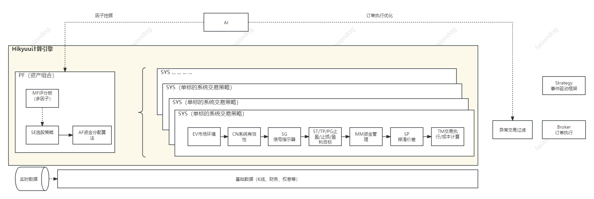
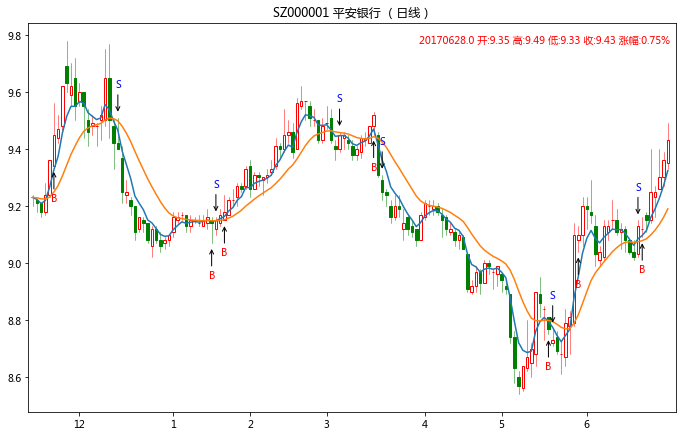

---

     

## ⚡ Hikyuu Ultra-Fast Quant Framework

> 基于 C++/Python 开发的开源超高速量化交易研究框架，聚焦策略分析、回测与实盘能力扩展（深度适配国内 A 股市场）。核心能力覆盖四大维度：**交易模型研发 · 极速计算引擎 · 高效回测体系 · 实盘交易拓展**。

框架依托成熟的系统化交易研究理念，将量化分析体系拆解为 **市场环境研判、策略生效条件判定、信号指标解析、盈亏风控模型、资金配比模型、收益目标测算、滑点模拟算法、多因子建模、投资组合分析、资金分配** 等独立模块化组件。用户可自由组合模块、搭建专属策略模型库，通过模拟回测验证策略稳定性与有效性，完成量化策略研究与数据分析工作。同时框架预留拓展接口，支持开发者自主开发、对接合规的第三方交易接口（如 QMT 等官方合规终端接口），满足个性化技术拓展与私有适配需求。

> ⚠️ **免责声明**：本项目为开源金融技术研究工具，仅供个人学习、学术研究与数据分析使用，不构成任何投资建议与交易指导，不提供、不内置证券交易服务。框架仅提供通用接口拓展能力，仅建议用户对接持牌机构提供的合规交易终端接口；用户自主新增、对接各类交易接口、开发拓展功能以及对应的实操行为，均由用户自行承担全部风险与法律责任，严禁对接非法交易通道、用于违规交易场景。

---

## 📊 关键数据

<p align="center">
  <table>
    <tr>
      <td align="center" width="33%">
        <strong><code>⚡ 166ms</code></strong><br>
        <sub>预热后 1913 万 K 线求和耗时（AMD 7950x）</sub>
      </td>
      <td align="center" width="33%">
        <strong><code>🧩 10+</code></strong><br>
        <sub>核心策略组件 · 自由组合构建资产库</sub>
      </td>
      <td align="center" width="33%">
        <strong><code>💾 4 种</code></strong><br>
        <sub>存储方式（HDF5 / MySQL / ClickHouse / SQLite）</sub>
      </td>
    </tr>
  </table>
</p>

---

## 🔗 快速导航

| 项目                          | 链接                                                                                                                                           |
| ----------------------------- | ---------------------------------------------------------------------------------------------------------------------------------------------- |
| 🏠**项目首页**          | [https://hikyuu.org/](https://hikyuu.org/)                                                                                                      |
| 📚**帮助文档**          | [https://hikyuu.readthedocs.io/zh-cn/latest/index.html](https://hikyuu.readthedocs.io/zh-cn/latest/index.html)                                  |
| 🚀**入门示例**          | [Jupyter Notebook 系列教程](https://nbviewer.org/github/fasiondog/hikyuu/blob/master/hikyuu/examples/notebook/000-Index.ipynb?flush_cache=True) |
| 🧰**策略部件库**        | [https://gitee.com/fasiondog/hikyuu_hub](https://gitee.com/fasiondog/hikyuu_hub)                                                                |
| 🐧**Ubuntu 虚拟机环境** | [百度网盘下载（提取码: ht8j）](https://pan.baidu.com/s/1CAiUWDdgV0c0VhPpe4AgVw?pwd=ht8j)                                                        |

---

## ⚡ 快速开始（跑通第一个回测）

### 环境要求

- **>= Python 3.10**（3.9 及以下自 2.8.0 起不再支持 pip 安装）
- 支持 Windows / Linux / macOS （Linux为Ubuntu24.04+）
- 主要依赖会自动安装：`numpy>=2.0`、`pandas>=2.3.0`、`matplotlib>=3.5.0`、`PySide6>=6.8.0`、`tables>=3.9.0` 等

### 第 1 步：安装

```bash
pip install hikyuu
```

国内用户若下载缓慢，可换用镜像源：

```bash
pip install hikyuu -i https://pypi.tuna.tsinghua.edu.cn/simple
```

### 第 2 步：导入行情数据

任选一种方式导入历史行情数据：

```bash
# 图形界面（推荐首次使用，会自动生成配置文件）
HikyuuTDX

# 命令行（需先运行过一次 HikyuuTDX 生成配置）
importdata
```

### 第 3 步：跑通第一个回测

```python
from hikyuu.interactive import *

# 创建模拟交易账户进行回测，初始资金 30 万
my_tm = crtTM(init_cash=300000)

# 创建信号指示器（以 5 日 EMA 为快线，其 10 日 EMA 为慢线）
# 快线向上穿越慢线时买入，反之卖出
my_sg = SG_Flex(EMA(CLOSE(), n=5), slow_n=10)

# 固定每次买入 1000 股
my_mm = MM_FixedCount(1000)

# 创建交易系统并运行
sys = SYS_Simple(tm=my_tm, sg=my_sg, mm=my_mm)
sys.run(sm['sz000001'], Query(-150))
```

> 📖 完整示例参见 [Jupyter Notebook 系列教程](https://nbviewer.org/github/fasiondog/hikyuu/blob/master/hikyuu/examples/notebook/000-Index.ipynb?flush_cache=True)

### ❓ 上手常见问题

| 现象                                              | 解决办法                                                                     |
| :------------------------------------------------ | :--------------------------------------------------------------------------- |
| Windows 下`pip install` 卡在下载 PyQt / PySide6 | 换清华源：`pip install hikyuu -i https://pypi.tuna.tsinghua.edu.cn/simple` |
| `HikyuuTDX` 图形界面无法导入数据                | 改用命令行`importdata`（需先运行过一次 GUI 以生成配置文件）                |
| 提示缺少 hdf5 / dll 相关错误                      | 执行`pip install tables` 重新安装 HDF5 支持                                |
| **从源码构建**时的构建工具                  | 本项目使用**xmake**，不是 cmake                                        |

> 💡 更多问题请查 [帮助文档](https://hikyuu.readthedocs.io/zh-cn/latest/index.html)，或在 [Gitee 提交 issue](https://gitee.com/fasiondog/hikyuu/issues)。

---

## 🚀 为什么选择 Hikyuu？

> 强大的功能特性，助力您的量化交易研究

### 💹 组合灵活，分类构建策略资产库

对系统化交易方法进行轻量化抽象，涵盖 **市场环境判断、系统有效条件、信号指示器、止损 / 止盈策略、资金管理、盈利目标、滑点算法、交易对象筛选、资金分配** 等核心组件。你可以基于这些组件自由搭建专属策略库，灵活组合、高效回测，并在策略探索时专注于单一模块的效果与影响，大幅提升研究效率。

<p align="center">
  
</p>

### 🚀 极致性能，轻松构建专属量化应用

项目由三大部分构成：**高性能 C++ 核心库**、**Python 接口层（hikyuu）**、以及**交互式探索工具**。

- **AMD 7950x 实测**：A 股全市场 1913 万日 K 线，首次加载 + 计算 20 日均线并求和，仅需 **6 秒**；数据预热后，同操作耗时仅需 **166 毫秒**。
  > [📊 性能实测详情](https://mp.weixin.qq.com/s?__biz=MzkwMzY1NzYxMA==&mid=2247483768&idx=1&sn=33e40aa9633857fa7b4c7ded51c95ae7&chksm=c093a09df7e4298b3f543121ba01334c0f8bf76e75c643afd6fc53aea1792ebb92de9a32c2be&mpshare=1&scene=23&srcid=05297ByHT6DEv6XAmyje1oOr&sharer_shareinfo=b38f5f91b4efd8fb60303a4ef4774748&sharer_shareinfo_first=b38f5f91b4efd8fb60303a4ef4774748#rd)
  >
- **C++ 核心库**：内置完整策略框架，原生支持多线程与多核加速，为超高算力场景预留扩展空间；核心库可独立剥离使用，帮助开发者快速构建自定义量化工具。
- **Python 接口层（hikyuu）**：对 C++ 核心进行轻量化封装，集成 TA-Lib，支持与 numpy、pandas 无缝互转，轻松对接主流 Python 数据分析生态。
- **hikyuu.interactive**：交互式探索工具，内置 K 线、指标、信号可视化能力，适合快速策略验证与回测分析。

### 🍳 语法简洁，策略探索更高效自由

同时支持 **面向对象** 与 **命令行** 两种编程范式。尤其在策略探索阶段，命令行风格语法极简、表达直观，让你更快验证想法、迭代策略。

### 🔐 自主可控，搭建专属云量化平台

结合 **Python + Jupyter** 与云服务器，即可搭建完全自主可控的云量化平台。部署后随时随地访问（手机、平板、电脑均可使用），快速落地新想法。同时可无缝对接 **numpy、scipy、pandas、TensorFlow** 等成熟 AI 与数据分析工具，构建智能量化系统。也可按需自定义界面、实现服务化部署。

### 🎁 模块化可扩展数据存储

目前支持 **本地 HDF5、MySQL、ClickHouse、SQLite** 四种存储方式，默认采用 HDF5（文件体积小、读写速度快、备份便捷）。截至 2017 年 4 月 21 日，沪市日线数据文件仅 149MB，深市 184MB，5 分钟线数据整体小于 2GB。通过插件可扩展 ClickHouse 存储，其读写速度优于 HDF5、空间占用远低于 MySQL，更适配分钟级及以下粒度的高频数据存储。

### 🔓 开源透明，数据安全可控

**Apache 2.0** 开源协议，代码透明审计无忧。核心数据、策略全量本地可控，C++ 核心库可独立剥离使用，自由打造专属客户端工具，无需担心第三方平台限制。

---

## 💻 简洁的 API 设计

几行代码即可创建一个完整的量化策略回测系统。Hikyuu 提供直观的 API，让策略开发更高效。

```python
from hikyuu.interactive import *

# 创建模拟交易账户进行回测，初始资金30万
my_tm = crtTM(init_cash=300000)

# 创建信号指示器（以5日EMA为快线，5日EMA自身的10日EMA作为慢线）
# 快线向上穿越慢线时买入，反之卖出
my_sg = SG_Flex(EMA(CLOSE(), n=5), slow_n=10)

# 固定每次买入1000股
my_mm = MM_FixedCount(1000)

# 创建交易系统并运行
sys = SYS_Simple(tm=my_tm, sg=my_sg, mm=my_mm)
sys.run(sm['sz000001'], Query(-150))
```

<p align="center">
  
</p>

> 📖 **完整示例参见**：[Jupyter Notebook 系列教程](https://nbviewer.jupyter.org/github/fasiondog/hikyuu/blob/master/hikyuu/examples/notebook/000-Index.ipynb?flush_cache=True)

---

## 🏗️ 交易系统化架构核心组件

> 遵循系统化交易理念严谨架构，每个组件可独立替换、自由组合

| 层级                   | 组件                             | 说明                             |
| :--------------------- | :------------------------------- | :------------------------------- |
| **投资组合层**   | <b> · PortfolioPF</a>           | 投资组合 - 多系统的策略调度      |
|                        | <b> · SelectorSE</a>            | 系统对象选择 - 系统策略筛选      |
|                        | <b> · AllocateFundsAF</a>       | 资金分配 - 多系统的资金分配      |
|                        | <b> · MultiFactorMF</a>         | 多因子模型 - 因子评分与排序      |
| **交易系统 SYS** | <b> · EnvironmentEV</a>         | 市场环境判断 - 大盘环境有效性    |
|                        | <b> · ConditionCN</a>           | 系统有效条件 - 系统适用条件      |
|                        | <b> · SignalSG</a>              | 信号指示器 - 产生买卖信号        |
|                        | <b> · Stoploss/StopprofitST</a> | 止损 / 止盈 - 风险控制退出       |
|                        | <b> · MoneyManagerMM</a>        | 资金管理 - 买卖数量控制          |
|                        | <b> · ProfitGoalPG</a>          | 盈利目标 - 目标达成退出          |
|                        | <b> · SlippageSP</a>            | 移滑价差 - 回测价格模拟          |
| **交易管理**     | <b> · TradeManagerTM</a>        | 交易管理 - 账户资金与持仓记录    |
|                        | <b> · OrderBrokerOB</a>         | 订单执行 - 实盘下单 broker 对接  |
| **数据层**       | <b> · StockManagerSM</a>        | 证券管理 - StockManager 统一管理 |
|                        | <b> · KDataKD</a>               | K 线数据 - KData 量价序列        |
|                        | <b> · QueryQ</a>                | 数据查询 - Query 时间范围筛选    |

---

## 📂 浏览源码

> 欢迎 **Star ⭐**、**Fork 🍴**，参与贡献

| 平台                 | 链接                                                                      | 推荐    |
| :------------------- | :------------------------------------------------------------------------ | :------ |
| **码云 Gitee** | [https://gitee.com/fasiondog/hikyuu](https://gitee.com/fasiondog/hikyuu)   | ✅ 推荐 |
| **GitHub**     | [https://github.com/fasiondog/hikyuu](https://github.com/fasiondog/hikyuu) |         |
| **GitCode**    | [https://gitcode.com/hikyuu/hikyuu](https://gitcode.com/hikyuu/hikyuu)     |         |

---

## ❤️ 感谢捐赠，让 Hikyuu 走得更远

<p align="center">
  
</p>

| 方案                       | 说明                                                                                            | 方式               | 链接                                       |
| :------------------------- | :---------------------------------------------------------------------------------------------- | :----------------- | :----------------------------------------- |
| ☕**请作者喝杯咖啡** | ¥30 · 一次性的小小支持(赠历史日线)                                                            | 支付宝             | [前往捐赠](https://pay.ldxp.cn/item/gflv3v) |
| 📅**订阅 180 天**    | ¥50 · 半年期订阅权益(赠历史日线)                                                              | 支付宝             | [前往捐赠](https://pay.ldxp.cn/item/du4h8s) |
| 🗓️**订阅 365 天**  | ¥100 · 全年期订阅权益(赠历史日/分/时/笔数据)                                                  | 支付宝             | [前往捐赠](https://pay.ldxp.cn/item/ehbz9b) |
| 🌌**加入知识星球**   | ¥300/年 · 首年300元，续费半价。3台设备登录 · 专属微信群及策略部件库，(赠历史日/分/时/笔数据) | 微信 / 知识星球APP | [前往加入](https://t.zsxq.com/YSATD)        |

> 🎁 **捐赠计划与附赠详见**：[https://hikyuu.readthedocs.io/zh-cn/latest/vip/donate-plan.html](https://hikyuu.readthedocs.io/zh-cn/latest/vip/donate-plan.html)

捐赠用户支持群（仅接受捐赠用户，入群请注明： Hikyuu 订阅）

<p align="center">
  
</p>

## 🌟 需要的帮助

欢迎社区成员一起参与贡献：

- 🐛 测试反馈 BUG
- 📝 编写文档
- 🔧 开发新功能
- 🎨 网站优化

> 💡 **建议通过在Github/Gitee/Gitcode开 issue 方式来贡献以上内容**

---

## 📦 项目依赖说明

Hikyuu 的 C++ 核心模块直接依赖以下开源项目（间接依赖项及 Python 侧依赖未列出；Python 依赖可参考 requirements.txt 文件）。在此感谢所有开源作者的贡献 🙏

| 名称          | 项目地址                                                                            | License                                                                                 |
| :------------ | :---------------------------------------------------------------------------------- | :-------------------------------------------------------------------------------------- |
| xmake         | [https://github.com/xmake-io/xmake](https://github.com/xmake-io/xmake)               | Apache 2.0                                                                              |
| hdf5          | [https://github.com/HDFGroup/hdf5](https://github.com/HDFGroup/hdf5)                 | [hdf5 license](https://github.com/HDFGroup/hdf5?tab=License-1-ov-file#License-1-ov-file) |
| mysql(client) | [https://github.com/mysql/mysql-server](https://github.com/mysql/mysql-server)       | [mysql license](https://github.com/mysql/mysql-server?tab=License-1-ov-file#readme)      |
| fmt           | [https://github.com/fmtlib/fmt](https://github.com/fmtlib/fmt)                       | [fmt license](https://github.com/fmtlib/fmt?tab=License-1-ov-file#readme)                |
| spdlog        | [https://github.com/gabime/spdlog](https://github.com/gabime/spdlog)                 | MIT                                                                                     |
| sqlite        | [https://www.sqlite.org/](https://www.sqlite.org/)                                   | [sqlite license](https://www.sqlite.org/copyright.html)                                  |
| flatbuffers   | [https://github.com/google/flatbuffers](https://github.com/google/flatbuffers)       | Apache 2.0                                                                              |
| nng           | [https://github.com/nanomsg/nng](https://github.com/nanomsg/nng)                     | MIT                                                                                     |
| nlohmann_json | [https://github.com/nlohmann/json](https://github.com/nlohmann/json)                 | MIT                                                                                     |
| boost         | [https://www.boost.org/](https://www.boost.org/)                                     | [Boost Software License](https://www.boost.org/users/license.html)                       |
| python        | [https://www.python.org/](https://www.python.org/)                                   | [Python license](https://docs.python.org/3/license.html)                                 |
| pybind11      | [https://github.com/pybind/pybind11](https://github.com/pybind/pybind11)             | [pybind11 license](https://github.com/pybind/pybind11?tab=License-1-ov-file#readme)      |
| gzip-hpp      | [https://github.com/mapbox/gzip-hpp](https://github.com/mapbox/gzip-hpp)             | BSD-2-Clause license                                                                    |
| doctest       | [https://github.com/doctest/doctest](https://github.com/doctest/doctest)             | MIT                                                                                     |
| ta-lib        | [https://github.com/TA-Lib/ta-lib](https://github.com/TA-Lib/ta-lib)                 | BSD-3-Clause license                                                                    |
| clickhouse    | [https://github.com/ClickHouse/ClickHouse](https://github.com/ClickHouse/ClickHouse) | Apache 2.0                                                                              |
| xxhash        | [https://github.com/Cyan4973/xxHash](https://github.com/Cyan4973/xxHash)             | BSD 2-Clause License                                                                    |
| utf8proc      | [https://github.com/JuliaStrings/utf8proc](https://github.com/JuliaStrings/utf8proc) | MIT                                                                                     |
| arrow         | [https://github.com/apache/arrow](https://github.com/apache/arrow)                   | Apache 2.0                                                                              |
| eigen         | [https://gitlab.com/libeigen/eigen](https://gitlab.com/libeigen/eigen)               | Apache 2.0                                                                              |
| mimalloc      | [https://github.com/microsoft/mimalloc](https://github.com/microsoft/mimalloc)       | MIT                                                                                     |

---

<p align="center">
  <table>
    <tr>
      <td align="center" width="33%">
        <a href="https://hikyuu.readthedocs.io/zh-cn/latest/index.html">📚 文档</a>
      </td>
      <td align="center" width="33%">
        <a href="https://gitee.com/fasiondog/hikyuu">💻 Gitee</a>
      </td>
      <td align="center" width="33%">
        <a href="https://github.com/fasiondog/hikyuu">🐙 GitHub</a>
      </td>
    </tr>
  </table>
</p>

<p align="center">
  基于 <a href="https://github.com/fasiondog/hikyuu/blob/master/LICENSE">Apache License V2</a> 开源协议发布 · 由 <a href="https://github.com/fasiondog">fasiondog</a> 维护
</p>
